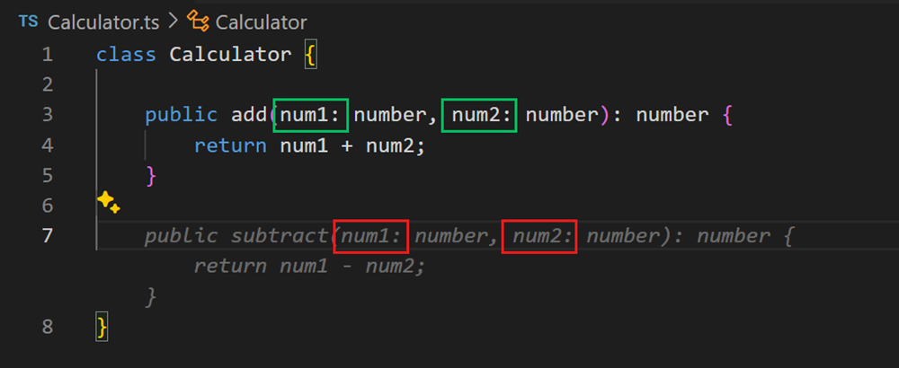
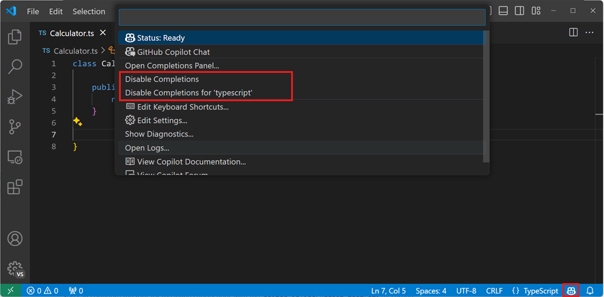

# VS Code에서 GitHub Copilot을 통한 코드 완성 {#code-completions-with-github-copilot-in-vs-code}

GitHub Copilot은 AI 기반 프로그래밍 도우미로 작동하여 코드, 주석, 테스트 등을 완성하기 위한 제안을 자동으로 제공합니다. 코드를 작성하는 동안 에디터에서 직접 이러한 제안을 제공하며, 다양한 프로그래밍 언어와 프레임워크에서 작동할 수 있습니다.

## 시작하기 {#getting-started}

1. GitHub Copilot 확장 프로그램들을 설치하세요.

   > <button><a class="install-extension-btn" href="vscode:extension/GitHub.copilot?referrer=docs-copilot-ai-powered-suggestions">GitHub Copilot 확장 프로그램 설치하기</a></button>

1. GitHub 계정으로 로그인하여 Copilot을 사용하세요.

   > :::tip
   > 아직 Copilot 구독이 없다면, [Copilot 무료 요금제](https://github.com/github-copilot/signup)에 가입하여 매월 제한된 자동 완성 및 채팅 상호작용을 무료로 이용할 수 있습니다.
   > :::

1. [Copilot 빠른 시작](/docs/copilot/getting-started.md)으로 VS Code에서 Copilot의 주요 기능을 알아보세요.

## 인라인 제안 {#inline-suggestions}

Copilot은 타이핑하는 동안 코드 제안을 제공합니다. 때로는 현재 줄의 완성, 때로는 전체 새로운 코드 블록을 제안합니다. 제안의 전체 또는 일부를 수락하거나, 계속 타이핑하면서 제안을 무시할 수 있습니다.

다음 예시에서 Copilot이 흐린 *고스트 텍스트*를 사용하여 `calculateDaysBetweenDates` JavaScript 함수의 구현을 제안하는 것을 확인하세요:

인라인 제안이 표시되면 `Tab` 키로 이를 수락할 수 있습니다.

Copilot은 코드 제안에 이미 코드에 있는 것과 동일한 코딩 스타일을 적용하려고 합니다. 다음 예시에서 Copilot이 제안된 `subtract` 메서드에 `add` 메서드와 동일한 입력 매개변수 명명 체계를 적용하는 것을 확인하세요.

### 제안 부분 수락 {#partially-accepting-suggestions}

GitHub Copilot의 전체 제안을 수락하지 않을 수 있습니다. `Ctrl+Right` 키보드 단축키를 사용하여 제안의 다음 단어나 다음 줄을 수락할 수 있습니다.

### 대체 제안 {#alternative-suggestions}

주어진 입력에 대해 Copilot은 여러 가지 대체 제안을 제공할 수 있습니다. 제안 위에 마우스를 올려 다른 제안들을 볼 수 있습니다.

### 코드 주석에서 제안 생성 {#generate-suggestions-from-code-comments}

Copilot이 제안을 제공하는 것에 의존하지 않고, 코드 주석을 사용하여 예상하는 코드에 대한 힌트를 제공할 수 있습니다. 예를 들어, "재귀" 또는 "싱글턴 패턴" 과 같이 사용할 알고리즘이나 개념을 지정하거나, 클래스에 추가할 메서드와 속성을 지정할 수 있습니다.

다음 예시는 메서드와 속성에 대한 정보를 제공하여 Copilot에게 TypeScript로 학생을 나타내는 클래스를 만들도록 지시하는 방법을 보여줍니다:

## 인라인 제안 활성화 또는 비활성화 {#enable-or-disable-inline-suggestions}

모든 언어에 대해 또는 특정 언어에 대해서만 일시적으로 코드 완성을 활성화하거나 비활성화할 수 있습니다.

1. VS Code 상태 표시줄의 GitHub Copilot 상태 아이콘은 GitHub Copilot이 활성화되었는지 비활성화되었는지를 나타냅니다.

   

1. Copilot 완성을 활성화하거나 비활성화하려면 먼저 상태 표시줄의 GitHub Copilot 아이콘을 선택하세요.

1. GitHub Copilot을 비활성화하는 경우, 전역적으로 비활성화할지 또는 현재 편집 중인 파일의 언어에 대해서만 비활성화할지 선택하라는 메시지가 표시됩니다.

   - GitHub Copilot의 제안을 전역적으로 비활성화하려면 **전역적으로 비활성화**를 선택하세요.
   - GitHub Copilot의 제안을 지정된 언어에 대해 비활성화하려면 **\<language\>에 대해 비활성화**를 선택하세요.

   

## 팁과 요령 {#tips-and-tricks}

### 컨텍스트 {#context}

관련성 있는 인라인 제안을 제공하기 위해, Copilot은 에디터에서 현재 열려 있는 파일들을 살펴보고 컨텍스트를 분석하여 적절한 제안을 생성합니다. Copilot을 사용하는 동안 VS Code에서 관련 파일들을 열어두면 이 컨텍스트를 설정하는 데 도움이 되며 Copilot이 프로젝트의 더 큰 그림을 볼 수 있게 합니다.

### 설정 {#settings}

- `editor.inlineSuggest.enabled` - 인라인 완성 활성화 또는 비활성화.

- `editor.inlineSuggest.fontFamily` - 인라인 완성의 글꼴 구성.

- `editor.inlineSuggest.showToolbar` - 인라인 완성을 위해 나타나는 도구 모음 활성화 또는 비활성화.

- `editor.inlineSuggest.syntaxHighlightingEnabled` - 인라인 완성의 구문 강조 활성화 또는 비활성화.

## 다음 단계 {#next-steps}

- VS Code에서 Copilot을 설정하고 직접 체험하기 위한 소개 [Copilot 튜토리얼](/docs/copilot/getting-started-chat.md)로 시작하세요.

- [Copilot Chat](/docs/copilot/copilot-chat.md)으로 AI 채팅 대화를 사용하는 방법을 알아보세요.

## 추가 리소스 {#additional-resources}

[GitHub Copilot 문서](https://docs.github.com/copilot/getting-started-with-github-copilot?tool=vscode)에서 [Copilot](https://github.com/features/copilot)과 VS Code에서의 사용 방법에 대해 자세히 알아볼 수 있습니다.

또는 YouTube의 [VS Code Copilot 시리즈](https://www.youtube.com/playlist?list=PLj6YeMhvp2S5_hvBl2SE-7YCHYlLQ0bPt)를 확인하세요. 여기서 [Python](https://www.youtube.com/watch?v=DSHfHT5qnGc), [C#](https://www.youtube.com/watch?v=VsUQlSyQn1E), [Java](https://www.youtube.com/watch?v=zhCB95cE0HY), [PowerShell](https://www.youtube.com/watch?v=EwtRzAFiXEM), [C++](https://www.youtube.com/watch?v=ZfT2CXY5-Dc) 등과 함께 Copilot을 사용하는 것에 대한 더 많은 소개 컨텐츠와 프로그래밍별 비디오를 찾을 수 있습니다.
