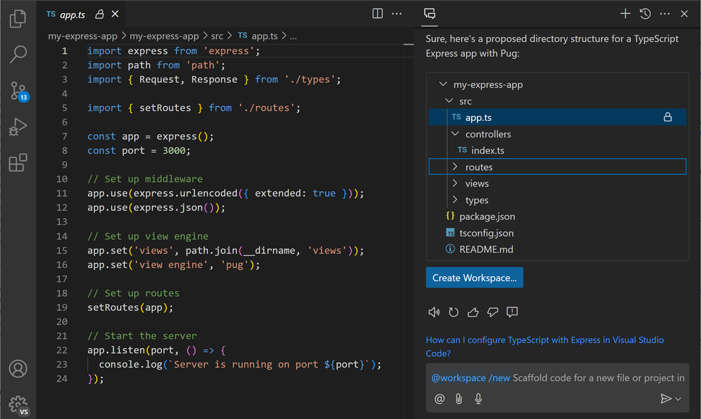
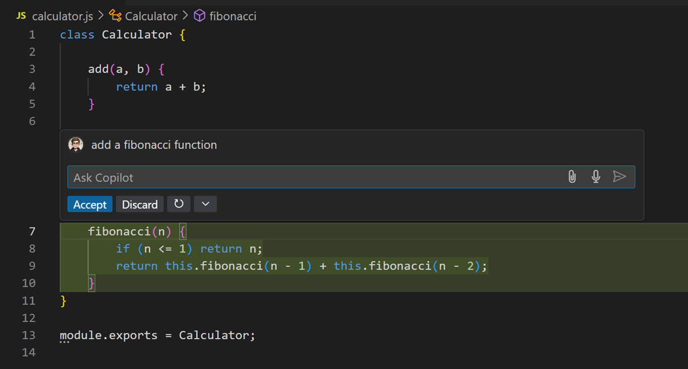
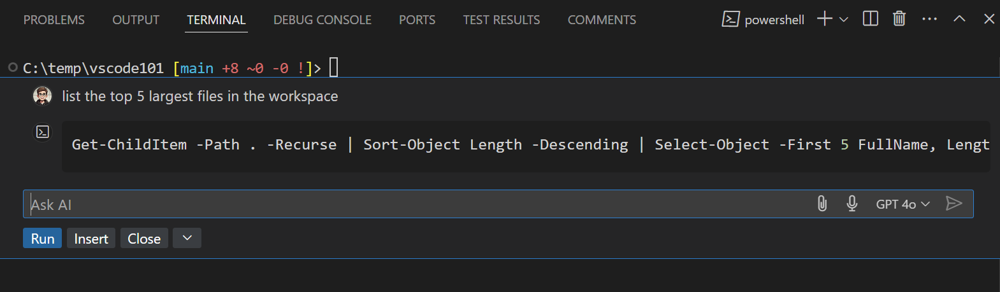

# VS Code에서 Copilot 채팅 사용하기 {#using-copilot-chat-in-vs-code}

Visual Studio Code의 [GitHub Copilot 채팅](https://marketplace.visualstudio.com/items?itemName=GitHub.copilot-chat) 확장 프로그램을 통해 AI 기반 채팅으로 코드를 생성하고, 코드 이해도를 높이며, 에디터를 구성할 수 있습니다. 문서나 온라인 포럼에서 답을 찾는 대신, VS Code에서 직접 Copilot 채팅에 질문하고 코딩하는 동안 코드 제안을 받을 수 있습니다.

Copilot 채팅은 개발 과정에 통합되어 필요한 곳에서 도움을 제공합니다:

- [**인라인 채팅**](#inline-chat): 에디터에서 직접 채팅 대화를 시작하고 코딩하는 동안 인라인 제안을 받습니다
- [**채팅 화면**](#chat-view): 질문에 답하고 코드 제안을 제공하는 AI 어시스턴트를 옆에 둡니다
- [**빠른 채팅**](#quick-chat): 빠른 질문을 하고 하던 일로 돌아갑니다

프로젝트의 여러 파일을 수정하려는 경우 [Copilot 편집](/docs/copilot/copilot-edits.md)을 사용하는 것이 좋습니다. [기존 채팅 대화를 Copilot 편집으로 쉽게 이동](/docs/copilot/copilot-edits.md#send-a-chat-request-to-copilot-edits)할 수 있습니다.

:::tip
Copilot 구독이 아직 없다면 [Copilot Free 플랜](https://github.com/github-copilot/signup)에 가입하여 무료로 Copilot을 사용할 수 있으며, 매월 제한된 수의 완성 및 채팅 상호작용을 제공받을 수 있습니다.
:::

## Copilot 채팅 사용 사례 {#copilot-chat-use-cases}

Copilot 채팅을 다음과 같은 다양한 개발 시나리오에서 사용할 수 있습니다:

- 코딩 및 기술 주제에 대한 질문 답변하기 (_"What is a linked list?"_, _"top 10 popular web frameworks"_)
- 문제를 가장 잘 해결하는 방법에 대한 코딩 질문 답변하기 (_"How to add auth to my project?"_)
- 다른 사람의 코드를 설명하고 개선 사항 제안하기 (_"@workspace /explain"_, _"What does this code do?"_)
- 코드 수정 제안하기 (_"@workspace /fix"_, _"This method gives a FileNotFoundException"_)
- 단위 테스트 케이스 생성하기 (_"@workspace /tests"_)
- 코드 문서 생성하기 (_"/doc"_)

## 전제 조건 {#prerequisites}

1. GitHub Copilot 확장 프로그램을 설치하세요.

   > <button><a class="install-extension-btn" href="vscode:extension/GitHub.copilot?referrer=docs-copilot-copilot-chat">GitHub Copilot 확장 프로그램 설치하기</a></button>

2. GitHub 계정으로 로그인하여 Copilot을 사용하세요.

   :::tip
   Copilot 구독이 아직 없다면 [Copilot Free 플랜](https://github.com/github-copilot/signup)에 가입하여 무료로 Copilot을 사용할 수 있으며, 매월 제한된 수의 완성 및 채팅 상호작용을 제공받을 수 있습니다.
   :::

## Copilot 채팅 시작하기 {#getting-started-with-copilot-chat}

### 채팅 열기 {#open-chat}

VS Code 커맨드 센터의 Copilot 채팅 메뉴를 사용하여 다양한 채팅 경험을 시작할 수 있습니다.

또는 다음 키보드 단축키를 사용하여 Copilot과 채팅 대화를 시작할 수 있습니다.

| 단축키             | 설명                                                                                                                                                |
| ------------------ | --------------------------------------------------------------------------------------------------------------------------------------------------- |
| `Ctrl+Alt+I`       | **채팅 화면**를 열고 자연어를 사용하여 Copilot과 채팅 대화를 시작합니다.                                                                            |
| `Ctrl+Shift+Alt+L` | **빠른 채팅**을 열고 Copilot에게 빠른 질문을 합니다.                                                                                                |
| `Ctrl+I`           | **인라인 채팅**을 시작하여 에디터에서 직접 Copilot에게 채팅 요청을 보냅니다. 자연어를 사용하거나 `/` 명령어를 사용하여 Copilot에게 지시를 내립니다. |

### 채팅 컨텍스트 {#chat-context}

Copilot은 자연어 채팅 프롬프트를 기반으로 질문의 의도와 범위를 파악하려고 합니다. Copilot이 가장 좋고 관련성 있는 답변을 제공할 수 있도록 채팅 프롬프트에 컨텍스트를 추가하세요. 예를 들어, 특정 파일이나 전체 작업 공간의 내용, 현재 에디터 선택 영역 등을 첨부할 수 있습니다.

VS Code는 채팅 화면에서 현재 활성화된 에디터를 자동으로 채팅 프롬프트의 컨텍스트로 추가합니다. 에디터에서 코드 블록을 선택한 경우 선택한 부분만 컨텍스트로 추가됩니다. 컨텍스트 항목의 비활성화 아이콘을 선택하여 활성 에디터 추가를 비활성화할 수 있습니다.

채팅 프롬프트에 컨텍스트를 추가하는 여러 가지 방법이 있습니다:

- 모든 채팅 경험에서 <i class="codicon codicon-attach"></i> 버튼(`Ctrl+/`)을 사용하세요.

  그런 다음 현재 선택 영역, 작업 공간의 하나 이상의 파일, 또는 소스 코드의 하나 이상의 심볼과 같은 특정 유형의 컨텍스트를 빠른 선택에서 선택할 수 있습니다.

  

  :::tip
  첨부 빠른 선택에서 여러 항목을 빠르게 추가하려면 `Up` 및 `Down` 키를 사용하여 목록을 탐색하고, `Right` 키를 사용하여 항목을 컨텍스트로 추가한 다음 다른 항목에 대해 이 과정을 반복하세요.
  :::

- 에디터 탭이나 화면, 검색 화면 또는 에디터 이동 경로의 파일 또는 폴더를 채팅 화면로 드래그 앤 드롭하세요.

  <video title="파일과 에디터를 채팅으로 드래그하기" autoplay loop controls muted style={{ maxWidth: '100%' }}>
  <source src="https://code.visualstudio.com/assets/docs/copilot/copilot-chat/copilot-attach-dnd.mp4" type="video/mp4" />
  </video>

- `#` 문자를 입력하여 사용 가능한 채팅 변수 목록을 확인하세요.

  예를 들어 `#selection`을 사용하여 현재 에디터 선택 영역을 채팅 프롬프트에 추가하거나, `#file`을 사용하여 작업 공간의 특정 파일을 추가하거나, `#sym`을 사용하여 작업 공간의 심볼을 추가할 수 있습니다.

  

  :::tip
  `#`을 입력하고 파일이나 심볼 제안을 위한 IntelliSense 트리거로 사용하세요.
  :::

- 탐색기나 검색 뷰의 파일에서 컨텍스트 메뉴 **Copilot** > **Add File to Chat** (또는 텍스트 선택의 경우 **Add Selection to Chat**)를 사용하세요.

:::note
가능한 경우 파일을 첨부할 때 파일의 전체 내용이 포함됩니다. 컨텍스트 창에 맞지 않을 만큼 크다면, 구현 없이 함수와 설명이 포함된 파일의 개요가 포함됩니다. 개요도 너무 큰 경우 파일은 프롬프트의 일부가 되지 않습니다.
:::

## AI 모델 변경하기 {#changing-your-ai-model}

채팅 입력 필드의 모델 선택기를 사용하여 응답 생성에 사용되는 언어 모델을 변경할 수 있습니다. 모델 선택기를 선택하고 사용 가능한 언어 모델 중 하나를 선택하세요.

다양한 채팅 경험에서 모델 선택기를 사용할 수 있습니다.

## 인라인 채팅 {#inline-chat}

인라인 채팅을 사용하면 작업 컨텍스트를 떠나지 않고 에디터에서 직접 Copilot과 채팅 대화를 할 수 있습니다. 인라인 채팅을 사용하면 코드 내에서 직접 코드 제안을 미리 볼 수 있어 코드 변경을 빠르게 반복하는 데 유용할 수 있습니다.

아무 파일에서나 키보드의 `Ctrl+I`를 눌러 Copilot 인라인 채팅을 불러와 시작하세요. 또는 파일을 열고 Copilot 채팅 커맨드 센터 메뉴에서 **Editor Inline Chat**을 선택하세요.

질문에 따라 Copilot은 현재 작업 중인 파일에 대한 코드 수정이나 리팩토링을 제안합니다. Copilot은 업데이트 미리보기를 제공하며, 이를 수락(`Ctrl+Enter`)하거나 취소(`Escape`)할 수 있습니다. 선택적으로 새로운 코드 제안을 생성할 수 있습니다.

에디터에서 코드 블록을 선택한 경우 Copilot은 선택 영역에 대해 질문의 범위를 지정합니다.

또한 "이 코드를 설명해주세요" 또는 "X 기능을 추가하려면 어떻게 해야 하나요?"와 같이 코드를 작성하고 반복하면서 생기는 탐색적인 질문을 Copilot에게 할 수 있습니다.

`inlineChat.mode` 설정을 사용하여 인라인 채팅이 에디터에서 업데이트를 표시하는 방식을 구성할 수 있습니다. 기본 설정값은 `live`이며, 이는 업데이트가 에디터에 직접 적용됨을 의미합니다. 대신 변경 사항을 나란히 미리보기하려면 설정을 `preview`로 구성할 수 있습니다.

다음 예시는 인라인 채팅의 `preview` 모드를 보여줍니다.

## 채팅 화면 {#chat-view}

### 채팅 화면 열기 {#open-the-chat-view}

채팅 화면를 사용하면 별도의 화면에서 Copilot과 채팅 대화를 할 수 있습니다. 기본적으로 채팅 화면은 **Secondary Side Bar**에 위치합니다. 보조 사이드바는 항상 기본 사이드바의 반대쪽에 위치하므로, 탐색기, 소스 제어 또는 기본 사이드바의 다른 화면과 동시에 채팅 화면를 열어둘 수 있습니다.

`Ctrl+Alt+I`을 누르거나 Copilot 채팅 커맨드 센터 메뉴에서 **Open Chat**을 선택하여 채팅 화면에 접근할 수 있습니다.

또한 VS Code 제목 표시줄의 레이아웃 컨트롤을 사용하여 채팅 화면가 포함된 보조 사이드바를 토글할 수 있습니다.

:::tip
언제든지 채팅 화면를 다른 위치로 드래그하거나 에디터로 열 수 있습니다. [VS Code의 사용자 정의 레이아웃](/docs/editor/custom-layout.md)에 대해 자세히 알아보세요.
:::

### 채팅 프롬프트 입력하기 {#enter-a-chat-prompt}

시작하려면 채팅 입력 필드에 질문을 입력하세요. 예를 들어, 일반적인 프로그래밍 주제에 대해 질문하거나 작업 공간의 특정 코드에 대해 질문할 수 있습니다. Copilot이 더 관련성 있는 답변을 제공할 수 있도록 채팅 프롬프트에 [관련 컨텍스트를 첨부](#chat-context)하세요.

:::tip
채팅 입력 상자에 `/help`를 입력하여 GitHub Copilot과 Copilot 채팅 상호작용 방법에 대한 도움말을 받으세요.
:::

Copilot 채팅은 다음을 포함하는 풍부하고 상호작용적인 결과를 제공할 수 있습니다: 간단한 텍스트, 이미지, VS Code 명령을 호출하는 버튼, URI나 에디터 위치에 대한 참조, 또는 파일 트리(예: 채팅 참여자가 새 작업 공간을 만들 것을 제안할 때 작업 공간 미리보기를 보여주기 위해).

다음 예시(_"@workspace /new Express with TypeScript and pug"_)는 Express 앱을 만들기 위한 채팅 프롬프트를 보여주며, 제안된 작업 공간 구조가 있는 트리 뷰와 새 작업 공간을 만들기 위한 버튼을 반환합니다.

대화를 계속하면서 Copilot은 [채팅 메시지와 응답의 기록](#conversation-history)을 유지하고, 응답에서 관련된 후속 질문이나 명령어도 제공합니다.

### 코드 블록 {#code-blocks}

질문에 따라 Copilot 채팅은 코드 블록에 소스 코드를 반환할 수 있습니다. 언어 확장에 따라 채팅 응답의 코드 블록이 IntelliSense를 지원할 수 있으며, 이를 통해 마우스를 올려 메서드와 심볼에 대한 정보를 얻거나 정의로 이동할 수 있습니다.

코드 블록 위에 마우스를 올리면 **Apply in Editor**, **Insert at Cursor**, **Copy** 옵션이 표시됩니다.

**More Actions**(`...`) 버튼은 **Insert Into New File**과 **Insert into Terminal**(`Ctrl+Alt+Enter`) 옵션을 제공합니다.

Copilot 채팅이 코드 블록에 셸 명령이 포함되어 있음을 감지하면 **Insert into Terminal**(`Ctrl+Alt+Enter`)을 사용하여 통합 터미널에서 직접 실행할 수 있습니다. 이 옵션은 활성 터미널을 생성하거나 열고 실행할 준비가 된 명령 텍스트를 삽입합니다.

:::tip
**Chat: Next Code Block**(`Ctrl+Alt+PageDown`)과 **Chat Previous Code Block**(`Ctrl+Alt+PageUp`)을 사용하여 코드 블록 사이를 탐색할 수 있습니다.
:::

다음 설정을 사용하여 채팅의 코드 블록 글꼴을 제어할 수 있습니다:

- `chat.editor.fontFamily`
- `chat.editor.fontSize`
- `chat.editor.fontWeight`
- `chat.editor.lineHeight`

### 채팅 기록 {#chat-history}

Copilot 채팅은 이전 채팅 대화의 기록을 유지하며, 채팅 화면의 **Show Chats...** 버튼이나 명령 팔레트의 **Chat: Show Chats...** 명령을 사용하여 액세스할 수 있습니다.

빠른 선택에는 가장 최근 순으로 정렬된 이전 채팅 목록이 표시됩니다. 채팅을 선택하여 채팅 화면에서 열 수 있습니다.

## 빠른 채팅 {#quick-chat}

Copilot에게 빠른 질문을 하고 싶지만 전체 채팅 화면 세션을 시작하거나 에디터에서 인라인 채팅을 열고 싶지 않은 경우 빠른 채팅 드롭다운을 사용할 수 있습니다.

키보드에서 `Ctrl+Shift+Alt+L`를 눌러 빠른 채팅을 불러오세요. 또는 Copilot 채팅 커맨드 센터 메뉴에서 **Quick Chat**을 선택하세요.

질문을 입력하고, [채팅 참여자](#chat-participants)와 [슬래시 명령어](#slash-commands)로 질문의 범위를 지정할 수 있으며, 드롭다운 오른쪽 상단의 **Open in Chat View** 버튼을 사용하여 토론을 전체 채팅 화면 세션으로 확장할 수 있습니다.

## 연속(multi-turn) 대화 {#multi-turn-conversations}

Copilot 채팅에서 질문을 할 때 첫 번째 응답에만 머물 필요는 없습니다. 채팅 대화를 열어두고 계속해서 제안된 솔루션을 반복하고 개선하도록 Copilot에 프롬프트를 주세요. Copilot은 생성된 코드와 현재 대화 기록의 컨텍스트를 모두 가지고 있습니다. 추가 질문을 계속하면 Copilot은 귀하의 요구사항에 따라 응답을 더욱 개선합니다.

다음은 피보나치 수를 계산하는 함수를 만들기 위해 인라인 채팅을 사용하는 예시입니다:

재귀를 사용하지 않는 솔루션을 선호하는 경우, 채팅 프롬프트를 업데이트하고 Copilot에 제출하여 다른 응답을 받을 수 있습니다.

[Copilot 채팅 대화를 반복](/docs/copilot/prompt-crafting.md#iterate-on-your-solution)하는 방법에 대해 자세히 알아보세요.

## 터미널 인라인 채팅 {#terminal-inline-chat}

에디터의 인라인 채팅과 유사하게 터미널에서 Copilot 인라인 채팅을 불러와 터미널과 셸 명령어에 관련된 질문에 대한 답변을 받을 수 있습니다. 터미널 인라인 채팅은 통합 터미널의 셸과 그 내용에 대한 컨텍스트를 가진 `@terminal` 채팅 참여자를 사용합니다. 예를 들어 "npm 패키지를 어떻게 설치하나요?" 또는 "src 디렉토리에서 가장 큰 파일 5개를 나열하세요"와 같은 질문을 할 수 있습니다.

터미널에서 인라인 채팅을 시작하려면 `Ctrl+I` 키보드 단축키를 누르세요.

명령어가 제안되면 **Run**(`Ctrl+Enter`)을 사용하여 터미널에서 명령어를 실행하거나 **Insert**(`Alt+Enter`)을 사용하여 터미널에 명령어를 삽입할 수 있습니다.

선택적으로 Windows & Linux에서는 `Ctrl+down`, `Tab`, `Tab`을, macOS에서는 `Cmd+down`, `Tab`, `Tab`을 눌러 커서를 응답에 놓거나 직접 응답에서 명령어를 실행하기 전에 편집할 수 있습니다.

## 스마트 작업 {#smart-actions}

Copilot 채팅을 사용하면 자연어로 Copilot의 도움을 받을 수 있습니다. 여러 일반적인 시나리오에서는 프롬프트를 작성하지 않고도 *스마트 작업*을 사용하여 Copilot의 도움을 받을 수 있습니다. 커밋 메시지 생성, 문서 생성, 코드 수정, 코드 설명, 코드 변경 검토와 같은 작업에 대한 스마트 작업의 예시가 있습니다.

이러한 스마트 작업은 VS Code UI 전체에서 사용할 수 있습니다. 예를 들어 에디터 컨텍스트 메뉴나 빠른 수정 작업을 통해 Copilot 스마트 작업에 액세스할 수 있습니다.

에디터에서는 코드 블록을 선택하고 마우스 오른쪽 버튼을 클릭한 다음 **Copilot**을 선택하여 스마트 작업에 액세스할 수 있습니다.

가장 강력한 스마트 작업은 **Fix** 작업입니다. 여기 "Argument of type 'string' is not assignable to parameter of type 'number'"라는 오류가 있는 비교적 간단한 TypeScript 계산기가 있습니다. _sparkle_ 아이콘을 선택한 다음 **Fix**를 선택하세요.

`/fix`와 유사하게 `/doc` 스마트 작업도 인기 있는 작업입니다. `/doc`를 사용하려면 코드 블록을 선택하고 마우스 오른쪽 버튼을 클릭한 다음 **Copilot** > **Generate Docs**를 선택하세요. Copilot이 코드에 대한 문서 주석을 생성합니다.

채팅에서 해당하는 [슬래시 명령어](#slash-commands)를 사용하여 이러한 스마트 작업 중 일부를 호출할 수도 있습니다. 예를 들어 `/fix`를 사용하여 선택한 코드의 문제를 수정하거나, `/doc`를 사용하여 선택한 코드에 대한 문서를 생성할 수 있습니다.

## 채팅 참여자 {#chat-participants}

*채팅 참여자*는 자신의 전문 분야에서 도움을 줄 수 있는 전문가와 같습니다. 채팅 입력 필드에 '@'를 입력한 다음 참여자 이름을 입력하여 채팅 참여자를 호출할 수 있습니다. 여러 내장 참여자가 있습니다:

- `@workspace`는 작업 공간의 코드에 대한 컨텍스트를 가지고 있으며 관련 파일이나 클래스를 찾는 등의 탐색을 도울 수 있습니다.
- `@vscode`는 VS Code 에디터 자체의 명령어와 기능에 대해 알고 있으며 이를 사용하는 데 도움을 줄 수 있습니다.
- `@terminal`은 통합 터미널 셸과 그 내용에 대한 컨텍스트를 가지고 있습니다.
- `@github`는 GitHub 저장소, 이슈, 풀 리퀘스트, 토픽에 대해 알고 있으며 Bing API를 사용하여 웹 검색도 수행할 수 있습니다.

확장 프로그램도 자신의 도메인에 대한 전문적인 도움을 제공하기 위해 채팅 참여자를 제공할 수 있습니다. 사용 가능한 채팅 참여자 목록을 찾으려면 채팅 입력 필드에 `@`를 입력하세요.

다음은 VS Code의 채팅 화면에 채팅 참여자를 제공하는 Visual Studio Marketplace의 일부 확장 프로그램 예시입니다. [Marketplace](https://marketplace.visualstudio.com/search?term=tag%3Achat-participant&target=VSCode&category=All%20categories&sortBy=Relevance)로 이동하거나 통합된 [확장 프로그램 뷰](/docs/editor/extension-marketplace.md)를 사용하고 `chat-participant` 태그를 사용하여 더 많은 확장 프로그램을 검색하세요.

### @workspace {#workspace}

`@workspace` 채팅 참여자는 작업 공간의 코드에 대한 컨텍스트를 수집하는 방법을 알고 있으며, 관련 클래스, 파일 등을 찾는 데 도움을 줄 수 있습니다.

모든 필요한 컨텍스트를 가지고 있기 때문에 `@workspace`는 개발자들이 더 자주 물을 수 있는 종류의 질문에 답할 수 있습니다. 예를 들어, 코드의 다른 부분들이 어떻게 상호작용하는지에 대한 질문:

- "`@workspace` 알림은 어떻게 예약되나요?"

또는 관련 코드, 종속성 및 디자인 패턴에 대한 지식이 필요한 질문:

- "`@workspace` 뉴스레터 페이지와 비슷하게 폼 유효성 검사를 추가해주세요"

### @vscode {#vscode}

VS Code는 많은 방식으로 사용자 정의할 수 있어서 사람들은 숨겨진 기능을 발견했을 때 기분 좋게 놀라곤 합니다. VS Code의 모든 기능을 활용하는 데 도움을 주기 위해 `@vscode`를 만들었습니다.

이 채팅 참여자는 VS Code에 대해 모두 알고 있으며 자연어와 VS Code 명령 및 사용자 정의 사이의 간격을 메우는 데 도움을 줄 수 있습니다. `@vscode`는 내부적으로 모든 설정과 명령의 인덱스에 액세스할 수 있는 도구를 사용하며, 이 채팅 참여자가 VS Code 문서도 사용할 수 있도록 도구를 추가하는 중입니다. 이제 다음과 같은 모호한 질문을 할 수 있습니다:

- "`@vscode` vscode가 파일을 가짜로 여는 그 기능의 이름이 뭐죠? 그리고 이걸 어떻게 비활성화하나요?"
- "`@vscode` VS Code 색상을 어떻게 변경하나요?"

`/runCommand` [슬래시 명령어](#slash-commands)를 사용하여 `@vscode`에게 에디터에서 명령을 실행하도록 요청할 수 있습니다. 예를 들어, `@vscode /runCommand show minimap`을 요청하여 에디터에서 미니맵을 표시할 수 있습니다.

### @terminal {#terminal}

`@terminal`을 사용하여 통합 터미널 셸, 버퍼 및 현재 선택 영역에 대해 질문할 수 있습니다. 다음 예시에서는 터미널에서 **Explain using Copilot** 빠른 수정을 사용하여 실패한 셸 명령어에 대한 정보를 얻습니다.

채팅 화면에서 프롬프트가 `@terminal #terminalLastCommand`로 채워져 오류를 수정하는 데 도움이 되는 것을 확인하세요. `#terminalLastCommand`는 채팅 변수로, 채팅 프롬프트에 더 많은 컨텍스트를 추가할 수 있습니다. [채팅에 컨텍스트 추가하기](#chat-context)에 대해 자세히 알아보세요.

:::note
터미널은 작업 공간 컨텍스트를 자동으로 가져오지 않으므로 작업 공간에 대한 질문에는 시간이 걸릴 수 있습니다.
:::

### @github {#github}

`@github`를 사용하여 GitHub 저장소와 커밋, 이슈, 풀 리퀘스트 등에 대해 질문할 수 있습니다. 다음은 `@github` 참여자를 사용하는 방법의 예시입니다:

- `@github 나에게 할당된 열린 PR이 모두 무엇인가요?`
- `@github 나에게 할당된 최신 이슈는 무엇인가요?`
- `@github 최신 릴리스는 언제였나요?`

GitHub 문서에서 사용 가능한 [GitHub 스킬](https://docs.github.com/en/copilot/using-github-copilot/asking-github-copilot-questions-in-your-ide#currently-available-skills)에 대해 더 자세히 알아보세요.

### 확장 프로그램이 제공하는 채팅 참여자 {#extension-contributed-chat-participants}

[Visual Studio Code Marketplace](https://marketplace.visualstudio.com/VSCode) 또는 [GitHub Marketplace](https://github.com/marketplace)에서 추가 채팅 참여자를 설치할 수 있습니다.

VS Code 확장을 통해 제공되는 채팅 참여자는 VS Code 확장 API 표면에 완전히 액세스할 수 있는 _클라이언트 사이드_ 확장입니다.

GitHub 앱을 통해 제공되는 채팅 참여자는 로컬 머신에서 실행되지 않으며 로컬 에디터 컨텍스트에 대한 액세스를 명시적으로 요청해야 합니다. 채팅 참여자를 제공하는 GitHub 앱을 설치한 후 VS Code에서 처음으로 참여자를 `@-mention`하면 로컬 에디터 컨텍스트에 대한 액세스 권한을 부여하라는 메시지가 표시됩니다.

:::note
개인정보 보호를 위해, GitHub 앱의 채팅 참여자와 에디터 컨텍스트를 공유하는 기본 설정은 'Allow for All Workspaces'을 선택하지 않는 한 작업 공간별로 저장됩니다.
:::

## 슬래시 명령어 {#slash-commands}

채팅 참여자는 *슬래시 명령어*를 통해 특정 기능에 대한 바로가기를 제공할 수 있습니다. 이러한 명령어는 채팅 참여자와 상호작용하고 지시를 제공하는 간결하고 구조화된 방법을 제공합니다. 참여자 뒤에 `/`와 명령어 이름을 입력하여 채팅 프롬프트에서 슬래시 명령어를 참조할 수 있습니다.

예를 들어, `@workspace` 참여자는 새 작업 공간이나 새 파일을 만들기 위한 `/new` 슬래시 명령어를 가지고 있습니다. 채팅 입력 필드에 `@workspace /new Node.js Express Pug TypeScript`를 입력하면 Node.js Express Pug TypeScript 프로젝트로 새 작업 공간이 생성됩니다.

내장된 슬래시 명령어의 일부 예시는 다음과 같습니다:

- `/clear`: 새 채팅 세션 시작
- `/help`: GitHub Copilot 사용에 대한 도움말 보기
- `@workspace /explain` (또는 `/explain`): 선택한 코드가 어떻게 작동하는지 설명
- `@workspace /fix` (또는 `/fix`): 선택한 코드의 문제에 대한 수정 제안
- `@workspace /new` (또는 `/new`): 새 작업 공간이나 새 파일에 대한 코드 스캐폴딩
- `@vscode /runCommand`: VS Code 명령 검색 또는 실행

내장 참여자와 그들의 명령어 목록을 보려면 채팅 입력 필드에 `@`를 입력하거나 <i class="codicon codicon-mention"></i> 아이콘을 선택하세요.

## 대화 기록 {#conversation-history}

Copilot은 채팅 화면에서의 대화 기록을 추적합니다. Copilot은 이 정보를 후속 프롬프트의 컨텍스트로 사용할 수 있습니다. 예를 들어 [연속 대화](#multi-turn-conversations)를 할 때 사용됩니다.

예를 들어, 처음에 "TypeScript에서 number 데이터 타입이 무엇인가요?"라고 물은 다음 "소수도 사용할 수 있나요?"라고 물으면, Copilot은 여전히 `number` 데이터 타입을 참조하고 있다는 것을 알고 있습니다.

대화 기록에서 프롬프트와 해당 응답을 삭제하려면 프롬프트 위에 마우스를 올리고 **x** 컨트롤을 선택하세요. 더 관련성 있는 응답을 얻기 위해 하나 이상의 프롬프트를 삭제하는 것이 유용할 수 있습니다.

명령 팔레트에서 **Chat: Export Chat...** 명령을 사용하여 채팅 세션의 모든 프롬프트와 응답을 JSON 파일로 내보낼 수 있습니다.

## 음성 상호작용 사용하기 {#use-voice-interactions}

[VS Code Speech](https://marketplace.visualstudio.com/items?itemName=ms-vscode.vscode-speech) 확장 프로그램이 제공하는 VS Code의 음성 제어 기능을 사용하여 음성으로 채팅 대화를 시작할 수 있습니다:

- 음성으로 채팅 프롬프트를 받아쓰기
- "Hey Code" 음성 명령을 사용하여 Copilot 채팅과 음성 세션 시작
- "말하기 위해 누르기" 모드를 사용하여 채팅을 위한 음성 입력 가속화

[VS Code에서 음성 상호작용 사용하기](/docs/editor/voice.md)에 대해 자세히 알아보세요.

## 개인정보 보호 및 투명성 {#privacy-and-transparency}

특히 소스 코드와 관련하여 AI의 책임 있는 사용을 강조합니다. 기본적으로 활성화된 `inlineChat.acceptedOrDiscardBeforeSave` 설정은 Copilot이 생성한 코드를 저장하기 전에 확인을 요청합니다.

이 설정이 활성화되어 있으면 파일 저장 작업은 보류 중인 인라인 채팅 세션을 수락하거나 취소할 때까지 기다립니다. 이는 자동 저장이 활성화되어 있을 때도 적용되며, 인라인 채팅이 종료될 때까지 일시적으로 비활성화됩니다.

비공개 저장소에 대한 더 많은 작업 공간 검색 기능을 활성화하려면 추가 권한이 필요합니다. 이러한 권한이 아직 없다는 것이 감지되면 시작 시 요청됩니다. 권한이 부여되면 향후 사용을 위해 세션을 안전하게 저장합니다.

[GitHub Copilot Trust Center](https://resources.github.com/copilot-trust-center/)에서 보안, 개인정보 보호 및 투명성에 대해 자세히 알아보세요.

## 자주 묻는 질문 {#frequently-asked-questions}

### Copilot 편집, 인라인 채팅, 채팅 화면, 빠른 채팅 중 어떤 것을 선택해야 하나요? {#how-do-i-choose-between-copilot-edits-inline-chat-chat-view-and-quick-chat}

다음 표는 각 인터페이스의 기능을 비교합니다.

| 기능                          | Copilot 편집 | 채팅 화면 | 인라인 채팅 | 빠른 채팅 |
| ----------------------------- | :----------: | :-------: | :---------: | :-------: |
| 코드 제안 받기                |      ✅      |    ✅     |     ✅      |    ✅     |
| 다중 파일 편집                |      ✅      |   ✅\*    |             |   ✅\*    |
| 에디터에서 코드 편집 미리보기 |      ✅      |           |     ✅      |           |
| 코드 리뷰 흐름                |      ✅      |           |             |           |
| 변경 사항 롤백                |      ✅      |           |             |           |
| 컨텍스트 첨부                 |      ✅      |    ✅     |     ✅      |    ✅     |
| 참여자 & 명령어 사용          |              |    ✅     |             |    ✅     |
| 셸 명령어 생성                |              |    ✅     |             |    ✅     |
| 일반 목적 채팅                |              |    ✅     |     ✅      |    ✅     |

\* _채팅 대화에 코드 블록이 포함되어 있으며 수동으로 올바른 파일에 적용해야 합니다_

## 추가 기능 {#additional-resources}

[GitHub Copilot](https://github.com/features/copilot)에 대해 더 자세히 알아보고 VS Code에서 사용하는 방법은 [GitHub Copilot 문서](https://docs.github.com/copilot/getting-started-with-github-copilot?tool=vscode)에서 확인할 수 있습니다.

또는 YouTube의 [VS Code Copilot Series](https://www.youtube.com/playlist?list=PLj6YeMhvp2S5_hvBl2SE-7YCHYlLQ0bPt)를 확인하세요. 여기서 더 많은 소개 콘텐츠와 [Python](https://www.youtube.com/watch?v=DSHfHT5qnGc), [C#](https://www.youtube.com/watch?v=VsUQlSyQn1E), [Java](https://www.youtube.com/watch?v=zhCB95cE0HY), [PowerShell](https://www.youtube.com/watch?v=EwtRzAFiXEM), [C++](https://www.youtube.com/watch?v=ZfT2CXY5-Dc) 등을 위한 프로그래밍 특화 동영상을 찾을 수 있습니다.

## 다음 단계 {#next-steps}

- 소개용 [Copilot 채팅 튜토리얼](/docs/copilot/getting-started-chat.md)로 시작하세요.

- [Copilot 편집](/docs/copilot/copilot-edits.md)로 여러 파일에 걸쳐 편집하세요.
