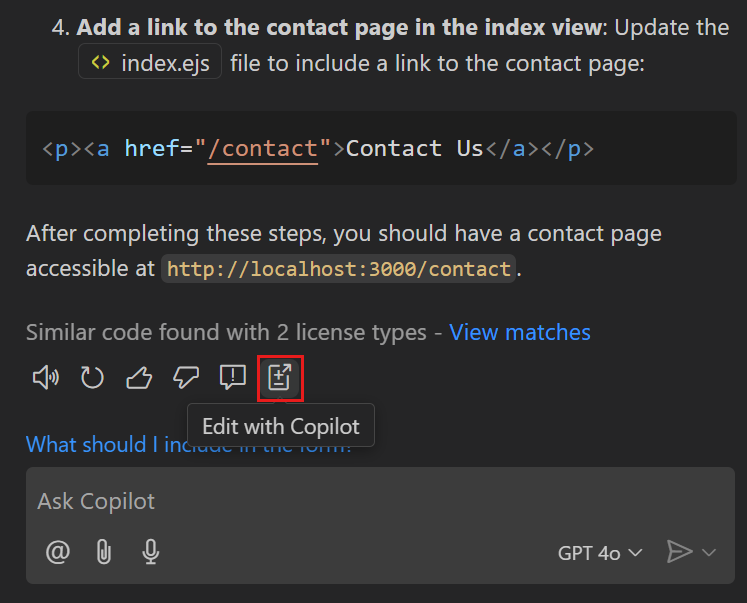
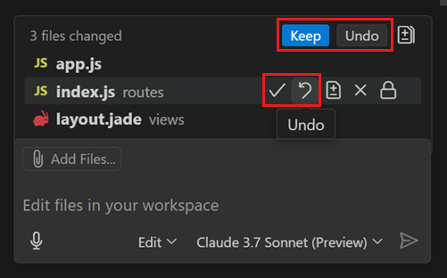

# Copilot 편집 (프리뷰) {#copilot-edits-preview}

Copilot 편집을 사용하면 자연어를 사용하여 코드 변경을 빠르게 반복할 수 있는 AI 기반 코드 편집 세션을 시작할 수 있습니다. 프롬프트를 기반으로 Copilot 편집은 작업 공간의 여러 파일에 걸쳐 코드 변경을 제안합니다. 이러한 편집은 편집기에 직접 적용되므로 주변 코드의 전체 맥락에서 빠르게 검토할 수 있습니다.

Copilot 편집은 여러 파일에 걸친 대규모 변경을 반복하는 데 탁월합니다. Copilot 채팅의 대화형 흐름과 인라인 채팅의 빠른 피드백을 하나의 경험으로 제공합니다. 측면에서 진행 중인 다중 턴 채팅 대화를 하면서 인라인 코드 제안의 이점을 누릴 수 있습니다.

:::tip
Copilot 구독이 아직 없다면 [Copilot 무료 플랜](https://github.com/github-copilot/signup)에 가입하여 Copilot을 무료로 사용하고 매월 제한된 수의 완성 및 채팅 상호작용을 이용할 수 있습니다.
:::

다음 비디오는 Copilot 편집을 사용하여 기본 Express 앱을 수정하고 새 페이지를 추가하고, 탐색 바를 구현하고, 테마 스위처를 포함하도록 디자인을 수정하는 방법을 보여줍니다.

<video title="Express 앱을 수정하기 위해 Copilot 편집 사용하기" autoplay loop controls muted style={{ maxWidth: '100%' }}>

<source src="https://code.visualstudio.com/assets/docs/copilot/copilot-edits/copilot-edits-hero.mp4" type="video/mp4" />
</video>

:::note
Copilot 편집 기능은 현재 프리뷰 상태입니다. [우리의 이슈](https://github.com/microsoft/vscode-copilot-release/issues)에서 피드백을 제공하고 문제를 보고할 수 있습니다.
:::

## Copilot 편집 시작하기 {#get-started-with-copilot-edits}

Copilot 편집 뷰를 사용하여 편집 세션을 시작합니다. 코드 변경은 종종 반복적인 프로세스이며 원하는 결과를 얻기 위해 여러 단계로 구성됩니다. 편집 세션은 코드 편집을 위해 Copilot 편집에 보내는 일련의 요청(또는 단계)으로 구성됩니다. 편집 세션은 원하는 만큼 오래 지속될 수 있으며, 코드를 원하는 상태로 만들기 위해 필요한 만큼 많은 요청을 보낼 수 있습니다.

Copilot 편집 뷰를 여는 여러 가지 방법이 있습니다:

- `Ctrl+Shift+I` 키보드 단축키 사용

- 명령 센터에서 Copilot 메뉴를 열고 **Open Copilot Edits** 선택

  

- 명령 팔레트(`Ctrl+Shift+P`)에서 **View: Toggle Copilot Edits** 또는 **Copilot Edits: Focus on Copilot Edits View** 명령 사용

- 채팅 화면에서 **Edit with Copilot**을 선택하여 이전 [채팅 대화를 Copilot](#send-a-chat-request-to-copilot-edits) 편집으로 이동

  

Copilot 편집 뷰를 처음 열거나 새 편집 세션을 시작할 때 환영 메시지가 표시됩니다.

## 작업 세트에 파일 추가 {#add-files-to-the-working-set}

편집 세션을 시작할 때 첫 번째 단계는 작업하려는 관련 파일을 추가하는 것입니다. 이러한 파일을 편집 세션의 _작업 세트(Working Set)_ 라고도 합니다. Copilot 편집은 새 파일을 만들도록 제안하는 경우를 제외하고 작업 세트 외부에서 변경을 수행하지 않습니다.

:::important
작업 세트는 현재 10개의 파일로 제한됩니다.
:::

Copilot 편집은 자동으로 활성된 편집 창을을 작업 세트에 추가합니다. 여러 [편집 창](/docs/getstarted/userinterface.md#editor-groups)이 열려 있는 경우, 각 그룹의 활성된 편집 창이 작업 세트에 추가됩니다. 모든 열린 편집 창을 추가하려면 **Add Files...**를 선택한 다음 파일 빠른 선택에서 **Open Editors**를 선택하세요.

작업 세트에 파일을 추가하는 여러 가지 옵션이 있습니다:

- **Add Files...** 를 선택하거나 <i class="codicon codicon-attach"></i> 아이콘(`Ctrl+/`)을 사용한 다음, 빠른 선택에서 파일을 선택합니다.

  :::tip
  빠른 선택에서 여러 항목을 빠르게 선택하려면 `Up` 및 `Down` 키를 사용하여 목록을 탐색하고, `Right` 키를 사용하여 항목을 컨텍스트로 추가한 다음 다른 항목에 대해 이를 반복하세요.
  :::

  

- 탐색기 창, 검색 창 또는 편집기 경로 표시줄에서 편집기 탭이나 파일 또는 폴더를 Copilot 편집 뷰로 드래그 앤 드롭합니다.

  Copilot 편집 뷰에 폴더를 드롭하면 해당 폴더의 모든 파일이 작업 세트에 추가됩니다.

- 탐색기 창 또는 검색 창에서 파일을 마우스 오른쪽 버튼으로 클릭하고 **Add File to Copilot Edits**를 선택합니다.

- 제안된 파일을 선택합니다. 작업 세트에 하나 이상의 파일을 추가하면 Copilot 편집이 Git 기록을 기반으로 다른 관련 파일을 제안합니다.

  <video title="Copilot 편집 작업 세트에 제안된 파일 추가" autoplay loop controls muted style={{ maxWidth: '100%' }}>
    <source src="https://code.visualstudio.com/assets/docs/copilot/copilot-edits/working-set-suggested-files.mp4" type="video/mp4" />
  </video>

  이러한 제안을 보고 싶지 않다면 `github.copilot.chat.edits.suggestRelatedFilesFromGitHistory` 설정으로 비활성화할 수 있습니다.

Copilot 편집이 더 나은 코드 제안을 제공하도록 돕기 위해 `#selection` 또는 `#terminalSelection`과 같은 관련 컨텍스트를 프롬프트에 추가할 수도 있습니다. `#` 기호를 입력하거나 <i class="codicon codicon-attach"></i> 아이콘(`Ctrl+/`)을 사용하여 컨텍스트를 참조하세요.

또한 `#`를 파일이나 기호 제안을 위한 IntelliSense 트리거로 사용하여 프롬프트에 파일이나 기호 참조를 추가할 수 있습니다. Copilot이 프롬프트에서 언급한 파일을 변경하기로 결정하면 해당 파일이 자동으로 작업 세트에 추가됩니다.

## 코드 편집 요청 {#request-code-edits}

관련 파일을 추가한 후, 원하는 특정 편집에 대해 일상적인인 표현으로 채팅 프롬프트를 입력합니다. 예를 들어, "이메일, 전화 및 우편 주소를 보여주는 연락처 페이지 추가" 또는 "모든 단위 테스트를 vitest로 변환"과 같이 입력할 수 있습니다.

:::tip
Copilot 편집에서 원하는 변경 사항에 대해 구체적이고 정확하게 설명하세요. 더 큰 작업이 있다면 작은 작업으로 분해하고 자주 반복하여 Copilot을 올바른 방향으로 이끄세요.
:::

프롬프트에 대한 응답으로 Copilot 편집은 편집된 파일을 나열하고 변경 사항에 대한 간단한 설명을 제공합니다. 또한 제안된 편집이 코드에 적용됩니다. 편집이 스트리밍되면서 Copilot 편집은 영향을 받는 파일의 편집기 탭을 엽니다.

<video title="Copilot 편집의 편집이 열린 편집기로 스트리밍되는 것을 보여주는 화면 캡처" autoplay loop controls muted style={{ maxWidth: '100%' }}>

<source src="https://code.visualstudio.com/assets/docs/copilot/copilot-edits/copilot-edits-streaming-edits.mp4" type="video/mp4" />
</video>

Copilot 편집이 프로젝트에 대한 편집을 생성할 때 작업 세트에서 어떤 파일이 편집되었는지 시각적으로 표시합니다. 작업 세트에서 파일을 선택하여 열고 편집기에서 제안된 편집을 볼 수 있습니다.

편집 세션에서 계속 반복하고 더 많은 요청을 보낼 수 있습니다. 편집이 완전히 마음에 들지 않는다면 "전화번호는 포함하지 마세요" 또는 "vitest 대신 jest를 사용하세요"와 같은 후속 질문을 할 수 있습니다. 또는 코드를 점진적으로 더 편집할 수 있습니다. 예를 들어, 웹 앱을 만들 때 "탐색 바 추가", "테마 스위처 추가", "MongoDB에 JSON 형식으로 주문 항목 저장"과 같은 일련의 프롬프트를 사용할 수 있습니다.

## 생성된 편집 저장 {#save-generated-edits}

Copilot 편집은 생성된 편집을 코드에 인라인으로 표시하지만 변경 사항을 자동으로 디스크에 저장하지는 않습니다(편집기 탭의 저장되지 않은 파일 표시 참고). 편집을 검토하는 과정에서 빌드나 테스트 작업과 같이 파일 변경으로 트리거되는 자동화된 작업에 의존할 수 있습니다. 개별 파일을 저장하거나 작업 세트에서 **Save All**(`Ctrl+S`)을 선택하여 편집 내용을 디스크에 저장할 수 있습니다.

AI가 생성한 변경 사항이 포함된 파일을 저장할 때 확인 대화 상자가 표시됩니다. 대화 상자에서 확인을 요청하지 않고 항상 파일을 저장하는 옵션을 선택할 수 있습니다. 이 옵션을 선택하면 모두 저장 컨트롤이 더 이상 표시되지 않습니다. `chat.editing.alwaysSaveWithGeneratedChanges` 설정을 사용하여 확인을 재설정할 수 있습니다.

:::note
파일을 저장한다고 해서 자동으로 변경 사항을 수락하는 것은 아닙니다. 파일을 저장한 후에도 생성된 편집을 수락하거나 취소할 수 있습니다.
:::

## 편집 수락 또는 취소 {#accept-or-discard-edits}

Copilot 편집은 AI가 생성한 각 편집을 수락하거나 취소할 수 있는 코드 검토 흐름을 제공합니다. AI가 생성한 편집을 수락하면 파일 변경 사항이 작업 세트에서 확인됩니다. 편집을 취소하면 파일이 이전에 수락된 상태로 복원됩니다.

편집기 오버레이 컨트롤을 사용하여 프로젝트 전체의 다른 편집 간을 탐색할 수 있습니다. **Accept** 및 **Discard** 컨트롤을 사용하여 주어진 파일의 모든 변경 사항을 수락하거나 거부합니다.

파일 내에서 수락하거나 거부할 편집을 더 세밀하게 제어하려면 코드 편집 위에 마우스를 올리고 **Undo** 컨트롤을 선택하여 변경을 거부하세요.

또는 작업 세트에서 변경 사항을 수락하거나 취소할 수도 있습니다:

- 작업 세트 제목 표시줄에서 **Accept**(`Ctrl+Enter`) 또는 **Discard**(`Ctrl+Backspace`)를 선택하여 작업 세트의 모든 편집을 수락하거나 취소

- 작업 세트의 개별 파일에서 **Accept** 또는 **Discard** 아이콘을 선택하여 해당 특정 파일로 작업을 제한

## 편집 실행 취소 {#undo-edits}

코드를 편집하는 요청을 보낼 때 이러한 변경 사항 중 일부를 롤백하고 싶을 수 있습니다. 예를 들어 다른 구현 전략을 사용하고 싶을 때입니다.

Copilot 편집 뷰 제목 표시줄의 **Undo Last Edit** 컨트롤을 사용하여 마지막 편집을 되돌리고 마지막 요청을 보내기 전 상태로 돌아갈 수 있습니다. 마지막 편집의 실행 취소를 수행한 후 Copilot 편집 뷰 제목 표시줄의 **Redo Last Edit** 컨트롤을 사용하여 해당 편집을 다시 수행할 수 있습니다.

또한 Copilot 편집 뷰에서 요청 위에 마우스를 올릴 때 나타나는 **Undo Edits (Delete)** 컨트롤을 사용하여 해당 요청부터 이후의 모든 편집을 되돌릴 수 있습니다.

:::tip
때로는 Copilot이 편집을 생성할 때 잘못된 경로로 가기 시작할 수 있습니다. 그런 일이 발생하면 대화를 추가하여 다른 접근 방식을 설득하기가 어려울 수 있습니다. 이런 경우에는 **Undo Last Edit**를 사용하여 Copilot의 응답에 동의하는 지점으로 돌아가세요. 그런 다음 개선된 프롬프트로 다시 시작하세요.
:::

## 채팅 요청을 Copilot 편집으로 보내기 {#send-a-chat-request-to-copilot-edits}

Copilot 채팅은 프로젝트나 기술 주제에 대한 질문을 하고 아이디어와 코드 제안을 탐색하는 데 탁월합니다. 제안된 코드 변경을 적용할 준비가 되면 채팅 세션을 Copilot 편집으로 전환할 수 있습니다. 이렇게 하면 채팅 화면에서 각 코드 블록을 개별적으로 적용하는 대신 Copilot 편집이 프로젝트 전체에 걸쳐 모든 변경 사항을 적용하도록 할 수 있다는 장점이 있습니다.

채팅 화면에서 채팅 대화 하단의 **Edit with Copilot** 버튼을 선택하여 Copilot 편집으로 제안된 코드 변경을 적용하세요. 채팅 세션에 여러 채팅 요청이 있는 경우 Copilot 편집으로 전송할 요청을 선택할 수 있습니다.

채팅 요청을 Copilot 편집으로 이동한 후에는 채팅 화면의 채팅 대화에서 해당 채팅 요청이 제거됩니다.

## 설정 {#settings}

다음 목록에는 Copilot 편집과 관련된 설정이 포함되어 있습니다. 설정 편집기(`Ctrl+,`)를 통해 설정을 구성할 수 있습니다.

- `chat.editing.confirmEditRequestRemoval` - 편집을 실행 취소하기 전에 확인 요청 (기본값: `true`)
- `chat.editing.confirmEditRequestRetry` - 마지막 편집을 다시 실행하기 전에 확인 요청 (기본값: `true`)
- `chat.editing.alwaysSaveWithGeneratedChanges` - Copilot 편집에서 생성된 변경 사항을 자동으로 디스크에 저장 (기본값: `false`)

## 키보드 단축키 {#keyboard-shortcuts}

다음 목록에는 Copilot 편집과 관련된 기본 키보드 단축키가 포함되어 있습니다. 키보드 단축키 편집기(`Ctrl+K Ctrl+S`)를 사용하여 기본 키보드 단축키를 수정할 수 있습니다.

- `Ctrl+Shift+I` - Copilot 편집 뷰 열기
- `Ctrl+Alt+Enter` - 채팅 화면에서 Copilot 편집으로 프롬프트 보내기
- `Ctrl+/` - 프롬프트에 컨텍스트 추가
- `Ctrl+S` - 편집된 모든 파일을 디스크에 저장
- `Ctrl+Enter` - 모든 편집 수락
- `Ctrl+Backspace` - 모든 편집 취소
- `Shift+Alt+F5` - 파일 내에서 이전 편집으로 이동
- `Alt+F5` - 파일 내에서 다음 편집으로 이동

:::tip
Copilot 편집 화면에 특정한 작업의 키보드 단축키를 변경하려면 `when` 절에 다음 조건을 포함해야 합니다: `chatLocation == 'editing-session'`
:::

## 제한 사항 {#limitations}

- 여러 동시 편집 세션은 아직 지원되지 않습니다.
- 편집 세션에서 `@workspace /new`를 사용하여 새 프로젝트를 구성하는 것은 아직 지원되지 않습니다. 현재는 초기 구성을 위해 Copilot 채팅을 사용하세요.
- `#codebase`는 쿼리에 대한 관련 컨텍스트를 찾는 데 탁월하지만, 후속 생성된 편집의 품질은 매우 다양합니다. 작업 세트에 명시적으로 파일을 추가하면 더 나은 결과를 얻을 수 있습니다.
- Jupyter 노트북, 기타 사용자 지정 텍스트 형식 및 바이너리 파일 형식에 대한 지원은 없거나 테스트되지 않았습니다.
- 작업 세트는 현재 10개의 파일로 제한됩니다.
- Copilot 편집은 10분당 7개의 편집 요청으로 제한됩니다.

## 자주 묻는 질문 {#frequently-asked-questions}

### Copilot 편집은 Copilot 채팅과 어떻게 다른가요? {#how-is-copilot-edits-different-from-copilot-chat}

[Copilot 채팅](/docs/copilot/copilot-chat.md)과 Copilot 편집은 모두 일상적인 문장을 사용하여 AI 기반 제안을 얻을 수 있는 대화형 인터페이스를 사용합니다. Copilot 편집과 Copilot 채팅 사이에는 몇 가지 뚜렷한 차이점이 있습니다.

Copilot 편집은 여러분을 **코드 편집** 컨텍스트에 배치하여, 편집 세션을 시작하고 코드베이스에 변경을 요청할 수 있게 합니다. Copilot 편집은 코드베이스의 **여러 파일**에 걸쳐 직접 코드 변경을 생성하고 적용할 수 있습니다. 코드의 컨텍스트 내에서 **생성된 편집을 즉시 미리 볼** 수 있습니다.

[채팅 화면](/docs/copilot/copilot-chat.md#chat-view)는 코드나 기술 주제에 대한 질문을 하는 데 사용할 수 있는 더 **일반적인 목적**의 채팅 인터페이스를 제공합니다. Copilot은 채팅 대화의 일부로 코드 제안을 제공하고 코드 블록을 생성할 수도 있습니다. 이러한 코드 블록의 유효성을 평가하려면 프로젝트의 다른 파일에 각 코드 블록을 **수동으로 적용**해야 합니다.

[인라인 채팅](/docs/copilot/copilot-chat.md#inline-chat)은 편집기에서 채팅 인터페이스를 제공하여 코드의 맥락에서 직접 **생성된 코드 제안을 미리 볼** 수 있게 함으로써 코딩 흐름을 유지합니다. 인라인 채팅의 범위는 시작된 편집기로 제한되므로 **단일 파일**에 대한 코드 제안만 제공할 수 있습니다. 인라인 채팅을 사용하여 일반적인 목적의 질문을 할 수도 있습니다.

Copilot 편집은 생성된 편집을 쉽게 검토하고 수락하거나 취소할 수 있는 **코드 검토 흐름**도 제공합니다. Copilot 채팅에는 이러한 코드 검토 메커니즘이 없습니다. 또한 과거 편집을 실행 취소하고 이전에 수락된 상태로 **변경 사항을 롤백**할 수 있습니다.

다음 표는 각 경험의 기능을 비교하여 보여줍니다.

| 기능                  | Copilot 편집 | 채팅 화면 | 인라인 채팅 | 빠른 채팅 |
| --------------------- | :----------: | :-------: | :---------: | :-------: |
| 다중 파일 편집        |      ✅      |   ✅\*    |             |   ✅\*    |
| 코드 편집 미리보기    |      ✅      |           |     ✅      |           |
| 코드 검토 흐름        |      ✅      |           |             |           |
| 변경 사항 롤백        |      ✅      |           |             |           |
| 컨텍스트 첨부         |      ✅      |    ✅     |     ✅      |    ✅     |
| 참가자 및 명령어 사용 |              |    ✅     |             |    ✅     |
| 쉘 명령어 생성        |              |    ✅     |             |    ✅     |
| 일반 목적 채팅        |              |    ✅     |     ✅      |    ✅     |

\* _코드 블록은 채팅 대화에 포함되며 수동으로 올바른 파일에 적용해야 함_

### Copilot 편집 뷰의 위치를 변경할 수 있나요? {#can-i-change-the-location-of-the-copilot-edits-view}

Copilot 편집 뷰를 활동 표시줄로 드래그 앤 드롭하여 기본 사이드 바에 표시할 수 있습니다. 보조 사이드 바로 이동할 수도 있습니다. VS Code의 [사용자 정의 레이아웃](/docs/editor/custom-layout.md#workbench)에 대해 자세히 알아보세요.

## 관련 콘텐츠 {#related-content}

- [VS Code의 Copilot 기능에 대한 빠른 개요 보기](/docs/copilot/copilot-vscode-features.md)
- [AI 채팅 대화를 위한 Copilot 채팅 사용](/docs/copilot/copilot-chat.md)
