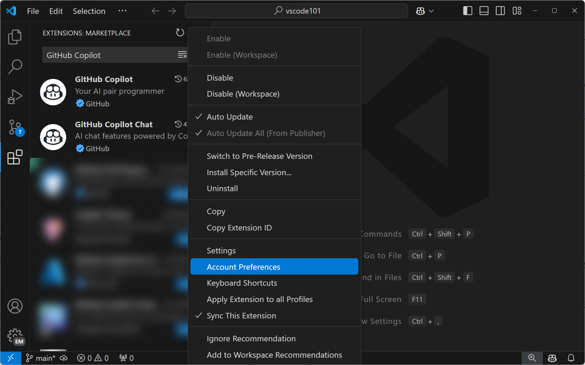
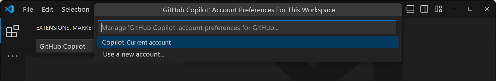

# GitHub Copilot 자주 묻는 질문 {#github-copilot-frequently-asked-questions}

이 문서는 Visual Studio Code에서 GitHub Copilot을 사용하는 것에 대한 자주 묻는 질문들에 답변합니다.

## GitHub Copilot 구독 {#github-copilot-subscription}

### Copilot 구독은 어떻게 얻을 수 있나요? {#how-can-i-get-a-copilot-subscription}

GitHub Copilot에 접근하는 방법은 여러 가지가 있습니다:

- 개인으로서, 신용카드 없이 [Copilot을 무료로](https://github.com/github-copilot/signup) 사용하기 위해 가입할 수 있습니다. 무료 플랜으로 매월 제한된 수의 완성 및 채팅 상호작용을 사용할 수 있으며, 이는 매월 초기화됩니다. [Copilot 무료 플랜 세부사항 및 조건](https://docs.github.com/en/copilot/about-github-copilot/subscription-plans-for-github-copilot)에 대해 자세히 알아보세요.

- 개인으로서, [유료 구독](https://github.com/github-copilot/signup/copilot_individual)에 가입하여 무제한 완성 및 채팅 상호작용을 얻을 수 있습니다. 일회성 30일 무료 평가판으로 GitHub Copilot을 시험해볼 수 있습니다.

- GitHub Copilot 구독이 있는 조직이나 기업의 구성원인 경우, https://github.com/settings/copilot 로 이동하여 "Get Copilot from an organization" 아래에서 Copilot 접근을 요청할 수 있습니다.

[GitHub Copilot 결제](https://docs.github.com/billing/managing-billing-for-github-copilot/about-billing-for-github-copilot)에 대해 자세히 알아보세요.

### 완성 또는 채팅 상호작용 한도에 도달했습니다 {#i-reached-my-completions-or-chat-interactions-limit}

코드 완성 및 채팅 상호작용 한도는 Copilot 무료 플랜에 처음 가입한 날부터 매월 초기화됩니다. 한도에 도달한 경우, [유료 구독](#how-can-i-get-a-copilot-subscription)에 가입하여 무제한 완성 및 채팅 메시지를 얻을 수 있습니다. 또는 다음 달까지 기다렸다가 Copilot을 계속 무료로 사용할 수 있습니다.

채팅 상호작용만 한도에 도달한 경우에도 코드 완성을 위해 Copilot을 계속 사용할 수 있습니다.

코드 완성만 한도에 도달한 경우에도 채팅 상호작용과 Copilot 편집을 위해 Copilot을 계속 사용할 수 있습니다.

### VS Code에서 내 Copilot 구독이 감지되지 않습니다 {#my-copilot-subscription-is-not-detected-in-vs-code}

- Visual Studio Code에서 Copilot 채팅을 사용하려면 GitHub Copilot에 접근할 수 있는 GitHub ID로 Visual Studio Code에 로그인해야 합니다. Copilot 구독이 다른 GitHub 계정과 연결되어 있는 경우 GitHub 계정에서 로그아웃하고 다른 계정으로 로그인해야 할 수 있습니다. 활동 표시줄의 **Accounts** 메뉴를 사용하여 현재 GitHub 계정에서 로그아웃하세요.

- [GitHub Copilot 설정](https://github.com/settings/copilot)에서 Copilot 구독이 여전히 활성 상태인지 확인하세요.

### Copilot에 대한 계정을 어떻게 전환할 수 있나요 {#how-can-i-switch-accounts-for-copilot}

Copilot 사용을 위해 다른 GitHub 계정으로 전환하려면:

1. 활동 표시줄에서 확장 화면을 열고( 또는 `Ctrl+Shift+X`를 사용) 검색 상자에 *GitHub Copilot*을 입력합니다.

   

   :::note
   Copilot 확장이 두 개 있습니다: GitHub Copilot과 GitHub Copilot 채팅입니다다.
   :::

2. **GitHub Copilot** 확장에서 기어 아이콘을 선택한 다음 **Account Preferences** 를 선택합니다.

   

3. 계정 기본 설정 빠른 선택에서 기존 계정을 선택하거나 **Use a new account...** 를 선택하여 다른 GitHub 계정으로 로그인합니다.

   

4. **GitHub Copilot Chat** 확장에 대해서도 이 단계들을 반복합니다.

## 일반 {#general}

### Copilot을 위한 네트워크 및 방화벽 구성 {#network-and-firewall-configuration-for-copilot}

- 귀하나 귀하의 조직이 방화벽이나 프록시 서버와 같은 보안 조치를 사용하는 경우, 특정 도메인 URL을 "허용 목록"에 포함하고 특정 포트와 프로토콜을 열어두는 것이 유용할 수 있습니다. [GitHub Copilot을 위한 방화벽 설정](https://docs.github.com/en/copilot/troubleshooting-github-copilot/troubleshooting-firewall-settings-for-github-copilot) 문제 해결에 대해 자세히 알아보세요.

- 회사 장비에서 작업하고 기업 네트워크에 연결하는 경우, VPN이나 HTTP 프록시 서버를 통해 인터넷에 연결할 수 있습니다. 경우에 따라 이러한 유형의 네트워크 설정으로 인해 GitHub Copilot이 GitHub 서버에 연결하지 못할 수 있습니다. [GitHub Copilot을 위한 네트워크 오류](https://docs.github.com/en/copilot/troubleshooting-github-copilot/troubleshooting-network-errors-for-github-copilot) 문제 해결에 대해 자세히 알아보세요.

### Copilot에 대한 피드백은 어떻게 제공할 수 있나요? {#how-can-i-provide-feedback-on-copilot}

[GitHub Copilot Discussions](https://github.com/orgs/community/discussions/categories/copilot)에서 Copilot 인라인 제안 및 응답에 대한 피드백을 제공할 수 있습니다.

Copilot 채팅 기능에 대한 피드백을 제공하고 싶다면 [vscode-copilot-release](https://github.com/microsoft/vscode-copilot-release/issues) 저장소에서 이슈를 생성할 수 있습니다.

문제를 보고할 때 [VS Code의 GitHub Copilot 로그](#view-logs-for-github-copilot-in-vs-code) 정보를 포함하는 것이 도움이 될 수 있습니다.

### VS Code에서 GitHub Copilot의 로그 보기 {#view-logs-for-github-copilot-in-vs-code}

GitHub Copilot 확장의 로그 파일은 Visual Studio Code 확장의 표준 로그 위치에 저장됩니다. 로그 파일은 연결 문제를 진단하는 데 유용합니다.

**출력 전환** 명령(`Ctrl+Shift+U`)을 사용하고 드롭다운에서 **GitHub Copilot** 또는 **GitHub Copilot Chat**을 선택하세요.

### Copilot 확장의 시험판 빌드가 있나요? {#are-there-pre-release-builds-of-the-copilot-extensions}

네, 최신 기능과 수정 사항을 시험해보기 위해 Copilot 확장의 시험판(nightly) 버전으로 전환할 수 있습니다. 확장 화면에서 마우스 오른쪽 버튼을 클릭하거나 기어 아이콘을 선택하여 컨텍스트 메뉴를 열고, **시험판 버전으로 전환**을 선택하세요:

확장 세부 정보의 "시험판" 배지를 통해 시험판 버전을 실행 중인지 알 수 있습니다:

## Copilot 코드 완성 {#copilot-code-completions}

### Copilot을 어떻게 활성화/비활성화하나요? {#how-do-i-enabledisable-copilot}

상태 표시줄에서 Copilot 완성을 일시적으로 비활성화할 수 있습니다. 모든 코드(전역적으로)에 대해 Copilot을 비활성화할지 또는 활성 편집기에서 감지된 프로그래밍 언어(예: Python)에 대해서만 비활성화할지 묻는 메시지가 표시됩니다.

### 편집기에서 인라인 완성이 작동하지 않습니다 {#inline-completions-are-not-working-in-the-editor}

- [GitHub Copilot이 비활성화되지 않았는지](#how-do-i-enabledisable-copilot) 전역적으로 또는 이 언어에 대해 확인하세요
- [GitHub Copilot 구독이 활성 상태이고 감지되는지](#my-copilot-subscription-is-not-detected-in-vs-code) 확인하세요
- [네트워크 설정](#network-and-firewall-configuration-for-copilot)이 GitHub Copilot에 대한 연결을 허용하도록 구성되어 있는지 확인하세요
- [Copilot 무료 플랜](TODO)으로 이번 달의 완성 한도에 도달하지 않았는지 확인하세요

## Copilot 채팅 {#copilot-chat}

### Copilot 채팅 기능이 작동하지 않습니다 {#copilot-chat-features-arent-working-for-me}

Copilot 채팅이 작동하지 않는 경우 각 요구 사항을 확인하세요:

- Visual Studio Code의 최신 버전을 사용하고 있는지 확인하세요(**코드: 업데이트 확인** 실행).
- [GitHub Copilot](https://marketplace.visualstudio.com/items?itemName=GitHub.copilot)과 [GitHub Copilot 채팅](https://marketplace.visualstudio.com/items?itemName=GitHub.copilot-chat) 확장의 최신 버전을 가지고 있는지 확인하세요.
- VS Code에 로그인한 GitHub 계정에 활성 Copilot 구독이 있어야 합니다. [Copilot 구독](https://github.com/settings/copilot)을 확인하세요.
- [Copilot 무료 플랜](TODO)으로 이번 달의 채팅 상호작용 한도에 도달하지 않았는지 확인하세요.

### Copilot 채팅 확장이 차단된 이유는 무엇인가요? {#why-is-my-copilot-chat-extension-blocked}

Copilot 채팅을 사용하는 확장이 차단되었다는 메시지를 받은 경우, 해당 특정 확장에서 발생하는 악용 패턴이 감지되어 확장이 비활성화되었을 가능성이 높습니다. 이 문제가 발생하면 해당 확장의 게시자에게 문의하세요. Visual Studio Marketplace의 확장 세부 정보 페이지에서 게시자 정보를 찾을 수 있습니다.

## 추가 기능 {#additional-resources}

- [GitHub Copilot 신뢰 센터](https://resources.github.com/copilot-trust-center/)
- GitHub 문서의 [GitHub Copilot FAQ](https://github.com/features/copilot#faq)
