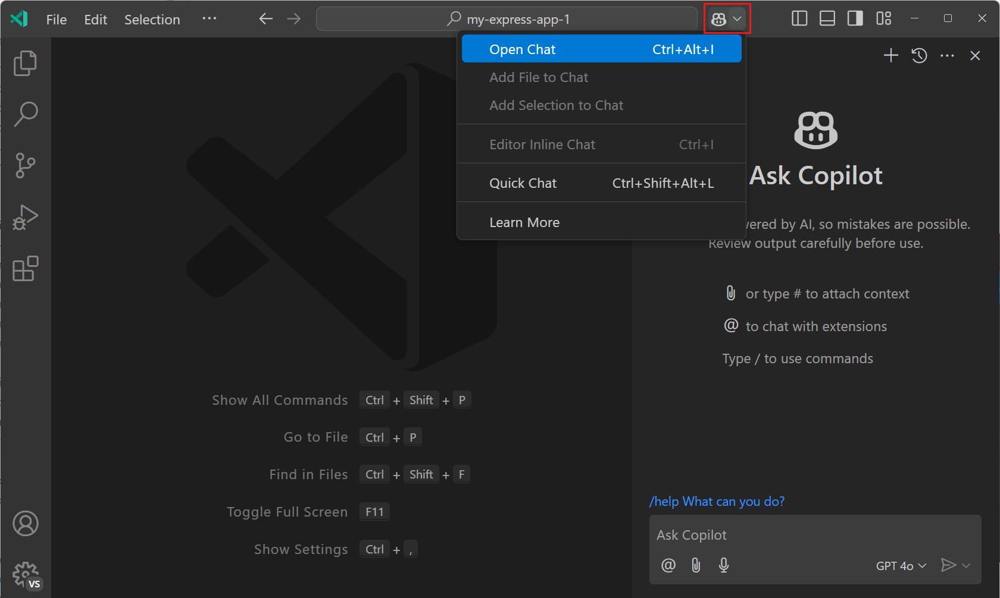
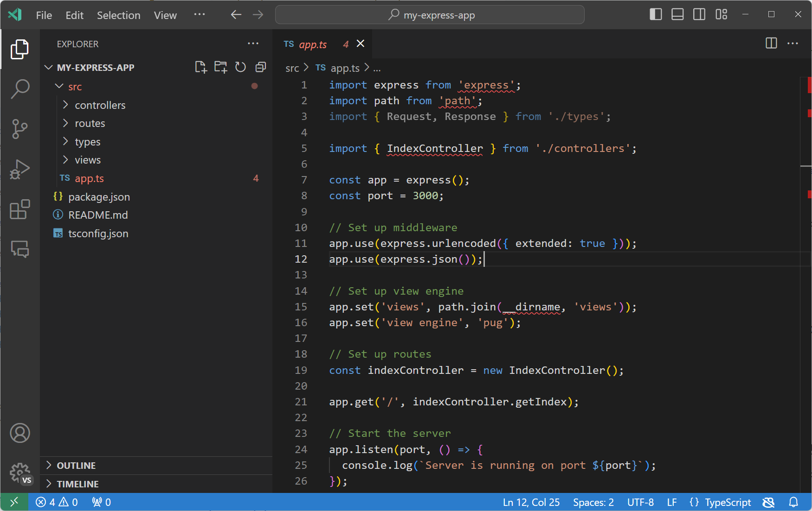
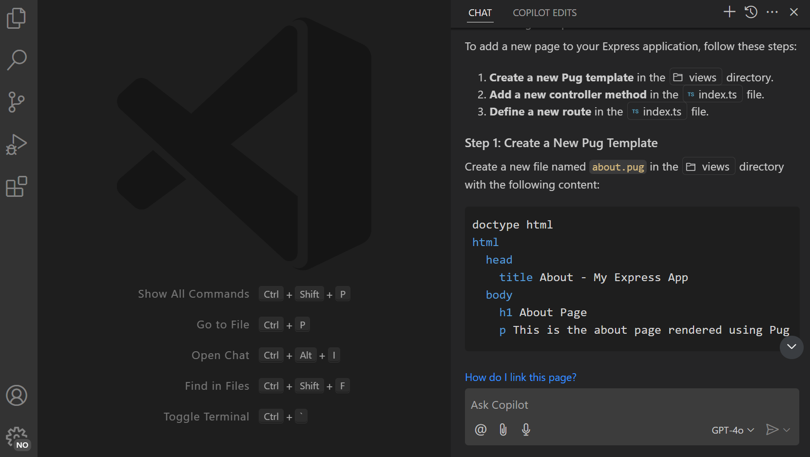
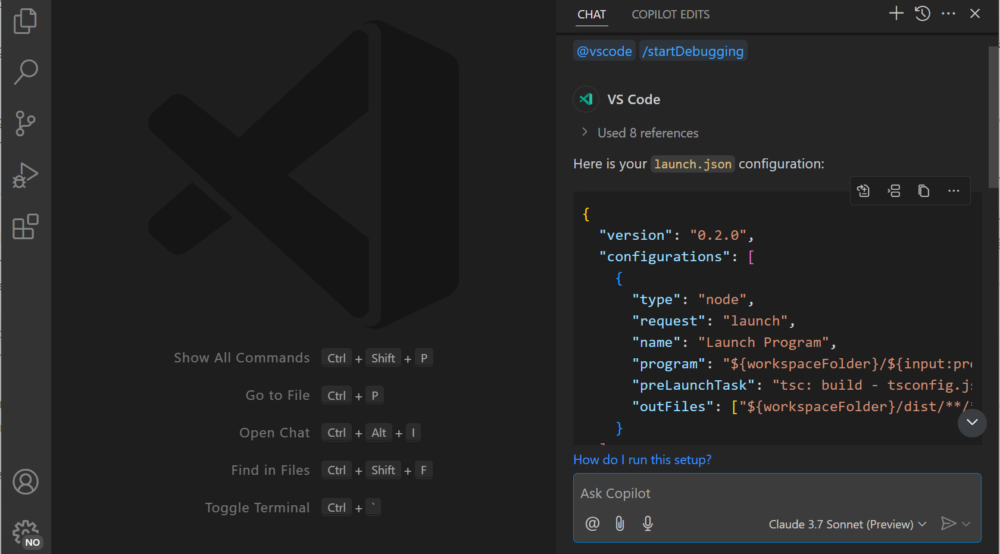
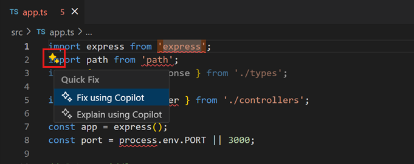
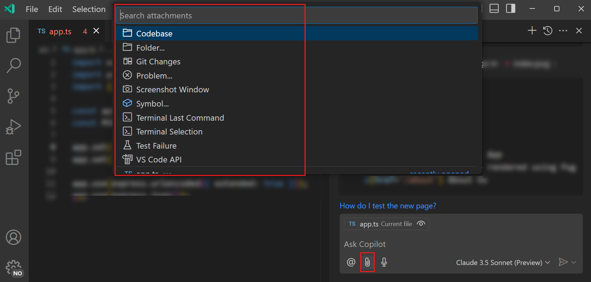

# VS Code에서 Copilot 채팅 시작하기 {#getting-started-with-copilot-chat-in-vs-code}

이 튜토리얼에서는 Visual Studio Code에서 [GitHub Copilot 채팅](https://marketplace.visualstudio.com/items?itemName=GitHub.copilot-chat) 확장을 사용하는 방법을 안내합니다. AI 기반 채팅 대화를 활용하여 코드 리팩토링, 코드 이해도 향상, 그리고 VS Code 설정 탐색을 쉽게 할 수 있습니다.

VS Code에서 GitHub Copilot을 처음 사용하는 경우 [GitHub Copilot 개요](/docs/copilot/overview.md)나 [GitHub Copilot 시작하기 튜토리얼](/docs/copilot/getting-started.md)을 참조하세요.

:::tip
아직 Copilot 구독이 없다면, [Copilot 무료 플랜](https://github.com/github-copilot/signup)에 가입하여 매월 제한된 완성과 채팅 상호작용을 무료로 사용할 수 있습니다.
:::

## 사전 요구 사항 {#prerequisites}

- VS Code에서 GitHub Copilot을 사용하려면 [GitHub Copilot](https://marketplace.visualstudio.com/items?itemName=GitHub.copilot) 확장이 필요합니다. 이 확장을 설치하면 [GitHub Copilot 채팅](https://marketplace.visualstudio.com/items?itemName=GitHub.copilot-chat) 확장도 함께 설치됩니다.

- GitHub Copilot을 사용하려면 개인 계정에 활성 구독이 있어야 하며, 조직에서 Copilot 사용 권한을 부여받아야 합니다.

다음 단계를 따라 [VS Code에서 GitHub Copilot 설정하기](/docs/copilot/setup.md)를 진행하세요. 구독에 가입하고 Copilot 확장을 설치하면 됩니다.

## 첫 번째 Copilot 채팅 대화 시작하기 {#get-your-first-copilot-chat-conversation}

Copilot 채팅은 GitHub Copilot과 상호작용할 수 있는 채팅 인터페이스로, 코딩 관련 질문을 하고 답변을 받을 수 있습니다. 채팅 인터페이스를 사용하면 문서를 탐색하거나 온라인 포럼을 검색하지 않고도 코딩 정보를 얻을 수 있습니다.

이 튜토리얼에서는 간단한 Node.js 웹 애플리케이션을 생성합니다.

1. 명령 센터의 채팅 메뉴에서 **Chatting View**를 열거나 `Ctrl+Alt+I`를 누릅니다.

   

   > :::tip
   > 언제든지 명령 센터 메뉴에서 다양한 Copilot 기능에 접근할 수 있습니다.
   > :::

1. 채팅 입력 필드에 `@workspace /new express with typescript and pug`를 입력하고 `Enter`를 눌러 요청을 보냅니다.

   이 채팅 프롬프트는 Copilot에 명확하고 간결한 지시를 제공하도록 구성되었습니다. 이를 분해해서 살펴보겠습니다:

   - `@workspace`는 *채팅 참가자*로, 특정 도메인에서 작업을 수행하거나 질문에 답변할 수 있는 도메인 전문가를 나타냅니다. 이 경우, `@workspace`는 VS Code 작업 공간과 코드베이스에 대해 알고 있습니다.

   - `/new`는 새로운 작업 공간을 생성하려는 것을 `@workspace` 참가자에게 전달하는 *슬래시 명령*입니다. 슬래시 명령은 자주 사용되는 지시를 위한 간단한 약어입니다. 채팅 입력 필드에 `/` 기호를 입력하면 지원되는 명령 목록을 확인할 수 있습니다.

1. Copilot이 새로운 작업 공간 파일을 나타내는 파일 트리와 작업 공간을 생성하는 버튼을 반환합니다.

   

   파일 트리에서 내용을 미리 보고, 생성된 파일에 만족하지 않거나 다른 것이 필요하다면 후속 질문을 할 수 있습니다. 예를 들어, `@workspace use ejs`를 입력하여 Pug 대신 EJS를 사용할 수 있습니다.

1. **작업 공간 생성**을 선택하여 새 작업 공간을 생성하고 디스크에서 작업 공간을 저장할 폴더를 선택합니다.

   작업 공간 생성이 완료되면 VS Code가 새 작업 공간으로 다시 로드됩니다.

   

축하합니다! Copilot 채팅으로 작업 공간을 생성했습니다. 이 접근 방식의 장점은 요청을 원하는 대로 조정할 수 있다는 것입니다. 예를 들어, Express.js와 EJS를 사용하거나, Express.js를 사용하지 않고 Bootstrap과 함께 순수 Node.js를 사용할 수도 있습니다. 선호하는 방식으로 선택하세요!

## 채팅 참가자 사용하기 {#use-chat-participants}

이전에 `@workspace` 채팅 참가자를 사용하여 새 작업 공간을 생성했지만, 작업 공간의 실제 코드에 대한 질문에도 사용할 수 있습니다.

생성된 Express 앱을 기반으로 새 페이지를 추가해 보겠습니다.

1. 채팅 화면에서 `@workspace how to add a new page?`를 입력합니다.

   

   Copilot은 코드에 맞는 단계별 새 페이지 추가 지침을 반환합니다. 이는 채팅 프롬프트에 `@workspace`를 추가하여 특정 작업 공간 내용에 대한 컨텍스트를 제공했기 때문입니다. `@workspace`를 포함하지 않으면 더 일반적인 지침을 받을 수 있습니다.

2. 선택적으로, 지침을 따라 앱에 새 페이지를 추가하세요.

   > :::tip
   > 홈 화면, 연락처 페이지, 제품 페이지와 같은 추가하려는 페이지 유형을 지정할 수 있습니다.
   > :::

3. 사용할 수 있는 더 많은 채팅 참가자가 있습니다. 각 참가자는 고유한 도메인 전문성을 가지고 있습니다. <i class="codicon codicon-mention"></i> 아이콘을 선택하거나 채팅 화면에서 `@`를 입력하여 사용 가능한 채팅 참가자 목록을 확인하세요.

   

   > :::note
   > 확장 프로그램도 채팅 참가자를 추가할 수 있으므로, 목록은 VS Code에 설치된 확장 프로그램에 따라 달라질 수 있습니다.
   > :::

4. 이번에는 `@vscode`를 사용하여 VS Code에 대해 질문해 봅시다. 채팅 입력 필드에 `@vscode how to debug node.js app`을 입력하세요.

   VS Code에서 Node.js 앱을 디버그하는 방법에 대한 지침을 제공하며, 관련 VS Code 기능에 직접 접근할 수 있는 버튼도 표시됩니다.

   

## 인라인 채팅으로 작업 흐름 유지하기 {#stay-in-the-flow-with-inline-chat}

채팅 화면은 Copilot과의 대화를 이어가기 좋지만, 에디터에서 직접 채팅에 접근하는 것이 특정 시나리오에서는 더 효율적일 수 있습니다. 예를 들어, 코드 변경 사항 검토, 단위 테스트 작성, 코드 리팩토링을 할 때 유용합니다.

이제 코드 리팩토링을 위해 채팅을 사용하는 방법을 살펴보겠습니다.

1. 에디터에서 `app.ts` 파일을 열고 포트 번호가 설정된 줄(`const port = 3000`)에 커서를 놓습니다.

   더 복잡한 코드 변경의 경우, Copilot에 변경을 원하는 내용을 더 잘 전달하기 위해 코드 블록을 선택할 수 있습니다.

2. 키보드에서 `Ctrl+I`를 눌러 Copilot 인라인 채팅을 열거나, 마우스 오른쪽 버튼을 클릭하고 **Copilot** > **Start in Editor**을 선택하세요.

   Copilot 인라인 채팅을 사용하면 에디터에서 Copilot에 직접 질문을 할 수 있습니다.

   

   이제 Copilot에 포트 번호를 설정할 수 있도록 코드를 리팩토링해 달라고 요청해 봅시다.

3. 채팅 입력 필드에 `make configurable`을 입력하고 `Enter`를 누릅니다.

   Copilot이 선택한 코드를 업데이트하여 환경 변수에서 포트 번호를 읽는 방식을 제안하는 것을 볼 수 있습니다.

   

   **More Actions** > **Toggle Changes**을 선택하여 적용된 변경 사항을 확인할 수 있습니다.

   

4. 변경 사항을 적용하거나 무시하려면 **Accept** 또는 **Discard**를 선택하세요.

   제안된 코드 변경 사항이 마음에 들지 않으면 **Rerun Request** 버튼을 선택하여 다른 제안을 받을 수 있습니다.

   > :::tip
   > 엄지 위로와 엄지 아래로 버튼을 사용하여 Copilot에 제안에 대한 피드백을 제공하세요.
   > :::

에디터에서 Copilot 인라인 채팅을 사용하여 코드 리팩토링을 수행한 것을 축하드립니다!

## 스마트 액션 사용하기 {#use-smart-actions}

채팅 프롬프트를 입력하지 않고도 Copilot을 직접 호출할 수 있는 일반적인 시나리오가 있습니다. 예를 들어, Copilot은 코드 문서 추가, 단위 테스트 생성 또는 코딩 오류 수정을 도와줄 수 있습니다.

코딩 오류를 수정하기 위해 스마트 액션을 사용하는 방법을 살펴보겠습니다.

1. `app.ts` 파일을 열고 빨간색 물결선이 있는 심볼 중 하나를 선택하세요.

1. 스파클 아이콘을 선택하여 Copilot 코드 액션을 보고, **Fix using Copilot**을 선택하세요.

   

1. Copilot 인라인 채팅이 나타나고, 오류 메시지와 함께 문제를 해결하기 위한 제안이 미리 채워져 있습니다.

   

   Copilot이 오류 메시지 다음에 `/fix` 슬래시 명령을 사용하는 것을 확인하세요. 채팅 입력 필드에서 직접 `/fix` 명령을 사용하여 코딩 오류 수정에 대한 도움을 받을 수도 있습니다.

**Fix** 외에도 Copilot은 **Explain** (`/explain`), **Generate Docs** (`/doc`), **Generate Tests** (`/tests`)와 같은 더 많은 스마트 코드 액션을 제공합니다. 에디터 컨텍스트 메뉴에서 **Copilot**을 선택하여 이러한 액션에 접근할 수 있습니다.

그리고 이해하기 어려운 코드 블록을 발견하면, 해당 부분을 선택하고 `/explain`을 사용하여 Copilot으로부터 설명을 받고 코드 이해도를 높일 수 있습니다.

## 채팅 컨텍스트 추가하기 {#add-chat-context}

이전에 `@workspace`를 사용하여 작업 공간에 대한 질문을 했습니다. 특정한 것, 예를 들어 특정 파일이나 코드의 심볼에 대해 Copilot에게 질문하고 싶다면 어떻게 해야 할까요? 자세한 설명 없이도 Copilot에 그 컨텍스트를 어떻게 제공할 수 있을까요?

작업 공간의 특정 파일의 목적이 무엇인지 Copilot에게 물어보겠습니다.

1. 커맨드 센터 채팅 메뉴에서 또는 `Ctrl+Alt+I`을 눌러 채팅 화면을 엽니다.

2. 채팅 입력 필드 옆의 **컨텍스트 첨부** 버튼을 선택하여 컨텍스트 빠른 선택을 엽니다.

   

   컨텍스트 빠른 선택에서 작업 공간의 파일, 심볼, 현재 선택 항목 등과 같은 다양한 유형의 컨텍스트를 채팅 프롬프트에 추가할 수 있습니다.

3. `index.ts`를 입력하기 시작하여 해당 파일을 찾은 다음, `src\types\index.ts` 파일을 선택하세요.

   

   파일을 선택한 후, 채팅 화면에 파일이 추가된 것을 확인하세요. 선택적으로 채팅 프롬프트에 더 많은 파일이나 다른 컨텍스트 유형을 추가할 수 있습니다.

4. 이제 채팅 입력 필드에 다음 프롬프트를 입력하세요: _@workspace what does this do_. 그런 다음 `Enter`를 눌러 요청을 보내세요.

   

   이제 Copilot이 선택한 파일의 코드 목적에 대한 설명을 반환합니다.

5. **컨텍스트 첨부** 컨트롤을 사용하는 대신, 채팅 입력 필드에 `#`를 입력하여 다양한 유형의 컨텍스트를 직접 참조할 수도 있습니다.

   :::tip
   `#codebase`를 추가하여 전체 작업 공간을 채팅 프롬프트의 컨텍스트로 추가하세요. 이는 프로젝트의 다양한 영역과 관련된 질문을 하고 싶을 때 유용할 수 있습니다.
   :::

6. 채팅 프롬프트에 파일을 빠르게 컨텍스트로 첨부하려면, 탐색기 화면에서 채팅 화면으로 파일을 드래그 앤 드롭하세요. 파일이 에디터에서 열려 있는 경우, 에디터 탭을 채팅 화면로 드래그 앤 드롭하여 파일을 첨부할 수도 있습니다.

   <video title="채팅에 파일과 에디터 드래그하기" autoplay loop controls muted style={{ maxWidth: '100%' }}>
   <source src="https://code.visualstudio.com/assets/docs/copilot/copilot-chat/copilot-attach-dnd.mp4" type="video/mp4" />
   </video>

## 축하합니다 {#congratulations}

축하합니다, [GitHub Copilot 채팅](https://marketplace.visualstudio.com/items?itemName=GitHub.copilot-chat) 확장 프로그램을 성공적으로 사용하여 코드 리팩토링, 문제 해결 또는 코드 이해도 향상을 돕는 AI 기반 대화를 나눴습니다.

## 추가 기능 {#additional-resources}

- [VS Code의 Copilot 채팅](/docs/copilot/copilot-chat.md) 개요 보기
- [프롬프트 작성과 컨텍스트 설정](/docs/copilot/prompt-crafting.md)으로 Copilot 경험 최적화하기
