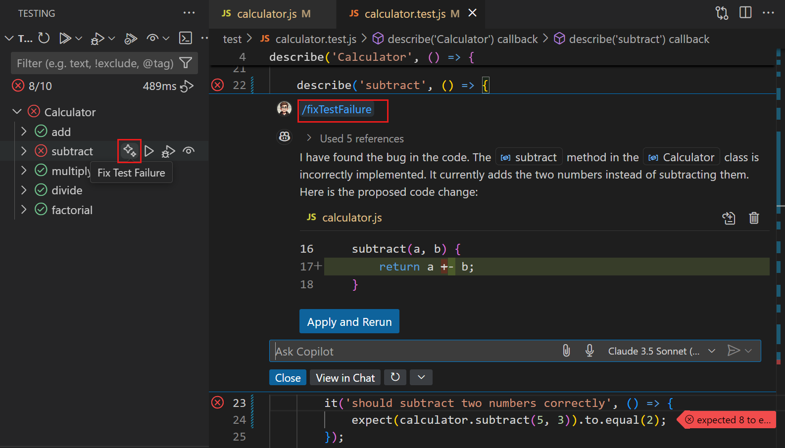
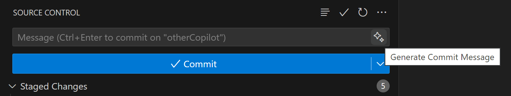

import Card from "@site/src/components/Card";

# VS Code의 GitHub Copilot {#github-copilot-in-vs-code}

[GitHub Copilot](https://marketplace.visualstudio.com/items?itemName=GitHub.copilot)은 Visual Studio Code에서 여러분의 AI 기반 프로그래밍 도우미입니다. 타이핑하면서 코드 제안을 받거나 에디터에서 인라인 채팅을 사용하여 더 빠르게 코드를 작성하세요. Copilot 편집으로 프로젝트 전반에 걸쳐 새로운 기능을 추가하거나 버그를 해결하고, 자연어를 사용한 채팅으로 코드베이스를 탐색하세요.

> :::tip
> 아직 Copilot 구독이 없다면, [Copilot 무료 요금제](https://github.com/github-copilot/signup)에 가입하여 월간 자동 완성 및 채팅 상호작용 한도 내에서 Copilot을 무료로 사용할 수 있습니다.
> :::

GitHub Copilot은 다양한 시나리오에서 도움을 제공할 수 있습니다.

  <Card
    href="#_code-completions-in-the-editor"
    iconClass="codicon codicon-keyboard"
    title="타이핑하면서 코드 제안 받기"
  />
  <Card
    href="#_iterate-on-large-changes-across-multiple-files"
    iconClass="codicon codicon-edit-session"
    title="여러 파일에 걸친 대규모 변경 수행"
  />
  <Card
    href="#_answer-coding-questions"
    iconClass="codicon codicon-comment-discussion"
    title="코드에 대한 질문하기"
  />
  <Card
    href="#_code-refactoring-and-improvements"
    iconClass="codicon codicon-lightbulb"
    title="코드 리팩토링 및 개선"
  />
  <Card
    href="#_fix-issues"
    iconClass="codicon codicon-debug"
    title="코드 문제 및 디버깅 수정"
  />
  <Card
    href="#_jumpstart-your-project"
    iconClass="codicon codicon-new-file"
    title="새 프로젝트나 파일 초기 설정"
  />
  <Card
    href="#_generate-unit-test-cases"
    iconClass="codicon codicon-beaker"
    title="테스트 구성 및 생성"
  />
  <Card
    href="#_generate-code-documentation"
    iconClass="codicon codicon-book"
    title="코드 문서 생성"
  />
  <Card
    href="#_productivity-improvements"
    iconClass="codicon codicon-sparkle"
    title="VS Code에서 생산성 향상"
  />

## 시작하기 {#getting-started}

1. GitHub Copilot 확장 프로그램들을 설치하세요.

   > <a
   >   class="install-extension-btn"
   >   href="vscode:extension/GitHub.copilot?referrer=docs-copilot-overview"
   > >
   >   GitHub Copilot 확장 프로그램 설치하기
   > </a>

2. GitHub 계정으로 로그인하여 Copilot을 사용하세요.

   > :::tip
   > 아직 Copilot 구독이 없다면 [Copilot 무료 요금제](https://github.com/github-copilot/signup)로 시작할 수 있습니다. Copilot 구독을 설정하려면 [설정 가이드](/docs/copilot/setup.md)의 단계를 따르세요.
   > :::

3. [Copilot 빠른 시작](/docs/copilot/getting-started.md)로 VS Code에서 Copilot의 주요 기능을 알아보세요.

## 키보드 단축키 {#keyboard-shortcuts}

Copilot과 채팅 대화를 시작하려면 다음 키보드 단축키를 사용하세요:

| 단축키             | 설명                                                                                                                                              |
| ------------------ | ------------------------------------------------------------------------------------------------------------------------------------------------- |
| `Ctrl+Alt+I`       | **Chat view** 화면을 열고 자연어를 사용하여 Copilot과 채팅 대화를 시작합니다.                                                                            |
| `Ctrl+Shift+I`     | ** Copilot Edits** 화면을 열고 여러 파일에 걸친 코드 편집 세션을 시작합니다.                                                                          |
| `Ctrl+Shift+Alt+L` | **Quick Chat**을 열고 Copilot에게 빠른 질문을 합니다.                                                                                              |
| `Ctrl+I`           | **Inline Chat**을 시작하여 에디터에서 직접 Copilot에게 채팅 요청을 보냅니다. 자연어를 사용하거나 `/` 명령을 사용하여 Copilot에게 지시를 내립니다. |

주요 Copilot 명령어와 단축키의 개요는 [Copilot 가이드](/docs/copilot/copilot-vscode-features.md)를 확인하세요.

## VS Code에서 GitHub Copilot 사용 사례 {#use-cases-for-github-copilot-in-vs-code}

### 에디터에서 코드 완성 {#code-completions-in-the-editor}

- **Copilot이 타이핑하는 동안 코드를 제안합니다**. Copilot은 편집 중인 파일과 관련 파일의 컨텍스트를 분석하고 에디터 내에서 제안을 제공합니다. 예를 들어, 메서드 이름을 입력하기 시작하면 Copilot이 사용자의 코딩 스타일에 맞춰 구현을 제안합니다.

  

### 여러 파일에 걸친 대규모 변경 반복 {#iterate-on-large-changes-across-multiple-files}

- **AI 기반 코드 편집 세션 시작**. [Copilot 편집](/docs/copilot/copilot-edits.md)은 Copilot 채팅의 대화형 흐름과 인라인 채팅의 빠른 피드백을 하나의 경험으로 통합합니다. 측면에서 지속적인 다중 턴 채팅 대화를 나누는 동시에 인라인 코드 제안의 이점을 누릴 수 있습니다.

  

### 코딩 질문 답변 {#answer-coding-questions}

- **일반적인 코딩 작업과 과제에 대한 안내 및 지원 제공**. 문서를 찾아보거나 온라인 포럼을 검색할 필요 없이 구문이나 일반적인 프로그래밍 개념에 대해 Copilot에게 물어볼 수 있습니다. Copilot은 자연어 형식이나 코드 스니펫 형식으로 응답합니다. 예를 들어 "재귀란 무엇인가요?" 또는 "Java에서 싱글톤을 어떻게 만드나요?"와 같은 질문을 할 수 있습니다.

  

- **선택한 코드를 설명하여 코드 이해도 향상**. Copilot은 코드의 기능과 목적에 대한 자연어 설명을 생성합니다. 코드의 동작을 이해하고 싶거나 코드가 어떻게 작동하는지 이해해야 하는 비개발자에게 유용할 수 있습니다.

  

- **코드베이스에 특화된 안내 제공**. Copilot은 작업 공간의 컨텍스트를 가지고 있어 프로젝트에 맞춤화된 단계별 안내와 코드 예제를 제공할 수 있습니다. 예를 들어, "연락처 페이지를 어떻게 추가하나요?" 또는 "데이터베이스에서 고객 데이터를 어떻게 읽나요?"와 같은 질문을 할 수 있습니다.

  

### 코드 리팩토링 및 개선 {#code-refactoring-and-improvements}

- **코드 리팩토링 구현을 위한 제안 제공**. Copilot은 코드베이스의 컨텍스트를 사용하여 리팩토링을 제안합니다. 예를 들어, Copilot에게 재귀를 사용하지 않도록 함수를 리팩토링하거나 성능을 개선할 수 있는 알고리즘을 제안하도록 요청할 수 있습니다.

  

- **선택한 코드에 대한 잠재적 개선 사항 제안**, 예를 들어 오류 및 엣지 케이스의 처리 개선이나 코드를 더 읽기 쉽게 만들기 위한 논리적 흐름 변경 등을 제안합니다.

  

### 문제 해결 {#fix-issues}

- **코드의 버그에 대한 수정 제안** `/fix` 명령을 사용하여 오류나 문제의 컨텍스트를 기반으로 코드 스니펫과 해결책을 제안합니다. 예를 들어, 코드가 오류 메시지나 경고를 생성하는 경우 Copilot 채팅은 오류 메시지, 코드 구문, 주변 코드를 기반으로 가능한 수정 사항을 제안할 수 있습니다. 변경 사항에는 문제를 해결할 수 있는 변수, 제어 구조 또는 함수 호출의 변경이 포함될 수 있습니다.

  

- **실패한 테스트에 대한 수정 제안** (프리뷰뷰). 코드에 대한 자동화된 테스트를 실행할 때, Copilot은 `/fixTestFailure` 명령을 사용하여 실패한 테스트에 대한 코드 수정을 제안할 수 있습니다.

  

- **터미널 명령 수정 제안**. 터미널에서 명령 실행이 실패할 때, Copilot은 거터에 발생한 일을 설명하는 빠른 수정을 제공하는 스파클을 표시합니다.

  

### 프로젝트 시작 {#jumpstart-your-project}

- **새로운 VS Code 작업 공간 생성** 선택한 기술을 위해 `/new`를 사용하여 새 프로젝트를 빠르게 시작합니다. 기술 스택을 선택하고, 작업 공간 파일을 미리 보고, Copilot이 전체 작업 공간을 초기 설정하도록 합니다.

  

- **자연어를 사용하여 새로운 Jupyter 노트북 초기 설정**. `/newNotebook`을 사용하여 설명을 기반으로 미리 구성된 새 노트북을 생성합니다. 예를 들어, 샘플 데이터셋을 로드하고, 검사하고, 시각화하는 새 노트북을 초기 설정하려면 "@workspace /newNotebook titanic 데이터셋을 다운로드하고 MatPlotLib을 사용하여 주요 정보를 표시"와 같이 Copilot에게 프롬프트를 제공합니다.

  

### 단위 테스트 케이스 생성 {#generate-unit-test-cases}

- **코드베이스를 기반으로 테스팅 프레임워크 설정 구성**. 예를 들어, JavaScript 및 TypeScript 프로젝트가 있는 경우 Copilot은 작업 공간에 대한 적절한 테스팅 프레임워크와 구성 단계를 제안합니다.

  

- **에디터에서 열려 있는 코드나 에디터에서 강조 표시한 코드 스니펫에 대한 테스팅 프레임워크의 단위 테스트 케이스 작성**. Copilot은 테스팅 프레임워크와 코딩 스타일을 식별하고 일치하는 코드 스니펫을 생성합니다.

  

- **수동으로 식별하기 어려울 수 있는 엣지 케이스와 경계 조건에 대한 테스트 케이스 식별 및 작성**. 예를 들어, Copilot은 오류 처리, null 값 또는 예상치 못한 입력 유형에 대한 테스트 케이스를 제안할 수 있습니다.

- **함수가 올바르게 작동하는지 확인하는 어설션(assertion) 제안**, 코드의 컨텍스트와 의미를 기반으로 합니다. 예를 들어, 함수 입력 매개변수가 유효한지 확인하는 어설션(assertion)을 생성합니다.

### 코드 문서 생성 {#generate-code-documentation}

- **여러 언어에 대한 코드 문서 생성** 에디터에서 열려 있는 코드나 에디터에서 강조 표시한 코드 스니펫에 대해. `/doc` 또는 Copilot 스마트 액션을 사용하여 의미 있는 코드 문서를 생성하는 데 도움을 받습니다.

  

### 생산성 향상 {#productivity-improvements}

- **AI 생성 커밋 메시지 및 PR 설명** 커밋의 코드 변경 사항이나 풀 리퀘스트의 변경 사항을 기반으로. 소스 제어 뷰나 GitHub PR 확장의 _스파클_ 버튼을 사용하여 변경 사항을 요약하는 제목과 설명을 생성합니다.

  

- **소스 코드의 심볼에 대한 AI 생성 이름 변경 제안**. 코드에서 심볼의 이름을 변경할 때, Copilot은 심볼의 컨텍스트와 코드베이스를 기반으로 새로운 이름을 제안합니다.

  

- **시맨틱 검색 결과** (프리뷰). 검색 뷰는 파일에서 정확한 텍스트 일치뿐만 아니라 검색 텍스트를 기반으로 의미적으로 관련된 일치 항목도 나열합니다.

  

- **터미널 인라인 채팅 사용** 터미널이나 특정 셸 명령 사용 방법에 대해 질문할 수 있습니다. 예를 들어, "src 디렉토리에서 가장 큰 파일 5개 나열" 또는 "셸 통합을 어떻게 활성화하나요?"와 같은 질문을 할 수 있습니다.

  

## 다음 단계 {#next-steps}

- [VS Code의 Copilot 빠른 시작으로로 시작하기](/docs/copilot/getting-started.md)
- [Copilot 편집으로 여러 파일에 걸친 편집 시작하기](/docs/copilot/copilot-edits.md)
- [VS Code의 Copilot 기능에 대한 빠른 개요 보기](/docs/copilot/copilot-vscode-features.md)

## 추가 기능 {#additional-resources}

[GitHub Copilot 문서](https://docs.github.com/copilot/getting-started-with-github-copilot?tool=vscode)에서 Copilot과 VS Code에서의 사용 방법에 대해 자세히 알아볼 수 있습니다.

또는 YouTube의 [VS Code Copilot 시리즈](https://www.youtube.com/playlist?list=PLj6YeMhvp2S5_hvBl2SE-7YCHYlLQ0bPt)를 확인하세요. 여기서 [Python](https://www.youtube.com/watch?v=DSHfHT5qnGc), [C#](https://www.youtube.com/watch?v=VsUQlSyQn1E), [Java](https://www.youtube.com/watch?v=zhCB95cE0HY), [PowerShell](https://www.youtube.com/watch?v=EwtRzAFiXEM), [C++](https://www.youtube.com/watch?v=ZfT2CXY5-Dc) 등과 함께 Copilot을 사용하는 것에 대한 더 많은 소개 컨텐츠와 프로그래밍별 비디오를 찾을 수 있습니다.
