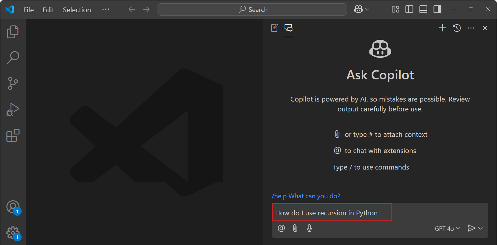

# VS Code에서 GitHub Copilot  설정하기 {#set-up-github-copilot-in-vs-code}

이 가이드는 Visual Studio Code에서 GitHub Copilot을 설정하는 과정을 안내합니다. VS Code에서 Copilot을 사용하려면 GitHub 계정으로 GitHub Copilot에 액세스할 수 있어야 하며 VS Code에 Copilot 확장 프로그램이 설치되어 있어야 합니다.

:::tip
아직 Copilot 구독이 없다면, [Copilot 무료 요금제](https://github.com/github-copilot/signup)에 가입하여 매월 제한된 자동 완성 및 채팅 상호작용을 무료로 사용할 수 있습니다.
:::

## GitHub Copilot 액세스 권한 얻기 {#get-access-to-github-copilot}

GitHub Copilot에 액세스하는 방법에는 여러 가지가 있습니다:

- 개인 사용자의 경우, 신용 카드 없이 [Copilot을 무료로](https://github.com/github-copilot/signup) 사용하기 위해 가입할 수 있습니다. 무료 요금제에서는 매월 제한된 수의 자동 완성 및 채팅 상호작용을 제공받으며, 이는 매월 초기화됩니다. [Copilot 무료 요금제 세부사항 및 조건](https://docs.github.com/en/copilot/about-github-copilot/subscription-plans-for-github-copilot)에 대해 자세히 알아보세요.

- 개인 사용자의 경우, [유료 구독](https://github.com/github-copilot/signup/copilot_individual)에 가입하여 무제한 자동 완성 및 채팅 상호작용을 이용할 수 있습니다. 30일 무료 체험판으로 GitHub Copilot을 시험해볼 수 있습니다.

- GitHub Copilot 구독이 있는 조직이나 기업의 구성원인 경우, <a href="https://github.com/settings/copilot" target="_blank" rel="noopener noreferrer">https://github.com/settings/copilot</a>으로 이동하여 "조직에서 Copilot 받기" 아래에서 Copilot 액세스를 요청할 수 있습니다.

[GitHub Copilot 청구](https://docs.github.com/billing/managing-billing-for-github-copilot/about-billing-for-github-copilot)에 대해 자세히 알아보세요.

## VS Code에서 Copilot 설정하기 {#set-up-copilot-in-vs-code}

1. VS Code 제목 표시줄의 Copilot 메뉴를 열고 **Use AI Features with Copilot for Free...** 를 선택하여 채팅 화면을 엽니다.

   

   :::tip
   `Ctrl+Alt+I` 키보드 단축키를 사용하거나 **채팅: 채팅 뷰에 포커스** 명령으로 채팅 뷰를 직접 열 수도 있습니다.
   :::

1. **Copilot 사용을 위해 로그인**을 선택하여 GitHub 계정으로 로그인하고 시작하세요. 이렇게 하면 VS Code에 GitHub Copilot 확장 프로그램도 설치됩니다.

   

1. 아직 Copilot 구독이 없다면 브라우저에서 단계를 따라 Copilot 무료 요금제에 가입하세요.

   :::important
   GitHub Copilot 무료 버전의 원격 분석은 현재 활성화되어 있습니다. 기본적으로 VS Code와 \<github.com\> 환경의 코드 참조를 포함한 공개 코드와 일치하는 코드 제안이 허용됩니다. VS Code에서 `telemetry.telemetryLevel`을 `off`로 설정하여 원격 분석 데이터 수집을 중단하거나, [Copilot 설정](https://github.com/settings/copilot)에서 원격 분석과 코드 제안 설정을 모두 조정할 수 있습니다.
   :::

## VS Code에서 Copilot 시작하기 {#get-started-with-copilot-in-vs-code}

GitHub 계정으로 로그인하고 Copilot에 액세스할 수 있게 되면 VS Code에서 AI 기반 코딩을 탐색해보세요.

1. 채팅 뷰(`Ctrl+Alt+I`)가 표시되고 채팅 입력 상자에 프롬프트를 입력할 수 있는지 확인하세요.

   

   Copilot과 함께 사용할 여러 언어 모델 중에서 선택할 수 있습니다.

1. [Copilot 빠른 시작](/docs/copilot/getting-started.md)를 계속 진행하여 VS Code에서 Copilot의 주요 기능을 알아보세요.

## VS Code에서 Copilot 확장 프로그램 설치하기 {#install-copilot-extensions-in-vs-code}

GitHub Copilot 확장 프로그램을 수동으로 설치하려면:

> <button><a class="install-extension-btn" href="vscode:extension/GitHub.copilot?referrer=docs-copilot-setup">GitHub Copilot 확장 프로그램 설치하기</a></button>

또는 확장 뷰를 열고 *GitHub Copilot*을 검색하여 확장 프로그램을 설치할 수 있습니다.

:::note
GitHub Copilot 확장 프로그램을 설치하면 [GitHub Copilot Chat](https://marketplace.visualstudio.com/items?itemName=GitHub.copilot-chat) 확장 프로그램도 함께 설치됩니다.
:::

## Copilot에 로그인하기 {#sign-in-to-copilot}

명령 팔레트(`Ctrl+Shift+P`)에 **GitHub Copilot: Sign in**을 입력하여 GitHub 계정으로 로그인하세요.

## Copilot에서 다른 GitHub 계정 사용하기 {#use-a-different-github-account-with-copilot}

Copilot 구독이 다른 GitHub 계정과 연결되어 있는 경우, VS Code에서 GitHub 계정을 로그아웃하고 다른 계정으로 로그인하세요.

1. 활동 표시줄에서 **Accounts** 메뉴를 선택한 다음, 현재 Copilot에 로그인되어 있는 계정에 대해 **Sign out**을 선택하세요.

   

2. 명령 팔레트(`Ctrl+Shift+P`)에 **GitHub Copilot: Sign in**을 입력하여 GitHub 계정으로 로그인하세요.

   또는 활동 표시줄에서 **계정** 메뉴를 선택한 다음 **GitHub Copilot 사용을 위해 GitHub로 로그인**을 선택하여 VS Code에서 GitHub에 로그인할 수 있습니다.

   

## 다음 단계 {#next-steps}

- [Copilot 빠른 시작](/docs/copilot/getting-started.md)를 계속 진행하여 VS Code에서 Copilot의 주요 기능을 알아보세요.

- [Copilot 요약](/docs/copilot/copilot-vscode-features.md)에서 주요 Copilot 명령어와 단축키의 개요를 확인하세요.
