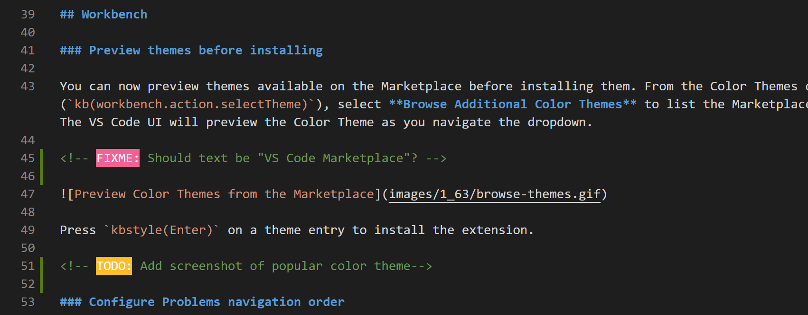
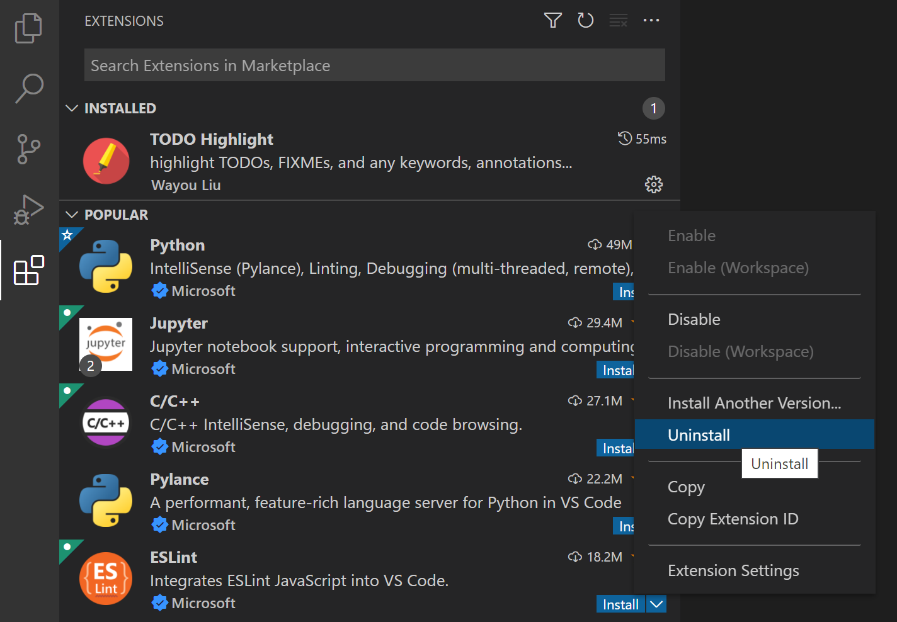
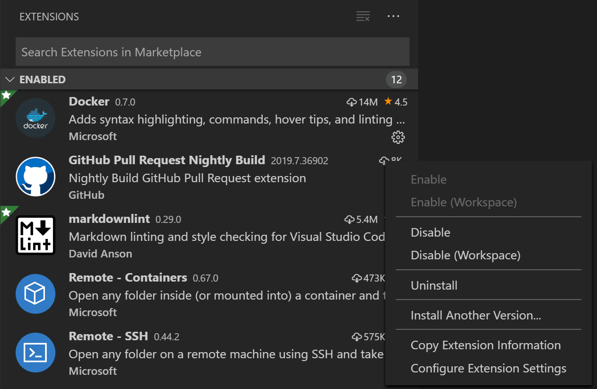
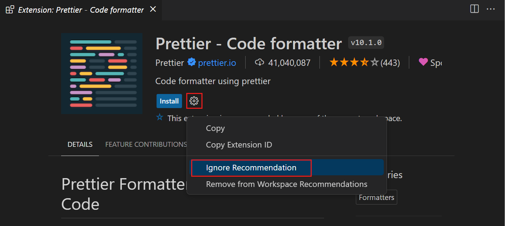

# 확장 마켓플레이스 {#extension-marketplace}

Visual Studio Code가 기본적으로 제공하는 기능은 시작에 불과합니다. VS Code 확장을 통해 개발 워크플로우를 지원하기 위한 언어, 디버거, 도구를 설치에 추가할 수 있습니다. VS Code의 풍부한 확장 플랫폼을 통해 확장 작성자는 VS Code UI에 직접 연결하고 VS Code가 사용하는 것과 동일한 API를 통해 기능을 제공할 수 있습니다. 이 문서에서는 [Visual Studio Code 마켓플레이스](https://marketplace.visualstudio.com/VSCode)에서 VS Code 확장을 찾고, 설치하고, 관리하는 방법을 설명합니다.

## 확장 찾아보기 {#browse-for-extensions}

VS Code 내에서 확장을 찾아보고 설치할 수 있습니다. VS Code 측면의 **Activity Bar**에서 확장 아이콘을 클릭하거나 **View: Extensions** 명령(`Ctrl+Shift+X`)을 사용하여 확장 뷰를 불러올 수 있습니다.


이렇게 하면 [VS Code 마켓플레이스](https://marketplace.visualstudio.com/VSCode)의 가장 인기 있는 VS Code 확장 목록이 표시됩니다.


목록의 각 확장에는 간단한 설명, 게시자, 다운로드 수, 5점 만점의 평가가 포함됩니다. 확장 항목을 선택하면 자세히 알아볼 수 있는 확장 세부 정보 페이지가 표시됩니다.

:::note
컴퓨터의 인터넷 접속이 프록시 서버를 통해 이루어지는 경우, 프록시 서버를 구성해야 합니다. 자세한 내용은 [프록시 서버 지원](/docs/setup/network.md#proxy-server-support)을 참조하세요.
:::

## 확장 설치하기 {#install-an-extension}

확장을 설치하려면 **Install** 버튼을 선택하세요. 설치가 완료되면 **Install** 버튼이 **Manage** 기어 버튼으로 변경됩니다.

특정 버전의 확장을 설치하려면 해당 확장을 마우스 오른쪽 버튼으로 클릭하고 **Install Another Version**을 선택하세요. 그런 다음 사용 가능한 목록에서 버전을 선택할 수 있습니다.

[설정 동기화](/docs/editor/settings-sync.md)가 활성화되어 있을 때, 여러 기기 간에 확장과 같은 VS Code 구성을 공유할 수 있습니다. 확장을 설치하되 기기 간에 동기화하지 않으려면, 확장을 마우스 오른쪽 버튼으로 클릭하고 **Install (Do not Sync)** 를 선택하세요.

### 확장 찾고 설치하기 {#find-and-install-an-extension}

예를 들어, 인기 있는 [TODO Highlight](https://marketplace.visualstudio.com/items?itemName=wayou.vscode-todo-highlight) 확장을 설치해보겠습니다. 이 확장은 소스 코드에서 'TODO:'와 'FIXME:' 같은 텍스트를 강조 표시하여 미완성 섹션을 빠르게 찾을 수 있게 해줍니다.



확장 뷰(`Ctrl+Shift+X`)에서 검색 상자에 'todo'를 입력하여 제목이나 메타데이터에 'todo'가 포함된 확장으로 마켓플레이스 결과를 필터링하세요. **TODO Highlight** 확장이 목록에 표시될 것입니다.


확장은 게시자와 확장 ID로 고유하게 식별됩니다. **TODO Highlight** 확장을 선택하면 확장 세부 정보 페이지가 표시되며, 여기서 확장 ID(이 경우 `wayou.vscode-todo-highlight`)를 확인할 수 있습니다. 유사한 이름의 확장이 여러 개 있는 경우 확장 ID를 아는 것이 도움이 될 수 있습니다.


**Install** 버튼을 선택하면 VS Code가 마켓플레이스에서 확장을 다운로드하고 설치합니다. 설치가 완료되면 **Install** 버튼이 **Manage** 기어 버튼으로 대체됩니다.


TODO Highlight 확장의 동작을 확인하려면 소스 코드 파일을 열고 'TODO:' 텍스트를 추가하면 텍스트가 강조 표시되는 것을 볼 수 있습니다.

TODO Highlight 확장은 명령 팔레트(`Ctrl+,`)에서 찾을 수 있는 **TODO-Highlight: List highlighted annotations**와 **TODO-Highlight: Toggle highlight** 명령을 제공합니다. **TODO-Highlight: Toggle highlight** 명령을 사용하면 강조 표시를 빠르게 비활성화하거나 활성화할 수 있습니다.


이 확장은 또한 설정 편집기(`kb(workbench.action.openSettings)`)에서 찾을 수 있는 동작 조정을 위한 설정을 제공합니다. 예를 들어, 텍스트 검색이 대소문자를 구분하지 않기를 원한다면 **Todohighlight: Is Case Sensitive** 설정의 체크를 해제할 수 있습니다.


확장이 원하는 기능을 제공하지 않는 경우, **Manage** 버튼 컨텍스트 메뉴에서 언제든지 확장을 **Uninstall**할 수 있습니다.



이것은 확장을 설치하고 사용하는 방법의 한 예시일 뿐입니다. VS Code 마켓플레이스에는 수백 개의 프로그래밍 언어와 작업을 지원하는 수천 개의 확장이 있습니다. [Java](https://marketplace.visualstudio.com/items?itemName=redhat.java), [Python](https://marketplace.visualstudio.com/items?itemName=ms-python.python), [Go](https://marketplace.visualstudio.com/items?itemName=golang.Go), [C++](https://marketplace.visualstudio.com/items?itemName=ms-vscode.cpptools)를 위한 완전한 기능을 갖춘 언어 지원부터 [GUID 생성](https://marketplace.visualstudio.com/items?itemName=nwallace.createGUID), [색상 테마](https://marketplace.visualstudio.com/items?itemName=PKief.material-icon-theme) 변경, 에디터에 [가상 반려동물](https://marketplace.visualstudio.com/items?itemName=tonybaloney.vscode-pets) 추가와 같은 간단한 확장까지 모든 것이 있습니다.

### 확장 세부 정보 {#extension-details}

확장 세부 정보 페이지에서 확장의 README를 읽고 다음 사항을 검토할 수 있습니다:

- **Feature Contributions** - 설정, 명령과 키보드 단축키, 언어 문법, 디버거 등 확장이 VS Code에 추가하는 항목
- **Changelog** - 사용 가능한 경우 확장 저장소의 CHANGELOG
- **Dependencies** - 확장이 다른 확장에 의존하는지 나열


확장이 Extension Pack인 경우, **Extension Pack** 섹션에는 팩을 설치할 때 설치될 확장들이 표시됩니다. [Extension Packs](/api/references/extension-manifest.md#extension-packs)는 별도의 확장들을 함께 묶어서 한 번에 쉽게 설치할 수 있게 해줍니다.


### 확장 뷰 필터 및 명령 {#extensions-view-filter-and-commands}

**Filter Extensions** 컨텍스트 메뉴로 확장 뷰를 필터링할 수 있습니다.


다음을 표시하는 필터가 있습니다:

- 업데이트할 수 있는 오래된 확장 목록
- 현재 활성화/비활성화된 확장 목록
- 작업 공간을 기반으로 한 추천 확장 목록
- 전역적으로 인기 있는 확장 목록

확장 목록을 **Install Count**, **Rating**, **Name**, **Published Date**, 또는 **Updated Date**를 기준으로 오름차순이나 내림차순으로 정렬할 수 있습니다. 확장 검색 필터에 대해 [아래](#extensions-view-filters)에서 더 자세히 알아볼 수 있습니다.

`...` **View and More Actions** 버튼을 통해 추가 확장 뷰 명령을 실행할 수 있습니다.


이 컨텍스트 메뉴를 통해 확장 업데이트를 제어하고, 모든 확장을 활성화하거나 비활성화하고, [Extension Bisect](https://code.visualstudio.com/blogs/2021/02/16/extension-bisect) 유틸리티를 사용하여 문제가 있는 확장 동작을 분리할 수 있습니다.

### 확장 검색하기 {#search-for-an-extension}

확장 뷰 상단의 검색 상자를 지우고 찾고자 하는 확장, 도구 또는 프로그래밍 언어의 이름을 입력할 수 있습니다.

예를 들어, 'python'을 입력하면 Python 언어 확장 목록이 표시됩니다:


찾고자 하는 확장의 정확한 식별자를 알고 있다면, `@id:` 접두사를 사용할 수 있습니다(예: `@id:vue.volar`). 추가로 결과를 필터링하거나 정렬하려면 아래에서 자세히 설명하는 [필터](#extensions-view-filters)와 [정렬](#sorting) 명령을 사용할 수 있습니다.

## 확장 관리하기 {#manage-extensions}

VS Code는 확장을 쉽게 관리할 수 있게 해줍니다. 확장 뷰, **Command Palette**(명령에는 **Extensions:** 접두사가 붙음) 또는 명령줄 스위치를 통해 확장을 설치, 비활성화, 업데이트, 제거할 수 있습니다.

### 설치된 확장 목록 보기 {#list-installed-extensions}

기본적으로 확장 뷰는 현재 설치된 확장과 추천되는 모든 확장을 표시합니다. **Command Palette**(`Ctrl+Shift+P`)에서 사용할 수 있는 **Extensions: Focus on Installed View** 명령이나 **More Actions**(`...`) 드롭다운 메뉴 > **Views** > **Installed**를 사용하여 검색 상자의 텍스트를 지우고 비활성화된 확장을 포함한 모든 설치된 확장의 목록을 표시할 수 있습니다.

### 확장 제거하기 {#uninstall-an-extension}

확장을 제거하려면 확장 항목 오른쪽에 있는 **Manage** 기어 버튼을 선택한 다음 드롭다운 메뉴에서 **Uninstall**을 선택합니다. 이렇게 하면 확장이 제거되고 확장 호스트를 다시 시작하라는 메시지(**Restart Extensions**)가 표시됩니다.



### 확장 비활성화하기 {#disable-an-extension}

확장을 영구적으로 제거하지 않고 일시적으로 비활성화하려면 확장 항목 오른쪽에 있는 기어 버튼을 클릭하면 됩니다. 확장을 전역적으로 또는 현재 작업 공간에서만 비활성화할 수 있습니다. 확장을 비활성화한 후에는 확장 호스트를 다시 시작하라는 메시지(**Restart Extensions**)가 표시됩니다.

모든 설치된 확장을 빠르게 비활성화하려면 **Command Palette**와 **More Actions**(`...`) 드롭다운 메뉴에 **Disable All Installed Extensions** 명령이 있습니다.

확장은 다시 활성화할 때까지 모든 VS Code 세션에서 비활성화된 상태로 유지됩니다.

### 확장 활성화하기 {#enable-an-extension}

마찬가지로 확장을 비활성화한 경우(목록의 **Disabled** 섹션에 있고 **_Disabled_**로 표시됨), 드롭다운 메뉴에서 **Enable** 또는 **Enable (Workspace)** 명령을 사용하여 다시 활성화할 수 있습니다.


**More Actions**(`...`) 드롭다운 메뉴에는 **Enable All Extensions** 명령도 있습니다.

### 확장 자동 업데이트 {#extension-auto-update}

VS Code는 확장 업데이트를 확인하고 자동으로 설치합니다. 업데이트 후에는 확장 호스트를 다시 시작하라는 메시지(**Restart Extensions**)가 표시됩니다.

확장을 수동으로 업데이트하는 것을 선호한다면, **Disable Auto Update for All Extensions** 명령이나 확장 뷰의 해당 작업을 사용하여 자동 업데이트를 비활성화할 수 있습니다. `setting(extensions.autoUpdate)` [설정](/docs/getstarted/settings.md)을 구성할 수도 있습니다. **Enable Auto Update for All Extensions** 명령을 사용하여 자동 업데이트를 다시 활성화할 수 있습니다.


개별 확장에 대한 자동 업데이트를 구성할 수도 있습니다. 확장을 마우스 오른쪽 버튼으로 클릭하고 **Auto Update** 항목을 토글하면 됩니다.

VS Code가 업데이트를 확인조차 하지 않기를 원한다면, `setting(extensions.autoCheckUpdates)` 설정을 false로 설정할 수 있습니다.

### 확장 수동으로 업데이트하기 {#update-an-extension-manually}

확장 자동 업데이트를 비활성화한 경우, `@updates` 필터를 사용하는 **Show Outdated Extensions** 명령을 사용하여 확장 업데이트를 빠르게 찾을 수 있습니다. 이렇게 하면 현재 설치된 확장에 대해 사용 가능한 모든 업데이트가 표시됩니다.

오래된 확장의 **Update** 버튼을 선택하세요. 업데이트가 설치되고 확장 호스트를 다시 시작하라는 메시지(**Restart Extensions**)가 표시됩니다. **Update All Extensions** 명령을 사용하여 오래된 모든 확장을 한 번에 업데이트할 수도 있습니다.

업데이트 자동 확인도 비활성화한 경우, **Check for Extension Updates** 명령을 사용하여 어떤 확장이 업데이트될 수 있는지 확인할 수 있습니다.

## 추천 확장 {#recommended-extensions}

`@recommended` [필터](#extensions-view-filters)를 설정하는 **Show Recommended Extensions**를 사용하여 추천 확장 목록을 볼 수 있습니다. 확장 추천은 다음 중 하나일 수 있습니다:

- **Workspace Recommendations** - 현재 작업 공간의 다른 사용자가 추천
- **Other Recommendations** - 최근에 열어본 파일을 기반으로 추천

프로젝트의 다른 사용자를 위한 [추천 작성](#workspace-recommended-extensions) 방법은 아래 섹션을 참조하세요.

### 추천 무시하기 {#ignoring-recommendations}

추천을 무시하려면 확장 항목을 선택하여 세부 정보 페이지를 열고 **Manage** 기어 버튼을 선택하여 컨텍스트 메뉴를 표시합니다. **Ignore Recommendation** 메뉴 항목을 선택하세요. 무시된 추천은 더 이상 추천되지 않습니다.



## 확장 구성하기 {#configuring-extensions}

VS Code 확장은 매우 다른 구성과 요구 사항을 가질 수 있습니다. 일부 확장은 설정 편집기에서 수정할 수 있는 [설정](/docs/getstarted/settings.md)을 VS Code에 제공합니다. 다른 확장은 자체 구성 파일을 가질 수 있습니다. 확장은 또한 컴파일러, 디버거, 명령줄 도구와 같은 추가 구성 요소의 설치와 설정이 필요할 수 있습니다. 확장 뷰 세부 정보 페이지에서 볼 수 있는 확장의 README를 참조하거나 세부 정보 페이지에서 확장 이름을 클릭하여 [VS Code 마켓플레이스](https://marketplace.visualstudio.com/VSCode)의 확장 페이지로 이동하세요. 많은 확장이 오픈 소스이며 마켓플레이스 페이지에 저장소 링크가 있습니다.

## 명령줄 확장 관리 {#command-line-extension-management}

VS Code의 자동화와 구성을 더 쉽게 하기 위해, [명령줄](/docs/editor/command-line.md)에서 확장을 나열, 설치, 제거할 수 있습니다. 확장을 식별할 때는 `publisher.extension` 형식의 전체 이름을 제공하세요(예: `ms-python.python`).

예시:

```bash
code --extensions-dir <dir>
    확장의 루트 경로를 설정합니다.
code --list-extensions
    설치된 확장을 나열합니다.
code --show-versions
    --list-extension 사용 시 설치된 확장의 버전을 표시합니다.
code --install-extension (<extension-id> | <extension-vsix-path>)
    확장을 설치합니다.
code --uninstall-extension (<extension-id> | <extension-vsix-path>)
    확장을 제거합니다.
code --enable-proposed-api (<extension-id>)
    확장을 위한 제안된 API 기능을 활성화합니다. 개별적으로 활성화할 하나 이상의 확장 ID를 받을 수 있습니다.
```

마켓플레이스 정보 아래의 확장 세부 정보 페이지에서 확장 ID를 볼 수 있습니다.


## 확장 뷰 필터 {#extensions-view-filters}

확장 뷰 검색 상자는 확장을 찾고 관리하는 데 도움이 되는 필터를 지원합니다. **Show Installed Extensions**와 **Show Recommended Extensions** 명령을 사용할 때 `@installed`와 `@recommended`와 같은 필터를 보았을 것입니다. 또한 인기도나 평가로 정렬하고 카테고리(예: 'Linters')와 태그(예: 'node')로 검색할 수 있는 필터도 있습니다. 확장 검색 상자에 `@`를 입력하고 제안을 탐색하면 모든 필터와 정렬 명령의 전체 목록을 볼 수 있습니다:


다음은 일부 확장 뷰 필터입니다:

- `@builtin` - VS Code와 함께 제공되는 확장을 표시합니다. 유형별로 그룹화됩니다(프로그래밍 언어, 테마 등).
- `@deprecated` - 더 이상 사용되지 않는 확장을 표시합니다.
- `@disabled` - 비활성화된 설치된 확장을 표시합니다.
- `@enabled` - 활성화된 설치된 확장을 표시합니다. 확장은 개별적으로 활성화/비활성화할 수 있습니다.
- `@featured` - 주목할 만한 확장을 표시합니다.
- `@installed` - 설치된 확장을 표시합니다.
- `@popular` - 인기 있는 확장을 표시합니다.
- `@recentlyPublished` - 최근에 마켓플레이스에 게시된 확장을 표시합니다.
- `@recommended` - 추천 확장을 표시합니다. 작업 공간별 또는 일반 사용으로 그룹화됩니다.
- `@updates` - 오래된 설치된 확장을 표시합니다. 마켓플레이스에서 새 버전을 사용할 수 있습니다.
- `@workspaceUnsupported` - 이 작업 공간에서 지원되지 않는 확장을 표시합니다.
- `@category` - 지정된 카테고리에 속하는 확장을 표시합니다. 다음은 지원되는 일부 카테고리입니다. 전체 목록을 보려면 `@category`를 입력하고 제안 목록의 옵션을 따르세요:
  - `@category:themes`
  - `@category:formatters`
  - `@category:linters`
  - `@category:snippets`

이러한 필터들은 결합할 수도 있습니다. 예를 들어: `@installed @category:themes`를 사용하여 설치된 모든 테마를 볼 수 있습니다.

필터를 제공하지 않으면 확장 뷰는 현재 설치된 확장과 추천 확장을 표시합니다.

### 정렬 {#sorting}

다음 값을 취할 수 있는 `@sort` 필터로 확장을 정렬할 수 있습니다:

- `installs` - 마켓플레이스 설치 횟수를 기준으로 내림차순 정렬합니다.
- `name` - 확장 이름을 기준으로 알파벳순 정렬합니다.
- `publishedDate` - 확장 게시 날짜를 기준으로 정렬합니다.
- `rating` - 마켓플레이스 평가(1-5 별)를 기준으로 내림차순 정렬합니다.
- `updateDate` - 확장 마지막 업데이트를 기준으로 정렬합니다.


### 카테고리와 태그 {#categories-and-tags}

확장은 기능을 설명하는 **Categories**와 **Tags**를 설정할 수 있습니다.


`category:`와 `tag:`를 사용하여 카테고리와 태그로 필터링할 수 있습니다.

지원되는 카테고리는: `[Azure, Data Science, Debuggers, Education, Extension Packs, Formatters, Keymaps, Language Packs, Linters, Machine Learning, Notebooks, Others, Programming Languages, SCM Providers, Snippets, Testing, Themes, Visualization]`입니다. 확장 검색 상자의 IntelliSense를 통해 접근할 수 있습니다:


카테고리 이름이 한 단어 이상인 경우 따옴표로 둘러싸야 합니다(예: `category:"SCM Providers"`).

태그는 아무 문자열이나 포함할 수 있으며 IntelliSense에서 제공되지 않으므로, 도움이 되는 태그를 찾으려면 마켓플레이스를 검토하세요.

## VSIX에서 설치하기 {#install-from-a-vsix}

`.vsix` 파일로 패키지된 VS Code 확장을 수동으로 설치할 수 있습니다. 확장 뷰 명령 드롭다운의 **Install from VSIX** 명령이나 **Command Palette**의 **Extensions: Install from VSIX** 명령을 사용하여 `.vsix` 파일을 지정하세요.

VS Code의 `--install-extension` 명령줄 스위치를 사용하여 `.vsix` 파일의 경로를 제공할 수도 있습니다.

```bash
code --install-extension myextension.vsix
```

명령줄에서 `--install-extension`을 여러 번 제공하여 한 번에 여러 확장을 설치할 수 있습니다.

:::note
VSIX를 통해 확장을 설치할 때는 기본적으로 해당 확장의 [자동 업데이트](#extension-auto-update)가 비활성화됩니다.
:::

확장 패키징과 게시에 대해 더 자세히 알아보고 싶다면, Extension API의 [확장 게시하기](/api/working-with-extensions/publishing-extension.md) 문서를 참조하세요.

## 작업 공간 추천 확장 {#workspace-recommended-extensions}

좋은 확장 세트는 특정 작업 공간이나 프로그래밍 언어로 작업하는 것을 더 생산적으로 만들 수 있으며, 이 목록을 팀이나 동료와 공유하고 싶을 것입니다. **Extensions: Configure Recommended Extensions (Workspace Folder)** 명령을 사용하여 작업 공간에 대한 추천 확장 목록을 만들 수 있습니다.

단일 폴더 작업 공간에서 이 명령은 작업 공간 `.vscode` 폴더에 위치한 `extensions.json` 파일을 만듭니다. 여기에 확장 식별자 목록(\{publisherName\}.\{extensionName\})을 추가할 수 있습니다.

[다중 루트 작업 공간](/docs/editor/multi-root-workspaces.md)에서는 이 명령이 `extensions.recommendations` 아래에 확장을 나열할 수 있는 `.code-workspace` 파일을 엽니다. **Extensions: Configure Recommended Extensions (Workspace Folder)** 명령을 사용하여 다중 루트 작업 공간의 개별 폴더에도 확장 추천을 추가할 수 있습니다.

`extensions.json`의 예시는 다음과 같습니다:

```json
{
  "recommendations": ["dbaeumer.vscode-eslint", "esbenp.prettier-vscode"]
}
```

이는 린터 확장과 코드 포맷터 확장을 추천합니다.

확장은 게시자 식별자와 확장 식별자 `publisher.extension`를 사용하여 식별됩니다. 확장의 세부 정보 페이지에서 이름을 볼 수 있습니다. VS Code는 이러한 파일 내에서 설치된 확장에 대한 자동 완성을 제공합니다.

.

VS Code는 작업 공간이 처음 열릴 때 추천 확장을 설치하라는 메시지를 사용자에게 표시합니다. 사용자는 **Extensions: Show Recommended Extensions** 명령으로 목록을 검토할 수도 있습니다.


## 다음 단계 {#next-steps}

다음은 흥미로울 만한 몇 가지 주제입니다.

- [Extension API](/api) - VS Code 확장 API에 대해 배우기 시작하세요.
- [Your First Extension](/api/get-started/your-first-extension.md) - 간단한 Hello World 확장을 만들어보세요.
- [Publishing to the Marketplace](/api/working-with-extensions/publishing-extension.md) - 자신의 확장을 VS Code 마켓플레이스에 게시하세요.

## 자주 묻는 질문 {#common-questions}

### 확장은 어디에 설치되나요? {#where-are-extensions-installed}

확장은 사용자별 확장 폴더에 설치됩니다. 플랫폼에 따라 위치는 다음과 같습니다:

- **Windows** `%USERPROFILE%\.vscode\extensions`
- **macOS** `~/.vscode/extensions`
- **Linux** `~/.vscode/extensions`

`--extensions-dir <dir>` 명령줄 [옵션](/docs/editor/command-line.md)으로 VS Code를 실행하여 위치를 변경할 수 있습니다.

### 확장을 설치하려고 할 때마다 connect ETIMEDOUT 오류가 발생합니다 {#whenever-i-try-to-install-any-extension}

이 오류는 컴퓨터가 프록시 서버를 통해 인터넷에 접속하는 경우 발생할 수 있습니다. 자세한 내용은 설정 주제의 [프록시 서버 지원](/docs/setup/network.md#proxy-server-support) 섹션을 참조하세요.

### 마켓플레이스에서 직접 확장을 다운로드할 수 있나요? {#can-i-download-an-extension-directly}

일부 사용자는 마켓플레이스에서 확장을 한 번 다운로드하고 로컬 공유에서 여러 VS Code 인스턴스에 설치하는 것을 선호합니다. 이는 연결 문제가 있거나 개발 팀이 고정된 확장 세트를 사용하려는 경우 유용합니다.

확장을 다운로드하려면 확장 뷰에서 검색하고, 결과에서 확장을 마우스 오른쪽 버튼으로 클릭한 다음 **Download VSIX**를 선택하세요.

note:::
다운로드 옵션은 VS Code 릴리스 1.96부터 사용 가능하며, 아직 설치되지 않은 확장에 대해서만 사용할 수 있습니다.
:::

### VS Code가 확장 추천을 제공하지 않도록 할 수 있나요? {#can-i-stop-vs-code-from-providing-extension-recommendations}

예, 확장 뷰의 **RECOMMENDED** 섹션이나 알림을 통해 VS Code가 확장 추천을 표시하지 않도록 하려면 다음 설정을 수정할 수 있습니다:

- `setting(extensions.showRecommendationsOnlyOnDemand)` - true로 설정하여 **RECOMMENDED** 섹션을 제거합니다.
- `setting(extensions.ignoreRecommendations)` - true로 설정하여 확장 추천 알림을 무시합니다.

**Show Recommended Extensions** 명령은 추천을 보고 싶을 때 항상 사용할 수 있습니다.

### 마켓플레이스의 확장을 신뢰할 수 있나요? {#can-i-trust-extensions}

마켓플레이스는 각 확장 패키지가 게시될 때 안전성을 확인하기 위해 멀웨어 검사를 실행합니다. 이 검사는 여러 안티바이러스 엔진을 사용하여 각 새로운 확장과 확장 업데이트에 대해 실행됩니다. 검사가 완전히 통과될 때까지 확장은 공개 사용을 위해 마켓플레이스에 게시되지 않습니다.

마켓플레이스는 또한 Microsoft와 RedHat과 같은 공식 게시자나 GitHub Copilot과 같은 인기 있는 확장 이름에 대해 확장 작성자가 이름을 도용하는 것을 방지합니다.

악성 확장이 신고되어 확인되거나 확장 종속성에서 취약점이 발견되면:

1. 해당 확장은 마켓플레이스에서 제거됩니다.
2. 확장이 제거 목록에 추가되어 설치된 경우 VS Code에 의해 자동으로 제거됩니다.

마켓플레이스는 또한 설치할 확장에 대해 정보에 기반한 결정을 내릴 수 있도록 다음과 같은 리소스를 제공합니다:

- **평가 및 리뷰** - 다른 사람들이 확장에 대해 어떻게 생각하는지 읽어보세요.
- **Q & A** - 기존 질문과 게시자의 응답성을 검토하세요. 확장의 게시자와 소통하여 우려 사항을 논의할 수도 있습니다.
- **이슈, 저장소, 라이선스** - 게시자가 이러한 정보를 제공했는지, 기대하는 지원이 있는지 확인하세요.
- **인증된 게시자** - 게시자 이름과 도메인 옆의 파란색 체크 마크를 추가적인 신뢰 신호로 사용하세요. 이는 게시자가 마켓플레이스에 도메인 소유권을 증명했다는 것을 나타냅니다. 또한 게시자의 존재와 마켓플레이스에서 최소 6개월 이상의 좋은 평판이 있다는 것을 마켓플레이스가 확인했음을 보여줍니다.


의심스러운 확장이 있다면, 확장 **More Info** 섹션 하단의 **Report Abuse** 링크를 사용하여 마켓플레이스에 해당 확장을 신고할 수 있습니다.

### VS Code가 확장 서명을 확인할 수 없습니다 {#the-extension-signature-cannot-be-verified}

Visual Studio 마켓플레이스는 게시될 때 모든 확장에 서명합니다. VS Code는 확장을 설치할 때 이 서명을 확인하여 확장 패키지의 무결성과 출처를 확인합니다.

확장을 설치할 때 다음과 같은 오류 메시지가 표시될 수 있습니다: `Cannot install extension because Visual Studio Code cannot verify the extension signature`.

이 오류는 지원되지 않는 환경이나 (가능성은 낮지만) 패키지 무결성 문제 등 다양한 이유로 발생할 수 있습니다. 이 오류가 발생하면 '무시하고 설치'하기 전에 주의를 기울여야 합니다.

[Visual Studio 마켓플레이스 팀](mailto:vsmarketplace@microsoft.com?subject=Extension%20Signature%20Verification%20Issue)에 연락하여 문제를 보고하는 것이 좋습니다. 확장 ID를 포함하도록 하세요. 확장 서명 확인을 비활성화하려면 `extensions.verifySignature` 설정을 사용할 수 있습니다.

### 원격 창에 연결할 때 확장이 동기화되지 않습니다 {#my-extensions-dont-synchronize}

[설정 동기화](/docs/editor/settings-sync.md)를 사용하면 설정, 키바인딩, 설치된 확장과 같은 Visual Studio Code 구성을 기기 간에 공유할 수 있어 항상 선호하는 설정으로 작업할 수 있습니다.

VS Code는 확장을 [원격](/docs/remote/remote-overview.md) 창으로 또는 원격 창에서 동기화하지 않습니다(예: SSH, 개발 컨테이너(devcontainer) 또는 WSL에 연결된 경우).

### 조직에서 특정 확장을 허용하거나 차단할 수 있나요? {#can-i-allow-or-block-specific-extensions}

`extensions.allowed` 애플리케이션 설정을 구성하여 조직에서 설치할 수 있는 확장을 제어할 수 있습니다. 설정이 구성되지 않은 경우 모든 확장이 허용됩니다. 설정이 구성된 경우 목록에 없는 모든 확장은 설치가 차단됩니다.

[허용된 확장 구성](/docs/setup/enterprise.md#configure-allowed-extensions)에 대한 자세한 내용을 확인하세요.
