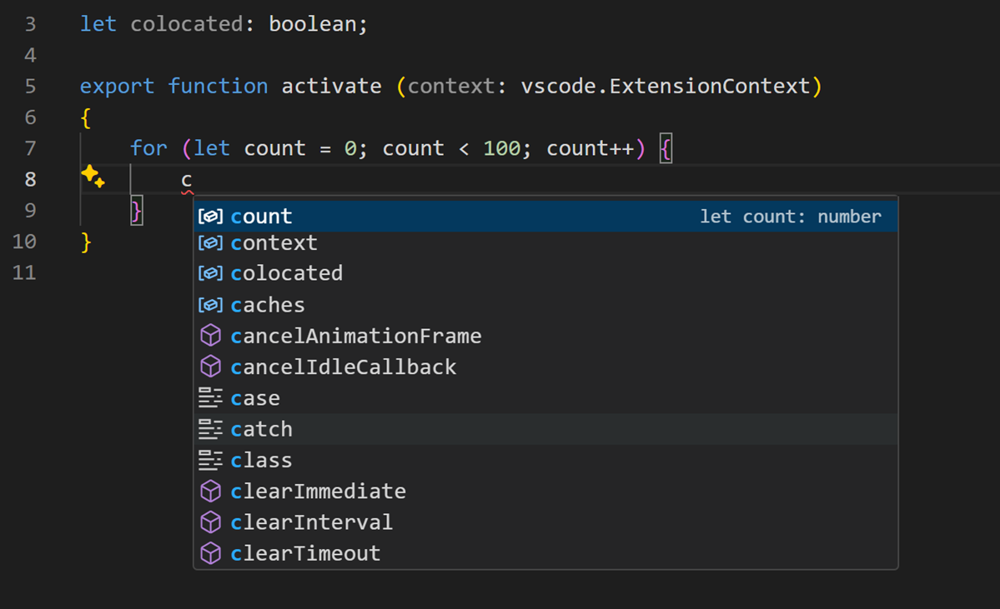
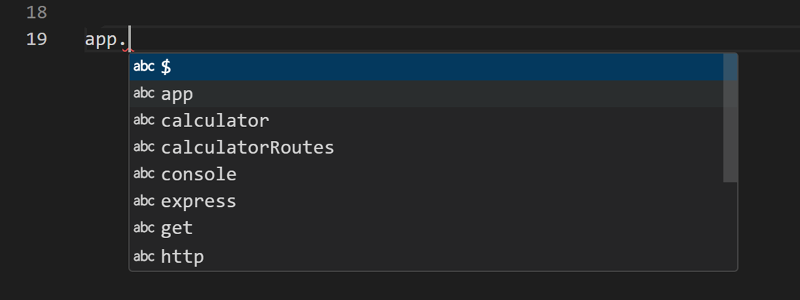

# IntelliSense {#intellisense}

IntelliSense는 코드 완성, 매개변수 정보, 빠른 정보 및 멤버 목록을 포함한 다양한 코드 편집 기능을 나타내는 일반적인 용어입니다. IntelliSense 기능은 때때로 "코드 완성", "콘텐츠 지원" 및 "코드 힌팅"과 같은 다른 이름으로 불리기도 합니다.


## 프로그래밍 언어에 대한 IntelliSense {#intellisense-for-your-programming-language}

Visual Studio Code IntelliSense는 JavaScript, TypeScript, JSON, HTML, CSS, SCSS 및 Less에 대해 기본적으로 제공됩니다. VS Code는 모든 프로그래밍 언어에 대해 단어 기반 완성을 지원하지만, 언어 확장을 설치하여 더 풍부한 IntelliSense를 구성할 수도 있습니다.

아래는 [Marketplace](https://marketplace.visualstudio.com/vscode)에서 가장 인기 있는 언어 확장입니다. 아래 확장 타일을 선택하여 설명과 리뷰를 읽고 자신에게 가장 적합한 확장을 결정하세요.

<div class="marketplace-extensions-languages-curated"></div>

## IntelliSense 기능 {#intellisense-features}

VS Code IntelliSense 기능은 언어 서비스에 의해 제공됩니다. 언어 서비스는 언어 의미론과 소스 코드 분석을 기반으로 지능형 코드 완성을 제공합니다. 언어 서비스가 가능한 완성을 알고 있다면, IntelliSense 제안이 입력할 때 나타납니다. 문자를 계속 입력하면 멤버 목록(변수, 메서드 등)이 입력한 문자만 포함하도록 필터링됩니다. `Tab` 또는 `Enter`를 누르면 선택한 멤버가 삽입됩니다.

`Ctrl+Space`를 입력하거나 JavaScript에서 점 문자(`.`)와 같은 트리거 문자를 입력하여 모든 편집기 창에서 IntelliSense를 트리거할 수 있습니다.


:::tip
제안 위젯은 CamelCase 필터링을 지원하므로 메서드 이름에서 대문자로 된 문자를 입력하여 제안을 제한할 수 있습니다. 예를 들어, "cra"를 입력하면 "createApplication"이 빠르게 나타납니다.
:::

원하는 경우 입력할 때 IntelliSense를 끌 수 있습니다. 아래의 [IntelliSense 사용자 정의](/docs/editor/intellisense.md#customizing-intellisense)를 참조하여 VS Code의 IntelliSense 기능을 비활성화하거나 사용자 정의하는 방법을 알아보세요.

언어 서비스에서 제공하는 대로 각 메서드에 대한 **quick info**를 볼 수 있습니다. `Ctrl+Space`를 누르거나 정보 아이콘을 클릭하면 메서드에 대한 문서가 확장됩니다. 확장된 문서는 그대로 유지되며 목록을 탐색할 때 업데이트됩니다. 다시 `Ctrl+Space`를 누르거나 닫기 아이콘을 클릭하여 닫을 수 있습니다.


메서드를 선택한 후에는 **parameter info**가 제공됩니다.


적용 가능한 경우, 언어 서비스는 빠른 정보 및 메서드 서명에 기본 유형을 표시합니다. 위 이미지에서 여러 `any` 유형을 볼 수 있습니다. JavaScript는 동적이며 유형을 필요로 하거나 강제하지 않기 때문에 `any`는 변수가 모든 유형일 수 있음을 나타냅니다.

## 완성 유형 {#types-of-completions}

아래 JavaScript 코드는 IntelliSense 완성을 보여줍니다. IntelliSense는 추론된 제안과 프로젝트의 전역 식별자를 모두 제공합니다. 추론된 기호가 먼저 표시되고, 그 다음에 전역 식별자가 표시됩니다(Word 아이콘으로 표시됨).


VS Code IntelliSense는 언어 서버 제안, 스니펫 및 간단한 단어 기반 텍스트 완성을 포함한 다양한 유형의 완성을 제공합니다.

| 아이콘                                                                                     | 이름           | 기호 유형                           |
| ------------------------------------------------------------------------------------------ | -------------- | ----------------------------------- |
|                                        | 메서드 및 함수 | `method`, `function`, `constructor` |
|                                        | 변수           | `variable`                          |
|                                           | 필드           | `field`                             |
|                                  | 유형 매개변수  | `typeParameter`                     |
|                                            | 상수           | `constant`                          |
|                                                | 클래스         | `class`                             |
|                                        | 인터페이스     | `interface`                         |
|                                         | 구조체         | `struct`                            |
|                                             | 이벤트         | `event`                             |
|                                          | 연산자         | `operator`                          |
|                                              | 모듈           | `module`                            |
|                                               | 속성 및 속성   | `property`                          |
|                                      | 값 및 열거형   | `value`, `enum`                     |
|                                              | 참조           | `reference`                         |
|                                              | 키워드         | `keyword`                           |
|                                                | 파일           | `file`                              |
|                                                     | 폴더           | `folder`                            |
|                                           | 색상           | `color`                             |
|                                                  | 단위           | `unit`                              |
|  | 스니펫 접두사  | `snippet`                           |
|                                            | 단어           | `text`                              |

## IntelliSense 사용자 정의 {#customizing-intellisense}

설정 및 키 바인딩에서 IntelliSense 환경을 사용자 정의할 수 있습니다.

### 설정 {#settings}

아래에 표시된 설정은 기본 설정입니다. [사용자 및 작업 영역 설정](/docs/getstarted/settings.md)에 설명된 대로 `settings.json` 파일에서 이러한 설정을 변경할 수 있습니다.

```javascript
{
    // 빠른 제안이 입력 중에 표시될지 여부를 제어합니다.
    "editor.quickSuggestions": {
        "other": true,
        "comments": false,
        "strings": false
    },

    // 제안이 커밋 문자에서 수락될지 여부를 제어합니다. 예를 들어, JavaScript에서 세미콜론(`;`)은 제안을 수락하고 해당 문자를 입력하는 커밋 문자가 될 수 있습니다.
    "editor.acceptSuggestionOnCommitCharacter": true,

    // 'Tab' 외에도 'Enter'에서 제안이 수락될지 여부를 제어합니다. 새 줄 삽입과 제안 수락 간의 모호성을 피하는 데 도움이 됩니다. 'smart' 값은 텍스트 변경이 있을 때만 Enter로 제안을 수락합니다.
    "editor.acceptSuggestionOnEnter": "on",

    // 빠른 제안이 표시될 때까지의 지연 시간을 밀리초로 제어합니다.
    "editor.quickSuggestionsDelay": 10,

    // 트리거 문자를 입력할 때 제안이 자동으로 표시될지 여부를 제어합니다.
    "editor.suggestOnTriggerCharacters": true,

    // tab을 누르면 가장 좋은 제안이 삽입되고 tab이 다른 제안을 순환할지 여부를 제어합니다.
    "editor.tabCompletion": "off",

    // 제안 정렬이 커서 근처에 나타나는 단어를 선호할지 여부를 제어합니다.
    "editor.suggest.localityBonus": true,

    // 제안 목록을 표시할 때 제안이 미리 선택되는 방식을 제어합니다.
    "editor.suggestSelection": "first",

    // 단어 기반 제안을 활성화합니다.
    "editor.wordBasedSuggestions": "matchingDocuments",

    // 매개변수 힌트를 활성화합니다.
    "editor.parameterHints.enabled": true,
}
```

### 탭 완성 {#tab-completion}

편집기는 `Tab`을 누를 때 가장 일치하는 완성을 삽입하는 "탭 완성"을 지원합니다. 이는 제안 위젯이 표시되든 아니든 상관없이 작동합니다. 또한, 제안을 삽입한 후 `Tab`을 누르면 다음으로 가장 좋은 제안이 삽입됩니다.


기본적으로 탭 완성은 비활성화되어 있습니다. `editor.tabCompletion` 설정을 사용하여 활성화할 수 있습니다. 다음 값이 존재합니다:

- `off` - (기본값) 탭 완성이 비활성화됩니다.
- `on` - 모든 제안에 대해 탭 완성이 활성화되며 반복 호출 시 다음으로 가장 좋은 제안이 삽입됩니다.
- `onlySnippets` - 탭 완성은 현재 줄 접두사와 일치하는 정적 스니펫만 삽입합니다.

### 위치 기반 우선순위 {#locality-bonus}

제안의 정렬은 확장 정보와 현재 입력 중인 단어와의 일치 정도에 따라 다릅니다. 또한, `editor.suggest.localityBonus` 설정을 사용하여 커서 위치에 더 가까운 제안을 부스트하도록 편집기에 요청할 수 있습니다.



위 이미지에서 `count`, `context` 및 `colocated`가 나타나는 범위(루프, 함수, 파일)를 기준으로 정렬된 것을 볼 수 있습니다.

### 제안 선택 {#suggestion-selection}

기본적으로 VS Code는 제안 목록에서 첫 번째 제안을 미리 선택합니다. 다른 동작을 원한다면, 예를 들어 제안 목록에서 가장 최근에 사용한 항목을 항상 선택하려면 `editor.suggestSelection` 설정을 사용할 수 있습니다.

사용 가능한 `editor.suggestSelection` 값은 다음과 같습니다:

- `first` - (기본값) 항상 목록의 맨 위 항목을 선택합니다.
- `recentlyUsed` - 접두사(선택할 유형)가 다른 항목을 선택하지 않는 한 이전에 사용한 항목이 선택됩니다.
- `recentlyUsedByPrefix` - 해당 제안을 완료한 이전 접두사를 기준으로 항목을 선택합니다.

가장 최근에 사용한 항목을 선택하는 것은 동일한 완성을 여러 번 빠르게 삽입할 수 있으므로 매우 유용합니다.

"선택할 유형"은 현재 접두사(대략 커서 왼쪽의 텍스트)가 제안을 필터링하고 정렬하는 데 사용된다는 것을 의미합니다. 이 경우 `recentlyUsed`의 결과와 다를 때 우선 순위가 부여됩니다.

마지막 옵션인 `recentlyUsedByPrefix`를 사용할 때, VS Code는 특정 접두사(부분 텍스트)에 대해 선택된 항목을 기억합니다. 예를 들어, `co`를 입력하고 `console`을 선택한 경우 다음에 `co`를 입력하면 `console` 제안이 미리 선택됩니다. 이를 통해 `co` -> `console` 및 `con` -> `const`와 같이 다양한 접두사를 빠르게 매핑할 수 있습니다.

### 제안에서 스니펫 {#snippets-in-suggestions}

기본적으로 VS Code는 하나의 위젯에서 스니펫과 완성 제안을 표시합니다. `editor.snippetSuggestions` 설정을 사용하여 동작을 제어할 수 있습니다. 제안 위젯에서 스니펫을 제거하려면 값을 `"none"`으로 설정하세요. 스니펫을 보고 싶다면 제안에 상대적인 순서를 지정할 수 있습니다. 맨 위(`"top"`), 맨 아래(`"bottom"`), 또는 알파벳 순서로 인라인(`"inline"`)입니다. 기본값은 `"inline"`입니다.

### 키 바인딩 {#key-bindings}

아래에 표시된 키 바인딩은 기본 키 바인딩입니다. [키 바인딩](/docs/getstarted/keybindings.md)에 설명된 대로 `keybindings.json` 파일에서 이를 변경할 수 있습니다.

:::note
IntelliSense와 관련된 키 바인딩이 더 많이 있습니다. **Keyboard Shortcuts**(**File** > **Preferences** > **Keyboard Shortcuts**)를 열고 "suggest"를 검색하세요.
:::

```json
[
  {
    "key": "ctrl+space",
    "command": "editor.action.triggerSuggest",
    "when": "editorHasCompletionItemProvider && editorTextFocus && !editorReadonly"
  },
  {
    "key": "ctrl+space",
    "command": "toggleSuggestionDetails",
    "when": "editorTextFocus && suggestWidgetVisible"
  },
  {
    "key": "ctrl+alt+space",
    "command": "toggleSuggestionFocus",
    "when": "editorTextFocus && suggestWidgetVisible"
  }
]
```

## AI로 완성 향상 {#enhance-completions-with-ai}

VS Code에서 코드 줄 또는 전체 함수에 대한 제안, 빠른 문서 생성 및 테스트와 같은 코드 관련 아티팩트 생성 지원과 같은 인공지능(AI)을 사용하여 코딩을 향상시킬 수 있습니다.

[GitHub Copilot](https://copilot.github.com/)은 더 빠르고 스마트하게 코드를 작성할 수 있도록 도와주는 AI 기반 코드 완성 도구입니다. VS Code에서 [GitHub Copilot 확장](https://marketplace.visualstudio.com/items?itemName=GitHub.copilot)을 사용하여 코드를 생성하거나 생성된 코드에서 배울 수 있습니다.

[](https://marketplace.visualstudio.com/items?itemName=GitHub.copilot)

[Copilot 문서](/docs/editor/github-copilot.md)에서 Copilot을 시작하는 방법에 대해 자세히 알아볼 수 있습니다.

## 문제 해결 {#troubleshooting}

IntelliSense가 작동을 멈춘 경우, 언어 서비스가 실행되지 않을 수 있습니다. VS Code를 다시 시작하면 이 문제가 해결될 수 있습니다. 언어 확장을 설치한 후에도 여전히 IntelliSense 기능이 누락된 경우, 해당 언어 확장의 리포지토리에 이슈를 열어보세요.

:::tip
JavaScript IntelliSense 구성 및 문제 해결에 대해서는 [JavaScript 문서](/docs/languages/javascript.md#intellisense)를 참조하세요.
:::

특정 언어 확장이 모든 VS Code IntelliSense 기능을 지원하지 않을 수 있습니다. 지원되는 내용을 확인하려면 확장의 README를 검토하세요. 언어 확장에 문제가 있다고 생각되면, [VS Code Marketplace](https://marketplace.visualstudio.com/vscode)를 통해 확장의 세부 정보 페이지로 이동하여 **Support** 링크를 선택하면 확장에 대한 이슈 리포지토리를 찾을 수 있습니다.

## 다음 단계 {#next-steps}

IntelliSense는 VS Code의 강력한 기능 중 하나일 뿐입니다. 자세히 알아보려면 계속 읽어보세요:

- [JavaScript](/docs/languages/javascript.md) - JavaScript 개발을 최대한 활용하고 IntelliSense를 구성하는 방법을 알아보세요.
- [Node.js](/docs/nodejs/nodejs-tutorial.md) - Node.js 워크스루에서 IntelliSense가 작동하는 예를 확인하세요.
- [디버깅](/docs/editor/debugging.md) - 애플리케이션 디버깅을 설정하는 방법을 알아보세요.
- [언어 확장 만들기](/api/language-extensions/programmatic-language-features.md) - 새로운 프로그래밍 언어에 대한 IntelliSense를 추가하는 확장을 만드는 방법을 알아보세요.
- [VS Code에서 GitHub Copilot 사용](/docs/editor/github-copilot.md) - GitHub Copilot을 사용하여 AI로 코딩을 향상시키는 방법을 알아보세요.

## 자주 묻는 질문 {#common-questions}

### 왜 제안이 표시되지 않나요? {#why-am-i-not-getting-any-suggestions}


이 문제는 다양한 이유로 발생할 수 있습니다. 먼저 VS Code를 다시 시작해 보세요. 문제가 지속되면 언어 확장의 문서를 참조하세요. JavaScript 특정 문제 해결에 대해서는 [JavaScript 언어 주제](/docs/languages/javascript.md#intellisense)를 참조하세요.

### 왜 메서드 및 변수 제안이 표시되지 않나요? {#why-am-i-not-seeing-method-and-variable-suggestions}



이 문제는 JavaScript에서 타입 선언(타이핑) 파일이 누락되어 발생합니다. 대부분의 일반적인 JavaScript 라이브러리는 선언 파일을 포함하거나 타입 선언 파일을 사용할 수 있습니다. 사용 중인 라이브러리에 해당하는 npm 또는 yarn 패키지를 설치하세요. [JavaScript 작업](/docs/nodejs/working-with-javascript.md#intellisense) 문서에서 IntelliSense에 대해 자세히 알아보세요. 다른 언어의 경우 확장의 문서를 참조하세요.
