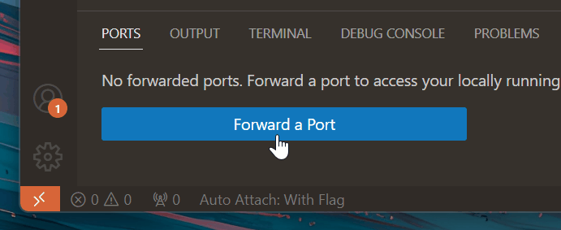
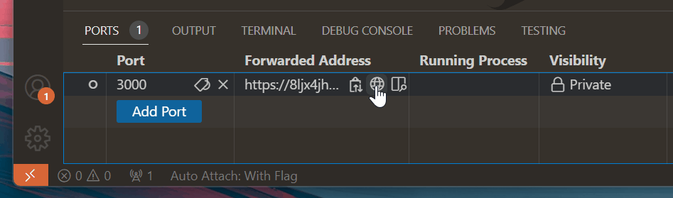

# 로컬 포트 포워딩 {#local-port-forwarding}

포트 포워딩 지원은 [Microsoft dev tunnels](https://learn.microsoft.com/azure/developer/dev-tunnels/overview)를 통해 Visual Studio Code에 내장되어 있으며, 확장이 필요하지 않습니다. 로컬 웹 서비스를 실행할 때 **Ports** 뷰를 사용하여 인터넷을 통해 다른 사람들이 서비스에 접근할 수 있게 할 수 있습니다.

## 로컬 포트 포워딩 사용 방법 {#how-to-use-local-port-forwarding}

먼저, 포워딩할 서비스를 준비해야 합니다. 아직 서비스가 없지만 Node.js가 설치되어 있다면, 다음 명령어를 실행하여 포트 3000에서 서버를 시작할 수 있습니다:

```bash
npx serve
```

그런 다음, 패널 영역의 **Ports** 뷰로 이동하여 (**Ports: Focus on Ports View**) **Forward a Port**를 선택합니다.



GitHub에 로그인한 적이 없다면 로그인하라는 메시지가 표시됩니다. 그런 다음 포워딩할 포트를 입력합니다. 위 명령어를 사용한 기본 포트는 3000입니다. 입력 후, 포트 포워딩 시스템이 시작되고 **Ports** 뷰가 업데이트되어 포워딩된 포트와 **Forwarded Address**를 표시합니다.



**Forwarded Address** 위에 마우스를 올리면 주소를 복사하거나 브라우저에서 열거나 인에디터 미리보기를 여는 인라인 작업을 사용할 수 있습니다.

기본적으로 포워딩된 포트는 **Private**입니다. URL로 이동하면 VS Code에서 포트 포워딩 프로세스를 시작할 때 사용한 동일한 GitHub 계정으로 로그인해야 합니다. 포트에서 마우스 오른쪽 버튼을 클릭하고 **Port Visibility > Public**을 선택하여 가시성을 변경할 수 있습니다. **Public** 포트는 로그인할 필요가 없습니다.

## 자주 묻는 질문 {#common-questions}

### 원격 머신에 연결된 경우 로컬 서비스를 어떻게 포워딩하나요? {#how-do-i-forward-local-services-if-im-connected-to-a-remote-machine}

현재 포트 포워딩은 로컬에서 실행 중인 서비스를 노출하는 데만 작동합니다. 아직 원격 연결에서는 작동하지 않지만, 앞으로는 작동할 것으로 예상됩니다.

시나리오에 따라 VS Code [Remote - Tunnels](https://marketplace.visualstudio.com/items?itemName=ms-vscode.remote-server) 확장을 사용하여 원격 머신에 터널링할 수 있습니다. 자세한 내용은 [Remote - Tunnels 문서](/docs/remote/tunnels.md)에서 확인할 수 있습니다.

### 포워딩된 포트는 어떻게 보안이 유지되나요? {#how-are-forwarded-ports-secured}

기본적으로 터널을 호스팅하고 연결하는 것은 각 끝에서 동일한 GitHub 또는 Microsoft 계정으로 인증이 필요합니다. 두 경우 모두 VS Code는 Azure에 호스팅된 서비스에 아웃바운드 연결을 합니다. 일반적으로 방화벽 변경이 필요하지 않으며, VS Code는 네트워크 리스너를 설정하지 않습니다.

그러나 **Public** 포트를 열면 링크를 가진 모든 사용자가 포워딩된 서비스에 접근할 수 있습니다. 그러한 포트를 통해 기밀 정보나 보안이 취약한 서비스를 호스팅하지 않도록 주의해야 합니다.

기본 dev tunnels 서비스의 보안에 대한 자세한 내용은 [문서](https://learn.microsoft.com/azure/developer/dev-tunnels/security)에서 확인할 수 있습니다.

### 포트 포워딩에 어떤 제한이 있나요? {#what-limits-are-there-on-port-forwarding}

포트 포워딩에 사용되는 대역폭의 양과 활성화된 머신의 수에는 제한이 있으며, 이는 시간이 지남에 따라 변경될 수 있습니다. 터널 사용 제한에 대한 자세한 내용은 [Remote-Tunnels](https://aka.ms/vscode-dev-tunnel-limit) 문서에서 확인할 수 있습니다.

### 조직 전체에서 정책을 구성할 수 있나요? {#can-i-configure-policies-across-my-organization}

포트 포워딩에 대한 접근을 제어하려는 조직의 일원이라면, 도메인 `global.rel.tunnels.api.visualstudio.com`에 대한 접근을 허용하거나 거부하여 이를 수행할 수 있습니다.

Windows 장치를 사용하는 사용자에게는 dev tunnels에 대한 그룹 정책 설정을 구성한 후 배포할 수도 있습니다. 자세한 내용은 [dev tunnels 문서](https://learn.microsoft.com/azure/developer/dev-tunnels/policies)에서 확인할 수 있습니다.