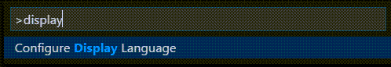
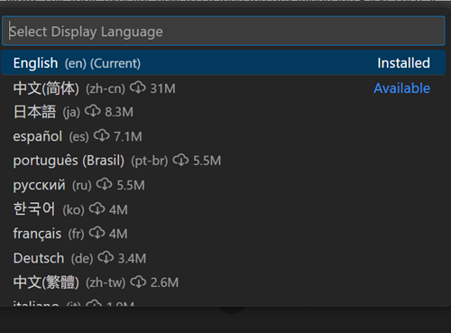
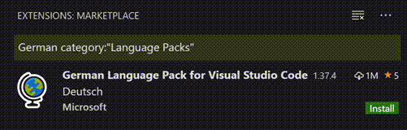

# 디스플레이 언어 {#display-language}

Visual Studio Code는 기본적으로 영어를 디스플레이 언어로 제공하며, 다른 [언어들](#available-locales)은 [Marketplace](https://marketplace.visualstudio.com/search?target=VSCode&category=Language%20Packs&sortBy=Installs)에서 제공하는 언어 팩 [확장 프로그램](/docs/editor/extension-marketplace.md)에 의존합니다.

VS Code는 운영 체제의 UI 언어를 감지하고 Marketplace에서 사용 가능한 경우 적절한 언어 팩을 설치하도록 안내합니다. 아래는 중국어 간체 언어 팩을 추천하는 예시입니다:


언어 팩 확장 프로그램을 설치하고 재시작하라는 메시지에 따르면, VS Code는 운영 체제의 UI 언어와 일치하는 언어 팩을 사용합니다.

:::note
이 문서는 프랑스어나 중국어와 같은 언어 팩을 통해 VS Code UI의 디스플레이 언어를 변경하는 방법을 설명합니다. C++ 또는 Java와 같은 프로그래밍 언어 지원을 추가하려면 문서의 [프로그래밍 언어](/docs/languages/overview.md) 섹션을 참조하세요.
:::

## 디스플레이 언어 변경하기 {#changing-the-display-language}

**Configure Display Language** 명령을 사용하여 VS Code 디스플레이 언어를 명시적으로 설정하여 기본 UI 언어를 재정의할 수도 있습니다.

`Ctrl+Shift+P`를 눌러 **Command Palette**를 열고 "display"를 입력하여 **Configure Display Language** 명령을 필터링하고 표시합니다.



`Enter`를 누르면 현재 언어가 강조 표시된 상태로 [로케일](#available-locales)별 사용 가능한 언어 목록이 표시됩니다.



다른 언어를 선택하여 디스플레이 언어를 변경합니다. 언어 팩이 아직 설치되지 않은 경우 VS Code가 이를 설치합니다. 다른 디스플레이 언어를 선택하면 재시작하라는 메시지가 표시됩니다.

**Configure Display Language** 명령은 사용자의 VS Code 폴더(`.vscode`)에 있는 런타임 구성 인수 파일 `argv.json`에 기록됩니다.

디스플레이 언어는 `argv.json` 파일을 직접 편집(**Preferences: Configure Runtime Arguments**)하고 VS Code를 재시작하여 변경할 수도 있습니다.

## 사용 가능한 로케일 {#available-locales}

| 디스플레이 언어     | 로케일  |
| ------------------- | ------- |
| English (US)        | `en`    |
| Simplified Chinese  | `zh-cn` |
| Traditional Chinese | `zh-tw` |
| French              | `fr`    |
| German              | `de`    |
| Italian             | `it`    |
| Spanish             | `es`    |
| Japanese            | `ja`    |
| Korean              | `ko`    |
| Russian             | `ru`    |
| Portuguese (Brazil) | `pt-br` |
| Turkish             | `tr`    |
| Polish              | `pl`    |
| Czech               | `cs`    |
| Hungarian           | `hu`    |

## Marketplace 언어 팩 {#marketplace-language-packs}

위에서 설명한 대로 VS Code는 영어를 기본 디스플레이 언어로 제공하지만, 다른 언어는 [Marketplace 언어 팩](https://marketplace.visualstudio.com/search?target=VSCode&category=Language%20Packs&sortBy=Installs)을 통해 사용할 수 있습니다.

확장 프로그램 보기(`Ctrl+Shift+X`)에서 찾고자 하는 언어와 함께 `category:"Language Packs"`를 입력하여 언어 팩을 검색할 수도 있습니다.

<!--  -->

여러 언어 팩을 설치하고 **Configure Display Language** 명령으로 현재 디스플레이 언어를 선택할 수 있습니다.

## 언어 설정하기 {#setting-the-language}

특정 VS Code 세션에 대해 특정 언어를 사용하려면 VS Code를 실행할 때 명령줄 스위치 `--locale`을 사용하여 로케일을 지정할 수 있습니다.

아래는 `--locale` 명령줄 스위치를 사용하여 VS Code 디스플레이 언어를 프랑스어로 설정하는 예시입니다:

```bash
code . --locale=fr
```

**참고**: 명령줄 스위치로 지정한 언어에 대한 적절한 언어 팩이 설치되어 있어야 합니다. 일치하는 언어 팩이 설치되어 있지 않으면 VS Code는 영어로 표시됩니다.

## 자주 묻는 질문 {#common-questions}

### 파일이 변경된 상태이기 때문에 파일에 쓸 수 없습니다 {#unable-to-write-to-file-because-the-file-is-dirty}

이 알림은 이전 변경 후 `argv.json` 파일이 저장되지 않았다는 의미일 수 있습니다. 파일에 오류가 있는지 확인하고(**Preferences: Configure Runtime Arguments**), 파일이 저장되었는지 확인한 다음, 언어 팩을 다시 설치해보세요.

### 언어 팩의 번역에 기여할 수 있나요? {#can-i-contribute-to-a-language-packs-translations}

네, [Visual Studio Code 커뮤니티 현지화 프로젝트](https://aka.ms/vscodeloc)는 누구나 참여할 수 있으며, 기여자들은 새로운 번역을 제공하거나, 기존 번역에 투표하거나, 프로세스 개선을 제안할 수 있습니다.

### Python과 같은 프로그래밍 언어는 어떻게 활성화하나요? {#how-can-i-enable-a-programming-language-like-python}

PHP, Python, Java와 같은 프로그래밍 언어에 대한 지원을 설치하는 방법을 알아보려면 [프로그래밍 언어](/docs/languages/overview.md) 섹션을 참조하세요.
