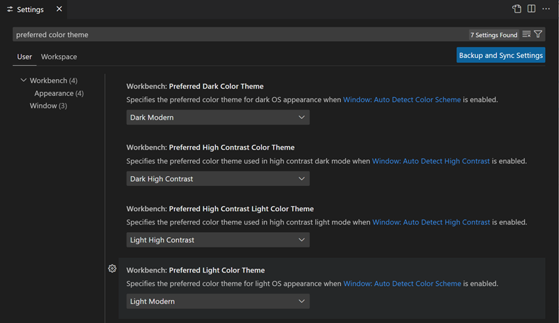
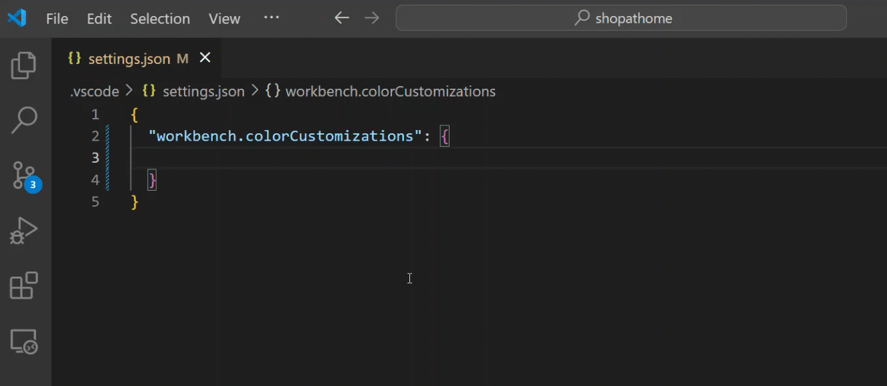
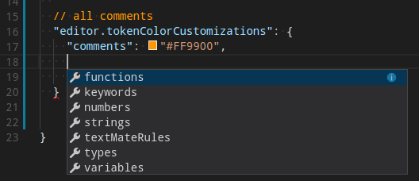
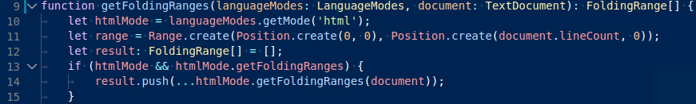
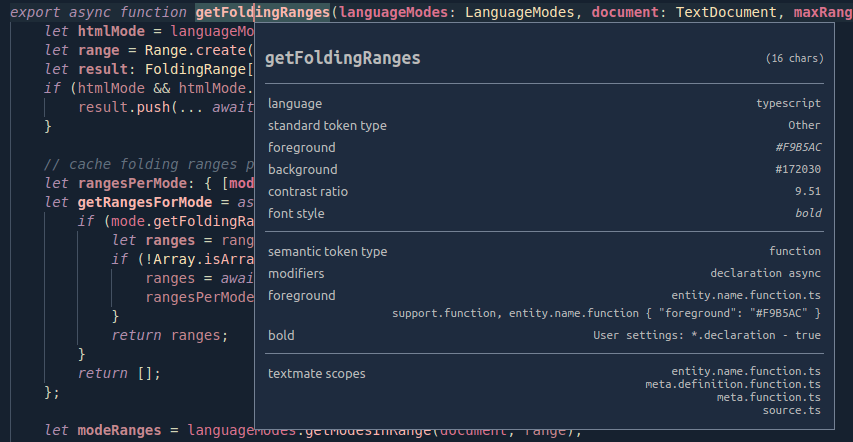
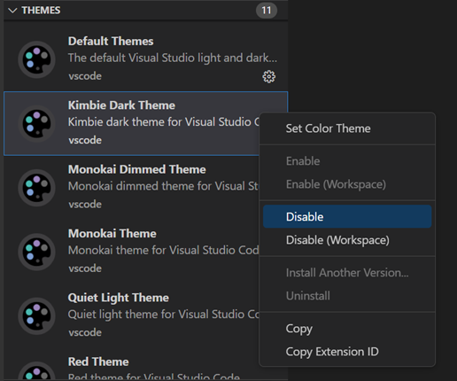

# 테마 {#themes}

## 색상 테마 {#color-themes}

색상 테마를 사용하면 Visual Studio Code 사용자 인터페이스의 색상을 선호도와 작업 환경에 맞게 수정할 수 있습니다. 색상 테마는 VS Code 사용자 인터페이스 요소와 편집기 강조 색상 모두에 영향을 미칩니다.


다른 색상 테마를 선택하려면:

1. **File** > **Preferences** > **Theme** > **Color Theme** 메뉴 항목을 선택하거나 **Preferences: Color Theme** 명령 (`Ctrl+K Ctrl+T`)을 사용하여 색상 테마 선택기를 표시합니다.

1. `Up` 및 `Down` 키를 사용하여 목록을 탐색하고 테마의 색상을 미리 봅니다.

1. 원하는 테마를 선택하고 `Enter`를 누릅니다.

활성 색상 테마는 사용자 [설정](/docs/getstarted/settings.md)에 저장됩니다 (키보드 단축키 `Ctrl+,`).

```json
  // 워크벤치에서 사용되는 색상 테마를 지정합니다.
  "workbench.colorTheme": "Solarized Dark"
```

:::tip
기본적으로 테마는 사용자 설정에 저장되며 모든 작업 공간에 전역적으로 적용됩니다. 작업 공간별 테마를 구성할 수도 있습니다. 이를 위해 작업 공간 [설정](/docs/getstarted/settings.md#workspace-settings)에서 테마를 설정합니다.


:::

## 마켓플레이스의 색상 테마 {#color-themes-from-the-marketplace}

VS Code에는 시도해 볼 수 있는 여러 기본 색상 테마가 있습니다. 커뮤니티에서 VS Code [확장 마켓플레이스](/docs/editor/extension-marketplace.md)에 업로드한 더 많은 테마가 있습니다.

색상 테마 선택기에서 **Browse Additional Color Themes....** 를 선택하여 VS Code 마켓플레이스에서 직접 색상 테마를 선택할 수 있습니다.


또는, `@category:"themes"` 필터를 사용하여 확장 보기 (`Ctrl+Shift+X`) 검색 상자에서 테마를 검색할 수 있습니다.


## OS 색상 테마에 따라 자동으로 전환 {#automatically-switch-based-on-os-color-scheme}

Windows 및 macOS는 밝은 색상 테마와 어두운 색상 테마를 지원합니다. `window.autoDetectColorScheme` 설정을 사용하면 VS Code가 OS의 색상 테마 변경을 감지하고 이에 맞는 테마로 전환할 수 있습니다.

마찬가지로, `window.autoDetectHighContrast` 설정을 사용하여 OS가 고대비 색상 테마로 전환되었는지 자동으로 감지할 수 있습니다.

색상 테마가 변경될 때 사용되는 테마를 사용자 지정하려면 설정 편집기에서 선호하는 밝은, 어두운, 고대비 테마를 설정할 수 있습니다:

- **워크벤치: 선호하는 어두운 색상 테마** - 기본값은 Dark Modern
- **워크벤치: 선호하는 밝은 색상 테마** - 기본값은 Light Modern
- **워크벤치: 선호하는 고대비 색상 테마** - 기본값은 Dark High Contrast
- **워크벤치: 선호하는 고대비 밝은 색상 테마** - 기본값은 Light High Contrast



## 색상 테마 사용자 지정 {#customize-a-color-theme}

### 워크벤치 색상 {#workbench-colors}

`workbench.colorCustomizations` 및 `editor.tokenColorCustomizations` 사용자 [설정](/docs/getstarted/settings.md)을 사용하여 활성 색상 테마를 사용자 지정할 수 있습니다.

파일 탐색기, 제안 위젯과 같은 목록 및 트리, 차이 편집기, 활동 표시줄, 알림, 스크롤 바, 분할 보기, 버튼 등 VS Code UI 요소의 색상을 설정하려면 `workbench.colorCustomizations`을 사용합니다.



`workbench.colorCustomizations` 값을 설정할 때 IntelliSense를 사용할 수 있으며, 사용자 지정 가능한 모든 색상의 목록은 [테마 색상 참조](/api/references/theme-color.md)를 참조하십시오.

특정 테마에 사용자 지정을 적용하려면 다음 구문을 사용합니다:

```json
"workbench.colorCustomizations": {
    "[Monokai]": {
        "sideBar.background": "#347890"
    }
}
```

사용자 지정이 여러 테마에 적용되는 경우 여러 테마 이름을 지정하거나 이름의 시작과 끝에 `*` 와일드카드를 사용할 수 있습니다:

```json
"workbench.colorCustomizations": {
    "[Abyss][Red]": {
        "activityBar.background": "#ff0000"
    },
    "[Monokai*]": {
        "activityBar.background": "#ff0000"
    }
}
```

테마가 마음에 들지 않는 색상이나 테두리를 설정한 경우 `default`를 사용하여 원래 값으로 되돌릴 수 있습니다:

```json
  "workbench.colorCustomizations": {
      "diffEditor.removedTextBorder": "default"
  }
```

### 편집기 구문 강조 {#editor-syntax-highlighting}

편집기의 구문 강조 색상을 조정하려면 사용자 [설정](/docs/getstarted/settings.md) `settings.json` 파일에서 `editor.tokenColorCustomizations`을 사용합니다:



가장 일반적인 구문 구성 요소에 대해 미리 구성된 구문 토큰('주석', '문자열', ...) 세트가 제공됩니다. 더 많은 구문 토큰을 원하면 TextMate 테마 색상 규칙을 직접 지정하여 설정할 수 있습니다:


:::note
TextMate 규칙을 직접 구성하는 것은 고급 기술로, TextMate 문법이 어떻게 작동하는지 이해해야 합니다. 자세한 내용은 [색상 테마 가이드](/api/extension-guides/color-theme.md)를 참조하십시오.
:::

특정 테마를 사용자 지정하려면 다음 방법 중 하나를 사용합니다:

```json
"editor.tokenColorCustomizations": {
    "[Monokai]": {
        "comments": "#229977"
    },
    "[*Dark*]": {
        "variables": "#229977"
    },
    "[Abyss][Red]": {
        "keywords": "#f00"
    }
}
```

### 편집기 시멘틱 강조 {#editor-semantic-highlighting}

일부 언어(현재: TypeScript, JavaScript, Java)는 시맨틱 토큰을 지원합니다. 시맨틱 토큰은 언어 서비스의 심볼 분석을 기반으로 하며, 정규 표현식을 사용해 작동하는 TextMate 문법에서 생성되는 구문 토큰보다 더 정밀합니다. 시맨틱 토큰을 활용한 시맨틱 하이라이트는 구문 강조 위에 적용되어, 아래 예시에서 보듯이 강조를 수정하거나 더 풍부하게 표현할 수 있습니다:

시멘틱 강조가 없는 "Tomorrow Night Blue" 색상 테마:



시멘틱 강조가 있는 "Tomorrow Night Blue" 색상 테마:


언어 서비스 심볼 이해를 기반으로 한 색상 차이를 확인하십시오:

- 10행: `languageModes`가 매개변수로 색상이 지정됩니다.
- 11행: `Range`와 `Position`이 클래스, `document`가 매개변수로 색상이 지정됩니다.
- 13행: `getFoldingRanges`가 함수로 색상이 지정됩니다.

`editor.semanticHighlighting.enabled` 설정은 시멘틱 강조가 적용되는지 여부를 제어하는 주요 설정입니다. 이 설정은 `true`, `false`, `configuredByTheme` 값을 가질 수 있습니다.

- `true` 및 `false`는 모든 테마에 대해 시멘틱 강조를 켜거나 끕니다.
- `configuredByTheme`는 기본값이며 각 테마가 시멘틱 강조가 활성화되는지 여부를 제어할 수 있습니다. VS Code와 함께 제공되는 모든 테마(예: "Dark+" 기본값)는 기본적으로 시멘틱 강조가 활성화되어 있습니다.

테마 설정을 재정의하려면:

```json
"editor.semanticTokenColorCustomizations": {
    "[Rouge]": {
        "enabled": true
    }
}
```

시멘틱 강조가 활성화되고 언어에 대해 사용 가능한 경우, 테마는 시멘틱 토큰이 색상 지정되는지 여부와 방법을 구성합니다. 일부 시멘틱 토큰은 표준화되어 있으며 잘 확립된 TextMate 범위에 매핑됩니다. 테마에 이러한 TextMate 범위에 대한 색상 규칙이 있는 경우 추가 색상 규칙 없이 해당 색상으로 시멘틱 토큰이 렌더링됩니다.

추가 스타일 규칙은 `editor.semanticTokenColorCustomizations"`에서 구성할 수 있습니다:

```json
"editor.semanticTokenColorCustomizations": {
    "[Rouge]": {
        "enabled": true,
        "rules": {
            "*.declaration": { "bold": true }
        }
    }
}
```

계산된 시멘틱 토큰과 스타일이 지정되는 방식을 확인하려면 범위 검사기(**Developer: Inspect Editor Tokens and Scopes**)를 사용하여 현재 커서 위치의 텍스트에 대한 정보를 표시할 수 있습니다.



주어진 위치에서 언어에 대해 시멘틱 토큰이 사용 가능하고 테마에 의해 활성화된 경우, 검사 도구는 **semantic token type** 섹션을 표시합니다. 이 섹션은 시멘틱 토큰 정보(유형 및 여러 수정자)를 표시하고 적용되는 스타일 규칙을 보여줍니다.

시멘틱 토큰 및 스타일 규칙 구문에 대한 자세한 내용은 [시멘틱 강조 가이드](/api/language-extensions/semantic-highlight-guide.md)를 참조하십시오.

## 나만의 색상 테마 만들기 {#create-your-own-color-theme}

테마 확장을 만들고 게시하는 것은 쉽습니다. 사용자 설정에서 색상을 사용자 지정한 다음 **Developer: Generate Color Theme From Current Settings** 명령을 사용하여 테마 정의 파일을 생성합니다.

VS Code의 Yeoman [확장 생성기](/api/get-started/your-first-extension.md)는 나머지 확장을 생성하는 데 도움을 줍니다.

자세한 내용은 확장 API 섹션의 [새 색상 테마 만들기](/api/extension-guides/color-theme.md#create-a-new-color-theme) 기사를 참조하십시오.

## 기본 색상 테마 제거 {#remove-default-color-themes}

VS Code와 함께 제공되는 기본 테마 중 일부를 색상 테마 선택기에서 제거하려면 확장 보기 (`Ctrl+Shift+X`)에서 비활성화할 수 있습니다. 확장 보기 상단의 **Filter Extensions** 버튼을 선택하고 **Built-in** 옵션을 선택하면 기본 테마가 나열된 **THEMES** 섹션이 표시됩니다.


기어 컨텍스트 메뉴의 **비활성화** 명령을 사용하여 다른 VS Code [확장](/docs/editor/extension-marketplace.md)과 마찬가지로 기본 테마 확장을 비활성화할 수 있습니다.



## 파일 아이콘 테마 {#file-icon-themes}

파일 아이콘은 특정 파일 유형을 나타냅니다. 이러한 아이콘은 탐색기 보기와 탭 헤딩에서 파일 이름 옆에 표시됩니다. 파일 아이콘 테마는 확장에서 제공할 수 있습니다.

다른 파일 아이콘 테마를 선택하려면:

1. **File** > **Preferences** > **Theme** > **File Icon Theme** 메뉴 항목을 선택하거나 **Preferences: File Icon Theme** 명령을 사용하여 파일 아이콘 테마 선택기를 표시합니다.

2. `Up` 및 `Down` 키를 사용하여 목록을 탐색하고 테마의 아이콘을 미리 봅니다.

3. 원하는 테마를 선택하고 `Enter`를 누릅니다.


기본적으로 **Seti** 파일 아이콘 테마가 사용되며 탐색기 보기에서 이러한 아이콘을 볼 수 있습니다. VS Code는 파일 아이콘 테마 선택을 재시작 시에도 기억합니다. **None**을 선택하여 파일 아이콘을 비활성화할 수 있습니다.

VS Code는 두 가지 파일 아이콘 테마를 제공합니다: **Minimal** 및 **Seti**. 더 많은 파일 아이콘 테마를 설치하려면 파일 아이콘 테마 선택기에서 **Install Additional File Icon Themes** 항목을 선택하면 확장 보기로 이동하여 아이콘 테마로 필터링됩니다.

사용 가능한 테마를 찾으려면 [VS Code 마켓플레이스](https://marketplace.visualstudio.com/vscode/Themes) 사이트를 직접 방문할 수도 있습니다.

활성 파일 아이콘 테마는 사용자 [설정](/docs/getstarted/settings.md)에 저장됩니다 (키보드 단축키 `Ctrl+,`).

```json
  // 워크벤치에서 사용되는 파일 아이콘 테마를 지정합니다.
  "workbench.iconTheme": "vs-seti"
```

## 나만의 파일 아이콘 테마 만들기 {#create-your-own-file-icon-theme}

아이콘(가능하면 SVG)에서 파일 아이콘 테마를 만들 수 있습니다. 자세한 내용은 확장 API 섹션의 [파일 아이콘 테마](/api/extension-guides/file-icon-theme.md) 기사를 참조하십시오.

## 웹용 VS Code {#vs-code-for-the-web}

웹용 VS Code는 브라우저에서 완전히 실행되는 무료 설치가 필요 없는 VS Code 경험을 제공합니다. [https://vscode.dev](https://vscode.dev)에서 사용할 수 있습니다.

URL 스키마를 통해 웹용 VS Code에서 색상 테마를 공유하고 경험할 수 있습니다: `https://vscode.dev/editor/theme/<extensionId>`.

예를 들어, [https://vscode.dev/editor/theme/sdras.night-owl](https://vscode.dev/editor/theme/sdras.night-owl)로 이동하여 다운로드 및 설치 과정을 거치지 않고 [Night Owl 테마](https://marketplace.visualstudio.com/items?itemName=sdras.night-owl)를 경험할 수 있습니다.

웹용 VS Code 문서에서 테마 미리보기 및 공유에 대해 자세히 알아보십시오 [VS Code for the Web documentation](/docs/editor/vscode-web.md#themes).

## 제품 아이콘 테마 {#product-icon-themes}

제품 아이콘 테마를 사용하면 특정 파일 유형의 아이콘 외에도 VS Code 사용자 인터페이스의 아이콘을 변경할 수 있습니다. 예를 들어, 활동 표시줄의 보기 아이콘이나 레이아웃을 변경하는 제목 표시줄의 아이콘을 수정할 수 있습니다.

다음 이미지에서 다른 제품 아이콘 테마를 선택할 때 활동 표시줄 아이콘이 업데이트되는 것을 확인할 수 있습니다.


다른 제품 아이콘 테마를 선택하려면:

1. **File** > **Preferences** > **Theme** > **Product Icon Theme** 메뉴 항목을 선택하거나 **Preferences: Product Icon Theme** 명령을 사용하여 제품 아이콘 테마 선택기를 표시합니다.

2. `Up` 및 `Down` 키를 사용하여 목록을 탐색하고 테마의 아이콘을 미리 봅니다.

3. 원하는 테마를 선택하고 `Enter`를 누릅니다.

기본적으로 VS Code는 하나의 제품 아이콘 테마, **Default**을 제공합니다. 제품 아이콘 테마 선택기에서 **Browse Additional Product Icon Themes.....** 를 선택하여 VS Code 마켓플레이스에서 직접 더 많은 제품 아이콘 테마를 선택할 수 있습니다.

## 다음 단계 {#next-steps}

테마는 VS Code를 사용자 지정하는 한 가지 방법일 뿐입니다. VS Code 사용자 지정 및 확장성에 대해 더 알아보려면 다음 기사를 참조하십시오:

- [설정](/docs/getstarted/settings) - 사용자 및 작업 공간 설정을 통해 VS Code를 선호도에 맞게 구성하는 방법을 알아보십시오.
- [스니펫](/docs/editor/userdefinedsnippets.md) - 좋아하는 언어에 추가 스니펫을 추가하십시오.
- [확장 API](/api) - VS Code를 확장하는 다른 방법에 대해 알아보십시오.
- [색상 테마](/api/extension-guides/color-theme.md) - 색상 테마 확장 API.
- [파일 아이콘 테마](/api/extension-guides/file-icon-theme.md) - 파일 아이콘 테마 확장 API.
