# Visual Studio Code 팁과 트릭 {#visual-studio-code-tips-and-tricks}

이 문서의 팁과 트릭을 사용하여 Visual Studio Code를 바로 시작하고 생산성을 높이는 방법을 알아보세요. 강력한 편집 기능, 코드 인텔리전스, 소스 코드 제어 기능에 익숙해지고 유용한 키보드 단축키를 배우세요. [시작하기](/docs/getstarted/userinterface.md)와 [사용자 가이드](/docs/editor/codebasics.md)의 다른 심화 주제들도 더 많이 알아보세요.

처음 시작하시는 분이라면, 주요 기능을 단계별로 살펴볼 수 있는 [VS Code 튜토리얼](/docs/getstarted/getting-started.md)을 확인해보세요.

> Visual Studio Code가 설치되어 있지 않다면, [다운로드](/download) 페이지를 방문하세요. [Linux에서 VS Code 실행하기](/docs/setup/linux.md), [macOS](/docs/setup/mac.md), [Windows](/docs/setup/windows.md)에서 플랫폼별 설정 지침을 찾을 수 있습니다.

영상을 선호하시나요? VS Code Day 강연 [Visual Studio Code 팁과 트릭](https://learn.microsoft.com/en-us/events/visual-studio-code-vs-code-day-2021/vs-code-tips-and-tricks)이나 [VS Code 경험 향상하기](https://learn.microsoft.com/en-us/shows/vs-code-day-2023/elevate-your-vs-code-experience)를 시청할 수 있습니다.

## 기본 {#basics}

### 시작하기 {#getting-started}

VS Code를 직접 체험하는 가장 좋은 방법은 **Welcome** 페이지를 열고 **Walkthrough**를 선택하여 VS Code가 제공하는 설정 단계, 기능, 더 깊은 사용자 정의를 자기 주도적으로 둘러보는 것입니다. 여러분이 발견하고 배우면서, 둘러보기는 여러분의 진행 상황을 추적합니다.

**Help** > **Welcome**에서 환영 페이지를 열거나 명령 팔레트(`Ctrl+Shift+P`)에서 **Help: Welcome** 명령을 사용하세요.


확장 프로그램도 둘러보기를 제공할 수 있습니다. 명령 팔레트(`Ctrl+Shift+P`)에서 **Help: Open Walkthrough...** 명령을 사용하여 둘러보기를 직접 열 수도 있습니다.


코드 편집 스킬을 향상시키고 싶다면, **Interactive Editor Playground**를 열어보세요. VS Code의 [코드 편집 기능](/docs/editor/codebasics.md), 멀티 커서 편집, [IntelliSense](/docs/editor/intellisense.md), 스니펫, [Emmet](/docs/editor/emmet.md) 등을 시험해볼 수 있습니다.

**Help** > **Editor Playground**에서 환영 페이지를 열거나 명령 팔레트(`Ctrl+Shift+P`)에서 **Help: Interactive Editor Playground** 명령을 사용하세요.


### 명령 팔레트 {#command-palette}

현재 상황에 따라 사용 가능한 모든 명령에 접근하세요.

키보드 단축키: `Ctrl+Shift+P`


### 기본 키보드 단축키 {#default-keyboard-shortcuts}

명령 팔레트의 많은 명령들은 기본 키 바인딩이 연결되어 있습니다. **Command Palette**(`Ctrl+Shift+P`)에서 명령 옆에 기본 키보드 단축키를 볼 수 있습니다.


### 키보드 참조 시트 {#keyboard-reference-sheets}

여러분의 플랫폼에 맞는 키보드 단축키 참조 시트를 다운로드하세요([macOS](https://go.microsoft.com/fwlink/?linkid=832143), [Windows](https://go.microsoft.com/fwlink/?linkid=832145), [Linux](https://go.microsoft.com/fwlink/?linkid=832144)).


### 빠른 열기 {#quick-open}

파일을 빠르게 검색하고 엽니다.

키보드 단축키: `Ctrl+P`


:::tip
`?`를 입력하여 명령 제안을 볼 수 있습니다.
:::


`edt` 또는 `term`과 같은 명령을 입력하고 스페이스를 누르면 드롭다운 목록이 나타납니다.


### 최근에 열어본 파일 간 이동 {#navigate-between-recently-opened-files}

**Quick Open** 키보드 단축키를 반복해서 누르면 최근에 열어본 파일 사이를 빠르게 이동할 수 있습니다.

### Quick Open에서 여러 파일 열기 {#open-multiple-files-from-quick-open}

**Quick Open**에서 `Right Arrow`를 눌러 여러 파일을 열 수 있습니다. 현재 선택된 파일이 백그라운드에서 열리고, **Quick Open**에서 계속해서 파일을 선택할 수 있습니다.

### 최근에 열어본 폴더와 작업 영역 간 이동 {#navigate-between-recently-opened-folders-and-workspaces}

최근 폴더나 작업 영역을 엽니다.

키보드 단축키: `Ctrl+R`

**File** > **Open Recent**에서 최근에 열어본 폴더와 작업 영역, 그리고 파일 목록이 있는 빠른 선택 드롭다운을 표시합니다.

### 플로팅 창 {#floating-windows}

편집기를 플로팅 창으로 열 수 있습니다. 예를 들어, 편집기를 모니터의 다른 위치로 이동하거나 다른 모니터로 이동할 때 유용합니다.

편집기를 플로팅 창으로 열려면, 현재 VS Code 창 밖으로 드래그하여 아무 곳에나 놓으세요. 편집기를 분리하는 또 다른 방법은 편집기 탭을 우클릭하고 **Move into New Window**(`workbench.action.moveEditorToNewWindow`) 또는 **Copy into New Window**(`Ctrl+K O`) 옵션을 선택하는 것입니다.

<video autoplay loop controls muted style={{ maxWidth: '100%' }}>

<source src="https://code.visualstudio.com/assets/docs/getstarted/tips-and-tricks/floating-windows.mp4" type="video/mp4" />
</video>

## 명령줄 {#command-line}

VS Code에는 강력한 명령줄 인터페이스(CLI)가 있어 다양한 시나리오를 지원하도록 편집기 실행 방식을 사용자 정의할 수 있습니다. 예를 들어, 명령줄에서 VS Code를 시작하여 두 파일을 비교하는 차이점 편집기를 열 수 있습니다.

> VS Code 바이너리가 경로에 있는지 확인하세요. 그러면 간단히 'code'를 입력하여 VS Code를 실행할 수 있습니다. 설치 중에 VS Code가 환경 경로에 추가되는지 확인하려면 플랫폼별 설정 주제를 참조하세요([Linux에서 VS Code 실행](/docs/setup/linux.md), [macOS](/docs/setup/mac.md), [Windows](/docs/setup/windows.md)).

```bash
# 현재 디렉터리로 code 열기
code .

# 가장 최근에 사용한 code 창에서 현재 디렉터리 열기
code -r .

# 새 창 만들기
code -n

# 언어 변경
code --locale=es

# 차이점 편집기 열기
code --diff <file1> <file2>

# 특정 줄과 열에서 파일 열기 <file:line[:character]>
code --goto package.json:10:5

# 도움말 옵션 보기
code --help

# 모든 확장 프로그램 비활성화
code --disable-extensions .
```

### .vscode 폴더 {#vscode-folder}

작업 영역별 파일은 작업 영역의 루트에 있는 `.vscode` 폴더에 있습니다. 예를 들어, [작업 실행기](/docs/editor/tasks.md)용 `tasks.json`과 [디버거](/docs/editor/debugging.md)용 `launch.json`이 있습니다.

## 상태 표시줄 {#status-bar}

### 오류와 경고 {#errors-and-warnings}

키보드 단축키: `Ctrl+Shift+M`

프로젝트의 오류와 경고로 빠르게 이동할 수 있습니다.

`F8` 또는 `Shift+F8`로 오류 간 이동이 가능합니다.

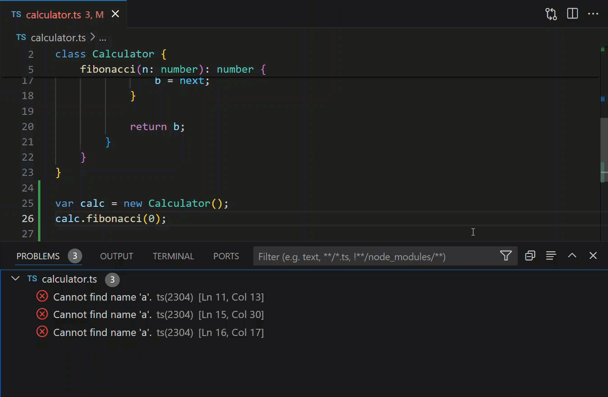

문제 목록을 유형('info', 'errors', 'warnings')이나 일치하는 텍스트로 필터링할 수 있습니다.

### 언어 모드 변경 {#change-language-mode}

상태 표시줄의 언어 모드는 활성 편집기와 연결된 언어(예: Markdown, Python 등)를 나타냅니다. 상태 표시줄의 언어 모드 표시기를 선택하거나 키보드 단축키를 사용하여 현재 편집기의 언어 모드를 변경할 수 있습니다.

키보드 단축키: `Ctrl+K M`


파일 유형에 대해 새 언어 모드를 유지하려면 **Configure File Association** 명령을 사용하여 현재 파일 확장자를 설치된 언어와 연결하세요.

## 사용자 정의 {#customization}

VS Code를 여러분의 선호도에 맞게 사용자 정의할 수 있는 많은 옵션이 있습니다:

- 테마 변경
- 키보드 단축키 변경
- 설정 조정
- JSON 유효성 검사 추가
- 스니펫 만들기
- 확장 프로그램 설치

### 테마 변경 {#change-your-theme}

VS Code에는 여러 가지 내장된 [색상 테마](/docs/getstarted/themes.md)가 있습니다. **기본 설정: 색상 테마** 명령을 사용하거나 키보드 단축키를 사용하세요.

키보드 단축키: `Ctrl+K Ctrl+T`


VS Code 확장 [Marketplace](https://marketplace.visualstudio.com/search?target=VSCode&category=Themes&sortBy=Installs)에서 더 많은 테마를 설치할 수 있습니다. **Preferences: Color Theme** > **+ Browse Additional Color Themes...** 명령을 선택하여 Marketplace에서 테마를 검색하세요.

추가적으로, 파일 아이콘 테마를 설치하고 변경할 수 있습니다.


### 키맵 {#keymaps}

다른 편집기의 키보드 단축키에 익숙하신가요? 키맵 확장 프로그램을 설치하여 좋아하는 편집기의 키보드 단축키를 VS Code로 가져올 수 있습니다. **Preferences: Keymaps** 명령을 사용하여 [Marketplace](https://marketplace.visualstudio.com/search?target=VSCode&category=Keymaps&sortBy=Installs)의 현재 목록을 확인하세요. 가장 인기 있는 것들은 다음과 같습니다:

- [Vim](https://marketplace.visualstudio.com/items?itemName=vscodevim.vim)
- [Sublime Text Keymap](https://marketplace.visualstudio.com/items?itemName=ms-vscode.sublime-keybindings)
- [Emacs Keymap](https://marketplace.visualstudio.com/items?itemName=hiro-sun.vscode-emacs)
- [Atom Keymap](https://marketplace.visualstudio.com/items?itemName=ms-vscode.atom-keybindings)
- [Brackets Keymap](https://marketplace.visualstudio.com/items?itemName=ms-vscode.brackets-keybindings)
- [Eclipse Keymap](https://marketplace.visualstudio.com/items?itemName=alphabotsec.vscode-eclipse-keybindings)
- [Visual Studio Keymap](https://marketplace.visualstudio.com/items?itemName=ms-vscode.vs-keybindings)

### 키보드 단축키 사용자 정의 {#customize-your-keyboard-shortcuts}

**Keyboard Shortcuts** 편집기에서 키보드 단축키를 보고 사용자 정의할 수 있습니다. **Preferences: Open Keyboard Shortcuts** 명령을 사용하거나 단축키를 사용하여 편집기를 여세요.

키보드 단축키: `Ctrl+K Ctrl+S`

연필 아이콘을 선택하거나 특정 항목에서 `Enter`를 사용하여 키보드 단축키를 편집하세요. 검색 필드를 사용하여 목록을 필터링할 수 있습니다.


단축키를 검색하고 `keybindings.json` 파일에 자신만의 키 바인딩을 추가할 수도 있습니다.


자세한 내용은 [Visual Studio Code용 키 바인딩](/docs/getstarted/keybindings.md)을 참조하세요.

### 설정 조정 {#tune-your-settings}

기본적으로 VS Code는 설정을 보고 편집할 수 있는 설정 편집기를 보여줍니다. **사용자 설정 열기(JSON)** 명령을 사용하거나 `workbench.settings.editor` 설정으로 기본 설정 편집기를 변경하여 기본 `settings.json` 파일을 직접 편집할 수도 있습니다.

사용자 설정 `settings.json` 열기

키보드 단축키: `Ctrl+,`

다양한 UI 요소의 글꼴 크기 변경

```json
// 메인 편집기
"editor.fontSize": 18,
// 터미널 패널
"terminal.integrated.fontSize": 14,
// 출력 패널
"[Log]": {
    "editor.fontSize": 15
}
```

확대/축소 레벨 변경

```json
"window.zoomLevel": 5
```

글꼴 합자(Ligatures)

```json
"editor.fontFamily": "Fira Code",
"editor.fontLigatures": true
```

:::tip
글꼴 합자를 지원하는 글꼴이 설치되어 있어야 합니다. [FiraCode](https://github.com/tonsky/FiraCode)는 VS Code 팀에서 인기 있는 글꼴입니다.
:::


자동 저장

```json
"files.autoSave": "afterDelay"
```

**File** > **Auto Save** 메뉴에서도 자동 저장을 토글할 수 있습니다.

저장 시 포맷

```json
"editor.formatOnSave": true
```

붙여넣기 시 포맷

```json
"editor.formatOnPaste": true
```

탭 문자의 크기 변경

```json
"editor.tabSize": 4
```

공백 또는 탭

```json
"editor.insertSpaces": true
```

공백 문자 렌더링

```json
"editor.renderWhitespace": "all"
```

공백 문자는 기본적으로 텍스트 선택에서 렌더링됩니다.

파일/폴더 무시

이러한 파일/폴더를 편집기 창에서 제거합니다.

```json
"files.exclude": {
    "somefolder/": true,
    "somefile": true
}
```

검색 결과에서 이러한 파일/폴더를 제거합니다.

```json
"search.exclude": {
    "someFolder/": true,
    "somefile": true
}
```

[다른 사용자 정의](/docs/getstarted/settings.md)에 대해 자세히 알아보세요.

### 언어별 설정 {#language-specific-settings}

언어 식별자를 사용하여 특정 언어에 대한 설정을 지정할 수 있습니다. 일반적으로 사용되는 언어 ID 목록은 [언어 식별자](/docs/languages/identifiers.md) 참조에서 찾을 수 있습니다.

```json
"[languageid]": {

}
```

:::tip
**Configure Language Specific Settings** 명령을 사용하여 언어별 설정을 만들 수도 있습니다.

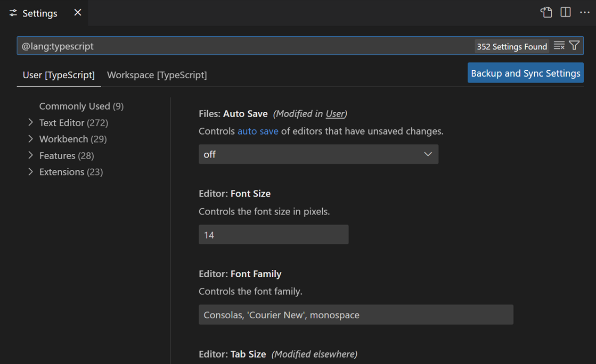
:::

### JSON 유효성 검사 추가 {#add-json-validation}

많은 파일 유형에 대해 JSON 유효성 검사가 기본적으로 활성화되어 있습니다. `settings.json`에서 자신만의 스키마와 유효성 검사를 만드세요:

```json
"json.schemas": [
    {
        "fileMatch": [
            "bower.json"
        ],
        "url": "https://json.schemastore.org/bower"
    }
]
```

또는 작업 영역에 정의된 스키마의 경우:

```json
"json.schemas": [
    {
        "fileMatch": [
            "**/foo.json"
        ],
        "url": "./myschema.json"
    }
]
```

또는 사용자 정의 스키마를 사용하려면:

```json
"json.schemas": [
    {
        "fileMatch": [
            "/.myconfig"
        ],
        "schema": {
            "type": "object",
            "properties": {
                "name" : {
                    "type": "string",
                    "description": "항목의 이름"
                }
            }
        }
    }
]
```

자세한 내용은 [JSON](/docs/languages/json.md) 문서를 참조하세요.

### 기본 브라우저 구성 {#configure-the-default-browser}

VS Code에서는 링크를 `Ctrl+click`(`Cmd+click`, macOS의 경우)하여 기본 브라우저에서 열 수 있습니다. `workbench.externalBrowser` [설정](/docs/getstarted/settings.md)을 통해 기본 브라우저를 구성할 수 있습니다.

설정 값으로 브라우저 실행 파일의 전체 경로를 지정하세요. 또는 장치 간 올바른 작동을 보장하기 위해 `edge`, `chrome`, `firefox`와 같은 브라우저 별칭을 사용할 수도 있습니다.

```json
"workbench.externalBrowser": "edge"
```

## 확장 프로그램 {#extensions}

키보드 단축키: `Ctrl+Shift+X`

### 확장 프로그램 찾기 {#find-extensions}

여러 소스를 사용하여 확장 프로그램을 찾을 수 있습니다:

- VS Code [Marketplace](https://marketplace.visualstudio.com/vscode)에서
- VS Code의 **Extensions** 보기에서 검색
- 확장 프로그램 추천 보기
- [awesome-vscode](https://github.com/viatsko/awesome-vscode)와 같은 커뮤니티에서 관리하는 확장 프로그램 목록

### 인기 있는 확장 프로그램 찾기 {#find-popular-extensions}

**Extensions** 화면에서 **Filter** 컨트롤을 선택한 다음 **Most Popular** 또는 **Sort By** > **Install Count**를 선택하세요.

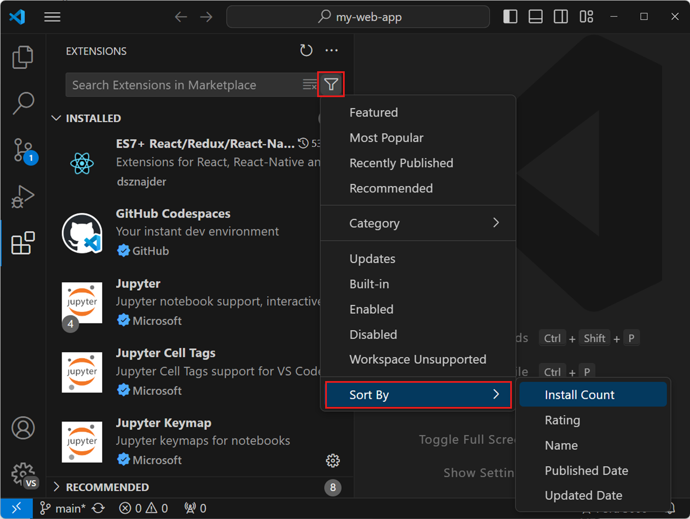

### 확장 프로그램 추천 {#extension-recommendations}

**Extensions** 화면에서 **Filter** 컨트롤을 선택한 다음 **Recommended**을 선택하여 추천 확장 프로그램 목록을 확인하세요.

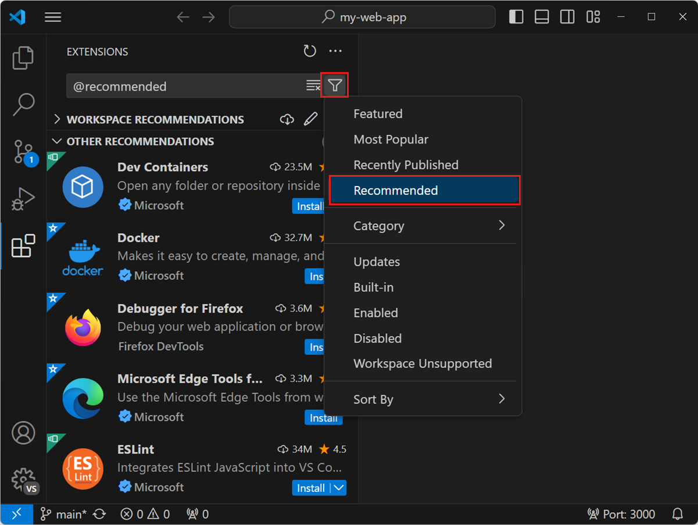

### 자신만의 확장 프로그램 만들기 {#create-your-own-extension}

자신만의 확장 프로그램을 만드는 데 관심이 있으신가요? [확장 API 문서](/api)에서 방법을 배울 수 있습니다. 특히 [기여 포인트 문서](/api/references/contribution-points.md)를 확인해보세요.

- 구성
- 명령
- 키 바인딩
- 언어
- 디버거
- 문법
- 테마
- 스니펫
- JSON 유효성 검사

## 파일과 폴더 {#files-and-folders}

### 간단한 파일 대화상자 {#simple-file-dialog}

간단한 파일 대화상자를 사용하면 파일과 폴더를 열고 저장하기 위한 시스템의 기본 파일 대화상자를 VS Code 내의 더 간단한 빠른 선택 대화상자로 대체할 수 있습니다.

간단한 파일 대화상자를 활성화하면 VS Code 내에서 빠른 선택을 사용하여 파일과 폴더를 탐색하고 선택할 수 있습니다.

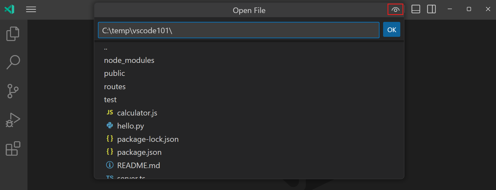

간단한 파일 대화상자를 활성화하려면 `files.simpleDialog` [설정](/docs/getstarted/settings.md)을 구성하세요:

```json
    "files.simpleDialog.enable": true
```

### 통합 터미널 {#integrated-terminal}

키보드 단축키: Ctrl+`

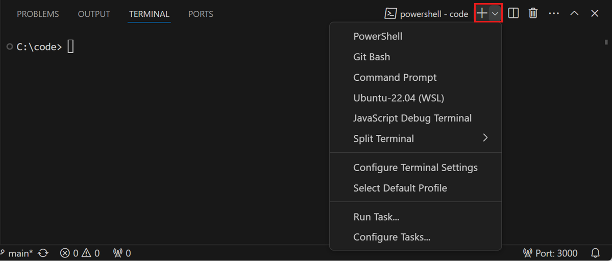

드롭다운에서 다른 터미널 셸을 선택할 수 있습니다. 운영 체제와 시스템 구성에 따라 다른 셸이 표시될 수 있습니다.

추가 읽기:

- [통합 터미널](/docs/terminal/basics.md) 문서
- [VS Code의 터미널 마스터하기 문서](https://www.growingwiththeweb.com/2017/03/mastering-vscodes-terminal.html)

### 사이드바 토글 {#toggle-sidebar}

키보드 단축키: `Ctrl+B`


### 패널 토글 {#toggle-panel}

키보드 단축키: `Ctrl+J`

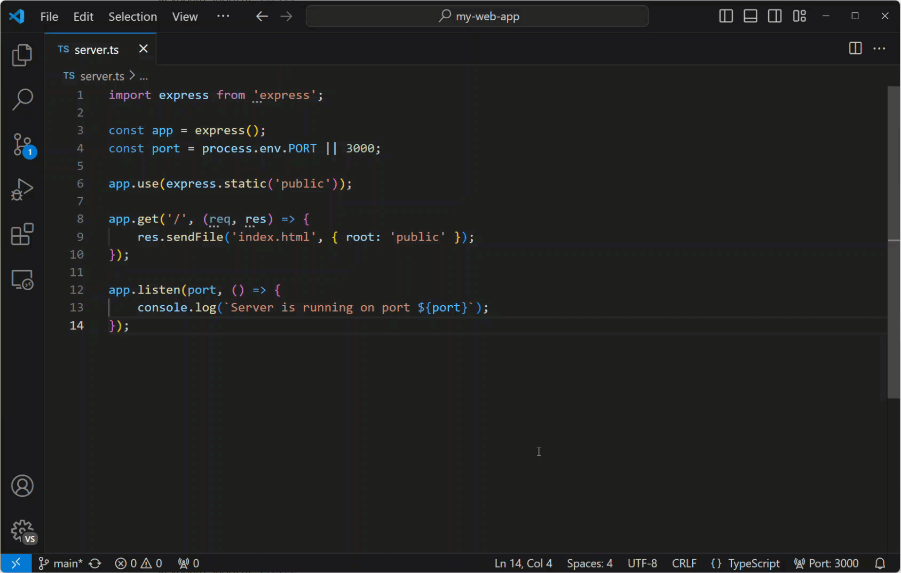

### Zen 모드 {#zen-mode}

방해 없는 Zen 모드로 들어가세요.

키보드 단축키: `Ctrl+K Z`

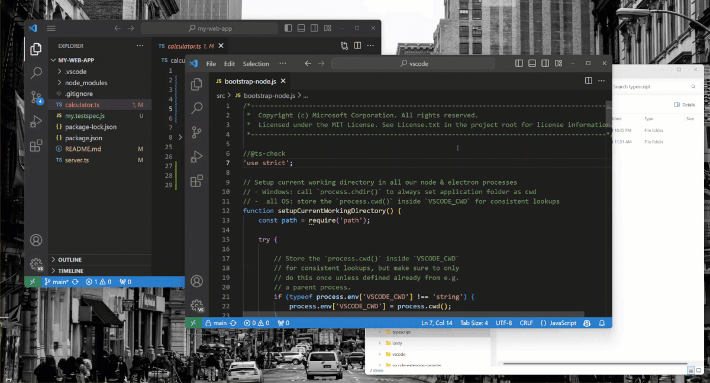

`Esc`를 두 번 눌러 Zen 모드를 종료하세요.

### 나란히 편집 {#side-by-side-editing}

키보드 단축키: `Ctrl+\`

편집기를 드래그 앤 드롭하여 새 편집기 그룹을 만들고 편집기를 그룹 간에 이동할 수도 있습니다.


### 편집기 간 전환 {#switch-between-editors}

키보드 단축키: `Ctrl+1`, `Ctrl+2`, `Ctrl+3`


### 탐색기 보기 표시 {#show-explorer-view}

키보드 단축키: `Ctrl+Shift+E`

### 링크에서 파일 만들기 또는 열기 {#create-or-open-a-file-from-a-link}

키보드 단축키: `Ctrl+click` (`Cmd+click`, macOS의 경우)

커서를 파일 링크로 이동한 다음 `Ctrl+click`을 눌러 파일이나 이미지를 빠르게 열거나 새 파일을 만들 수 있습니다.


### 현재 열린 폴더 닫기 {#close-the-currently-opened-folder}

키보드 단축키: `Ctrl+K F`

### 탐색 기록 {#navigation-history}

전체 기록 탐색: `Ctrl+Tab`

뒤로 탐색: `Alt+Left`

앞으로 탐색: `Alt+Right`


### 파일 연결 {#file-associations}

올바르게 감지되지 않는 파일에 대한 언어 연결을 만드세요. 예를 들어, 사용자 정의 파일 확장자가 있는 많은 구성 파일이 실제로는 JSON입니다.

```json
"files.associations": {
    ".database": "json"
}
```

### 동시 수정 충돌 방지 {#preventing-dirty-writes}

디스크에서 변경된 파일을 저장하려고 할 때 VS Code는 오류 메시지를 표시합니다. VS Code는 편집기 외부에서 변경된 내용을 덮어쓰는 것을 방지하기 위해 파일 저장을 차단합니다.

저장 충돌을 해결하려면 알림 팝업에서 **Compare** 작업을 선택하여 디스크의 파일 내용(왼쪽)과 VS Code의 내용(오른쪽)을 비교하는 차이점 편집기를 여세요:


편집기 도구 모음의 작업을 사용하여 저장 충돌을 해결하세요. 변경 사항을 **Accept**하여 디스크의 변경 사항을 덮어쓰거나, 디스크 버전으로 **Revert**를 선택할 수 있습니다. 되돌리기는 변경 사항이 손실됨을 의미합니다.

:::note
충돌을 해결하기 위해 두 작업 중 하나를 선택할 때까지 파일은 편집 중인 상태로 유지되며 저장할 수 없습니다.
:::

## 편집 핵심 기능 {#editing-hacks}

다음은 코드 편집을 위한 공통 기능들의 모음입니다. 다른 편집기의 키보드 단축키에 더 익숙하다면, [키맵 확장 프로그램](https://marketplace.visualstudio.com/search?target=VSCode&category=Keymaps&sortBy=Installs) 설치를 고려해보세요.

:::tip
**Extensions** 보기에서 `@recommended:keymaps`로 검색을 필터링하여 추천 키맵 확장 프로그램을 볼 수 있습니다.
:::

### 다중 커서 선택 {#multi-cursor-selection}

임의의 위치에 커서를 추가하려면 마우스로 위치를 선택하고 `Alt+Click`(`Option+Click`, macOS의 경우)을 사용하세요.

현재 위치 위나 아래에 커서를 설정하려면 다음을 사용하세요:

키보드 단축키: `Ctrl+Alt+Up` 또는 `Ctrl+Alt+Down`


`Ctrl+Shift+L`를 사용하여 현재 선택 영역의 모든 항목에 추가 커서를 추가할 수 있습니다.


:::note
`editor.multiCursorModifier` [설정](/docs/getstarted/settings.md)을 사용하여 수정자를 `Ctrl/Cmd`로 변경할 수도 있습니다. 자세한 내용은 [다중 커서 수정자](/docs/editor/codebasics.md#multicursor-modifier)를 참조하세요.
:::

현재 선택 영역의 모든 항목을 추가하고 싶지 않다면 대신 `Ctrl+D`를 사용할 수 있습니다.
이는 선택한 항목 다음에 나오는 항목만 선택하므로 선택 영역을 하나씩 추가할 수 있습니다.


### 열(박스) 선택 {#column-box-selection}

마우스를 드래그하는 동안 `Shift+Alt`(`Shift+Option`, macOS의 경우)를 누르고 있으면 텍스트 블록을 선택할 수 있습니다. 선택한 각 줄의 끝에 별도의 커서가 추가됩니다.


[키보드 단축키](/docs/editor/codebasics.md#column-box-selection)를 사용하여 열 선택을 트리거할 수도 있습니다.

### 수직 눈금자 {#vertical-rulers}

`editor.rulers` 설정을 사용하여 편집기에 수직 열 눈금자를 추가할 수 있습니다. 이는 수직 눈금자를 표시하고 싶은 열 문자 위치의 배열을 받습니다.

```json
{
  "editor.rulers": [20, 40, 60]
}
```


### 빠른 스크롤 {#fast-scrolling}

`Alt` 키를 누르면 편집기와 탐색기에서 빠른 스크롤이 활성화됩니다. 기본적으로 빠른 스크롤은 5배 속도 배율을 사용하지만 **Editor: Fast Scroll Sensitivity**(`editor.fastScrollSensitivity`) 설정으로 배율을 제어할 수 있습니다.

### 잠금 스크롤 {#locked-scrolling}

**View: Toggle Locked Scrolling Across Editors** 명령을 사용하여 모든 보이는 편집기 간의 스크롤을 동기화할 수 있습니다. 이는 한 편집기에서 스크롤할 때 다른 모든 편집기도 같은 양만큼 스크롤되어 모든 것이 정렬된 상태를 유지함을 의미합니다.

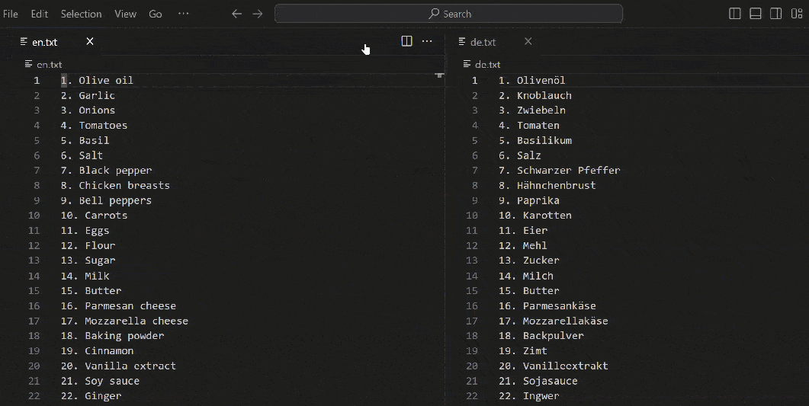

특정 키 바인딩을 누르고 있을 때만 스크롤 동기화를 활성화하도록 선택할 수 있습니다. `workbench.action.holdLockedScrolling` 명령에 대한 키보드 단축키를 설정하여 편집기 간 스크롤을 일시적으로 잠글 수 있습니다.

### 줄 복사 위/아래 {#copy-line-up-down}

키보드 단축키: `Shift+Alt+Up` 또는 `Shift+Alt+Down`

> **줄 복사 위/아래** 명령은 VS Code의 기본 키 바인딩이 Ubuntu 키 바인딩과 충돌하기 때문에 Linux에서는 바인딩되어 있지 않습니다. [Issue #509](https://github.com/microsoft/vscode/issues/509)를 참조하세요. `editor.action.copyLinesUpAction` 및 `editor.action.copyLinesDownAction` 명령을 원하는 키보드 단축키로 설정할 수 있습니다.


### 줄 위/아래로 이동 {#move-line-up-and-down}

키보드 단축키: `Alt+Up` 또는 ` Alt+Down`


### 선택 영역 축소/확장 {#shrink-expand-selection}

키보드 단축키: `Shift+Alt+Left` 또는 `Shift+Alt+Right`


자세한 내용은 [기본 편집](/docs/editor/codebasics.md#shrinkexpand-selection) 문서에서 확인할 수 있습니다.

### 파일 내 심볼로 이동 {#go-to-symbol-in-file}

키보드 단축키: `Ctrl+Shift+O`

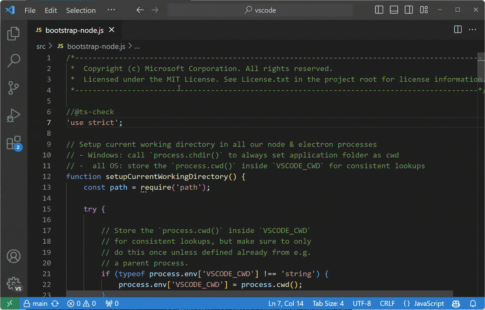

콜론을 추가하여 종류별로 심볼을 그룹화할 수 있습니다, `@:`.


### 작업 영역 내 심볼로 이동 {#go-to-symbol-in-workspace}

키보드 단축키: `Ctrl+T`


### 개요 보기 {#outline-view}

파일 탐색기의 개요 보기(기본적으로 하단에 접혀 있음)는 현재 열린 파일의 심볼을 보여줍니다.


심볼 이름, 카테고리, 파일 내 위치별로 정렬할 수 있으며 심볼 위치로 빠르게 이동할 수 있습니다.

### 특정 줄로 이동 {#navigate-to-a-specific-line}

키보드 단축키: `Ctrl+G`

### 커서 위치 실행 취소 {#undo-cursor-position}

키보드 단축키: `Ctrl+U`

### 후행 공백 제거 {#trim-trailing-whitespace}

키보드 단축키: `Ctrl+K Ctrl+X`


### 텍스트 변환 명령 {#transform-text-commands}

명령 팔레트의 **Transform** 명령을 사용하여 선택한 텍스트를 대문자, 소문자, 타이틀 케이스로 변경할 수 있습니다.


### 코드 포맷팅 {#code-formatting}

현재 선택된 소스 코드: `Ctrl+K Ctrl+F`

전체 문서 포맷: `Shift+Alt+F`


### 코드 접기 {#code-folding}

키보드 단축키: `Ctrl+Shift+[`, `Ctrl+Shift+]` 및 `Ctrl+K Ctrl+L`


**모두 접기**(`Ctrl+K Ctrl+0`)와 **모두 펼치기**(`Ctrl+K Ctrl+J`)를 사용하여 편집기의 모든 영역을 접거나 펼칠 수도 있습니다.

**모든 블록 주석 접기**(`Ctrl+K Ctrl+/`)를 사용하여 모든 블록 주석을 접을 수 있습니다.

### 현재 줄 선택 {#select-current-line}

키보드 단축키: `Ctrl+L`

### 파일의 시작과 끝으로 이동 {#navigate-to-beginning-and-end-of-file}

키보드 단축키: `Ctrl+Home` 및 `Ctrl+End`

### 마크다운 미리보기 열기 {#open-markdown-preview}

마크다운 파일에서 다음을 사용하세요:

키보드 단축키: `Ctrl+Shift+V`


### 마크다운 나란히 편집 및 미리보기 {#side-by-side-markdown-edit-and-preview}

마크다운 파일에서 다음을 사용하세요:

키보드 단축키: `Ctrl+K V`

미리보기와 편집기는 어느 한쪽에서 스크롤할 때 동기화됩니다.


## IntelliSense {#intellisense}

`Ctrl+Space`를 사용하여 제안 위젯을 트리거하세요.


사용 가능한 메서드, 매개변수 힌트, 간단한 문서 등을 볼 수 있습니다.

### 피크 {#peek}

심볼을 선택한 다음 `Alt+F12`를 입력하세요. 또는 컨텍스트 메뉴를 사용할 수도 있습니다.


### 정의로 이동 {#go-to-definition}

심볼을 선택한 다음 `F12`를 입력하세요. 또는 컨텍스트 메뉴를 사용하거나 `Ctrl+click`(`Cmd+click`, macOS의 경우)할 수 있습니다.


**Go** > **Back** 명령 또는 `Alt+Left`을 사용하여 이전 위치로 돌아갈 수 있습니다.

유형 위에 마우스를 올릴 때 `Ctrl`(`Cmd`, macOS의 경우)을 누르면 유형 정의도 볼 수 있습니다.

### 참조로 이동 {#go-to-references}

심볼을 선택한 다음 `Shift+F12`를 입력하세요. 또는 컨텍스트 메뉴를 사용할 수 있습니다.


### 모든 참조 보기 {#find-all-references-view}

심볼을 선택한 다음 `Shift+Alt+F12`를 입력하여 파일의 모든 심볼을 전용 보기에 표시하는 참조 보기를 엽니다.

### 심볼 이름 바꾸기 {#rename-symbol}

심볼을 선택한 다음 `F2`를 입력하세요. 또는 컨텍스트 메뉴를 사용할 수 있습니다.


### 검색 및 수정 {#search-and-modify}

표현식을 검색하고 바꾸는 것 외에도, 캡처 그룹이 있는 정규식을 사용하여 일치한 항목의 일부를 검색하고 재사용할 수 있습니다. 검색 상자에서 **Use Regular Expression** `.*` 버튼(`Alt+R`)을 클릭하여 정규식을 활성화한 다음, 정규식을 작성하고 괄호를 사용하여 그룹을 정의하세요. 그러면 바꾸기 필드에서 `$1`, `$2` 등을 사용하여 각 그룹에서 일치한 내용을 재사용할 수 있습니다.


### .eslintrc.json {#eslintrcjson}

[ESLint 확장 프로그램](https://marketplace.visualstudio.com/items?itemName=dbaeumer.vscode-eslint)을 설치하세요. 원하는 대로 린터를 구성하세요. 린팅 규칙과 옵션에 대한 자세한 내용은 [ESLint 명세](https://eslint.org/docs/user-guide/configuring)를 참조하세요.

다음은 ES6를 사용하기 위한 구성입니다.

```json
{
  "env": {
    "browser": true,
    "commonjs": true,
    "es6": true,
    "node": true
  },
  "parserOptions": {
    "ecmaVersion": 6,
    "sourceType": "module",
    "ecmaFeatures": {
      "jsx": true,
      "classes": true,
      "defaultParams": true
    }
  },
  "rules": {
    "no-const-assign": 1,
    "no-extra-semi": 0,
    "semi": 0,
    "no-fallthrough": 0,
    "no-empty": 0,
    "no-mixed-spaces-and-tabs": 0,
    "no-redeclare": 0,
    "no-this-before-super": 1,
    "no-undef": 1,
    "no-unreachable": 1,
    "no-use-before-define": 0,
    "constructor-super": 1,
    "curly": 0,
    "eqeqeq": 0,
    "func-names": 0,
    "valid-typeof": 1
  }
}
```

### package.json {#packagejson}

`package.json` 파일에 대한 IntelliSense를 확인하세요.


### Emmet 문법 {#emmet-syntax}

[Emmet 문법 지원](/docs/editor/emmet.md).


## 스니펫 {#snippets}

### 사용자 정의 스니펫 만들기 {#create-custom-snippets}

**File** > **Preferences** > **Configure User Snippets**을 선택하고, 언어를 선택한 다음 스니펫을 만드세요.

```json
"create component": {
    "prefix": "component",
    "body": [
        "class $1 extends React.Component {",
        "",
        "\trender() {",
        "\t\treturn ($2);",
        "\t}",
        "",
        "}"
    ]
},
```

자세한 내용은 [자신만의 스니펫 만들기](/docs/editor/userdefinedsnippets.md)에서 확인하세요.

## Git 통합 {#git-integration}

키보드 단축키: `Ctrl+Shift+G`

VS Code에는 Git 통합이 "기본 제공"됩니다. VS Code [확장 마켓플레이스](/docs/editor/extension-marketplace.md)에서 다른 소스 제어 관리(SCM) 공급자를 설치할 수 있습니다. 이 섹션에서는 Git 통합에 대해 설명하지만, 많은 UI와 제스처가 다른 SCM 공급자에게도 공통적으로 적용됩니다.

### 차이점 {#diffs}

**Source Control** 보기에서 파일을 선택하여 차이점 편집기를 엽니다. 또는 오른쪽 상단 모서리의 **Open Changes** 버튼을 선택하여 현재 열린 파일의 차이점을 볼 수 있습니다.


#### 보기 {#views}

차이점의 기본 보기는 **나란히 보기**입니다.

오른쪽 상단의 **More Actions** (...) 버튼을 선택한 다음 **Inline View**를 선택하여 **Inline View**로 전환할 수 있습니다.

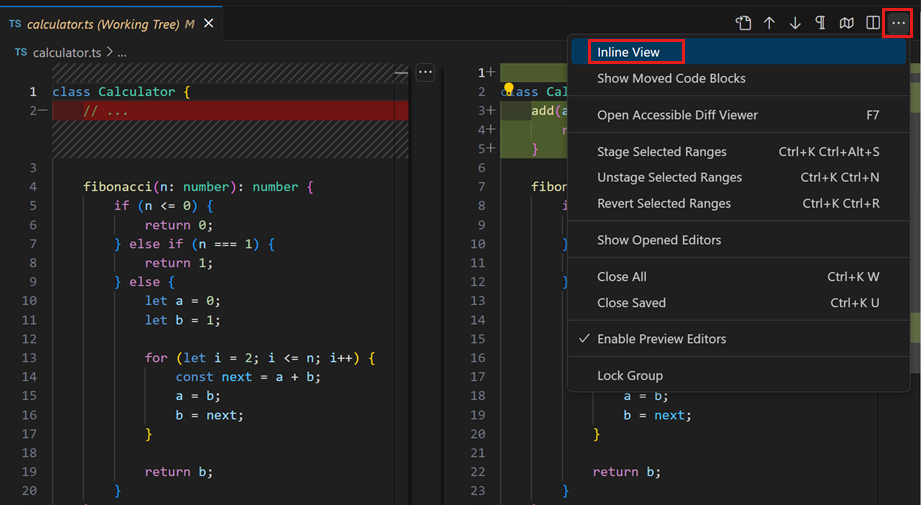

인라인 보기를 기본값으로 설정하려면 `"diffEditor.renderSideBySide": false` 설정을 구성하세요.

#### 접근성 있는 차이점 뷰어 {#accessible-diff-viewer}

`F7 `와 `Shift+F7`를 사용하여 차이점을 탐색할 수 있습니다. 이는 변경 사항을 통합된 패치 형식으로 보여줍니다. 화살표 키로 줄을 탐색할 수 있으며 `Enter`를 누르면 차이점 편집기로 돌아가고 선택한 줄이 선택됩니다.


#### 보류 중인 변경 사항 편집 {#edit-pending-changes}

차이점 편집기에서 변경 사항을 보는 동안 차이점 편집기의 보류 중인 변경 사항 쪽에서 직접 편집할 수 있습니다.

### 브랜치 {#branches}

상태 표시줄을 통해 Git 브랜치 간에 쉽게 전환할 수 있습니다.

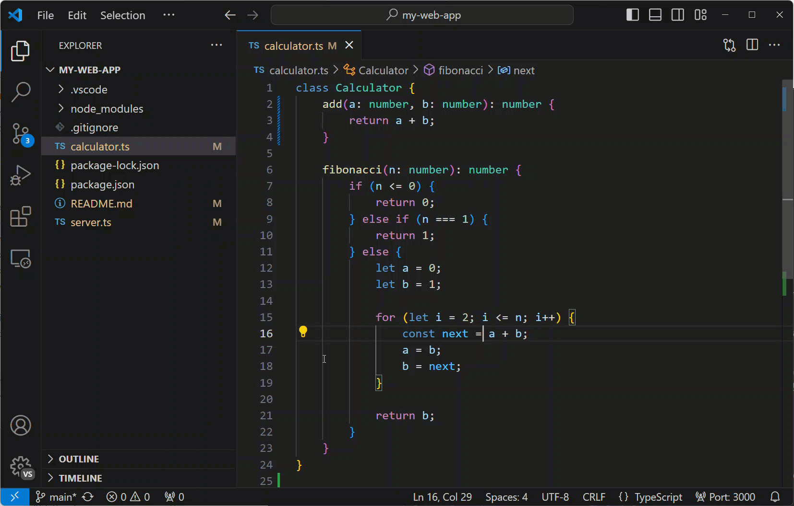

### 스테이징 {#staging}

#### 파일 변경 사항 스테이징 {#stage-file-changes}

파일 수 위에 마우스를 올리고 더하기 버튼을 선택하여 파일을 스테이징할 수 있습니다.

빼기 버튼을 선택하여 변경 사항의 스테이징을 취소할 수 있습니다.

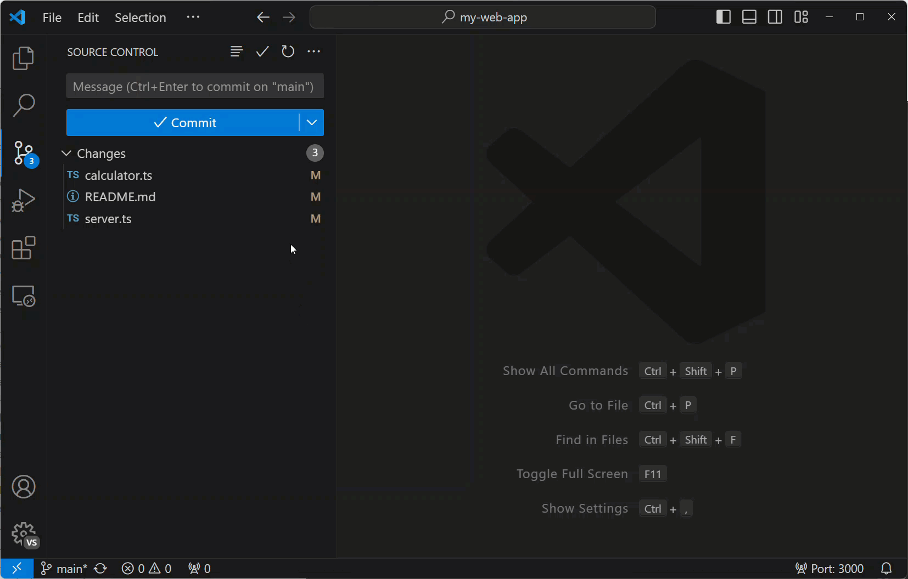

#### 선택 영역 스테이징 {#stage-selected}

파일에서 텍스트를 선택한 다음 **Command Palette**나 차이점 편집기 컨텍스트 메뉴(우클릭)에서 **Stage Selected Ranges**을 선택하여 파일의 일부를 스테이징할 수 있습니다.

### 마지막 커밋 실행 취소 {#undo-last-commit}

(...) 버튼을 선택한 다음 **Commit** > **Undo Last Commit**를 선택하여 이전 커밋을 실행 취소합니다. 변경 사항은 스테이징된 변경 사항 섹션에 추가됩니다.


### Git 출력 보기 {#see-git-output}

VS Code는 어떤 Git 명령이 실제로 실행되고 있는지 쉽게 볼 수 있게 해줍니다. 이는 Git을 배우는 중이거나 어려운 소스 제어 문제를 디버깅할 때 도움이 될 수 있습니다.

Git 출력을 보려면 소스 제어 보기에서 (...) 버튼을 선택한 다음 **Show Git Output**를 선택하거나, **Git: Show Git Output** 명령을 사용하거나, **Toggle Output** 명령(`Ctrl+Shift+U`)을 사용한 다음 드롭다운에서 **Git**을 선택하세요.

### 거터 표시기 {#gutter-indicators}

편집기는 거터에 변경 사항(추가, 변경 또는 제거된 줄)이 있는 위치와 종류에 대한 시각적 단서를 제공합니다. 자세한 내용은 [소스 제어 문서](/docs/sourcecontrol/overview.md#gutter-indicators)를 참조하세요.

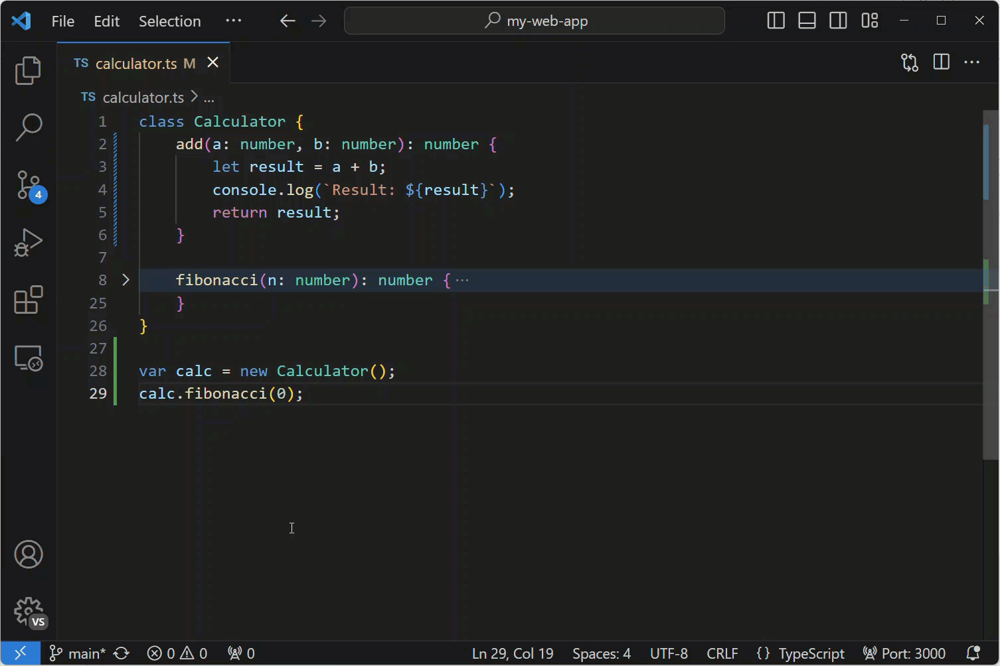

### 병합 충돌 해결 {#resolve-merge-conflicts}

병합 중에 **Source Control** 화면(`Ctrl+Shift+G`)로 이동하여 차이점 보기에서 변경을 수행하세요.

인라인 CodeLens를 사용하여 **Accept Current Change**, **Accept Incoming Change**, **Accept Both Changes** 및 **Compare Changes**를 통해 병합 충돌을 해결할 수 있습니다.


소스 제어 문서에서 [병합 충돌 해결](/docs/sourcecontrol/overview.md#merge-conflicts)에 대해 자세히 알아보세요.

### VS Code를 기본 병합 도구로 설정 {#set-vs-code-as-default-merge-tool}

```bash
git config --global merge.tool vscode
git config --global mergetool.vscode.cmd 'code --wait $MERGED'
```

### VS Code를 기본 차이점 도구로 설정 {#set-vs-code-as-default-diff-tool}

```bash
git config --global diff.tool vscode
git config --global difftool.vscode.cmd 'code --wait --diff $LOCAL $REMOTE'
```

## 클립보드와 파일 비교 {#compare-file-with-the-clipboard}

키보드 단축키: `Ctrl+K C`

명령 팔레트(`Ctrl+Shift+P`)에서 **File: Compare Active File with Clipboard** 명령을 사용하여 활성 파일을 클립보드의 내용과 빠르게 비교할 수 있습니다.

## 디버깅 {#debugging}

### 디버거 구성 {#configure-debugger}

실행 및 디버그 보기(`Ctrl+Shift+D`)에서 **create a launch.json file**를 선택하면 프로젝트와 일치하는 환경(Node.js, Python, C++ 등)을 선택하라는 메시지가 표시됩니다. 이렇게 하면 작업 영역에 디버거 구성이 포함된 `launch.json` 파일이 생성됩니다.

Node.js 지원은 기본적으로 제공되며 다른 환경은 적절한 언어 확장을 설치해야 합니다. 자세한 내용은 [디버깅 문서](/docs/editor/debugging.md)를 참조하세요.

### 중단점과 단계별 실행 {#breakpoints-and-stepping-through}

**editor margin**을 선택하거나 현재 줄에서 `F9`를 사용하여 중단점을 토글하세요. 편집기 여백의 중단점은 일반적으로 빨간색 채워진 원으로 표시됩니다.

디버그 세션이 시작되면 편집기 상단에 **Debug toolbar**이 나타나며, 디버깅하는 동안 코드를 단계별로 실행하거나 코드 내부로 들어갈 수 있습니다. 디버깅 문서에서 [디버그 작업](/docs/editor/debugging.md#debug-actions)에 대해 자세히 알아보세요.


### 데이터 검사 {#data-inspection}

변수는 **Run and Debug** 보기의 **VARIABLES** 섹션에서, 편집기에서 해당 소스 위에 마우스를 올리거나 디버그 콘솔을 사용하여 검사할 수 있습니다.


### 로그점 {#logpoints}

로그점은 중단점과 비슷하게 작동하지만 디버거를 중지하는 대신 콘솔에 메시지를 기록합니다. 로그점은 수정하거나 일시 중지할 수 없는 프로덕션 서버를 디버깅할 때 로깅을 주입하는 데 특히 유용합니다.

왼쪽 편집기 거터에서 **Add Logpoint** 명령을 사용하여 로그점을 추가하면 "다이아몬드" 모양 아이콘으로 표시됩니다. 로그 메시지는 일반 텍스트이지만 중괄호('{}') 안에 평가할 표현식을 포함할 수 있습니다.


### 트리거된 중단점 {#triggered-breakpoints}

트리거된 중단점은 다른 중단점이 히트되었을 때 자동으로 활성화되는 중단점입니다. 이들은 특정 전제 조건 이후에만 발생하는 코드의 실패 사례를 진단할 때 매우 유용할 수 있습니다.

트리거된 중단점은 거터 여백을 우클릭하고 **Add Triggered Breakpoint**를 선택한 다음 어떤 다른 중단점이 이 중단점을 활성화할지 선택하여 설정할 수 있습니다.

<video autoplay loop controls muted style={{ maxWidth: '100%' }}>

<source src="https://code.visualstudio.com/assets/docs/editor/debugging/debug-triggered-breakpoint.mp4" type="video/mp4" />
</video>

## 작업 실행기 {#task-runner}

VS Code의 작업은 스크립트를 실행하고 프로세스를 시작하도록 구성할 수 있어서, 이러한 도구들을 명령줄을 입력하거나 새 코드를 작성하지 않고도 VS Code 내에서 사용할 수 있습니다.

### 작업 자동 감지 {#auto-detect-tasks}

상단 메뉴에서 **Terminal**을 선택하고 **Configure Tasks** 명령을 실행한 다음 실행하고 싶은 작업 유형을 선택하세요.
이렇게 하면 다음과 같은 내용의 `tasks.json` 파일이 생성됩니다. 자세한 내용은 [작업](/docs/editor/tasks.md) 문서를 참조하세요.

```json
{
  // tasks.json 형식에 대한 설명서는
  // https://go.microsoft.com/fwlink/?LinkId=733558을 참조하세요.
  "version": "2.0.0",
  "tasks": [
    {
      "type": "npm",
      "script": "install",
      "group": {
        "kind": "build",
        "isDefault": true
      }
    }
  ]
}
```

자동 생성에는 때때로 문제가 있을 수 있습니다. 올바르게 작동하도록 하기 위해 문서를 확인하세요.

### 터미널 메뉴에서 작업 실행 {#run-tasks-from-the-terminal-menu}

상단 메뉴에서 **Terminal**을 선택하고 **Run Task** 명령을 실행한 다음 실행하려는 작업을 선택하세요. **Terminate Task** 명령을 실행하여 실행 중인 작업을 종료하세요.


### 작업에 대한 키보드 단축키 정의 {#define-keyboard-shortcuts-for-tasks}

모든 작업에 대해 키보드 단축키를 정의할 수 있습니다. **Command Palette**(`Ctrl+Shift+P`)에서 **Preferences: Open Keyboard Shortcuts File**를 선택하고, `workbench.action.tasks.runTask` 명령에 원하는 단축키를 바인딩하고, **Task**를 `args`로 정의하세요.

예를 들어, `Ctrl+H`를 `Run tests` 작업에 바인딩하려면 다음을 추가하세요:

```json
{
  "key": "ctrl+h",
  "command": "workbench.action.tasks.runTask",
  "args": "Run tests"
}
```

### 탐색기에서 npm 스크립트를 작업으로 실행 {#run-npm-scripts-as-tasks-from-the-explorer}

탐색기 보기에서 스크립트를 편집기에서 열거나, 작업으로 실행하거나, 노드 디버거로 실행(스크립트가 `--inspect-brk`와 같은 디버그 옵션을 정의한 경우)할 수 있습니다. 클릭 시 기본 동작은 스크립트를 여는 것입니다. 한 번의 클릭으로 스크립트를 실행하려면 `npm.scriptExplorerAction`을 `run`으로 설정하세요. `npm.exclude` 설정을 사용하여 특정 폴더에 포함된 `package.json` 파일의 스크립트를 제외할 수 있습니다.

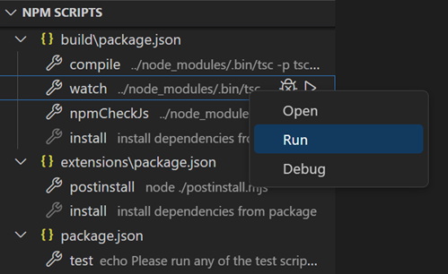

`npm.enableRunFromFolder` 설정을 사용하면 탐색기 보기 컨텍스트 메뉴에서 npm 스크립트를 실행할 수 있습니다. 이 설정은 폴더를 선택했을 때 **Run NPM Script in Folder...** 명령을 활성화합니다. 이 명령은 이 폴더에 포함된 npm 스크립트의 빠른 선택 목록을 표시하고 작업으로 실행할 스크립트를 선택할 수 있습니다.

## 휴대용 모드 {#portable-mode}

VS Code에는 [휴대용 모드](/docs/editor/portable.md)가 있어 설정과 데이터를 설치 위치와 동일한 위치에 보관할 수 있습니다(예: USB 드라이브에).

## Insiders 빌드 {#insiders-builds}

Visual Studio Code 팀은 VS Code의 최신 기능과 버그 수정을 테스트하기 위해 Insiders 버전을 사용합니다. [여기서 다운로드](/insiders)하여 Insiders 버전을 사용할 수도 있습니다.

- 얼리 어답터를 위한 버전 - Insiders는 사용자와 확장 프로그램 작성자가 시도해볼 수 있는 가장 최신 코드 변경 사항을 제공합니다.
- 빈번한 빌드 - 최신 버그 수정과 기능이 포함된 새로운 빌드가 매일 제공됩니다.
- 나란히 설치 - Insiders는 안정 버전 옆에 설치되어 두 버전을 독립적으로 사용할 수 있습니다.
