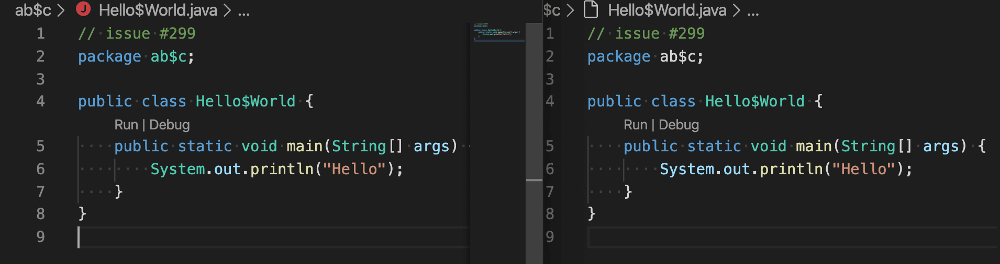
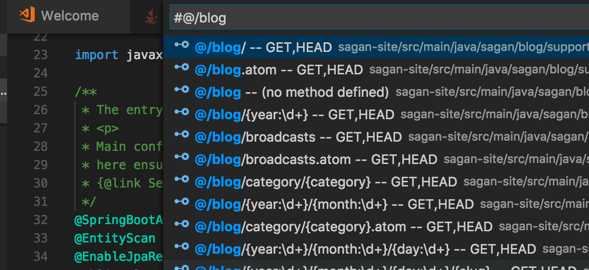

# Java 소스 코드 탐색 및 편집 {#navigate-and-edit-java-source-code}

Visual Studio Code는 풍부한 편집 [기능](/docs/editor/codebasics.md)을 갖춘 소스 코드 에디터입니다. 이 문서에서는 Java 작업 시 도움이 되는 몇 가지 Java 관련 기능들을 살펴보겠습니다.

아래 기능들을 사용하면서 문제가 발생하면 [이슈](https://github.com/microsoft/vscode-java-pack/issues)를 등록하여 문의할 수 있습니다.

## 코드 탐색 {#code-navigation}

[개요 보기](/docs/getstarted/userinterface.md#outline-view)를 사용하면 현재 파일 내의 구성 요소를를 편리하게 탐색할 수 있습니다. [프로젝트 보기](/docs/java/java-project.md#projects-view)도 프로젝트의 전반적인 개요를 제공합니다. Java 에디터로서 호출 계층, 타입 계층, 정의 탐색, 작업 공간에서 타입 검색 등도 지원합니다.

## 심볼 검색 {#search-for-symbols}

코드를 더 빠르게 탐색하기 위해 현재 파일이나 작업 공간에서 심볼을 검색할 수 있습니다.

### 작업 공간에서 심볼 검색 {#search-for-symbols-in-the-workspace}

현재 작업 공간에서 심볼을 검색하려면 `Ctrl+T`를 먼저 누른 다음 심볼 이름을 입력하세요. 이전과 같이 잠재적인 일치 항목 목록이 나타날 것입니다. 아직 열려있지 않은 파일에서 찾은 일치 항목을 선택하면 해당 파일이 열린 후 일치하는 위치로 이동합니다. 또는 **빠른 열기**(`Ctrl+P`)를 사용한 다음 '#' 명령을 입력하여 현재 작업 공간을 검색할 수도 있습니다. `Ctrl+T`는 '#' 명령의 단축키일 뿐이므로 모든 것이 동일하게 작동합니다.

<video autoplay loop muted playsinline controls title="작업 공간에서 심볼 검색" style={{maxWidth: '100%'}}>

  <source src="https://code.visualstudio.com/docs/java/java-editing/search-in-workspace.mp4" type="video/mp4" />
</video>

### 현재 파일에서 심볼 검색 {#search-for-symbols-in-current-file}

현재 파일에서 심볼을 검색하려면 **빠른 열기**(`Ctrl+P`)를 사용한 다음 '@' 명령을 입력하고 찾고자 하는 심볼의 이름을 입력하세요. 잠재적인 일치 항목 목록이 나타나고 입력할 때마다 필터링됩니다. 일치 항목 목록에서 선택하여 해당 위치로 이동할 수 있습니다.

<video autoplay loop muted playsinline controls title="현재 파일에서 심볼 검색" style={{maxWidth: '100%'}}>

  <source src="https://code.visualstudio.com/docs/java/java-editing/search-in-file.mp4" type="video/mp4" />
</video>

## 정의 미리보기 {#peek-definition}

정의 미리보기 기능을 사용하여 심볼이 어떻게 정의되었는지 빠르게 살펴볼 수 있습니다. 이 기능은 미리보기 창 안에 정의 근처의 몇 줄의 코드를 표시하므로, 현재 위치에서 벗어나지 않고도 살펴볼 수 있습니다.

심볼의 정의를 미리보려면 소스 코드에서 해당 심볼이 사용된 곳 어디에나 커서를 놓고 `Alt+F12`를 누르세요. 또는 컨텍스트 메뉴에서 **Peek Definition**를 선택할 수 있습니다(마우스 오른쪽 버튼을 클릭한 다음 **Peek Definition** 선택).

## 정의로 이동 {#go-to-definition}

또한 정의로 이동하는 기능을 사용하여 심볼이 정의된 곳으로 빠르게 이동할 수 있습니다.

심볼의 정의로 이동하려면 소스 코드에서 해당 심볼이 사용된 곳 어디에나 커서를 놓고 `F12`를 누르세요. 또는 컨텍스트 메뉴에서 **Go to Definition**을 선택할 수 있습니다(마우스 오른쪽 버튼을 클릭한 다음 **Go to Definition** 선택). 심볼의 정의가 하나뿐인 경우 해당 위치로 직접 이동하지만, 경쟁하는 정의가 있는 경우 이전 섹션에서 설명한 대로 미리보기 창에 표시되며 이동하고자 하는 정의를 선택해야 합니다.

## 상위 구현으로 이동 {#go-to-super-implementation}

마우스를 올렸을 때 나타나는 **Go to Super Implementation** 링크를 클릭하여 클래스 구현과 메서드 오버라이딩을 추적할 수 있습니다.

<video autoplay loop muted playsinline controls title="상위 구현으로 이동" style={{maxWidth: '100%'}}>

  <source src="https://code.visualstudio.com/docs/java/java-editing/goto-super-implementation.mp4" type="video/mp4" />
</video>

## 호출 계층 {#call-hierarchy}

호출 계층 보기는 함수로부터의 모든 호출이나 함수에 대한 모든 호출을 보여주며 호출자의 호출자와 호출의 호출을 자세히 살펴볼 수 있게 해줍니다. 함수를 마우스 오른쪽 버튼으로 클릭하고 **Peek > Peek Call Hierarchy**를 선택하세요.

함수 본문에서 마우스 오른쪽 버튼을 클릭하고 **호출 계층 표시**를 선택할 수도 있습니다.

## 타입 계층 {#type-hierarchy}

타입 계층 보기는 Java 객체 간의 상속 관계를 보여줍니다. 타입을 마우스 오른쪽 버튼으로 클릭하고 **Show Type Hierarchy**를 선택할 수 있습니다.

<video autoplay loop muted playsinline controls title="타입 계층" style={{maxWidth: '100%'}}>

  <source src="https://code.visualstudio.com/docs/java/java-editing/type-hierarchy.mp4" type="video/mp4" />
</video>

## 접기 영역 {#folding-regions}

접기 영역을 사용하면 소스 코드를 더 잘 볼 수 있도록 코드 스니펫을 접거나 펼 수 있습니다.

<video autoplay loop muted playsinline controls title="접기 영역" style={{maxWidth: '100%'}}>

  <source src="https://code.visualstudio.com/docs/java/java-editing/folding-range.mp4" type="video/mp4" />
</video>

## 스마트 선택 {#smart-selection}

[스마트 선택](https://code.visualstudio.com/updates/v1_33#_smart-select-api)(의미론적 선택)을 사용하면 소스 코드에서 커서 위치의 의미론적 정보를 기반으로 선택 범위를 확장하거나 축소할 수 있습니다.

- 선택을 확장하려면 `Shift+Alt+Right`를 사용하세요.
- 선택을 축소하려면 `Shift+Alt+Left`를 사용하세요.

<video autoplay loop muted playsinline controls title="스마트 선택" style={{maxWidth: '100%'}}>

  <source src="https://code.visualstudio.com/docs/java/java-editing/smart-selection.mp4" type="video/mp4" />
</video>

## 의미론적 강조 {#semantic-highlighting}

구문 강조는 코드를 더 효율적으로 읽을 수 있게 해주는 중요한 기능입니다. [의미론적 강조](https://github.com/microsoft/vscode/wiki/Semantic-Highlighting-Overview)의 도움으로 VS Code는 Java 언어 서비스의 심볼 정보를 기반으로 더 정확한 소스 코드 색상을 제공할 수 있습니다.

아래는 단 하나의 예시입니다. 왼쪽은 의미론적 강조를 활성화한 후의 동작이고 오른쪽은 구문 강조만 있는 경우입니다.

Java 의미론적 강조에 대한 자세한 내용은 [Java Language Support 확장 위키](https://github.com/redhat-developer/vscode-java/wiki/Semantic-Highlighting)에서 확인할 수 있습니다.

## Spring Boot로 코드 탐색 {#navigating-code-with-spring-boot}

[Spring Boot Tools](https://marketplace.visualstudio.com/items?itemName=vmware.vscode-spring-boot) 확장은 Spring Boot 프로젝트에 대한 향상된 탐색과 코드 완성 지원을 제공합니다.

- `@/`는 정의된 모든 요청 매핑을 보여줍니다 (매핑된 경로, 요청 메서드, 소스 위치)
- `@+`는 정의된 모든 빈을 보여줍니다 (빈 이름, 빈 타입, 소스 위치)
- `@>`는 모든 함수를 보여줍니다 (프로토타입 구현)
- `@`는 코드의 모든 Spring 어노테이션을 보여줍니다

Visual Studio Code에서의 Spring Boot 지원에 대해 더 자세히 알아보려면 [Visual Studio Code의 Spring Boot](/docs/java/java-spring-boot.md)를 읽어보세요.

## 코드 편집 {#code-editing}

IntelliSense의 스마트 코드 완성 및 시그니처 상세 정보를 통해 코드 편집도 쉽습니다. 생산성을 더욱 향상시키기 위해 코드 스니펫뿐만 아니라 Getter/Setter 생성 및 가져오기 구성과 같은 다양한 코드 작업을 사용할 수 있습니다.

<video autoplay loop muted playsinline controls title="코드 편집" style={{maxWidth: '100%'}}>

  <source src="https://code.visualstudio.com/docs/java/java-editing/code-editing.mp4" type="video/mp4" />
</video>

Visual Studio Code의 Java 지원은 코드 내의 문제를 자동으로 감지하고 빠른 수정 제안을 제공합니다.

<video autoplay loop muted playsinline controls title="빠른 수정 제안" style={{maxWidth: '100%'}}>

  <source src="https://code.visualstudio.com/docs/java/java-editing/quick-fix.mp4" type="video/mp4" />
</video>

리팩토링과 코드 작업에 대한 자세한 내용은 [리팩토링 및 소스 작업](/docs/java/java-refactoring.md)을 참조하세요.

## IntelliSense {#intellisense}

Visual Studio Code의 Java용 코드 완성은 [Red Hat의 Java™용 언어 지원](https://marketplace.visualstudio.com/items?itemName=redhat.java)에 의해 제공됩니다. 이 확장은 Eclipse의 [Java 개발 도구(JDT)](https://www.eclipse.org/jdt/)와 동일한 도구를 기반으로 하므로 동일한 수준의 지원을 기대할 수 있습니다.

또한 [IntelliCode](https://visualstudio.microsoft.com/services/intellicode/)라고 하는 AI 지원 IntelliSense도 있습니다. 사용할 가능성이 가장 높은 것을 완성 목록의 맨 위에 배치하여 시간을 절약해 줍니다. IntelliCode 추천은 GitHub에서 100개 이상의 별을 받은 수천 개의 오픈 소스 프로젝트를 기반으로 하므로, 높은 품질의 프로젝트에서 가장 일반적인 사용법을 학습했습니다. 코드의 컨텍스트와 결합되면 완성 목록이 이러한 관행을 촉진하도록 맞춤화됩니다. 다음은 Java용 IntelliCode의 동작 모습입니다.

<video autoplay loop muted playsinline controls title="IntelliSense 코드 완성 제안" style={{maxWidth: '100%'}}>

  <source src="https://code.visualstudio.com/docs/java/java-editing/intellicode.mp4" type="video/mp4" />
</video>

IntelliCode는 Java SE 및 Spring과 같은 인기 있는 Java 라이브러리와 프레임워크에서 잘 작동합니다. 모놀리식 웹 앱을 만들든 현대적인 마이크로서비스를 만들든 도움이 될 것입니다.

## 새 파일 생성 {#create-new-file}

VS Code는 Java 소스 파일을 생성할 때 템플릿을 적용하는 것을 지원합니다. 파일 탐색기에서 `.java` 파일을 생성하면 언어 서버가 자동으로 클래스 본문을 생성하고 패키지 정보를 채웁니다:

<video autoplay loop muted playsinline controls title="새 파일 생성" style={{maxWidth: '100%'}}>

  <source src="https://code.visualstudio.com/docs/java/java-editing/create-new-file.mp4" type="video/mp4" />
</video>

## 코드 스니펫 {#code-snippets}

Visual Studio Code는 class/interface, syserr, sysout, if/else, try/catch, static main 메서드와 같은 다양한 인기 있는 Java 코드 스니펫을 지원하여 생산성을 높여줍니다. Java 언어 서버의 정보를 사용하여 선택하는 동안 코드 스니펫의 미리보기도 제공합니다.

예를 들어, "**sout**" 또는 "**sysout**"을 입력하면 `System.out.println()`의 코드 스니펫이 생성됩니다. 
마찬가지로, "**main**" 또는 "**psvm**"을 입력하면 `public static void main(String[] args) {}`의 코드 스니펫이 생성됩니다.

단축키의 전체 목록은 아래와 같습니다:

### 코드 스니펫 단축키 {#code-snippet-shortcuts}

| 단축키                | 설명                           |
| --------------------- | ------------------------------ |
| ctor                  | Public 생성자                  |
| dowhile               | Do-while 문                    |
| foreach, iter         | 배열 또는 Iterable 반복        |
| fori                  | 배열 반복                      |
| if                    | If 문                          |
| ifelse                | If-else 문                     |
| ifnull                | null 체크하는 If 문            |
| ifnotnull             | not null 체크하는 If 문        |
| main, psvm            | Public static main 메서드      |
| new                   | 새 객체 생성                   |
| private_method        | Private 메서드                 |
| private_static_method | Private static 메서드          |
| prf                   | Private 필드                   |
| protected_method      | Protected 메서드               |
| public_method         | Public 메서드                  |
| public_static_method  | Public static 메서드           |
| switch                | Switch 문                      |
| syserr, serr          | 표준 에러에 출력               |
| sysout, sout          | 표준 출력에 출력               |
| systrace, soutm       | 현재 메서드를 표준 출력에 출력 |
| try_catch             | Try/catch 블록                 |
| try_resources         | Try-with-resources 문          |
| while                 | While 문                       |

### 후위 스니펫 단축키 {#postfix-snippet-shortcuts}

| 단축키 | 템플릿 내용                              | 설명                                                    |
| ------ | ---------------------------------------- | ------------------------------------------------------- |
| cast   | ((SomeType) expr)                        | 표현식을 새로운 타입으로 캐스트                         |
| else   | if (!expr)                               | 부정된 if 문을 생성                                     |
| for    | for (T item : expr)                      | for 문을 생성                                           |
| fori   | for (int i = 0; i < expr.length; i++)    | 배열을 반복하는 for 문을 생성                           |
| forr   | for (int i = expr.length-1; i >= 0; i--) | 배열을 역순으로 반복하는 for 문을 생성                  |
| if     | if (expr)                                | if 문을 생성                                            |
| nnull  | if (expr != null)                        | if 문을 생성하고 표현식이 null이 아닌지 확인            |
| null   | if (expr == null)                        | 표현식이 null인지 확인하는 if 문을 생성                 |
| sysout | System.out.println(expr)                 | 영향을 받는 문자열을 System.out.println(..) 호출로 전송 |
| throw  | throw expr                               | 주어진 Exception을 throw                                |
| var    | T name = expr                            | 새로운 변수를 생성                                      |
| while  | while (expr) {}                          | while 루프를 생성                                       |
