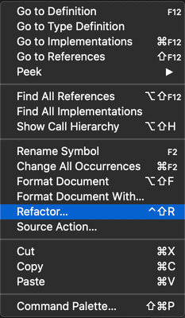

# Java 리팩토링 및 소스 작업 {#java-refactoring-and-source-actions}

Visual Studio Code는 코딩하는 동안 코드를 생성하고 문제를 해결하기 위한 소스 작업뿐만 아니라 소스 코드를 리팩토링하는 많은 옵션을 제공합니다. 이러한 옵션에 접근하려면 `전구` 💡가 보일 때마다 클릭하세요. 또는 에디터 뷰에서 마우스 오른쪽 버튼을 클릭하고 **Source Action...** 을 선택하세요.

## 지원되는 코드 작업 목록 {#list-of-supported-code-actions}

- [리팩토링](#refactoring)
  - [변수에 할당](#assign-to-variable)
  - [익명 클래스를 중첩 클래스로 변환](#convert-anonymous-to-nested-class)
  - [익명 클래스 생성으로 변환](#convert-to-anonymous-class-creation)
  - [향상된 for 루프로 변환](#convert-to-enhanced-for-loop)
  - [람다 표현식으로 변환](#convert-to-lambda-expression)
  - [정적 임포트로 변환](#convert-to-static-import)
  - 추출 리팩토링
    - [상수로 추출](#extract-to-constant)
    - [필드로 추출](#extract-to-field)
    - [메서드로 추출](#extract-to-method)
    - [로컬 변수로 추출](#extract-to-local-variable)
  - 인라인 리팩토링
    - [상수 인라인화](#inline-constant)
    - [로컬 변수 인라인화](#inline-local-variable)
    - [메서드 인라인화](#inline-method)
  - 부울 반전
    - [조건 반전](#invert-conditions)
    - [로컬 변수 반전](#invert-local-variable)
  - [이동](#move)
  - [이름 변경](#rename)
  - 타입 변경
    - [정확히 추론된 타입을 var 타입으로 변경](#change-resolved-type-to-var-type)
    - [var 타입을 정확히 추론된 타입으로 변경](#change-var-type-to-resolved-type)
- [소스 작업](#source-actions)
  - [생성자 생성](#generate-constructors)
  - [위임 메서드 생성](#generate-delegate-methods)
  - [메서드 오버라이드/구현](#overrideimplement-methods)
  - [임포트 구성](#organize-imports)
  - [getter와 setter 생성](#generate-getters-and-setters)
  - [`hashCode()`와 `equals()` 생성](#generate-hashcode-and-equals)
  - [`toString()` 생성](#generate-tostring)
  - [가능한 경우 수정자를 final로 변경](#change-modifiers-to-final-where-possible)
- 지원되는 기타 코드 작업
  - [접근 불가능한 참조 수정](#fix-nonaccessible-reference)
  - [존재하지 않는 패키지 생성](#create-non-existing-package)
  - [기타](#other-code-actions-supported)

## 리팩토링 {#refactoring}

Java 프로그램 리팩토링의 목표는 프로그램의 동작에 영향을 주지 않으면서 시스템 전반의 코드 변경을 수행하는 것입니다. VS Code용 Java 언어 지원은 많은 쉽게 접근할 수 있는 리팩토링 옵션을 제공합니다.

### 리팩토링 호출 {#invoke-refactoring}

리팩토링 명령은 에디터의 컨텍스트 메뉴에서 사용할 수 있습니다. 리팩토링하려는 요소를 선택하고, 마우스 오른쪽 버튼을 클릭하여 컨텍스트 메뉴를 열고, **Refactor...** 를 선택하세요:



그러면 사용 가능한 모든 리팩토링 옵션이 표시됩니다.

### 변수에 할당 {#assign-to-variable}

표현식을 로컬 변수나 필드에 할당합니다.

#### 예시

##### 이전

```java
Arrays.asList("apple", "lemon", "banana");
```

##### 이후

```java
List<String> fruits = Arrays.asList("apple", "lemon", "banana");
```

또한 생성자에서 사용되지 않는 매개변수를 새 필드에 할당하는 데도 사용할 수 있습니다.

<video autoplay loop muted playsinline controls title="매개변수를 새 필드에 할당" style={{ maxWidth: '100%' }}>

  <source src="https://code.visualstudio.com/docs/java/java-refactoring/assign-to-field.mp4" type="video/mp4" />
</video>

### 익명 클래스를 중첩 클래스로 변환 {#convert-anonymous-to-nested-class}

익명 내부 클래스를 멤버 클래스로 변환합니다.

#### 예시

익명 클래스 `Interface(){...}`를 클래스 `Clazz`의 멤버로 변환해 보겠습니다.

##### 이전

```java
public class Clazz {
  public Interface method() {
    final boolean isValid = true;
    return new Interface() {
      public boolean isValid() {
        return isValid;
      }
    };
  }
}
```

##### 이후

```java
public class Clazz {
  private final class MyInterface extends Interface {
    private final boolean isValid;

    private MyInterface(boolean isValid) {
      this.isValid = isValid;
    }

    public boolean isValid() {
      return isValid;
    }
  }

  public Interface method() {
    final boolean isValid = true;
    return new MyInterface(isValid);
  }
}
```

### 익명 클래스 생성으로 변환 {#convert-to-anonymous-class-creation}

람다 표현식을 익명 클래스 생성으로 변환합니다.

#### 예시

변수 `runnable`이 람다 표현식으로 할당되어 있습니다. 이를 익명 클래스 생성으로 변환해 보겠습니다.

##### 이전

```java
public void method() {
  Runnable runnable = () -> {
    // 무언가 수행
  };
}
```

##### 이후

```java
public void method() {
  Runnable runnable = new Runnable() {
    @Override
    public void run() {
      // 무언가 수행
    }
  };
}
```

> 참조: [람다 표현식으로 변환](#convert-to-lambda-expression)

### 향상된 for 루프로 변환 {#convert-to-enhanced-for-loop}

단순 `for` 루프를 `for-each` 스타일로 변환합니다.

#### 예시

##### 이전

```java
public void order(String[] books) {
  for (int i = 0; i < books.length; i++) {
    // 무언가 수행
  }
}
```

##### 이후

```java
public void order(String[] books) {
  for (String book : books) {
    // 무언가 수행
  }
}
```

<video autoplay loop muted playsinline controls title="향상된 for 루프로 변환" style={{ maxWidth: '100%' }}>

  <source src="https://code.visualstudio.com/docs/java/java-refactoring/convert-for-loop.mp4" type="video/mp4" />
</video>

### 람다 표현식으로 변환 {#convert-to-lambda-expression}

익명 클래스 생성을 람다 표현식으로 변환합니다.

#### 예시

익명 클래스 `Runnable(){...}`을 람다 표현식으로 변환해 보겠습니다.

##### 이전

```java
public void method() {
  Runnable runnable = new Runnable(){
    @Override
    public void run() {
      // 무언가 수행
    }
  };
}
```

##### 이후

```java
public void method() {
    Runnable runnable = () -> {
      // 무언가 수행
    };
  }
```

> 참조: [익명 클래스 생성으로 변환](#convert-to-anonymous-class-creation)

### 정적 임포트로 변환 {#convert-to-static-import}

필드나 메서드를 정적 임포트로 변환합니다.

#### 예시

`Assert.assertEquals()` 호출을 정적 임포트로 변환해 보겠습니다.

##### 이전

```java
import org.junit.Assert;
...
public void test() {
  Assert.assertEquals(expected, actual);
}
```

##### 이후

```java
import static org.junit.Assert.assertEquals;
...
public void test() {
  assertEquals(expected, actual);
}
```

<video autoplay loop muted playsinline controls title="정적 임포트로 변환" style={{ maxWidth: '100%' }}>

  <source src="https://code.visualstudio.com/docs/java/java-refactoring/convert-static-imports.mp4" type="video/mp4" />
</video>

### 상수로 추출 {#extract-to-constant}

선택된 표현식으로부터 정적 최종 필드를 생성하고 필드 참조로 대체한 다음, 동일한 표현식이 발생하는 다른 위치를 다시 작성합니다.

#### 예시

π 값: `3.14`를 상수로 추출해 보겠습니다.

##### 이전

```java
public double getArea(double r) {
  return 3.14 * r * r;
}
```

##### 이후

```java
private static final double PI = 3.14;

public double getArea(double r) {
  return PI * r * r;
}
```

> 참조: [상수 인라인화](#inline-constant)

### 필드로 추출 {#extract-to-field}

새 필드를 선언하고 선택된 표현식으로 초기화합니다. 원래 표현식은 필드 사용으로 대체됩니다.

#### 예시

변수 `area`를 `Square` 클래스의 필드로 추출해 보겠습니다.

##### 이전

```java
class Square {
  public void calculateArea() {
    int height = 1;
    int width = 2;
    int area = height * width;
  }
}
```

##### 이후

```java
class Square {
  private int area;

  public void calculateArea() {
    int height = 1;
    int width = 2;
    area = height * width;
  }
}
```

<video autoplay loop muted playsinline controls title="필드로 추출" style={{ maxWidth: '100%' }}>

  <source src="https://code.visualstudio.com/docs/java/java-refactoring/extract-field.mp4" type="video/mp4" />
</video>

변수 선언을 선택할 때, 변수를 필드로 변환합니다.

<video autoplay loop muted playsinline controls title="변수를 필드로 변환" style={{ maxWidth: '100%' }}>

  <source src="https://code.visualstudio.com/docs/java/java-refactoring/convert-field.mp4" type="video/mp4" />
</video>

### 메서드로 추출 {#extract-to-method}

현재 선택된 문이나 표현식을 포함하는 새로운 메서드를 생성하고 선택 항목을 새 메서드에 대한 참조로 대체합니다. 이 기능은 길고, 복잡하거나 지저분한 메서드를 정리하는 데 유용합니다.

#### 예시

표현식 `height * width`를 새 메서드로 추출해 보겠습니다.

##### 이전

```java
public void method() {
  int height = 1;
  int width = 2;
  int area = height * width;
}
```

##### 이후

```java
public void method() {
  int height = 1;
  int width = 2;
  int area = getArea(height, width);
}

private int getArea(int height, int width) {
  return height * width;
}
```

<video autoplay loop muted playsinline controls title="메서드로 추출" style={{ maxWidth: '100%' }}>

  <source src="https://code.visualstudio.com/docs/java/java-refactoring/refactor.mp4" type="video/mp4" />
</video>

> 참조: [메서드 인라인화](#inline-method)

### 로컬 변수로 추출 {#extract-to-local-variable}

현재 선택된 표현식에 할당된 새 변수를 만들고 선택 항목을 새 변수에 대한 참조로 대체합니다.

#### 예시

표현식 `platform.equalsIgnoreCase("MAC")`을 새 변수로 추출해 보겠습니다.

##### 이전

```java
public void method() {
  if (platform.equalsIgnoreCase("MAC")) {
    // 무언가 수행
  }
}
```

##### 이후

```java
public void method() {
  boolean isMac = platform.equalsIgnoreCase("MAC");
  if (isMac) {
    // 무언가 수행
  }
}
```

<video autoplay loop muted playsinline controls title="로컬 변수로 추출" style={{ maxWidth: '100%' }}>

  <source src="https://code.visualstudio.com/docs/java/java-refactoring/extract-local-variable.mp4" type="video/mp4" />
</video>

추출 후에는 같은 트랜잭션에서 이름 변경도 수행할 수 있습니다.

<video autoplay loop muted playsinline controls title="추출 후 로컬 변수 이름 변경" style={{ maxWidth: '100%' }}>

  <source src="https://code.visualstudio.com/docs/java/java-refactoring/extract-rename.mp4" type="video/mp4" />
</video>

> 참조: [로컬 변수 인라인화](#inline-local-variable)

### 상수 인라인화 {#inline-constant}

상수 참조를 정의된 값으로 대체합니다.

#### 예시

상수 `PI`를 정의된 값 `3.14`로 대체해 보겠습니다.

##### 이전

```java
private static final double PI = 3.14;

public double getArea(double r) {
  return PI * r * r;
}
```

##### 이후

```java
private static final double PI = 3.14;

public double getArea(double r) {
  return 3.14 * r * r;
}
```

> 참조: [상수로 추출](#extract-to-constant)

### 로컬 변수 인라인화 {#inline-local-variable}

중복된 변수 사용을 초기화 값으로 대체합니다.

#### 예시

변수 `isMac`을 직접 부울 표현식으로 대체해 보겠습니다.

##### 이전

```java
public void method() {
  boolean isMac = platform.equalsIgnoreCase("MAC");
  if (isMac) {
    // 무언가 수행
  }
}
```

##### 이후

```java
public void method() {
  if (platform.equalsIgnoreCase("MAC")) {
    // 무언가 수행
  }
}
```

> 참조: [로컬 변수로 추출](#extract-to-local-variable)

### 메서드 인라인화 {#inline-method}

메서드 호출을 메서드의 본문으로 대체합니다.

#### 예시

메서드 `getArea(int height, int width)`를 직접 표현식 `height * width`로 대체해 보겠습니다.

##### 이전

```java
public void method() {
  int height = 1;
  int width = 2;
  int area = getArea(height, width);
}

private int getArea(int height, int width) {
  return height * width;
}
```

##### 이후

```java
public void method() {
  int height = 1;
  int width = 2;
  int area = height * width;
}
```

<video autoplay loop muted playsinline controls title="메서드 호출을 메서드 본문으로 대체" style={{ maxWidth: '100%' }}>

  <source src="https://code.visualstudio.com/docs/java/java-refactoring/inline.mp4" type="video/mp4" />
</video>

> 참조: [메서드로 추출](#extract-to-method)

### 조건 반전 {#invert-conditions}

조건문의 부울 표현식을 반전시킵니다.

#### 예시

if 문의 부울 표현식을 반전시켜 보겠습니다.

##### 이전

```java
public void method(int value) {
  if (value > 5 && value < 15) {
    // 무언가 수행
  }
}
```

##### 이후

```java
public void method(int value) {
  if (value <= 5 || value >= 15) {
    // 무언가 수행
  }
}
```

### 로컬 변수 반전 {#invert-local-variable}

로컬 부울 변수를 반전시킵니다.

#### 예시

변수 `valid`를 반전시켜 보겠습니다.

##### 이전

```java
public void method(int value) {
  boolean valid = value > 5 && value < 15;
}
```

##### 이후

```java
public void method(int value) {
  boolean notValid = value <= 5 || value >= 15;
}
```

<video autoplay loop muted playsinline controls title="로컬 변수 반전" style={{ maxWidth: '100%' }}>

  <source src="https://code.visualstudio.com/docs/java/java-refactoring/invert-variable.mp4" type="video/mp4" />
</video>

### 이동 {#move}

선택된 요소를 이동하고 요소에 대한 모든 참조를 수정합니다(다른 파일에서도). 사용 가능한 작업은 다음과 같습니다:

- 클래스를 다른 패키지로 이동
- 정적 또는 인스턴스 메서드를 다른 클래스로 이동
- 내부 클래스를 새 파일로 이동

#### 예시

정적 메서드 `print()`를 `Office` 클래스에서 `Printer` 클래스로 이동해 보겠습니다.

##### 이전

```java
public class Office {
  public static void main(String[] args) {
    print();
  }

  public static void print() {
    System.out.println("This is printer");
  }

  static class Printer { }
}
```

##### 이후

```java
public class Office {
  public static void main(String[] args) {
    Printer.print();
  }

  static class Printer {
    public static void print() {
      System.out.println("This is printer");
    }
  }
}
```

자신의 클래스보다 다른 클래스에서 더 많이 사용되는 경우 정적 메서드에 대한 이동 리팩토링을 수행합니다.

<video autoplay loop muted playsinline controls title="정적 메서드에 대한 리팩토링" style={{ maxWidth: '100%' }}>

  <source src="https://code.visualstudio.com/docs/java/java-refactoring/move-static-method.mp4" type="video/mp4" />
</video>

클래스를 다른 패키지로 이동합니다. 현재는 파일 탐색기에서 이동 리팩토링이 지원되지 않습니다.

<video autoplay loop muted playsinline controls title="클래스를 다른 패키지로 이동" style={{ maxWidth: '100%' }}>

  <source src="https://code.visualstudio.com/docs/java/java-refactoring/move-class.mp4" type="video/mp4" />
</video>

내부 클래스를 새 파일로 이동합니다.

<video autoplay loop muted playsinline controls title="내부 클래스를 새 파일로 이동" style={{ maxWidth: '100%' }}>

  <source src="https://code.visualstudio.com/docs/java/java-refactoring/move-inner-type.mp4" type="video/mp4" />
</video>

### 이름 변경 {#rename}

기본 단축키: `F2`

선택된 요소의 이름을 변경하고 요소에 대한 다른 파일을 포함한 모든 참조를 수정합니다.

#### 예시

클래스 `Foo`의 이름을 `Bar`로 변경해 보겠습니다.

##### 이전

```java
public class Foo {
  // ...
}

public void myMethod() {
  Foo myClass = new Foo();
}
```

##### 이후

```java
public class Bar {
  // ...
}

public void myMethod() {
  Bar myClass = new Bar();
}
```

이름 변경 리팩토링을 호출하는 단축키는 `F2`입니다. 에디터에서 식별자에 대해 단축키를 호출하면 에디터 내에 작은 상자가 표시되어 식별자 이름을 변경할 수 있습니다. `Enter`를 누르면 해당 식별자에 대한 모든 참조도 변경됩니다.

<video autoplay loop muted playsinline controls title="이름 변경 리팩토링을 호출하는 단축키" style={{ maxWidth: '100%' }}>

  <source src="https://code.visualstudio.com/docs/java/java-refactoring/rename.mp4" type="video/mp4" />
</video>

이름 변경 리팩토링은 파일 탐색기에서도 폴더와 파일에 대해 지원됩니다. 변경을 요청한 후에는 영향을 받는 파일의 미리보기가 제공되며 이러한 변경 사항을 어떻게 적용할지 결정할 수 있습니다.


### 추론된 타입을 var 타입으로 변경 {#change-resolved-type-to-var-type}

로컬 변수를 선언하는 데 `var`를 사용합니다.

#### 예시

##### 이전

```java
String s = "";
```

##### 이후

```java
var s = "";
```

> 참조: [var 타입을 추론된 타입으로 변경](#change-var-type-to-resolved-type)

---

### var 타입을 추론된 타입으로 변경 {#change-var-type-to-resolved-type}

로컬 변수를 선언하는 데 추론된 타입을 사용합니다.

#### 예시

##### 이전

```java
var s = "";
```

##### 이후

```java
String s = "";
```

> 참조: [추론된 타입을 var 타입으로 변경](#change-resolved-type-to-var-type)

## 소스 작업 {#source-actions}

소스 작업은 공통 코드 구조와 반복되는 요소를 생성하는 데 사용될 수 있습니다. 일부는 즉석에서 코드 문제를 해결하는 데 도움이 되는 빠른 수정입니다.

### 생성자 생성 {#generate-constructors}

클래스의 생성자를 추가합니다.

<video autoplay loop muted playsinline controls title="생성자 생성" style={{ maxWidth: '100%' }}>

  <source src="https://code.visualstudio.com/docs/java/java-refactoring/generate-constructor.mp4" type="video/mp4" />
</video>

### 위임 메서드 생성 {#generate-delegate-methods}

위임 메서드를 생성합니다.

<video autoplay loop muted playsinline controls title="위임 메서드 생성" style={{ maxWidth: '100%' }}>

  <source src="https://code.visualstudio.com/docs/java/java-refactoring/generate-delegate-methods.mp4" type="video/mp4" />
</video>

### 메서드 오버라이드/구현 {#overrideimplement-methods}

이 소스 작업을 사용하면 모든 후보가 체크리스트와 함께 표시됩니다. 그런 다음 오버라이드하거나 구현할 항목을 결정할 수 있습니다.

<video autoplay loop muted playsinline controls title="메서드 오버라이드/구현" style={{ maxWidth: '100%' }}>

  <source src="https://code.visualstudio.com/docs/java/java-refactoring/override-implement-methods.mp4" type="video/mp4" />
</video>

### import 구성 {#organize-imports}

이 소스 작업을 사용하여 import를 정리할 수 있습니다. 또한 모호한 import도 처리할 수 있으며, 이 경우 결정을 돕기 위해 해결되지 않은 타입이 있는 코드 라인과 함께 드롭다운 목록이 표시됩니다.

<video autoplay loop muted playsinline controls title="import 구성" style={{ maxWidth: '100%' }}>

  <source src="https://code.visualstudio.com/docs/java/java-refactoring/resolve-ambiguous-imports.mp4" type="video/mp4" />
</video>

### getter와 setter 생성 {#generate-getters-and-setters}

모든 새로운 멤버 변수에 대해 getter와 setter를 일괄 생성할 수 있습니다. 클래스에 둘 이상의 필드가 있는 경우, 소스 작업은 접근자 메서드를 생성하는 데 사용할 대상 필드를 선택하기 위한 빠른 선택을 표시합니다.

<video autoplay loop muted playsinline controls title="getter와 setter 생성" style={{ maxWidth: '100%' }}>

  <source src="https://code.visualstudio.com/docs/java/java-refactoring/advancedgettersetter.mp4" type="video/mp4" />
</video>

### `hashCode()`와 `equals()` 생성 {#generate-hashcode-and-equals}

`hashCode()`와 `equals()`는 기본 구현과 함께 생성될 수 있습니다. 모든 비정적 멤버 변수가 나열되며 체크리스트를 사용하여 생성된 코드를 사용자 정의할 수 있습니다.

생성된 코드를 사용자 정의하는 두 가지 옵션이 있습니다:

- Java 7+ 이상을 사용하는 경우, `java.codeGeneration.hashCodeEquals.useJava7Objects`를 `true`로 설정하여 `Objects.hash`와 `Objects.equals`를 호출하는 더 짧은 코드를 생성할 수 있습니다.
- 또한 `java.codeGeneration.hashCodeEquals.useInstanceof`를 `true`로 설정하여 `Object.getClass()`를 호출하는 대신 `instanceOf` 연산자를 사용하여 객체 타입을 확인할 수 있습니다.

<video autoplay loop muted playsinline controls title="hashCode()와 equals() 생성" style={{ maxWidth: '100%' }}>

  <source src="https://code.visualstudio.com/docs/java/java-refactoring/generate-hashcode-equals.mp4" type="video/mp4" />
</video>

### `toString()` 생성 {#generate-tostring}

`toString()` 메서드를 생성하는 새로운 소스 작업이 있습니다. 모든 멤버 변수의 체크리스트를 사용하여 사용자 정의가 가능합니다.

<video autoplay loop muted playsinline controls title="toString() 생성" style={{ maxWidth: '100%' }}>

  <source src="https://code.visualstudio.com/docs/java/java-refactoring/generate-tostring.mp4" type="video/mp4" />
</video>

### 가능한 경우 수정자를 final로 변경 {#change-modifiers-to-final-where-possible}

현재 소스 파일의 모든 변수와 매개변수에 `final` 수정자를 추가합니다.

#### 예시

##### 이전

```java
public class Clazz {
  public void method(int value) {
    boolean notValid = value > 5;
    if (notValid) {
      // 무언가 수행
    }
  }
}
```

##### 이후

```java
public class Clazz {
  public void method(final int value) {
    final boolean notValid = value > 5;
    if (notValid) {
      // 무언가 수행
    }
  }
}
```

### 접근 불가능한 참조 수정 {#fix-nonaccessible-reference}

이 빠른 수정은 접근 불가능한 참조를 수정하는 데 도움이 됩니다.

<video autoplay loop muted playsinline controls title="접근 불가능한 참조 수정" style={{ maxWidth: '100%' }}>

  <source src="https://code.visualstudio.com/docs/java/java-refactoring/fix-non-access-reference.mp4" type="video/mp4" />
</video>

### 존재하지 않는 패키지 생성 {#create-non-existing-package}

패키지 이름이 폴더 이름과 일치하지 않을 때, 소스 코드의 패키지 이름을 변경하거나 파일 시스템에서 폴더를 이동할 수 있는 옵션이 있습니다(대상 폴더가 아직 존재하지 않는 경우에도).

<video autoplay loop muted playsinline controls title="존재하지 않는 패키지 생성" style={{ maxWidth: '100%' }}>

  <source src="https://code.visualstudio.com/docs/java/java-refactoring/create-non-exist-package.mp4" type="video/mp4" />
</video>

### 기타 지원되는 코드 작업 {#other-code-actions-supported}

VS Code가 지원하는 코드 작업 목록은 계속 늘어나고 있으며 위에서는 가장 인기 있는 것들만 나열했습니다. 기타 주목할 만한 지원되는 작업은 다음과 같습니다. 추가적인 기능돌도 존재합니다:

- 해결되지 않은 타입 생성
- `final` 수정자 제거
- 불필요한 캐스트 제거
- 중복 인터페이스 제거
- switch 문에 누락된 case 레이블 추가
- break/continue에서 정의로 이동
- 정적 요소에 대한 접근 수정
