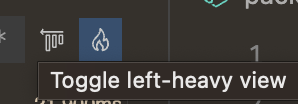
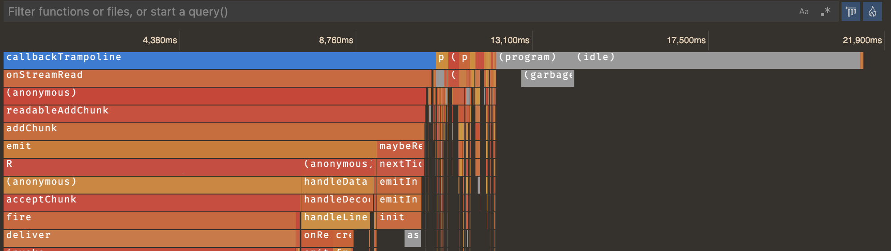

# JavaScript 성능 프로파일링 {#performance-profiling-javascript}

Visual Studio Code는 JavaScript 프로그램의 성능 프로파일을 수집하고 보는 것을 지원합니다. 시작하려면 [Node.js 프로그램](/docs/nodejs/nodejs-debugging.md) 또는 [브라우저 앱](/docs/nodejs/browser-debugging.md)에 대한 디버거를 먼저 구성해야 합니다.

## 프로파일 유형 {#types-of-profiles}

최적화하려는 항목에 따라 다양한 종류의 프로파일을 사용할 수 있습니다.

- **CPU 프로파일** - CPU 프로파일은 JavaScript에서 프로그램이 시간을 소비하는 위치를 알려줍니다. 비동기 프로미스나 콜백을 기다릴 수 있지만, 한 번에 하나의 JavaScript 표현식만 실행된다는 점을 기억하세요. CPU 프로파일은 초당 약 10,000개의 샘플을 수집하여 그 순간 실행 중인 표현식을 알려줍니다.
- **힙 프로파일** - 힙 프로파일은 프로그램에서 메모리가 시간에 따라 어떻게 할당되는지 알려줍니다. 메모리 할당은 비용이 많이 들 수 있으며, 코드가 할당하는 메모리 양을 줄이면 성능 향상을 가져올 수 있습니다.
- **힙 스냅샷** - 힙 스냅샷은 프로그램이 메모리를 할당한 위치를 즉시 보여줍니다. 프로그램이 많은 RAM을 사용하고 있는 것을 발견하고 그 원인을 찾고 싶다면 힙 스냅샷이 유용할 수 있습니다. 복잡한 프로그램의 경우 힙 스냅샷을 수집하는 데 몇 분이 걸릴 수 있으며, 힙 스냅샷을 보는 것은 현재 내장 편집기에서 지원되지 않습니다.

## 프로파일 수집 {#collecting-a-profile}

프로파일을 수집하려면 프로그램을 디버깅해야 합니다. 디버깅 중인 경우 몇 가지 방법으로 프로파일을 수집할 수 있습니다:

- **Call Stack** 보기에서 '기록' 버튼을 사용합니다. 이를 통해 CPU 프로파일, 힙 프로파일 및 힙 스냅샷을 찍을 수 있습니다.
- 프로그램에서 `console.profile()`을 호출합니다. 이는 CPU 프로파일을 수집합니다.

### 기록 버튼 사용 {#using-the-record-button}

디버깅 중인 경우, 실행 및 디버그 보기(`Ctrl+Shift+D`)로 전환하고 **Call Stack** 보기를 찾습니다. 디버그하려는 세션 위로 마우스를 가져가고 **Take Performance Profile** 버튼을 선택합니다. 이 명령은 명령 팔레트(`Ctrl+Shift+P`)에서도 실행할 수 있습니다.


VS Code는 어떤 [성능 유형](#types-of-profiles)의 프로파일을 찍을지 묻습니다. 관련 있는 것을 선택하세요.

마지막으로, VS Code는 언제 프로파일 찍기를 중지할지 묻습니다. 다음 중 하나를 선택할 수 있습니다:

- 수동으로 중지할 때까지 프로파일 찍기.
- 설정된 기간 동안 프로파일 찍기.
- 특정 중단점에 도달할 때까지 프로파일 찍기.

첫 번째 옵션을 선택한 경우, 디버그 도구 모음에 표시된 큰 빨간색 "기록" 아이콘을 클릭하여 프로파일을 중지할 수 있습니다. 프로파일이 수집된 후, [프로파일 뷰어](#analyzing-a-profile)가 자동으로 열립니다.

### console.profile 사용 {#using-console-profile}

`console.profile` 호출을 사용하여 코드를 수동으로 계측하고, `console.profileEnd`를 호출하여 프로파일을 중지할 수 있습니다. 이 두 호출 사이트 사이에서 CPU 프로파일이 수집됩니다.

```js
console.profile();
doSomeVeryExpensiveWork(); // 매우 비용이 많이 드는 작업 수행
console.profileEnd();
```

결과 `.cpuprofile`은 작업 공간 폴더에 자동으로 저장됩니다. 해당 파일을 선택하여 내장된 [프로파일 뷰어](#analyzing-a-profile)에서 열 수 있습니다.

## 프로파일 분석 {#analyzing-a-profile}

### 테이블 보기 {#table-view}

VS Code에는 JavaScript `.cpuprofile` 및 `.heapprofile` 파일을 보는 통합 시각화 도구가 있습니다. 이러한 파일 중 하나를 열면 다음과 같은 테이블 보기가 먼저 표시됩니다:


이는 프로그램의 **하향식** 보기입니다. 각 행은 프로그램의 함수를 나타내며, 기본적으로 특정 함수에서 소비된 시간 순으로 정렬됩니다. 이는 "자체 시간"으로도 알려져 있습니다. 함수의 "총 시간"은 해당 함수와 호출하는 모든 함수에서 소비된 시간의 합입니다. 각 테이블 행을 확장하여 해당 함수가 호출된 위치를 볼 수 있습니다.

예를 들어, 다음 코드를 보세요:

```js
function a() {
  doSomethingFor5Seconds(); // 5초 동안 작업 수행
  b();
}

function b() {
  doSomethingFor3Seconds(); // 3초 동안 작업 수행
}

a();
```

이 경우, `a`의 자체 시간은 5초이고 총 시간은 8초입니다. `b`의 자체 시간과 총 시간은 모두 3초입니다. 힙 프로파일은 동일한 방식으로 작동하지만, 각 함수 또는 그 호출자에서 할당된 메모리 양을 나타내기 위해 자체 크기와 총 크기를 사용합니다.

### 플레임 보기 {#flame-view}

테이블 보기는 특정 경우에 유용하지만, 종종 프로파일의 시각적 표현을 보고 싶을 수 있습니다. 테이블 보기의 오른쪽 상단에 있는 불꽃 🔥 아이콘을 클릭하여 이를 수행할 수 있습니다. 아직 설치하지 않았다면, 플레임 보기 편집기를 제공하는 추가 확장을 설치하라는 메시지가 표시됩니다.


처음에는 혼란스러울 수 있지만, 걱정하지 마세요. 이해할 수 있도록 도와드리겠습니다!

CPU 프로파일의 경우, 수평 축은 프로파일의 타임라인으로, 각 순간에 프로그램이 무엇을 하고 있었는지 볼 수 있습니다. 힙 프로파일의 경우, 수평 축은 프로그램이 할당한 총 메모리입니다.

그래프의 각 막대 또는 '불꽃'은 호출 스택입니다. 최상위 함수 호출(또는 호출 스택의 '하단')은 편집기 상단에 표시되며, 호출하는 함수는 아래에 표시됩니다. 막대의 너비는 총 시간 또는 총 메모리에 따라 결정됩니다.

플레임 그래프의 항목을 클릭하여 해당 항목에 대한 자세한 정보를 볼 수 있으며, 마우스 휠을 사용하여 확대 및 축소할 수 있습니다. 확대된 경우 차트 어디에서나 드래그하여 탐색할 수도 있습니다.

### 좌측 정렬 보기 {#left-heavy-view}

CPU 프로파일을 사용하는 경우, 보고 있는 플레임 그래프가 위의 것처럼 이해하기 쉬운 것이 아닐 가능성이 큽니다. 다음과 같은 개별 호출 스택이 많이 있을 수 있습니다:


더 쉽게 분석할 수 있도록, VS Code는 모든 유사한 호출 스택을 함께 그룹화하는 "좌측 정렬" 보기를 제공합니다.



이는 프로파일의 시간 순서 보기에서 힙 프로파일과 유사한 것으로 전환합니다. 수평 축은 여전히 총 프로파일 기간이지만, 각 막대는 해당 호출 스택에서 호출된 모든 시간 동안의 함수 호출 총 시간을 나타냅니다.



이 보기 방식은 개별 호출이 상대적으로 빠를 수 있지만, 여러 번의 호출에서 전체적으로 가장 비용이 많이 드는 함수를 찾고자 하는 서버와 같은 특정 응용 프로그램에 훨씬 더 유용합니다.
