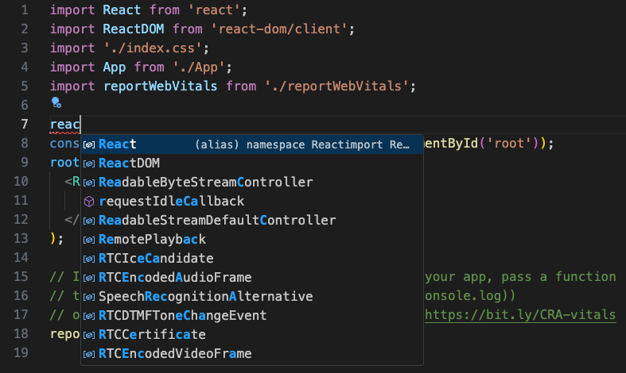
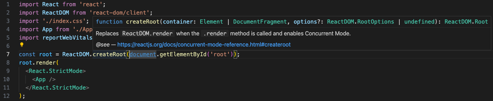
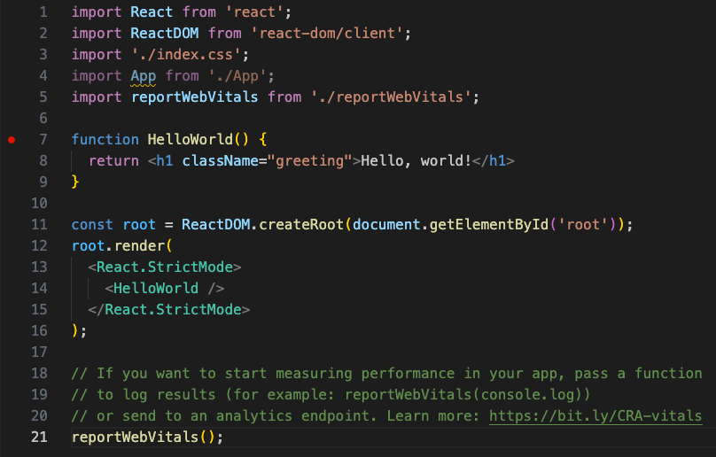
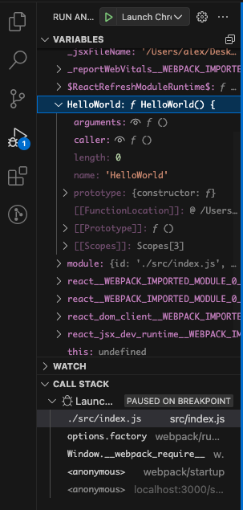
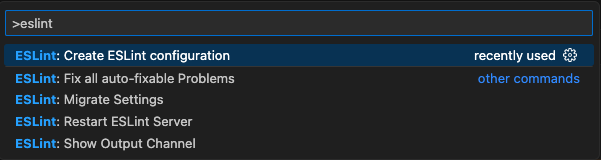

# Visual Studio Code에서 React 사용하기 {#using-react-in-visual-studio-code}

[React](https://reactjs.org)은 Facebook에서 개발한 인기 있는 JavaScript 라이브러리로 사용자 인터페이스를 구축하는 데 사용됩니다. Visual Studio Code 에디터는 React.js IntelliSense와 코드 탐색을 기본적으로 지원합니다.


## React에 오신 것을 환영합니다 {#welcome-to-react}

이 튜토리얼에서는 `create-react-app` [생성기](https://reactjs.org/docs/create-a-new-react-app.html#create-react-app)를 사용할 것입니다. 생성기를 사용하고 React 애플리케이션 서버를 실행하려면 [Node.js](https://nodejs.org/) JavaScript 런타임과 [npm](https://www.npmjs.com/) (Node.js 패키지 관리자)이 설치되어 있어야 합니다. npm은 Node.js에 포함되어 있으며 [Node.js 다운로드](https://nodejs.org/en/download/)에서 다운로드하여 설치할 수 있습니다.

:::tip
Node.js와 npm이 올바르게 설치되었는지 테스트하려면 터미널이나 명령 프롬프트에 `node --version` 및 `npm --version`을 입력할 수 있습니다.
:::

이제 다음을 입력하여 새 React 애플리케이션을 만들 수 있습니다:

```bash
npx create-react-app my-app
```

여기서 `my-app`은 애플리케이션 폴더의 이름입니다. React 애플리케이션을 만들고 종속성을 설치하는 데 몇 분이 걸릴 수 있습니다.

:::note
이전에 `npm install -g create-react-app`을 통해 `create-react-app`을 전역으로 설치한 경우, `npm uninstall -g create-react-app`을 사용하여 패키지를 제거하여 npx가 항상 최신 버전을 사용하도록 하는 것이 좋습니다.
:::

새 폴더로 이동하여 `npm start`를 입력하여 웹 서버를 시작하고 애플리케이션을 브라우저에서 열어 React 애플리케이션을 빠르게 실행해 보겠습니다:

```bash
cd my-app
npm start
```

<!-- TBD mention yarn and link -->

브라우저에서 [http://localhost:3000](http://localhost:3000)에서 React 로고와 "Learn React" 링크를 볼 수 있어야 합니다. 웹 서버를 실행한 상태에서 VS Code로 애플리케이션을 살펴보겠습니다.

React 애플리케이션을 VS Code에서 열려면 다른 터미널이나 명령 프롬프트 창을 열고 `my-app` 폴더로 이동한 다음 `code .`을 입력하십시오:

```bash
cd my-app
code .
```

### Markdown 미리보기 {#markdown-preview}

파일 탐색기에서 애플리케이션 `README.md` Markdown 파일을 볼 수 있습니다. 이 파일에는 애플리케이션과 React에 대한 많은 유용한 정보가 포함되어 있습니다. README를 검토하는 좋은 방법은 VS Code [Markdown 미리보기](/docs/languages/markdown.md#markdown-preview)를 사용하는 것입니다. 현재 편집기 그룹에서 미리보기를 열거나 (**Markdown: Open Preview** `Ctrl+Shift+V`), 옆에 있는 새 편집기 그룹에서 미리보기를 열 수 있습니다 (**Markdown: Open Preview to the Side** `Ctrl+K V`). 멋진 서식, 헤더로의 하이퍼링크 탐색 및 코드 블록의 구문 강조 표시를 얻을 수 있습니다.


### 구문 강조 및 괄호 일치 {#syntax-highlighting-and-bracket-matching}

이제 `src` 폴더를 확장하고 `index.js` 파일을 선택하십시오. VS Code가 다양한 소스 코드 요소에 대한 구문 강조를 제공하고, 괄호에 커서를 놓으면 일치하는 괄호도 선택됩니다.


### IntelliSense {#intellisense}

`index.js`에서 타이핑을 시작하면 스마트 제안 또는 완성을 볼 수 있습니다.



제안을 선택하고 `.`을 입력하면 [IntelliSense](/docs/editor/intellisense.md)를 통해 객체의 유형과 메서드를 볼 수 있습니다.


VS Code는 JavaScript 코드 인텔리전스를 위해 TypeScript 언어 서비스를 사용하며, [자동 타입 획득](/docs/nodejs/working-with-javascript.md#typings-and-automatic-type-acquisition) (ATA)이라는 기능이 있습니다. ATA는 `package.json`에 참조된 npm 모듈에 대한 npm 타입 선언 파일(`*.d.ts`)을 다운로드합니다.

메서드를 선택하면 매개변수 도움말도 받을 수 있습니다:



### 정의로 이동, 정의 살펴보기 {#go-to-definition-peek-definition}

TypeScript 언어 서비스를 통해 VS Code는 **Go to Definition** (`F12`) 또는 **Peek Definition** (`Alt+F12`)를 통해 편집기에서 타입 정의 정보를 제공할 수 있습니다. `App` 위에 커서를 놓고 마우스 오른쪽 버튼을 클릭한 다음 **Peek Definition**를 선택하십시오. [살펴보기 창](/docs/editor/editingevolved.md#peek)이 열리며 `App.js`의 `App` 정의를 보여줍니다.


`Escape`를 눌러 살펴보기 창을 닫습니다.

## Hello World {#hello-world}

샘플 애플리케이션을 "Hello World!"로 업데이트해 보겠습니다. `index.js` 내부에 "Hello, world!"라는 H1 헤더를 포함하는 `HelloWorld`라는 컴포넌트를 만들고 `root.render`의 `<App />` 태그를 `<HelloWorld />`로 교체하십시오.

```js
import React from "react";
import ReactDOM from "react-dom/client";
import "./index.css";
import App from "./App";
import reportWebVitals from "./reportWebVitals";

// HelloWorld 컴포넌트를 생성합니다.
function HelloWorld() {
  return <h1 className="greeting">Hello, world!</h1>;
}

const root = ReactDOM.createRoot(document.getElementById("root"));
root.render(
  <React.StrictMode>
    <HelloWorld />
  </React.StrictMode>
);

// 애플리케이션의 성능을 측정하려면 결과를 기록하는 함수를 전달하거나
// 분석 엔드포인트로 보낼 수 있습니다. 자세한 내용은 https://bit.ly/CRA-vitals를 참조하십시오.
reportWebVitals();
```

`index.js` 파일을 저장하면 실행 중인 서버 인스턴스가 웹 페이지를 업데이트하고 브라우저를 새로 고침할 때 "Hello World!"를 볼 수 있습니다.

:::tip
VS Code는 기본적으로 파일을 지연 후 저장하는 자동 저장을 지원합니다. **File** 메뉴에서 **Auto Save** 옵션을 선택하여 자동 저장을 켜거나 `files.autoSave` 사용자 [설정](/docs/getstarted/settings.md)을 직접 구성하십시오.
:::


## React 디버깅 {#debugging-react}

클라이언트 측 React 코드를 디버그하려면 내장된 JavaScript 디버거를 사용하겠습니다.

:::note
이 튜토리얼은 Edge 브라우저가 설치되어 있다고 가정합니다. Chrome을 사용하여 디버그하려면 launch `type`을 `chrome`으로 교체하십시오. [Firefox](https://marketplace.visualstudio.com/items?itemName=hbenl.vscode-firefox-debug) 브라우저용 디버거도 있습니다.
:::

### 중단점 설정 {#set-a-breakpoint}

`index.js`에서 중단점을 설정하려면 줄 번호 왼쪽의 여백을 클릭하십시오. 빨간색 원으로 표시되는 중단점이 설정됩니다.



### 디버거 구성 {#configure-the-debugger}

먼저 [디버거](/docs/editor/debugging.md)를 구성해야 합니다. **Run and Debug** 화면 (`Ctrl+Shift+D`)으으로 이동하여 **create a launch.json file** 링크를 선택하여 `launch.json` 디버거 구성 파일을 만듭니다. **Select debugger** 드롭다운 목록에서 **Web App (Edge)** 를 선택하십시오. 그러면 프로젝트의 새 `.vscode` 폴더에 `launch.json` 파일이 생성되며, 웹사이트를 시작하는 구성이 포함됩니다.

예제에 맞게 한 가지 변경이 필요합니다: `url`의 포트를 `8080`에서 `3000`으로 변경하십시오. `launch.json`은 다음과 같아야 합니다:

```json
{
  "version": "0.2.0",
  "configurations": [
    {
      "type": "msedge",
      "request": "launch",
      "name": "Launch Edge against localhost",
      "url": "http://localhost:3000",
      "webRoot": "${workspaceFolder}"
    }
  ]
}
```

개발 서버가 실행 중인지 확인하십시오 (`npm start`). 그런 다음 `F5` 또는 녹색 화살표를 눌러 디버거를 시작하고 새 브라우저 인스턴스를 엽니다. 디버거가 연결되기 전에 시작 시 중단점이 설정된 소스 코드가 실행되므로 웹 페이지를 새로 고칠 때까지 중단점에 도달하지 않습니다. 페이지를 새로 고치면 중단점에 도달해야 합니다.


소스 코드를 단계별로 실행하고 (`F10`), `HelloWorld`와 같은 변수를 검사하고 클라이언트 측 React 애플리케이션의 호출 스택을 볼 수 있습니다.



디버거와 사용 가능한 옵션에 대한 자세한 내용은 [브라우저 디버깅](/docs/nodejs/browser-debugging.md) 문서를 참조하십시오.

### 라이브 편집 및 디버깅 {#live-editing-and-debugging}

React 앱과 함께 [webpack](https://webpack.js.org/)을 사용하는 경우, webpack의 HMR 메커니즘을 활용하여 VS Code에서 직접 라이브 편집 및 디버깅을 통해 더 효율적인 워크플로를 가질 수 있습니다. 이 [VS Code에서 React 앱을 직접 라이브 편집 및 디버깅](https://medium.com/@auchenberg/live-edit-and-debug-your-react-apps-directly-from-vs-code-without-leaving-the-editor-3da489ed905f) 블로그 게시물과 [webpack Hot Module Replacement 문서](https://webpack.js.org/concepts/hot-module-replacement/)에서 자세히 알아볼 수 있습니다.

## 린팅 {#linting}

린터는 소스 코드를 분석하여 애플리케이션을 실행하기 전에 잠재적인 문제를 경고할 수 있습니다. VS Code에 포함된 JavaScript 언어 서비스는 기본적으로 구문 오류 검사 지원을 제공하며, **Problems** 패널 (**View** > **Problems** `Ctrl+Shift+M`)에서 이를 확인할 수 있습니다.

React 소스 코드에 작은 오류를 만들어 보면 빨간색 물결선과 **Problems** 패널에 오류가 표시됩니다.


린터는 더 정교한 분석을 제공하여 코딩 규칙을 강제하고 안티 패턴을 감지할 수 있습니다. 인기 있는 JavaScript 린터는 [ESLint](https://eslint.org/)입니다. ESLint는 ESLint VS Code [확장](https://marketplace.visualstudio.com/items/dbaeumer.vscode-eslint)과 결합하여 훌륭한 제품 내 린팅 경험을 제공합니다.

먼저 ESLint 명령줄 도구를 설치하십시오:

```bash
npm install -g eslint
```

그런 다음 **Extensions** 보기로 이동하여 'eslint'를 입력하여 ESLint 확장을 설치하십시오.


ESLint 확장이 설치되고 VS Code가 다시 로드되면 **Command Palette** (`Ctrl+Shift+P`)에서 **ESLint: Create ESLint configuration** 명령을 사용하여 ESLint 구성 파일 `.eslintrc.js`를 생성하십시오.



명령은 **Terminal** 패널에서 일련의 질문에 답하도록 요청합니다. 기본값을 선택하면 프로젝트 루트에 다음과 같은 `.eslintrc.js` 파일이 생성됩니다:

```js
module.exports = {
  env: {
    browser: true,
    es2020: true,
  },
  extends: ["eslint:recommended", "plugin:react/recommended"],
  parserOptions: {
    ecmaFeatures: {
      jsx: true,
    },
    ecmaVersion: 11,
    sourceType: "module",
  },
  plugins: ["react"],
  rules: {},
};
```

ESLint는 이제 열린 파일을 분석하고 `index.js`에서 'App'이 정의되었지만 사용되지 않았다는 경고를 표시합니다.


`.eslintrc.js` 파일에서 ESLint [규칙](https://eslint.org/docs/rules/)을 수정할 수 있습니다.

추가 세미콜론에 대한 오류 규칙을 추가해 보겠습니다:

```js
 "rules": {
        "no-extra-semi":"error"
    }
```

이제 한 줄에 여러 개의 세미콜론이 잘못 있으면 편집기에서 오류(빨간색 물결선)와 **Problems** 패널에 오류 항목이 표시됩니다.


## 인기 있는 스타터 키트 {#popular-starter-kits}

이 튜토리얼에서는 `create-react-app` 생성기를 사용하여 간단한 React 애플리케이션을 만들었습니다. 첫 번째 React 애플리케이션을 빌드하는 데 도움이 되는 훌륭한 샘플과 스타터 키트가 많이 있습니다.

### VS Code React 샘플 {#vs-code-react-sample}

이것은 간단한 TODO 애플리케이션을 만들고 Node.js [Express](https://expressjs.com/) 서버의 소스 코드를 포함하는 [샘플](https://github.com/microsoft/vscode-react-sample) React 애플리케이션입니다. 또한 [Babel](https://babeljs.io) ES6 트랜스파일러를 사용한 다음 [webpack](https://webpack.js.org/)을 사용하여 사이트 자산을 번들링하는 방법을 보여줍니다.

### TypeScript React {#typescript-react}

TypeScript와 React에 대해 궁금하다면 `create-react-app` 애플리케이션의 TypeScript 버전을 만들 때 TypeScript 템플릿을 사용하도록 지정할 수도 있습니다:

```bash
npx create-react-app my-app --template typescript
```

[Create React App 사이트](https://create-react-app.dev)의 [TypeScript 추가](https://create-react-app.dev/docs/adding-typescript)에서 자세한 내용을 확인하십시오.

### Angular {#angular}

[Angular](https://angular.io/)는 또 다른 인기 있는 웹 프레임워크입니다. VS Code와 함께 작동하는 Angular 예제를 보려면 [Angular CLI로 디버깅](https://github.com/microsoft/vscode-recipes/tree/main/Angular-CLI) 레시피를 확인하십시오. Angular 애플리케이션을 만들고 JavaScript 디버거용 `launch.json` 파일을 구성하는 방법을 안내합니다.

## 자주 묻는 질문 {#common-questions}

### 선언적 JSX 내에서 IntelliSense를 사용할 수 있습니까? {#can-i-get-intellisense-within-declarative-jsx}

예. 예를 들어, `create-react-app` 프로젝트의 `App.js` 파일을 열면 `render()` 메서드 내의 React JSX에서 IntelliSense를 볼 수 있습니다.


