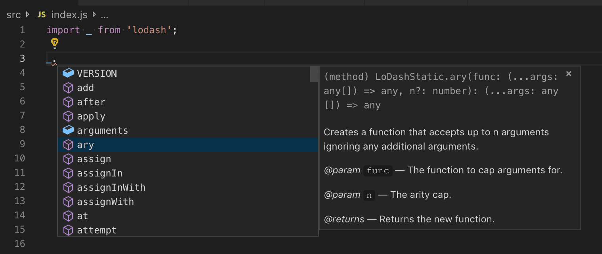
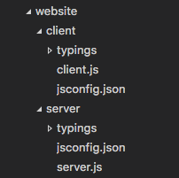
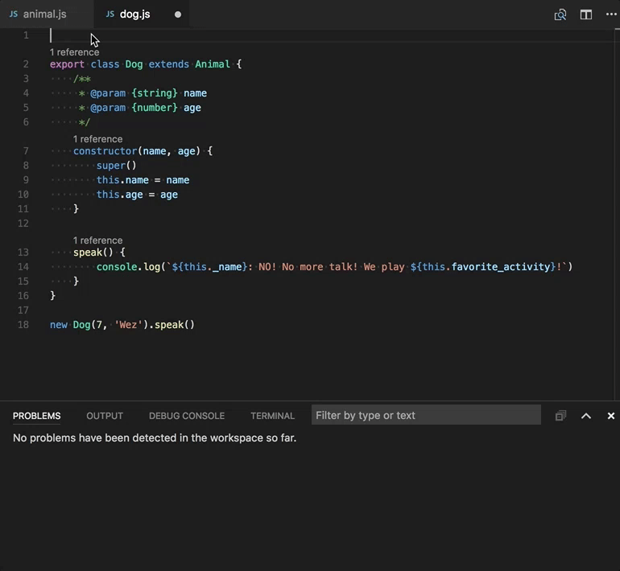

# 자바스크립트 작업하기 {#working-with-javascript}

이 주제는 Visual Studio Code에서 지원하는 고급 자바스크립트 기능에 대해 설명합니다. TypeScript 언어 서비스를 사용하여 VS Code는 스마트 완성(IntelliSense) 및 자바스크립트에 대한 타입 검사를 제공합니다.

## IntelliSense {#intellisense}

Visual Studio Code의 자바스크립트 [IntelliSense](/docs/editor/intellisense.md)는 지능형 코드 완성, 매개변수 정보, 참조 검색 및 기타 많은 고급 언어 기능을 제공합니다. 우리의 자바스크립트 IntelliSense는 TypeScript 팀이 개발한 [자바스크립트 언어 서비스](https://github.com/microsoft/TypeScript/wiki/JavaScript-Language-Service-in-Visual-Studio)에 의해 구동됩니다. 대부분의 자바스크립트 프로젝트에서 별도의 구성 없이 IntelliSense가 작동해야 하지만, [JSDoc](/docs/languages/javascript.md#jsdoc-support)을 사용하거나 `jsconfig.json` 프로젝트를 구성하여 IntelliSense를 더욱 유용하게 만들 수 있습니다.

자바스크립트 IntelliSense가 작동하는 방식에 대한 자세한 내용은 타입 추론, JSDoc 주석, TypeScript 선언 및 자바스크립트와 TypeScript 프로젝트 혼합을 포함하여 [자바스크립트 언어 서비스 문서](https://github.com/microsoft/TypeScript/wiki/JavaScript-Language-Service-in-Visual-Studio)를 참조하십시오.

타입 추론이 원하는 정보를 제공하지 않는 경우, JSDoc 주석을 사용하여 타입 정보를 명시적으로 제공할 수 있습니다. 이 문서는 현재 지원되는 [JSDoc 주석](https://www.typescriptlang.org/docs/handbook/type-checking-javascript-files.html#supported-jsdoc)에 대해 설명합니다.

객체, 메서드 및 속성 외에도 자바스크립트 IntelliSense 창은 파일의 기호에 대한 기본 단어 완성도 제공합니다.

### Typings 및 자동 타입 획득 {#typings-and-automatic-type-acquisition}

자바스크립트 라이브러리 및 프레임워크에 대한 IntelliSense는 TypeScript 타입 선언(typings) 파일에 의해 구동됩니다. 타입 선언 파일은 TypeScript로 작성되어 매개변수 및 함수의 데이터 타입을 표현할 수 있으므로 VS Code가 성능 좋은 방식으로 풍부한 IntelliSense 경험을 제공할 수 있습니다.

많은 인기 있는 라이브러리는 typings 파일을 함께 제공하므로 자동으로 IntelliSense를 사용할 수 있습니다. typings을 포함하지 않는 라이브러리의 경우, VS Code의 `자동 타입 획득`이 커뮤니티에서 유지 관리하는 typings 파일을 자동으로 설치합니다.

자동 타입 획득은 [npmjs](https://www.npmjs.com), Node.js 패키지 관리자가 필요하며, 이는 [Node.js](https://nodejs.org) 런타임에 포함되어 있습니다. 이 이미지에서 인기 있는 [lodash](https://lodash.com/) 라이브러리에 대한 메서드 시그니처, 매개변수 정보 및 메서드 설명서를 포함한 IntelliSense를 볼 수 있습니다.



타입 선언 파일은 프로젝트의 `package.json`에 나열된 패키지 또는 자바스크립트 파일에 가져온 패키지에 대해 Visual Studio Code에 의해 자동으로 다운로드되고 관리됩니다.

```json
{
  "dependencies": {
    "lodash": "^4.17.0"
  }
}
```

대신 [jsconfig.json](#javascript-projects-jsconfigjson)에 타입 선언 파일을 획득할 패키지를 명시적으로 나열할 수 있습니다.

```json
{
  "typeAcquisition": {
    "include": ["jquery"]
  }
}
```

대부분의 일반적인 자바스크립트 라이브러리는 선언 파일을 함께 제공하거나 타입 선언 파일을 사용할 수 있습니다.

### 자동 타입 획득을 위한 npm 설치 경고 수정 {#fixing-npm-not-installed-warning-for-automatic-type-acquisition}

[자동 타입 획득](#typings-and-automatic-type-acquisition)은 [npm](https://www.npmjs.com), Node.js 패키지 관리자를 사용하여 타입 선언(typings) 파일을 설치하고 관리합니다. 자동 타입 획득이 제대로 작동하려면 먼저 npm이 컴퓨터에 설치되어 있는지 확인하십시오.

터미널 또는 명령 프롬프트에서 `npm --version`을 실행하여 npm이 설치되어 사용 가능한지 빠르게 확인할 수 있습니다.

npm은 Node.js 런타임과 함께 설치되며, 이는 [Nodejs.org](https://nodejs.org)에서 다운로드할 수 있습니다. 현재 LTS(장기 지원) 버전을 설치하면 npm 실행 파일이 기본적으로 시스템 경로에 추가됩니다.

npm이 설치되어 있지만 여전히 경고 메시지가 표시되는 경우, `typescript.npm` [설정](/docs/getstarted/settings.md)을 사용하여 npm이 설치된 위치를 VS Code에 명시적으로 지정할 수 있습니다. 이는 컴퓨터의 npm 실행 파일의 전체 경로로 설정해야 하며, 이는 작업 공간에서 패키지를 관리하는 데 사용하는 npm 버전과 일치할 필요는 없습니다. `typescript.npm`은 TypeScript 2.3.4+가 필요합니다.

예를 들어, Windows에서 `settings.json` 파일에 다음과 같은 경로를 추가합니다:

```json
{
  "typescript.npm": "C:\\Program Files\\nodejs\\npm.cmd"
}
```

## 자바스크립트 프로젝트 (jsconfig.json) {#javascript-projects-jsconfigjson}

디렉터리에 [jsconfig.json](/docs/languages/jsconfig.md) 파일이 있으면 해당 디렉터리가 자바스크립트 프로젝트의 루트임을 나타냅니다. `jsconfig.json`은 [자바스크립트 언어 서비스](https://github.com/microsoft/TypeScript/wiki/JavaScript-Language-Service-in-Visual-Studio)에서 제공하는 언어 기능에 대한 루트 파일 및 옵션을 지정합니다. 일반적인 설정의 경우 `jsconfig.json` 파일이 필요하지 않지만, `jsconfig.json`을 추가해야 하는 상황이 있습니다.

- 모든 파일이 자바스크립트 프로젝트에 포함되지 않아야 하는 경우(예: 일부 파일을 IntelliSense에 표시하지 않으려는 경우). 이 상황은 프론트엔드 및 백엔드 코드에서 일반적입니다.
- 작업 공간에 둘 이상의 프로젝트 컨텍스트가 포함된 경우. 이 경우 각 프로젝트의 루트 폴더에 `jsconfig.json` 파일을 추가해야 합니다.
- TypeScript 컴파일러를 사용하여 자바스크립트 소스 코드를 다운 레벨 컴파일하는 경우.

### jsconfig.json의 위치 {#location-of-jsconfigjson}

자바스크립트 프로젝트로 코드를 정의하려면 아래와 같이 자바스크립트 코드의 루트에 `jsconfig.json`을 생성하십시오. 자바스크립트 프로젝트는 프로젝트의 소스 파일이며 파생되거나 패키징된 파일(예: `dist` 디렉터리)을 포함하지 않아야 합니다.


더 복잡한 프로젝트에서는 작업 공간 내에 둘 이상의 `jsconfig.json` 파일이 정의될 수 있습니다. 이렇게 하면 한 프로젝트의 소스 코드가 다른 프로젝트의 IntelliSense에 나타나지 않도록 할 수 있습니다.

아래는 `client` 및 `server` 폴더가 있는 프로젝트로, 두 개의 별도 자바스크립트 프로젝트를 보여줍니다:



### jsconfig.json 작성 {#writing-jsconfigjson}

아래는 `jsconfig.json` 파일의 간단한 템플릿으로, 자바스크립트 `target`을 `ES6`로 정의하고 `exclude` 속성은 `node_modules` 폴더를 제외합니다. 이 코드를 `jsconfig.json` 파일에 복사하여 붙여넣을 수 있습니다.

```json
{
  "compilerOptions": {
    "module": "CommonJS",
    "target": "ES6"
  },
  "exclude": ["node_modules", "**/node_modules/*"]
}
```

`exclude` 속성은 언어 서비스에 소스 코드의 일부가 아닌 파일을 알려줍니다. IntelliSense가 느린 경우, `exclude` 목록에 폴더를 추가하십시오(VS Code는 느린 완성을 감지하면 이를 수행하도록 프롬프트합니다). 빌드 프로세스에서 생성된 파일(예: `dist` 디렉터리)을 `exclude`해야 합니다. 이러한 파일은 제안이 두 번 나타나게 하고 IntelliSense를 느리게 만듭니다.

`include` 속성을 사용하여 프로젝트의 파일을 명시적으로 설정할 수 있습니다. `include` 속성이 없으면 기본적으로 포함된 디렉터리 및 하위 디렉터리의 모든 파일을 포함합니다. `include` 속성이 지정된 경우, 해당 파일만 포함됩니다.

다음은 명시적 `include` 속성이 있는 예입니다:

```json
{
  "compilerOptions": {
    "module": "CommonJS",
    "target": "ES6"
  },
  "include": ["src/**/*"]
}
```

최선의 방법은 단일 `src` 폴더와 함께 `include` 속성을 사용하는 것입니다. `exclude` 및 `include`의 파일 경로는 `jsconfig.json`의 위치를 기준으로 상대적입니다.

자세한 내용은 전체 [jsconfig.json 문서](/docs/languages/jsconfig.md)를 참조하십시오.

### TypeScript로 마이그레이션 {#migrating-to-typescript}

혼합된 TypeScript 및 자바스크립트 프로젝트를 가질 수 있습니다. TypeScript로 마이그레이션을 시작하려면 `jsconfig.json` 파일 이름을 `tsconfig.json`으로 변경하고 `allowJs` 속성을 `true`로 설정하십시오. 자세한 내용은 [자바스크립트에서 마이그레이션](https://www.typescriptlang.org/docs/handbook/migrating-from-javascript.html)을 참조하십시오.

> **참고:** `jsconfig.json`은 `allowJs`가 true로 설정된 `tsconfig.json` 파일과 동일합니다. 다른 사용 가능한 옵션을 보려면 [tsconfig.json 문서](https://www.typescriptlang.org/docs/handbook/tsconfig-json.html)를 참조하십시오.

## 자바스크립트 타입 검사 {#type-checking-javascript}

VS Code는 일반 자바스크립트 파일에서 TypeScript의 고급 타입 검사 및 오류 보고 기능을 활용할 수 있습니다. 이는 일반적인 프로그래밍 실수를 잡는 훌륭한 방법입니다. 이러한 타입 검사는 **누락된 가져오기 추가** 및 **누락된 속성 추가**와 같은 흥미로운 자바스크립트 빠른 수정을 가능하게 합니다.



TypeScript는 `.js` 파일에서 `.ts` 파일과 동일하게 타입을 추론할 수 있습니다. 타입을 추론할 수 없는 경우, JSDoc 주석을 사용하여 지정할 수 있습니다. TypeScript가 자바스크립트 타입 검사를 위해 JSDoc을 사용하는 방법에 대한 자세한 내용은 [자바스크립트 파일 타입 검사](https://www.typescriptlang.org/docs/handbook/type-checking-javascript-files.html)를 참조하십시오.

자바스크립트의 타입 검사는 선택 사항이며 옵트인 방식입니다. ESLint와 같은 기존 자바스크립트 유효성 검사 도구는 새로운 내장 타입 검사 기능과 함께 사용할 수 있습니다.

필요에 따라 몇 가지 다른 방법으로 타입 검사를 시작할 수 있습니다.

**파일별**

자바스크립트 파일에서 타입 검사를 활성화하는 가장 쉬운 방법은 파일 상단에 `// @ts-check`를 추가하는 것입니다.

```js
// @ts-check
let itsAsEasyAs = "abc";
itsAsEasyAs = 123; // 오류: 타입 '123'은(는) 타입 'string'에 할당할 수 없습니다.
```

`// @ts-check`를 사용하는 것은 몇 개의 파일에서 타입 검사를 시도하고 싶지만 아직 전체 코드베이스에 대해 활성화하지 않으려는 경우 좋은 접근 방식입니다.

**설정을 사용하여**

코드를 변경하지 않고 모든 자바스크립트 파일에 대해 타입 검사를 활성화하려면 작업 공간 또는 사용자 설정에 `"js/ts.implicitProjectConfig.checkJs": true`를 추가하십시오. 이는 `jsconfig.json` 또는 `tsconfig.json` 프로젝트의 일부가 아닌 모든 자바스크립트 파일에 대해 타입 검사를 활성화합니다.

개별 파일을 타입 검사에서 제외하려면 파일 상단에 `// @ts-nocheck` 주석을 추가하십시오:

```js
// @ts-nocheck
let easy = "abc";
easy = 123; // 오류 없음
```

자바스크립트 파일에서 개별 오류를 비활성화하려면 오류 전 줄에 `// @ts-ignore` 주석을 추가하십시오:

```js
let easy = "abc";
// @ts-ignore
easy = 123; // 오류 없음
```

**jsconfig 또는 tsconfig 사용**

`jsconfig.json` 또는 `tsconfig.json`의 일부인 자바스크립트 파일에 대해 타입 검사를 활성화하려면 프로젝트의 컴파일러 옵션에 `"checkJs": true`를 추가하십시오:

`jsconfig.json`:

```json
{
  "compilerOptions": {
    "checkJs": true
  },
  "exclude": ["node_modules", "**/node_modules/*"]
}
```

`tsconfig.json`:

```json
{
  "compilerOptions": {
    "allowJs": true,
    "checkJs": true
  },
  "exclude": ["node_modules", "**/node_modules/*"]
}
```

이렇게 하면 프로젝트의 모든 자바스크립트 파일에 대해 타입 검사가 활성화됩니다. 파일별로 타입 검사를 비활성화하려면 `// @ts-nocheck`를 사용할 수 있습니다.

자바스크립트 타입 검사는 TypeScript 2.3이 필요합니다. 작업 공간에서 현재 활성화된 TypeScript 버전을 확인하려면 **TypeScript: Select TypeScript Version** 명령을 실행하십시오. 이 명령을 실행하려면 편집기에서 `.js/.ts` 파일을 열어야 합니다. TypeScript 파일을 열면 버전이 오른쪽 하단에 표시됩니다.

### 전역 변수 및 타입 검사 {#global-variables-and-type-checking}

레거시 자바스크립트 코드에서 전역 변수 또는 비표준 DOM API를 사용하는 경우:

```ts
window.onload = function () {
  if (window.webkitNotifications.requestPermission() === CAN_NOTIFY) {
    window.webkitNotifications.createNotification(null, "Woof!", "🐶").show();
  } else {
    alert("Could not notify");
  }
};
```

위의 코드에서 `// @ts-check`를 사용하려고 하면 전역 변수 사용에 대한 여러 오류가 표시됩니다:

1. `Line 2` - `Property 'webkitNotifications' does not exist on type 'Window'.`
2. `Line 2` - `Cannot find name 'CAN_NOTIFY'.`
3. `Line 3` - `Property 'webkitNotifications' does not exist on type 'Window'.`

`// @ts-check`를 계속 사용하고 싶지만 이러한 문제가 실제로 애플리케이션의 문제가 아니라고 확신하는 경우, 이러한 전역 변수에 대해 TypeScript에 알려야 합니다.

시작하려면 프로젝트의 루트에 [jsconfig.json 생성](#javascript-projects-jsconfigjson)을 생성하십시오:

```json
{
  "compilerOptions": {},
  "exclude": ["node_modules", "**/node_modules/*"]
}
```

변경 사항이 적용되었는지 확인하려면 VS Code를 다시 로드하십시오. `jsconfig.json`의 존재는 TypeScript에 자바스크립트 파일이 더 큰 프로젝트의 일부임을 알려줍니다.

이제 작업 공간의 어느 곳에든 `globals.d.ts` 파일을 생성하십시오:

```ts
interface Window {
  webkitNotifications: any;
}

declare var CAN_NOTIFY: number;
```

`d.ts` 파일은 타입 선언입니다. 이 경우, `globals.d.ts`는 TypeScript에 전역 `CAN_NOTIFY`가 존재하고 `window`에 `webkitNotifications` 속성이 존재함을 알려줍니다. `d.ts` 파일 작성에 대한 자세한 내용은 [TypeScript 문서](https://www.typescriptlang.org/docs/handbook/declaration-files/introduction.html)를 참조하십시오. `d.ts` 파일은 자바스크립트가 평가되는 방식을 변경하지 않으며, 더 나은 자바스크립트 언어 지원을 제공하는 데만 사용됩니다.

## 작업 사용 {#using-tasks}

### TypeScript 컴파일러 사용 {#using-the-typescript-compiler}

TypeScript의 주요 기능 중 하나는 최신 자바스크립트 언어 기능을 사용하고, 이러한 최신 기능을 아직 이해하지 못하는 자바스크립트 런타임에서 실행할 수 있는 코드를 내보내는 기능입니다. 자바스크립트도 동일한 언어 서비스를 사용하므로 이제 이 기능을 활용할 수 있습니다.

TypeScript 컴파일러 `tsc`는 자바스크립트 파일을 ES6에서 다른 언어 수준으로 다운 레벨 컴파일할 수 있습니다. 원하는 옵션으로 `jsconfig.json`을 구성한 다음 `–p` 인수를 사용하여 `tsc`가 `jsconfig.json` 파일을 사용하도록 하십시오. 예를 들어 `tsc -p jsconfig.json`을 사용하여 다운 레벨 컴파일을 수행합니다.

다운 레벨 컴파일에 대한 컴파일러 옵션에 대한 자세한 내용은 [jsconfig 문서](/docs/languages/jsconfig.md#jsconfig-options)를 참조하십시오.

### Babel 실행 {#running-babel}

[Babel](https://babeljs.io) 트랜스파일러는 ES6 파일을 소스 맵이 포함된 읽기 가능한 ES5 자바스크립트로 변환합니다. 작업 흐름에 **Babel**을 쉽게 통합하려면 `tasks.json` 파일(작업 공간의 `.vscode` 폴더 아래에 위치)에 아래 구성을 추가하십시오. `group` 설정은 이 작업을 기본 **작업: 빌드 작업 실행** 제스처로 만듭니다. `isBackground`는 VS Code가 이 작업을 백그라운드에서 계속 실행하도록 합니다. 자세한 내용은 [작업](/docs/editor/tasks.md)을 참조하십시오.

```json
{
  "version": "2.0.0",
  "tasks": [
    {
      "label": "watch",
      "command": "${workspaceFolder}/node_modules/.bin/babel",
      "args": ["src", "--out-dir", "lib", "-w", "--source-maps"],
      "type": "shell",
      "group": { "kind": "build", "isDefault": true },
      "isBackground": true
    }
  ]
}
```

이 구성을 추가한 후, `kb(workbench.action.tasks.build)` (**빌드 작업 실행**) 명령을 사용하여 **Babel**을 시작하면 `src` 디렉터리의 모든 파일이 `lib` 디렉터리로 컴파일됩니다.

> **팁:** Babel CLI에 대한 도움말은 [Babel 사용](https://babeljs.io/docs/setup/#installation) 지침을 참조하십시오. 위의 예는 CLI 옵션을 사용합니다.

## 자바스크립트 지원 비활성화 {#disable-javascript-support}

[Flow](https://flow.org/)와 같은 다른 자바스크립트 언어 도구에서 지원하는 자바스크립트 언어 기능을 사용하는 것을 선호하는 경우, VS Code의 내장 자바스크립트 지원을 비활성화할 수 있습니다. 내장 TypeScript 언어 확장 **TypeScript and JavaScript Language Features**(vscode.typescript-language-features)를 비활성화하면 자바스크립트 언어 지원도 제공됩니다.

자바스크립트/TypeScript 지원을 비활성화하려면 확장 보기(`Ctrl+Shift+X`)로 이동하여 내장 확장(**...** **추가 작업** 드롭다운에서 **내장 확장 표시**)을 필터링한 다음 'typescript'를 입력하십시오. **TypeScript and JavaScript Language Features** 확장을 선택하고 **비활성화** 버튼을 누르십시오. VS Code 내장 확장은 제거할 수 없으며, 비활성화만 할 수 있으며 언제든지 다시 활성화할 수 있습니다.


## 부분 IntelliSense 모드 {#partial-intellisense-mode}

VS Code는 자바스크립트 및 TypeScript에 대해 프로젝트 전체 IntelliSense를 제공하려고 합니다. 이는 자동 가져오기 및 **정의로 이동**과 같은 기능을 가능하게 합니다. 그러나 VS Code가 자바스크립트 또는 TypeScript 프로젝트를 구성하는 다른 파일을 로드할 수 없는 경우, 현재 열려 있는 파일에서만 작업할 수 있는 경우가 있습니다.

이러한 경우는 다음과 같습니다:

- [vscode.dev](https://vscode.dev) 또는 [github.dev](https://docs.github.com/codespaces/developing-in-codespaces/web-based-editor)에서 자바스크립트 또는 TypeScript 코드를 작업하고 있으며 VS Code가 브라우저에서 실행 중인 경우.
- 가상 파일 시스템에서 파일을 여는 경우(예: [GitHub Repositories](https://marketplace.visualstudio.com/items?itemName=GitHub.remotehub) 확장을 사용하는 경우).
- 프로젝트가 현재 로드 중인 경우. 로드가 완료되면 프로젝트 전체 IntelliSense를 사용할 수 있습니다.

이러한 경우, VS Code의 IntelliSense는 **부분 모드**로 작동합니다. 부분 모드는 열려 있는 자바스크립트 또는 TypeScript 파일에 대해 가능한 최선을 다해 IntelliSense를 제공하려고 하지만 제한적이며 교차 파일 IntelliSense 기능을 제공할 수 없습니다.

### 영향을 받는 기능은 무엇인가요?

다음은 부분 모드에서 비활성화되거나 기능이 제한된 기능의 불완전한 목록입니다:

- 모든 열린 파일이 단일 프로젝트의 일부로 처리됩니다.
- `jsconfig` 또는 `tsconfig`의 구성 옵션(예: `target`)이 적용되지 않습니다.
- 구문 오류만 보고됩니다. 알 수 없는 속성에 접근하거나 함수에 잘못된 타입을 전달하는 것과 같은 의미 오류는 보고되지 않습니다.
- 의미 오류에 대한 빠른 수정이 비활성화됩니다.
- 기호는 현재 파일 내에서만 해결할 수 있습니다. 다른 파일에서 가져온 기호는 `any` 타입으로 처리됩니다.
- **정의로 이동** 및 **모든 참조 찾기**와 같은 명령은 전체 프로젝트 대신 열린 파일에 대해서만 작동합니다. 이는 `node_module` 아래에 설치한 패키지의 기호가 해결되지 않음을 의미합니다.
- 작업 공간 기호 검색은 현재 열린 파일의 기호만 포함합니다.
- 자동 가져오기가 비활성화됩니다.
- 이름 바꾸기가 비활성화됩니다.
- 많은 리팩토링이 비활성화됩니다.

`vscode.dev` 및 `github.dev`에서 추가 기능이 비활성화됩니다:

- [자동 타입 획득](/docs/nodejs/working-with-javascript.md#typings-and-automatic-type-acquisition)은 현재 지원되지 않습니다.

### 부분 모드인지 확인하기

현재 파일이 프로젝트 전체 IntelliSense 대신 부분 모드 IntelliSense를 사용하는지 확인하려면 상태 표시줄의 `JavaScript` 또는 `TypeScript` 언어 상태 항목 위로 마우스를 가져가십시오:


현재 파일이 부분 모드인 경우 상태 항목에 `Partial mode`가 표시됩니다.
