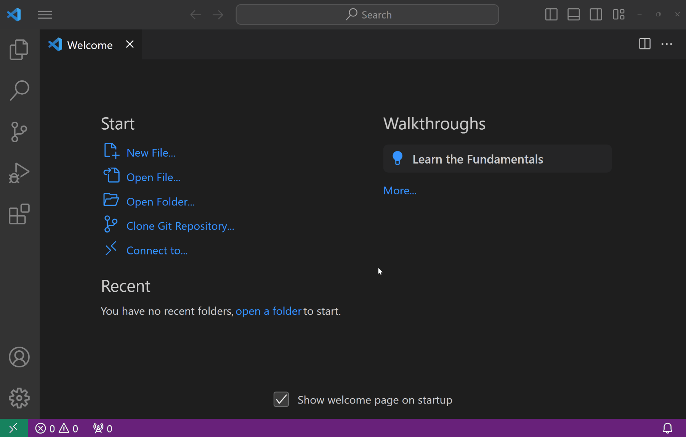
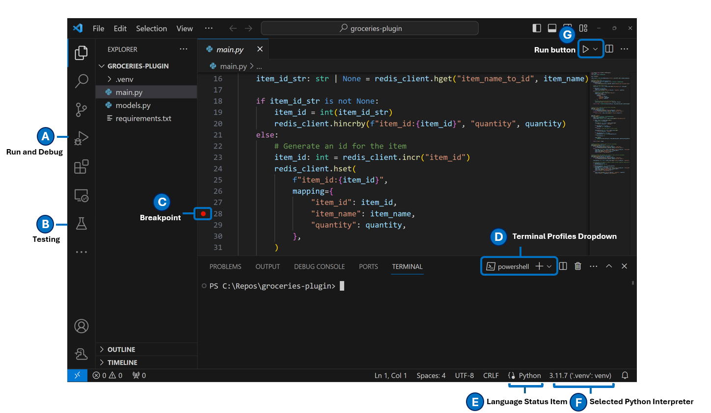
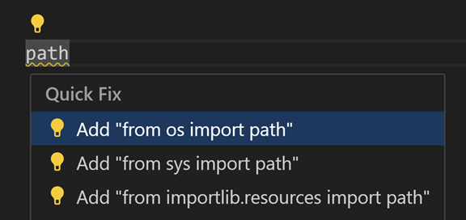
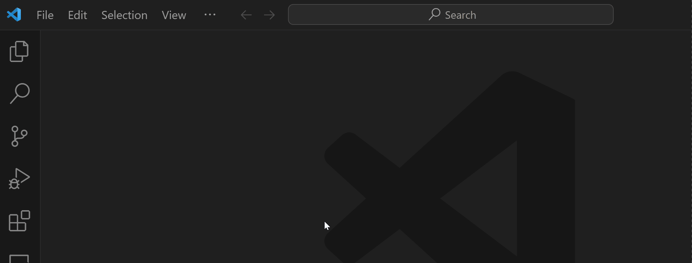
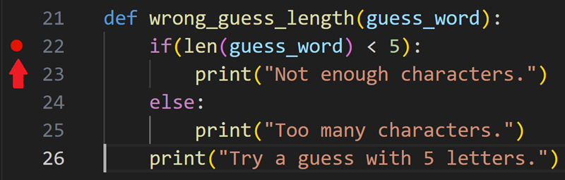
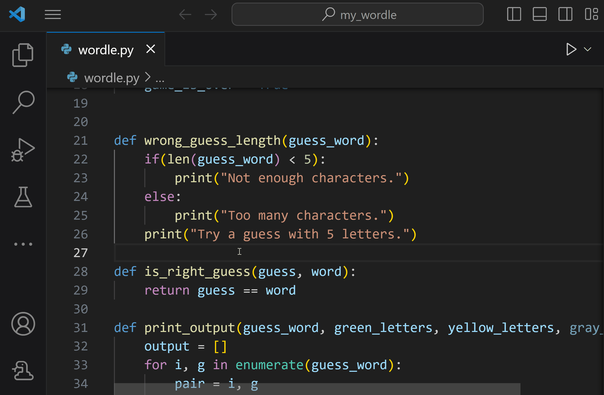
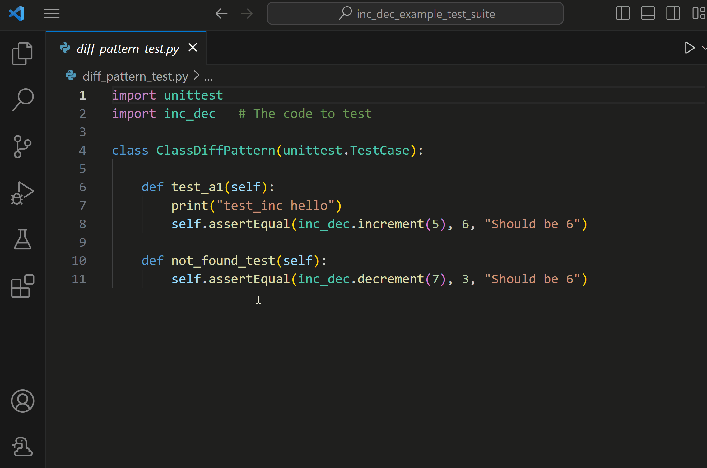

# VS Code에서 Python을 위한 빠른 시작 가이드 {#quick-start-guide-for-python-in-vs-code}

Python 확장은 Visual Studio Code를 뛰어난 Python 편집기로 만들어주며, 모든 운영 체제에서 작동하고 다양한 Python 인터프리터와 함께 사용할 수 있습니다.

시작하려면 다음을 설치하세요:

- [VS Code](https://code.visualstudio.com/)
- [Python 인터프리터](/docs/python/python-tutorial.md#_install-a-python-interpreter) (모든 [활성 지원 Python 버전](https://devguide.python.org/versions/))
- [VS Code 마켓플레이스](https://marketplace.visualstudio.com/items?itemName=ms-python.python)에서 Python 확장

VS Code를 Python에 맞게 더 커스터마이징하려면 [Python 프로필 템플릿](/docs/editor/profiles.md#python-profile-template)을 활용하여 권장 확장 및 설정을 자동으로 설치할 수 있습니다. 데이터 과학 프로젝트의 경우 [데이터 과학 프로필 템플릿](/docs/editor/profiles.md#data-science-profile-template)을 사용하는 것을 고려해보세요.

## Python 프로젝트 또는 파일 생성 및 열기 {#how-to-create-and-open-a-python-project-or-file}

VS Code에서 작업하려는 기존 Python 프로젝트가 있는 경우, VS Code 환영 페이지나 파일 탐색기 보기에서 폴더나 파일을 열거나 **File > Open Folder** (`Ctrl+K Ctrl+O`) 또는 **File > Open File** (`Ctrl+O`)를 선택하여 시작할 수 있습니다.

VS Code 환영 페이지에서 **New File**을 선택한 다음 **Python file**을 선택하거나 **File > New File** (`unassigned`)로 이동하여 새 Python 파일을 생성할 수 있습니다.

:::tip
VS Code에서 이미 작업 공간 폴더를 열어둔 경우, 기존 프로젝트에 새 파일이나 폴더를 직접 추가할 수 있습니다. 파일 탐색기 보기의 최상위 폴더에서 **New Folder** 또는 **New File** 아이콘을 사용하여 새 폴더와 파일을 생성할 수 있습니다.
:::

## UI 둘러보기 {#ui-tour}

VS Code를 처음 실행할 때, Python 전용 기능과 UI를 얻기 위해 Python 확장을 설치해야 합니다. Python 확장을 설치한 후의 UI를 살펴보겠습니다:

## 코드 작업 {#code-actions}

코드 작업(Quick Fixes라고도 함)은 코드에 경고가 있을 때 문제를 해결하는 데 도움이 됩니다. 이러한 유용한 힌트는 편집기 왼쪽 여백에 전구(💡)로 표시됩니다. 전구를 선택하여 코드 작업 옵션을 표시합니다. 이러한 코드 작업은 Python, Pylance 또는 VS Code 자체와 같은 확장에서 제공될 수 있습니다. 코드 작업에 대한 자세한 내용은 [Python Quick Fixes](/docs/python/editing.md#quick-fixes)를 참조하세요.

## Python 명령 {#python-commands}

Python 명령은 [명령 팔레트](/docs/getstarted/userinterface.md#command-palette) (`Ctrl+Shift+P`)를 통해 액세스할 수 있습니다. 명령 팔레트에서 VS Code 및 설치된 확장의 다양한 기능에 액세스할 수 있습니다. 명령 팔레트에 **“Python: “** 을 입력하여 Python 확장을 통해 사용할 수 있는 명령을 찾을 수 있습니다.

## 실행, 디버그 및 테스트 {#run-debug-and-test}

이제 VS Code에서 Python에 대해 더 잘 알게 되었으니, 코드 실행, 디버그 및 테스트 방법을 배워봅시다.

### 실행 {#run}

VS Code에서 Python 코드를 실행하는 몇 가지 방법이 있습니다.

편집기에서 열려 있는 Python 스크립트를 실행하려면, 편집기 오른쪽 상단의 **Run Python File in Terminal** 재생 버튼을 선택하세요.

VS Code 내에서 Python 코드의 일부를 반복적으로 실행할 수 있는 추가 방법도 있습니다:

- 한 줄 이상을 선택한 다음 `Shift+Enter`를 누르거나 마우스 오른쪽 버튼을 클릭하고 **Run Selection/Line in Python Terminal**을 선택합니다. 이 명령은 파일의 일부만 테스트하는 데 편리합니다.
- 명령 팔레트 (`Ctrl+Shift+P`)에서 **Python: Start REPL** 명령을 선택하여 현재 선택된 Python 인터프리터에 대한 REPL 터미널을 엽니다. REPL에서 한 줄씩 코드를 입력하고 실행할 수 있습니다.

### 디버그 {#debug}

디버거는 코드 실행 흐름을 검사하고 오류를 더 쉽게 식별하며 프로그램 실행 중 변수와 데이터가 어떻게 변하는지 탐색할 수 있는 유용한 도구입니다. 검사하려는 줄 옆의 여백을 클릭하여 Python 프로젝트에 중단점을 설정하여 디버깅을 시작할 수 있습니다.

디버깅을 시작하려면 `F5`를 눌러 디버거를 초기화합니다. 이 파일을 처음 디버깅하는 것이므로, 디버그할 응용 프로그램 유형을 선택할 수 있는 구성 메뉴가 열립니다. Python 스크립트인 경우 **Python File**을 선택할 수 있습니다.

프로그램이 중단점에 도달하면 중지되고 Python 디버그 콘솔에서 데이터를 추적하고 디버그 도구 모음을 사용하여 프로그램을 진행할 수 있습니다.

Python 디버깅 기능에 대한 자세한 내용은 [VS Code에서 Python 디버깅](/docs/python/debugging.md)을 참조하세요.

### 테스트 {#test}

Python 확장은 [Unittest](https://docs.python.org/3.3/library/unittest.html) 및 [pytest](https://pytest.org/en/7.4.x)에 대한 강력한 테스트 지원을 제공합니다.

활동 표시줄의 테스트 보기에서 **Configure Python Tests**을 선택하고 원하는 테스트 프레임워크를 선택하여 Python 테스트를 구성할 수 있습니다.

또한 Python 프로젝트에 대한 테스트를 생성할 수 있으며, 선택한 프레임워크가 구성되면 Python 확장이 테스트를 자동으로 검색하려고 시도합니다. Python 확장은 테스트 보기에서 테스트를 실행하고 디버깅하며 테스트 결과 패널에서 테스트 실행 출력을 검사할 수 있도록 합니다.

테스트 기능에 대한 포괄적인 내용은 [VS Code에서 Python 테스트](/docs/python/testing.md)를 참조하세요.

## 다음 단계 {#next-steps}

인기 있는 Python 웹 프레임워크로 웹 앱을 빌드하는 방법을 배우려면 다음 튜토리얼을 참조하세요:

- [Visual Studio Code에서 Django 사용](/docs/python/tutorial-django.md)
- [Visual Studio Code에서 Flask 사용](/docs/python/tutorial-flask.md)
- [Visual Studio Code에서 FastAPI 사용](/docs/python/tutorial-fastapi.md)

Visual Studio Code에서 Python을 사용하여 탐색할 내용이 더 많습니다:

- [Python 프로필 템플릿](/docs/editor/profiles.md#python-profile-template) - 확장, 설정 및 스니펫이 포함된 새로운 [프로필](/docs/editor/profiles) 생성
- [코드 편집](/docs/python/editing.md) - Python에 대한 자동 완성, IntelliSense, 포맷팅 및 리팩토링에 대해 알아보기
- [Linting](/docs/python/linting.md) - 다양한 Python 린터를 활성화, 구성 및 적용
- [디버깅](/docs/python/debugging.md) - 로컬 및 원격에서 Python을 디버깅하는 방법 배우기
- [테스트](/docs/python/testing.md) - 테스트 환경을 구성하고 테스트를 검색, 실행 및 디버깅
- [설정 참조](/docs/python/settings-reference.md) - VS Code에서 Python 관련 설정의 전체 범위 탐색
