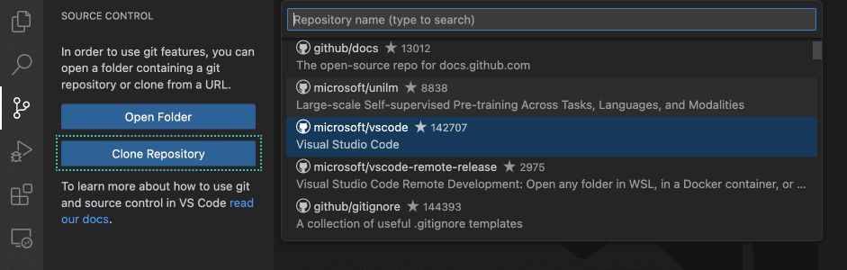
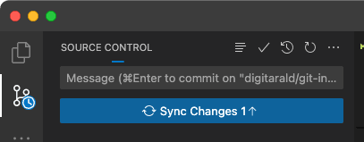
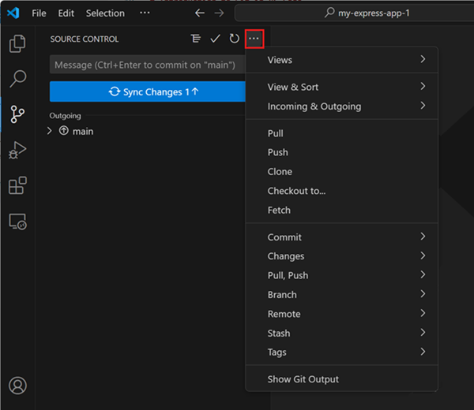
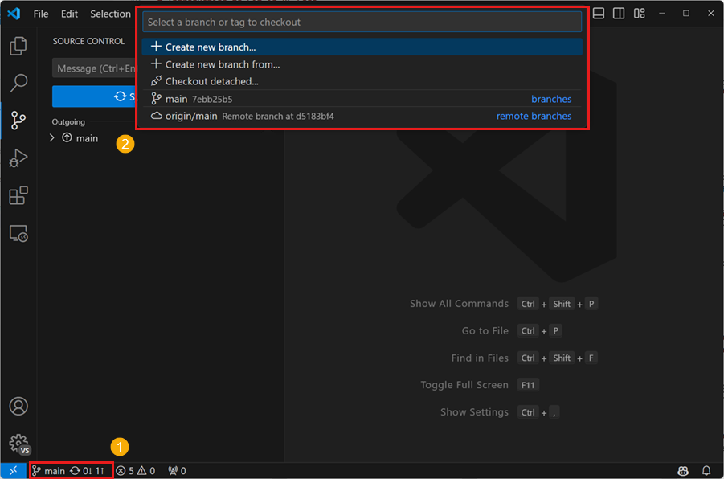

# Visual Studio Code에서 Git 소개 {#introduction-to-git-in-vs-code}

소스 코드를 쉽게 관리하고 다른 사람과 협업하고 싶으신가요? Git과 GitHub는 필요한 도구입니다! Visual Studio Code를 사용하면 간단하게 설정하고 사용할 수 있습니다. 초보자라도 VS Code의 사용자 친화적인 인터페이스를 통해 코드 푸시 및 풀, 브랜치 생성 및 병합, 코드 변경 사항 커밋과 같은 일반적인 Git 작업을 안내받을 수 있습니다. 전문가라면 Git 명령줄을 사용하는 것보다 편리하게 편집기 내에서 Git 작업을 수행할 수 있는 기능을 좋아할 것입니다. 또한 VS Code와 Git 간의 원활한 워크플로를 통해 편집기에서 더 많은 작업을 수행할 수 있습니다.

## VS Code에서 Git 설정 {#set-up-git-in-vs-code}

VS Code에서 Git과 GitHub를 사용하려면 먼저 [컴퓨터에 Git이 설치되어 있는지 확인](https://git-scm.com/downloads)하세요. Git이 없으면 **Source Control** 화면에서 설치 방법을 안내합니다. 설치 후 VS Code를 다시 시작하세요.

또한 **Activity bar**의 오른쪽 하단에 있는 **Accounts** 메뉴에서 GitHub 계정으로 VS Code에 로그인하여 [설정 동기화](/docs/editor/settings-sync.md)와 같은 추가 기능을 활성화할 수 있으며, GitHub에서 리포지토리를 클론하고 게시할 수도 있습니다.

## Git 리포지토리 열기 {#open-a-git-repository}

VS Code는 로컬에서 원격 클라우드 기반 환경인 [GitHub Codespaces](https://github.com/features/codespaces)까지 다양한 방법으로 Git 리포지토리를 시작할 수 있습니다.

### 로컬 리포지토리 클론 {#clone-a-repository-locally}

리포지토리를 클론하려면 명령 팔레트(`Ctrl+Shift+P`)에서 **Git: Clone** 명령을 실행하거나 **Source Control** 화면에서 **Clone Repository** 버튼을 선택하세요.

GitHub에서 클론하는 경우 VS Code가 GitHub 인증을 요청합니다. 그런 다음 클론할 리포지토리를 목록에서 선택하세요. 목록에는 공개 및 비공개 리포지토리가 모두 포함됩니다.

다른 Git 제공자의 경우 리포지토리 URL을 입력하고 **클론**을 선택한 다음 로컬 컴퓨터의 폴더를 선택하여 파일을 클론하세요. 리포지토리가 로컬 컴퓨터에 클론되면 VS Code가 폴더를 엽니다.

### 로컬 폴더에서 리포지토리 초기화 {#initialize-a-repository-in-a-local-folder}

새 로컬 Git 리포지토리를 초기화하려면:

1. 컴퓨터에서 기존 또는 새 폴더를 선택하고 VS Code에서 엽니다.

2. **Source Control** 화면에서 **Initialize Repository** 버튼을 선택합니다.

   이렇게 하면 현재 폴더에 새 Git 리포지토리가 생성되어 코드 변경 사항을 추적할 수 있습니다.

   이 작업은 명령줄에서 `git init`을 실행하는 것과 동일합니다.

   

#### 로컬 리포지토리를 GitHub에 게시 {#publish-local-repository-to-github}

로컬 리포지토리를 초기화하고 직접 GitHub에 게시할 수도 있습니다. 이렇게 하면 GitHub 계정에 새 리포지토리가 생성되고 로컬 코드 변경 사항이 원격 리포지토리에 푸시됩니다. 원격 리포지토리에 소스 코드를 저장하면 코드를 백업하고 다른 사람과 협업하며 [GitHub Actions](https://github.com/features/actions)를 사용하여 워크플로를 자동화하는 데 유용합니다.

**Source Control** 화면에서 **Publish to GitHub** 명령 버튼을 사용하세요. 그런 다음 리포지토리 이름과 설명을 선택하고 공개 또는 비공개로 설정할 수 있습니다.

리포지토리가 생성되면 VS Code가 로컬 코드를 원격 리포지토리에 푸시합니다. 이제 코드는 GitHub에 백업되었으며 커밋 및 풀 리퀘스트를 통해 다른 사람과 협업할 수 있습니다.

### Codespace에서 GitHub 리포지토리 열기 {#open-a-github-repository-in-a-codespace}

[GitHub Codespaces](https://github.com/features/codespaces)를 사용하면 GitHub 리포지토리를 완전히 구성된 클라우드 기반 개발 환경에서 열 수 있으며, 로컬 컴퓨터에 소프트웨어를 설치하지 않고도 브라우저에서 개발할 수 있습니다. GitHub Codespaces는 개인 사용자를 위한 무료 사용을 제공하므로 오픈 소스 프로젝트 작업을 쉽게 시작할 수 있습니다.

GitHub 리포지토리에 대한 codespace를 생성하려면:

1. VS Code에서 [GitHub Codespaces](https://marketplace.visualstudio.com/items?itemName=GitHub.codespaces) 확장을 설치하고 GitHub 계정으로 로그인합니다.

1. **Codespaces: Create New Codespace** 명령을 실행합니다.

1. 열고자 하는 리포지토리와 브랜치를 선택합니다.

   VS Code는 codespace에 연결된 새 창을 엽니다. 소스 코드, 터미널 및 실행 및 디버깅이 원격 클라우드 기반 개발 환경에서 호스팅됩니다.

   파일 탐색기와 상태 표시줄에 작업 공간이 codespace에서 열려 있음을 나타냅니다.

   

또한 [GitHub Codespaces 웹사이트](https://github.com/codespaces/templates)에서 codespace 템플릿을 시작할 수도 있습니다.

브라우저에서 이미 codespace를 열고 있는 경우 **Codespaces: Open in VS Code Desktop** 명령을 실행하여 로컬 VS Code Desktop에서 codespace에 연결할 수 있습니다.

포트 포워딩과 같은 사용자 정의를 포함하여 GitHub Codespaces에 대해 자세히 알아보려면 [codespace에서 개발](https://docs.github.com/codespaces/developing-in-codespaces/developing-in-a-codespace?tool=vscode) 문서를 참조하세요.

### 원격으로 GitHub 리포지토리 열기 {#open-a-github-repository-remotely}

VS Code의 원격 리포지토리 지원을 통해 GitHub 리포지토리를 로컬 컴퓨터에 클론하지 않고도 탐색하고 편집할 수 있습니다. 이는 전체 코드베이스를 로컬 컴퓨터에 클론하지 않고도 원격 리포지토리에 빠르게 변경 사항을 적용하는 데 유용합니다.

1. 먼저 [GitHub Repositories](https://marketplace.visualstudio.com/items?itemName=GitHub.remotehub) 확장을 설치합니다.

1. **Remote Repositories: Open Remote Repository...** 명령을 실행하거나 탐색기 화면에서 **Open Remote Repository** 버튼을 사용합니다.

1. 열고자 하는 GitHub 리포지토리를 검색하고 선택합니다.

   

:::tip
코드를 실행하거나 터미널 명령을 실행해야 하는 경우 **Continue Working** 명령을 사용하여 원격 리포지토리에서 codespace로 원활하게 전환할 수 있습니다.
:::

## 코드 변경 사항 스테이징 및 커밋 {#staging-and-committing-code-changes}

Git 리포지토리를 설정한 후 새로 생성된 코드와 편집된 코드를 [스테이징 및 커밋](https://git-scm.com/about/staging-area)하여 코드 변경 사항을 추적할 수 있습니다.

:::tip
변경 사항을 자주 커밋하세요. 이렇게 하면 필요한 경우 코드의 이전 버전으로 쉽게 되돌릴 수 있습니다.
:::

**Activity Bar**에서 **Source Control** 화면에 액세스하여 작업 공간의 모든 변경된 파일을 나열할 수 있습니다. 소스 제어 뷰 헤더의 트리/목록 아이콘을 사용하여 트리 뷰 또는 목록 뷰 간에 전환할 수 있습니다.

소스 제어 뷰에서 파일을 선택하면 편집기에서 이전에 커밋된 파일과 비교하여 파일 변경 사항을 강조 표시하는 diff 뷰가 표시됩니다.

파일을 스테이징하려면 **Source Control** 화면에서 파일 옆에 있는 **+** (플러스) 아이콘을 선택하세요. 이렇게 하면 파일이 **Staged Changes** 섹션에 추가되어 다음 커밋에 포함될 것임을 나타냅니다.

**Source Control** 화면에서 **Changes** 옆에 있는 **+** (플러스) 아이콘을 선택하여 모든 보류 중인 변경 사항을 한 번에 스테이징할 수도 있습니다.

스테이징된 변경 사항은 파일 옆에 있는 **−** (마이너스) 아이콘을 선택하여 취소할 수도 있습니다. 마찬가지로 **Source Control** 화면에서 **Staged Changes** 옆에 있는 **−** (마이너스) 아이콘을 선택하여 모든 스테이징된 변경 사항을 취소할 수 있습니다.

스테이징된 변경 사항을 커밋하려면 상단 텍스트 상자에 커밋 메시지를 입력한 다음 **Commit** 버튼을 선택하세요. 이렇게 하면 변경 사항이 로컬 Git 리포지토리에 저장되어 필요한 경우 코드의 이전 버전으로 되돌릴 수 있습니다.

:::tip
GitHub Copilot 구독이 있고 Github Copilot 확장을 설치한 경우 _sparkle_ 아이콘을 사용하여 [커밋 메시지 생성](/docs/copilot/overview.md#productivity-improvements)을 할 수 있습니다.
:::

탐색기 화면 하단에 있는 **Timeline** 화면에서 모든 로컬 파일 변경 사항 및 커밋을 탐색하고 검토할 수 있습니다.

## 원격 변경 사항 푸시 및 풀 {#pushing-and-pulling-remote-changes}

로컬 Git 리포지토리에 커밋한 후 원격 리포지토리에 푸시할 수 있습니다. **Sync Changes** 버튼은 푸시 및 풀할 커밋 수를 나타냅니다. **Sync Changes** 버튼을 선택하면 새 원격 커밋을 다운로드(Pull)하고 새 로컬 커밋을 원격 리포지토리에 업로드(Push)합니다.

:::tip
**Git: Autofetch** [설정](/docs/getstarted/settings.md)을 활성화하여 항상 최신 원격 커밋 표시기를 받을 수 있습니다.
:::

Push 및 Pull은 각각의 명령을 사용하여 개별적으로 수행할 수도 있습니다. 이러한 명령은 소스 제어 메뉴에서 액세스할 수 있습니다.

## 브랜치 사용 {#using-branches}

Git에서 [브랜치](https://docs.github.com/pull-requests/collaborating-with-pull-requests/proposing-changes-to-your-work-with-pull-requests/about-branches)는 코드베이스의 여러 버전을 동시에 작업할 수 있도록 합니다. 이는 새로운 기능을 실험하거나 주요 코드 변경 사항을 메인 코드베이스에 영향을 주지 않고 수행하는 데 유용합니다.

상태 표시줄의 브랜치 표시기는 현재 브랜치를 표시하고 새 브랜치 및 기존 브랜치로 전환할 수 있습니다.

새 브랜치를 만들려면 브랜치 표시기를 선택하고 현재 브랜치 또는 다른 로컬 브랜치에서 만들기를 선택하세요. 새 브랜치 이름을 입력하고 확인합니다. VS Code는 새 브랜치를 만들고 해당 브랜치로 전환하여 메인 브랜치에 영향을 주지 않고 코드 변경을 수행할 수 있습니다.

:::tip
[GitHub Pull Requests and Issues](https://marketplace.visualstudio.com/items?itemName=GitHub.vscode-pull-request-github) 확장을 사용하는 경우 이슈에서 직접 브랜치를 생성할 수 있으며, 이를 통해 새 로컬 브랜치에서 작업을 시작하고 풀 리퀘스트를 자동으로 미리 채울 수 있습니다.
:::

로컬 브랜치를 만든 후 **Source Control** 화면에서 **Publish Branch**를 선택하여 브랜치를 원격 리포지토리에 푸시할 수 있습니다. 이렇게 하면 원격 리포지토리에 새 브랜치가 생성되어 해당 브랜치에서 다른 사람과 협업할 수 있습니다.

### GitHub 풀 리퀘스트 생성 및 검토 {#creating-and-reviewing-github-pull-requests}

Git 및 GitHub에서 [풀 리퀘스트(PR)](https://docs.github.com/pull-requests/collaborating-with-pull-requests/proposing-changes-to-your-work-with-pull-requests/about-pull-requests)는 협력자가 별도의 브랜치에서 메인 브랜치로 코드 변경 사항을 검토하고 병합할 수 있는 방법입니다. 이를 통해 팀은 코드 변경 사항을 메인 코드베이스에 통합하기 전에 검토하고 승인할 수 있으며, 고품질의 변경 사항만 병합되도록 보장합니다.

VS Code에서 풀 리퀘스트를 사용하려면 [GitHub Pull Requests and Issues](https://marketplace.visualstudio.com/items?itemName=GitHub.vscode-pull-request-github) 확장을 설치해야 합니다. 이 확장은 VS Code에 PR 및 이슈 추적 기능을 추가하여 편집기 내에서 PR을 생성, 검토 및 병합할 수 있습니다.

PR을 생성하려면 메인 브랜치와 별도의 브랜치에 있는지 확인하고 코드 변경 사항을 원격 리포지토리에 푸시하세요. **Source Control** 화면에서 **Create Pull Request** 버튼을 선택합니다. 그러면 PR 생성 양식이 열리며, 여기에서 PR 제목과 설명을 입력하고 변경 사항을 병합할 브랜치를 선택할 수 있습니다. **Create**을 선택하여 PR을 생성합니다.

PR을 검토하려면 **Source Control** 화면에서 **Review Pull Request** 버튼을 선택하고 검토할 PR을 선택합니다. 그러면 PR이 새 편집기 창에 열리며, 여기에서 코드 변경 사항을 검토하고 댓글을 남길 수 있습니다. 코드 변경 사항에 만족하면 **Merge** 버튼을 선택하여 PR을 대상 브랜치에 병합할 수 있습니다.

VS Code의 GitHub 문서에서 풀 리퀘스트에 대해 자세히 알아보세요. [GitHub 문서](/docs/sourcecontrol/github.md).

## 내장 터미널에서 Git 사용 {#using-git-in-the-built-in-terminal}

모든 Git 상태는 로컬 리포지토리에 저장되므로 VS Code의 UI, [내장 터미널](/docs/terminal/basics.md) 또는 [GitHub Desktop](https://desktop.github.com)과 같은 외부 도구 간에 쉽게 전환할 수 있습니다. 또한 [VS Code를 기본 Git 편집기로 설정](/docs/sourcecontrol/overview.md#vs-code-as-git-editor)하여 커밋 메시지 및 기타 Git 관련 파일을 편집하는 데 VS Code를 사용할 수 있습니다.

### Windows에서 Git Bash 사용 {#git-bash-on-windows}

Git Bash는 Windows용 인기 있는 셸 환경으로, Git 및 기타 명령줄 도구를 사용하기 위한 Unix와 유사한 명령줄 인터페이스를 제공합니다. Visual Studio Code의 통합 터미널은 셸로서 Git Bash를 지원하여 Git Bash를 개발 워크플로에 원활하게 통합할 수 있습니다. Windows 컴퓨터에 Git을 설치하면 설치 단계에서 선택 해제되지 않은 경우 Git Bash도 설치됩니다.

먼저 **View** > **Terminal** (`` Ctrl+` ``)을 엽니다. 터미널 패널에서 `+` 아이콘 옆에 있는 드롭다운 화살표를 선택하여 새 셸을 엽니다. Git Bash가 설치되어 있으면 터미널 및 셸 목록에 표시됩니다. 터미널 사이드바에서 다른 터미널 및 셸 간에 전환할 수 있습니다. Visual Studio Code에서 Git Bash를 구성하면 이제 코드 편집기에서 터미널을 통해 모든 즐겨 사용하는 Git 명령을 사용할 수 있습니다.

Git Bash를 기본 셸로 설정하려면 터미널 드롭다운(`+` 아이콘 옆)을 열고 **Select Default Profile**을 선택합니다. 이렇게 하면 Git Bash를 포함한 사용 가능한 셸 목록이 열립니다. *Git Bash*를 선택하면 기본 셸로 설정되며, 모든 향후 터미널은 Git Bash로 열립니다. 더 고급 터미널 팁은 [터미널 문서](/docs/terminal/basics.md)에서 확인할 수 있습니다.
