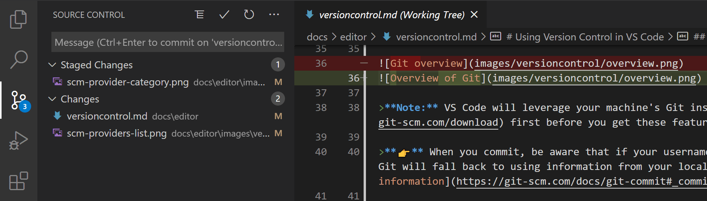
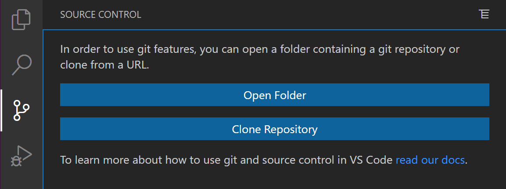
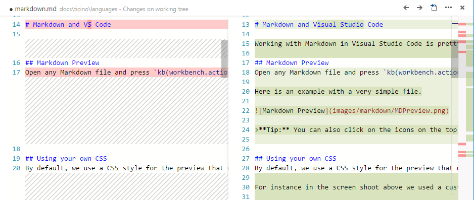
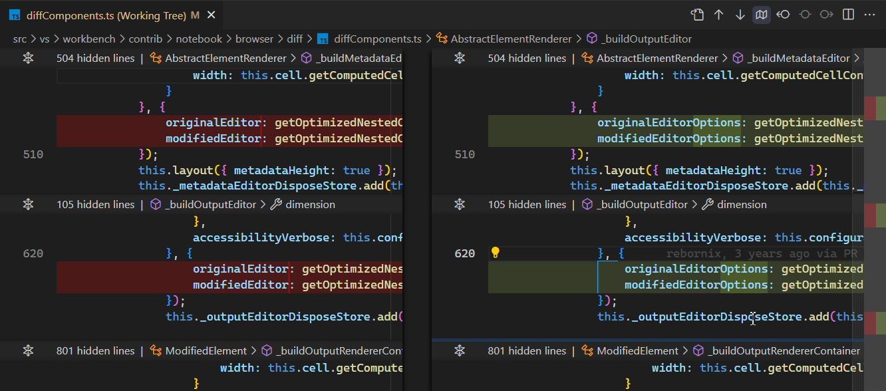

# Visual Studio Code에서 Git 소스 제어 사용 {#using-git-source-control-in-vs-code}

Visual Studio Code는 통합 소스 제어 관리(SCM)를 제공하며, 기본적으로 [Git](https://git-scm.com/) 지원을 포함합니다. 많은 다른 소스 제어 제공자는 VS Code 마켓플레이스의 [확장](/docs/editor/extension-marketplace.md)을 통해 사용할 수 있습니다.

<iframe width="560" height="315" src="https://www.youtube-nocookie.com/embed/i_23KUAEtUM" title="Using Git with Visual Studio Code (Official Beginner Tutorial)" frameborder="0" allow="accelerometer; autoplay; clipboard-write; encrypted-media; gyroscope; picture-in-picture" allowfullscreen></iframe>

## Git 저장소에서 작업하기 {#working-in-a-git-repository}

> **Git을 처음 사용하시나요?** [git-scm](https://git-scm.com/doc) 웹사이트는 시작하기 좋은 곳입니다. 인기 있는 온라인 [책](https://git-scm.com/book), 시작하기 [동영상](https://git-scm.com/video/what-is-git) 및 [요약 가이드](https://github.github.com/training-kit/downloads/github-git-cheat-sheet.pdf)를 제공합니다. VS Code 문서는 Git에 익숙하다는 가정하에 작성되었습니다.



> **Git이 설치되어 있는지 확인하세요.** VS Code는 최소 버전 `2.0.0` 이상의 Git 설치를 사용하므로, 이러한 기능을 사용하려면 먼저 [Git을 설치](https://git-scm.com/download)해야 합니다.

왼쪽의 활동 표시줄에 있는 소스 제어 아이콘은 현재 저장소에 있는 **변경 사항의 개요**를 항상 표시합니다. 아이콘을 선택하면 현재 저장소 변경 사항의 세부 정보를 볼 수 있습니다: **CHANGES**, **STAGED CHANGES** 및 **MERGE CHANGES**.

각 항목을 클릭하면 **각 파일 내의 텍스트 변경 사항**을 자세히 볼 수 있습니다. 스테이지되지 않은 변경 사항의 경우, 오른쪽 편집기에서 파일을 계속 편집할 수 있습니다. 자유롭게 사용하세요!

VS Code의 왼쪽 하단 모서리에서도 **저장소 상태**를 나타내는 표시기를 찾을 수 있습니다: **현재 브랜치**, **더티 표시기**, 현재 브랜치의 **들어오고 나가는 커밋 수**. 상태 표시기를 클릭하고 목록에서 Git 참조를 선택하여 저장소의 모든 브랜치를 **체크아웃**할 수 있습니다.

:::tip
Git 저장소의 하위 디렉토리에서 VS Code를 열 수 있습니다. VS Code의 Git 서비스는 저장소 내의 모든 변경 사항을 표시하지만, 범위가 지정된 디렉토리 외부의 파일 변경 사항은 현재 작업 공간 외부에 위치해 있음을 나타내는 도구 설명과 함께 음영 처리됩니다.
:::

## 커밋 {#commit}

**Staging**(git add) 및 **Unstaging**(git reset)은 파일의 컨텍스트 메뉴에서 또는 드래그 앤 드롭으로 수행할 수 있습니다.

> **Git 사용자 이름과 이메일을 구성하세요.** 커밋할 때 Git 구성에 사용자 이름 및/또는 이메일이 설정되어 있지 않으면 Git은 로컬 머신의 정보를 사용합니다. 자세한 내용은 [Git 커밋 정보](https://git-scm.com/docs/git-commit#_commit_information)에서 확인할 수 있습니다.


변경 사항 위에 커밋 메시지를 입력하고 `Ctrl+Enter` (macOS: `⌘+Enter`)를 눌러 커밋할 수 있습니다. 스테이지된 변경 사항이 있는 경우, 해당 변경 사항만 커밋됩니다. 그렇지 않으면 커밋할 변경 사항을 선택하고 커밋 설정을 변경할 수 있는 프롬프트가 표시됩니다.

이 워크플로우는 매우 유용합니다. 예를 들어, 이전 스크린샷에서는 `overview.png`에 대한 스테이지된 변경 사항만 커밋에 포함됩니다. 나중에 스테이징 및 커밋 작업은 `versioncontrol.md` 및 두 개의 다른 `.png` 이미지에 대한 변경 사항을 별도의 커밋으로 포함할 수 있습니다.

더 구체적인 **Commit** 작업은 소스 제어 보기 상단의 **Views and More Actions** `...` 메뉴에서 찾을 수 있습니다.


:::tip
잘못된 브랜치에 변경 사항을 커밋한 경우, **Command Palette**(`Ctrl+Shift+P`)에서 **Git: Undo Last Commit** 명령을 사용하여 커밋을 취소할 수 있습니다.
:::

<iframe src="https://www.youtube-nocookie.com/embed/E6ADS2k8oNQ" width="640" height="320" allowFullScreen="true" frameBorder="0" title="Git: Commits in Visual Studio Code"></iframe>

### 편집기를 사용하여 커밋 메시지 작성 {#author-commit-messages-using-an-editor}

변경 사항을 커밋할 때 커밋 메시지를 입력하지 않으면, VS Code는 `COMMIT_EDITMSG` 파일에 대한 편집기를 열어 커밋 메시지를 작성할 수 있습니다. 커밋 메시지를 제공한 후, 편집기 탭을 닫거나 편집기 도구 모음의 **Accept Commit Message** 버튼을 선택하여 변경 사항을 커밋할 수 있습니다.

커밋 작업을 취소하려면 텍스트 편집기의 내용을 지우고 편집기 탭을 닫거나 편집기 도구 모음의 **Discard Commit Message** 버튼을 선택할 수 있습니다.


이 기능은 `git.useEditorAsCommitInput` 설정을 토글하여 비활성화할 수 있습니다. 설정을 변경한 후에는 변경 사항이 적용되도록 VS Code를 다시 시작해야 합니다.

통합 터미널에서 실행된 git 커밋 명령에 대해 동일한 흐름을 사용하려면 `git.terminalGitEditor` 설정을 활성화하세요.

## 저장소 복제 {#cloning-a-repository}

아직 폴더를 열지 않은 경우, 소스 제어 보기는 로컬 머신에서 **Open Folder** 또는 **Clone Repository** 옵션을 제공합니다.



**Clone Repository**를 선택하면 원격 저장소의 URL(예: [GitHub](https://github.com/))과 로컬 저장소를 넣을 상위 디렉토리를 묻는 메시지가 표시됩니다.

GitHub 저장소의 경우, GitHub **Code** 대화 상자에서 URL을 찾을 수 있습니다.


그런 다음 해당 URL을 **Git: Clone** 프롬프트에 붙여넣습니다.


**GitHub에서 복제** 옵션도 표시됩니다. VS Code에서 GitHub 계정으로 인증하면 이름으로 저장소를 검색하고 저장소를 선택하여 복제할 수 있습니다. **Command Palette**(`Ctrl+Shift+P`)에서 **Git: Clone** 명령을 시작하여 Git 저장소를 복제하는 흐름을 시작할 수도 있습니다. 단계별 안내는 [VS Code에서 저장소 복제](https://www.youtube.com/watch?v=bz1KauFlbQI) 동영상을 참조하세요.

:::note
로컬 머신에 내용을 복제하지 않고 저장소에서 작업하려면 [GitHub Repositories](https://marketplace.visualstudio.com/items?itemName=github.remotehub) 확장을 설치하여 GitHub에서 직접 탐색하고 편집할 수 있습니다. 자세한 내용은 [GitHub Repositories 확장](/docs/sourcecontrol/github.md#github-repositories-extension) 섹션에서 확인할 수 있습니다.
:::

## 브랜치 및 태그 {#branches-and-tags}

<iframe src="https://www.youtube-nocookie.com/embed/b9LTz6joMf8?clip=Ugkxcq7zDGA4aMi8p7lICNMzTANn_8ozU5gK&amp;clipt=EPiBAxj08QU" width="640" height="320" allowFullScreen="true" frameBorder="0" title="Create Git Branches in Visual Studio Code"></iframe>

**Command Palette**(`Ctrl+Shift+P`)에서 **Git: Create Branch** 및 **Git: Checkout to** 명령을 통해 VS Code 내에서 직접 브랜치를 생성하고 체크아웃할 수 있습니다.

**Git: Checkout to**를 실행하면 현재 저장소의 모든 브랜치 또는 태그가 포함된 드롭다운 목록이 표시됩니다. 새 브랜치를 생성하는 것이 더 나은 옵션이라고 결정한 경우, 새 브랜치를 생성하거나 분리된 모드에서 브랜치를 체크아웃할 수 있는 옵션도 제공합니다.


**Git: Create Branch** 명령을 사용하면 새 브랜치를 빠르게 생성할 수 있습니다. 새 브랜치의 이름을 제공하면 VS Code가 브랜치를 생성하고 해당 브랜치로 전환합니다. **Create new branch from...** 을 선택하면 새 브랜치가 가리킬 커밋을 지정할 수 있는 추가 프롬프트가 표시됩니다.

:::tip
VS Code는 다른 브랜치로 전환할 때 열려 있는 편집기를 자동으로 저장하고 복원할 수 있습니다. 이 기능을 활성화하려면 `scm.workingSets.enabled` 설정을 사용하세요. 처음으로 브랜치로 전환할 때 열려 있는 편집기를 제어하려면 `scm.workingSets.default` 설정을 사용할 수 있습니다.
:::

## 원격 저장소 {#remotes}

저장소가 원격 저장소에 연결되어 있고 체크아웃된 브랜치가 해당 원격 저장소의 브랜치에 [업스트림 링크](https://git-scm.com/book/ch3-5.html)를 가지고 있는 경우, VS Code는 해당 브랜치를 **push**, **pull**, **sync**할 수 있는 유용한 작업을 제공합니다(후자는 **pull** 명령을 실행한 후 **push** 명령을 실행합니다). 이러한 작업은 **Views and More Actions** `...` 메뉴에서 찾을 수 있으며, 원격 저장소를 **추가하거나 제거**하는 옵션도 있습니다.

VS Code는 주기적으로 원격 저장소에서 변경 사항을 가져올 수 있습니다. 이를 통해 VS Code는 로컬 저장소가 원격 저장소보다 얼마나 앞서거나 뒤처져 있는지 표시할 수 있습니다. 이 기능은 기본적으로 비활성화되어 있으며, `git.autofetch` [설정](/docs/getstarted/settings.md)을 사용하여 활성화할 수 있습니다.

:::tip
매번 VS Code가 Git 원격 저장소와 통신할 때 자격 증명을 묻지 않도록 [자격 증명 도우미를 설정](https://docs.github.com/get-started/getting-started-with-git/caching-your-github-credentials-in-git)해야 합니다. 그렇지 않으면, 자격 증명 프롬프트 수를 줄이기 위해 `git.autofetch` [설정](/docs/getstarted/settings.md)을 사용하여 자동 가져오기를 비활성화하는 것이 좋습니다.
:::

## 소스 제어 그래프 {#source-control-graph}

원격 저장소가 구성된 경우, 원격 저장소보다 몇 개의 커밋이 앞서거나 뒤처져 있는지 확인할 수 있습니다. 소스 제어 보기의 **Source Control Graph** 섹션은 들어오고 나가는 커밋의 그래픽 표현을 보여줍니다.

그래프에는 현재 브랜치, 현재 브랜치의 업스트림 브랜치 및 선택적 기본 브랜치가 포함됩니다. 그래프의 루트는 이러한 브랜치의 공통 조상입니다.


그래프는 다음 기능을 제공합니다:

- 항목을 선택하여 커밋의 해당 변경 사항을 확인합니다.
- **들어오는/나가는** 제목 위로 마우스를 가져가서 Fetch, Pull, Push 작업을 수행합니다.

## Git 상태 표시줄 작업 {#git-status-bar-actions}

현재 체크아웃된 브랜치에 업스트림 브랜치가 구성된 경우, 상태 표시줄에 **Synchronize Changes** 작업이 브랜치 표시기 옆에 표시됩니다. **Synchronize Changes**는 원격 변경 사항을 로컬 저장소로 가져온 다음 로컬 커밋을 업스트림 브랜치로 푸시합니다.


업스트림 브랜치가 구성되지 않았고 Git 저장소에 원격 저장소가 설정된 경우, **Publish** 작업이 활성화됩니다. 이를 통해 현재 브랜치를 원격 저장소에 게시할 수 있습니다.


## 줄 표시기 {#gutter-indicators}

Git 저장소인 폴더를 열고 변경 사항을 시작하면, VS Code는 줄 표시기 및 개요 눈금자에 유용한 주석을 추가합니다.

- 빨간 삼각형은 삭제된 줄을 나타냅니다.
- 녹색 막대는 새로 추가된 줄을 나타냅니다.
- 파란 막대는 수정된 줄을 나타냅니다.


## 병합 충돌 {#merge-conflicts}


병합 충돌은 VS Code에서 인식됩니다. 차이점이 강조 표시되며, 각 변경 사항을 수락하거나 둘 다 수락하는 인라인 작업이 있습니다. 충돌이 해결되면 충돌 파일을 스테이지하여 변경 사항을 커밋할 수 있습니다.

## 3-way 병합 편집기 {#3-way-merge-editor}

병합 충돌을 해결하는 데 도움이 되도록, VS Code는 3-way 병합 편집기를 제공하여 들어오는 변경 사항(왼쪽), 현재 변경 사항(오른쪽) 및 병합 결과(하단)를 상호작용적으로 수락하고 볼 수 있습니다. Git 병합 충돌이 있는 파일의 오른쪽 하단에 있는 **Resolve in Merge Editor** 버튼을 선택하여 3-way 병합 편집기를 엽니다.

3-way 병합 편집기는 **Incoming** 변경 사항(왼쪽), **Current** 변경 사항(오른쪽) 및 병합 **Result**(하단)의 별도 보기를 표시합니다. 충돌이 강조 표시되며 CodeLens 버튼을 사용하여 해결할 수 있습니다.


### 충돌 해결 {#resolving-conflicts}

3-way 병합 편집기를 사용하여 충돌을 해결할 수 있으며, 들어오는 변경 사항 또는 현재 변경 사항을 수락하거나 둘 다 수락할 수 있습니다. 병합 결과를 수동으로 편집할 수도 있습니다.

일부 충돌의 경우, 병합 편집기는 **Accept Combination** 버튼을 표시합니다. 조합을 수락하면 현재 충돌이 두 변경 사항을 스마트하게 병합하여 해결됩니다. 이는 동일한 줄의 변경 사항이 동일한 문자를 건드리지 않는 경우에 특히 유용합니다.

**Ignore** 버튼을 사용하여 들어오는 변경 사항이나 현재 변경 사항을 수락하지 않고 충돌을 해결된 것으로 표시할 수 있습니다. 이는 충돌 영역을 변경 사항이 발생하기 전 상태로 재설정합니다.

### 병합 완료 {#completing-the-merge}

결과 편집기의 오른쪽에 있는 충돌 카운터를 사용하여 해결되지 않은 충돌이 몇 개인지 추적할 수 있습니다. 카운터를 클릭하면 다음 해결되지 않은 충돌로 이동합니다. 모든 충돌이 해결되면, 오른쪽 하단의 **병합 완료**를 선택하여 병합을 완료할 수 있습니다. 이렇게 하면 파일이 스테이지되고 병합 편집기가 닫힙니다.

### 대체 레이아웃 및 기타 {#alternative-layouts-and-more}

병합 편집기의 오른쪽 상단에 있는 세 개의 점(**···**)을 선택하면 추가 옵션이 있는 컨텍스트 메뉴가 열립니다. 세로 레이아웃으로 전환하고, 변경 사항이 발생하기 전 상태를 보여주는 기본 보기를 표시할 수 있습니다.

**Incomming**, **Current** 및 **Result** 옆의 세 개의 점은 각 보기에 대한 옵션을 제공하며, 기본과의 나란히 비교를 표시하거나 모든 변경 사항을 수락하거나 결과를 재설정할 수 있습니다.

### 충돌 이해 {#understanding-conflicts}

3-way 병합 편집기가 작동하는 방식의 세부 사항에 대해 자세히 알아보려면 다음 동영상을 추천합니다:

<iframe width="560" height="315" src="https://www.youtube-nocookie.com/embed/HosPml1qkrg" title="The EXTREMELY helpful guide to merge conflicts" frameborder="0" allow="accelerometer; autoplay; clipboard-write; encrypted-media; gyroscope; picture-in-picture; web-share" allowfullscreen></iframe>

## 차이점 보기 {#viewing-diffs}

VS Code의 Git 도구는 VS Code 내에서 차이점을 보는 기능을 지원합니다.



차이점 편집기에는 가운데에 별도의 줄 표시기 있어 **Stage** 또는 **Revert** 변경 작업을 수행할 수 있습니다. 텍스트 블록을 선택하면 선택한 변경 사항을 되돌리거나 스테이지할 수 있습니다.



:::tip
탐색기 보기에서 파일을 마우스 오른쪽 버튼으로 클릭하고 **Select for Compare**을 선택한 다음 두 번째 파일을 마우스 오른쪽 버튼으로 클릭하여 **Compare with Selected**를 선택하여 두 파일을 비교할 수 있습니다. 또는 **Command Palette**(`Ctrl+Shift+P`)를 열고 **File: Compare** 명령 중 하나를 선택할 수 있습니다. VS Code에서 파일을 비교하는 다양한 옵션에 대해 자세히 알아보려면 [파일 비교](/docs/editor/codebasics.md#compare-files)를 참조하세요.
:::

### 접근 가능한 차이점 화면 {#accessible-diff-viewer}

차이점 편집기에는 변경 사항을 통합 패치 형식으로 표시하는 접근 가능한 차이점 화면이 있습니다. **Go to Next Difference**(`F7`) 및 **Go to Previous Difference**(`Shift+F7`)을 사용하여 변경 사항 간을 탐색할 수 있습니다. 화살표 키를 사용하여 줄을 탐색하고 `Enter`를 눌러 차이점 편집기로 돌아가 선택한 줄로 이동할 수 있습니다.


:::note
이 경험은 화면 읽기 프로그램 사용자에게 특히 유용합니다.
:::

## 타임라인 보기 {#timeline-view}

기본적으로 파일 탐색기 하단에서 액세스할 수 있는 타임라인 보기는 파일에 대한 시계열 이벤트(예: Git 커밋)를 시각화하는 통합 보기입니다.


VS Code의 내장 Git 지원은 지정된 파일의 Git 커밋 기록을 제공합니다. 커밋을 선택하면 해당 커밋에 의해 도입된 변경 사항의 차이점 보기가 열립니다. 커밋을 마우스 오른쪽 버튼으로 클릭하면 **Copy Commit ID** 및 **Commit Message** 옵션이 표시됩니다.

Visual Studio Code는 VS Code 마켓플레이스에서 사용할 수 있는 [확장](/docs/editor/extension-marketplace.md)을 통해 더 많은 Git 기록 워크플로우를 지원합니다.

<div class="marketplace-extensions-scm-history-curated"></div>

:::tip
확장 타일을 클릭하여 마켓플레이스에서 설명 및 리뷰를 읽어보세요.
:::

## Git 출력 창 {#git-output-window}

사용 중인 Git 명령을 확인하려면 언제든지 내부를 엿볼 수 있습니다. 이는 이상한 일이 발생하거나 단순히 궁금할 때 유용합니다. :)

Git 출력 창을 열려면 **View** > **Output**을 실행하고 드롭다운 목록에서 **Log (Git)**을 선택합니다.

## 저장소 초기화 {#initialize-a-repository}

작업 공간이 로컬 머신에 있는 경우, **Initialize Repository** 명령을 사용하여 Git 소스 제어를 활성화할 수 있습니다. VS Code가 기존 Git 저장소를 감지하지 못하면 소스 제어 보기는 **Initialize Repository** 또는 **Publish to GitHub** 옵션을 제공합니다.


**Command Palette**(`Ctrl+Shift+P`)에서 **Git: Initialize Repository** 및 **Publish to GitHub** 명령을 실행할 수도 있습니다. **Initialize Repository**를 실행하면 필요한 Git 저장소 메타데이터 파일이 생성되고 작업 공간 파일이 추적되지 않은 변경 사항으로 표시됩니다. **Publish to GitHub**는 작업 공간 폴더를 GitHub 저장소에 직접 게시하여 비공개 및 공개 저장소 중에서 선택할 수 있습니다. GitHub에 게시에 대한 자세한 내용은 [게시 저장소](https://www.youtube.com/watch?v=3BBvBwDW4CY) 동영상을 참조하세요.

## Git 편집기로서의 VS Code {#vs-code-as-git-editor}

명령줄에서 VS Code를 실행할 때 `--wait` 인수를 전달하여 새 VS Code 인스턴스를 닫을 때까지 실행 명령이 대기하도록 할 수 있습니다. 이는 VS Code를 Git 외부 편집기로 구성할 때 유용할 수 있으며, Git이 새 VS Code 인스턴스를 닫을 때까지 대기합니다.

다음은 이를 수행하는 단계입니다:

1. 명령줄에서 `code --help`를 실행할 수 있고 도움말을 얻을 수 있는지 확인합니다.
   - 도움말이 표시되지 않으면 다음 단계를 따르세요:
     - macOS: **Command Palette**에서 **Shell Command: Install 'Code' command in path**를 선택합니다.
     - Windows: 설치 중에 **Add to PATH**를 선택했는지 확인합니다.
     - Linux: 새 `.deb` 또는 `.rpm` 패키지를 통해 Code를 설치했는지 확인합니다.
2. 명령줄에서 `git config --global core.editor "code --wait"`를 실행합니다.

이제 `git config --global -e`를 실행하여 Git을 구성하는 편집기로 VS Code를 사용할 수 있습니다.

### Git difftool 및 mergetool로서의 VS Code {#vs-code-as-git-difftool-and-mergetool}

명령줄에서 Git을 사용할 때도 VS Code의 차이점 및 병합 기능을 사용할 수 있습니다. Git 구성에 다음을 추가하여 VS Code를 차이점 및 병합 도구로 사용하세요:

```ini
[diff]
    tool = default-difftool
[difftool "default-difftool"]
    cmd = code --wait --diff $LOCAL $REMOTE
[merge]
    tool = code
[mergetool "code"]
    cmd = code --wait --merge $REMOTE $LOCAL $BASE $MERGED
```

이는 두 파일을 나란히 비교하기 위해 VS Code에 전달할 수 있는 `--diff` 옵션을 사용합니다. 병합 도구는 Git이 병합 충돌을 발견할 때 다음에 사용됩니다.

요약하자면, VS Code를 편집기로 사용할 수 있는 몇 가지 예는 다음과 같습니다:

- `git rebase HEAD~3 -i` VS Code를 사용하여 대화형 리베이스 수행
- `git commit` 커밋 메시지에 VS Code 사용
- `git add -p` 후 `e` 대화형 추가
- `git difftool <commit>^ <commit>` 변경 사항에 대한 차이점 편집기로 VS Code 사용

## GitHub Pull Requests 및 Issues와 함께 작업하기 {#working-with-github-pull-requests-and-issues}

Visual Studio Code는 GitHub의 풀 리퀘스트 및 이슈도 가져올 수 있습니다. VS Code에서 PR을 생성하고, 댓글로 검토하고, 컨텍스트를 전환하지 않고 승인하세요. [VS Code에서 GitHub PR 및 Issues](/docs/sourcecontrol/github.md)에 대해 자세히 알아보세요.

## SCM 제공자 {#scm-providers}

<div class="marketplace-extensions-scm-curated"></div>

:::tip
마켓플레이스에서 설명 및 리뷰를 읽으려면 확장 타일을 클릭하세요.
:::

VS Code는 여러 소스 제어 제공자를 동시에 처리할 수 있는 기능을 제공합니다. 예를 들어, 여러 Git 저장소를 Azure DevOps Server 로컬 작업 공간과 함께 열고 프로젝트 간에 원활하게 작업할 수 있습니다. **Source Control Providers** 보기를 켜려면 **Source Control** 보기(`Ctrl+Shift+G`)의 오버플로 메뉴를 선택하고 **Views** 위로 마우스를 가져간 다음 **Source Control Repositories**가 체크되어 있는지 확인합니다. **Source Control Providers** 보기는 감지된 제공자 및 저장소를 표시하며, 특정 제공자를 선택하여 변경 사항의 표시 범위를 지정할 수 있습니다.


### SCM 제공자 확장 {#scm-provider-extensions}

다른 SCM 제공자를 설치하려면 **Extensions** 보기(`Ctrl+Shift+X`)에서 **scm providers** 확장 카테고리를 검색할 수 있습니다. '@ca'를 입력하기 시작하면 디버거 및 린터와 같은 확장 카테고리에 대한 제안이 표시됩니다. `@category:"scm providers"`를 선택하여 사용 가능한 SCM 제공자를 확인하세요.


## 다음 단계 {#next-steps}

- [소개 비디오 - Git 버전 제어](/docs/introvideos/versioncontrol.md) - VS Code Git 지원에 대한 개요를 제공하는 소개 비디오.
- [기본 편집](/docs/editor/codebasics.md) - 강력한 VS Code 편집기에 대해 알아보세요.
- [코드 탐색](/docs/editor/editingevolved.md) - 소스 코드를 빠르게 이동하세요.
- [디버깅](/docs/editor/debugging.md) - VS Code의 진정한 강점입니다.
- [작업](/docs/editor/tasks.md) - Gulp, Grunt 및 Jake로 작업 실행. 오류 및 경고 표시
- [소스 제어 API](/api/extension-guides/scm-provider.md) - VS Code에 다른 소스 제어 제공자를 통합하려면 소스 제어 API를 참조하세요.
