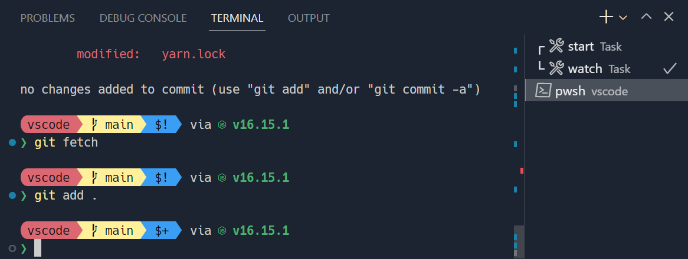
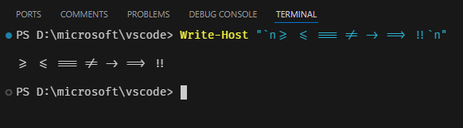

# 터미널 외관 {#terminal-appearance}

Visual Studio Code의 터미널 외관은 광범위하게 사용자 정의할 수 있습니다.



_[Sapphire](https://marketplace.visualstudio.com/items?itemName=tyriar.theme-sapphire) 테마와 사용자 정의 [Starship](https://starship.rs/) 프롬프트, [Nerd Font](https://www.nerdfonts.com/) 기호가 포함된 [Hack](https://sourcefoundry.org/hack/) 글꼴 사용_

## 텍스트 스타일 {#text-style}

터미널의 텍스트는 다음 설정을 통해 사용자 정의할 수 있습니다:

- `terminal.integrated.fontFamily`: 사용할 글꼴 패밀리, CSS의 fontFamily 형식을 따르는 문자열을 입력합니다. 예를 들어, `"'Fira Code', monospace"`는 `Fira Code`를 기본 글꼴로 설정하고 글리프가 부족할 때 `monospace`를 대체 글꼴로 설정합니다.
- `terminal.integrated.fontSize`: 터미널 텍스트의 글꼴 크기를 변경합니다.
- `terminal.integrated.letterSpacing`: 문자 간의 추가 가로 간격을 픽셀 단위로 설정합니다.
- `terminal.integrated.lineHeight`: 일반 줄 높이의 배수로 문자의 추가 세로 간격을 설정합니다. 예를 들어, `1.1`은 10%의 추가 세로 간격을 추가합니다.
- `terminal.integrated.fontWeight`: "일반" 텍스트의 글꼴 두께를 설정합니다.
- `terminal.integrated.fontWeightBold`: "굵은" 텍스트의 글꼴 두께를 설정합니다.

### Powerline 기호 및 Nerd Fonts {#powerline-symbols-and-nerd-fonts}

[Powerline](https://powerline.readthedocs.io) 글꼴은 터미널에서 사용할 수 있는 추가 문자가 포함된 특별한 패치 글꼴입니다. VS Code의 터미널은 [일부 Powerline 기호를 글꼴을 설정하지 않고도 렌더링](#custom-glyphs)하지만, 더 많은 글리프가 필요한 경우 글꼴 패밀리 설정을 통해 Powerline 글꼴을 설정할 수 있습니다. Powerline 글꼴은 일반적으로 `" for Powerline"`으로 끝납니다. 다음 설정은 패치된 DejaVu Sans Mono를 설정하는 예입니다:

```json
"editor.fontFamily": "'DejaVu Sans Mono for Powerline'"
```

Nerd Fonts도 동일하게 작동하며 일반적으로 `" NF"` 접미사를 가집니다. 다음은 Hack의 Nerd Fonts 변형을 설정하는 예입니다:

```json
"terminal.integrated.fontFamily": "'Hack NF'"
```

## 터미널 커서 {#terminal-cursor}

터미널 커서 스타일과 깜박임 여부는 다음 설정을 통해 사용자 정의할 수 있습니다:

- `terminal.integrated.cursorStyle`: 커서 모양을 정의하며, block, line 또는 underline이 될 수 있습니다.
- `terminal.integrated.cursorWidth`: 커서 스타일이 `line`으로 설정된 경우 커서의 너비를 픽셀 단위로 설정합니다.
- `terminal.integrated.cursorBlinking`: 터미널이 포커스될 때 커서가 깜박일지 여부를 설정합니다.
- `terminal.integrated.cursorStyleInactive`: 커서 모양을 정의하며, outline, block, line, underline 또는 none이 될 수 있습니다.

## 탭 사용자 정의 {#customizing-tabs}

터미널 탭은 기본적으로 두 개 이상의 터미널이 있을 때 터미널 보기의 오른쪽에 나타나며, 하나의 터미널만 있을 때는 보기 헤더에 활성 터미널을 표시합니다.


### 가시성 {#visibility}

기본 가시성은 가로 공간을 절약하도록 설계되었지만, 바람직하지 않을 수 있습니다. 탭이 표시되는 방식은 다음 설정을 통해 구성할 수 있습니다:

- `terminal.integrated.tabs.hideCondition`: 탭을 오른쪽에 숨길 조건을 설정하며, 항상 표시하려면 `"never"`로 설정합니다.
- `terminal.integrated.tabs.showActiveTerminal`: 터미널 보기 헤더에 활성 터미널을 표시할 때를 설정합니다.
- `terminal.integrated.tabs.showActions`: 보기 헤더에 활성 터미널의 작업을 표시할 때를 설정합니다.
- `terminal.integrated.tabs.location`: 터미널의 왼쪽 또는 오른쪽에 탭을 표시할지 여부를 설정합니다.
- `terminal.integrated.tabs.enabled`: 탭을 사용할지 여부를 설정하며, 비활성화하면 원래의 드롭다운 보기가 표시됩니다.

### 탭 텍스트 {#tab-text}

각 탭의 텍스트는 다음 설정에 의해 결정됩니다:

- `terminal.integrated.tabs.title`: 탭 제목.
- `terminal.integrated.tabs.description`: 제목 오른쪽에 나타나는 텍스트.
- `terminal.integrated.tabs.separator`: 제목과 설명 사이의 구분 문자.

기본적으로 제목은 셸의 감지된 프로세스 이름을 표시합니다.

다른 터미널은 종종 셸에서 보낸 이스케이프 시퀀스를 제목으로 표시하며, 이는 다음과 같이 구성할 수 있습니다:

```json
"terminal.integrated.tabs.title": "${sequence}"
```

### 아이콘 {#icons}

각 터미널에는 [터미널 프로필](/docs/terminal/profiles.md)에 의해 결정되는 관련 아이콘이 있습니다. 프로필에 정의되지 않은 경우 사용할 기본 아이콘과 색상은 `terminal.integrated.tabs.defaultIcon` 및 `terminal.integrated.tabs.defaultColor` 설정을 통해 구성할 수 있습니다.

### 상태 {#status}

터미널의 "상태"가 있는 경우, 탭 오른쪽에 아이콘으로 표시됩니다. 일부 상태는 애니메이션을 포함합니다. 이 애니메이션이 방해가 된다면 다음 설정을 통해 비활성화할 수 있습니다:

```json
"terminal.integrated.tabs.enableAnimation": false
```

### 시각적 벨 {#visual-bell}

터미널의 벨이 울리면 노란색 벨 아이콘이 잠시 표시됩니다. 이는 `terminal.integrated.enableBell` 설정을 통해 비활성화할 수 있으며, 지속 시간은 `terminal.integrated.bellDuration` 설정을 통해 구성할 수 있습니다.

## 터미널 색상 {#terminal-colors}

터미널은 실제 색상을 표시할 수 있지만, 프로그램은 일반적으로 8개의 ANSI 색상(검정, 빨강, 초록, 노랑, 파랑, 자홍, 청록 및 흰색)과 각 색상의 밝은 변형을 사용합니다. 이러한 ANSI 색상은 활성 [색상 테마](/docs/getstarted/themes.md)에 의해 결정되지만, [workbench.colorCustomizations](/docs/getstarted/themes.md#workbench-colors) 설정을 통해 테마와 독립적으로 구성할 수도 있습니다.

굵은 텍스트가 일반 ANSI 색상을 사용할지 밝은 변형을 사용할지는 `terminal.integrated.drawBoldTextInBrightColors` 설정을 통해 구성할 수 있습니다.

### 최소 대비 비율 {#minimum-contrast-ratio}

터미널은 어두운/밝은 테마, ANSI 색상 또는 실행 중인 셸/프로그램과의 충돌로 인해 종종 대비 문제가 발생합니다.

최소 대비 비율 기능은 텍스트의 전경색의 밝기를 증가시키거나 감소시켜 4.5:1 대비 비율을 충족시킴으로써 이 문제를 해결합니다.

이 기능의 단점 중 하나는 색상이 때때로 채도를 잃을 수 있다는 것입니다. 이 기능은 다음 설정을 통해 구성하거나 비활성화하여 원래 색상을 얻을 수 있습니다:

```json
"terminal.integrated.minimumContrastRatio": 1
```

## 합자 {#ligatures}

여러 문자를 하나로 렌더링할 수 있는 터미널 합자는 `terminal.integrated.fontLigatures` 설정을 통해 켤 수 있습니다. 이 기능은 구성된 `terminal.integrated.fontFamily`가 합자를 지원해야 합니다.



## GPU 가속 {#gpu-acceleration}

터미널은 각각 다른 장단점을 가진 두 가지 렌더러를 제공합니다:

- WebGL 렌더러 - 실제 GPU 가속.
- DOM 렌더러 - 호환성이 뛰어나지만 훨씬 느린 대체 렌더러.

WebGL 렌더러에 의해 구동되는 GPU 가속은 기본적으로 터미널에서 활성화되어 있습니다. 이는 CPU가 각 프레임을 렌더링하는 데 소요되는 시간을 크게 줄여 터미널이 더 빠르게 작동하고 높은 FPS로 표시되도록 도와줍니다.

기본 `terminal.integrated.gpuAcceleration` 값인 `"auto"`는 WebGL 렌더러를 시도하고 실패하면 DOM 렌더러로 대체합니다. Linux VM, WebGL을 지원하지 않는 브라우저 또는 오래된 드라이버가 있는 머신에서는 WebGL이 제대로 작동하지 않을 수 있습니다.

### 사용자 정의 글리프 {#custom-glyphs}

[GPU 가속](#gpu-acceleration)이 활성화되면 글꼴 대신 사용자 정의 렌더링이 터미널에서 일부 문자의 표시를 개선합니다. 여기에는 상자 그리기 문자(`U+2500-U+257F`), 블록 요소(`U+2580-U+259F`) 및 일부 Powerline 기호(`U+E0B0-U+E0BF`)가 포함됩니다. 이는 구성된 글꼴이 이러한 문자를 지원할 필요가 없으며, 문자가 픽셀 단위로 완벽하게 그려지고 전체 셀 크기로 확장된다는 것을 의미합니다.

아래는 사용자 정의 줄 높이와 문자 간격이 구성된 이러한 문자의 예입니다. 사용자 정의 글리프 덕분에 셀 사이에 간격이 없는 것을 확인할 수 있습니다:


이 기능은 `"terminal.integrated.customGlyphs": false`로 설정하여 비활성화할 수 있습니다.

## 프롬프트 사용자 정의 {#customizing-your-prompt}

대부분의 셸은 터미널 프롬프트의 광범위한 사용자 정의를 허용합니다. 이는 일반적으로 `$PS1` 변수를 수정하거나 `$PROMPT_COMMAND`를 설정하거나 플러그인을 설치하여 VS Code 외부에서 셸을 구성하여 수행됩니다.

[Starship](https://starship.rs/) 및 [oh-my-posh](https://ohmyposh.dev/)와 같은 일부 프롬프트는 git 상태와 같은 정보를 표시하며 대부분의 셸과 함께 작동하므로 처음 시작할 때 좋은 선택입니다.

## 자주 묻는 질문 {#common-questions}

### 터미널에 다채로운 삼각형이나 검은색 사각형이 표시되는 이유는 무엇인가요? {#why-is-my-terminal-showing-a-multi-colored-triangle-or-a-black-rectangle}

터미널은 일부 환경에서 GPU 가속 렌더링 문제를 겪을 수 있습니다. 예를 들어, 텍스트 대신 큰 다채로운 삼각형이 표시될 수 있습니다. 이는 일반적으로 드라이버/VM 그래픽 문제로 인해 발생하며 Chromium에서도 동일한 문제가 발생합니다. 이러한 문제를 해결하려면 `--disable-gpu` 플래그를 사용하여 `code`를 실행하거나 터미널에서 캔버스를 사용하지 않도록 설정 `"terminal.integrated.gpuAcceleration": "off"`을 사용하여 문제를 해결할 수 있습니다. 자세한 내용은 [GPU 가속](#gpu-acceleration) 섹션을 참조하세요.

### 터미널의 색상이 올바르지 않은 이유는 무엇인가요? {#why-are-the-colors-in-the-terminal-not-correct}

[최소 대비 비율 기능](#minimum-contrast-ratio)은 색상이 예상대로 표시되지 않게 할 수 있습니다. 다음 설정을 통해 비활성화할 수 있습니다:

```json
"terminal.integrated.minimumContrastRatio": 1
```

기본 설정 이유에 대한 배경은 [vscode#146406](https://github.com/microsoft/vscode/issues/146406#issuecomment-1084825473)에서 설명합니다.
