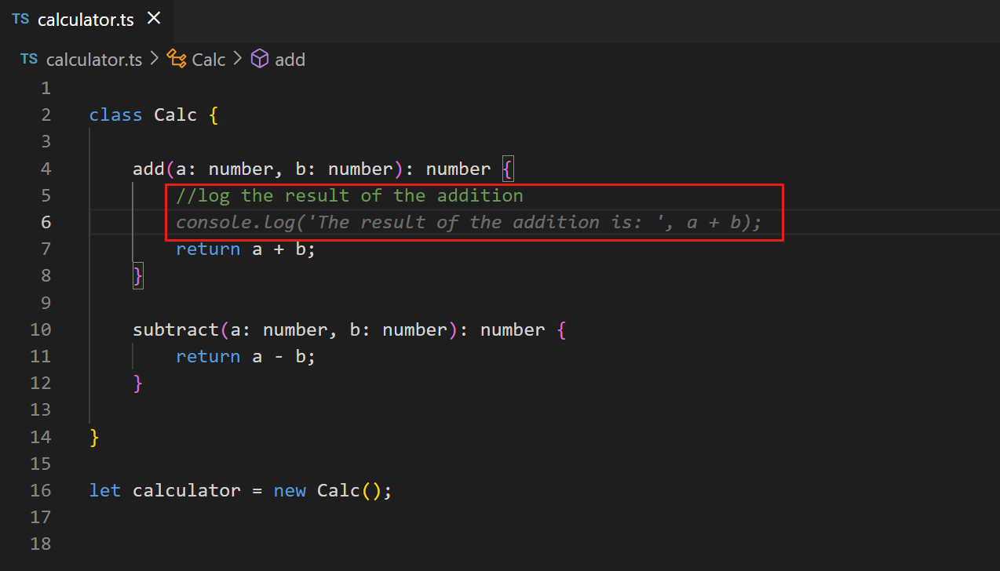
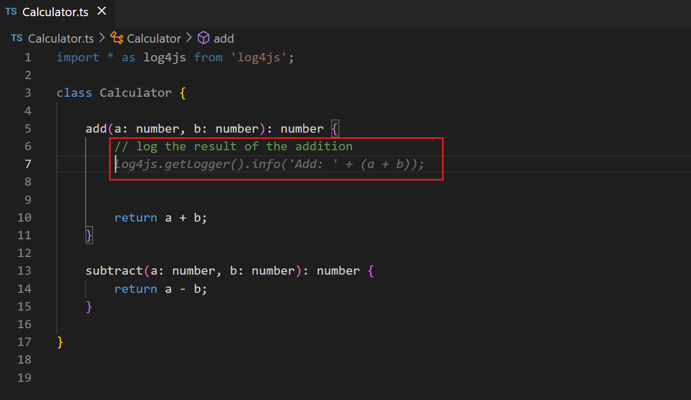
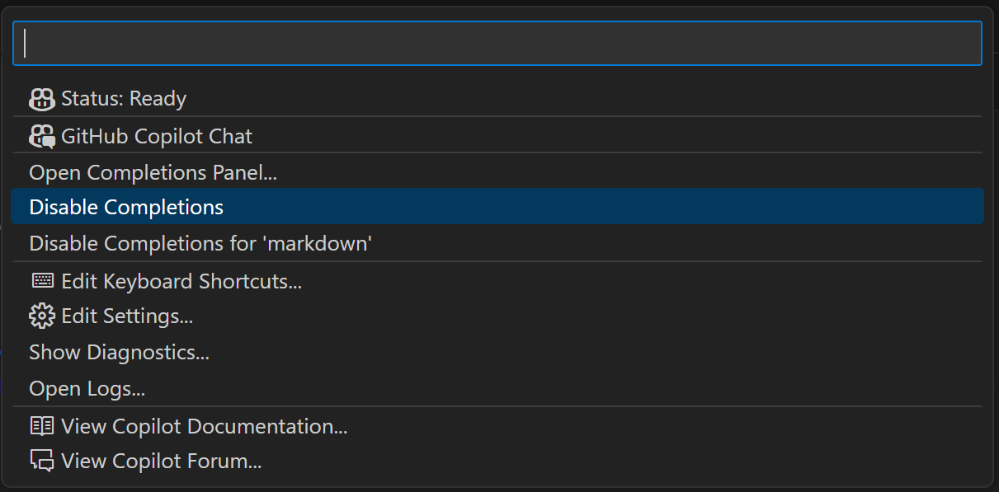
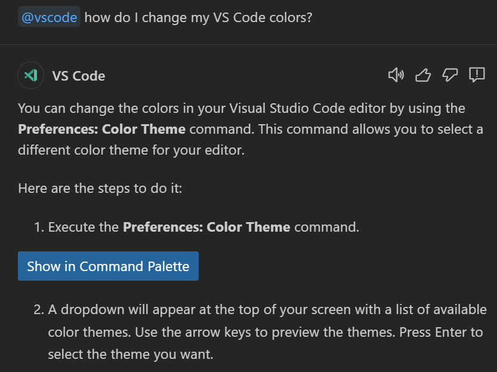
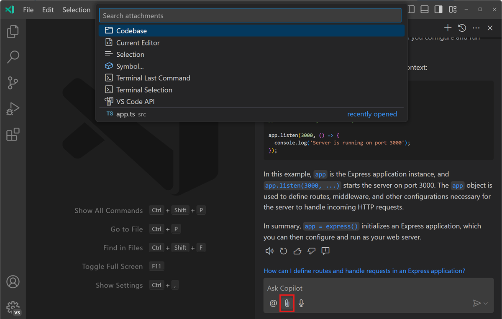
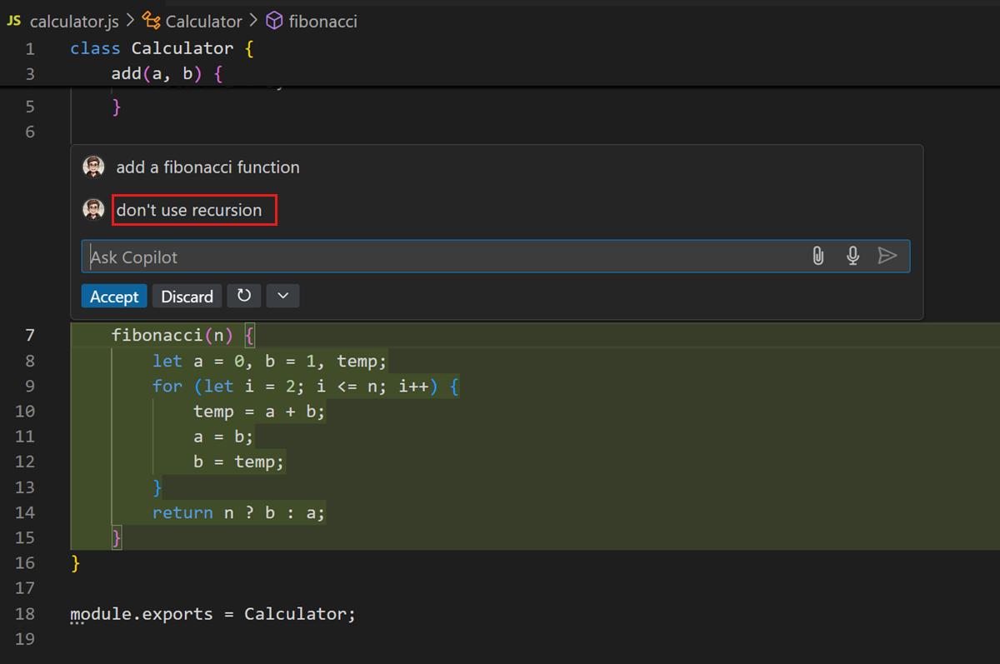

# VS Code에서 GitHub Copilot 사용을 위한 모범 사례 {#best-practices-for-using-github-copilot-in-vs-code}

이 문서는 프롬프트 작성과 GitHub Copilot에 적절한 컨텍스트를 제공하여 Visual Studio Code에서 GitHub Copilot을 사용하기 위한 모범 사례를 다룹니다.

:::note
"프롬프트 엔지니어링" 또는 "프롬프트 작성"은 AI를 논할 때 자주 듣게 되는 일반적인 문구로, 정보를 어떻게 패키징하고 AI API 엔드포인트로 보내는지를 의미합니다. Copilot 확장은 이 과정을 대신 처리하지만, 여러분은 확장을 안내하는 힌트를 제공하여 도울 수 있습니다.
:::

<iframe width="560" height="315" src="https://www.youtube-nocookie.com/embed/hh1nOX14TyY" title="GitHub Copilot을 통한 프롬프트 엔지니어링의 핵심 원칙" frameborder="0" allow="accelerometer; autoplay; clipboard-write; encrypted-media; gyroscope; picture-in-picture" allowfullscreen></iframe>

VS Code나 GitHub Copilot을 처음 사용하시는 분이라면, 먼저 [GitHub Copilot 개요](/docs/copilot/overview.md) 문서를 검토하거나 바로 [시작하기](/docs/copilot/getting-started.md) 튜토리얼로 들어가보시기 바랍니다.

인라인 제안과 채팅을 위한 Copilot 경험을 최적화하는 다양한 옵션이 있습니다:

- [인라인 제안 최대한 활용하기](#getting-the-most-out-of-copilot-inline-suggestions)
- [Copilot 채팅 최대한 활용하기](#getting-the-most-out-of-copilot-chat)

## Copilot 인라인 제안 최대한 활용하기 {#getting-the-most-out-of-copilot-inline-suggestions}

[GitHub Copilot](https://marketplace.visualstudio.com/items?itemName=GitHub.copilot) 확장은 더 효율적인 코딩을 돕기 위해 자동으로 [제안](/docs/copilot/overview.md#Code-completions-in-the-editor)을 제시합니다. 여러분이 Copilot에게 최상의 제안을 제공하도록 도울 수 있는 방법들이 있습니다("프롬프트"). 그리고 좋은 소식은 이러한 방법들이 여러분과 동료들이 코드를 이해하는 데 도움이 되기 때문에, 아마도 여러분이 이미 이러한 일을 하고 계실 것이라는 점입니다.

### Copilot에 컨텍스트 제공하기 {#provide-context-to-copilot}

Copilot은 여러분이 무엇을 하고 있고 무엇을 도와주길 원하는지 알 수 있는 충분한 컨텍스트가 있을 때 가장 잘 작동합니다. 특정 프로그래밍 작업에 대해 동료에게 도움을 요청할 때 컨텍스트를 제공하는 것처럼, Copilot에게도 같은 방식으로 할 수 있습니다.

#### 열린 파일들 {#open-files}

코드 완성을 위해 Copilot은 컨텍스트를 분석하고 적절한 제안을 생성하기 위해 현재 열려있는 편집기의 파일들을 살펴봅니다. Copilot을 사용하는 동안 VS Code에서 관련 파일들을 열어두는 것은 이러한 컨텍스트를 설정하는 데 도움이 되며 Copilot이 여러분의 프로젝트를 더 큰 그림으로 볼 수 있게 합니다.

#### 최상위 주석 {#top-level-comment}

동료에게 간단한 고수준의 소개를 하는 것처럼, 작업 중인 파일의 최상위 주석은 Copilot이 여러분이 만들고 있는 부분들의 전반적인 컨텍스트를 이해하는 데 도움이 될 수 있습니다.

<!-- 좋은 최상위 주석과 나쁜 최상위 주석의 예시 -->

#### 적절한 포함과 참조 {#appropriate-includes-and-references}

작업에 필요한 포함이나 모듈 참조를 수동으로 설정하는 것이 가장 좋습니다. Copilot이 제안할 수 있지만, 여러분이 필요한 의존성을 가장 잘 알고 있을 것입니다. 이는 또한 Copilot이 제안을 만들 때 여러분이 사용하고 싶은 프레임워크, 라이브러리 및 그들의 버전을 알 수 있게 도와줍니다.

다음 TypeScript 예제에서는 `add` 메서드의 출력을 로깅하고 싶습니다. 포함된 것이 없을 때, Copilot은 `console.log`를 사용하도록 제안합니다:

반면에, `Log4js`에 대한 참조를 추가하면 Copilot은 해당 프레임워크를 사용하여 출력을 로깅하도록 제안합니다:

#### 의미 있는 함수 이름 {#meaningful-function-names}

`fetchData()`라는 메서드는 동료에게도, 몇 달 뒤의 여러분에게도 큰 의미를 전달하지 못합니다. 마찬가지로 Copilot에게도 유용하지 않습니다. 의미 있는 함수 이름을 사용하면 Copilot이 여러분이 원하는 동작을 수행하는 본문을 작성하는 데 도움을 줄 수 있습니다.

<!-- 의미 있는 함수/메서드 이름의 예시 -->

#### 구체적이고 잘 정의된 함수 주석 {#specific-and-well-scoped-function-comments}

함수 이름은 지나치게 길어지지 않는 한 설명적일 수 있습니다. 함수 주석은 Copilot이 알아야 할 수 있는 세부 사항을 채우는 데 도움이 될 수 있습니다.

<!-- 의미 있는 함수/메서드 주석의 예시 -->

#### 샘플 코드로 Copilot 준비하기 {#prime-copilot-with-sample-code}

Copilot이 원하는 방향으로 작동하도록 하는 한 가지 방법은, 여러분이 찾는 것과 유사한 샘플 코드를 편집기에 복사해서 붙여넣는 것입니다. 간단한 예제를 제공하면 Copilot이 여러분이 사용하려는 언어와 작업에 맞는 제안을 생성하는 데 도움이 됩니다. Copilot이 원하는 코드와 실제로 사용할 수 있는 코드를 제공하기 시작하면, 그 샘플 코드를 파일에서 삭제하면 됩니다. 특히 Copilot이 기본적으로 오래된 코드 제안을 할 때, 새로운 라이브러리 버전으로 전환하는 데 이 방법이 유용할 수 있습니다.

### 일관성을 유지하고 품질 기준을 높게 유지하기 {#be-consistent-and-keep-the-quality-bar-high}

Copilot은 기존 패턴을 따르는 제안을 생성하기 위해 여러분의 코드를 참조할 것이므로, "쓰레기를 넣으면 쓰레기가 나온다(garbage in, garbage out)는 격언이 적용됩니다.

항상 높은 품질 기준을 유지하는 것은 꾸준한 노력이 필요합니다. 특히, 무언가를 빠르게 작동시키기 위해 대충 코딩하는 "해킹" 모드에서는 Copilot의 자동 완성 기능을 꺼두고 싶을 수 있습니다. Copilot 상태 메뉴에서 완성을 일시적으로 비활성화할 수 있습니다. Copilot 상태 표시줄 항목을 선택하여 Copilot 상태 메뉴 드롭다운을 불러오세요.

드롭다운에서 완성을 완전히 비활성화하거나, 예를 들어 Markdown 파일과 같은 활성 파일 유형에 대해서만 비활성화할 수 있습니다.

## Copilot 채팅 최대한 활용하기 {#getting-the-most-out-of-copilot-chat}

[GitHub Copilot Chat](https://marketplace.visualstudio.com/items?itemName=GitHub.copilot-chat) 확장을 설치하여 [채팅 인터페이스](/docs/copilot/overview.md#Answer-coding-questions)를 통해 Copilot의 도움을 받을 수도 있습니다.

GitHub Copilot과 채팅으로 상호작용할 때 경험을 최적화하기 위해 할 수 있는 여러 가지가 있습니다.

### 채팅 참가자와 슬래시 명령어 사용하기 {#use-chat-participants-and-slash-commands}

채팅 참가자는 코드베이스나 특정 도메인 또는 기술에 대한 추가 컨텍스트를 수집하도록 설계되었습니다. 적절한 참가자를 사용함으로써 Copilot 채팅은 Copilot 백엔드로 보낼 더 나은 정보를 찾고 제공할 수 있습니다. 예를 들어, 열린 프로젝트에 대해 질문하고 싶을 때는 `@workspace`를 사용하고, VS Code 기능과 API에 대해 더 알고 싶을 때는 `@vscode`를 사용하세요.

슬래시 명령어는 질문을 할 때 여러분의 **의도**를 Copilot 채팅이 이해하도록 돕습니다. 코드베이스에 대해 배우고 있나요(`/explain`), 문제 해결에 도움이 필요한가요(`/fix`), 또는 테스트 케이스를 만들고 있나요(`/tests`)? Copilot 채팅에게 여러분이 하려는 일을 알려줌으로써, 여러분의 작업에 맞게 응답을 조정하고 도움이 되는 명령어, 설정, 코드 스니펫을 제공할 수 있습니다.

자연어 쿼리로 프로젝트 범위나 현재 작업을 작성할 수도 있지만, 채팅 참가자와 슬래시 명령어를 사용하는 것이 더 간단하고 명확합니다.

Copilot 채팅의 [채팅 참가자](/docs/copilot/copilot-chat.md#chat-participants)와 [슬래시 명령어](/docs/copilot/copilot-chat.md#slash-commands)에 대해 자세히 알아보세요.

### 컨텍스트를 위한 채팅 변수 사용하기 {#use-chat-variables-for-context}

`@workspace` 또는 `@vscode`와 같은 채팅 참가자들은 도메인별 컨텍스트를 제공하는 채팅 변수를 제공할 수 있습니다. `#` 기호를 사용하여 채팅 프롬프트에서 채팅 변수를 참조할 수 있습니다. 채팅 변수를 사용함으로써, 채팅 프롬프트에 포함하는 컨텍스트에 대해 더 구체적으로 지정할 수 있습니다.

예를 들어, `#file` 변수를 사용하면 채팅 프롬프트에서 작업 공간의 특정 파일들을 참조할 수 있습니다. 이는 작업 중인 파일에 대한 컨텍스트를 제공함으로써 Copilot 채팅의 답변을 여러분의 코드와 더 관련성 있게 만드는 데 도움이 됩니다. "#file:package.json의 개선점을 제안해줄 수 있나요?" 또는 "#file:devcontainer.json에서 확장을 어떻게 추가하나요?"와 같은 질문을 할 수 있습니다. `#file` 변수를 사용함으로써, Copilot으로부터 더 타겟팅되고 정확한 응답을 얻을 수 있습니다.

채팅 화면의 **Attach Context** 버튼을 사용하여 채팅 메시지에 컨텍스트를 추가할 수도 있습니다. 그런 다음 빠른 선택에서 현재 선택 항목, 작업 공간의 하나 이상의 파일 또는 소스 코드의 하나 이상의 기호와 같은 특정 유형의 컨텍스트를 선택할 수 있습니다.

Copilot 채팅과 함께 [컨텍스트 변수 사용하기](/docs/copilot/copilot-chat.md#chat-context)에 대해 자세히 알아보세요.

### 구체적이고 단순하게 유지하기 {#be-specific-and-keep-it-simple}

Copilot에게 무언가를 요청할 때는 요청사항을 구체적으로 하고 큰 작업을 별도의 작은 작업으로 나누세요. 예를 들어, TypeScript와 Pug를 사용하고 MongoDB 데이터베이스에서 데이터를 검색하는 제품 페이지가 있는 Express 앱을 만들어달라고 Copilot에게 요청하지 마세요. 대신, 먼저 Copilot에게 TypeScript와 Pug로 Express 앱을 만들어달라고 요청하세요. 다음으로, 제품 페이지를 추가하고, 마지막으로 데이터베이스에서 고객 데이터를 검색하도록 요청하세요.

Copilot에게 특정 작업을 요청할 때는 사용하고 싶은 입력, 출력, API 또는 프레임워크에 대해 구체적으로 명시하세요. 프롬프트가 구체적일수록 결과가 더 좋을 것입니다. 예를 들어, "데이터베이스에서 제품 데이터 읽기" 대신 "카테고리별로 모든 제품을 읽고, JSON 형식으로 데이터를 반환하며, Mongoose 라이브러리 사용하기"와 같이 요청하세요.

### 해결책에 대해 반복하기 {#iterate-on-your-solution}

Copilot 채팅에 도움을 요청할 때 첫 번째 응답에 만족할 필요는 없습니다. 해결책을 개선하도록 Copilot에게 반복적으로 프롬프트를 줄 수 있습니다. Copilot은 생성된 코드의 컨텍스트와 현재 대화 내용을 모두 가지고 있습니다.

다음은 인라인 채팅을 사용하여 피보나치 수를 계산하는 함수를 만드는 예시입니다:

재귀를 사용하지 않는 해결책을 선호할 수도 있습니다:

Copilot에게 코딩 규칙을 따르거나 변수 이름을 개선하도록 요청할 수도 있습니다:

이미 결과를 수락했더라도 나중에 Copilot에게 코드에 대해 반복하도록 항상 요청할 수 있습니다.

## Copilot을 위한 프롬프트에 대한 더 많은 리소스 {#more-resources-about-prompting-for-copilot}

GitHub Copilot을 생산적으로 사용하는 방법에 대해 더 알고 싶다면, 다음 비디오와 블로그 게시물을 참조하세요:

- [GitHub Copilot을 위한 효과적인 프롬프트](https://www.youtube.com/watch?v=ImWfIDTxn7E)
- [GitHub Copilot을 최대한 활용하기 위한 실용적인 테크닉](https://www.youtube.com/watch?v=CwAzIpc4AnA)
- [VS Code에서 GitHub Copilot 프롬프트를 위한 모범 사례](https://www.linkedin.com/pulse/best-practices-prompting-github-copilot-vs-code-pamela-fox)
- [GitHub Copilot 사용 방법: 프롬프트, 팁, 사용 사례](https://github.blog/2023-06-20-how-to-write-better-prompts-for-github-copilot/)
