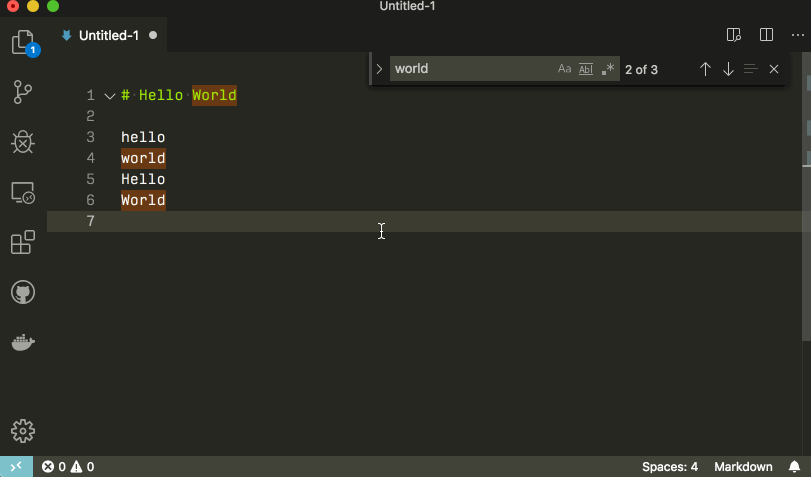
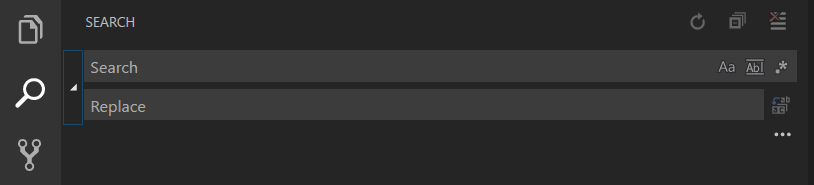
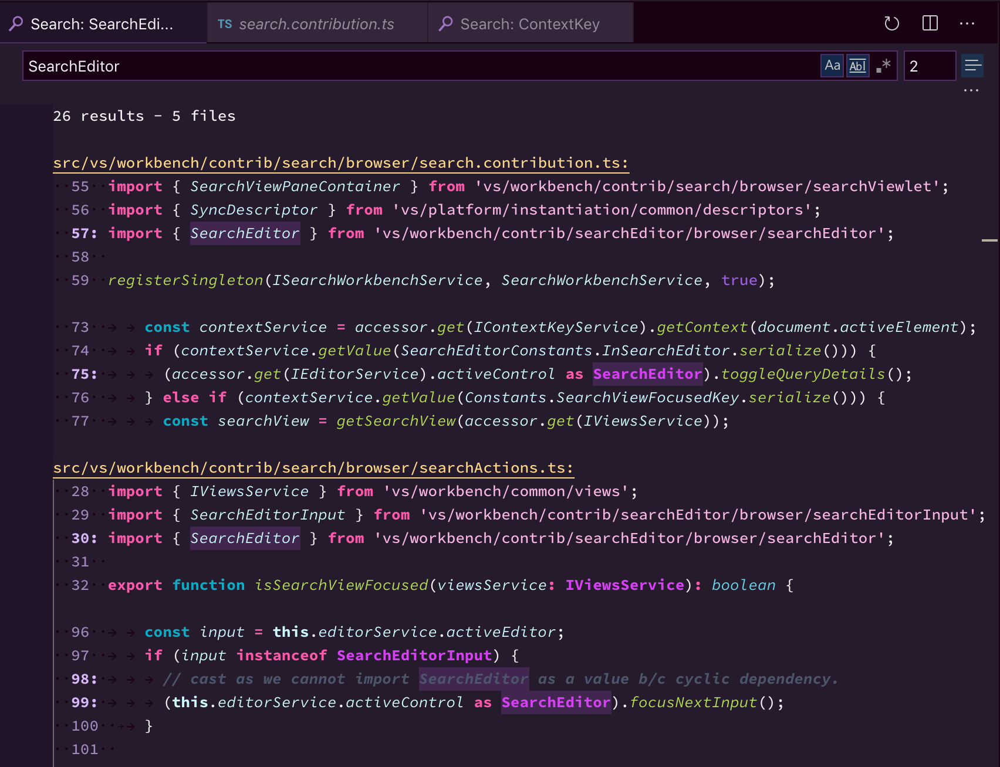
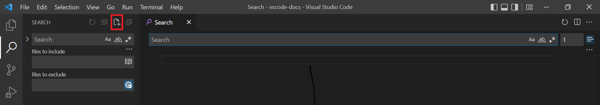

# 기본 편집 {#basic-editing}

Visual Studio Code는 기본적으로 에디터로서, 고도의 생산적인 소스 코드 편집을 위해 필요한 기능들을 포함하고 있습니다. 이번 챕터에서는 에디터의 기본 사항을 살펴보고 코드 작성을 시작하는 데 도움을 드립니다.

## 키보드 단축키 {#keyboard-shortcuts}

코드를 작성할 때 키보드에서 손을 떼지 않고 작업하는 것은 높은 생산성을 위해 매우 중요합니다. VS Code는 풍부한 기본 키보드 단축키를 제공하며 사용자가 이를 커스터마이즈할 수 있습니다.

- [키보드 단축키 참조](/docs/getstarted/keybindings.md#keyboard-shortcuts-reference) - 가장 일반적이고 인기 있는 키보드 단축키를 참조 시트를 다운로드하여 알아보세요.
- [키맵 확장 설치](/docs/getstarted/keybindings.md#keymap-extensions) - 키맵 확장을 설치하여 기존 에디터(Sublime Text, Atom, Vim 등)의 키보드 단축키를 VS Code에서 사용하세요.
- [키보드 단축키 사용자 정의](/docs/getstarted/keybindings.md#keyboard-shortcuts-editor) - 기본 키보드 단축키를 사용자의 스타일에 맞게 변경하세요.

## 다중 선택 (멀티 커서) {#multiple-selections-multi-cursor}

VS Code는 빠른 동시 편집을 위한 다중 커서를 지원합니다. `Alt+Click`으로 얇게 표시되는 보조 커서를 추가할 수 있습니다. 각 커서는 위치한 문맥에 따라 독립적으로 작동합니다. 커서를 더 추가하는 일반적인 방법은 `Ctrl+Alt+Down` 또는 `Ctrl+Alt+Up`를 사용하여 아래나 위에 커서를 삽입하는 것입니다.

> [!NOTE]
> 그래픽 카드 드라이버(예: NVIDIA)가 이러한 기본 단축키를 덮어쓸 수 있습니다.


`Ctrl+D`는 커서 위치의 단어나 현재 선택된 텍스트의 다음에 일치하는 항목을 선택합니다.


:::tip
`Ctrl+Shift+L`를 사용하여 현재 선택된 텍스트의 모든 일치하는 항목에 선택을 추가할 수도 있습니다.
:::

### 멀티 커서 수정자 {#multi-cursor-modifier}

macOS에서 `Cmd+Click`, Windows와 Linux에서 `Ctrl+Click`으로 다중 커서를 적용하는 수정자 키를 변경하고 싶다면, `editor.multiCursorModifier` [설정](/docs/getstarted/settings.md)을 통해 가능합니다. 이를 통해 Sublime Text나 Atom과 같은 다른 에디터에서 온 사용자들이 익숙한 키보드 수정자를 계속 사용할 수 있습니다.

이 설정은 다음과 같이 설정할 수 있습니다:

- `ctrlCmd` - Windows에서는 `Ctrl`에, macOS에서는 `Cmd`에 매핑됩니다.
- `alt` - 기존 기본값인 `Alt`.

또한 **Selection** > **Switch to Ctrl+Click for Multi-Cursor** 또는 **Selection** > **Switch to Alt+Click for Multi-Cursor** 메뉴 항목을 통해 이 설정을 빠르게 전환할 수 있습니다.

**Go to Definition**과 **Open Link** 동작도 이 설정을 준수하며 충돌하지 않도록 조정됩니다. 예를 들어, 설정이 `ctrlCmd`일 때는 `Ctrl/Cmd+Click`으로 다중 커서를 추가할 수 있고, `Alt+Click`으로 링크를 열거나 정의로 이동할 수 있습니다.

### 선택 영역 축소/확장 {#shrinkexpand-selection}

현재 선택 영역을 빠르게 축소하거나 확장할 수 있습니다. `Shift+Alt+Left`와 `Shift+Alt+Right`로 실행할 수 있습니다.

다음은 `Shift+Alt+Right`를 사용하여 선택 영역을 확장하는 예시입니다:


## 열(박스) 선택 {#column-box-selection}

한 모서리에 커서를 놓고 `Shift+Alt`를 누른 채로 반대쪽 모서리로 드래그하세요


> [!NOTE] > [멀티 커서 수정자](#multi-cursor-modifier)로 `Ctrl/Cmd`를 사용할 때는 `Shift+Ctrl/Cmd`로 변경됩니다.

macOS와 Windows에는 열 선택을 위한 기본 키 바인딩이 있지만, Linux에는 없습니다.

| 키               | 명령                  | 명령 ID                      |
| ---------------- | --------------------- | ---------------------------- |
| `Shift+Down`     | 열 선택 아래로        | `cursorColumnSelectDown`     |
| `Shift+Up`       | 열 선택 위로          | `cursorColumnSelectUp`       |
| `Shift+Left`     | 열 선택 왼쪽으로      | `cursorColumnSelectLeft`     |
| `Shift+Right`    | 열 선택 오른쪽으로    | `cursorColumnSelectRight`    |
| `Shift+PageDown` | 열 선택 페이지 아래로 | `cursorColumnSelectPageDown` |
| `Shift+PageUp`   | 열 선택 페이지 위로   | `cursorColumnSelectPageUp`   |

더 친숙한 것으로 바인딩하고 싶다면 `keybindings.json`을 [편집](/docs/getstarted/keybindings.md)할 수 있습니다.

### 열 선택 모드 {#column-selection-mode}

사용자 설정 **Editor: Column Selection**이 이 기능을 제어합니다. 이 모드가 활성화되면 상태 표시줄에 표시되며, 마우스 제스처와 화살표 키는 기본적으로 열 선택을 생성합니다. 이 전역 토글은 **Selection** > **Column Selection Mode** 메뉴 항목을 통해서도 접근할 수 있습니다. 또한 상태 표시줄에서 열 선택 모드를 비활성화할 수도 있습니다.

## 저장 / 자동 저장 {#save-auto-save}

기본적으로 VS Code는 변경 사항을 디스크에 저장하기 위해 명시적인 동작(`Ctrl+S`)이 필요합니다.

하지만 구성된 지연 시간 후나 에디터에서 포커스가 벗어날 때 변경 사항을 저장하는 `Auto Save`을 쉽게 켤 수 있습니다. 이 옵션을 켜면 파일을 명시적으로 저장할 필요가 없습니다. 지연 시간 후 `Auto Save`를 켜고 끄는 가장 쉬운 방법은 **File** > **Auto Save** 토글을 사용하는 것입니다.

`Auto Save`을 더 세밀하게 제어하려면 사용자 또는 작업 영역 [설정](/docs/getstarted/settings.md)을 열고 관련 설정을 찾으세요:

- `files.autoSave`: 다음 값을 가질 수 있습니다:
  - `off` - 자동 저장 비활성화
  - `afterDelay` - 구성된 지연 시간 후 파일 저장(기본값 1000 ms)
  - `onFocusChange` - 수정된 파일의 에디터에서 포커스가 벗어날 때 파일 저장
  - `onWindowChange` - VS Code 창에서 포커스가 벗어날 때 파일 저장
- `files.autoSaveDelay`: `files.autoSave`가 `afterDelay`로 구성되었을 때의 지연 시간(밀리초)을 설정합니다. 기본값은 1000 ms입니다.

특정 언어나 파일 유형에 대해 `Auto Save` 기능을 사용자 정의하려면, `settings.json` 파일에서 언어별 규칙을 추가할 수 있습니다.

예를 들어, LaTeX 파일에 대해 `Auto Save`을 비활성화하려면:

```json
    "[latex]": {
        "files.autoSave": "off",
    },
```

## 빠른 종료 {#hot-exit}

기본적으로 VS Code는 종료할 때 저장되지 않은 파일의 변경 사항을 기억합니다. 빠른 종료는 **File** > **Exit**(맥의 경우에는 **Code** > **Quit**)를 통해 애플리케이션을 종료하거나 마지막 창을 닫을 때 트리거됩니다.

`files.hotExit`을 다음 값으로 설정하여 빠른 종료를 구성할 수 있습니다:

- `off`: 빠른 종료 비활성화
- `onExit`: 애플리케이션이 종료될 때 빠른 종료가 트리거됩니다. 즉, Windows/Linux에서 마지막 창이 닫히거나 `workbench.action.quit` 명령이 트리거될 때(**Command Palette**, 키보드 단축키 또는 메뉴에서) 발생합니다. 폴더를 열지 않은 모든 창은 다음 실행 시 복원됩니다.
- `onExitAndWindowClose`: 애플리케이션이 종료될 때와 폴더가 열린 모든 창에 대해 빠른 종료가 트리거됩니다. 폴더를 열지 않은 모든 창은 다음 실행 시 복원됩니다. 종료 전 상태 그대로 폴더 창을 복원하려면 `window.restoreWindows`를 `all`로 설정하세요.

빠른 종료에 문제가 발생하면 모든 백업은 다음 표준 설치 위치에 저장됩니다:

- **Windows** `%APPDATA%\Code\Backups`
- **macOS** `$HOME/Library/Application Support/Code/Backups`
- **Linux** `$HOME/.config/Code/Backups`

## 찾기와 바꾸기 {#find-and-replace}

VS Code를 사용하면 현재 열린 파일에서 텍스트를 빠르게 찾고 바꿀 수 있습니다. `Ctrl+F`를 눌러 에디터에서 찾기 위젯을 열면, 검색 결과가 에디터, 개요 눈금자, 미니맵에 강조 표시됩니다.

현재 열린 파일에 일치하는 결과가 여러 개 있는 경우, 찾기 입력 상자에 포커스가 있을 때 `Enter`와 `Shift+Enter`를 사용하여 다음 또는 이전 결과로 이동할 수 있습니다.

기본적으로 VS Code는 작업 영역의 찾기 쿼리 기록을 저장하고 재시작할 때 복원합니다. `editor.find.history` 설정으로 이 동작을 구성할 수 있습니다. 값을 `never`로 설정하면 찾기 기록 저장이 비활성화됩니다.

### 선택된 텍스트로 검색 초기화 {#seed-search-string-from-selection}

찾기 위젯이 열리면, 에디터에서 선택된 텍스트가 자동으로 찾기 입력 상자에 채워집니다. 선택한 영역이 없으면 커서 아래의 단어가 대신 입력 상자에 삽입됩니다.


이 기능은 `editor.find.seedSearchStringFromSelection`을 `never`로 설정하여 끌 수 있습니다.

### 선택 영역 내 찾기 {#find-in-selection}

기본적으로 찾기 작업은 에디터의 전체 파일에서 실행됩니다. 선택한 텍스트에서도 실행할 수 있습니다. 찾기 위젯의 햄버거 아이콘을 클릭하여 이 기능을 켤 수 있습니다.



찾기 위젯의 기본 동작으로 설정하려면 `editor.find.autoFindInSelection`을 `always`로 설정하거나, 여러 줄의 내용이 선택되었을 때만 실행되도록 하려면 `multiline`으로 설정하세요.

### 고급 찾기와 바꾸기 옵션 {#advanced-find-and-replace-options}

일반 텍스트로 찾기와 바꾸기 외에도, 찾기 위젯에는 세 가지 고급 검색 옵션이 있습니다:

- 대/소문자 구분
- 전체 단어 일치
- 정규식

바꾸기 입력 상자는 대/소문자 보존을 지원하며, 대/소문자 보존(**AB**) 버튼을 클릭하여 켤 수 있습니다.

### 여러 줄 지원과 찾기 위젯 크기 조정 {#multiline-support-and-find-widget-resizing}

찾기 입력 상자와 바꾸기 입력 상자에 텍스트를 붙여넣어 여러 줄의 텍스트를 검색할 수 있습니다. `Ctrl+Enter`를 누르면 입력 상자에 새 줄이 삽입됩니다.


긴 텍스트를 검색할 때 찾기 위젯의 기본 크기가 너무 작을 수 있습니다. 왼쪽 경계를 드래그하여 찾기 위젯을 확장하거나 왼쪽 경계를 더블 클릭하여 최대화하거나 기본 크기로 축소할 수 있습니다.


## 파일 전체 검색 {#search-across-files}

VS Code에서는 현재 열린 폴더의 모든 파일을 빠르게 검색할 수 있습니다. `Ctrl+Shift+F`를 누르고 검색어를 입력하세요. 검색 결과는 검색어가 포함된 파일별로 그룹화되며, 각 파일에서의 발견 위치와 함께 표시됩니다. 파일을 확장하면 해당 파일 내의 모든 일치 항목의 미리보기를 볼 수 있습니다. 일치 항목 중 하나를 한 번 클릭하면 에디터에서 볼 수 있습니다.


:::tip
검색 상자에서 정규식 검색도 지원합니다.
:::

오른쪽의 검색 상자 아래에 있는 줄임표(**Toggle Search Details**)를 클릭하거나 `Ctrl+Shift+J`를 눌러 고급 검색 옵션을 구성할 수 있습니다. 이렇게 하면 검색을 구성하기 위한 추가 필드가 표시됩니다.

:::tip
현재 열린 폴더의 모든 파일에서 텍스트를 빠르게 찾기 위해 Quick Search를 사용할 수 있습니다. 명령 팔레트(`Ctrl+Shift+P`)를 열고 **Search: Quick Search** 명령을 입력하세요.
:::

### 고급 검색 옵션 {#advanced-search-options}


검색 상자 아래의 두 입력 상자에 검색에 포함하거나 제외할 패턴을 입력할 수 있습니다. `example`을 입력하면 작업 영역에서 `example`이라는 이름의 모든 폴더와 파일이 일치합니다. `./example`을 입력하면 작업 영역의 최상위 수준에 있는 `example/` 폴더가 일치합니다. `,`를 사용하여 여러 패턴을 구분하세요. 경로에는 전방 슬래시를 사용해야 합니다. [글로브 패턴](/docs/editor/glob-patterns.md) 구문도 사용할 수 있습니다. 예를 들면:

- `*`: 경로 세그먼트에서 0개 이상의 문자와 일치
- `?`: 경로 세그먼트에서 1개의 문자와 일치
- `**`: 없는 것을 포함하여 모든 수의 경로 세그먼트와 일치
- `{}`: 조건을 그룹화(예: `{**/*.html,**/*.txt}`는 모든 HTML과 텍스트 파일과 일치)
- `[]`: 일치할 문자 범위를 **선언**(예: `example.[0-9]`는 `example.0`, `example.1` 등과 일치)
- `[!...]`: 일치하지 않아야 할 문자 범위를 부정(예: `example.[!0-9]`는 `example.a`, `example.b`와는 일치하지만 `example.0`과는 일치하지 않음)

VS Code는 의미 없는 검색 결과의 수를 줄이기 위해 기본적으로 `node_modules`와 같은 일부 폴더를 제외합니다. `files.exclude`와 `search.exclude` 섹션 아래의 [설정](/docs/getstarted/settings.md)을 열어 이러한 규칙을 변경할 수 있습니다.

검색 보기의 글로브 패턴은 `files.exclude`와 `search.exclude`와 같은 설정에서와는 다르게 작동한다는 점에 주의하세요. 설정에서는 작업 영역 폴더의 하위 폴더 `folder1/example`에 있는 `example`이라는 이름의 폴더와 일치시키려면 `**/example`을 사용해야 합니다. 검색 보기에서는 `**` 접두사가 가정됩니다. 이러한 설정의 글로브 패턴은 항상 작업 영역 폴더의 경로를 기준으로 평가됩니다.

또한 **파일 제외** 상자의 **제외 설정 및 무시 파일 사용** 토글 버튼에 주의하세요. 이 토글은 `.gitignore` 파일에 의해 무시되는 파일 및/또는 `files.exclude`와 `search.exclude` 설정과 일치하는 파일을 제외할지 여부를 결정합니다.

:::tip
탐색기에서 폴더를 마우스 오른쪽 버튼으로 클릭하고 **폴더에서 찾기**를 선택하여 해당 폴더 내에서만 검색할 수 있습니다.
:::

### 검색 및 텍스트 교체 {#search-and-replace}

파일 전체에서 검색 및 텍스트 교체를 할 수도 있습니다. 검색 위젯을 확장하여 바꾸기 텍스트 상자를 표시하세요.



바꾸기 텍스트 상자에 텍스트를 입력하면 보류 중인 변경 사항의 차이점이 표시됩니다. 바꾸기 텍스트 상자에서 모든 파일에서 바꾸거나, 한 파일에서 모두 바꾸거나, 단일 변경을 바꿀 수 있습니다.


:::tip
`Down`와 `Up`를 사용하여 검색어 기록을 탐색함으로써 이전 검색어를 빠르게 재사용할 수 있습니다.
:::

### 정규식 바꾸기에서의 대소문자 변경 {#case-changing-in-regex-replace}

VS Code는 에디터에서 또는 전역적으로 검색과 바꾸기를 할 때 정규식 일치 그룹의 대소문자를 변경하는 것을 지원합니다. 이는 `\u\U\l\L` 수정자를 사용하여 수행되며, `\u`와 `\l`은 단일 문자를 대문자/소문자로 변경하고, `\U`와 `\L`은 일치하는 그룹의 나머지 부분을 대문자/소문자로 변경합니다.

예시:


수정자는 중첩될 수도 있습니다 - 예를 들어, `\u\u\u$1`은 그룹의 처음 세 문자를 대문자로 만들고, `\l\U$1`은 첫 문자는 소문자로, 나머지는 대문자로 만듭니다. 캡처 그룹은 바꾸기 문자열에서 `$n`으로 참조되며, 여기서 `n`은 캡처 그룹의 순서입니다.

## 검색 에디터 {#search-editor}

검색 에디터를 사용하면 작업 영역 검색 결과를 전체 크기의 에디터에서 볼 수 있으며, 구문 강조와 선택적으로 주변 문맥 줄을 포함할 수 있습니다.

아래는 문맥을 위해 전후 두 줄의 텍스트를 포함한 'SearchEditor' 단어에 대한 검색입니다:



**Open Search Editor** 명령은 이미 존재하는 검색 에디터가 있다면 그것을 열고, 그렇지 않으면 새로 생성합니다. **New Search Editor** 명령은 항상 새 검색 에디터를 생성합니다.

검색 에디터에서는 **정의로 이동** 작업을 사용하여 결과를 탐색할 수 있습니다. 예를 들어 `F12`로 현재 에디터 그룹에서 소스 위치를 열거나, `Ctrl+K F12`로 옆의 에디터에서 위치를 열 수 있습니다. 또한 `search.searchEditor.singleClickBehaviour`와 `search.searchEditor.doubleClickBehaviour` 설정을 통해 검색 결과를 한 번 또는 두 번 클릭할 때의 동작을 구성할 수 있습니다. 예를 들어, 정의 미리보기 창을 열거나 소스 위치를 열도록 설정할 수 있습니다.

검색 보기 상단의 **Open New Search Editor** 버튼을 사용할 수도 있으며, 결과 트리 상단의 **Open in editor** 링크나 **Search Editor: Open Results in Editor** 명령을 사용하여 기존 검색 결과를 검색 에디터로 복사할 수 있습니다.



위의 검색 에디터는 검색 보기 상단의 **Open New Search Editor** 버튼(세 번째 버튼)을 선택하여 열었습니다.

### 검색 에디터 명령과 인자 {#search-editor-commands-and-arguments}

- `search.action.openNewEditor` - 새 탭에서 검색 에디터를 엽니다.
- `search.action.openInEditor` - 현재 검색 결과를 새 검색 에디터로 복사합니다.
- `search.action.openNewEditorToSide` - 현재 열려있는 창 옆에 새 창으로 검색 에디터를 엽니다.

검색 에디터 명령(`search.action.openNewEditor`, `search.action.openNewEditorToSide`)에 전달할 수 있는 두 가지 인자가 있어 키 바인딩을 통해 새 검색 에디터가 어떻게 동작해야 하는지 구성할 수 있습니다:

- `triggerSearch` - 검색 에디터가 열릴 때 검색을 자동으로 실행할지 여부. 기본값은 true입니다.
- `focusResults` - 검색 결과에 포커스를 둘지 또는 쿼리 입력에 둘지 여부. 기본값은 true입니다.

예를 들어, 다음 키 바인딩은 검색 에디터가 열릴 때 검색을 실행하지만 포커스는 검색 쿼리 컨트롤에 유지합니다.

```json
{
  "key": "ctrl+o",
  "command": "search.action.openNewEditor",
  "args": { "query": "VS Code", "triggerSearch": true, "focusResults": false }
}
```

### 검색 에디터 컨텍스트 기본값 {#search-editor-context-default}

`search.searchEditor.defaultNumberOfContextLines` 설정의 기본값은 1이며, 이는 검색 에디터에서 각 결과 줄의 앞뒤로 하나의 컨텍스트 줄이 표시됨을 의미합니다.

### 마지막 검색 에디터 구성 재사용 {#reuse-last-search-editor-configuration}

`search.searchEditor.reusePriorSearchConfiguration` 설정(기본값은 `false`)을 통해 새 검색 에디터를 만들 때 마지막으로 활성화된 검색 에디터의 구성을 재사용할 수 있습니다.

## IntelliSense {#intellisense}

우리는 항상 단어 완성을 제공할 것이지만, JavaScript, JSON, HTML, CSS, SCSS, Less, C#, TypeScript와 같은 풍부한 [언어](/docs/languages/overview.md)에 대해서는 진정한 IntelliSense 경험을 제공합니다. 언어 서비스가 가능한 완성을 알고 있다면, 입력하는 동안 IntelliSense 제안이 나타날 것입니다. `editor.action.triggerSuggest`로 항상 수동으로 트리거할 수 있습니다. 기본적으로 `Tab` 또는 `Enter`가 수락 키보드 트리거이지만 이러한 [키 바인딩을 사용자 정의](/docs/getstarted/keybindings.md)할 수도 있습니다.

:::tip
제안 필터링은 CamelCase를 지원하므로, 메서드 이름에서 대문자인 글자들만 입력하여 제안을 제한할 수 있습니다. 예를 들어, "cra"를 입력하면 빠르게 "createApplication"이 나타납니다.
:::

:::tip
IntelliSense 제안은 `editor.quickSuggestions`와 `editor.suggestOnTriggerCharacters` [설정](/docs/getstarted/settings.md)을 통해 구성할 수 있습니다.
:::

JavaScript와 TypeScript 개발자는 [npmjs](https://www.npmjs.com) 타입 선언(typings) 파일 저장소를 활용하여 일반적인 JavaScript 라이브러리(Node.js, React, Angular)에 대한 IntelliSense를 얻을 수 있습니다. 타입 선언 파일 사용에 대한 좋은 설명은 [JavaScript 언어](/docs/languages/javascript.md#intellisense) 주제와 [Node.js](/docs/nodejs/nodejs-tutorial.md) 튜토리얼에서 찾을 수 있습니다.

[IntelliSense 문서](/docs/editor/intellisense.md)에서 자세히 알아보세요.

## 서식 지정 {#formatting}

VS Code는 소스 코드 서식 지정에 대한 훌륭한 지원을 제공합니다. 에디터에는 두 가지 명시적인 서식 지정 동작이 있습니다:

- **문서 서식 지정** (`Shift+Alt+F`) - 활성 파일 전체의 서식을 지정합니다.
- **선택 영역 서식 지정** (`Ctrl+K Ctrl+F`) - 선택된 텍스트의 서식을 지정합니다.

이러한 기능은 **Command Palette**(`Ctrl+Shift+P`) 또는 에디터 컨텍스트 메뉴에서 호출할 수 있습니다.

VS Code는 JavaScript, TypeScript, JSON, HTML, CSS에 대한 기본 포매터를 가지고 있습니다. 각 언어는 사용자 또는 작업 영역 [설정](/docs/getstarted/settings.md)에서 조정할 수 있는 특정 서식 지정 옵션(예: `html.format.indentInnerHtml`)을 가지고 있습니다. 동일한 언어에 대한 서식 지정을 제공하는 다른 확장 프로그램이 설치되어 있다면 기본 언어 포매터를 비활성화할 수도 있습니다.

```json
"html.format.enable": false
```

코드 서식 지정을 수동으로 호출하는 것 외에도, 입력, 저장 또는 붙여넣기와 같은 사용자 동작을 기반으로 서식 지정을 트리거할 수 있습니다. 이러한 기능들은 기본적으로 꺼져 있지만 다음 [설정](/docs/getstarted/settings.md)을 통해 활성화할 수 있습니다:

- `editor.formatOnType` - 입력 후 줄의 서식을 지정합니다.
- `editor.formatOnSave` - 저장 시 파일의 서식을 지정합니다.
- `editor.formatOnPaste` - 붙여넣은 내용의 서식을 지정합니다.

:::note
모든 포매터가 붙여넣기 시 서식 지정을 지원하는 것은 아닙니다. 이를 지원하려면 선택 영역이나 텍스트 범위의 서식을 지정할 수 있어야 합니다.
:::

기본 포매터 외에도, 다른 언어나 서식 지정 도구를 지원하는 확장 프로그램을 마켓플레이스에서 찾을 수 있습니다. `포매터` 카테고리가 있어 [서식 지정 확장 프로그램](https://marketplace.visualstudio.com/search?target=VSCode&category=Formatters&sortBy=Installs)을 쉽게 검색하고 찾을 수 있습니다. **확장** 보기 검색 상자에 'formatters' 또는 'category:formatters'를 입력하면 VS Code 내에서 필터링된 확장 프로그램 목록을 볼 수 있습니다.

## 폴딩 {#folding}

줄 번호와 줄 시작 사이의 거터에 있는 폴딩 아이콘을 사용하여 소스 코드 영역을 접을 수 있습니다. 마우스를 거터 위로 이동하고 클릭하여 영역을 접거나 펼 수 있습니다. 폴딩 아이콘에서 `Shift + Click`을 사용하면 해당 영역과 내부의 모든 영역을 접거나 펼 수 있습니다.


다음 작업들도 사용할 수 있습니다:

- 접기 (`Ctrl+Shift+[`) - 커서 위치의 가장 안쪽에 있는 펼쳐진 영역을 접습니다.
- 펼치기 (`Ctrl+Shift+]`) - 커서 위치의 접힌 영역을 펼칩니다.
- 접기 토글 (`Ctrl+K Ctrl+L`) - 커서 위치의 영역을 접거나 펼칩니다.
- 재귀적으로 접기 (`Ctrl+K Ctrl+[`) - 커서 위치의 가장 안쪽에 있는 펼쳐진 영역과 그 안의 모든 영역을 접습니다.
- 재귀적으로 펼치기 (`Ctrl+K Ctrl+]`) - 커서 위치의 영역과 그 안의 모든 영역을 펼칩니다.
- 모두 접기 (`Ctrl+K Ctrl+0`) - 에디터의 모든 영역을 접습니다.
- 모두 펼치기 (`Ctrl+K Ctrl+J`) - 에디터의 모든 영역을 펼칩니다.
- 레벨 X 접기 (`Ctrl+K Ctrl+2` - 레벨 2의 경우) - 현재 커서 위치의 영역을 제외한 레벨 X의 모든 영역을 접습니다.
- 모든 블록 주석 접기 (`Ctrl+K Ctrl+/`) - 블록 주석 토큰으로 시작하는 모든 영역을 접습니다.

폴딩 영역은 기본적으로 줄의 들여쓰기를 기준으로 평가됩니다. 한 줄이 하나 이상의 다음 줄보다 들여쓰기가 적을 때 폴딩 영역이 시작되고, 같거나 더 적은 들여쓰기를 가진 줄이 있을 때 끝납니다.

폴딩 영역은 에디터의 구성된 언어의 구문 토큰을 기반으로 계산될 수도 있습니다. 다음 언어들은 이미 구문 인식 폴딩을 제공합니다. Markdown, HTML, CSS, LESS, SCSS, JSON.

위의 언어들 중 하나(또는 모두)에 대해 들여쓰기 기반 폴딩으로 다시 전환하고 싶다면 다음을 사용하세요:

```json
  "[html]": {
    "editor.foldingStrategy": "indentation"
  },
```

영역은 각 언어에서 정의한 마커로도 정의될 수 있습니다. 현재 다음 언어들에 마커가 정의되어 있습니다:

| 언어                  | 시작 영역                          | 끝 영역                                |
| --------------------- | ---------------------------------- | -------------------------------------- |
| Bat                   | `::#region` 또는 `REM #region`     | `::#endregion` 또는 `REM #endregion`   |
| C#                    | `#region`                          | `#endregion`                           |
| C/C++                 | `#pragma region`                   | `#pragma endregion`                    |
| CSS/Less/SCSS         | `/*#region*/`                      | `/*#endregion*/`                       |
| Coffeescript          | `#region`                          | `#endregion`                           |
| F#                    | `//#region` 또는 `(#region)`       | `//#endregion` 또는 `(#endregion)`     |
| Java                  | `//#region` 또는 `//<editor-fold>` | `//#endregion` 또는 `//</editor-fold>` |
| Markdown              | `<!-- #region -->`                 | `<!-- #endregion -->`                  |
| Perl5                 | `#region` 또는 `=pod`              | `#endregion` 또는 `=cut`               |
| PHP                   | `#region`                          | `#endregion`                           |
| PowerShell            | `#region`                          | `#endregion`                           |
| Python                | `#region` 또는 `# region`          | `#endregion` 또는 `# endregion`        |
| TypeScript/JavaScript | `//#region`                        | `//#endregion`                         |
| Visual Basic          | `#Region`                          | `#End Region`                          |

마커로 정의된 영역만 접거나 펼치려면 다음을 사용하세요:

- 마커 영역 접기 (`Ctrl+K Ctrl+8`) - 모든 마커 영역을 접습니다.
- 마커 영역 펼치기 (`Ctrl+K Ctrl+9`) - 모든 마커 영역을 펼칩니다.

### 선택 영역 접기 {#fold-selection}

**선택 영역에서 수동 폴딩 범위 만들기** (`Ctrl+K Ctrl+,`) 명령은 현재 선택된 줄에서 폴딩 범위를 만들고 접습니다. 이 범위는 **수동** 폴딩 범위라고 하며 폴딩 제공자가 계산한 범위 위에 추가됩니다.

수동 폴딩 범위는 **수동 폴딩 범위 제거** (`Ctrl+K Ctrl+.`) 명령으로 제거할 수 있습니다.

수동 폴딩 범위는 폴딩을 위한 프로그래밍 언어 지원이 없는 경우에 특히 유용합니다.

## 들여쓰기 {#indentation}

VS Code를 사용하면 텍스트 들여쓰기를 제어할 수 있으며 공백이나 탭 중 어느 것을 사용할지 선택할 수 있습니다. 기본적으로 VS Code는 공백을 삽입하며 `Tab` 키당 4개의 공백을 사용합니다. 다른 기본값을 사용하고 싶다면 `editor.insertSpaces`와 `editor.tabSize` [설정](/docs/getstarted/settings.md)을 수정할 수 있습니다.

```json
    "editor.insertSpaces": true,
    "editor.tabSize": 4,
```

### 자동 감지 {#auto-detection}

VS Code는 열린 파일을 분석하여 문서에서 사용된 들여쓰기를 결정합니다. 자동 감지된 들여쓰기는 기본 들여쓰기 설정을 덮어씁니다. 감지된 설정은 상태 표시줄의 오른쪽에 표시됩니다:


상태 표시줄의 들여쓰기 표시를 클릭하면 들여쓰기 명령이 있는 드롭다운이 나타나며, 열린 파일의 기본 설정을 변경하거나 탭 정지와 공백 사이를 전환할 수 있습니다.


:::note
VS Code 자동 감지는 2, 4, 6 또는 8 공백의 들여쓰기를 확인합니다. 파일이 다른 수의 공백을 사용한다면 들여쓰기가 올바르게 감지되지 않을 수 있습니다. 예를 들어, 3 공백으로 들여쓰기하는 것이 규칙이라면 `editor.detectIndentation`을 끄고 탭 크기를 명시적으로 3으로 설정할 수 있습니다.
:::

```json
    "editor.detectIndentation": false,
    "editor.tabSize": 3,
```

## 파일 인코딩 지원 {#file-encoding-support}

**사용자 설정** 또는 **작업 영역 설정**에서 `files.encoding` 설정을 사용하여 전역적으로 또는 작업 영역별로 파일 인코딩을 설정할 수 있습니다.


상태 표시줄에서 파일 인코딩을 볼 수 있습니다.


상태 표시줄의 인코딩 버튼을 클릭하여 다른 인코딩으로 활성 파일을 다시 열거나 저장할 수 있습니다.


그런 다음 인코딩을 선택하세요.


## 덮어쓰기 모드 {#overtype-mode}

VS Code는 _덮어쓰기_ 모드를 지원하며, 이를 통해 커서 위치에 문자를 삽입하는 대신 기존 문자를 덮어쓸 수 있습니다. 기본적으로 덮어쓰기 모드는 꺼져 있습니다.

삽입과 덮어쓰기 모드를 전환하려면 명령 팔레트에서 **덮어쓰기/삽입 모드 전환** 명령을 실행하거나 (`Insert`)를 누르세요. 덮어쓰기 모드일 때는 상태 표시줄에 `OVR` 표시가 나타납니다.

`editor.overtypeCursorStyle` 설정을 구성하여 덮어쓰기 모드의 커서 스타일을 변경할 수 있습니다.

`editor.overtypeOnPaste` 설정을 사용하면 텍스트를 붙여넣을 때 덮어쓰기를 사용할 수 있습니다. 이 설정이 적용되려면 덮어쓰기 모드여야 합니다.

## 파일 비교 {#compare-files}

VS Code는 현재 파일의 내용 또는 임의의 두 파일의 내용을 비교하는 여러 가지 방법을 지원합니다.

에디터에서 활성 파일이 열려 있을 때, 다음과 같은 비교 옵션이 있습니다:

- **작업 영역 파일과 비교**: 명령 팔레트에서 **Compare Active File With....** 를 선택한 다음, 비교할 다른 파일을 선택합니다.
- **클립보드와 비교**: 명령 팔레트에서 **File: Compare Active File with Clipboard** (`Ctrl+K C`)를 선택하여 현재 파일을 클립보드 내용과 비교합니다.
- **저장된 버전과 비교**: 명령 팔레트에서 **File: Compare Active File with Saved** (`Ctrl+K D`)를 선택하여 현재 파일을 마지막으로 저장된 버전과 비교합니다.

임의의 두 파일을 비교하려면:

- 탐색기 보기에서 파일을 마우스 오른쪽 버튼으로 클릭하고 **Select for Compare**을 선택합니다. 그런 다음, 두 번째 파일을 마우스 오른쪽 버튼으로 클릭하고 **Compare with Selected**를 선택합니다.
- 두 개의 빈 에디터 창 사이의 비교를 시작하려면 명령 팔레트에서 **File: Compare New Untitled Text Files**를 선택합니다.

:::tip
`--diff` 옵션을 사용하여 명령줄에서 VS Code를 시작하여 두 파일을 비교할 수 있습니다. [VS Code 명령줄 인터페이스](/docs/editor/command-line.md#core-cli-options)에 대해 자세히 알아보세요.
:::

## 다음 단계 {#next-steps}

기본 사용자 인터페이스를 다루었습니다. VS Code에는 더 많은 기능이 있습니다. 계속해서 다음 내용을 읽어보세요:

- [소개 비디오 - 설정과 기본 사항](/docs/introvideos/basics.md) - VS Code의 기본 사항에 대한 튜토리얼을 시청하세요.
- [사용자/작업 영역 설정](/docs/getstarted/settings.md) - 사용자 및 작업 영역 설정을 통해 VS Code를 사용자의 선호도에 맞게 구성하는 방법을 알아보세요.
- [코드 탐색](/docs/editor/editingevolved.md) - 정의 미리보기와 정의로 이동 등을 알아보세요.
- [통합 터미널](/docs/terminal/basics.md) - VS Code 내에서 명령줄 작업을 빠르게 수행하기 위한 통합 터미널에 대해 알아보세요.
- [IntelliSense](/docs/editor/intellisense.md) - VS Code는 스마트 코드 완성을 제공합니다.
- [디버깅](/docs/editor/debugging.md) - VS Code가 진정한 빛을 발하는 곳입니다.

네, 마지막 부분을 번역하겠습니다.

## 자주 묻는 질문 {#common-questions}

### 전역 검색과 바꾸기가 가능한가요? {#is-it-possible-to-globally-search-and-replace}

네, 검색 보기 텍스트 상자를 확장하면 바꾸기 텍스트 필드가 포함됩니다. 작업 영역의 모든 파일에서 검색하고 바꿀 수 있습니다. VS Code를 폴더에서 열지 않은 경우 검색은 현재 열린 파일에서만 실행된다는 점에 유의하세요.


### 자동 줄 바꿈을 어떻게 켜나요? {#how-do-i-turn-on-word-wrap}

`editor.wordWrap` [설정](/docs/getstarted/settings.md)을 통해 자동 줄 바꿈을 제어할 수 있습니다. 기본적으로 `editor.wordWrap`은 `off`이지만 `on`으로 설정하면 텍스트가 에디터의 뷰포트 너비에서 줄 바꿈됩니다.

```json
    "editor.wordWrap": "on"
```

`Alt+Z`으로 VS Code 세션에서 자동 줄 바꿈을 토글할 수 있습니다.

`editor.rulers` 설정을 사용하여 수직 열 눈금자를 에디터에 추가할 수도 있습니다. 이 설정은 수직 눈금자를 표시하고 싶은 열 문자 위치의 배열을 받습니다.

다른 에디터에서처럼 **Cut**와 **Copy** 같은 명령은 전체 줄 바꿈된 줄에 적용됩니다. 세 번 클릭하면 전체 줄 바꿈된 줄을 선택합니다. `Home`을 두 번 누르면 커서가 줄의 맨 처음으로 이동합니다. `End`를 두 번 누르면 커서가 줄의 맨 끝으로 이동합니다.

### 줄 바꿈된 줄에 불필요한 커서가 생기는 것을 어떻게 방지할 수 있나요? {#how-can-i-avoid-placing-extra-cursors-in-word-wrapped-lines}

현재 선택 영역 위나 아래에 커서를 추가할 때 줄 바꿈을 무시하고 싶다면, 키 바인딩의 `args`에 `{ "logicalLine": true }`를 다음과 같이 전달할 수 있습니다:

```json
{
  "key": "shift+alt+down",
  "command": "editor.action.insertCursorBelow",
  "when": "textInputFocus",
  "args": { "logicalLine": true },
},
{
  "key": "shift+alt+up",
  "command": "editor.action.insertCursorAbove",
  "when": "textInputFocus",
  "args": { "logicalLine": true },
},
```
