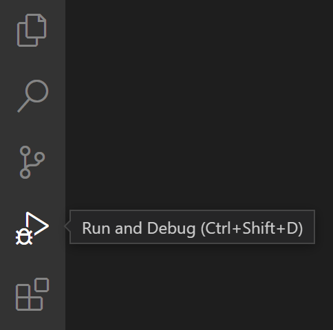
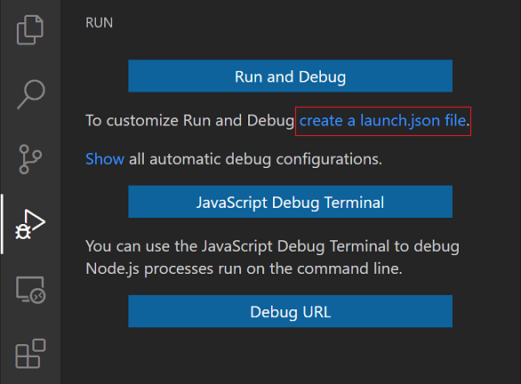
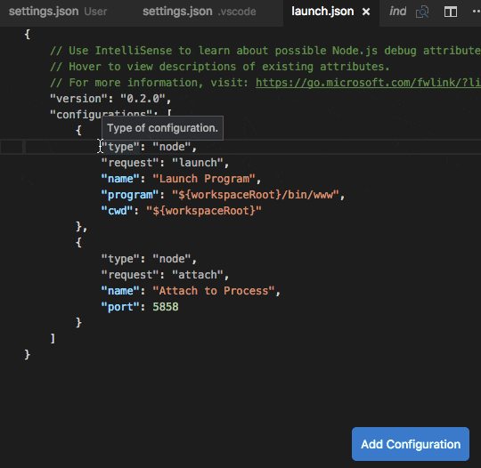
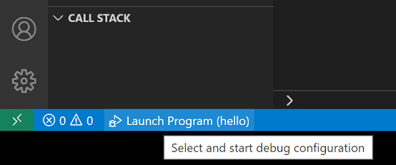
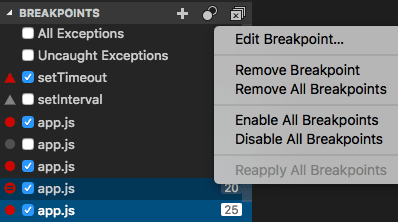
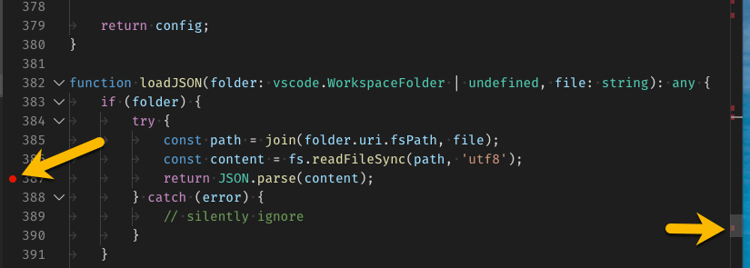
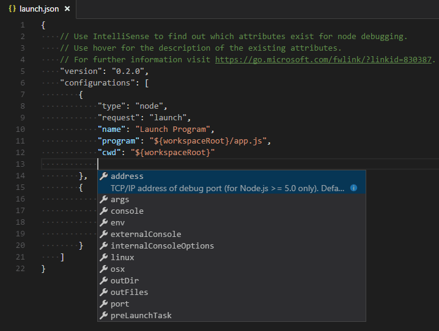
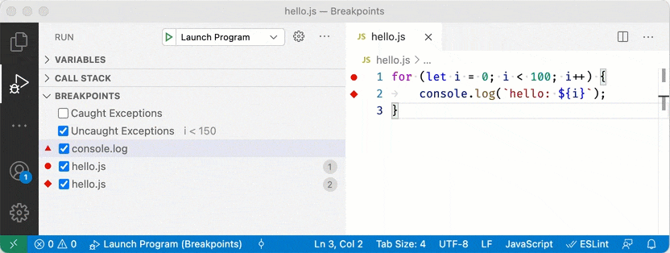

# 디버깅 {#debugging}

Visual Studio Code의 주요 기능 중 하나는 훌륭한 디버깅 지원입니다. VS Code의 내장 디버거는 편집, 컴파일 및 디버그 루프를 가속화합니다.

<iframe width="560" height="315" src="https://www.youtube-nocookie.com/embed/3HiLLByBWkg" title="VS Code에서 디버깅 시작하기" frameborder="0" allow="accelerometer; autoplay; clipboard-write; encrypted-media; gyroscope; picture-in-picture" allowfullscreen></iframe>

## 사용자 인터페이스 {#user-interface}

다음 다이어그램은 디버깅 사용자 인터페이스의 주요 환경 설정 요소를 보여줍니다:


1. **Run and Debug 화면**: 실행, 디버깅 및 디버그 환경 설정 설정 관리를 위한 모든 정보를 표시합니다.
1. **Debug 도구 모음**: 가장 일반적인 디버깅 작업을 위한 버튼이 있습니다.
1. **Debug 콘솔**: 디버거에서 실행 중인 코드의 출력을 보고 상호작용할 수 있습니다.
1. **Debug 사이드바**: 디버그 세션 중에 호출 스택, 중단점, 변수 및 감시 변수를 상호작용할 수 있습니다.

## 디버거 확장 {#debugger-extensions}

VS Code는 [Node.js](https://nodejs.org/) 런타임에 대한 내장 디버깅 지원을 제공하며 JavaScript, TypeScript 또는 JavaScript로 변환되는 다른 언어를 디버깅할 수 있습니다.

다른 언어 및 런타임([PHP](https://marketplace.visualstudio.com/items?itemName=xdebug.php-debug), [Ruby](https://marketplace.visualstudio.com/items?itemName=rebornix.Ruby), [Go](https://marketplace.visualstudio.com/items?itemName=golang.go), [C#](https://marketplace.visualstudio.com/items?itemName=ms-dotnettools.csharp), [Python](https://marketplace.visualstudio.com/items?itemName=ms-python.python), [C++](https://marketplace.visualstudio.com/items?itemName=ms-vscode.cpptools), [PowerShell](https://marketplace.visualstudio.com/items?itemName=ms-vscode.PowerShell) 등)을 디버깅하려면 VS Code [마켓플레이스](https://marketplace.visualstudio.com/vscode/Debuggers)에서 `Debugger` [확장](/docs/editor/extension-marketplace.md)을 찾거나 상단의 실행 메뉴에서 **Install Additional Debuggers**를 선택하세요.

아래는 디버깅 지원을 포함하는 몇 가지 인기 있는 확장입니다:

<div class="marketplace-extensions-debuggers"></div>

:::tip
위에 표시된 확장은 동적으로 쿼리됩니다. 위의 확장 타일을 선택하여 설명과 리뷰를 읽고 어떤 확장이 가장 적합한지 결정하세요.
:::

## 디버깅 시작 {#start-debugging}

다음 문서는 내장된 [Node.js](https://nodejs.org/) 디버거를 기반으로 하지만 대부분의 개념과 기능은 다른 디버거에도 적용됩니다.

디버깅에 대해 읽기 전에 샘플 Node.js 애플리케이션을 먼저 만드는 것이 도움이 됩니다. [Node.js 단계별 설명](/docs/nodejs/nodejs-tutorial.md)을 따라 Node.js를 설치하고 간단한 "Hello World" JavaScript 애플리케이션(`app.js`)을 만드세요. 간단한 애플리케이션을 설정한 후 이 페이지는 VS Code 디버깅 기능을 안내합니다.

## 실행 및 디버그 보기 {#run-and-debug-view}

**Run and Debug** 보기를 열려면 VS Code의 **Activity Bar**에서 **Run and Debug** 아이콘을 선택하세요. 키보드 단축키 `Ctrl+Shift+D`를 사용할 수도 있습니다.



**Run and Debug** 보기에는 실행 및 디버깅과 관련된 모든 정보가 표시되며 상단에는 디버깅 명령 및 환경 설정 설정이 있습니다.

실행 및 디버깅이 아직 환경 설정되지 않은 경우(`launch.json`이 생성되지 않은 경우), VS Code는 실행 시작 보기를 표시합니다.


## 실행 메뉴 {#run-menu}

상단의 **Run** 메뉴에는 가장 일반적인 실행 및 디버그 명령이 있습니다:


## Launch 환경 설정 {#launch-configurations}

VS Code에서 간단한 앱을 실행하거나 디버깅하려면 디버그 시작 보기에서 **Run and Debug**를 선택하거나 `F5`를 누르면 VS Code가 현재 활성 파일을 실행하려고 시도합니다.

그러나 대부분의 디버깅 시나리오에서는 디버깅 설정 세부 정보를 환경 설정하고 저장할 수 있는 실행 환경 설정 파일을 만드는 것이 유익합니다. VS Code는 워크스페이스(프로젝트 루트 폴더) 또는 [사용자 설정](/docs/editor/debugging.md#global-launch-configuration) 또는 [워크스페이스 설정](/docs/editor/multi-root-workspaces.md#workspace-launch-configurations)에 있는 `.vscode` 폴더에 `launch.json` 파일에 디버깅 환경 설정 정보를 저장합니다.

`launch.json` 파일을 만들려면 실행 시작 보기에서 **create a launch.json file**을 선택하세요.



VS Code는 디버그 환경을 자동으로 감지하려고 시도하지만 실패하면 수동으로 선택해야 합니다:


다음은 Node.js 디버깅을 위해 생성된 Launch 환경 설정입니다:

```json
{
  "version": "0.2.0",
  "configurations": [
    {
      "type": "node",
      "request": "launch",
      "name": "Launch Program",
      "skipFiles": ["<node_internals>/**"],
      "program": "${workspaceFolder}\\app.js"
    }
  ]
}
```

파일 탐색기 보기로 돌아가면(`Ctrl+Shift+E`), VS Code가 `.vscode` 폴더를 생성하고 워크스페이스에 `launch.json` 파일을 추가한 것을 볼 수 있습니다.


:::note
VS Code에서 폴더를 열지 않고도 간단한 애플리케이션을 디버깅할 수 있지만, Launch 환경 설정을 관리하고 고급 디버깅을 설정할 수는 없습니다. 폴더를 열지 않은 경우 VS Code 상태 표시줄은 보라색입니다.
:::

Launch 환경 설정에서 사용할 수 있는 속성은 디버거마다 다릅니다. 특정 디버거에 대한 속성을 찾으려면 IntelliSense 제안(`Ctrl+Space`)을 사용하세요. 모든 속성에 대해 호버 도움말도 사용할 수 있습니다.

한 디버거에서 사용할 수 있는 속성이 다른 디버거에서도 자동으로 작동한다고 가정하지 마세요. Launch 환경 설정에 빨간 물결선이 표시되면 문제를 확인하고 디버그 세션을 시작하기 전에 수정하세요.


자동으로 생성된 모든 값을 검토하고 프로젝트 및 디버깅 환경에 적합한지 확인하세요.

### Launch 대 Attach 환경 설정 {#launch-versus-attach-configurations}

VS Code에는 두 가지 핵심 디버깅 모드, **Run** 및 **Attach**이 있으며, 이는 두 가지 다른 워크플로우와 개발자 세그먼트를 처리합니다. 워크플로우에 따라 어떤 유형의 환경 설정이 프로젝트에 적합한지 혼란스러울 수 있습니다.

브라우저 개발자 도구 배경에서 오신 경우, 브라우저 인스턴스가 이미 열려 있기 때문에 "도구에서 실행"하는 것에 익숙하지 않을 수 있습니다. DevTools를 열면 단순히 DevTools를 열린 브라우저 탭에 **Attach**하는 것입니다. 반면, 서버 또는 데스크탑 배경에서 오신 경우, 편집기가 프로세스를 **Run**하고 편집기가 새로 실행된 프로세스에 디버거를 자동으로 연결하는 것이 매우 일반적입니다.

**Run** 환경 설정과 **Attach** 환경 설정의 차이를 설명하는 가장 좋은 방법은 **Run** 환경 설정을 VS Code가 연결하기 전에 디버그 모드에서 앱을 시작하는 방법에 대한 레시피로 생각하는 것이고, **Attach** 환경 설정은 VS Code의 디버거를 이미 실행 중인 앱 또는 프로세스에 연결하는 방법에 대한 레시피로 생각하는 것입니다.

VS Code 디버거는 일반적으로 디버그 모드에서 프로그램을 실행하거나 디버그 모드에서 이미 실행 중인 프로그램에 연결하는 것을 지원합니다. 요청(`attach` 또는 `launch`)에 따라 다른 속성이 필요하며, VS Code의 `launch.json` 유효성 검사 및 제안이 도움이 될 것입니다.

### 새 환경 설정 추가 {#add-a-new-configuration}

기존 `launch.json`에 새 환경 설정을 추가하려면 다음 기술 중 하나를 사용하세요:

- 환경 설정 배열 내에 커서가 있는 경우 IntelliSense를 사용하세요.
- **Add Configuration** 버튼을 눌러 배열 시작 부분에서 스니펫 IntelliSense를 호출하세요.
- Launch 메뉴에서 **Add Configuration** 옵션을 선택하세요.



VS Code는 여러 환경 설정을 동시에 시작하기 위한 복합 Launch 환경 설정도 지원합니다. 자세한 내용은 이 [섹션](#compound-launch-configurations)을 읽으세요.

디버그 세션을 시작하려면 먼저 **Run and Debug** 보기의 **Configuration dropdown**에서 **Launch Program**이라는 환경 설정을 선택하세요. Launch 환경 설정을 설정한 후 `F5`로 디버그 세션을 시작하세요.

또는 **명령 팔레트**(`Ctrl+Shift+P`)를 통해 **Debug: Select and Start Debugging**을 필터링하거나 `'debug '`를 입력하고 디버깅하려는 환경 설정을 선택하여 환경 설정을 실행할 수 있습니다.

디버깅 세션이 시작되면 **Debug 콘솔** 패널이 표시되고 디버깅 출력이 표시되며 상태 표시줄의 색상이 변경됩니다(기본 색상 테마의 경우 주황색):


또한, 상태 표시줄에 활성 디버그 환경 설정을 표시하는 **Debug 상태**가 나타납니다. 디버그 상태를 선택하면 **Run and Debug** 보기를 열지 않고도 활성 Launch 환경 설정을 변경하고 디버깅을 시작할 수 있습니다.



## 디버그 작업 {#debug-actions}

디버그 세션이 시작되면 창 상단에 **Debug 도구 모음**이 나타납니다.


| 작업                         | 설명                                                                                                                                             |
| ---------------------------- | ------------------------------------------------------------------------------------------------------------------------------------------------ |
| 계속 / 일시 중지 `F5`        | **계속**: 정상적인 프로그램/스크립트 실행을 재개합니다(다음 중단점까지). <br /> **일시 중지**: 현재 줄에서 코드를 검사하고 한 줄씩 디버깅합니다. |
| 한 단계씩 실행 `F10`         | 다음 메서드를 단일 명령으로 실행하여 환경 설정 요소 단계를 검사하거나 따르지 않습니다.                                                           |
| 한 단계씩 들어가기 `F11`     | 다음 메서드에 들어가서 한 줄씩 실행을 따릅니다.                                                                                                  |
| 한 단계씩 나가기 `Shift+F11` | 메서드나 서브루틴 내부에 있을 때, 현재 메서드의 남은 줄을 단일 명령으로 완료하여 이전 실행 컨텍스트로 돌아갑니다.                                |
| 다시 시작 `Ctrl+Shift+F5`    | 현재 프로그램 실행을 종료하고 현재 실행 환경 설정을 사용하여 디버깅을 다시 시작합니다.                                                           |
| 중지 `Shift+F5`              | 현재 프로그램 실행을 종료합니다.                                                                                                                 |

:::tip
설정 `debug.toolBarLocation`을 사용하여 디버그 도구 모음의 위치를 제어할 수 있습니다. 기본값 `floating`, **Run and Debug** 보기에 `고정`, 또는 `숨김`으로 설정할 수 있습니다. `floating` 디버그 도구 모음은 수평으로 드래그할 수 있으며 편집기 영역 아래로도 드래그할 수 있습니다(상단 가장자리에서 일정 거리까지).
:::

### 실행 모드 {#run-mode}

프로그램을 디버깅하는 것 외에도 VS Code는 프로그램 **Run**을 지원합니다. **Debug: Start Without Debugging** 작업은 `Ctrl+F5`으로 트리거되며 현재 선택된 실행 환경 설정을 사용합니다. 많은 실행 환경 설정 속성이 '실행' 모드에서 지원됩니다. VS Code는 프로그램이 실행되는 동안 디버그 세션을 유지하며, **Stop** 버튼을 누르면 프로그램이 종료됩니다.

:::tip
**Run** 작업은 항상 사용할 수 있지만 모든 디버거 확장이 '실행'을 지원하는 것은 아닙니다. 이 경우 '실행'은 '디버그'와 동일합니다.
:::

## 중단점 {#breakpoints}

중단점은 **편집기 여백**을 클릭하거나 현재 줄에서 `F9`을 사용하여 전환할 수 있습니다. 더 세밀한 중단점 제어(활성화/비활성화/재적용)는 **Run and Debug** 보기의 **BREAKPOINTS** 섹션에서 할 수 있습니다.

- 편집기 여백의 중단점은 일반적으로 빨간색 채워진 원으로 표시됩니다.
- 비활성화된 중단점은 회색 채워진 원으로 표시됩니다.
- 디버깅 세션이 시작되면 디버거에 등록할 수 없는 중단점은 회색 빈 원으로 변경됩니다. 라이브 편집 지원이 없는 디버그 세션이 실행 중일 때 소스가 편집되면 동일한 일이 발생할 수 있습니다.

디버거가 다양한 종류의 오류나 예외에서 중단을 지원하는 경우, 이는 **BREAKPOINTS** 보기에서도 사용할 수 있습니다.

**Reapply All Breakpoints** 명령은 모든 중단점을 원래 위치로 다시 설정합니다. 이는 디버그 환경이 "게으르고" 아직 실행되지 않은 소스 코드에서 중단점을 "잘못 배치"하는 경우에 유용합니다.



선택적으로, 설정 `debug.showBreakpointsInOverviewRuler`을 활성화하여 편집기의 개요 눈금자에 중단점을 표시할 수 있습니다:



## 로그포인트 {#logpoints}

로그포인트는 디버거에 "중단"하지 않고 대신 디버그 콘솔에 메시지를 기록하는 중단점의 변형입니다. 로그포인트를 사용하면 소스 코드를 수정하지 않고 디버깅 중에 로깅을 주입할 수 있습니다. 이는 일시 중지하거나 중지할 수 없는 프로덕션 서버를 디버깅할 때 특히 유용합니다. 로그포인트는 코드에 로깅 문을 추가하거나 제거할 필요가 없기 때문에 시간을 절약할 수 있습니다.

로그포인트는 "다이아몬드" 모양의 아이콘으로 표시됩니다. 로그 메시지는 일반 텍스트이지만 중괄호('{}') 안에 평가할 표현식을 포함할 수 있습니다.

왼쪽 편집기 여백 컨텍스트 메뉴에서 **Add Logpoint** 명령을 사용하거나 **Debug: Add Logpoint...** 명령을 사용하여 로그포인트를 추가하세요. 설정 `debug.gutterMiddleClickAction`을 환경 설정하여 편집기 여백에서 중간 마우스 버튼을 누를 때 로그포인트를 전환할 수도 있습니다.


일반 중단점과 마찬가지로 로그포인트도 활성화 또는 비활성화할 수 있으며 조건 및/또는 히트 카운트로 제어할 수 있습니다.

:::note
로그포인트는 VS Code의 내장 Node.js 디버거에서 지원되지만 다른 디버그 확장에서도 구현할 수 있습니다. 예를 들어 [Python](/docs/python/python-tutorial.md) 및 [Java](/docs/java/java-tutorial.md) 확장은 로그포인트를 지원합니다.
:::

## 데이터 검사 {#data-inspection}

변수는 **Run and Debug** 보기의 **VARIABLES** 섹션에서 검사하거나 편집기에서 소스 위로 마우스를 올려서 검사할 수 있습니다. 변수 값 및 표현식 평가는 **CALL STACK** 섹션에서 선택된 스택 프레임에 따라 다릅니다.


변수 값은 변수의 컨텍스트 메뉴에서 **Set Value** 작업으로 수정할 수 있습니다. 또한, **Copy Value** 작업을 사용하여 변수 값을 복사하거나 **Copy as Expression** 작업을 사용하여 변수에 액세스하는 표현식을 복사할 수 있습니다.

변수 및 표현식은 **Run and Debug** 보기의 **감시** 섹션에서도 평가 및 감시할 수 있습니다.


변수 이름 및 값은 **VARIABLES** 섹션에 포커스가 있을 때 입력하여 필터링할 수 있습니다.


## Launch.json 속성 {#launch-json-attributes}

다양한 디버거 및 디버깅 시나리오를 지원하기 위해 많은 `launch.json` 속성이 있습니다. 위에서 언급한 것처럼, `type` 속성에 값을 지정한 후 IntelliSense(`Ctrl+Space`)를 사용하여 사용할 수 있는 속성 목록을 볼 수 있습니다.



다음 속성은 모든 Launch 환경 설정에 필수입니다:

- `type` - 이 Launch 환경 설정에 사용할 디버거 유형입니다. 설치된 모든 디버그 확장은 유형을 도입합니다: 예를 들어 내장 Node 디버거의 경우 `node`, PHP 및 Go 확장의 경우 `php` 및 `go`.
- `request` - 이 Launch 환경 설정의 요청 유형입니다. 현재 `launch` 및 `attach`가 지원됩니다.
- `name` - 디버그 Launch 환경 설정 드롭다운에 표시될 사용자 친화적인 이름입니다.

다음은 모든 Launch 환경 설정에 사용할 수 있는 몇 가지 선택적 속성입니다:

- `presentation` - `presentation` 객체의 `order`, `group`, 및 `hidden` 속성을 사용하여 디버그 환경 설정 드롭다운 및 디버그 빠른 선택에서 환경 설정을 정렬, 그룹화 및 숨길 수 있습니다.
- `preLaunchTask` - 디버그 세션 시작 전에 작업을 시작하려면 이 속성을 [tasks.json](/docs/editor/tasks.md) (워크스페이스의 `.vscode` 폴더에 있음)에 지정된 작업의 레이블로 설정하세요. 또는, 기본 빌드 작업을 사용하려면 `${defaultBuildTask}`로 설정할 수 있습니다.
- `postDebugTask` - 디버그 세션이 끝난 후 작업을 시작하려면 이 속성을 [tasks.json](/docs/editor/tasks.md) (워크스페이스의 `.vscode` 폴더에 있음)에 지정된 작업의 이름으로 설정하세요.
- `internalConsoleOptions` - 이 속성은 디버깅 세션 동안 디버그 콘솔 패널의 가시성을 제어합니다.
- `debugServer` - **디버그 확장 작성자 전용**: 이 속성을 사용하면 디버그 어댑터를 시작하는 대신 지정된 포트에 연결할 수 있습니다.
- `serverReadyAction` - 디버깅 중인 프로그램이 디버그 콘솔 또는 통합 터미널에 특정 메시지를 출력할 때 웹 브라우저에서 URL을 열고 싶다면 이 속성을 사용하세요. 자세한 내용은 아래 [서버 프로그램 디버깅 시 URI 자동 열기](#automatically-open-a-uri-when-debugging-a-server-program) 섹션을 참조하세요.

많은 디버거가 다음 속성 중 일부를 지원합니다:

- `program` - 디버거를 시작할 때 실행할 실행 파일 또는 파일
- `args` - 디버깅할 프로그램에 전달되는 인수
- `env` - 환경 변수 (`null` 값을 사용하여 변수를 "정의 해제"할 수 있음)
- `envFile` - 환경 변수가 포함된 dotenv 파일의 경로
- `cwd` - 종속성 및 기타 파일을 찾기 위한 현재 작업 디렉토리
- `port` - 실행 중인 프로세스에 연결할 때 포트
- `stopOnEntry` - 프로그램이 시작될 때 즉시 중단
- `console` - 사용할 콘솔 유형, 예를 들어 `internalConsole`, `integratedTerminal`, 또는 `externalTerminal`

## 변수 대체 {#variable-substitution}

VS Code는 일반적으로 사용되는 경로 및 기타 값을 변수로 제공하며 `launch.json`의 문자열 내에서 변수 대체를 지원합니다. 이는 디버그 환경 설정에서 절대 경로를 사용할 필요가 없음을 의미합니다. 예를 들어, `${workspaceFolder}`는 워크스페이스 폴더의 루트 경로를 제공하고, `${file}`은 활성 편집기에서 열린 파일을 제공하며, `${env:Name}`은 환경 변수 'Name'을 제공합니다.

사전 정의된 변수의 전체 목록은 [변수 참조](/docs/editor/variables-reference.md)에서 확인하거나 `launch.json` 문자열 속성 내에서 IntelliSense를 호출하여 볼 수 있습니다.

```json
{
  "type": "node",
  "request": "launch",
  "name": "Launch Program",
  "program": "${workspaceFolder}/app.js",
  "cwd": "${workspaceFolder}",
  "args": ["${env:USERNAME}"]
}
```

## 플랫폼별 속성 {#platform-specific-properties}

`Launch.json`은 디버거가 실행되는 운영 체제에 따라 달라지는 값을 정의하는 것을 지원합니다(예: 프로그램에 전달할 인수). 이를 위해 `launch.json` 파일에 플랫폼별 리터럴을 넣고 해당 리터럴 내에 해당 속성을 지정하세요.

다음은 Windows에서 프로그램에 `"args"`를 다르게 전달하는 예입니다:

```json
{
  "version": "0.2.0",
  "configurations": [
    {
      "type": "node",
      "request": "launch",
      "name": "Launch Program",
      "program": "${workspaceFolder}/node_modules/gulp/bin/gulpfile.js",
      "args": ["myFolder/path/app.js"],
      "windows": {
        "args": ["myFolder\\path\\app.js"]
      }
    }
  ]
}
```

유효한 운영 체제 속성은 Windows의 경우 `"windows"`, Linux의 경우 `"linux"`, macOS의 경우 `"osx"`입니다. 운영 체제별 범위에 정의된 속성은 전역 범위에 정의된 속성을 재정의합니다.

`type` 속성은 플랫폼별 섹션 내에 배치할 수 없음을 유의하세요. 이는 원격 디버깅 시나리오에서 `type`이 간접적으로 플랫폼을 결정하기 때문에 순환 종속성이 발생할 수 있습니다.

다음 예에서는 macOS를 제외한 모든 경우에 프로그램이 **시작 시 중단**됩니다:

```json
{
  "version": "0.2.0",
  "configurations": [
    {
      "type": "node",
      "request": "launch",
      "name": "Launch Program",
      "program": "${workspaceFolder}/node_modules/gulp/bin/gulpfile.js",
      "stopOnEntry": true,
      "osx": {
        "stopOnEntry": false
      }
    }
  ]
}
```

## 전역 Launch 환경 설정 {#global-launch-configuration}

VS Code는 사용자 [설정](/docs/getstarted/settings.md) 내에 `"launch"` 객체를 추가하는 것을 지원합니다. 이 `"launch"` 환경 설정은 워크스페이스 간에 공유됩니다. 예를 들어:

```json
"launch": {
    "version": "0.2.0",
    "configurations": [{
        "type": "node",
        "request": "launch",
        "name": "Launch Program",
        "program": "${file}"
    }]
}
```

## 고급 중단점 주제 {#advanced-breakpoint-topics}

### 조건부 중단점 {#conditional-breakpoints}

VS Code 디버깅의 강력한 기능 중 하나는 표현식, 히트 카운트 또는 둘 다를 기반으로 조건을 설정할 수 있는 기능입니다.

- **표현식 조건**: 표현식이 `true`로 평가될 때마다 중단점이 발생합니다.
- **히트 카운트**: *히트 카운트*는 중단점이 실행을 중단하기 전에 몇 번이나 히트되어야 하는지를 제어합니다. 히트 카운트가 존중되는지 여부와 표현식의 정확한 구문은 디버거 확장마다 다를 수 있습니다.

소스 중단점을 생성할 때(**Add Conditional Breakpoint**작업으로) 또는 기존 중단점을 수정할 때(**Edit Condition** 작업으로) 조건 및/또는 히트 카운트를 추가할 수 있습니다. 두 경우 모두 표현식을 입력할 수 있는 인라인 텍스트 상자와 드롭다운 메뉴가 열립니다:


조건 및 히트 카운트 편집 지원은 [함수](#function-breakpoints) 및 예외 중단점에도 지원됩니다.
컨텍스트 메뉴 또는 새로운 인라인 **Edit Condition** 작업에서 조건 편집을 시작할 수 있습니다.

**BREAKPOINTS** 보기에서 조건 편집의 예:


디버거가 조건부 중단점을 지원하지 않는 경우, **Add Conditional Breakpoint**및 **Edit Condition** 작업은 사용할 수 없습니다.

### 트리거된 중단점 {#triggered-breakpoints}

트리거된 중단점은 다른 중단점이 히트되면 자동으로 활성화되는 중단점입니다. 이는 특정 전제 조건 후에만 발생하는 코드의 실패 사례를 진단할 때 매우 유용할 수 있습니다.

트리거된 중단점은 글리프 여백을 마우스 오른쪽 버튼으로 클릭하고 **트리거된 중단점 추가**를 선택한 다음 다른 중단점을 선택하여 중단점을 활성화할 수 있습니다.

<video autoplay loop controls muted style={{ maxWidth: '100%' }}>

  <source src="https://code.visualstudio.com/assets/docs/editor/debugging/debug-triggered-breakpoint.mp4" type="video/mp4" />
</video>

트리거된 중단점은 모든 언어에서 작동하며, 조건부 중단점도 트리거로 사용할 수 있습니다.

### 인라인 중단점 {#inline-breakpoints}

인라인 중단점은 실행이 인라인 중단점과 연결된 열에 도달할 때만 히트됩니다. 이는 여러 문이 한 줄에 포함된 축소된 코드를 디버깅할 때 특히 유용합니다.

인라인 중단점은 `Shift+F9`을 사용하거나 디버그 세션 중에 컨텍스트 메뉴를 통해 설정할 수 있습니다. 인라인 중단점은 편집기 내에 인라인으로 표시됩니다.

인라인 중단점에도 조건이 있을 수 있습니다. 편집기의 왼쪽 여백의 컨텍스트 메뉴를 통해 여러 중단점을 한 줄에 편집할 수 있습니다.

### 함수 중단점 {#function-breakpoints}

소스 코드에 직접 중단점을 배치하는 대신, 디버거는 함수 이름을 지정하여 중단점을 생성하는 것을 지원할 수 있습니다. 이는 소스가 없지만 함수 이름을 알고 있는 상황에서 유용합니다.

함수 중단점은 **BREAKPOINTS** 섹션 헤더에서 **+** 버튼을 눌러 함수 이름을 입력하여 생성됩니다. 함수 중단점은 **BREAKPOINTS** 섹션에 빨간색 삼각형으로 표시됩니다.

### 데이터 중단점 {#data-breakpoints}

디버거가 데이터 중단점을 지원하는 경우, **VARIABLES** 보기의 컨텍스트 메뉴에서 설정할 수 있습니다. **Break on Value Change/Read/Access** 명령은 기본 변수의 값이 변경/읽기/액세스될 때 히트되는 데이터 중단점을 추가합니다. 데이터 중단점은 **BREAKPOINTS** 섹션에 빨간색 육각형으로 표시됩니다.

## 디버그 콘솔 REPL {#debug-console-repl}

표현식은 **Debug 콘솔** REPL([Read-Eval-Print Loop](https://en.wikipedia.org/wiki/Read–eval–print_loop)) 기능으로 평가할 수 있습니다. 디버그 콘솔을 열려면 디버그 창 상단의 **Debug 콘솔** 작업을 사용하거나 **보기: 디버그 콘솔** 명령(`Ctrl+Shift+Y`)을 사용하세요.

표현식은 `Enter`를 누른 후 평가되며 디버그 콘솔 REPL은 입력할 때 제안을 표시합니다. 여러 줄을 입력해야 하는 경우, 줄 사이에 `Shift+Enter`를 사용하고 모든 줄을 평가를 위해 `Enter`로 보냅니다.

디버그 콘솔 입력은 활성 편집기의 모드를 사용하므로 디버그 콘솔 입력은 구문 색상, 들여쓰기, 따옴표 자동 닫기 및 기타 언어 기능을 지원합니다.


:::note
디버그 콘솔 REPL을 사용하려면 실행 중인 디버그 세션에 있어야 합니다.
:::

## 디버그 대상의 입력/출력 리디렉션 {#redirect-input-output-to-from-the-debug-target}

입력/출력 리디렉션은 디버거/런타임에 따라 다르므로 VS Code에는 모든 디버거에 대해 작동하는 내장 솔루션이 없습니다.

다음은 고려할 수 있는 두 가지 접근 방식입니다:

1. 디버깅할 프로그램("디버그 대상")을 터미널 또는 명령 프롬프트에서 수동으로 실행하고 필요한 대로 입력/출력을 리디렉션합니다. 디버그 대상에 디버거가 연결할 수 있도록 적절한 명령 줄 옵션을 전달하세요. 디버그 대상에 연결하는 "연결" 디버그 환경 설정을 생성하고 실행합니다.

2. 사용 중인 디버거 확장이 VS Code의 통합 터미널(또는 외부 터미널)에서 디버그 대상을 실행할 수 있는 경우, 인수로 셸 리디렉션 구문(예: "&lt;" 또는 "&gt;")을 전달해 보세요.

   다음은 `launch.json` 환경 설정 예입니다:

   ```json
   {
     "name": "파일을 stdin에서 읽는 프로그램 실행",
     "type": "node",
     "request": "launch",
     "program": "program.js",
     "console": "integratedTerminal",
     "args": ["<", "in.txt"]
   }
   ```

   이 접근 방식은 "&lt;" 구문이 디버거 확장을 통해 전달되어 통합 터미널에 수정되지 않고 도달해야 합니다.

## 다중 대상 디버깅 {#multi-target-debugging}

클라이언트와 서버와 같은 여러 프로세스를 포함하는 복잡한 시나리오의 경우, VS Code는 다중 대상 디버깅을 지원합니다. 첫 번째 디버그 세션을 시작한 후, 다른 디버그 세션을 시작할 수 있습니다. 두 번째 세션이 실행되면 VS Code UI는 *다중 대상 모드*로 전환됩니다:

- 개별 세션은 이제 **CALL STACK** 보기의 최상위 요소로 표시됩니다.

  

- 디버그 도구 모음은 현재 **활성 세션**을 표시합니다(다른 모든 세션은 드롭다운 메뉴에서 사용할 수 있음).

  

- 디버그 작업(예: 디버그 도구 모음의 모든 작업)은 활성 세션에서 수행됩니다. 활성 세션은 디버그 도구 모음의 드롭다운 메뉴를 사용하거나 **CALL STACK** 보기에서 다른 요소를 선택하여 변경할 수 있습니다.

### 복합 Launch 환경 설정 {#compound-launch-configurations}

여러 디버그 세션을 시작하는 또 다른 방법은 _복합_ Launch 환경 설정을 사용하는 것입니다. `launch.json` 파일의 `compounds` 속성에서 복합 Launch 환경 설정을 정의할 수 있습니다. `configurations` 속성을 사용하여 병렬로 시작해야 하는 두 개 이상의 Launch 환경 설정의 이름을 나열하세요. 선택적으로 `preLaunchTask`를 지정하여 개별 디버그 세션이 시작되기 전에 실행할 수 있습니다. 부울 플래그 `stopAll`은 수동으로 하나의 세션을 종료하면 모든 복합 세션이 중지되는지 여부를 제어합니다.

```json
{
  "version": "0.2.0",
  "configurations": [
    {
      "type": "node",
      "request": "launch",
      "name": "Server",
      "program": "${workspaceFolder}/server.js"
    },
    {
      "type": "node",
      "request": "launch",
      "name": "Client",
      "program": "${workspaceFolder}/client.js"
    }
  ],
  "compounds": [
    {
      "name": "Server/Client",
      "configurations": ["Server", "Client"],
      "preLaunchTask": "${defaultBuildTask}",
      "stopAll": true
    }
  ]
}
```

복합 Launch 환경 설정은 Launch 환경 설정 드롭다운 메뉴에 표시됩니다.

## 원격 디버깅 {#remote-debugging}

VS Code는 모든 언어에 대해 내장된 원격 디버깅을 지원하지 않습니다. 원격 디버깅은 사용 중인 디버그 확장의 기능이며, 지원 및 세부 정보는 [마켓플레이스](https://marketplace.visualstudio.com/search?target=VSCode&category=Debuggers&sortBy=Installs)에서 확장의 페이지를 참조하세요.

그러나 한 가지 예외가 있습니다: VS Code에 포함된 Node.js 디버거는 원격 디버깅을 지원합니다. 이를 환경 설정하는 방법을 알아보려면 [Node.js 디버깅](/docs/nodejs/nodejs-debugging.md#remote-debugging) 주제를 참조하세요.

## 서버 프로그램 디버깅 시 URI 자동 열기 {#automatically-open-a-uri-when-debugging-a-server-program}

웹 프로그램을 개발할 때 일반적으로 디버거에서 서버 코드를 히트하기 위해 웹 브라우저에서 특정 URL을 열어야 합니다. VS Code에는 이 작업을 자동화하는 내장 기능 "**serverReadyAction**"이 있습니다.

다음은 간단한 [Node.js Express](https://expressjs.com) 애플리케이션의 예입니다:

```javascript
var express = require("express");
var app = express();

app.get("/", function (req, res) {
  res.send("Hello World!");
});

app.listen(3000, function () {
  console.log("Example app listening on port 3000!");
});
```

이 애플리케이션은 먼저 "/" URL에 대한 "Hello World" 핸들러를 설치한 다음 포트 3000에서 HTTP 연결을 수신하기 시작합니다. 포트는 디버그 콘솔에 발표되며, 일반적으로 개발자는 이제 브라우저 애플리케이션에 `http://localhost:3000`을 입력합니다.

**serverReadyAction** 기능을 사용하면 구조화된 속성 `serverReadyAction`을 Launch 환경 설정에 추가하고 수행할 "작업"을 선택할 수 있습니다:

```json
{
  "type": "node",
  "request": "launch",
  "name": "Launch Program",
  "program": "${workspaceFolder}/app.js",

  "serverReadyAction": {
    "pattern": "listening on port ([0-9]+)",
    "uriFormat": "http://localhost:%s",
    "action": "openExternally"
  }
}
```

여기서 `pattern` 속성은 포트를 발표하는 프로그램의 출력 문자열과 일치하는 정규 표현식을 설명합니다. 포트 번호에 대한 패턴은 정규 표현식 캡처 그룹으로 사용할 수 있도록 괄호 안에 넣습니다. 이 예에서는 포트 번호만 추출하지만 전체 URI를 추출하는 것도 가능합니다.

`uriFormat` 속성은 포트 번호를 URI로 변환하는 방법을 설명합니다. 첫 번째 `%s`는 일치하는 패턴의 첫 번째 캡처 그룹으로 대체됩니다.

결과 URI는 URI의 스킴에 대해 환경 설정된 표준 애플리케이션으로 VS Code 외부에서("외부적으로") 열립니다.

### Edge 또는 Chrome을 통해 디버깅 트리거 {#trigger-debugging-via-edge-or-chrome}

대신, `action`을 `debugWithEdge` 또는 `debugWithChrome`으로 설정할 수 있습니다. 이 모드에서는 Chrome 또는 Edge 디버그 세션에 전달되는 `webRoot` 속성을 추가할 수 있습니다.

조금 더 간단하게 하기 위해 대부분의 속성은 선택 사항이며 다음 기본값을 사용합니다:

- **pattern**: `"listening on.* (https?://\\S+|[0-9]+)"`는 일반적으로 사용되는 메시지 "listening on port 3000" 또는 "Now listening on: `https://localhost:5001`"과 일치합니다.
- **uriFormat**: `"http://localhost:%s"`
- **webRoot**: `"${workspaceFolder}"`

### 임의의 Launch 환경 설정 트리거 {#triggering-an-arbitrary-launch-config}

일부 경우, 브라우저 디버그 세션에 대한 추가 옵션을 환경 설정하거나 완전히 다른 디버거를 사용해야 할 수 있습니다. 이 경우 `action`을 `startDebugging`으로 설정하고 `pattern`이 일치할 때 시작할 Launch 환경 설정의 이름을 `name` 속성에 설정할 수 있습니다.

이름이 지정된 Launch 환경 설정은 `serverReadyAction`이 있는 것과 동일한 파일 또는 폴더에 있어야 합니다.

여기서 **serverReadyAction** 기능이 작동하는 예를 보여줍니다:


## 다음 단계 {#next-steps}

VS Code의 Node.js 디버깅 지원에 대해 알아보려면 다음을 참조하세요:

- [Node.js](/docs/nodejs/nodejs-debugging.md) - VS Code에 포함된 Node.js 디버거를 설명합니다.
- [TypeScript](/docs/typescript/typescript-debugging.md) - Node.js 디버거는 TypeScript 디버깅도 지원합니다.

디버깅의 기본 사항에 대한 자습서를 보려면 다음 비디오를 확인하세요:

- [VS Code에서 디버깅 시작하기](https://www.youtube.com/watch?v=3HiLLByBWkg) - VS Code에서 디버깅에 대해 알아보세요.

다른 프로그래밍 언어에 대한 디버깅 지원에 대해 알아보려면 VS Code 확장을 통해 다음을 참조하세요:

- [C++](/docs/cpp/cpp-debug.md)
- [Python](/docs/python/debugging.md)
- [Java](/docs/java/java-debugging.md)

VS Code의 작업 실행 지원에 대해 알아보려면 다음을 참조하세요:

- [작업](/docs/editor/tasks.md) - Gulp, Grunt 및 Jake로 작업을 실행하고 오류 및 경고를 표시하는 방법을 설명합니다.

자신의 디버거 확장을 작성하려면 다음을 방문하세요:

- [디버거 확장](/api/extension-guides/debugger-extension.md) - 모의 샘플을 사용하여 VS Code 디버그 확장을 만드는 데 필요한 단계를 설명합니다.

## 일반적인 질문 {#common-questions}

### 지원되는 디버깅 시나리오는 무엇입니까? {#what-are-the-supported-debugging-scenarios}

Node.js 기반 애플리케이션의 디버깅은 VS Code에서 Linux, macOS 및 Windows에서 기본적으로 지원됩니다. 많은 다른 시나리오는 마켓플레이스에서 사용할 수 있는 [VS Code 확장](https://marketplace.visualstudio.com/vscode/Debuggers?sortBy=Installs)에 의해 지원됩니다.

### Launch 및 디버그 보기 드롭다운에 Launch 환경 설정이 표시되지 않습니다. 무엇이 잘못되었습니까? {#i-do-not-see-any-launch-configurations-in-the-run-and-debug-view-dropdown-what-is-wrong}

가장 일반적인 문제는 `launch.json`을 설정하지 않았거나 해당 파일에 구문 오류가 있는 경우입니다. 또는 폴더를 열어야 할 수도 있습니다. 폴더 없는 디버깅은 Launch 환경 설정을 지원하지 않습니다.
