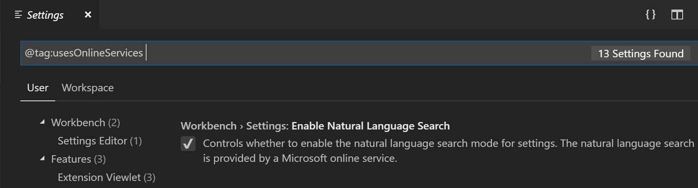

# 텔레메트리(telemetry) {#telemetry}

Visual Studio Code는 제품 개선 방안을 파악하는 데 사용되는 텔레메트리 데이터를 수집합니다. 예를 들어, 이 사용 데이터는 시작 속도가 느린 문제를 디버깅하고 새로운 기능의 우선순위를 정하는 데 도움이 됩니다. 이 데이터를 통해 얻는 통찰력을 중요하게 생각하지만, 모든 사람이 사용 데이터를 보내기를 원하는 것은 아니라는 것을 알고 있으며 [텔레메트리 보고 비활성화](#disable-telemetry-reporting)에 설명된 대로 텔레메트리을 비활성화할 수 있습니다. 자세한 내용은 [개인정보처리방침](https://go.microsoft.com/fwlink/?LinkID=528096&clcid=0x409)을 참조하세요.

## 텔레메트리 데이터의 유형 {#types-of-telemetry-data}

VS Code와 이 페이지는 텔레메트리과 관련하여 세 가지 다른 유형의 데이터를 참조합니다.

**충돌 보고서** - 충돌 보고서는 VS Code가 충돌할 때 진단 정보를 수집하여 Microsoft로 전송하여 충돌이 발생한 이유와 향후 충돌을 방지하는 데 필요한 변경 사항을 이해하는 데 도움이 됩니다.

**오류 텔레메트리** - 오류 텔레메트리은 애플리케이션을 충돌시키지는 않지만 예기치 않은 오류에 대한 정보를 수집합니다.

**사용 데이터** - 사용 데이터는 VS Code에서 기능이 어떻게 사용되고 수행되는지에 대한 정보를 수집하여 향후 제품 개선의 우선순위를 지정하는 데 도움이 됩니다.

## 텔레메트리 보고 비활성화 {#disable-telemetry-reporting}

`telemetry.telemetryLevel` 사용자 [설정](/docs/getstarted/settings.md)을 사용하여 단일 설정으로 우리가 보내는 다양한 유형의 텔레메트리을 제어할 수 있습니다. 다음은 `telemetry.telemetryLevel`의 각 값으로 전송되는 다른 유형의 데이터를 보여주는 표입니다:

|       | 충돌 보고서 | 오류 텔레메트리 | 사용 데이터 |
| :---- | :---------: | :-------------: | :---------: |
| all   |      ✓      |        ✓        |      ✓      |
| error |      ✓      |        ✓        |      -      |
| crash |      ✓      |        -        |      -      |
| off   |      -      |        -        |      -      |

예를 들어, Microsoft에 텔레메트리 데이터를 전혀 보내지 않으려면 `telemetry.telemetryLevel` 사용자 [설정](/docs/getstarted/settings.md)을 `off`로 설정할 수 있습니다.

**File** > **Preferences** > **Settings**에서 `telemetry`를 검색하고 **Telemetry: Telemetry Level** 설정을 `off`로 설정합니다. 이렇게 하면 앞으로 VS Code에서 모든 텔레메트리 이벤트가 중지됩니다. 설정을 비활성화하기 전까지 텔레메트리 정보가 수집되어 전송되었을 수 있습니다.


설정에 JSON 편집기를 사용하는 경우 다음 줄을 추가하세요:

```json
    "telemetry.telemetryLevel": "off"
```

## 확장 프로그램과 텔레메트리 {#extensions-and-telemetry}

VS Code를 사용하면 Microsoft 및 타사 확장 프로그램을 설치하여 제품에 기능을 추가할 수 있습니다. 이러한 확장 프로그램은 자체 사용 데이터를 수집할 수 있으며 `telemetry.telemetryLevel` 설정으로 제어되지 않습니다. 해당 확장 프로그램의 텔레메트리 보고 및 비활성화 가능 여부에 대해 알아보려면 특정 확장 프로그램의 문서를 참조하세요.

확장 프로그램 작성자는 확장 프로그램 내에서 텔레메트리 모범 사례를 구현하는 방법에 대한 지침을 위해 ["확장 프로그램 작성자용"](#for-extension-authors) 섹션을 참조할 수 있습니다.

## 텔레메트리 이벤트의 출력 채널 {#output-channel-for-telemetry-events}

VS Code에서 전송되는 텔레메트리 이벤트를 검토하려면 추적을 활성화하여 텔레메트리 이벤트를 기록할 수 있습니다. **Developer: Set Log Level...** 명령을 사용하고 로그 수준 **Trace**를 선택하세요. 로깅 출력을 보려면 출력 패널(`Ctrl+Shift+U`)로 이동하여 드롭다운에서 **Telemetry**를 선택하세요.


텔레메트리 이벤트를 추적할 때 이벤트는 로컬 파일 `telemetry.log`에도 기록되며, **Developer: Open Log File...** 명령을 사용하고 드롭다운에서 **Telemetry**를 선택하여 볼 수 있습니다.


## 모든 텔레메트리 이벤트 보기 {#viewing-all-telemetry-events}

VS Code가 보낼 수 있는 모든 가능한 텔레메트리 이벤트를 보려면 CLI에서 `--telemetry` 플래그를 사용할 수 있습니다. 이렇게 하면 VS Code 내에서 볼 수 있는 JSON 보고서가 생성됩니다. 이러한 보고서는 빌드별로 생성되며 확장 프로그램 작성자가 루트 빌드 디렉토리에 `telemetry.json` 파일을 추가하지 않는 한 확장 프로그램 텔레메트리은 포함하지 않습니다.

예를 들어, `code --telemetry > telemetry.json && code telemetry.json`을 실행하면 현재 작업 디렉토리에 `telemetry.json` 파일이 생성되고 VS Code에서 열립니다. 텔레메트리 보고서의 길이 때문에 `code --telemetry | code -`와 같이 출력을 파이프할 수는 없습니다.

아래 섹션에서는 텔레메트리을 분류하고 그 목적을 설명하며 특별한 처리를 나타내는 데 사용되는 이벤트 메타데이터에 대해 자세히 설명합니다.

### 이벤트 분류 {#event-classification}

`classification` 필드는 데이터의 유형을 설명합니다.

- `SystemMetaData` - VS Code에서 생성된 개인 식별이 불가능한 값입니다.
- `CallstackOrException` - 프로그램 실행의 실패로 인한 오류입니다. 사용자 경로가 제거된 스택 추적이 포함되어 있습니다.
- `PublicNonPersonalData` - 게시된 확장 프로그램 ID와 같은 공개적으로 사용 가능한 사용자 생성 데이터입니다.
- `EndUserPseudonymizedInformation` - 해당 사용자가 누구인지 식별하지 않고도 고유한 사용자를 식별하는 데 사용되는 해시입니다. 예를 들어, 해시된 Mac 주소입니다.

### 이벤트 목적 {#event-purpose}

`purpose` 필드는 데이터가 수집되는 이유를 설명합니다.

- `PerformanceAndHealth` - VS Code 제품과 서비스가 건강하고 빠른지 확인하기 위해.
- `FeatureInsight` - 기능 사용을 이해하고 개발 투자를 계속할 위치를 파악하기 위해.
- `BusinessInsight` - VS Code, Microsoft 및 GitHub의 비즈니스와 관련된 결정을 내리기 위해.

### 이벤트 엔드포인트 {#event-endpoint}

`endpoint` 필드는 데이터가 전송되는 데이터 핸들러를 설명합니다. 이는 일반적으로 사용자 개인정보를 보호하기 위해 추가적인 스크러빙과 보안이 필요한 특별한 데이터에 적용됩니다.

- `GoogleAnalyticsId` - 우리 웹사이트에서 Google Analytics 및 페이지 뷰 추적에 사용됩니다. 이는 일반 데이터보다 더 민감하게 처리됩니다.
- `MacAddressHash` - VS Code 사용자를 식별하는 데 사용됩니다. 이는 클라이언트 측에서 한 번 해시되고 파이프라인 측에서 다시 해시되어 특정 사용자를 식별하는 것이 불가능하게 됩니다. [웹용 VS Code](/docs/editor/vscode-web.md)에서는 이 경우에 UUID가 생성됩니다.
- `none` - 데이터에 특별한 처리가 필요하지 않습니다.

## GDPR과 VS Code {#gdpr-and-vs-code}

일반 데이터 보호 규정(GDPR) 지원 외에도 VS Code 팀은 개인정보 보호를 매우 중요하게 생각합니다. 이는 Microsoft라는 회사와 특히 VS Code 팀 모두에 해당됩니다.

GDPR 준수를 보장하기 위해 VS Code를 여러 번 업데이트했으며, 다음과 같은 내용이 포함됩니다:

- 모든 기존 및 신규 사용자에게 제품 내 알림을 표시하여 텔레메트리 수집을 쉽게 거부할 수 있도록 함
- 우리가 보내는 텔레메트리을 검토하고 분류함([OSS 코드베이스](https://github.com/microsoft/vscode/pull/34997)에 문서화됨)
- 예를 들어 충돌 덤프와 같이 수집하는 모든 데이터에 대해 유효한 데이터 보존 정책이 있는지 확인

요약하자면, 이러한 관행은 유럽뿐만 아니라 모든 지역에 적용되며, 모든 사용자를 위해 최선의 선택을 하기 위해 노력해 왔습니다.

사람들이 할 것으로 예상되는 한 가지 질문은 우리가 수집하는 데이터를 보는 것입니다. 하지만 VS Code에는 사용자를 고유하게 식별할 '로그인' 경험이 없기 때문에 이를 수행할 수 있는 신뢰할 수 있는 방법이 없습니다. 진단 목적으로 단일 사용자를 근사화하는 데 도움이 되는 정보를 보내긴 합니다(이는 데스크톱의 네트워크 어댑터 NIC 해시와 웹에서 무작위로 할당된 UUID를 기반으로 함). 하지만 이는 고유하다고 보장할 수 없습니다. 예를 들어, 가상 머신(VM)은 종종 NIC ID를 순환하거나 풀에서 할당합니다. 이 기술은 문제를 해결할 때 도움이 되기에 충분하지만 '귀하의 데이터를 제공'하기에는 충분히 신뢰할 만하지 않습니다.

우리는 GDPR과 사용자의 기대치에 대해 더 많이 알게 되면서 우리의 접근 방식이 발전할 것으로 예상합니다. 사용자가 우리에게 보내는 데이터는 매우 가치가 있으며, 이로 인해 VS Code가 모든 사람에게 더 나은 제품이 되기 때문에 우리는 이를 매우 감사하게 생각합니다. 그리고 다시 말씀드리지만, 개인정보 보호가 걱정된다면 [텔레메트리 보고 비활성화](/docs/getstarted/telemetry.md#disable-telemetry-reporting)에 설명된 대로 텔레메트리 전송을 비활성화할 수 있습니다.

Visual Studio 제품군이 GDPR에 접근하는 방법에 대한 자세한 내용은 [GDPR을 위한 Visual Studio 제품군 데이터 주체 요청](https://learn.microsoft.com/compliance/regulatory/gdpr-dsr-visual-studio-family)에서 찾을 수 있습니다.

## 온라인 서비스 관리 {#managing-online-services}

충돌 보고 및 텔레메트리 외에도 VS Code는 제품 업데이트 다운로드, 확장 프로그램 찾기, 설치 및 업데이트, 설정 동기화 또는 설정 편집기 내에서 자연어 검색 제공과 같은 다양한 목적으로 온라인 서비스를 사용합니다. 이러한 서비스를 사용하는 기능을 켜거나 끌 수 있습니다.

이러한 기능을 끄는 것이 VS Code를 오프라인 모드로 전환하는 것은 아니라는 점에 유의하세요. 예를 들어, **확장 프로그램** 보기에서 확장 프로그램을 검색하면 VS Code는 여전히 온라인 VS Code Marketplace를 검색합니다. 이 설정은 여러분이 요청하지 않은 상태에서 VS Code가 온라인 서비스와 통신하지 않도록 합니다.

**파일** > **기본 설정** > **설정**에서 태그 `@tag:usesOnlineServices`를 입력하세요. 이렇게 하면 온라인 서비스 사용을 제어하는 모든 설정이 표시되며 개별적으로 켜거나 끌 수 있습니다.



:::note
VS Code 확장 프로그램도 온라인 서비스를 사용할 수 있으며 이러한 온라인 서비스의 사용을 구성하는 설정을 제공하지 않거나 `@tag:usesOnlineServices`를 검색할 때 표시되도록 설정을 등록하지 않을 수 있습니다. 온라인 서비스 사용에 대해 알아보려면 특정 확장 프로그램의 문서를 참조하세요.
:::

### VS Code에서 사용하는 Microsoft가 아닌 온라인 서비스 {#non-microsoft-online-services-used-by-vs-code}

내장된 **VS Code용 npm 지원** 확장 프로그램은 `https://registry.npmjs.org` 및 `https://registry.bower.io`에 요청을 보냅니다.

내장된 **TypeScript 및 JavaScript 언어 기능** 확장 프로그램은 `https://registry.npmjs.org`에서 `@types` 도메인을 쿼리합니다.

**Developer: Toggle Developer Tools** 또는 **Developer: Open Webview Developer Tools**를 사용할 때 VS Code는 개발자 도구를 실행하는 데 필요한 데이터를 가져오기 위해 Google 서버와 통신할 수 있습니다.

## 확장 프로그램 추천 {#extension-recommendations}

VS Code는 파일 유형, 작업 영역 및 환경을 기반으로 확장 프로그램을 추천합니다. 파일 유형 추천은 미리 계산되거나 동적일 수 있습니다. 작업 영역 및 환경 추천은 항상 미리 계산됩니다.

확장 프로그램이 추천되는 이유를 알고 싶다면 확장 프로그램의 상세 페이지를 여세요. 페이지 헤더에서 추천 이유를 찾을 수 있습니다.


### 사전 계산된 추천 {#precomputed-recommendations}

VS Code는 어떤 확장 프로그램이 특정 파일 유형과 작업 영역/폴더에서 활성화되는지에 대한 텔레메트리를 수집합니다. 특정 폴더는 각 폴더의 Git 원격 저장소의 해시 값을 통해 식별됩니다.

우리는 이 정보를 사용해 익명의 추천을 사전에 계산합니다. 사전 계산된 추천은 확장 프로그램이 추천되어야 할 조건을 설명하는 지침입니다. 예를 들어, 확장 프로그램 A와 B 사이에 흥미로운 상관관계가 발견되었을 때, 한 가지 지침은 다음과 같을 수 있습니다: 사용자가 확장 프로그램 A를 설치했지만 B는 설치하지 않은 경우, 확장 프로그램 B를 추천하세요.

일부 사전 계산된 추천은 제품의 기본 기능으로 제공되며, 추가적인 추천은 런타임 중에 온라인 Microsoft 서비스에서 가져옵니다. VS Code는 사용자 정보를 어떤 온라인 서비스로도 전송하지 않고, 사전 계산된 추천을 독립적으로 평가하고 실행합니다.

### 동적 추천 {#dynamic-recommendations}

VS Code에 사전 계산된 추천이 없는 파일 유형을 열 때, 이 파일 유형을 지원한다고 선언한 확장 프로그램에 대해 확장 프로그램 Marketplace에 문의합니다. 쿼리가 설치되지 않은 확장 프로그램을 반환하면 VS Code가 알림을 제공합니다.

## 확장 프로그램 작성자용 {#for-extension-authors}

[확장 프로그램 가이드 텔레메트리 문서](/api/extension-guides/telemetry.md)를 읽어보세요.

## 다음 단계 {#next-steps}

- [Visual Studio Code FAQ](/docs/supporting/faq.md) - 자주 묻는 질문을 참조하여 자세히 알아보세요.
- [사용자 및 작업 영역 설정](/docs/getstarted/settings.md) - VS Code를 사용자 지정하는 데 사용할 수 있는 옵션에 대해 읽어보세요.
- [키 바인딩](/docs/getstarted/keybindings.md) - 자주 사용하는 키보드 단축키를 쉽게 수정할 수 있습니다.
