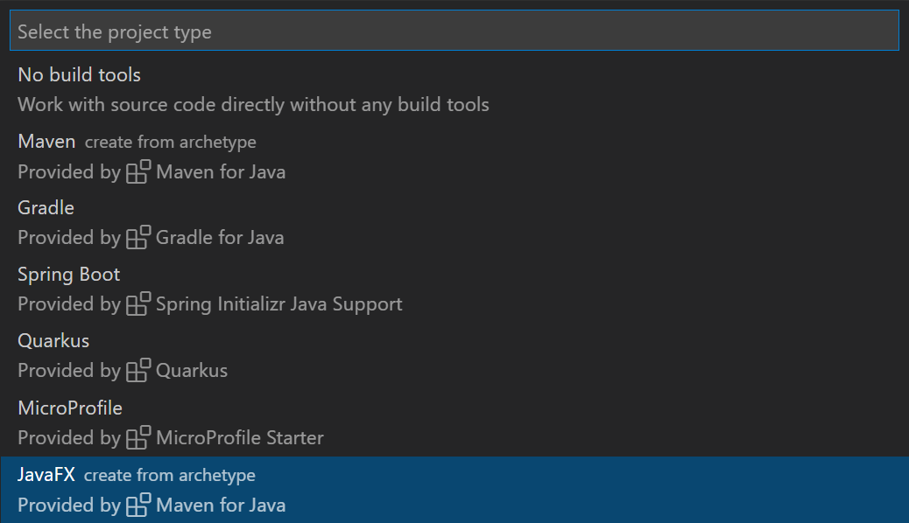

# VS Code에서 GUI 애플리케이션 작업하기 {#working-with-gui-applications-in-vs-code}

Visual Studio Code에서 Java GUI 애플리케이션을 쉽게 개발할 수 있습니다. 이를 위해서는 Java GUI 애플리케이션 개발에 필요한 모든 확장을 포함하는 [Java용 확장 팩](https://marketplace.visualstudio.com/items?itemName=vscjava.vscode-java-pack)을 설치해야 합니다.

<a class="install-extension-btn" href="vscode:extension/vscjava.vscode-java-pack">Java용 확장 팩 설치하기</a>

아래 기능을 사용하면서 문제가 발생하면 [이슈](https://github.com/microsoft/vscode-java-pack/issues)를 등록하여 문의할 수 있습니다.

## JavaFX 애플리케이션 개발 {#develop-javafx-applications}

### 새 JavaFX 프로젝트 생성 {#create-a-new-javafx-project}

VS Code에서 몇 단계만으로 새로운 JavaFX 애플리케이션을 만들 수 있습니다:

- 1단계: [Java용 확장 팩](https://marketplace.visualstudio.com/items?itemName=vscjava.vscode-java-pack)을 설치합니다.
- 2단계: Visual Studio Code에서 명령 팔레트(`Ctrl+Shift+P`)를 열고 **Java: Create Java Project** 명령을 선택합니다.
- 3단계: 목록에서 **JavaFX** 옵션을 선택하고 마법사를 따라가세요. Maven Archetype을 통해 새로운 JavaFX 프로젝트를 구성하는 데 도움을 줄 것입니다.



### JavaFX 애플리케이션 실행 {#run-the-javafx-application}

> 참고: 다음 지침은 Maven으로 관리되는 프로젝트에만 적용됩니다. 생성된 프로젝트를 실행하려면 최소 JDK 11이 필요합니다. 로컬에 JDK 11이 설치되어 있고 [`java.configuration.runtimes`](https://github.com/redhat-developer/vscode-java#project-jdks) 설정에 설치 경로가 설정되어 있는지 확인하세요.

JavaFX 애플리케이션을 실행하려면 **Maven** 탐색기를 열고 `hellofx` > `Plugins` > `javafx`를 확장한 다음 Maven 목표: `javafx:run`을 실행하세요.

:::note
[Maven for Java](https://marketplace.visualstudio.com/items?itemName=vscjava.vscode-maven) 확장을 설치했는지 확인하세요. **Maven** 탐색기를 찾을 수 없다면 명령 팔레트(`Ctrl+Shift+P`)를 열고 **Explorer: Focus on Maven View** 명령을 선택하세요.
:::

<video autoplay loop muted playsinline controls title="JavaFX 애플리케이션 실행" style={{ maxWidth: '100%' }}>

  <source src="https://code.visualstudio.com/docs/java/java-gui/run-javafx.mp4" type="video/mp4" />
</video>

### 더 많은 JavaFX 예제 {#more-javafx-examples}

더 많은 JavaFX 프로젝트 예제는 [openjfx samples 저장소](https://github.com/openjfx/samples/tree/master/IDE/VSCode)에서 찾을 수 있습니다. 여기에는 다양한 프로젝트 구조(예: Gradle 및 관리되지 않는 폴더 프로젝트)가 포함되어 있습니다. 각 샘플에는 프로그램 실행 방법을 설명하는 문서가 있습니다.

## AWT 애플리케이션 개발 {#develop-awt-applications}

기본적으로 Abstract Window Toolkit (AWT)의 타입들은 숨겨져 있습니다. AWT 애플리케이션을 개발할 때 코드 완성이 작동하지 않는 것을 발견할 수 있습니다. 완성을 활성화하려면 명령 팔레트(`Ctrl+Shift+P`)를 열고 **Java: Help Center** 명령을 선택하세요. **Student** 섹션으로 이동하여 **Enable AWT Development**를 선택하세요.

<video autoplay loop muted playsinline controls title="AWT 애플리케이션 개발" style={{ maxWidth: '100%' }}>

  <source src="https://code.visualstudio.com/docs/java/java-gui/enable-awt.mp4" type="video/mp4" />
</video>

> 참고: 이 작업은 `.vscode\settings.json`의 작업 공간 수준에서 `java.completion.filteredTypes` 설정을 업데이트할 것이므로 VS Code에 작업 공간이 열려 있는지 확인하세요.

아래의 샘플 코드를 사용하여 VS Code에서 간단한 Java AWT 애플리케이션을 실행할 수 있습니다.

```java
import java.awt.*;
import java.awt.event.*;

public class AwtExample extends Frame {
  public AwtExample() {
    Button btn = new Button("Button");
    btn.setBounds(50, 50, 50, 50);
    add(btn);
    setSize(150, 150);
    setTitle("This is my First AWT example");
    setLayout(new FlowLayout());
    setVisible(true);
    addWindowListener(new WindowAdapter() {
        public void windowClosing(WindowEvent we) {
            dispose();
        }
    });
  }

  public static void main(String args[]){
    new AwtExample();
  }
}
```

## Swing 애플리케이션 개발 {#develop-swing-applications}

Swing 애플리케이션 개발은 기본적으로 지원됩니다. 별도의 설정 없이 바로 Swing 애플리케이션 코드를 작성할 수 있습니다.

[Oracle Swing 문서](https://docs.oracle.com/javase/tutorial/uiswing/examples/components/index.html)에서 더 많은 Swing 샘플을 찾을 수 있습니다.
