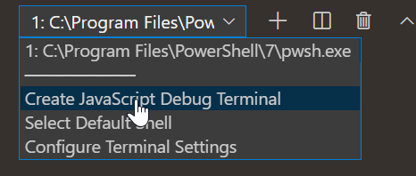
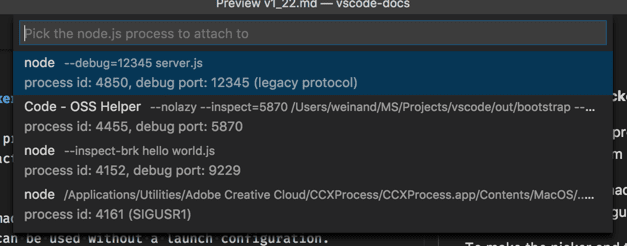
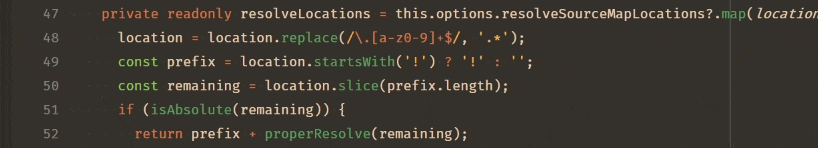
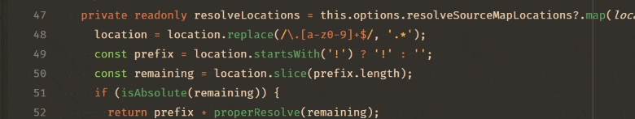
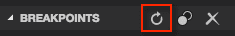

# VS Code에서 Node.js 디버깅하기 {#nodejs-debugging-in-vs-code}

Visual Studio Code 에디터는 [Node.js](https://nodejs.org/) 런타임을 위한 디버깅 지원이 내장되어 있으며, JavaScript, TypeScript 및 JavaScript로 트랜스파일되는 다른 많은 언어를 디버깅할 수 있습니다. VS Code는 적절한 Launch 설정 기본값과 스니펫을 제공하므로 Node.js 디버깅을 위한 프로젝트 설정이 간단합니다.

VS Code에서 Node.js 프로그램을 디버깅하는 방법에는 몇 가지가 있습니다:

- [Auto Attach](#auto-attach)을 사용하여 VS Code의 통합 터미널에서 실행하는 프로세스를 디버깅합니다.
- [JavaScript 디버그 터미널](#javascript-debug-terminal)을 사용합니다(통합 터미널과 유사).
- [Launch 설정](#launch-configuration)을 사용하여 프로그램을 시작하거나, VS Code 외부에서 시작된 프로세스에 [연결](#attaching-to-nodejs)합니다.

## Auto Attach {#auto-attach}

**Auto Attach** 기능이 활성화되어 있으면 Node 디버거는 VS Code의 통합 터미널에서 시작된 특정 Node.js 프로세스에 자동으로 연결됩니다. 이 기능을 활성화하려면 명령 팔레트(`Ctrl+Shift+P`)에서 **Auto Attach Toggle** 명령을 사용하거나, 이미 활성화된 경우 **Auto Attach** 상태 표시줄 항목을 사용하세요.

Auto Attach에는 세 가지 모드가 있으며, 퀵 픽이나 **debug.javascript.autoAttachFilter** 설정을 통해 선택할 수 있습니다:

- `smart` - `node_modules` 폴더 외부에서 스크립트를 실행하거나 mocha나 ts-node와 같은 일반적인 '실행기' 스크립트를 사용하는 경우 프로세스가 디버깅됩니다. **Auto Attach Smart Pattern** 설정(`debug.javascript.autoAttachSmartPattern`)을 사용하여 '실행기' 스크립트 허용 목록을 구성할 수 있습니다.
- `always` - 통합 터미널에서 시작된 모든 Node.js 프로세스가 디버깅됩니다.
- `onlyWithFlag` - `--inspect` 또는 `--inspect-brk` 플래그와 함께 시작된 프로세스만 디버깅됩니다.

**Auto Attach**을 활성화한 후에는 터미널의 오른쪽 상단에 있는 ⚠ 아이콘을 클릭하거나 새 터미널을 만들어 터미널을 다시 시작해야 합니다. 그러면 디버거가 1초 이내에 프로그램에 연결됩니다:


Auto Attach이 켜져 있으면 VS Code 창의 하단에 있는 상태 표시줄에 `Auto Attach` 항목이 나타납니다. 이를 클릭하면 Auto Attach 모드를 변경하거나 일시적으로 끌 수 있습니다. 일시적으로 Auto Attach을 끄는 것은 디버깅이 필요 없는 일회성 프로그램을 실행할 때 유용하지만, 이 기능을 완전히 비활성화하고 싶지는 않은 경우에 도움이 됩니다.

### 추가 구성 {#additional-configuration}

**다른 Launch 설정 속성**

일반적으로 launch.json에서 찾을 수 있는 [다른 속성](#launch-configuration-attributes)을 **debug.javascript.terminalOptions** 설정에서 Auto Attach에 적용할 수 있습니다. 예를 들어, node internals를 skipFiles에 추가하려면 사용자 또는 작업 영역 설정에 다음을 추가할 수 있습니다:

```js
  "debug.javascript.terminalOptions": {
    "skipFiles": [
      "<node_internals>/**"
    ]
  },
```

**Auto Attach 스마트 패턴**

`smart` Auto Attach 모드에서 VS Code는 디버깅하고 싶지 않은 빌드 도구가 아닌 코드에만 연결하려고 시도합니다. 이는 메인 스크립트를 [glob 패턴](/docs/editor/glob-patterns.md) 목록과 대조하여 수행됩니다. glob 패턴은 **debug.javascript.autoAttachSmartPattern** 설정에서 구성할 수 있으며 기본값은 다음과 같습니다:

```js
[
  "!**/node_modules/**", // node_modules 폴더의 스크립트 제외
  "**/$KNOWN_TOOLS$/**", // 일반적인 도구는 포함
];
```

`$KNOWN_TOOLS$`는 `ts-node`, `mocha`, `ava` 등과 같은 일반적인 '코드 실행기' 목록으로 대체됩니다. 이러한 설정이 작동하지 않는 경우 이 목록을 수정할 수 있습니다. 예를 들어 `mocha`를 제외하고 `my-cool-test-runner`를 포함하려면 두 줄을 추가할 수 있습니다:

```js
[
  "!**/node_modules/**",
  "**/$KNOWN_TOOLS$/**",
  "!**/node_modules/mocha/**", // "!"를 사용하여 "mocha" node modules의 모든 스크립트 제외
  "**/node_modules/my-cool-test-runner/**", // 사용자 지정 테스트 실행기의 스크립트 포함
];
```

## JavaScript 디버그 터미널 {#javascript-debug-terminal}

[Auto Attach](#auto-attach)과 비슷한 방식으로 JavaScript 디버그 터미널은 그 안에서 실행하는 모든 Node.js 프로세스를 자동으로 디버깅합니다. 명령 팔레트(`Ctrl+Shift+P`)에서 **Debug: Create JavaScript Debug Terminal** 명령을 실행하거나 터미널 전환기 드롭다운에서 **Create JavaScript Debug Terminal**을 선택하여 디버그 터미널을 생성할 수 있습니다.



### 추가 구성 {#additional-configuration-1}

**다른 Launch 설정 속성**

일반적으로 launch.json에서 찾을 수 있는 [다른 속성](#launch-configuration-attributes)을 **debug.javascript.terminalOptions** 설정에서 디버그 터미널에 적용할 수 있습니다. 예를 들어, node internals를 skipFiles에 추가하려면 사용자 또는 작업 영역 설정에 다음을 추가할 수 있습니다:

```js
"debug.javascript.terminalOptions": {
  "skipFiles": [
    "<node_internals>/**"
  ]
},
```

## Launch 설정 {#launch-configuration}

Launch 설정은 VS Code에서 디버깅을 설정하는 전통적인 방법이며, 복잡한 애플리케이션을 실행하기 위한 가장 많은 구성 옵션을 제공합니다.

이 섹션에서는 더 고급 디버깅 시나리오를 위한 구성과 기능에 대해 자세히 설명합니다. [소스 맵](/docs/nodejs/nodejs-debugging.md#source-maps)을 사용한 디버깅, [외부 코드 건너뛰기](/docs/nodejs/nodejs-debugging.md#skipping-uninteresting-code), [원격 디버깅](/docs/nodejs/nodejs-debugging.md#remote-debugging) 등에 대한 지침을 찾을 수 있습니다.

입문 영상을 보고 싶다면 [VS Code에서 디버깅 시작하기](https://www.youtube.com/watch?v=3HiLLByBWkg)를 참조하세요.

:::note
VS Code를 처음 사용하는 경우 일반 디버깅 기능과 `launch.json` 구성 파일 생성에 대해서는 [디버깅](/docs/editor/debugging.md) 주제에서 배울 수 있습니다.
:::

## Launch 설정 속성 {#launch-configuration-attributes}

디버깅 구성은 작업 영역의 `.vscode` 폴더에 있는 `launch.json` 파일에 저장됩니다. 디버깅 구성 파일의 생성과 사용에 대한 소개는 일반 [디버깅](/docs/editor/debugging.md#launch-configurations) 문서에 있습니다.

아래는 Node.js 디버거에 특화된 일반적인 `launch.json` 속성 참조입니다. 전체 옵션 세트는 [vscode-js-debug 옵션](https://github.com/microsoft/vscode-js-debug/blob/main/OPTIONS.md) 문서에서 볼 수 있습니다.

다음 속성들은 `launch`와 `attach` 타입의 Launch 설정에서 지원됩니다:

- `outFiles` - 생성된 JavaScript 파일을 찾기 위한 [glob 패턴](/docs/editor/glob-patterns.md) 배열입니다. [소스 맵](/docs/nodejs/nodejs-debugging.md#source-maps) 섹션을 참조하세요.
- `resolveSourceMapLocations` - 소스 맵을 파싱해야 하는 위치에 대한 [glob 패턴](/docs/editor/glob-patterns.md) 배열입니다. [소스 맵](/docs/nodejs/nodejs-debugging.md#source-maps) 섹션을 참조하세요.
- `timeout` - 세션을 다시 시작할 때 이 밀리초 후에 포기합니다. [Node.js에 연결하기](/docs/nodejs/nodejs-debugging.md#attaching-to-nodejs) 섹션을 참조하세요.
- `stopOnEntry` - 프로그램이 시작될 때 즉시 중단합니다.
- `localRoot` - VS Code의 루트 디렉토리입니다. 아래 [원격 디버깅](/docs/nodejs/nodejs-debugging.md#remote-debugging) 섹션을 참조하세요.
- `remoteRoot` - Node의 루트 디렉토리입니다. 아래 [원격 디버깅](/docs/nodejs/nodejs-debugging.md#remote-debugging) 섹션을 참조하세요.
- `smartStep` - 소스 파일에 매핑되지 않는 코드를 자동으로 건너뛰려고 시도합니다. [스마트 스테핑](/docs/nodejs/nodejs-debugging.md#smart-stepping) 섹션을 참조하세요.
- `skipFiles` - 이러한 [glob 패턴](/docs/editor/glob-patterns.md)이 적용되는 파일을 자동으로 건너뜁니다. [관심 없는 코드 건너뛰기](/docs/nodejs/nodejs-debugging.md#skipping-uninteresting-code) 섹션을 참조하세요.
- `trace` - 진단 출력을 활성화합니다.

다음 속성들은 `launch` 요청 타입의 Launch 설정에서만 사용할 수 있습니다:

- `program` - 디버깅할 Node.js 프로그램의 절대 경로입니다.
- `args` - 디버깅할 프로그램에 전달되는 인수입니다. 이 속성은 배열 타입이며 개별 인수를 배열 요소로 받습니다.
- `cwd` - 이 디렉토리에서 디버깅할 프로그램을 시작합니다.
- `runtimeExecutable` - 사용할 런타임 실행 파일의 절대 경로입니다. 기본값은 `node`입니다. ['npm'과 다른 도구를 위한 Launch 설정 지원](/docs/nodejs/nodejs-debugging.md#launch-configuration-support-for-npm-and-other-tools) 섹션을 참조하세요.
- `runtimeArgs` - 런타임 실행 파일에 전달되는 선택적 인수입니다.
- `runtimeVersion` - "[nvm](https://github.com/creationix/nvm)"(또는 "[nvm-windows](https://github.com/coreybutler/nvm-windows)")이나 "[nvs](https://github.com/jasongin/nvs)"를 사용하여 Node.js 버전을 관리하는 경우, 이 속성을 사용하여 특정 Node.js 버전을 선택할 수 있습니다. 아래 [다중 버전 지원](/docs/nodejs/nodejs-debugging.md#multi-version-support) 섹션을 참조하세요.
- `env` - 선택적 환경 변수입니다. 이 속성은 문자열 타입의 키/값 쌍 목록으로 환경 변수를 받습니다.
- `envFile` - 환경 변수 정의가 포함된 파일의 선택적 경로입니다. 아래 [외부 파일에서 환경 변수 로드](/docs/nodejs/nodejs-debugging.md#load-environment-variables-from-external-file) 섹션을 참조하세요.
- `console` - 프로그램을 시작할 콘솔(`internalConsole`, `integratedTerminal`, `externalTerminal`)입니다. 아래 [Node 콘솔](/docs/nodejs/nodejs-debugging.md#node-console) 섹션을 참조하세요.
- `outputCapture` - `std`로 설정하면 디버그 포트를 통해 출력을 수신하는 대신 프로세스 stdout/stderr의 출력이 디버그 콘솔에 표시됩니다. 이는 `console.*` API 대신 stdout/stderr 스트림에 직접 쓰는 프로그램이나 로그 라이브러리에 유용합니다.

다음 속성은 `attach` 요청 타입의 Launch 설정에서만 사용할 수 있습니다:

- `restart` - 종료 시 연결을 다시 시작합니다. [소스가 편집될 때 자동으로 디버그 세션 다시 시작하기](/docs/nodejs/nodejs-debugging.md#restarting-debug-sessions-automatically-when-source-is-edited) 섹션을 참조하세요.
- `port` - 사용할 디버그 포트입니다. [Node.js에 연결하기](/docs/nodejs/nodejs-debugging.md#attaching-to-nodejs)와 [원격 디버깅](/docs/nodejs/nodejs-debugging.md#remote-debugging) 섹션을 참조하세요.
- `address` - 디버그 포트의 TCP/IP 주소입니다. [Node.js에 연결하기](/docs/nodejs/nodejs-debugging.md#attaching-to-nodejs)와 [원격 디버깅](/docs/nodejs/nodejs-debugging.md#remote-debugging) 섹션을 참조하세요.
- `processId` - USR1 신호를 보낸 후 디버거가 이 프로세스에 연결을 시도합니다. 이 설정을 사용하면 디버거는 디버그 모드로 시작되지 않은 이미 실행 중인 프로세스에 연결할 수 있습니다. `processId` 속성을 사용할 때는 Node.js 버전(및 사용된 프로토콜)을 기반으로 디버그 포트가 자동으로 결정되므로 명시적으로 구성할 수 없습니다. 따라서 `port` 속성을 지정하지 마세요.
- `continueOnAttach` - 연결할 때 일시 중지된 프로세스를 계속 실행할지 여부입니다. 이 옵션은 `--inspect-brk`로 프로그램을 시작할 때 유용합니다.

### 일반적인 시나리오를 위한 Launch 설정 {#launch-configurations-for-common-scenarios}

`launch.json` 파일에서 IntelliSense(`Ctrl+Space`)를 트리거하여 일반적으로 사용되는 Node.js 디버깅 시나리오에 대한 Launch 설정 스니펫을 볼 수 있습니다.


`launch.json` 편집기 창의 오른쪽 하단에 있는 **구성 추가...** 버튼으로도 스니펫을 불러올 수 있습니다.


다음 스니펫들을 사용할 수 있습니다:

- **프로그램 시작**: 디버그 모드에서 Node.js 프로그램을 시작합니다.
- **npm으로 시작**: npm 'debug' 스크립트를 통해 Node.js 프로그램을 시작합니다. package.json에 정의된 경우 Launch 설정에서 npm debug 스크립트를 사용할 수 있습니다. npm 스크립트에서 사용되는 디버그 포트는 스니펫에 지정된 포트와 일치해야 합니다.
- **연결**: 로컬에서 실행 중인 Node.js 프로그램의 디버그 포트에 연결합니다. 디버깅할 Node.js 프로그램이 디버그 모드로 시작되었는지, 그리고 사용된 디버그 포트가 스니펫에 지정된 포트와 같은지 확인하세요.
- **원격 프로그램에 연결**: `address` 속성에 지정된 호스트에서 실행 중인 Node.js 프로그램의 디버그 포트에 연결합니다. 디버깅할 Node.js 프로그램이 디버그 모드로 시작되었는지, 그리고 사용된 디버그 포트가 스니펫에 지정된 포트와 같은지 확인하세요. VS Code가 작업 영역과 원격 호스트의 파일 시스템 간에 소스 파일을 매핑하는 데 도움이 되도록 `localRoot`와 `remoteRoot` 속성에 올바른 경로를 지정했는지 확인하세요.
- **프로세스 ID로 연결**: node 또는 gulp 프로세스를 선택하여 디버깅하기 위한 프로세스 선택기를 엽니다. 이 Launch 설정을 사용하면 디버그 모드로 시작되지 않은 node 또는 gulp 프로세스에도 연결할 수 있습니다.
- **Nodemon 설정**: JavaScript 소스가 변경될 때마다 디버그 세션을 자동으로 다시 시작하기 위해 nodemon을 사용합니다. nodemon이 전역적으로 설치되어 있는지 확인하세요. 디버그 세션을 종료하면 디버깅할 프로그램만 종료되고 nodemon 자체는 종료되지 않습니다. nodemon을 종료하려면 통합 터미널에서 `Ctrl+C`를 누르세요.
- **Mocha 테스트**: 프로젝트의 `test` 폴더에 있는 mocha 테스트를 디버깅합니다. 프로젝트의 `node_modules` 폴더에 'mocha'가 설치되어 있는지 확인하세요.
- **Yeoman 생성기**: yeoman 생성기를 디버깅합니다. 스니펫은 생성기의 이름을 지정하도록 요청합니다. 프로젝트의 `node_modules` 폴더에 'yo'가 설치되어 있고, 생성된 프로젝트가 프로젝트 폴더에서 `npm link`를 실행하여 디버깅을 위해 설치되었는지 확인하세요.
- **Gulp 작업**: gulp 작업을 디버깅합니다. 프로젝트의 `node_modules` 폴더에 'gulp'가 설치되어 있는지 확인하세요.
- **Electron 메인**: Electron 애플리케이션의 메인 Node.js 프로세스를 디버깅합니다. 스니펫은 Electron 실행 파일이 작업 영역의 `node_modules/.bin` 디렉터리 안에 설치되어 있다고 가정합니다.

### Node 콘솔 {#node-console}

기본적으로 Node.js 디버그 세션은 내부 VS Code 디버그 콘솔에서 대상을 시작합니다. 디버그 콘솔은 콘솔에서 입력을 읽어야 하는 프로그램을 지원하지 않으므로, Launch 설정에서 `console` 속성을 `externalTerminal` 또는 `integratedTerminal`로 설정하여 외부 터미널이나 VS Code 통합 터미널을 활성화할 수 있습니다. 기본값은 `internalConsole`입니다.

외부 터미널에서는 `terminal.external.windowsExec`, `terminal.external.osxExec`, `terminal.external.linuxExec` 설정을 통해 사용할 터미널 프로그램을 구성할 수 있습니다.

### 'npm'과 다른 도구를 위한 Launch 설정 지원 {#launch-configuration-support-for-npm-and-other-tools}

node로 Node.js 프로그램을 직접 시작하는 대신, Launch 설정에서 'npm' 스크립트나 다른 태스크 실행기 도구를 직접 사용할 수 있습니다:

- `runtimeExecutable` 속성에 PATH에서 사용 가능한 모든 프로그램(예: 'npm', 'mocha', 'gulp' 등)을 사용할 수 있으며 `runtimeArgs`를 통해 인수를 전달할 수 있습니다.
- npm 스크립트나 다른 도구가 암시적으로 시작할 프로그램을 지정하는 경우 `program` 속성을 설정할 필요가 없습니다.

'npm' 예제를 살펴보겠습니다. `package.json`에 'debug' 스크립트가 있는 경우, 예를 들어:

```json
  "scripts": {
    "debug": "node myProgram.js"
  },
```

해당하는 Launch 설정은 다음과 같습니다:

```json
{
  "name": "npm으로 시작",
  "type": "node",
  "request": "launch",
  "cwd": "${workspaceFolder}",
  "runtimeExecutable": "npm",
  "runtimeArgs": ["run-script", "debug"]
}
```

### 다중 버전 지원 {#multi-version-support}

'[nvm](https://github.com/creationix/nvm)'(또는 '[nvm-windows](https://github.com/coreybutler/nvm-windows)')이나 '[nvs](https://github.com/jasongin/nvs)'를 사용하여 Node.js 버전을 관리하는 경우, Launch 설정에서 `runtimeVersion` 속성을 사용하여 특정 Node.js 버전을 선택할 수 있습니다:

```json
{
  "type": "node",
  "request": "launch",
  "name": "테스트 시작",
  "runtimeVersion": "14",
  "program": "${workspaceFolder}/test.js"
}
```

'[nvs](https://github.com/jasongin/nvs)'를 사용하여 Node.js 버전을 관리하는 경우, `runtimeVersion` 속성을 사용하여 특정 버전, 아키텍처, 그리고 Node.js 종류를 선택할 수 있습니다. 예를 들어:

```json
{
  "type": "node",
  "request": "launch",
  "name": "테스트 시작",
  "runtimeVersion": "chackracore/8.9.4/x64",
  "program": "${workspaceFolder}/test.js"
}
```

이 기능은 버전을 자동으로 다운로드하고 설치하지 않으므로, `runtimeVersion` 속성에서 사용하려는 Node.js 버전이 설치되어 있는지 확인하세요. 예를 들어, Launch 설정에 `"runtimeVersion": "7.10.1"`을 추가할 계획이라면 통합 터미널에서 `nvm install 7.10.1` 또는 `nvs add 7.10.1`과 같은 명령을 실행해야 합니다.

마이너 버전과 패치 버전을 생략하고 예를 들어 `"runtimeVersion": "14"`를 사용하면, 시스템에 설치된 가장 최신 `14.x.y` 버전이 사용됩니다.

### 외부 파일에서 환경 변수 로드 {#load-environment-variables-from-external-file}

VS Code Node 디버거는 파일에서 환경 변수를 로드하여 Node.js 런타임에 전달하는 기능을 지원합니다. 이 기능을 사용하려면 Launch 설정에 `envFile` 속성을 추가하고 환경 변수가 포함된 파일의 절대 경로를 지정하세요:

```json
   //...
   "envFile": "${workspaceFolder}/.env",
   "env": { "USER": "john doe" }
   //...
```

`env` 딕셔너리에 지정된 모든 환경 변수는 파일에서 로드된 변수를 재정의합니다.

다음은 `.env` 파일의 예시입니다:

```
USER=doe
PASSWORD=abc123

# 주석

# 빈 값:
empty=

# 따옴표로 묶인 문자열에서 새 줄이 확장됨:
lines="foo\nbar"
```

## Node.js에 연결하기 {#attaching-to-nodejs}

외부 Node.js 프로그램에 VS Code 디버거를 연결하려면 다음과 같이 Node.js를 시작하세요:

```bash
node --inspect program.js
```

또는 프로그램이 바로 실행되지 않고 디버거가 연결될 때까지 기다려야 하는 경우:

```bash
node --inspect-brk program.js
```

프로그램에 디버거를 연결하는 방법:

- 모든 잠재적 후보 프로세스를 나열하고 하나를 선택할 수 있는 "process picker"를 열거나,
- 모든 구성 옵션을 명시적으로 지정하는 "attach" 구성을 만든 다음 **F5**를 누릅니다.

이러한 옵션들을 자세히 살펴보겠습니다:

### Node 프로세스에 연결 작업 {#attach-to-node-process-action}

명령 팔레트(`Ctrl+Shift+P`)의 **Node 프로세스에 연결** 명령은 Node.js 디버거에서 사용할 수 있는 모든 잠재적 프로세스를 나열하는 퀵 픽 메뉴를 엽니다:



선택기에 나열된 개별 프로세스는 디버그 포트와 프로세스 ID를 보여줍니다. 그 목록에서 Node.js 프로세스를 선택하면 Node.js 디버거가 해당 프로세스에 연결을 시도합니다.

Node.js 프로세스 외에도 선택기는 다양한 형태의 `--inspect` 인수로 시작된 다른 프로그램도 보여줍니다. 이를 통해 Electron이나 VS Code의 헬퍼 프로세스에도 연결할 수 있습니다.

### "Attach" 구성 설정하기 {#setting-up-an-attach-configuration}

이 옵션은 더 많은 작업이 필요하지만 이전 두 옵션과 달리 다양한 디버그 구성 옵션을 명시적으로 구성할 수 있습니다.

가장 간단한 "Attach" 구성은 다음과 같습니다:

```json
{
  "name": "프로세스에 연결",
  "type": "node",
  "request": "attach",
  "port": 9229
}
```

포트 `9229`는 `--inspect`와 `--inspect-brk` 옵션의 기본 디버그 포트입니다. 다른 포트(예: `12345`)를 사용하려면, 옵션에 다음과 같이 추가하고: `--inspect=12345`와 `--inspect-brk=12345`, Launch 설정의 `port` 속성도 이에 맞춰 변경하세요.

디버그 모드로 시작되지 않은 Node.js 프로세스에 연결하려면 Node.js 프로세스의 프로세스 ID를 문자열로 지정하면 됩니다:

```json
{
  "name": "프로세스에 연결",
  "type": "node",
  "request": "attach",
  "processId": "53426"
}
```

Launch 설정에 새 프로세스 ID를 반복해서 입력하는 것을 피하기 위해, Node 디버그는 프로세스 선택기(위에서 설명)를 열 수 있는 `PickProcess` 명령 변수를 지원합니다.

`PickProcess` 변수를 사용한 Launch 설정은 다음과 같습니다:

```json
{
  "name": "프로세스에 연결",
  "type": "node",
  "request": "attach",
  "processId": "${command:PickProcess}"
}
```

## 디버깅 중지 {#stop-debugging}

**Debug: Stop** 작업(디버그 도구 모음에서 사용 가능하거나 **Command Palette**를 통해)을 사용하여 디버그 세션을 중지합니다.

디버그 세션이 "연결" 모드로 시작된 경우(그리고 디버그 도구 모음의 빨간색 종료 버튼에 "플러그" 아이콘이 겹쳐져 있는 경우), **Stop**를 누르면 Node.js 디버거가 디버기(계속 실행되는)에서 연결 해제됩니다.

디버그 세션이 "시작" 모드인 경우, **Stop**를 누르면 다음과 같이 동작합니다:

1. **Stop**를 처음 누르면 `SIGINT` 신호를 보내 디버기에 정상적인 종료를 요청합니다. 디버기는 이 신호를 가로채서 필요에 따라 정리 작업을 수행한 후 종료할 수 있습니다. 종료 코드에 중단점이 없는 경우(또는 문제가 없는 경우) 디버기와 디버그 세션이 종료됩니다.

2. 그러나 디버거가 종료 코드의 중단점에 도달하거나 디버기가 자체적으로 적절하게 종료되지 않는 경우, 디버그 세션은 종료되지 않습니다. 이 경우, **Stop**를 다시 누르면 디버기와 그 자식 프로세스를 강제 종료합니다(`SIGKILL`).

빨간색 **Stop** 버튼을 눌렀을 때 디버그 세션이 종료되지 않는 것을 보면, 버튼을 다시 눌러 디버기를 강제 종료하세요.

Windows에서는 **Stop**를 누르면 디버기와 그 자식 프로세스를 강제 종료합니다.

## 소스 맵 {#source-maps}

VS Code의 JavaScript 디버거는 TypeScript나 축소/난독화된 JavaScript와 같은 트랜스파일된 언어의 디버깅을 돕는 소스 맵을 지원합니다. 소스 맵을 사용하면 원본 소스에서 단계별 실행을 하거나 중단점을 설정할 수 있습니다. 원본 소스에 대한 소스 맵이 없거나, 소스 맵이 손상되어 소스와 생성된 JavaScript 간의 매핑이 불가능한 경우 중단점은 확인되지 않은 상태(회색 빈 원)로 표시됩니다.

`sourceMaps` 속성은 기본값이 `true`이며 소스 맵 기능을 제어합니다. 디버거는 항상 소스 맵을 사용하려고 시도하며(찾을 수 있는 경우), 결과적으로 `program` 속성에 소스 파일(예: app.ts)을 지정할 수도 있습니다. 어떤 이유로 소스 맵을 비활성화해야 하는 경우, `sourceMaps` 속성을 `false`로 설정할 수 있습니다.

### 도구 구성 {#tool-configuration}

소스 맵이 항상 자동으로 생성되는 것은 아니므로, 트랜스파일러가 소스 맵을 생성하도록 구성해야 합니다. 예를 들어:

**TypeScript**

TypeScript의 경우, `tsc`에 `--sourceMap`을 전달하거나 tsconfig.json 파일에 `"sourceMap": true`를 추가하여 소스맵을 활성화할 수 있습니다.

```bash
tsc --sourceMap --outDir bin app.ts
```

**Babel**

Babel의 경우, [sourceMaps](https://babeljs.io/docs/en/options#sourcemaps) 옵션을 `true`로 설정하거나, 코드를 컴파일할 때 `--source-maps` 옵션을 전달해야 합니다.

```bash
npx babel script.js --out-file script-compiled.js --source-maps
```

**Webpack**

Webpack은 [많은](https://webpack.js.org/configuration/devtool/) 소스 맵 옵션을 가지고 있습니다. 최상의 결과를 위해 `webpack.config.js`에서 `devtool: "source-map"` 속성을 설정하는 것을 권장하지만, 다른 설정이 빌드 속도를 저하시키는 경우 다른 설정을 시도해볼 수 있습니다.

또한, TypeScript 로더와 같은 추가 컴파일 단계가 webpack에 있는 경우, 이러한 단계도 소스맵을 생성하도록 설정되어 있는지 확인해야 합니다. 그렇지 않으면 webpack이 생성하는 소스맵이 실제 소스 대신 로더에서 컴파일된 코드로 매핑됩니다.

### 소스 맵 검색 {#source-map-discovery}

기본적으로 VS Code는 `node_modules`를 제외한 전체 작업 영역에서 소스맵을 검색합니다. 큰 작업 영역에서는 이 검색이 느릴 수 있습니다. `launch.json`의 `outFiles` 속성을 설정하여 VS Code가 소스 맵을 검색할 위치를 구성할 수 있습니다. 예를 들어, 이 구성은 `bin` 폴더의 `.js` 파일에 대한 소스맵만 검색합니다:

```json
{
  "version": "0.2.0",
  "configurations": [
    {
      "name": "TypeScript 시작",
      "type": "node",
      "request": "launch",
      "program": "app.ts",
      "outFiles": ["${workspaceFolder}/bin/**/*.js"]
    }
  ]
}
```

`outFiles`는 소스 맵 파일(`.map`으로 끝날 수 있음)이 아닌 JavaScript 파일과 일치해야 합니다.

### 소스 맵 처리 {#source-map-resolution}

기본적으로 `outFiles`의 소스 맵만 처리됩니다. 이 동작은 종속성이 설정한 중단점을 방해하는 것을 방지하기 위해 사용됩니다. 예를 들어, `src/index.ts` 파일이 있고 종속성이 `webpack:///./src/index.ts`를 참조하는 소스 맵을 가지고 있다면, 이는 잘못되게 소스 파일로 처리되어 예상치 못한 결과를 초래할 수 있습니다.

`resolveSourceMapLocations` 옵션을 설정하여 이 동작을 구성할 수 있습니다. `null`로 설정하면 모든 소스 맵이 처리됩니다. 예를 들어, 이 구성은 추가로 `node_modules/some-dependency`의 소스 맵도 처리되도록 허용합니다:

```js
  "resolveSourceMapLocations": [
    "out/**/*.js",
    "node_modules/some-dependency/**/*.js",
  ]
```

### 스마트 스테핑 {#smart-stepping}

Launch 설정에서 `smartStep` 속성을 `true`로 설정하면, VS Code는 디버거에서 코드를 단계별로 실행할 때 '관심 없는 코드'를 자동으로 건너뜁니다. '관심 없는 코드'는 트랜스파일 프로세스에 의해 생성되었지만 소스 맵으로 커버되지 않아 원본 소스로 다시 매핑되지 않는 코드입니다. 이 코드는 디버거에서 소스 코드를 단계별로 실행할 때 원본 소스 코드와 생성된 코드(관심 없는) 사이를 전환해야 하므로 방해가 됩니다. `smartStep`은 소스 맵으로 커버되지 않는 코드를 자동으로 건너뛰어 소스 맵으로 커버되는 위치에 도달할 때까지 진행합니다.

스마트 스테핑은 TypeScript의 async/await 다운컴파일과 같이 컴파일러가 소스 맵으로 커버되지 않는 헬퍼 코드를 주입하는 경우에 특히 유용합니다.

`smartStep` 기능은 소스에서 생성되어 따라서 소스 맵을 가지고 있는 JavaScript 코드에만 적용됩니다. 소스가 없는 JavaScript의 경우, 스마트 스테핑 옵션은 효과가 없습니다.

### JavaScript 소스 맵 팁 {#javascript-source-map-tips}

소스 맵으로 디버깅할 때 흔한 문제는 중단점을 설정했는데 회색으로 변하는 것입니다. 커서를 그 위에 올려놓으면 `"Breakpoint ignored because generated code not found (source map problem?)"` 메시지가 표시됩니다. 이제 어떻게 해야 할까요? 이런 상황을 초래할 수 있는 다양한 문제가 있습니다. 먼저 Node 디버그 어댑터가 소스 맵을 처리하는 방식을 간단히 설명하겠습니다.

`app.ts`에 중단점을 설정하면, 디버그 어댑터는 실제로 Node에서 실행되는 TypeScript 파일의 트랜스파일된 버전인 `app.js`의 경로를 찾아야 합니다. 하지만 `.ts` 파일에서 시작하여 이를 알아내는 간단한 방법은 없습니다. 대신, 디버그 어댑터는 `launch.json`의 `outFiles` 속성을 사용하여 모든 트랜스파일된 `.js` 파일을 찾고, 연관된 `.ts` 파일의 위치가 포함된 소스 맵을 파싱합니다.

TypeScript에서 소스 맵을 활성화하고 `app.ts` 파일을 빌드하면, `app.js.map` 파일이 생성되거나 `app.js` 파일 하단에 base64로 인코딩된 문자열로 인라인 소스 맵이 생성됩니다. 이 맵과 연관된 `.ts` 파일을 찾기 위해 디버그 어댑터는 소스 맵에서 두 가지 속성인 `sources`와 `sourceRoot`를 확인합니다. `sourceRoot`는 선택사항입니다 - 존재하는 경우 경로 배열인 `sources`의 각 경로 앞에 추가됩니다. 결과는 `.ts` 파일에 대한 절대 또는 상대 경로의 배열입니다. 상대 경로는 소스 맵을 기준으로 해석됩니다.

마지막으로 디버그 어댑터는 이 `.ts` 파일 목록에서 `app.ts`의 전체 경로를 검색합니다. 일치하는 것이 있으면 `app.ts`를 `app.js`에 매핑할 때 사용할 소스 맵 파일을 찾은 것입니다. 일치하는 것이 없으면 중단점을 바인딩할 수 없으며 회색으로 표시됩니다.

중단점이 회색으로 변할 때 시도해볼 수 있는 것들:

- 디버깅하는 동안 **Debug: Diagnose Breakpoint Problems** 명령을 실행하세요. 이 명령은 명령 팔레트(`Ctrl+Shift+P`)에서 실행할 수 있으며 문제를 처리하는데 도움이 될 수 있는 힌트를 제공하는 도구를 띄웁니다.
- 소스 맵을 활성화하여 빌드했습니까? `.js.map` 파일이 있거나 `.js` 파일에 인라인된 소스 맵이 있는지 확인하세요.
- 소스 맵의 `sourceRoot`와 `sources` 속성이 올바릅니까? 이들을 조합하여 `.ts` 파일의 올바른 경로를 얻을 수 있습니까?
- VS Code에서 잘못된 대소문자로 폴더를 열었습니까? 명령줄에서 `code FOO`와 같이 폴더 `foo/`를 열 수 있는데, 이 경우 소스 맵이 올바르게 해석되지 않을 수 있습니다.
- Stack Overflow에서 도움을 검색하거나 GitHub에 이슈를 제출하여 특정 설정에 대한 도움을 받아보세요.
- `debugger` 구문을 추가해보세요. 거기서 `.ts` 파일로 중단되지만 그 지점의 중단점이 바인딩되지 않는다면, GitHub 이슈에 포함시킬 수 있는 유용한 정보입니다.

### 소스 맵 경로 재정의 {#overriding-source-map-paths}

디버거는 `sourceMapPathOverrides`를 사용하여 사용자 지정 소스맵-디스크 경로 매핑을 구현합니다. 대부분의 도구에 대해 좋은 기본값이 설정되어 있지만, 고급 사례에서는 이를 사용자 지정해야 할 수 있습니다. 기본 경로 재정의는 다음과 같은 객체 맵입니다:

```js
{
  'webpack:///./~/*': "${workspaceFolder}/node_modules/*",
  'webpack:////*': '/*',
  'webpack://@?:*/?:*/*': "${workspaceFolder}/*",
  // 그리고 더 많은 패턴들...
}
```

이는 소스 맵의 경로나 URL을 왼쪽에서 오른쪽으로 매핑합니다. 패턴 `?:*`는 탐욕적이지 않은, 캡처하지 않는 매치이고, `*`는 탐욕적 캡처 매치입니다. 그러면 디버거는 소스 맵 경로에서 캡처한 조각을 오른쪽 패턴의 해당 `*`로 대체합니다. 예를 들어, 위의 예제의 마지막 패턴은 `webpack://@my/package/foo/bar`를 `${workspaceFolder}/foo/bar`로 매핑합니다.

브라우저 디버깅의 경우, 기본 `sourceMapPathOverrides`에서 `workspaceFolder` 대신 `webRoot`가 사용됩니다.

## 원격 디버깅 {#remote-debugging}

:::note
VS Code는 이제 범용 [원격 개발 기능](/docs/remote/remote-overview.md)을 갖추고 있습니다. [원격 개발](https://aka.ms/vscode-remote/download/extension) 확장을 사용하면 원격 시나리오와 컨테이너에서의 Node.js 개발이 로컬 설정과 다르지 않습니다. **이것이 Node.js 프로그램을 원격으로 디버깅하는 권장 방법입니다.** [시작하기](/docs/remote/remote-overview.md#getting-started) 섹션과 [원격 튜토리얼](/docs/remote/remote-overview.md#remote-tutorials)을 확인하여 자세히 알아보세요.
:::

Node.js 프로그램을 디버깅하기 위해 원격 개발 확장을 사용할 수 없는 경우, 아래는 로컬 VS Code 인스턴스에서 원격 Node.js 프로그램을 디버깅하는 방법에 대한 가이드입니다.

Node.js 디버거는 다른 기계나 컨테이너에서 실행 중인 프로세스에 연결하는 원격 디버깅을 지원합니다. `address` 속성을 통해 원격 호스트를 지정하세요. 예를 들어:

```json
{
  "type": "node",
  "request": "attach",
  "name": "원격에 연결",
  "address": "192.168.148.2", // <- 여기에 원격 주소
  "port": 9229
}
```

기본적으로 VS Code는 원격 Node.js 폴더에서 디버깅된 소스를 로컬 VS Code로 스트리밍하여 읽기 전용 에디터에 표시합니다. 이 코드를 단계별로 실행할 수는 있지만 수정할 수는 없습니다. VS Code가 대신 작업 영역에서 편집 가능한 소스를 열도록 하려면 원격 위치와 로컬 위치 간의 매핑을 설정할 수 있습니다. 로컬 VS Code 프로젝트와 (원격) Node.js 폴더 간의 경로를 매핑하기 위해 `localRoot`와 `remoteRoot` 속성을 사용할 수 있습니다. 이는 동일한 시스템에서 로컬로 또는 다른 운영 체제 간에도 작동합니다. 코드 경로를 원격 Node.js 폴더에서 로컬 VS Code 경로로 변환해야 할 때마다 `remoteRoot` 경로가 제거되고 `localRoot`로 대체됩니다. 반대 방향 변환의 경우 `localRoot` 경로가 `remoteRoot`로 대체됩니다.

```json
{
  "type": "node",
  "request": "attach",
  "name": "원격에 연결",
  "address": "디버깅할 프로세스의 TCP/IP 주소",
  "port": 9229,
  "localRoot": "${workspaceFolder}",
  "remoteRoot": "C:\\Users\\username\\project\\server"
}
```

## 로드된 스크립트 접근 {#access-loaded-scripts}

작업 영역의 일부가 아니어서 일반적인 VS Code 파일 탐색을 통해 쉽게 찾아 열 수 없는 스크립트에 중단점을 설정해야 하는 경우, **Run and Debug** 보기의 **LOADED SCRIPTS** 보기를 통해 로드된 스크립트에 접근할 수 있습니다:


**LOADED SCRIPTS** 보기에서는 이름을 입력하거나 **Enable Filter on Type**가 켜져 있을 때 목록을 필터링하여 스크립트를 빠르게 선택할 수 있습니다.

스크립트는 중단점을 설정할 수 있는 읽기 전용 에디터에 로드됩니다. 이러한 중단점은 디버그 세션 간에 기억되지만 디버그 세션이 실행 중일 때만 스크립트 내용에 접근할 수 있습니다.

## 소스가 편집될 때 자동으로 디버그 세션 다시 시작 {#restarting-debug-sessions-automatically-when-source-is-edited}

Launch 설정의 `restart` 속성은 Node.js 디버거가 디버그 세션이 종료된 후 자동으로 다시 시작하는지를 제어합니다. 이 기능은 파일 변경 시 Node.js를 다시 시작하기 위해 [**nodemon**](https://nodemon.io)을 사용하는 경우 유용합니다. Launch 설정 속성 `restart`를 `true`로 설정하면 Node.js가 종료된 후 node 디버거가 자동으로 Node.js에 다시 연결을 시도합니다.

명령줄에서 **nodemon**을 통해 `server.js` 프로그램을 다음과 같이 시작한 경우:

```bash
nodemon --inspect server.js
```

다음과 같은 Launch 설정으로 VS Code 디버거를 연결할 수 있습니다:

```json
{
  "name": "Node에 연결",
  "type": "node",
  "request": "attach",
  "restart": true,
  "port": 9229
}
```

또는 Launch 설정을 사용하여 **nodemon**을 통해 직접 `server.js` 프로그램을 시작하고 VS Code 디버거를 연결할 수 있습니다:

```json
{
  "name": "nodemon으로 server.js 시작",
  "type": "node",
  "request": "launch",
  "runtimeExecutable": "nodemon",
  "program": "${workspaceFolder}/server.js",
  "console": "integratedTerminal",
  "internalConsoleOptions": "neverOpen"
}
```

:::tip
**Stop** 버튼을 누르면 디버그 세션이 중지되고 Node.js에서 연결이 해제되지만, **nodemon**(과 Node.js)는 계속 실행됩니다. **nodemon**을 중지하려면 명령줄에서 종료해야 합니다(위에서 보여진 것처럼 `integratedTerminal`을 사용하면 쉽게 가능합니다).
:::

:::tip
구문 오류의 경우, 오류가 수정될 때까지 **nodemon**이 Node.js를 성공적으로 시작할 수 없습니다. 이 경우 VS Code는 Node.js에 계속 연결을 시도하지만 결국 포기합니다(10초 후). 이를 피하기 위해 더 큰 값(밀리초)으로 `timeout` 속성을 추가하여 시간 초과를 늘릴 수 있습니다.
:::

## 프레임 다시 시작 {#restart-frame}

Node 디버거는 스택 프레임에서 실행을 다시 시작하는 것을 지원합니다. 이는 소스 코드에서 문제를 찾았고 수정된 입력 값으로 코드의 작은 부분을 다시 실행하고 싶을 때 유용할 수 있습니다. 전체 디버그 세션을 중지했다가 다시 시작하는 것은 시간이 많이 걸릴 수 있습니다. **Restart Frame** 작업을 사용하면 **Set Value** 작업으로 변수를 변경한 후 현재 함수에 다시 진입할 수 있습니다:


**Restart Frame**은 함수 외부의 상태 변경을 롤백하지 않으므로 항상 예상대로 작동하지 않을 수 있습니다.

## 중단점 {#breakpoints}

### 조건부 중단점 {#conditional-breakpoints}

조건부 중단점은 표현식이 truthy 값을 반환할 때만 일시 중지하는 중단점입니다. 줄 번호 옆의 거터를 마우스 오른쪽 버튼으로 클릭하고 "조건부 중단점"을 선택하여 생성할 수 있습니다:



### 로그점 {#logpoints}

때로는 코드가 특정 위치에 도달했을 때 일시 중지하는 대신 메시지나 값을 기록하고 싶을 수 있습니다. 로그점으로 이를 수행할 수 있습니다. 로그점은 일시 중지하지 않고, 대신 히트했을 때 디버그 콘솔에 메시지를 기록합니다. JavaScript 디버거에서는 중괄호를 사용하여 메시지에 표현식을 삽입할 수 있습니다(예: `현재 값은: {myVariable.property}`).

줄 번호 옆의 거터를 마우스 오른쪽 버튼으로 클릭하고 "로그점"을 선택하여 생성할 수 있습니다. 예를 들어, 이는 `location is /usr/local`과 같은 것을 기록할 수 있습니다:


### 히트 카운트 중단점 {#hit-count-breakpoints}

'히트 카운트 조건'은 중단점이 실행을 '중단'하기 전에 몇 번 히트되어야 하는지를 제어합니다. 줄 번호 옆의 거터를 마우스 오른쪽 버튼으로 클릭하고 "조건부 중단점"을 선택한 다음 "히트 카운트"로 전환하여 히트 카운트 중단점을 설정할 수 있습니다.



Node.js 디버거가 지원하는 히트 카운트 구문은 정수이거나 `<`, `<=`, `==`, `>`, `>=`, `%` 연산자 중 하나와 정수를 함께 사용하는 것입니다.

몇 가지 예:

- `>10` 10번 히트 후에는 항상 중단
- `<3` 처음 두 번의 히트에서만 중단
- `10` `>=10`과 동일
- `%2` 매 두 번째 히트마다 중단

### 트리거된 중단점 {#triggered-breakpoints}

트리거된 중단점은 다른 중단점이 히트되면 자동으로 활성화되는 중단점입니다. 이는 코드의 특정 전제 조건 이후에만 발생하는 실패 사례를 진단할 때 매우 유용할 수 있습니다.

트리거된 중단점은 글리프 여백을 마우스 오른쪽 버튼으로 클릭하고 **Add Triggered Breakpoint**를 선택한 다음, 이 중단점을 활성화할 다른 중단점을 선택하여 설정할 수 있습니다.

<video autoplay loop muted playsinline controls style={{ maxWidth: '100%' }}>
<source src="https://code.visualstudio.com/assets/docs/editor/debugging/debug-triggered-breakpoint.mp4" type="video/mp4" />
</video>

### 중단점 검증 {#breakpoint-validation}

성능상의 이유로, Node.js는 JavaScript 파일 내의 함수를 첫 접근 시에 지연 파싱합니다. 결과적으로, Node.js가 아직 보지 못한(파싱하지 않은) 소스 코드 영역에서는 중단점이 작동하지 않습니다.

이 동작은 디버깅에 이상적이지 않으므로, VS Code는 자동으로 `--nolazy` 옵션을 Node.js에 전달합니다. 이는 지연된 파싱을 방지하고 코드를 실행하기 전에 중단점을 검증할 수 있도록 합니다. 따라서 더 이상 "점프"하지 않습니다.

`--nolazy` 옵션이 디버그 대상의 시작 시간을 크게 증가시킬 수 있으므로, `runtimeArgs` 속성에 `--lazy`를 전달하여 쉽게 이를 비활성화할 수 있습니다.

이렇게 할 경우, 일부 중단점이 요청된 줄에 "고정"되지 않고 대신 이미 파싱된 코드의 다음 가능한 줄로 "점프"하는 것을 발견할 수 있습니다. 혼란을 피하기 위해 VS Code는 항상 Node.js가 중단점이 있다고 생각하는 위치에 중단점을 표시합니다. **BREAKPOINTS** 섹션에서 이러한 중단점은 요청된 줄 번호와 실제 줄 번호 사이에 화살표와 함께 표시됩니다:


이 중단점 검증은 세션이 시작되고 중단점이 Node.js에 등록될 때, 또는 세션이 이미 실행 중이고 새 중단점이 설정될 때 발생합니다. 이 경우 중단점이 다른 위치로 "점프"할 수 있습니다. Node.js가 모든 코드를 파싱한 후(예: 실행을 통해), **BREAKPOINTS** 섹션 헤더의 **Reapply** 버튼을 사용하여 요청된 위치에 중단점을 쉽게 다시 적용할 수 있습니다. 이렇게 하면 중단점이 요청된 위치로 "다시 점프"해야 합니다.



## 관심 없는 코드 건너뛰기 {#skipping-uninteresting-code}

VS Code Node.js 디버깅에는 단계별로 실행하고 싶지 않은 소스 코드를 건너뛰는 기능('Just My Code'라고도 함)이 있습니다. 이 기능은 Launch 설정의 `skipFiles` 속성으로 활성화할 수 있습니다. `skipFiles`는 건너뛸 스크립트 경로에 대한 [glob 패턴](/docs/editor/glob-patterns.md) 배열입니다.

예를 들어, 다음을 사용하면:

```typescript
  "skipFiles": [
    "${workspaceFolder}/node_modules/**/*.js",
    "${workspaceFolder}/lib/**/*.js"
  ]
```

프로젝트의 `node_modules`와 `lib` 폴더에 있는 모든 코드를 건너뜁니다. `skipFiles`는 `console.log`와 유사한 메서드를 호출할 때 표시되는 위치에도 적용됩니다: 디버그 콘솔에서 출력 옆에 건너뛰지 않은 첫 번째 위치가 표시됩니다.

Node.js의 내장 **코어 모듈**은 [glob 패턴](/docs/editor/glob-patterns.md)에서 '매직 이름' `<node_internals>`로 참조할 수 있습니다. 다음 예제는 모든 내부 모듈을 건너뜁니다:

```json
  "skipFiles": [
     "<node_internals>/**/*.js"
   ]
```

정확한 '건너뛰기' 규칙은 다음과 같습니다:

- 건너뛸 파일로 들어가면 거기서 멈추지 않고 건너뛰지 않은 파일의 다음 실행 줄에서 멈춥니다.
- 발생한 예외에서 중단하는 옵션을 설정한 경우, 건너뛴 파일에서 발생한 예외는 건너뛰지 않은 파일로 버블업되지 않는 한 중단하지 않습니다.
- 건너뛴 파일에 중단점을 설정하면 그 중단점에서 멈추고 빠져나올 때까지 단계별로 실행할 수 있습니다. 이후 정상적인 건너뛰기 동작이 재개됩니다.
- 건너뛴 파일 내부에서의 콘솔 메시지 위치는 호출 스택에서 건너뛰지 않은 첫 번째 위치로 표시됩니다.

건너뛴 소스는 호출 스택 보기에서 '흐리게' 표시됩니다:


흐린 항목 위에 마우스를 올리면 스택 프레임이 흐리게 표시된 이유가 설명됩니다.

호출 스택의 컨텍스트 메뉴 항목인 **Toggle skipping this file**을 사용하면 Launch 설정에 추가하지 않고도 런타임에 쉽게 파일을 건너뛸 수 있습니다. 이 옵션은 현재 디버깅 세션에서만 유지됩니다. 또한 이를 사용하여 Launch 설정의 `skipFiles` 옵션에 의해 건너뛰게 된 파일의 건너뛰기를 중지할 수도 있습니다.

:::note
`legacy` 프로토콜 디버거는 음수 [glob 패턴](/docs/editor/glob-patterns.md)을 지원하지만, 이는 반드시 양수 패턴 **다음에** 와야 합니다: 양수 패턴은 건너뛸 파일 세트에 추가하고, 음수 패턴은 그 세트에서 제외합니다.
:::

다음 (`legacy` 프로토콜 전용) 예제에서는 'math' 모듈을 제외한 모든 것을 건너뜁니다:

```typescript
"skipFiles": [
    "${workspaceFolder}/node_modules/**/*.js",
    "!${workspaceFolder}/node_modules/math/**/*.js"
]
```

:::note
`legacy` 프로토콜 디버거는 **V8 디버거 프로토콜**이 기본적으로 지원하지 않기 때문에 `skipFiles` 기능을 에뮬레이트해야 합니다. 이로 인해 단계별 실행 성능이 느려질 수 있습니다.
:::

## WebAssembly 디버깅 {#debugging-webassembly}

JavaScript 디버거는 [DWARF](https://dwarfstd.org) 디버그 정보를 포함하는 경우 WebAssembly로 컴파일된 코드를 디버깅할 수 있습니다. 많은 도구체인이 이 정보를 내보내는 것을 지원합니다:

- [Emscripten으로 C/C++](https://emscripten.org/): `-g` 플래그로 컴파일하여 디버그 정보를 내보냅니다.
- [Zig](https://ziglang.org/): "Debug" 빌드 모드에서 DWARF 정보가 자동으로 내보내집니다.
- [Rust](https://www.rust-lang.org/): Rust는 DWARF 디버그 정보를 내보냅니다. 그러나 wasm-pack은 [아직](https://github.com/rustwasm/wasm-pack/issues/1351) 빌드 중에 이를 유지하지 않습니다. 따라서 일반적인 wasm-bindgen/wasm-pack 라이브러리 사용자는 `wasm-pack build`를 실행하는 대신 다음 두 명령을 사용하여 수동으로 빌드해야 합니다:
  1. `cargo install wasm-bindgen-cli`를 한 번 실행하여 필요한 명령줄 도구를 설치합니다.
  1. `cargo build --target wasm32-unknown-unknown`로 라이브러리를 빌드합니다.
  1. `wasm-bindgen --keep-debug --out-dir pkg ./target/wasm32-unknown-unknown/debug/<library-name>.wasm <extra-arguments>`로 WebAssembly 바인딩을 생성합니다. 이때 `<library-name>`을 Cargo.toml의 이름으로 바꾸고 필요에 따라 `<extra-arguments>`를 구성합니다.

코드를 빌드한 후에는 [WebAssembly DWARF Debugging](https://marketplace.visualstudio.com/items?itemName=ms-vscode.wasm-dwarf-debugging) 확장을 설치해야 합니다. 이는 VS Code 코어를 '간소화'하기 위해 별도의 확장으로 제공됩니다. 설치 후 활성 디버깅 세션을 다시 시작하면 네이티브 코드가 디버거에 매핑됩니다! **Loaded Sources** 화면에서 소스 코드가 표시되고 중단점이 작동해야 합니다.

아래 이미지에서 디버거는 C++ 소스 코드에서 만델브로 프랙탈을 생성하는 중단점에서 멈췄습니다. JavaScript 코드에서 WebAssembly를 거쳐 매핑된 C++ 코드까지의 호출 스택이 표시됩니다. C++ 코드의 변수도 볼 수 있고 int32 `height` 변수와 연관된 메모리의 편집도 볼 수 있습니다.


WebAssembly를 디버깅하는 것은 일반적인 JavaScript와 거의 비슷하지만, 몇 가지 차이점이 있습니다:

- **Variables** 보기의 변수는 직접 편집할 수 없습니다. 하지만 변수 옆의 **View Binary Data** 작업을 선택하여 연관된 메모리를 편집할 수 있습니다.
- **Debug Console**과 **Watch** 보기에서의 기본 표현식 평가는 [lldb-eval](https://github.com/google/lldb-eval)에 의해 제공됩니다. 이는 일반적인 JavaScript 표현식과는 다릅니다.
- 소스 코드에 매핑되지 않은 위치는 디스어셈블된 WebAssembly 텍스트 형식으로 표시됩니다. WebAssembly의 경우, **Disable Source Map Stepping** 명령은 디버거가 디스어셈블된 코드에서만 단계별로 실행하도록 합니다.

VS Code의 WebAssembly 디버깅은 Chromium 작성자의 [C/C++ 디버깅 확장](https://github.com/ChromeDevTools/devtools-frontend/tree/main/extensions/cxx_debugging)을 기반으로 구축되었습니다.

## 지원되는 Node 유사 런타임 {#supported-node-like-runtimes}

현재 VS Code JavaScript 디버거는 Node 버전 8.x 이상, 최신 Chrome 버전, 그리고 최신 Edge 버전(`msedge` 시작 타입을 통해)을 지원합니다.

## 다음 단계 {#next-steps}

Node.js 섹션을 아직 읽지 않았다면, 다음을 확인해보세요:

- [Node.js](/docs/nodejs/nodejs-tutorial.md) - 샘플 애플리케이션이 포함된 종단간 Node 시나리오

VS Code에서의 디버깅 기초에 대한 튜토리얼을 보려면 다음 비디오를 확인하세요:

- [VS Code에서 디버깅 시작하기](https://www.youtube.com/watch?v=3HiLLByBWkg)

VS Code의 작업 실행 지원에 대해 알아보려면 다음으로 이동하세요:

- [작업](/docs/editor/tasks.md) - Gulp, Grunt, Jake로 작업 실행하기. 오류와 경고 표시하기

자신만의 디버거 확장을 작성하려면 다음을 방문하세요:

- [디버거 확장](/api/extension-guides/debugger-extension.md) - 모의 샘플에서 시작하여 VS Code 디버그 확장을 만드는 단계

## 일반적인 질문 {#common-questions}

### 심링크를 사용하는 경우 디버깅할 수 있나요? {#can-i-debug-if-im-using-symlinks}

네, `npm link`와 같이 프로젝트 내의 폴더에 대해 심링크를 만든 경우, Node.js 런타임에 심링크된 경로를 보존하도록 지시하여 심링크된 소스를 디버깅할 수 있습니다. Launch 설정의 `runtimeArgs` 속성에서 node.exe `--preserve-symlinks` [스위치](https://nodejs.org/api/cli.html#cli_preserve_symlinks)를 사용하세요. `runtimeArgs`는 문자열 배열로, 기본값이 node.exe인 디버깅 세션 런타임 실행 파일에 전달됩니다.

```json
{
  "runtimeArgs": ["--preserve-symlinks"]
}
```

메인 스크립트가 심링크된 경로 내에 있는 경우, `"--preserve-symlinks-main"` 옵션도 추가해야 합니다. 이 옵션은 Node 10+ 에서만 사용할 수 있습니다.

### ECMAScript 모듈은 어떻게 디버깅하나요? {#how-do-i-debug-ecmascript-modules}

ECMAScript 모듈을 사용하기 위해 esm을 사용하거나 Node.js에 `--experimental-modules`를 전달하는 경우, `launch.json`의 `runtimeArgs` 속성을 통해 이러한 옵션을 전달할 수 있습니다:

- `"runtimeArgs": ["--experimental-modules"]` - Node v8.5.0+ 에서 [실험적 ECMAScript 모듈 지원](https://nodejs.org/api/esm.html) 사용
- `"runtimeArgs": ["-r", "esm"]` - [esm ES 모듈 로더](https://github.com/standard-things/esm) 사용 (`["-r esm"]`은 쉼표 없이는 작동하지 않습니다)

### NODE_OPTIONS는 어떻게 설정할 수 있나요? {#how-can-i-set-node-options}

디버거는 애플리케이션과 함께 디버깅을 설정하기 위해 특별한 `NODE_OPTIONS` 환경 변수를 사용하며, 이를 덮어쓰면 디버깅이 제대로 작동하지 않습니다. 대신 이를 덮어쓰지 말고 추가해야 합니다. 예를 들어, `.bashrc` 파일은 다음과 같은 내용을 포함할 수 있습니다:

```bash
export NODE_OPTIONS="$NODE_OPTIONS --some-other-option=here"
```
