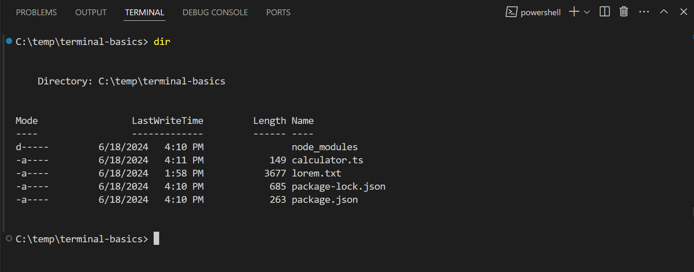
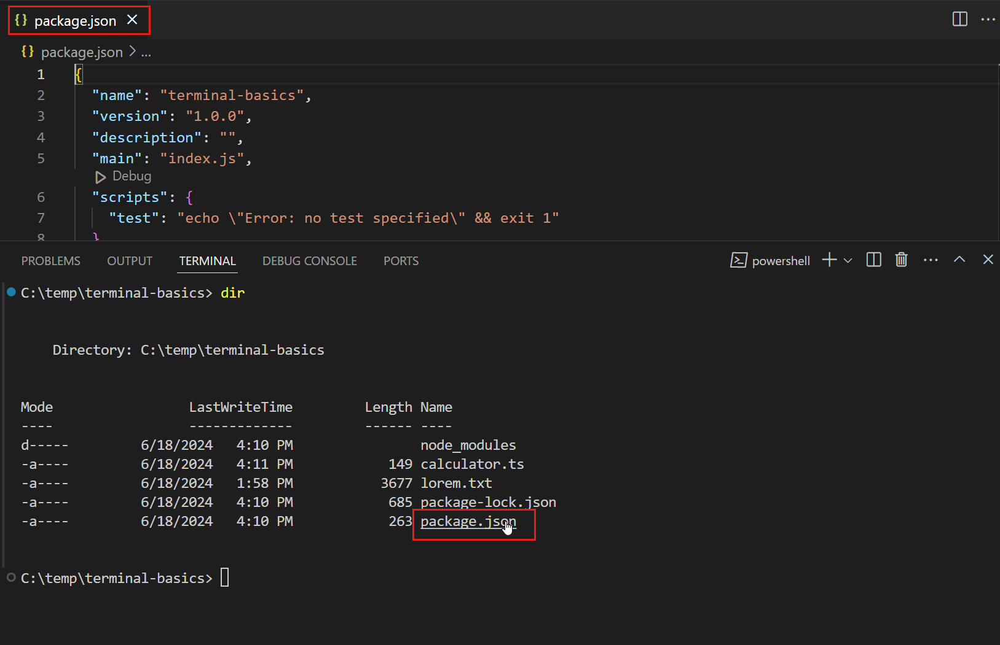
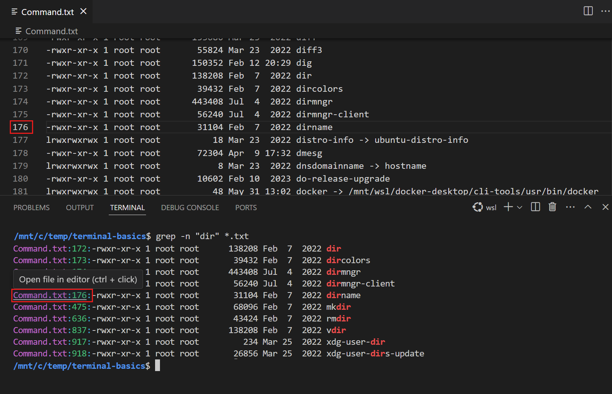
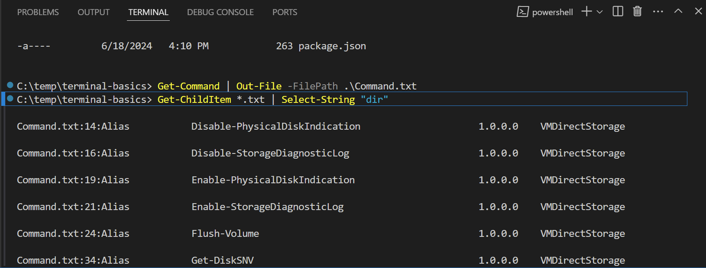
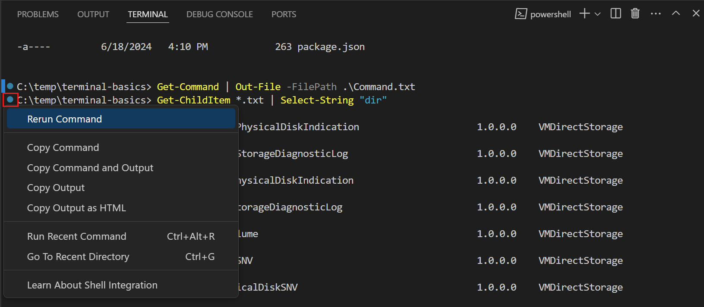
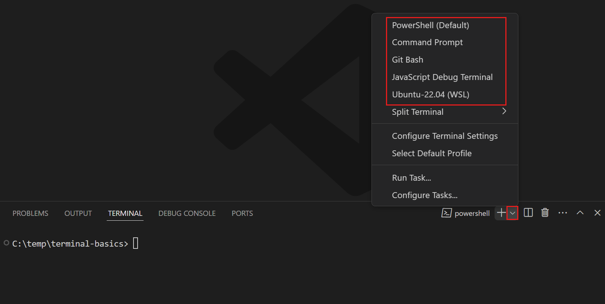
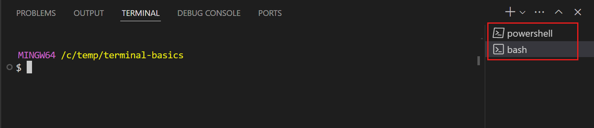
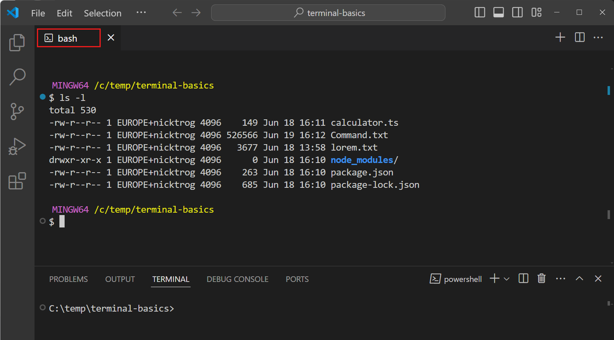
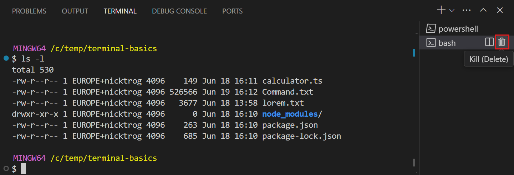

# 터미널 시작하기 {#getting-started-with-the-terminal}

Visual Studio Code에는 완전한 기능을 갖춘 통합 터미널이 포함되어 있습니다. 독립형 터미널처럼 `echo`, `ls`, `git`과 같은 명령을 실행할 수 있습니다. VS Code의 터미널은 워크스페이스 파일에 대한 링크 및 오류 감지와 같은 기능을 지원하기 위해 편집기와 통합됩니다.

터미널은 컴퓨터에 설치된 다양한 셸을 사용할 수 있습니다. 셸은 운영 체제와 상호 작용하여 명령을 해석하고 실행하는 프로그램입니다. 셸의 예로는 Bash, Zsh, PowerShell 등이 있습니다.

이 튜토리얼은 Visual Studio Code에서 터미널을 사용하는 기본 사항을 안내합니다.

## 터미널에서 첫 번째 명령 실행 {#run-your-first-command-in-the-terminal}

코드를 작성하는 동안 애플리케이션을 빌드, 테스트 또는 배포하기 위해 셸 명령을 실행해야 할 수 있습니다. VS Code의 터미널을 사용하면 편집기를 떠나지 않고 이러한 명령을 실행할 수 있습니다.

터미널을 시작하려면:

1. VS Code를 시작하고 폴더나 워크스페이스를 엽니다.

1. 메뉴 모음에서 **View** > **Terminal**을 선택하거나 `` Ctrl+` `` 키보드 단축키를 눌러 터미널을 엽니다.

   운영 체제 구성에 따라 터미널은 Bash, PowerShell 또는 Zsh와 같은 기본 셸로 열립니다. 셸의 작업 디렉터리는 워크스페이스 폴더의 루트에서 시작됩니다.

   

1. 현재 디렉터리의 파일을 나열하기 위해 `ls`와 같은 기본 명령을 입력합니다.

   터미널은 독립형 터미널과 유사하게 명령의 출력을 표시하지만, 편집기 내에 머물러 있습니다.

   

   :::tip
   터미널 패널의 경계를 드래그하거나 `^` 아이콘을 선택하여 패널을 최대화하여 터미널을 확장할 수 있습니다.
   :::

## 명령 출력과 상호 작용 {#interact-with-command-output}

VS Code의 터미널은 명령 출력과 상호 작용할 수 있는 기능도 제공합니다. 명령은 종종 열거나 탐색하려는 파일 경로나 URL을 출력합니다. 예를 들어, 컴파일러나 린터는 파일 경로와 줄 번호가 포함된 오류 메시지를 반환할 수 있습니다. 해당 파일을 검색하는 대신 터미널 출력에서 링크를 선택하여 편집기에서 파일을 직접 열 수 있습니다.

터미널에서 명령 출력과 상호 작용하는 방법을 살펴보겠습니다:

1. 이전에 `ls` 명령을 실행한 터미널을 엽니다.

1. 터미널에서 `Ctrl`/`Cmd` 키를 누르고 파일 이름 위로 마우스를 이동한 다음 링크를 선택합니다.

   출력에서 텍스트 위로 마우스를 이동하면 링크로 변경되는 것을 확인할 수 있습니다. 파일 이름을 선택하면 VS Code가 선택한 파일을 편집기에서 엽니다.

   

   터미널 출력의 모든 텍스트는 클릭할 수 있습니다. 터미널에서 하이퍼링크를 선택하면 기본 브라우저에서 링크가 열립니다. 다른 텍스트의 경우 VS Code는 해당 텍스트가 포함된 파일을 워크스페이스에서 검색하려고 합니다.

1. 사용 가능한 셸 명령 목록이 포함된 `Command.txt` 파일을 생성하기 위해 다음 명령을 실행합니다.

   - PowerShell

     ```powershell
     Get-Command | Out-File -FilePath .\Command.txt
     ```

   - Bash / Zsh

     ```bash
     ls -l /usr/bin > Command.txt
     ```

1. `Command.txt` 파일에서 명령을 검색하기 위해 다음 명령을 입력합니다.

   - PowerShell

     ```powershell
     Get-ChildItem *.txt | Select-String "dir"
     ```

   - Bash / Zsh

     ```bash
     grep -n "dir" *.txt
     ```

   명령 출력에는 검색 결과가 발견된 파일 이름과 줄 번호가 포함되어 있습니다. 터미널은 이 텍스트를 링크로 식별합니다.

1. 링크 중 하나를 선택하여 해당 파일의 특정 줄에서 파일을 편집기에서 엽니다.

   

터미널의 다양한 [링크 유형에 대해 자세히 알아보세요](/docs/terminal/basics.md#links).

## 이전 명령으로 이동 {#navigate-to-previous-commands}

터미널에서 작업하는 동안 이전 명령과 그 출력을 검토하거나 명령을 다시 실행해야 할 수 있습니다. 키보드 단축키를 사용하여 이전 명령으로 빠르게 이동할 수 있습니다.

이전 명령으로 이동하려면:

1. 이전에 사용한 터미널을 엽니다.

1. `Ctrl+Up` 키보드 단축키를 눌러 터미널 기록에서 이전 명령으로 스크롤합니다.

   터미널이 이전 명령으로 스크롤되고 강조 표시되는 것을 확인할 수 있습니다.

   

   `Ctrl+Up`를 여러 번 누르면 터미널이 명령 기록을 더 멀리 스크롤합니다. `Ctrl+Down` 키보드 단축키를 사용하여 반대 방향으로 이동할 수 있습니다.

1. 이전에 실행된 명령 옆에 있는 구터에 원형 아이콘이 표시될 수 있습니다. 원형 아이콘을 선택한 다음 **Rerun Command**을 선택하여 명령을 다시 실행합니다.

   

[명령 기록을 탐색하는 방법에 대해 자세히 알아보세요](/docs/terminal/shell-integration.md#command-navigation).

## 다른 셸에서 명령 실행 {#run-commands-in-another-shell}

터미널은 여러 터미널을 동시에 열 수 있도록 지원합니다. 예를 들어, 하나의 터미널을 Git 명령 실행에 전용하고 다른 터미널을 빌드 스크립트 실행에 사용할 수 있습니다. 또한 선호에 따라 다른 셸에서 명령을 실행할 수 있습니다.

다른 셸에서 새 터미널을 추가하려면:

1. 터미널 패널에서 `˅` 아이콘을 선택하여 터미널 드롭다운을 열고 사용 가능한 셸 중 하나를 선택합니다.

   :::note
   사용 가능한 셸은 컴퓨터에 설치된 셸에 따라 다릅니다.
   :::

   

   선택한 셸로 새 터미널이 열리며 이전에 했던 것처럼 명령을 입력할 수 있습니다.

   :::tip
   기본 셸에 대한 새 터미널을 만들려면 `+` 아이콘을 선택하거나 `` Ctrl+Shift+` `` 키보드 단축키를 사용하거나 메뉴 모음에서 **Terminal** > **New Terminal**을 선택할 수도 있습니다.
   :::

1. 터미널 패널의 목록에서 열린 터미널을 볼 수 있습니다.

   

   다른 터미널로 전환하려면 터미널 목록에서 선택합니다.

   :::tip
   터미널 목록에서 터미널을 마우스 오른쪽 버튼으로 클릭하고 **Rename**을 선택하여 터미널 이름을 변경할 수 있습니다.
   :::

[다른 셸에서 명령을 실행하는 방법에 대해 자세히 알아보세요](/docs/terminal/shell-integration.md#change-shell).

1. 터미널 목록에서 터미널을 편집기 영역으로 드래그합니다.

   터미널이 편집기 탭으로 이동되며 다른 편집기 탭처럼 배치할 수 있습니다. 예를 들어, 터미널 탭을 VS Code 창 밖으로 드래그하여 떠 있는 창으로 만들 수 있습니다. [사용자 정의 레이아웃에 대해 자세히 알아보세요](/docs/editor/custom-layout.md#editor).

   

1. 터미널 목록 위로 마우스를 이동할 때 휴지통 아이콘을 선택하여 열린 터미널을 닫습니다.

   

[터미널 관리에 대해 자세히 알아보세요](/docs/terminal/basics.md#managing-terminals).

## 다음 단계 {#next-steps}

이 튜토리얼에서는 VS Code의 터미널을 시작하는 방법을 배웠습니다. 다음은 탐색할 수 있는 몇 가지 추가 주제입니다:

- [터미널의 기본 개념 및 기능](/docs/terminal/basics.md)을 배우세요
- [터미널 프로필 생성 및 관리](/docs/terminal/profiles.md)에 대해 알아보세요
- 터미널의 [모양과 동작을 사용자 정의하는 다양한 방법](/docs/terminal/appearance.md)을 발견하세요
