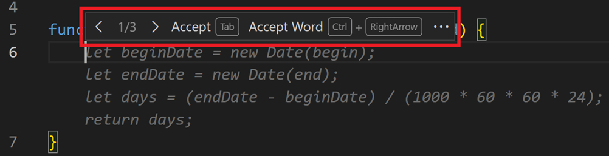

# GitHub Copilot을 이용한 VS Code에서의 코드 완성 {#code-completions-with-github-copilot-in-vs-code}

GitHub Copilot은 AI 기반의 페어 프로그래머 역할을 하며, 코드, 주석, 테스트 등을 완성하기 위한 제안을 자동으로 제공합니다. 코드를 작성하는 동안 편집기에서 직접 이러한 제안을 제공하며, 다양한 프로그래밍 언어와 프레임워크와 함께 작동할 수 있습니다.

Copilot은 두 가지 종류의 제안을 제공합니다:

* **코드 완성** - 편집기에서 입력을 시작하면 Copilot이 귀하의 코딩 스타일에 맞는 코드 제안을 제공하고 기존 코드를 고려합니다.

* **다음 편집 제안(미리보기)** - Copilot 다음 편집 제안(Copilot NES)으로 다음 코드 편집을 예측합니다. 현재 진행 중인 편집을 기반으로 Copilot NES는 다음에 원하는 편집의 위치와 그 편집이 무엇이어야 하는지를 예측합니다.

## 시작하기 {#getting-started}

1. GitHub Copilot 확장 프로그램을 설치합니다.

    > <a class="install-extension-btn" href="vscode:extension/GitHub.copilot?referrer=docs-copilot-ai-powered-suggestions">GitHub Copilot 확장 프로그램 설치</a>

1. Copilot을 사용하기 위해 GitHub 계정으로 로그인합니다.

    > [!TIP]
    > 아직 Copilot 구독이 없다면, [Copilot 무료 플랜](https://github.com/github-copilot/signup)에 가입하여 무료로 Copilot을 사용할 수 있으며, 월별 완성과 채팅 상호작용의 한도를 받을 수 있습니다.

1. [Copilot 빠른 시작 가이드](/docs/copilot/getting-started.md)를 통해 VS Code에서 Copilot의 주요 기능을 알아보세요.

## 인라인 제안 {#inline-suggestions}

Copilot은 입력하는 동안 코드 제안을 제공합니다: 현재 줄의 완성일 수도 있고, 전체 새로운 코드 블록일 수도 있습니다. 제안의 전체 또는 일부를 수락하거나 계속 입력하고 제안을 무시할 수 있습니다.

다음 예제에서 Copilot이 흐릿한 *유령 텍스트*를 사용하여 `calculateDaysBetweenDates` JavaScript 함수의 구현을 제안하는 방법을 확인하세요:

인라인 제안이 표시되면 `kbstyle(Tab)` 키로 수락할 수 있습니다.

Copilot은 귀하의 코드에 이미 있는 코드 제안에 대해 동일한 코딩 스타일을 적용하려고 합니다. 다음 예제에서 Copilot은 제안된 `subtract` 메소드에 대해 `add` 메소드의 입력 매개변수 명명 규칙을 적용합니다.

### 제안의 일부 수락하기 {#partially-accepting-suggestions}

GitHub Copilot의 전체 제안을 수락하고 싶지 않을 수 있습니다. `kb(editor.action.inlineSuggest.acceptNextWord)` 키보드 단축키를 사용하여 제안의 다음 단어 또는 다음 줄을 수락할 수 있습니다.

### 대체 제안 {#alternative-suggestions}

주어진 입력에 대해 Copilot은 여러 개의 대체 제안을 제공할 수 있습니다. 제안 위에 마우스를 올려 다른 제안 중 하나를 선택할 수 있습니다.

### 코드 주석에서 제안 생성하기 {#generate-suggestions-from-code-comments}

Copilot이 제안을 제공하는 것에 의존하는 대신, 코드 주석을 사용하여 기대하는 코드에 대한 힌트를 제공할 수 있습니다. 예를 들어, 사용할 알고리즘이나 개념의 유형(예: "재귀 사용" 또는 "싱글톤 패턴 사용")을 지정하거나 클래스에 추가할 메소드와 속성을 지정할 수 있습니다.

다음 예제는 Copilot에게 학생을 나타내는 TypeScript 클래스를 생성하도록 지시하는 방법을 보여줍니다. 메소드와 속성에 대한 정보를 제공합니다:

## 다음 편집 제안(미리보기) {#next-edit-suggestions-preview}

인라인 제안은 코드 섹션을 자동 완성하는 데 훌륭합니다. 그러나 대부분의 코딩 활동이 기존 코드를 편집하는 것이므로, Copilot 코드 완성이 커서와 멀리 있는 편집을 도와주는 자연스러운 진화입니다. 편집은 종종 고립되어 이루어지지 않으며, 다양한 시나리오에서 어떤 편집이 필요한지에 대한 논리적 흐름이 있습니다. Copilot 다음 편집 제안(Copilot NES)은 이러한 진화입니다.

<video src="./images/inline-suggestions/nes-video.mp4" title="Copilot NES 비디오" controls poster="./images/inline-suggestions/point3d.png"></video>

귀하가 진행 중인 편집을 기반으로 Copilot NES는 다음에 원하는 편집의 위치와 그 편집이 무엇이어야 하는지를 예측합니다. Copilot NES는 귀하가 작업 흐름을 유지하도록 도와주며, 현재 작업과 관련된 미래 변경 사항을 제안합니다. `kbstyle(Tab)`을 눌러 Copilot의 제안을 빠르게 탐색하고 수락할 수 있습니다. 제안은 단일 기호, 전체 줄 또는 여러 줄에 걸쳐 있을 수 있으며, 이는 잠재적 변경의 범위에 따라 다릅니다.

### 편집 제안 활성화 {#enabling-edit-suggestions}

Copilot NES는 현재 미리보기 상태입니다. VS Code 설정 `setting(github.copilot.nextEditSuggestions.enabled)`를 통해 활성화할 수 있습니다:

1. VS Code 설정 편집기 열기 (`kb(workbench.action.openSettings)`)
1. `github.copilot.nextEditSuggestions.enabled` 검색
1. 설정 활성화

> [!IMPORTANT]
> Copilot Business 또는 Enterprise 사용자라면, 귀하의 조직의 관리자가 귀하가 편집기에서 `setting(github.copilot.nextEditSuggestions.enabled)`를 설정하는 것 외에도 Copilot Editor Preview Features 사용에 동의해야 합니다. 귀하의 조직에서 Copilot 관리 정책에 대해 더 알아보세요. [조직에서 Copilot 관리](https://docs.github.com/en/copilot/managing-copilot/managing-github-copilot-in-your-organization/managing-policies-for-copilot-in-your-organization#enabling-copilot-features-in-your-organization).

### 편집 제안 탐색 및 수락하기 {#navigate-and-accept-edit-suggestions}

`kbstyle(Tab)` 키를 사용하여 제안된 코드 변경 사항을 빠르게 탐색할 수 있으며, 다음 관련 편집을 찾는 데 시간을 절약할 수 있습니다(파일이나 참조를 수동으로 검색할 필요 없음). 그런 다음 `kbstyle(Tab)` 키를 다시 눌러 제안을 수락할 수 있습니다.

여백에 화살표가 있으면 편집 제안이 있는지 표시합니다. 화살표 위에 마우스를 올리면 키보드 단축키 및 설정 구성을 포함한 편집 제안 메뉴를 탐색할 수 있습니다:

편집 제안이 현재 편집기 뷰 아래에 있는 경우, 화살표는 오른쪽이 아닌 아래를 가리킵니다:

> [!IMPORTANT]
> VS Code vim 확장을 사용하는 경우, `keybindings.json`을 업데이트하는 것이 좋습니다. [GitHub 이슈에서 더 알아보세요](https://github.com/VSCodeVim/Vim/issues/9459#issuecomment-2648156285).

### 다음 편집 제안의 사용 사례 {#use-cases-for-next-edit-suggestions}

**실수 잡기 및 수정하기**

* **Copilot은 오타와 같은 간단한 실수를 도와줍니다.** 누락되거나 바뀐 글자가 있는 경우 수정 사항을 제안합니다. 예를 들어 `cont x = 5` 또는 `conts x = 5`는 `const x = 5`여야 합니다.

    

* **Copilot은 논리의 더 어려운 실수도 도와줄 수 있습니다**, 예를 들어 반전된 삼항 표현식:

    

    또는 `||` 대신 `&&`를 사용해야 했던 비교:

    

**의도 변경하기**

* **Copilot은 새로운 의도 변경에 맞는 나머지 코드의 변경을 제안합니다.** 예를 들어, 클래스를 `Point`에서 `Point3D`로 변경할 때, Copilot은 클래스 정의에 `z` 변수를 추가하라고 제안합니다. 변경을 수락한 후, Copilot NES는 거리 계산에 `z`를 추가하라고 다음에 추천합니다:

    
    <!-- 

     -->

**새 변수 또는 논리 추가하기**

* **새로 추가된 인수, 변수 또는 함수 사용하기**. Copilot은 방금 추가한 새 코드를 사용하는 데 도움을 줍니다. 이는 실제 메소드에서 새 메소드 매개변수를 호출하는 것과 같은 작은 변경일 수 있습니다.

    더 복잡할 수도 있습니다: VS Code 확장의 `extension.ts`에 새 명령을 추가한 경우, Copilot은 먼저 `extension.ts`에서 명령을 정리하라고 제안합니다. 그런 다음 `package.json`을 열면 Copilot이 해당 명령을 등록하라고 제안합니다:

    

    <!-- 
     -->

**리팩토링**

* **파일에서 변수를 한 번 이름을 바꾸면, Copilot은 다른 모든 곳에서 업데이트하라고 제안합니다.** 새 이름이나 명명 패턴을 사용하면, Copilot은 후속 코드를 유사하게 업데이트하라고 제안합니다.

    

* **코드 스타일 일치**. 일부 코드를 복사하여 붙여넣은 후, Copilot은 붙여넣은 현재 코드에 맞게 조정하는 방법을 제안합니다.

### 편집 제안 구성 옵션 {#edit-suggestions-configuration-options}

편집 제안을 추가로 구성하려면 다음 설정을 조정하세요:

* `setting(editor.inlineSuggest.edits.codeShifting)`: Copilot NES가 제안을 표시할 때 코드를 이동하지 않도록 이 설정을 비활성화합니다.

* `setting(editor.inlineSuggest.edits.renderSideBySide)`:

     * **자동(기본값)**: 뷰포트에 충분한 공간이 있는 경우 더 큰 편집 제안을 나란히 표시하고, 그렇지 않으면 관련 코드 아래에 제안을 표시합니다.
     * **절대 안 함**: 제안을 나란히 표시하지 않고 항상 관련 코드 아래에 제안을 표시합니다.

## 팁 & 요령 {#tips-tricks}

### 컨텍스트 {#context}

관련 인라인 제안을 제공하기 위해 Copilot은 편집기에서 현재 및 열린 파일을 살펴보아 컨텍스트를 분석하고 적절한 제안을 생성합니다. Copilot을 사용할 때 VS Code에서 관련 파일을 열어 두면 이 컨텍스트를 설정하는 데 도움이 되며, Copilot이 프로젝트의 더 큰 그림을 파악할 수 있습니다.

### 코드 완성 활성화 또는 비활성화 {#enable-or-disable-code-completions}

모든 언어에 대해 또는 특정 언어에 대해서만 코드 완성을 일시적으로 활성화하거나 비활성화할 수 있습니다.

코드 완성을 활성화하거나 비활성화하려면:

1. VS Code 제목 표시줄에서 Copilot 메뉴를 선택한 다음 **코드 완성 구성...**을 선택합니다.

    

1. 모든 언어에 대한 완성을 활성화하거나 비활성화하려면 각각 **완성 활성화** 또는 **완성 비활성화**를 선택합니다.

1. 현재 파일의 언어에 대한 완성을 활성화하거나 비활성화하려면 **\<언어\>에 대한 완성 활성화** 또는 **\<언어\>에 대한 완성 비활성화**를 선택합니다.

### AI 모델 변경하기 {#change-the-ai-model}

다양한 대형 언어 모델(LLM)은 서로 다른 유형의 데이터로 훈련되며, 서로 다른 능력과 강점을 가질 수 있습니다. 코드 완성을 생성하는 데 사용되는 언어 모델을 변경할 수 있습니다.

코드 완성에 사용되는 모델을 변경하려면:

1. VS Code 제목 표시줄의 Copilot 메뉴에서 **코드 완성 구성...**을 선택합니다.

    

1. **완성 모델 변경...**을 선택한 다음 목록에서 모델 중 하나를 선택합니다.

> [!NOTE]
> 사용 가능한 모델 목록은 시간이 지남에 따라 다를 수 있습니다. Copilot Business 또는 Enterprise 사용자라면, 관리자가 GitHub.com의 [Copilot 정책 설정](https://docs.github.com/en/enterprise-cloud@latest/copilot/managing-copilot/managing-github-copilot-in-your-organization/managing-policies-for-copilot-in-your-organization#enabling-copilot-features-in-your-organization)에서 `Editor Preview Features`를 사용하도록 설정해야 특정 모델을 조직에 대해 활성화할 수 있습니다.

## 설정 {#settings}

### 코드 완성 설정 {#code-completions-settings}

* `setting(editor.inlineSuggest.enabled)` - 인라인 완성을 활성화하거나 비활성화합니다.

* `setting(editor.inlineSuggest.fontFamily)` - 인라인 완성을 위한 글꼴을 구성합니다.

* `setting(editor.inlineSuggest.showToolbar)` - 인라인 완성을 위한 툴바를 활성화하거나 비활성화합니다.

* `setting(editor.inlineSuggest.syntaxHighlightingEnabled)` - 인라인 완성을 위한 구문 강조를 활성화하거나 비활성화합니다.

### 다음 편집 제안 설정 {#next-edit-suggestions-settings}

* `setting(github.copilot.nextEditSuggestions.enabled)` - Copilot 다음 편집 제안(Copilot NES)을 활성화합니다.

* `setting(editor.inlineSuggest.edits.codeShifting)` - Copilot NES가 제안을 표시하기 위해 코드를 이동할 수 있는지 구성합니다.

* `setting(editor.inlineSuggest.edits.renderSideBySide)` - Copilot NES가 가능할 경우 더 큰 제안을 나란히 표시할 수 있는지, 또는 항상 관련 코드 아래에 더 큰 제안을 표시해야 하는지 구성합니다.

## 다음 단계 {#next-steps}

* [Copilot 빠른 시작 가이드](/docs/copilot/getting-started-chat.md)에서 주요 기능을 알아보세요.

* [Copilot Chat](/docs/copilot/copilot-chat.md)와 함께 AI 채팅 대화를 사용하세요.

* YouTube의 [VS Code Copilot 시리즈](https://www.youtube.com/playlist?list=PLj6YeMhvp2S5_hvBl2SE-7YCHYlLQ0bPt)에서 비디오를 시청하세요.
