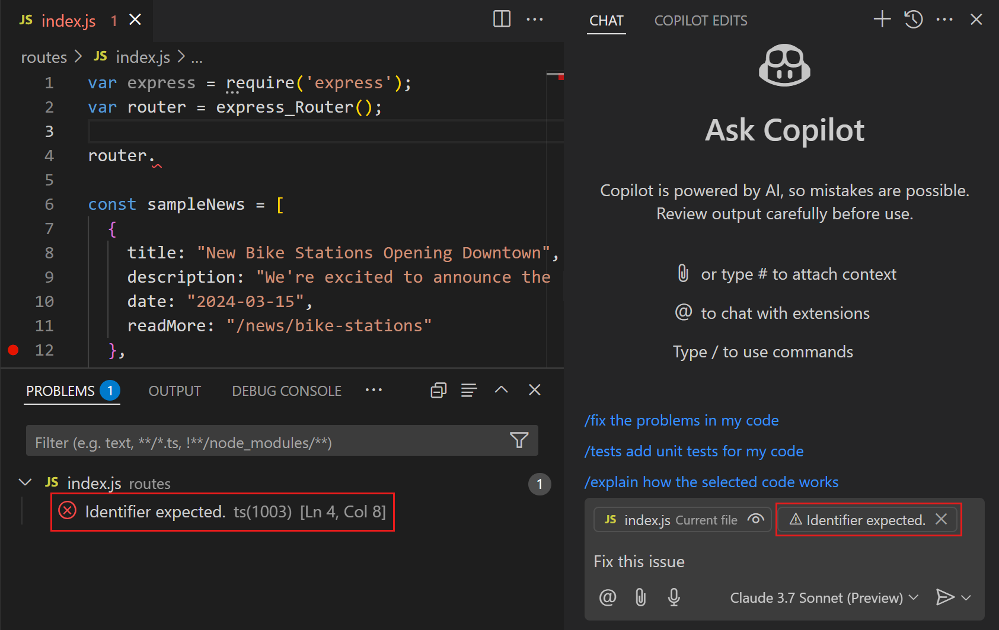

# Copilot 채팅 컨텍스트 {#copilot-chat-context}

이 문서에서는 Visual Studio Code에서 Copilot 채팅 프롬프트에 컨텍스트를 추가하는 방법을 설명하여 Copilot이 최상의 관련 답변을 제공할 수 있도록 돕습니다. Copilot은 파일, 기호, 터미널 명령 출력 등 다양한 [컨텍스트 유형](#chat-context-types)을 지원합니다.

Copilot은 자연어 채팅 프롬프트를 기반으로 질문의 의도와 범위를 파악하려고 합니다. Copilot이 최상의 관련 답변을 제공할 수 있도록 [채팅 프롬프트에 컨텍스트를 추가](#add-context-to-your-chat-prompt)하거나 [Copilot이 자동으로 올바른 파일을 찾도록](#let-copilot-find-the-right-files-automatically) 할 수 있습니다.

## 채팅 프롬프트에 컨텍스트 추가하기 {#add-context-to-your-chat-prompt}

채팅 프롬프트에 컨텍스트를 추가하는 방법은 여러 가지가 있습니다:

* VS Code는 현재 활성화된 편집기를 자동으로 컨텍스트로 추가합니다. 편집기에서 코드 블록을 선택한 경우, 해당 선택만 컨텍스트로 추가됩니다.

    현재 요청에 대해 활성 편집기를 추가하지 않으려면 컨텍스트 항목 옆의 비활성화(_눈 모양_) 아이콘을 선택하십시오. `setting(chat.implicitContext.enabled)` 설정을 사용하여 모든 요청에 대해 활성 편집기를 자동으로 추가할지 여부를 구성할 수 있습니다.

    

* **컨텍스트 추가** (종이 클립) 아이콘 (Copilot Chat) 또는 **파일 추가** 버튼 (Copilot Edits)을 선택한 다음, 빠른 선택에서 컨텍스트 유형을 선택합니다.

    

    **코드베이스** 또는 **터미널 선택**과 같은 미리 정의된 컨텍스트 유형을 첨부하거나 작업 공간에서 파일, 폴더 또는 기호를 선택할 수 있습니다.

    > [!TIP]
    > 첨부 빠른 선택에서 여러 항목을 빠르게 추가하려면 `kbstyle(Up)` 및 `kbstyle(Down)` 키를 사용하여 목록을 탐색하고, `kbstyle(Right)` 키를 사용하여 항목을 컨텍스트로 추가한 다음, 다른 항목에 대해서도 반복합니다.

* 탐색기 또는 검색 뷰에서 파일에 대해 **Copilot** > **채팅에 파일 추가**를 선택하거나 편집기에서 텍스트 선택에 대해 **채팅에 선택 추가**를 선택합니다.

* 채팅 프롬프트에서 `#` 문자를 입력하여 채팅 변수를 사용하여 컨텍스트를 참조합니다.

    예를 들어, `#selection`을 사용하여 현재 편집기 선택을 채팅 프롬프트에 추가하고, `#file`을 사용하여 작업 공간 파일을 추가하거나, `#sym`을 사용하여 작업 공간의 기호를 추가합니다.

    

    > [!TIP]
    > `#`를 입력하고 파일이나 기호를 선택하기 위한 IntelliSense 트리거로 사용하십시오.

* 편집기 탭이나 탐색기 뷰, 검색 뷰 또는 편집기 빵 부스러기에서 파일이나 폴더를 채팅 뷰로 드래그 앤 드롭합니다.

    <video src="images/copilot-chat/copilot-attach-dnd.mp4" title="채팅으로 파일과 편집기를 드래그하는 모습" autoplay loop controls muted></video>

> [!NOTE]
> 가능하다면 파일을 첨부할 때 파일의 전체 내용이 포함됩니다. 만약 컨텍스트 창에 맞지 않을 정도로 크다면, 함수와 구현 없이 설명만 포함된 파일의 개요가 포함됩니다. 개요도 너무 크면 파일이 프롬프트의 일부가 되지 않습니다.

## Copilot이 자동으로 올바른 파일 찾기 {#let-copilot-find-the-right-files-automatically}

개별 파일을 수동으로 추가하는 대신, Copilot이 코드베이스에서 올바른 파일을 자동으로 찾도록 할 수 있습니다. 이는 어떤 파일이 질문과 관련이 있는지 모를 때 유용합니다.

Copilot이 자동으로 올바른 파일을 찾도록 하려면 프롬프트에 `#codebase`를 추가하거나 컨텍스트 유형 목록에서 **코드베이스**를 선택합니다.

최상의 결과를 얻으려면 `setting(github.copilot.chat.codesearch.enabled)` _(미리보기)_ 설정을 활성화해야 합니다.

## 문제 해결을 위한 컨텍스트 추가하기 {#add-context-for-fixing-problems}

코드에서 문제가 발생하거나 테스트 실행 시 실패가 발생할 때, Copilot이 최상의 답변을 제공할 수 있도록 채팅 프롬프트에 특정 컨텍스트를 추가할 수 있습니다.

* **문제** 패널에서 항목을 드래그 앤 드롭하여 해당 문제를 컨텍스트로 프롬프트에 첨부합니다.

    또는 컨텍스트 유형 목록에서 **문제...**를 선택한 다음, 빠른 선택에서 특정 문제를 선택합니다.

    

* **테스트 실패** 컨텍스트 유형을 선택하여 테스트 실패 세부 정보를 프롬프트에 컨텍스트로 추가합니다.

* 컨텍스트 유형 목록에서 **터미널 마지막 명령**을 선택하거나 `#terminalLastCommand`를 입력하여 터미널에서 실행된 마지막 명령의 출력을 첨부합니다.

## 채팅 컨텍스트 유형 {#chat-context-types}

Copilot은 다음과 같은 컨텍스트 유형을 지원합니다:

* 파일 - 프롬프트에 작업 공간의 특정 파일 포함
* 폴더 - 프롬프트에 해당 폴더의 파일을 포함하기 위해 폴더 추가
* 기호 - 프롬프트에 작업 공간의 기호 추가
* 코드베이스 - Copilot이 올바른 파일을 자동으로 찾도록 함
* 편집기 또는 터미널 선택 - 프롬프트에 편집기 또는 터미널의 텍스트 선택 포함
* 터미널 명령 출력 - 터미널에서 실행된 마지막 명령의 출력 포함
* 문제 - 문제 패널의 특정 코드 문제를 프롬프트에 포함
* 테스트 실패 - 프롬프트에 테스트 실패의 세부 정보 포함

## 관련 리소스 {#related-resources}

* [Copilot Chat](/docs/copilot/copilot-chat.md)를 사용하여 Copilot과 상호작용합니다.
* [Copilot Edits](/docs/copilot/copilot-edits.md)를 사용하여 여러 파일에서 편집을 수행합니다.
---