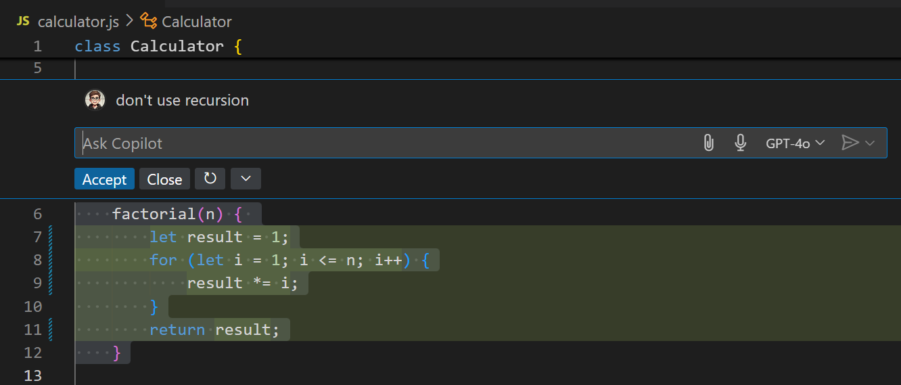
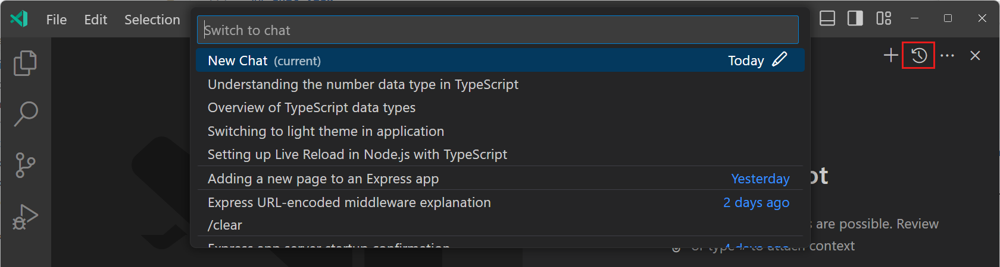

# VS Code에서 Copilot Chat 사용하기 {#use-copilot-chat-in-vs-code}

Visual Studio Code에서 Copilot Chat을 사용하여 채팅을 통해 질문하고 코드 제안을 받으며, 코드 이해도를 높이고 편집기를 구성할 수 있습니다. 문서나 온라인 포럼에서 답을 찾는 대신, VS Code에서 Copilot에 직접 질문하고 즉시 제안을 코드베이스에 적용할 수 있습니다.

제안을 받기 위해 채팅을 사용하는 대신, Copilot은 프로젝트의 여러 파일에서 직접 편집을 수행할 수도 있습니다. 이 경우, [Copilot Edits](/docs/copilot/copilot-edits.md)를 사용하는 것을 고려할 수 있습니다. 기존의 채팅 대화를 쉽게 [Copilot Edits로 이동할 수 있습니다](/docs/copilot/copilot-edits.md#send-a-chat-request-to-copilot-edits).

> [!TIP]
> 아직 Copilot 구독이 없다면, [Copilot 무료 플랜](https://github.com/github-copilot/signup)에 가입하여 무료로 Copilot을 사용할 수 있으며, 월별 완료 및 채팅 상호작용 한도를 받을 수 있습니다.

## VS Code에서 Copilot Chat 접근하기 {#access-copilot-chat-in-vs-code}

작업 흐름에 따라 VS Code에서 Copilot에 프롬프트를 제출하는 방법은 여러 가지가 있습니다.

* [**채팅 보기**](#chat-view): 질문을 도와주고 코드 제안을 제공하는 AI 어시스턴트를 사이드에 두세요 (`kb(workbench.action.chat.open)`).
* [**인라인 채팅**](#inline-chat): 편집기나 통합 터미널에서 직접 인라인 채팅 대화를 시작하여 제안을 즉시 받으세요 (`kb(workbench.action.terminal.chat.start)`).
* [**빠른 채팅**](#quick-chat): 간단한 질문을 하고 작업으로 돌아가세요 (`kb(workbench.action.quickchat.toggle)`).

채팅 경험에 접근하려면 해당 키보드 단축키를 사용하거나 VS Code 제목 표시줄의 Copilot 메뉴를 사용하세요.

## 첫 번째 프롬프트 제출하기 {#submit-your-first-prompt}

Copilot Chat에 코드 제안을 요청하거나 코드 이해도를 높이거나 프로젝트의 디버깅을 설정하거나 VS Code 구성을 도와달라고 요청할 수 있습니다.

1. (`kb(workbench.action.chat.open)`) 키보드 단축키를 사용하여 채팅 보기를 열거나 제목 표시줄의 Copilot 메뉴에서 **채팅 열기**를 선택하세요.

    활성 편집기에서 직접 편집을 위해 채팅을 사용하고 싶다면 대신 [인라인 채팅](#inline-chat)을 사용하세요 (`kb(workbench.action.terminal.chat.start)`).

2. 채팅 입력 필드에 프롬프트를 입력하거나 프롬프트 제안 중 하나를 선택하세요.

    몇 가지 예시 프롬프트:

    * 코딩 및 기술 개념에 대한 질문하기 (_"연결 리스트란 무엇인가요?"_, _"인기 있는 웹 프레임워크 10개"_)
    * 코딩 문제를 해결하는 최선의 방법에 대한 아이디어 브레인스토밍하기 (_"내 프로젝트에 인증을 추가하는 방법은?"_)
    * 코드 블록 설명하기 (_"@workspace /explain"_, _"이 코드는 무엇을 하나요?"_)
    * 코드 수정 제안하기 (_"@workspace /fix"_, _"이 메서드는 FileNotFoundException을 발생시킵니다."_)
    * 단위 테스트 케이스 또는 코드 문서 생성하기 (_"@workspace /tests"_, _"@workspace /doc"_)
    * VS Code 설정에 대해 질문하기 (_@vscode 미니맵을 비활성화하려면 어떻게 하나요?_)

    더 많은 프롬프트 예시는 GitHub 문서의 [Copilot Chat 요리책](https://docs.github.com/en/copilot/example-prompts-for-github-copilot-chat)을 참조하세요.

3. Copilot의 응답을 검토하세요.

    응답에는 텍스트, 코드 블록, 버튼, 코드 기호에 대한 링크, 파일 트리 또는 기타 풍부한 내용이 포함될 수 있습니다. 코드 제안을 [코드베이스에 적용하는 방법](#apply-a-code-block-from-chat)에 대한 자세한 정보를 확인하세요.

    응답에 대해 Copilot이 사용한 리소스를 보려면 채팅 응답에서 **사용된 n 리소스** 드롭다운을 선택하세요. [채팅 프롬프트에 컨텍스트를 추가하여](#add-context-to-your-chat-prompt) Copilot이 더 관련성 높은 답변을 제공하도록 도와줄 수 있습니다.

4. 선택적으로 후속 질문을 하여 응답을 다듬으세요.

    대화를 계속 진행하면서 Copilot은 [채팅 메시지 및 응답의 기록](#chat-history)을 유지합니다.

    새로운 채팅 세션을 시작하려면 채팅 보기에서 **새 채팅** (`kbstyle(+)`) 버튼 (`kb(workbench.action.chat.newChat)`)을 사용하세요.

> [!TIP]
> 채팅 입력 필드에 `/help`를 입력하여 GitHub Copilot 및 Copilot Chat과 상호작용하는 방법에 대한 도움을 받을 수 있습니다.

## AI 모델 변경하기 {#change-the-ai-model}

다양한 대형 언어 모델(LLM)은 서로 다른 유형의 데이터로 훈련되며, 각기 다른 능력과 강점을 가질 수 있습니다. Copilot을 사용하면 필요에 맞는 최상의 결과를 얻기 위해 다양한 모델 중에서 선택할 수 있습니다.

채팅 입력 필드의 모델 선택기를 사용하여 Copilot이 응답을 생성하는 데 사용하는 모델을 변경하세요.

사용 가능한 모델 목록은 Copilot 구독에 따라 다를 수 있으며 시간이 지남에 따라 변경될 수 있습니다. [사용 가능한 언어 모델](https://docs.github.com/en/copilot/using-github-copilot/ai-models/changing-the-ai-model-for-copilot-chat?tool=vscode)에 대한 자세한 정보는 GitHub Copilot 문서를 참조하세요.

## 채팅 프롬프트에 컨텍스트 추가하기 {#add-context-to-your-chat-prompt}

Copilot은 자연어 채팅 프롬프트를 기반으로 질문의 의도와 범위를 파악하려고 합니다. 채팅 응답에서 **사용된 n 리소스** 드롭다운을 선택하여 Copilot이 응답을 생성하는 데 사용한 리소스를 확인하세요.

Copilot이 최상의 관련 답변을 제공하도록 도와주기 위해 채팅 프롬프트에 컨텍스트를 추가하세요. 예를 들어, 특정 파일, 특정 코드 기호, 현재 편집기 선택 등을 첨부할 수 있습니다. [채팅 프롬프트에 컨텍스트 추가하기](/docs/copilot/copilot-chat-context.md)에 대한 자세한 내용을 확인하세요.

> [!TIP]
> 프롬프트에 `#codebase`를 추가하여 Copilot이 적절한 파일을 자동으로 찾도록 하세요. 최상의 결과를 얻으려면 `setting(github.copilot.chat.codesearch.enabled)` _(미리보기)_ 설정을 활성화하세요.

## 채팅 참가자 {#chat-participants}

_채팅 참가자_는 특정 전문 분야에서 도움을 줄 수 있는 도메인 전문가와 같습니다. 채팅 입력 필드에 '@'를 입력한 후 참가자 이름을 입력하여 채팅 참가자를 호출할 수 있습니다. 여러 내장 채팅 참가자가 있으며, 확장 프로그램도 채팅 참가자를 추가할 수 있습니다.

설치된 모든 채팅 참가자를 나열하려면 채팅 입력 필드에 `@`를 입력하세요.

| 내장 참가자      | 설명 |
|------------------|-------------|
| `@workspace`     | 작업 공간의 코드에 대해 알고 있습니다. 이를 사용하여 코드베이스를 탐색하고 관련 클래스, 파일 등을 찾을 수 있습니다.  **예시 프롬프트:** <ul><li>`@workspace 알림은 어떻게 예약되나요?`</li><li>`@workspace 뉴스레터 페이지와 유사한 양식 유효성 검사를 추가하세요`</li></ul> |
| `@vscode`        | VS Code의 기능, 설정 및 API에 대해 알고 있습니다.  **예시 프롬프트:** <ul><li>`@vscode vscode가 가짜로 파일을 열 때 그 이름이 무엇인가요? 그리고 어떻게 비활성화하나요?`</li></ul> |
| `@terminal`      | 통합 터미널 셸 및 그 내용에 대해 알고 있습니다.  **예시 프롬프트:** <ul><li>`@terminal 마지막 커밋을 되돌리는 방법`</li><li>`@terminal #terminalLastCommand에 대한 도움`</li></ul> |
| `@github`        | GitHub 리포지토리의 문제, PR 등에 대한 지식과 기술을 가지고 있습니다. Bing API를 사용하여 웹 검색도 수행할 수 있습니다. [GitHub 기술 사용하기](https://docs.github.com/en/copilot/using-github-copilot/asking-github-copilot-questions-in-your-ide#using-github-skills-for-copilot)에 대한 자세한 정보를 확인하세요.  **예시 프롬프트:** <ul><li>`@github 나에게 할당된 모든 열린 PR은 무엇인가요?`</li><li>`@github #web 최신 VS Code 버전은 무엇인가요?`</li></ul> |

### 확장 프로그램에서 제공하는 채팅 참가자 {#extension-contributed-chat-participants}

[Visual Studio Code Marketplace](https://marketplace.visualstudio.com/search?term=tag%3Achat-participant&target=VSCode&category=All%20categories&sortBy=Relevance) 또는 [GitHub Marketplace](https://github.com/marketplace)에서 추가 채팅 참가자를 설치할 수 있습니다.

VS Code 확장을 통해 제공되는 채팅 참가자는 _클라이언트 측_ 확장으로, VS Code 확장 API에 완전한 접근 권한을 가지고 있습니다.

GitHub 앱을 통해 제공되는 채팅 참가자는 로컬 머신에서 실행되지 않으며, 로컬 편집기 컨텍스트에 대한 접근을 명시적으로 요청해야 합니다. 채팅 참가자를 추가하는 GitHub 앱을 설치한 후, VS Code에서 해당 참가자를 `@-mention`할 때 처음으로 로컬 편집기 컨텍스트에 대한 접근을 승인하라는 요청을 받게 됩니다.

> [!NOTE]
> 개인 정보를 보호하기 위해 GitHub 앱의 채팅 참가자와 편집기 컨텍스트를 공유하는 기본 설정은 작업 공간별로 저장됩니다. '모든 작업 공간에 허용'을 선택하지 않는 한 그렇습니다.

다음은 채팅 참가자를 제공하는 VS Code 확장의 몇 가지 예시입니다. [Marketplace](https://marketplace.visualstudio.com/search?term=tag%3Achat-participant&target=VSCode&category=All%20categories&sortBy=Relevance)로 이동하거나 통합된 확장 보기 (`kb(workbench.view.extensions)`)를 사용하여 태그 `chat-participant` (`tag:chat-participant`)로 검색하세요.

## 슬래시 명령 {#slash-commands}

_슬래시 명령_은 복잡한 프롬프트를 작성할 필요 없이 특정 지침에 대한 단축키를 제공합니다. 프롬프트에서 슬래시 명령을 사용하려면 `/` 문자를 입력한 후 명령을 입력하세요. 채팅 참가자는 자신의 슬래시 명령을 추가할 수 있습니다.

예를 들어, `@workspace /new Express app with pug and typescript`는 TypeScript로 Pug 뷰 엔진을 사용하는 새로운 Express 앱을 생성하는 새로운 작업 공간을 만드는 단축키입니다.

일부 일반 내장 슬래시 명령은 다음과 같습니다:

* `/clear`: 새로운 채팅 세션 시작
* `/help`: GitHub Copilot 사용에 대한 도움 받기
* `@workspace /explain` (또는 `/explain`): 선택한 코드가 어떻게 작동하는지 설명하기
* `@workspace /fix` (또는 `/fix`): 선택한 코드의 문제에 대한 수정 제안하기
* `@workspace /new` (또는 `/new`): 새로운 작업 공간 또는 새 파일에 대한 코드를 스캐폴드하기

사용 가능한 모든 슬래시 명령을 나열하려면 채팅 입력 필드에 `/`를 입력하세요.

## 채팅 변수 {#chat-variables}

채팅 변수를 사용하여 프롬프트에 특정 컨텍스트를 포함하세요. 채팅 변수를 사용하려면 채팅 프롬프트 상자에 `#`를 입력한 후 채팅 변수를 입력하세요. 예를 들어, `#codebase`를 입력하여 Copilot이 관련 파일을 찾아 컨텍스트로 추가하도록 하거나, `#selection`을 입력하여 현재 편집기 선택을 채팅 프롬프트에 추가할 수 있습니다.

[채팅 프롬프트에 컨텍스트 추가하기](/docs/copilot/copilot-chat-context.md)에 대한 자세한 정보를 확인하세요.

## 인라인 채팅 {#inline-chat}

편집기에서 직접 편집을 하려면 인라인 채팅을 사용하여 프롬프트를 제출하세요. Copilot은 편집기에서 코드와 함께 제안을 제공합니다. 편집기에서 코드 블록을 선택하면 Copilot은 해당 선택에 맞춰 질문의 범위를 설정합니다.

편집기 인라인 채팅을 열려면:

* 모든 파일에서 `kb(inlinechat.start)` 키보드 단축키를 사용하세요.
* 또는 파일을 연 후 제목 표시줄의 Copilot 메뉴에서 **편집기 인라인 채팅**을 선택하세요.

코드 제안을 받은 후, 변경 사항을 수락 (`kb(inlineChat.acceptChanges)`)하거나 폐기 (`kb(inlineChat.close)`)할 수 있습니다. 제안이 마음에 들지 않으면 새로운 프롬프트를 입력하면 Copilot이 새로운 제안을 제공합니다.

코드 변경 요청에 국한되지 않고, 코드베이스 작업 중에 발생하는 탐색적 질문을 인라인 채팅을 통해 요청할 수 있습니다. 예를 들어, `이 코드 조각을 설명해 주세요`, 또는 `X 기능을 추가하려면 어떻게 해야 하나요?`와 같은 프롬프트를 사용할 수 있습니다.
> [!TIP]
> 인라인 채팅 프롬프트에 관련 파일, 코드 기호 또는 기타 컨텍스트를 포함하여 컨텍스트를 첨부하세요. [채팅 프롬프트에 컨텍스트 추가하기](/docs/copilot/copilot-chat-context.md)에 대한 자세한 내용을 확인하세요.

## 채팅 보기 {#chat-view}

채팅 보기는 코드 작업 중에 열어두면 유용한 전용 보기로, Copilot과 다중 턴 대화를 나눌 수 있습니다.

채팅 보기를 열려면:

* `kb(workbench.action.chat.open)` 키보드 단축키를 사용하세요.
* 또는 제목 표시줄의 Copilot 메뉴에서 **채팅 열기**를 선택하세요.

기본적으로 채팅 보기는 보조 사이드 바에 위치합니다. [보조 사이드 바](/docs/editor/custom-layout.md#secondary-side-bar)는 항상 기본 사이드 바와 반대편에 위치하므로 탐색기, 소스 제어 또는 기본 사이드 바의 다른 보기와 동시에 채팅 보기를 열 수 있습니다.

> [!TIP]
> 언제든지 채팅 보기를 다른 위치로 드래그하거나 편집기로 열 수 있습니다. [VS Code에서 사용자 정의 레이아웃에 대해 더 알아보기](/docs/editor/custom-layout.md).

### 채팅에서 코드 블록 적용하기 {#apply-a-code-block-from-chat}

채팅 응답에는 하나 이상의 코드 블록이 포함될 수 있습니다. 언어 확장에 따라 채팅 응답의 코드 블록은 IntelliSense를 지원할 수 있으며, 이를 통해 메서드 및 기호에 대한 정보를 마우스를 올려보거나 정의로 이동할 수 있습니다.

코드 블록을 코드베이스에 적용하려면 코드 블록 위에 마우스를 올리고 **편집기에 적용** 버튼을 선택하세요. Copilot은 제안된 변경 사항을 기존 코드에 적용하려고 시도합니다.

코드 블록에 대해 사용할 수 있는 다른 작업은 다음과 같습니다:

* 현재 커서 위치에 코드 블록 삽입
* 코드 블록을 클립보드에 복사
* 코드 블록을 통합 터미널에 삽입
* 코드 블록을 새 파일에 삽입

Copilot Chat이 코드 블록에 셸 명령이 포함되어 있다고 감지하면, **터미널에 삽입** (`kb(workbench.action.chat.runInTerminal)`)을 통해 통합 터미널에서 직접 실행할 수 있습니다. 이 옵션은 활성 터미널을 생성하거나 열고 명령 텍스트를 삽입하여 실행할 준비를 합니다.

> [!TIP]
> **채팅: 다음 코드 블록** (`kb(workbench.action.chat.nextCodeBlock)`) 및 **채팅: 이전 코드 블록** (`kb(workbench.action.chat.previousCodeBlock)`)을 사용하여 코드 블록 간에 탐색할 수 있습니다.

채팅에서 코드 블록의 글꼴을 다음 설정으로 제어할 수 있습니다:

* `setting(chat.editor.fontFamily)`
* `setting(chat.editor.fontSize)`
* `setting(chat.editor.fontWeight)`
* `setting(chat.editor.lineHeight)`

### 채팅 기록 {#chat-history}

언제든지 채팅 보기에서 **새 채팅** 버튼 (`kb(workbench.action.chat.newChat)`)을 사용하여 새로운 채팅 세션을 시작할 수 있습니다. 이는 Copilot에게 다른 주제에 대해 질문하고 이전의 컨텍스트와 기록을 피하는 데 유용할 수 있습니다.

Copilot Chat은 이전 채팅 세션의 기록을 유지하며, 채팅 보기에서 **채팅 표시...** 버튼을 사용하거나 명령 팔레트에서 **채팅: 채팅 표시...** 명령을 사용하여 접근할 수 있습니다.

퀵 픽이 이전 채팅 목록을 가장 최근 순으로 보여줍니다. 채팅을 선택하여 채팅 보기에서 열 수 있습니다.

채팅 세션 내에서 특정 프롬프트와 해당 응답을 대화 기록에서 제거할 수 있습니다. 프롬프트 위에 마우스를 올리고 **x** 컨트롤을 선택하세요. 더 관련성 높은 응답을 얻기 위해 하나 이상의 프롬프트를 삭제하는 것이 유용할 수 있습니다.

채팅 세션의 모든 프롬프트와 응답을 JSON 파일로 내보내려면 명령 팔레트에서 **채팅: 채팅 내보내기...** 명령을 사용하세요.

## 빠른 채팅 {#quick-chat}

Copilot에게 간단한 질문을 하고 싶지만 전체 채팅 보기 세션을 시작하거나 편집기에서 인라인 채팅을 열고 싶지 않다면 빠른 채팅 드롭다운을 사용할 수 있습니다.

키보드에서 `kb(workbench.action.quickchat.toggle)`를 눌러 빠른 채팅을 열 수 있습니다. 또는 제목 표시줄의 Copilot 메뉴에서 **빠른 채팅**을 선택하세요.

대화를 계속 진행하고 싶다면, 드롭다운 오른쪽 상단의 **채팅 보기에서 열기** 버튼을 사용하여 빠른 채팅 대화를 전체 채팅 보기 세션으로 승격시킬 수 있습니다.

## 터미널 인라인 채팅 {#terminal-inline-chat}

[편집기에서의 인라인 채팅](#inline-chat)과 유사하게, 터미널에서 Copilot 인라인 채팅을 열어 터미널 및 셸 명령과 관련된 질문에 대한 답변을 도와줄 수 있습니다.

터미널 인라인 채팅은 통합 터미널의 셸 및 그 내용에 대한 컨텍스트를 가진 `@terminal` [채팅 참가자](#chat-participants)를 사용합니다. 예를 들어, "npm 패키지를 설치하는 방법" 또는 "src 디렉토리에서 가장 큰 5개의 파일 나열하기"와 같은 질문을 할 수 있습니다.

터미널에서 인라인 채팅을 시작하려면 터미널에 있는 동안 `kb(inlinechat.start)` 키보드 단축키를 누르세요.

명령이 제안되면 **실행** (`kb(workbench.action.terminal.chat.runCommand)`)을 사용하여 터미널에서 명령을 실행하거나 **삽입** (`kb(workbench.action.terminal.chat.insertCommand)`)을 사용하여 터미널에 명령을 삽입하세요.

## 스마트 액션 {#smart-actions}

여러 일반적인 시나리오에 대해 _스마트 액션_을 사용하여 프롬프트를 작성하지 않고도 Copilot의 도움을 받을 수 있습니다. 이러한 스마트 액션의 예로는 커밋 메시지 생성, 문서 생성, 코드 수정, 코드 설명 또는 코드 변경 검토와 같은 작업이 있습니다.

이 스마트 액션은 VS Code UI 전반에서 사용할 수 있습니다. 예를 들어, 편집기 컨텍스트 메뉴 또는 빠른 수정 작업을 통해 Copilot 스마트 액션에 접근할 수 있습니다.

편집기에서 코드 블록을 선택하고 마우스 오른쪽 버튼을 클릭한 후 **Copilot**을 선택하여 스마트 액션에 접근할 수 있습니다.

가장 강력한 스마트 액션은 **수정** 액션으로, 코딩 문제를 수정하는 데 도움을 줍니다. 편집기에서 _스파클_ 아이콘을 선택한 후 **Copilot을 사용하여 수정**을 선택하세요. 이에 해당하는 `/fix` 슬래시 명령이 있습니다.

유사하게, 코드에 대한 문서를 생성하는 **Copilot** > **문서 생성** 스마트 액션 (`/doc` 슬래시 명령)도 있습니다.

## 음성 상호작용 사용하기 {#use-voice-interactions}

[VS Code Speech](https://marketplace.visualstudio.com/items?itemName=ms-vscode.vscode-speech) 확장에서 제공하는 음성 제어 기능을 사용하여 음성을 사용하여 채팅 대화를 시작할 수 있습니다:

* 음성을 사용하여 채팅 프롬프트를 받아쓰기
* "Hey Code" 음성 명령을 사용하여 Copilot Chat과 음성 세션 시작
* "hold to speak" 모드를 사용하여 채팅을 위한 음성 입력 가속화

VS Code에서 [음성 상호작용 사용하기](/docs/editor/voice.md)에 대한 자세한 내용을 확인하세요.

## 개인 정보 및 투명성 {#privacy-and-transparency}

개인 리포지토리에 대한 더 많은 작업 공간 검색 기능을 활성화하기 위해 추가 권한이 필요합니다. 이러한 권한이 없음을 감지하면 시작 시 요청할 것입니다. 권한이 부여되면, 우리는 미래를 위해 세션을 안전하게 저장합니다.

[GitHub Copilot 신뢰 센터](https://resources.github.com/copilot-trust-center/)에서 보안, 개인 정보 및 투명성에 대한 자세한 내용을 확인하세요.

## 자주 묻는 질문 {#frequently-asked-questions}

### Copilot Edits, 인라인 채팅, 채팅 보기 및 빠른 채팅 중에서 어떻게 선택하나요? {#how-do-i-choose-between-copilot-edits-inline-chat-chat-view-and-quick-chat}

다음 표는 각 인터페이스의 기능을 비교합니다.

| 기능                       | Copilot Edits | 채팅 보기 | 인라인 채팅 | 빠른 채팅 |
|----------------------------|:-------------:|:---------:|:-----------:|:----------:|
| 코드 제안 받기            | ✅ | ✅ | ✅ | ✅  |
| 다중 파일 편집            | ✅ | ✅* |    | ✅* |
| 편집기에서 코드 편집 미리보기 | ✅ |     | ✅ |     |
| 코드 검토 흐름            | ✅ |     |    |      |
| 변경 사항 롤백            | ✅ |     |    |      |
| 컨텍스트 첨부             | ✅ | ✅ | ✅ | ✅  |
| 참가자 및 명령 사용       |    | ✅  |    | ✅  |
| 셸 명령 생성              |    | ✅  |    | ✅  |
| 일반 목적 채팅            |    | ✅  | ✅ | ✅  |

\* _코드 블록은 채팅 대화에 포함되며, 올바른 파일에 수동으로 적용해야 합니다._

## 추가 리소스 {#additional-resources}

[GitHub Copilot](https://github.com/features/copilot) 및 VS Code에서 사용하는 방법에 대해 더 읽어보세요. [GitHub Copilot 문서](https://docs.github.com/copilot/getting-started-with-github-copilot?tool=vscode)에서 확인할 수 있습니다.

또한 YouTube에서 [VS Code Copilot 시리즈](https://www.youtube.com/playlist?list=PLj6YeMhvp2S5_hvBl2SE-7YCHYlLQ0bPt)를 확인하여 Copilot을 [Python](https://www.youtube.com/watch?v=DSHfHT5qnGc), [C#](https://www.youtube.com/watch?v=VsUQlSyQn1E), [Java](https://www.youtube.com/watch?v=zhCB95cE0HY), [PowerShell](https://www.youtube.com/watch?v=EwtRzAFiXEM), [C++](https://www.youtube.com/watch?v=ZfT2CXY5-Dc) 등과 함께 사용하는 방법에 대한 더 많은 소개 콘텐츠와 프로그래밍 관련 비디오를 찾아보세요.

## 다음 단계 {#next-steps}

* 소개 [Copilot Chat 튜토리얼](/docs/copilot/getting-started-chat.md)로 시작하세요.

* [Copilot Edits](/docs/copilot/copilot-edits.md)를 사용하여 여러 파일에서 편집하세요.
---