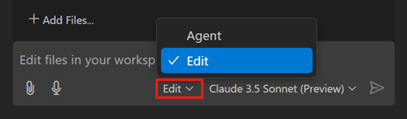
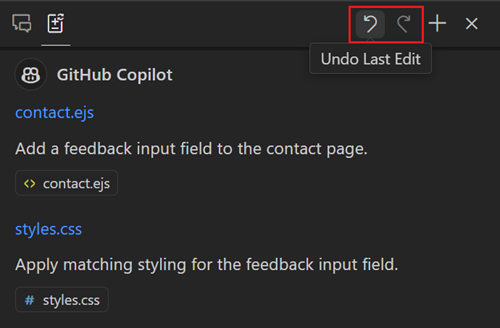

# Copilot Edits {#copilot-edits}

Copilot Edits를 사용하여 AI 기반 코드 편집 세션을 시작하고 자연어를 사용하여 여러 파일에서 코드 변경을 신속하게 반복할 수 있습니다. Copilot Edits는 편집기에서 직접 편집을 적용하며, 주변 코드의 전체 맥락을 고려하여 이를 검토할 수 있습니다.

Copilot Edits는 두 가지 모드로 작동할 수 있습니다:

* [_편집 모드_](#use-edit-mode): 편집할 파일을 선택하고 관련 맥락과 프롬프트를 제공하면 Copilot이 코드 편집을 제안합니다.
* [_에이전트 모드_](#use-agent-mode-preview) (미리보기): Copilot이 요청을 구현하는 데 필요한 작업과 관련 파일을 자율적으로 계획하도록 합니다. Copilot은 코드 편집을 적용하고 터미널 명령을 제안하며, 발생하는 문제를 해결하기 위해 지속적으로 반복합니다.

> [!IMPORTANT]
> 노트북을 사용하는 경우, Copilot Edits 지원이 현재 제한적입니다. VS Code에서 노트북과 함께 [Copilot Chat](/docs/copilot/copilot-chat.md) 또는 [Inline Chat](/docs/copilot/copilot-chat.md#inline-chat)을 사용하는 것을 권장합니다.

다음 비디오는 Copilot Edits를 사용하여 새로운 페이지, 탐색 바 및 테마 전환기를 추가하는 등 기본 Express 앱을 확장하는 방법을 보여줍니다.

<video src="images/copilot-edits/copilot-edits-hero.mp4" title="Use Copilot Edits to modify an Express app" loop controls muted></video>

> [!TIP]
> 아직 Copilot 구독이 없다면, [Copilot 무료 플랜](https://github.com/github-copilot/signup)에 가입하여 무료로 Copilot을 사용할 수 있으며, 월간 완료 수 및 채팅 상호작용의 한도를 받을 수 있습니다.

## 편집 모드 대 에이전트 모드 (미리보기) {#edit-mode-versus-agent-mode-preview}

Copilot은 두 가지 모드인 _편집 모드_와 _에이전트 모드_로 작동할 수 있습니다. 이러한 모드는 서로 다른 사용자 선호도와 작업 흐름에 맞춰 코드 편집 및 반복 방식을 유연하게 제공합니다.

편집 모드에서는 Copilot이 작업할 관련 맥락과 파일을 제공해야 합니다. Copilot은 프롬프트에 따라 코드 편집을 제안하며, 후속 프롬프트를 제공하여 수동으로 코드 변경을 반복할 수 있습니다.

에이전트 모드에서는 Copilot이 자율적으로 관련 맥락과 파일을 결정하고 수행해야 할 작업을 파악하여 코드 변경과 터미널 명령을 제공합니다. 그런 다음 원하는 결과를 달성하기 위해 독립적으로 반복하며 발생하는 문제를 해결합니다.

Copilot Edits의 에이전트 모드는 [_도구_](#agent-mode-tools) 세트를 사용하여 파일 편집, 터미널 명령 실행 및 모니터링, 코드 검증과 같은 특정 작업을 수행할 수 있습니다. 이러한 도구는 요청된 작업을 수행하기 위해 병렬로 실행될 수 있습니다.

두 모드 모두에서 [생성된 편집을 검토](#accept-or-discard-edits)하고 이를 유지하거나 거부할 수 있습니다.

## 편집 모드 사용하기 {#use-edit-mode}

편집 모드에서는 편집할 파일을 선택하고 관련 맥락과 프롬프트를 제공합니다. Copilot은 프롬프트에 따라 코드 편집을 제안합니다.

1. Copilot Edits 뷰를 엽니다 (`kb(workbench.action.chat.openEditSession)`).

    * VS Code 제목 표시줄의 Copilot 메뉴에서 **Open Copilot Edits**를 선택합니다 (`kb(workbench.action.chat.openEditSession)`).

    * 또는 **View** > **Appearance** > **Secondary Side Bar** (`kb(workbench.action.toggleAuxiliaryBar)`)를 선택하여 보조 사이드 바를 열고, **Copilot Edits** 뷰를 선택합니다.

1. 모드 드롭다운에서 **Edit**를 선택합니다.

    

1. **Add Files**를 사용하여 Copilot에 대한 프롬프트의 관련 맥락을 표시합니다.

    파일, 폴더 또는 편집기 탭을 Copilot Edits 뷰로 드래그 앤 드롭하여 맥락으로 추가할 수도 있습니다.

    Copilot은 자동으로 활성 편집기를 맥락으로 추가합니다. 활성 편집기를 자동으로 추가할지 여부는 `setting(chat.implicitContext.enabled)` 설정을 사용하여 구성할 수 있습니다.

    프롬프트에 하나 이상의 파일을 추가하면 Copilot Edits는 Git 기록에 따라 다른 관련 파일을 제안합니다. 이는 `setting(github.copilot.chat.edits.suggestRelatedFilesFromGitHistory)` 설정으로 구성할 수 있습니다.

    > [!TIP]
    > 프롬프트에 `#codebase`를 추가하여 Copilot이 적절한 파일을 자동으로 찾도록 하세요. 최상의 결과를 얻으려면 `setting(github.copilot.chat.codesearch.enabled)` _(미리보기)_ 설정을 활성화해야 합니다. [Copilot 프롬프트에 맥락 추가하기](/docs/copilot/copilot-chat-context.md)에 대해 자세히 알아보세요.

1. 코드 편집 요청을 위한 프롬프트를 입력합니다. 원하는 변경 사항에 대해 구체적이고 정확하게 설명하고, 더 큰 작업은 더 작은 작업으로 분해합니다.

    Copilot Edits는 편집기에서 편집을 스트리밍하고 Copilot Edits 뷰에 변경된 파일 목록을 표시합니다.

1. 제안된 편집을 검토하고 제안된 편집을 수락하거나 거부합니다.

    사용자는 프로젝트에 대한 변경 사항을 제어할 수 있으며, [생성된 편집을 검토](#accept-or-discard-edits)할 수 있습니다.

1. 코드 변경을 반복합니다.

    편집이 완전히 만족스럽지 않은 경우, "전화번호를 포함하지 마세요" 또는 "vitest 대신 jest를 사용하세요"와 같은 후속 질문을 할 수 있습니다. 또는 코드를 점진적으로 더 편집할 수 있습니다. 예를 들어, 웹 앱을 구축할 때 "탐색 바 추가", "테마 전환기 추가", "주문 항목을 JSON 형식으로 MongoDB에 저장"과 같은 일련의 프롬프트를 사용할 수 있습니다.

## 에이전트 모드 사용하기 (미리보기) {#use-agent-mode-preview}

에이전트 모드에서는 Copilot Edits가 더 자율적이고 동적인 방식으로 원하는 결과를 달성합니다. Copilot 에이전트 모드는 관련 맥락을 결정하고 코드 변경 및 터미널 명령을 제공하며 문제를 해결하기 위해 반복합니다. 이러한 작업을 수행하기 위해 에이전트 모드는 [_도구_](#agent-mode-tools) 세트를 사용합니다.

> [!IMPORTANT]
> Copilot Business 또는 Enterprise 사용자라면, 귀하의 조직의 관리자가 Copilot Editor Preview Features 사용에 동의해야 합니다. 귀하의 조직에서 Copilot 관리 정책에 대해 자세히 알아보세요. [조직에서 Copilot 관리하기](https://docs.github.com/en/copilot/managing-copilot/managing-github-copilot-in-your-organization/managing-policies-for-copilot-in-your-organization#enabling-copilot-features-in-your-organization).

Copilot Edits에서 에이전트 모드를 사용하려면:

1. [VS Code Insiders](https://code.visualstudio.com/insiders)에서 프로젝트를 엽니다.

    > [!NOTE]
    > 에이전트 모드는 미리보기 상태이며 현재 [VS Code Insiders](https://code.visualstudio.com/insiders/)에서 사용할 수 있습니다. VS Code Stable로의 점진적 출시가 진행 중이며, 에이전트 모드가 활성화되면 Copilot Edits 뷰에서 모드 드롭다운을 볼 수 있습니다.

1. Copilot Edits 뷰를 엽니다 (`kb(workbench.action.chat.openEditSession)`)

    * VS Code 제목 표시줄의 Copilot 메뉴에서 **Open Copilot Edits**를 선택합니다 (`kb(workbench.action.chat.openEditSession)`).

    * 또는 **View** > **Appearance** > **Secondary Side Bar** (`kb(workbench.action.toggleAuxiliaryBar)`)를 선택하여 보조 사이드 바를 열고, **Copilot Edits** 뷰를 선택합니다.

1. 모드 드롭다운에서 **Agent**를 선택합니다.

    

1. 코드 편집 요청을 위한 프롬프트를 입력합니다.

    어떤 파일에서 작업할지 지정할 필요가 없습니다. 에이전트 모드에서는 Copilot Edits가 자율적으로 관련 맥락과 편집할 파일을 결정합니다.

    

    Copilot Edits는 편집기를 통해 편집을 스트리밍하고 변경된 파일 목록을 업데이트합니다. 또한 Copilot은 실행할 터미널 명령을 제안할 수도 있습니다. 예를 들어, 테스트를 실행하거나 애플리케이션을 빌드하는 것입니다.

1. 제안된 코드 편집을 검토하고 Copilot이 제안된 터미널 명령을 실행할 수 있는지 확인합니다.

    사용자는 프로젝트에 대한 변경 사항을 제어할 수 있으며, [생성된 편집을 검토](#accept-or-discard-edits)할 수 있습니다.

    Copilot은 터미널 명령을 실행하기 전에 확인을 요청합니다. 선택적으로 응답에서 제안된 터미널 명령을 수정한 후 **Continue**를 선택하여 실행할 수 있습니다.

    프로젝트에 `tasks.json`에서 [작업](/docs/editor/tasks.md)이 구성되어 있는 경우, 에이전트 모드는 적절한 작업을 실행하려고 시도합니다. 예를 들어, 빌드 작업을 정의한 경우, 에이전트 모드는 애플리케이션을 실행하기 전에 빌드 작업을 실행합니다. `setting(github.copilot.chat.agent.runTasks)` 설정을 사용하여 작업 공간 작업 실행을 활성화하거나 비활성화할 수 있습니다.

1. Copilot Edits는 코드 편집 및 터미널 명령에서 문제와 오류를 감지하고 이를 해결하기 위해 반복 및 추가 작업을 수행합니다.

    예를 들어, 에이전트 모드는 코드 편집의 결과로 단위 테스트를 실행할 수 있습니다. 테스트가 실패하면 Copilot은 테스트 결과를 사용하여 문제를 해결합니다.

1. 후속 질문을 계속하고 Copilot Edits가 제공하는 코드 변경을 반복합니다.

Copilot Edits의 에이전트 모드는 문제를 해결하기 위해 여러 번 반복합니다. `setting(chat.agent.maxRequests)` 설정은 에이전트 모드에서 Copilot Edits가 만들 수 있는 최대 요청 수를 제어합니다.

## 편집 수락 또는 거부하기 {#accept-or-discard-edits}

Copilot Edits는 AI가 생성한 각 편집을 수락하거나 거부할 수 있는 코드 검토 흐름을 제공합니다. 편집을 거부하면 수정된 파일이 이전에 수락된 상태로 복원됩니다.

Copilot은 변경된 파일 목록에 편집된 파일을 나열합니다. 보류 중인 Copilot 편집이 있는 파일은 탐색기 뷰 및 편집기 탭에 표시기가 있습니다.

편집기 오버레이 컨트롤을 사용하여 `kbstyle(Up)` (<i class="codicon codicon-arrow-up"></i>) 및 `kbstyle(Down)` (<i class="codicon codicon-arrow-down"></i>) 컨트롤을 사용하여 제안된 편집 간에 탐색할 수 있습니다. **Keep** 또는 **Undo** 버튼을 사용하여 특정 파일에 대한 편집을 수락하거나 거부합니다.

파일 내에서 특정 편집을 수락하거나 거부하려면 코드 편집 위에 마우스를 올리고 해당 편집에 대한 **Keep** 또는 **Undo** 컨트롤을 사용합니다.

또는 Copilot Edits 뷰의 변경된 파일 목록에서 변경 사항을 수락하거나 거부할 수도 있습니다:

* 변경된 파일 목록에서 **Keep** (`kb(chatEditing.acceptAllFiles)`) 또는 **Undo** (`kb(chatEditing.discardAllFiles)`)를 선택하여 모든 편집을 수락하거나 거부합니다.

* 개별 파일에서 **Keep** 또는 **Undo** 아이콘을 선택하여 해당 파일에 대한 작업을 적용합니다.

`setting(chat.editing.autoAcceptDelay)` 설정을 사용하여 제안된 편집이 자동으로 수락되는 지연 시간을 구성할 수 있습니다. 편집기 오버레이 컨트롤 위에 마우스를 올려 자동 수락 카운트다운을 취소할 수 있습니다.

VS Code를 닫으면 보류 중인 편집의 상태가 기억됩니다. VS Code를 다시 열면 보류 중인 편집이 복원되며 여전히 편집을 수락하거나 거부할 수 있습니다.

> [!NOTE]
> 에이전트 모드에서는 편집이 자동으로 디스크에 저장되며, 자동 저장(`setting(files.autoSave)`)이 활성화되어 있는지 여부와 관계없이 저장됩니다. 여전히 편집을 검토하고 필요에 따라 거부할 수 있습니다.

## 에이전트 모드 요청 중단하기 {#interrupt-an-agent-mode-request}

진행 중인 요청을 중단하려면 **일시 중지**하거나 **취소**할 수 있습니다. 요청을 일시 중지하면 Copilot이 요청 처리를 중단하고 사용자 입력을 기다립니다.

요청을 일시 중지하면 새 프롬프트를 입력하여 현재 요청을 취소하거나 현재 요청을 재개할 수 있습니다.

요청을 취소하면 Copilot이 활성 요청을 중단하고 종료합니다. 그 시점까지 수행된 변경 사항을 여전히 [검토하고 수락하거나 거부](#accept-or-discard-edits)할 수 있습니다.

## 편집 취소하기 {#undo-edits}

코드 편집 요청을 보내는 동안 이러한 변경 사항 중 일부를 롤백하고 싶을 수 있습니다. 예를 들어, 다른 구현 전략을 사용하고 싶기 때문입니다.

Copilot Edits 뷰 제목 표시줄에서 **Undo Last Edit** 컨트롤을 사용하여 마지막 편집을 되돌리고 마지막 요청을 보내기 전 상태로 돌아갈 수 있습니다. 마지막 편집을 취소한 후, Copilot Edits 뷰 제목 표시줄에서 **Redo Last Edit** 컨트롤을 사용하여 해당 편집을 다시 수행할 수 있습니다.

Copilot Edits 뷰에서 요청 위에 마우스를 올려 **Undo Edits (Delete)** 컨트롤 (`kbstyle(x)` 아이콘)을 사용하여 해당 요청 이후에 수행된 모든 편집을 되돌릴 수 있습니다.

> [!TIP]
> 때때로 Copilot이 편집을 생성할 때 잘못된 경로로 진행하기 시작합니다. 그런 경우, 대화에 추가하여 다른 접근 방식을 설득하기 어려울 수 있습니다. 이 경우, Copilot의 응답에 동의하는 지점까지 **Undo Last Edit**를 사용하세요. 그런 다음 정제된 프롬프트로 다시 시작합니다.

## Copilot Edits에 채팅 요청 보내기 {#send-a-chat-request-to-copilot-edits}

Copilot Chat은 프로젝트나 기술 주제에 대한 질문을 하고 아이디어를 탐색하는 데 유용합니다. Copilot Chat에서 생성된 각 코드 블록을 코드에 적용하는 대신, 채팅 세션을 Copilot Edits로 전송할 수 있습니다. Copilot Edits는 코드 편집에 최적화되어 있으며 여러 파일에서 직접 코드 제안을 적용할 수 있습니다.

채팅 뷰에서 채팅 대화의 하단에 있는 **Edit with Copilot** 버튼을 선택하여 Copilot Edits로 제안된 코드 변경 사항을 적용합니다. 채팅 세션에 여러 채팅 요청이 있는 경우, Copilot Edits로 전송할 요청을 선택할 수 있습니다.

채팅 요청을 Copilot Edits로 이동한 후, 해당 요청은 채팅 뷰의 채팅 대화에서 제거됩니다.

## 에이전트 모드 도구 {#agent-mode-tools}

요청을 완료하기 위해 Copilot Edits는 개별 작업을 수행하기 위해 _도구_ 세트를 사용합니다. 이러한 도구는 Copilot이 특정 작업을 수행하는 데 사용할 수 있는 전문 유틸리티로 간주할 수 있습니다. 이러한 작업의 예로는 디렉토리의 파일 나열, 작업 공간의 파일 편집, 터미널 명령 실행, 터미널에서 출력 가져오기 등이 있습니다.

도구의 결과에 따라 Copilot은 전체 요청을 완료하기 위해 다른 도구를 호출할 수 있습니다. 예를 들어, 코드 편집이 파일에서 구문 오류를 초래하는 경우, Copilot은 다른 접근 방식을 탐색하고 다른 코드 변경을 제안할 수 있습니다.

에이전트 모드는 자율적으로 작동할 수 있지만, 생성된 편집 및 실행되는 터미널 명령에 대한 제어권은 유지합니다.

## 설정 {#settings}

다음 목록은 Copilot Edits와 관련된 설정을 포함합니다. 설정 편집기(`kb(workbench.action.openSettings)`)를 통해 설정을 구성할 수 있습니다.

* `setting(chat.editing.confirmEditRequestRemoval)` - 편집을 실행하기 전에 확인 요청 (기본값: `true`)
* `setting(chat.editing.confirmEditRequestRetry)` - 마지막 편집을 다시 수행하기 전에 확인 요청 (기본값: `true`)
* `setting(chat.implicitContext.enabled)` _(미리보기)_ - 활성 편집기를 채팅 프롬프트의 맥락으로 자동으로 추가할지 여부를 구성합니다.
* `setting(chat.editing.autoAcceptDelay)` - 제안된 편집이 자동으로 수락되는 지연 시간을 구성하며, 자동 수락을 비활성화하려면 0을 사용합니다 (기본값: 0)
* `setting(github.copilot.chat.codesearch.enabled)` _(미리보기)_ - 프롬프트에 `#codebase`를 추가할 때 Copilot이 적절한 파일을 찾도록 허용하며, 에이전트 모드와 유사하게 작동합니다 (기본값: `false`)
* `setting(chat.agent.maxRequests)` - 에이전트 모드에서 Copilot Edits가 만들 수 있는 최대 요청 수 (기본값: Copilot 무료 사용자 5, 기타 사용자 15)
* `setting(github.copilot.chat.edits.suggestRelatedFilesFromGitHistory)` _(실험적)_ - Copilot Edits에서 Git 기록의 관련 파일을 제안합니다 (기본값: `false`)
* `setting(github.copilot.chat.agent.runTasks)` - Copilot Edits의 에이전트 모드에서 작업 공간 작업을 실행합니다 (기본값: `true`)

## 키보드 단축키 {#keyboard-shortcuts}

다음 목록은 Copilot Edits와 관련된 기본 키보드 단축키를 포함합니다. 키보드 단축키 편집기(`kb(workbench.action.openGlobalKeybindings)`)를 사용하여 기본 키보드 단축키를 수정할 수 있습니다.

* `kb(workbench.action.chat.openEditSession)` - Copilot Edits 뷰 열기
* `kb(workbench.action.chat.sendToChatEditing)` - 채팅 뷰에서 Copilot Edits로 프롬프트 보내기
* `kb(workbench.action.chat.attachContext)` - 프롬프트에 맥락 추가
* `kb(chatEditing.saveAllFiles)` - 모든 편집된 파일을 디스크에 저장
* `kb(chatEditing.acceptAllFiles)` - 모든 편집 수락
* `kb(chatEditing.discardAllFiles)` - 모든 편집 거부
* `kb(chatEditor.action.navigatePrevious)` - 파일 내에서 이전 편집으로 탐색
* `kb(chatEditor.action.navigateNext)` - 파일 내에서 다음 편집으로 탐색

> [!TIP]
> Copilot Edits 뷰에 특정 작업에 대한 키보드 단축키를 변경하려면 `when` 절에 다음 조건을 포함해야 합니다: `chatLocation == 'editing-session'`.

## 제한 사항 {#limitations}

* 여러 동시 편집 세션은 아직 지원되지 않습니다.
* 편집 세션에서 새로운 프로젝트를 스캐폴딩하기 위해 `@workspace /new`를 사용하는 것은 아직 지원되지 않습니다. 현재는 초기 스캐폴딩을 위해 Copilot Chat을 사용하세요.
* `#codebase`는 쿼리에 대한 관련 맥락을 찾는 데 유용하지만, 이후 생성된 편집의 품질은 다양합니다. 더 나은 결과를 얻기 위해 `setting(github.copilot.chat.codesearch.enabled)` _(미리보기)_ 설정을 실험하거나 프롬프트에 파일을 명시적으로 추가하여 더 나은 결과를 생성하세요.
* Jupyter 노트북, 기타 사용자 정의 텍스트 형식 및 이진 파일 형식에 대한 지원이 없거나 테스트되지 않았습니다.
* Copilot Edits는 10분당 7개의 편집 요청으로 제한됩니다.

## 자주 묻는 질문 {#frequently-asked-questions}

### Copilot Edits는 Copilot Chat과 어떻게 다른가요? {#how-is-copilot-edits-different-from-copilot-chat}

[Copilot Chat](/docs/copilot/copilot-chat.md)와 Copilot Edits는 대화형 인터페이스를 사용하여 자연어 프롬프트를 통해 AI 기반 제안을 받을 수 있습니다. Copilot Edits와 Copilot Chat 간에는 몇 가지 뚜렷한 차이점이 있습니다.

Copilot Edits는 **코드 편집**의 맥락에 있으며, 편집 세션을 시작하고 코드베이스에 대한 변경을 위한 프롬프트를 사용합니다. Copilot Edits는 코드베이스의 **여러 파일**에서 직접 코드 변경을 생성하고 적용할 수 있습니다. 생성된 편집을 코드의 맥락 내에서 즉시 **미리 볼 수 있습니다**.

[채팅 뷰](/docs/copilot/copilot-chat.md#chat-view)는 코드나 기술 주제에 대한 질문을 하기 위한 더 **일반적인** 채팅 인터페이스를 제공합니다. Copilot은 또한 채팅 대화의 일환으로 코드 제안을 제공하고 코드 블록을 생성할 수 있습니다. 각 코드 블록을 프로젝트의 다양한 파일에 **수동으로 적용**하여 유효성을 평가해야 합니다.

[Inline Chat](/docs/copilot/copilot-chat.md#inline-chat)은 편집기 내에서 대화형 인터페이스를 제공하여 **생성된 코드** 제안을 코드의 맥락 내에서 직접 미리 볼 수 있습니다. Inline Chat의 범위는 시작된 편집기에 제한되므로 **단일 파일**에 대한 코드 제안만 제공할 수 있습니다. 일반적인 질문을 하기 위해 Inline Chat을 사용할 수도 있습니다.

Copilot Edits는 생성된 편집을 쉽게 검토하고 수락하거나 거부할 수 있는 **코드 검토 흐름**을 제공합니다. Copilot Chat에는 이러한 코드 검토 메커니즘이 없습니다. 또한 이전 편집을 취소하고 **변경 사항을 이전 수락 상태로 롤백**할 수 있습니다.

다음 표는 각 경험의 기능을 비교합니다.

| 기능                       | Copilot Edits | 채팅 뷰 | Inline Chat | Quick Chat |
|----------------------------|:-------------:|:-------:|:-----------:|:----------:|
| 다중 파일 편집            | ✅ | ✅* |    | ✅* |
| 코드 편집 미리 보기       | ✅ |     | ✅ |     |
| 코드 검토 흐름            | ✅ |     |    |      |
| 변경 사항 롤백            | ✅ |     |    |      |
| 맥락 추가                 | ✅ | ✅ | ✅ | ✅  |
| 참가자 및 명령 사용       |    | ✅  |    | ✅  |
| 셸 명령 생성              |    | ✅  |    | ✅  |
| 일반적인 채팅             |    | ✅  | ✅ | ✅  |

\* _코드 블록은 채팅 대화에 포함되며 수동으로 올바른 파일에 적용해야 합니다._

### Copilot Edits 뷰의 위치를 변경할 수 있나요? {#can-i-change-the-location-of-the-copilot-edits-view}

Copilot Edits 뷰를 드래그 앤 드롭하여 활동 표시줄에 배치하여 기본 사이드 바에 표시할 수 있습니다. 보조 사이드 바로 이동할 수도 있습니다. VS Code에서 [사용자 정의 레이아웃](/docs/editor/custom-layout.md#workbench)에 대해 자세히 알아보세요.

### 왜 에이전트 모드 대신 편집 모드를 사용하나요? {#why-would-i-use-edit-mode-instead-of-agent-mode}

편집 모드와 에이전트 모드 중에서 선택하기 위해 다음 기준을 고려하세요:

* **편집 범위**: 요청이 코드 편집만 포함되고 변경 사항의 정확한 범위를 알고 있다면 편집 모드를 사용할 수 있습니다.
* **미리보기 기능**: 에이전트 모드는 아직 미리보기 상태이며 모든 시나리오에서 작동하지 않을 수 있습니다.
* **소요 시간**: 에이전트 모드는 요청을 처리하기 위해 여러 단계를 포함하므로 응답을 받는 데 더 오랜 시간이 걸릴 수 있습니다. 예를 들어, 관련 맥락과 편집할 파일을 결정하고, 작업 계획을 수립하는 등의 과정이 필요합니다.
* **비결정적**: 에이전트 모드는 생성된 편집의 결과를 평가하고 여러 번 반복할 수 있습니다. 결과적으로 에이전트 모드는 편집 모드보다 더 비결정적일 수 있습니다.
* **요청 할당량**: 에이전트 모드에서는 작업의 복잡성에 따라 하나의 프롬프트가 백엔드에 여러 요청을 초래할 수 있습니다.

## Copilot Edits를 노트북과 함께 사용할 수 있나요? {#can-i-use-copilot-edits-with-notebooks}

노트북을 사용할 때 Copilot Edits 지원이 제한적입니다. 예를 들어, VS Code에서 노트북 작업을 위한 에이전트 모드는 사용할 수 없습니다.

대신 VS Code에서 노트북과 함께 [Copilot Chat](/docs/copilot/copilot-chat.md) 또는 [Inline Chat](/docs/copilot/copilot-chat.md#inline-chat)을 사용하는 것을 권장합니다.

## 관련 콘텐츠 {#related-content}

* [VS Code에서 Copilot 기능에 대한 간략한 개요 받기](/docs/copilot/copilot-vscode-features.md)
* [AI 채팅 대화를 위한 Copilot Chat 사용하기](/docs/copilot/copilot-chat.md)