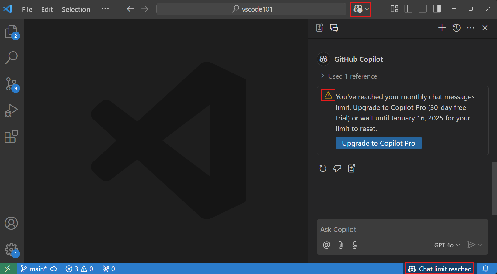
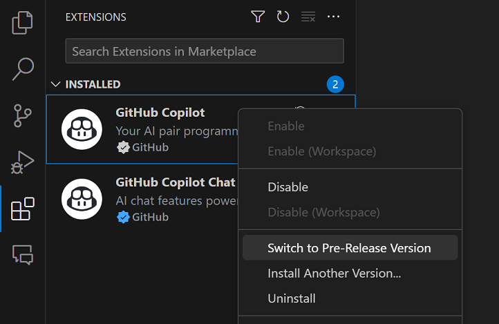

# GitHub Copilot 자주 묻는 질문 {#github-copilot-frequently-asked-questions}

이 문서는 Visual Studio Code에서 GitHub Copilot을 사용하는 것에 대한 자주 묻는 질문에 답변합니다.

## GitHub Copilot 구독 {#github-copilot-subscription}

### Copilot 구독을 어떻게 받을 수 있나요? {#how-can-i-get-a-copilot-subscription}

GitHub Copilot에 접근하는 방법은 여러 가지가 있습니다:

| 사용자 유형                   | 설명 |
|------------------------------|-------------|
| 개인                         | <ul><li>[GitHub Copilot Free](https://github.com/github-copilot/signup)를 설정하여 구독 없이 제한된 Copilot 경험을 얻을 수 있습니다. [GitHub Copilot Free에 대한 설명](https://docs.github.com/en/copilot/managing-copilot/managing-copilot-as-an-individual-subscriber/about-github-copilot-free)을 참조하세요.</li><li>유료 GitHub Copilot 구독에 가입하여 무제한 완성과 채팅 상호작용을 이용할 수 있습니다. [GitHub Copilot을 무료로 사용해 보세요](https://github.com/github-copilot/signup?ref_cta=Copilot+trial&ref_loc=about+github+copilot&ref_page=docs)라는 30일 무료 체험을 이용할 수 있습니다.</li><li>모든 옵션에 대한 내용은 [자신을 위한 GitHub Copilot 설정](https://docs.github.com/en/copilot/setting-up-github-copilot/setting-up-github-copilot-for-yourself)을 참조하세요.</li></ul> |
| 조직/기업 회원              | <ul><li>GitHub Copilot 구독이 있는 조직이나 기업의 회원인 경우, https://github.com/settings/copilot로 가서 "조직에서 Copilot 받기" 아래에서 접근을 요청할 수 있습니다.</li><li>조직을 위한 GitHub Copilot 설정에 대한 내용은 [조직을 위한 GitHub Copilot 설정](https://docs.github.com/en/copilot/setting-up-github-copilot/setting-up-github-copilot-for-your-organization)을 참조하세요.</li></ul> |

### 내 완성 또는 채팅 상호작용 한도에 도달했습니다 {#i-reached-my-completions-or-chat-interactions-limit}

코드 완성과 채팅 상호작용의 한도는 Copilot Free 플랜에 처음 가입한 날부터 매달 초기화됩니다. 한도에 도달하면 [유료 구독](#how-can-i-get-a-copilot-subscription)에 가입하여 무제한 완성과 채팅 메시지를 받을 수 있습니다. 또는 다음 달까지 기다려 무료로 Copilot을 계속 사용할 수 있습니다.

채팅 상호작용만 한도에 도달한 경우, 코드 완성을 위해 Copilot을 계속 사용할 수 있습니다.

코드 완성만 한도에 도달한 경우, 채팅 상호작용 및 Copilot Edits를 위해 Copilot을 계속 사용할 수 있습니다.

### 내 Copilot 구독이 VS Code에서 감지되지 않습니다 {#my-copilot-subscription-is-not-detected-in-vs-code}

- Visual Studio Code에서 Copilot Chat을 사용하려면 GitHub ID로 Visual Studio Code에 로그인해야 하며, 해당 ID가 GitHub Copilot에 접근할 수 있어야 합니다. Copilot 구독이 다른 GitHub 계정에 연결되어 있는 경우, 현재 GitHub 계정에서 로그아웃하고 다른 계정으로 로그인해야 할 수 있습니다. 현재 GitHub 계정에서 로그아웃하려면 활동 표시줄의 **계정** 메뉴를 사용하세요.

- [GitHub Copilot 설정](https://github.com/settings/copilot)에서 Copilot 구독이 여전히 활성 상태인지 확인하세요.

### Copilot을 위한 계정을 어떻게 전환하나요 {#how-can-i-switch-accounts-for-copilot}

Copilot을 사용하기 위해 다른 GitHub 계정으로 전환하려면:

1. 활동 표시줄에서 확장 보기로 이동하거나(`kb(workbench.view.extensions)`) 검색 상자에 *GitHub Copilot*을 입력합니다.

    

    > [!NOTE]
    > 두 개의 Copilot 확장이 있습니다: GitHub Copilot과 GitHub Copilot Chat.

2. **GitHub Copilot** 확장을 위해 기어 아이콘을 선택한 다음 **계정 기본 설정**을 선택합니다.

    

3. 계정 기본 설정 빠른 선택에서 기존 계정을 선택하거나 **새 계정 사용...**을 선택하여 다른 GitHub 계정으로 로그인합니다.

    

4. **GitHub Copilot Chat** 확장에 대해서도 이 단계를 반복합니다.

## 일반 {#general}

### Copilot을 위한 네트워크 및 방화벽 구성 {#network-and-firewall-configuration-for-copilot}

- 귀하 또는 귀하의 조직이 방화벽이나 프록시 서버와 같은 보안 조치를 사용하는 경우, 특정 도메인 URL을 "허용 목록"에 포함하고 특정 포트 및 프로토콜을 열어두는 것이 유용할 수 있습니다. [GitHub Copilot을 위한 방화벽 설정 문제 해결](https://docs.github.com/en/copilot/troubleshooting-github-copilot/troubleshooting-firewall-settings-for-github-copilot)에 대한 자세한 내용을 확인하세요.

- 회사 장비에서 작업하고 기업 네트워크에 연결하는 경우, VPN 또는 HTTP 프록시 서버를 통해 인터넷에 연결할 수 있습니다. 이러한 유형의 네트워크 설정이 GitHub Copilot이 GitHub 서버에 연결하는 것을 방해할 수 있습니다. [GitHub Copilot을 위한 네트워크 오류 문제 해결](https://docs.github.com/en/copilot/troubleshooting-github-copilot/troubleshooting-network-errors-for-github-copilot)에 대한 자세한 내용을 확인하세요.

### Copilot에 대한 피드백을 어떻게 제공하나요? {#how-can-i-provide-feedback-on-copilot}

Copilot 기능에 대한 피드백을 제공하고 싶다면, [vscode-copilot-release](https://github.com/microsoft/vscode-copilot-release/issues) 리포지토리에 이슈를 생성할 수 있습니다.

문제를 보고할 때 [GitHub Copilot 로그](#view-logs-for-github-copilot-in-vs-code)의 정보를 포함하는 것이 도움이 될 수 있습니다.

### VS Code에서 GitHub Copilot 로그 보기 {#view-logs-for-github-copilot-in-vs-code}

GitHub Copilot 확장의 로그 파일은 Visual Studio Code 확장의 표준 로그 위치에 저장됩니다. 로그 파일은 연결 문제를 진단하는 데 유용합니다.

**출력 전환** 명령(`kb(workbench.action.output.toggleOutput)`)을 사용하고 드롭다운에서 **GitHub Copilot** 또는 **GitHub Copilot Chat**을 선택합니다.

### Copilot 확장의 사전 릴리스 빌드가 있나요? {#are-there-pre-release-builds-of-the-copilot-extensions}

네, Copilot 확장의 사전 릴리스(야간) 버전으로 전환하여 최신 기능과 수정 사항을 시도할 수 있습니다. 확장 보기에서 마우스 오른쪽 버튼을 클릭하거나 기어 아이콘을 선택하여 컨텍스트 메뉴를 열고 **사전 릴리스 버전으로 전환**을 선택합니다:

사전 릴리스 버전을 실행 중인지 확인하려면 확장 세부정보에서 "사전 릴리스" 배지를 확인하세요:

## Copilot 코드 완성 {#copilot-code-completions}

### Copilot을 어떻게 활성화/비활성화하나요? {#how-do-i-enabledisable-copilot}

상태 표시줄에서 Copilot 완성을 일시적으로 비활성화할 수 있습니다. 모든 코드(전역적으로) 또는 활성 편집기에서 감지된 프로그래밍 언어(예: Python)에 대해서만 Copilot을 비활성화할 것인지 선택하라는 메시지가 표시됩니다.

### 편집기에서 인라인 완성이 작동하지 않습니다 {#inline-completions-are-not-working-in-the-editor}

- [GitHub Copilot이 비활성화되지 않았는지](#how-do-i-enabledisable-copilot) 확인하세요.
- [GitHub Copilot 구독이 활성화되어 있고 감지되는지](#my-copilot-subscription-is-not-detected-in-vs-code) 확인하세요.
- [네트워크 설정](#network-and-firewall-configuration-for-copilot)이 GitHub Copilot에 대한 연결을 허용하도록 구성되어 있는지 확인하세요.
- [Copilot Free 플랜](https://docs.github.com/copilot/managing-copilot/managing-copilot-as-an-individual-subscriber/about-github-copilot-free)으로 월별 완성 한도에 도달하지 않았는지 확인하세요.

## Copilot 채팅 {#copilot-chat}

### Copilot 채팅 기능이 작동하지 않나요? {#copilot-chat-features-arent-working-for-me}

Copilot Chat이 작동하지 않는 경우 각 요구 사항을 확인하세요:

- Visual Studio Code의 최신 버전을 사용하고 있는지 확인하세요( **Code: Check for Updates** 실행).
- [GitHub Copilot](https://marketplace.visualstudio.com/items?itemName=GitHub.copilot) 및 [GitHub Copilot Chat](https://marketplace.visualstudio.com/items?itemName=GitHub.copilot-chat) 확장의 최신 버전을 사용하고 있는지 확인하세요.
- VS Code에 로그인한 GitHub 계정이 활성 Copilot 구독을 가지고 있는지 확인하세요. [Copilot 구독](https://github.com/settings/copilot)을 확인하세요.
- [Copilot Free 플랜](https://docs.github.com/copilot/managing-copilot/managing-copilot-as-an-individual-subscriber/about-github-copilot-free)으로 월별 채팅 상호작용 한도에 도달하지 않았는지 확인하세요.

### 왜 내 Copilot Chat 확장이 차단되었나요? {#why-is-my-copilot-chat-extension-blocked}

Copilot Chat을 사용하는 데 차단되었다는 메시지가 표시되면, 해당 확장이 특정 확장에서 발생한 남용 패턴으로 인해 비활성화되었을 가능성이 높습니다. 이 문제를 겪을 경우 확장 게시자에게 문의하세요. 게시자 정보는 Visual Studio Marketplace의 확장 세부정보 페이지에서 확인할 수 있습니다.

## 추가 리소스 {#additional-resources}

- [GitHub Copilot 신뢰 센터](https://resources.github.com/copilot-trust-center/)
- [GitHub Copilot FAQ](https://github.com/features/copilot#faq) GitHub 문서에서