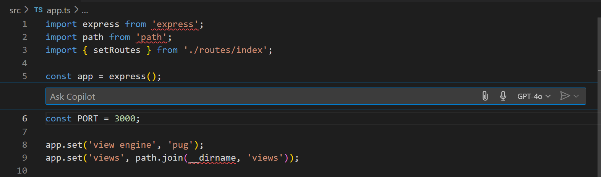
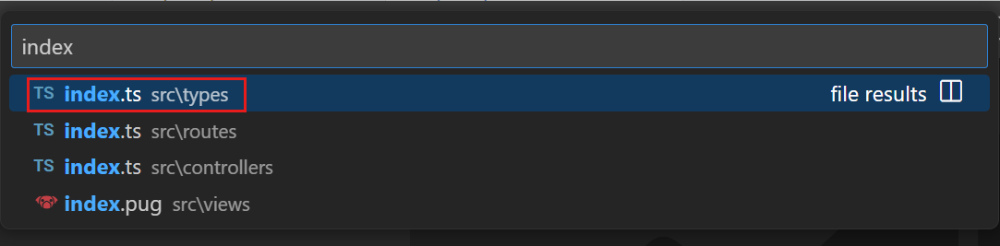

# Visual Studio Code에서 Copilot Chat 시작하기 {#getting-started-with-copilot-chat-in-vs-code}

이 튜토리얼에서는 Visual Studio Code에서 [GitHub Copilot Chat](https://marketplace.visualstudio.com/items?itemName=GitHub.copilot-chat) 확장을 사용하는 방법을 안내합니다. AI 기반의 채팅 대화를 통해 코드 리팩토링, 코드 이해 향상 및 VS Code 구성 방법을 찾는 데 도움을 받을 수 있습니다.

Visual Studio Code에서 GitHub Copilot을 처음 사용하는 경우, [GitHub Copilot 개요](/docs/copilot/overview.md)를 참조하거나 [GitHub Copilot 시작하기 튜토리얼](/docs/copilot/getting-started.md)을 통해 설정하고 주요 기능을 알아보세요.

> [!TIP]
> 아직 Copilot 구독이 없다면, [Copilot 무료 플랜](https://github.com/github-copilot/signup)에 가입하여 무료로 Copilot을 사용할 수 있으며, 월별 완료 및 채팅 상호작용에 대한 한도를 받을 수 있습니다.

## 필수 조건 {#prerequisites}

Visual Studio Code에서 GitHub Copilot을 사용하려면 다음이 필요합니다:

* GitHub Copilot에 대한 접근 권한
* Visual Studio Code에 GitHub Copilot 확장이 설치되어 있어야 합니다.

[GitHub Copilot 설정 가이드](/docs/copilot/setup.md)의 단계를 따라 GitHub Copilot에 접근하고 Visual Studio Code에 Copilot 확장을 설치하세요.

## 첫 번째 Copilot 채팅 대화 시작하기 {#get-your-first-copilot-chat-conversation}

Copilot Chat은 GitHub Copilot과 상호작용할 수 있는 채팅 인터페이스로, 코딩 관련 질문을 하고 답변을 받을 수 있습니다. 이 채팅 인터페이스는 문서를 탐색하거나 온라인 포럼을 검색할 필요 없이 코딩 정보와 지원에 접근할 수 있게 해줍니다.

이 튜토리얼에서는 간단한 Node.js 웹 애플리케이션을 생성할 것입니다.

1. Command Center 채팅 메뉴에서 채팅 뷰를 열거나 `kb(workbench.action.chat.open)`를 눌러주세요.

    

    > [!TIP]
    > 언제든지 Command Center 메뉴에서 다양한 Copilot 기능에 접근할 수 있습니다.

1. 채팅 입력 필드에 "@workspace /new express with typescript and pug"를 입력하고 `kb(workbench.action.chat.submit)`를 눌러 요청을 전송하세요.

    이 채팅 프롬프트가 Copilot에 명확하고 간결한 지침을 제공하도록 구조화된 방식을 주목하세요. 다음과 같이 분석해 보겠습니다:

    * `@workspace`는 특정 도메인에서 작업을 수행하거나 질문에 답할 수 있는 도메인 전문가인 *채팅 참가자*입니다. 이 경우, `@workspace`는 VS Code 작업 공간과 코드베이스에 대한 정보를 알고 있습니다.

    * `/new`는 `@workspace` 참가자에게 새로운 작업 공간을 생성하고 싶다는 것을 알리는 *슬래시 명령*입니다. 슬래시 명령은 일반적으로 사용되는 지침의 약어입니다. 채팅 입력에서 `/` 기호를 입력하면 지원되는 명령 목록을 확인할 수 있습니다.

1. Copilot은 새로운 작업 공간 파일을 나타내는 파일 트리와 작업 공간을 생성하는 버튼을 반환합니다.

    

    파일 트리에서 원하는 파일을 선택하여 실제로 생성되기 전에 내용을 미리 볼 수 있습니다. 생성된 파일이 마음에 들지 않거나 다른 것을 원한다면, `@workspace use ejs`와 같이 후속 질문을 통해 EJS를 사용하도록 요청할 수 있습니다.

1. **작업 공간 생성**을 선택하여 새로운 작업 공간을 만들고 작업 공간이 생성될 디스크의 폴더를 선택하세요.

    작업 공간 생성이 완료되면 VS Code가 새로운 작업 공간으로 다시 로드됩니다.

축하합니다! 자연어를 사용하여 Copilot Chat으로 작업 공간을 생성했습니다. 이 접근 방식의 장점은 요청을 원하는 대로 조정할 수 있다는 것입니다. 아마도 EJS를 사용하는 Express.js를 선호하거나, 아예 Express.js를 사용하지 않고 순수 Node.js와 Bootstrap을 사용할 수도 있습니다. 가장 선호하는 것을 선택하세요!

## 채팅 참가자 사용하기 {#use-chat-participants}

이전에 `@workspace` 채팅 참가자를 사용하여 새로운 작업 공간을 생성했지만, 실제 작업 공간의 코드에 대한 질문을 하는 데에도 사용할 수 있습니다.

생성된 Express 앱을 수정하고 새로운 페이지를 추가해 보겠습니다.

1. 채팅 뷰에서 "@workspace how to add a new page?"를 입력하세요.

    

    Copilot은 코드에 특정한 새로운 페이지를 추가하기 위한 단계별 지침을 반환합니다. 이는 채팅 프롬프트에 `@workspace`를 추가했기 때문에 특정 작업 공간 내용에 대한 맥락이 포함되어 있기 때문입니다. `@workspace`를 포함하지 않았다면 더 일반적인 지침을 받았을 것입니다.

1. 선택적으로 지침을 따라 앱에 새로운 페이지를 추가하세요.

    > [!TIP]
    > 추가할 페이지의 유형에 대한 세부정보를 제공할 수 있습니다. 예를 들어, 홈 페이지, 연락처 페이지 또는 제품 페이지를 추가할 수 있습니다.

1. 사용할 수 있는 더 많은 채팅 참가자가 있으며, 각 참가자는 고유한 도메인 전문 지식을 가지고 있습니다. 채팅 뷰에서 `@` 아이콘을 선택하거나 채팅 뷰에 `@`를 입력하여 사용 가능한 채팅 참가자 목록을 확인하세요.

    

    > [!NOTE]
    > 확장 프로그램도 채팅 참가자에 기여할 수 있으므로, 설치된 확장 프로그램에 따라 목록이 다를 수 있습니다.

1. 이제 `@vscode`를 사용하여 디버깅을 설정해 보겠습니다. 채팅 입력 필드에 "@vscode /startDebugging"을 입력하세요.

    Node.js 앱을 VS Code에서 디버깅하는 방법에 대한 지침과 함께 해당 VS Code 기능에 직접 접근할 수 있는 버튼이 제공됩니다.

    

## 인라인 채팅으로 흐름 유지하기 {#stay-in-the-flow-with-inline-chat}

채팅 뷰는 Copilot과의 대화를 계속하는 데 훌륭하지만, 특정 시나리오에서는 편집기에서 직접 채팅에 접근하는 것이 더 효율적일 수 있습니다. 예를 들어, 코드 변경 사항을 검토하거나, 단위 테스트를 작성하거나, 코드를 리팩토링할 때 그렇습니다.

코드 리팩토링을 위해 채팅을 사용하는 방법을 살펴보겠습니다.

1. 편집기에서 `app.ts` 파일을 열고 포트 번호가 설정된 줄(`const port = 3000`)에 커서를 놓습니다.

    더 복잡한 코드 변경의 경우, 코드 블록을 선택하여 Copilot에 변경하고자 하는 내용을 더 많은 맥락으로 제공할 수 있습니다.

1. 키보드에서 `kb(inlinechat.start)`를 눌러 Copilot 인라인 채팅을 열거나, 마우스 오른쪽 버튼을 클릭하고 **Copilot** > **편집기에서 시작**을 선택하세요.

    Copilot 인라인 채팅을 통해 편집기에서 직접 Copilot에 질문할 수 있습니다.

    

    이제 Copilot에게 코드를 리팩토링하여 포트 번호를 구성 가능하게 만들어 달라고 요청해 보겠습니다.

1. 채팅 입력 필드에 *make configurable*을 입력하고 `kbstyle(Enter)`를 누르세요.

    Copilot이 선택된 코드를 업데이트하고 포트 번호를 환경 변수에서 읽도록 제안하는 것을 주목하세요.

    

    **더 많은 작업** > **변경 사항 전환**을 선택하여 적용된 변경 사항을 볼 수 있습니다.

    

1. **수락** 또는 **닫기**를 선택하여 변경 사항을 적용하거나 무시하세요.

    제안된 코드 변경 사항이 마음에 들지 않는 경우, **요청 다시 실행** 버튼을 선택하여 다른 제안을 받을 수 있습니다.

편집기에서 Copilot 인라인 채팅을 사용하여 코드 리팩토링에 도움을 준 것을 축하합니다!

## 스마트 액션 사용하기 {#use-smart-actions}

채팅 프롬프트를 입력하지 않고도 Copilot을 직접 호출할 수 있는 일반적인 시나리오가 있습니다. 예를 들어, Copilot은 코드 문서 추가, 단위 테스트 생성 또는 코딩 오류 수정에 도움을 줄 수 있습니다.

코딩 오류를 수정하기 위해 스마트 액션을 사용하는 방법을 살펴보겠습니다.

1. `app.ts` 파일을 열고 빨간 물결선이 있는 기호 중 하나를 선택하세요.

1. 반짝이 아이콘을 선택하여 Copilot 코드 작업을 보고, **Copilot을 사용하여 수정**을 선택하세요.

    

1. Copilot 인라인 채팅이 오류 메시지와 문제를 해결하기 위한 제안으로 미리 채워진 상태로 나타납니다.

    

    Copilot이 `/fix` 슬래시 명령을 사용하고 오류 메시지를 뒤따르는 것을 주목하세요. 채팅 입력 필드에서 `/fix` 명령을 직접 사용하여 코딩 오류 수정을 요청할 수도 있습니다.

**Fix** 외에도 Copilot은 **설명** (/explain), **문서 생성** (`/doc`), **테스트 생성** (`/tests`)과 같은 더 많은 스마트 코드 작업을 제공합니다. 이러한 작업은 편집기 컨텍스트 메뉴를 통해 접근할 수 있으며, **Copilot**을 선택하면 됩니다.

모호한 코드 블록을 발견하면, 선택하고 `/explain`을 사용하여 Copilot에게 설명을 요청하여 코드 이해를 향상시킬 수 있습니다.

## 채팅 맥락 추가하기 {#add-chat-context}

이전에 `@workspace`를 사용하여 작업 공간에 대한 질문을 했습니다. 특정 파일이나 코드의 기호에 대한 질문을 Copilot에게 하고 싶다면, 자연어로 모든 것을 광범위하게 설명하지 않고도 Copilot에 그 맥락을 제공할 수 있는 방법은 무엇일까요?

작업 공간의 특정 파일의 목적에 대해 Copilot에게 질문해 보겠습니다.

1. Command Center 채팅 메뉴에서 채팅 뷰를 열거나 `kb(workbench.action.chat.open)`를 누르세요.

1. 채팅 입력 필드 옆에 있는 **맥락 첨부** 버튼을 선택하여 맥락 빠른 선택을 엽니다.

    

    맥락 빠른 선택에서 작업 프롬프트에 추가할 다양한 유형의 맥락을 선택할 수 있습니다. 예를 들어, 작업 공간의 파일, 기호, 현재 선택 항목 등을 추가할 수 있습니다.

1. 맥락 빠른 선택에서 `index.ts`를 입력하기 시작한 후, `src\types\index.ts` 파일을 선택하세요.

    

    파일을 선택한 후, 채팅 뷰에 파일이 추가된 것을 주목하세요. 선택적으로 더 많은 파일이나 다른 맥락 유형을 채팅 프롬프트에 추가할 수 있습니다.

1. 이제 채팅 입력 필드에 다음 프롬프트를 입력하세요: "@workspace what does this do?". 그런 다음 `kbstyle(Enter)`를 눌러 요청을 전송하세요.

    

    이제 Copilot은 선택한 파일의 코드 목적에 대한 설명을 반환합니다.

1. **맥락 첨부** 컨트롤을 사용하는 대신, 채팅 입력 필드에 `#`를 입력하여 다양한 유형의 맥락을 직접 참조할 수도 있습니다.

    > [!TIP]
    > `#codebase`를 추가하여 전체 작업 공간을 채팅 프롬프트의 맥락으로 추가하세요. 이는 프로젝트의 다양한 영역과 관련된 질문을 하고 싶을 때 유용할 수 있습니다.

1. 채팅 프롬프트에 대한 맥락으로 파일을 빠르게 첨부하려면, 탐색기 뷰에서 파일을 드래그 앤 드롭하여 채팅 뷰에 놓으세요. 파일이 편집기에서 열려 있는 경우, 편집기 탭을 채팅 뷰로 드래그 앤 드롭하여 파일을 첨부할 수도 있습니다.

    <video src="images/copilot-chat/copilot-attach-dnd.mp4" title="Dragging files and editors into chat" autoplay loop controls muted></video>

## 축하합니다 {#congratulations}

축하합니다! [GitHub Copilot Chat](https://marketplace.visualstudio.com/items?itemName=GitHub.copilot-chat) 확장을 사용하여 AI 기반의 대화를 통해 코드 리팩토링, 문제 수정 또는 코드 이해 향상에 도움을 받았습니다.

## 추가 자료 {#additional-resources}

* [VS Code에서 Copilot Chat 개요](/docs/copilot/copilot-chat.md)를 확인하세요.
* [프롬프트 작성 및 맥락 설정](/docs/copilot/prompt-crafting.md)으로 Copilot 경험을 최적화하세요.
---