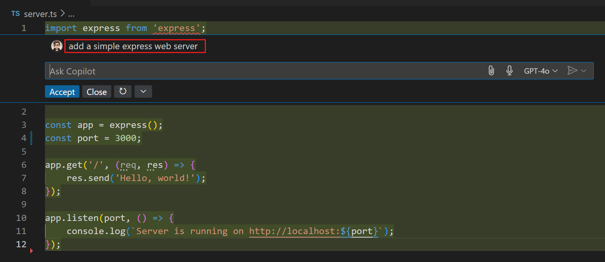

# Visual Studio Code에서 GitHub Copilot 시작하기 {#getting-started-with-github-copilot-in-vs-code}

이 튜토리얼은 Visual Studio Code에서 GitHub Copilot의 주요 기능을 안내합니다. [GitHub Copilot](https://marketplace.visualstudio.com/items?itemName=GitHub.copilot) 확장 프로그램을 사용하여 에디터에서 AI 기반 코드 제안을 받고, 채팅 대화를 통해 코드를 리팩토링하며, 스마트 액션으로 코드 오류를 수정하는 방법을 배워보세요.

:::tip
Copilot 구독이 아직 없다면, [Copilot 무료 플랜](https://github.com/github-copilot/signup)에 가입하여 무료로 Copilot을 사용할 수 있으며, 월별 완료 및 채팅 상호작용의 한도를 받을 수 있습니다.
:::

이 튜토리얼에서는 TypeScript를 사용하지만, Copilot은 다양한 언어와 프레임워크에 대해 훈련되었습니다.

<iframe width="560" height="315" src="https://www.youtube-nocookie.com/embed/2q0BoioYSxQ" title="GitHub Copilot Best Practices (what not to do)" frameborder="0" allow="accelerometer; autoplay; clipboard-write; encrypted-media; gyroscope; picture-in-picture" allowfullscreen></iframe>

## 필수 조건 {#prerequisites}

VS Code에서 GitHub Copilot을 사용하려면 다음이 필요합니다:

* GitHub Copilot 접근 권한
* VS Code에 GitHub Copilot 확장 프로그램 설치

[GitHub Copilot 설정 가이드](/docs/copilot/setup.md)의 단계를 따라 GitHub Copilot에 접근하고 VS Code에 Copilot 확장 프로그램을 설치하세요.

## 첫 번째 코드 제안 받기 {#get-your-first-code-suggestion}

VS Code에서 GitHub Copilot을 시작하려면 특별한 작업이 필요 없습니다. 에디터에서 코드를 입력하는 동안 Copilot은 자동으로 코드 제안을 제공합니다.

1. Visual Studio Code를 열고 새로운 JavaScript 파일 `calculator.js`를 만듭니다.

1. JavaScript 파일에서 다음 코드를 입력하기 시작합니다:

    ```javascript
    class Calculator
    ```

    Copilot은 `Calculator` 클래스에 대한 메소드를 회색으로 흐릿하게 제안합니다(유령 텍스트). 이 예제에서는 `add` 및 `subtract` 메소드가 제안됩니다. 받는 제안은 다를 수 있습니다.

    

1. 제안을 수락하려면 `kbstyle(Tab)` 키를 누릅니다.

    축하합니다! 첫 번째 AI 기반 인라인 제안을 수락했습니다. 계속 입력하면 Copilot이 인라인 제안을 업데이트합니다.

1. 주어진 입력에 대해 여러 제안이 있을 수 있습니다. 클래스 내에 `factorial` 메소드를 추가하기 위해 다음 코드를 입력합니다:

    ```javascript
    factorial(n) {
    ```

1. 에디터에서 제안 위에 마우스를 올려 놓으면 여러 제안이 나타납니다.

    

    화살표 컨트롤을 사용하거나 키보드 단축키를 사용하여 다음(`kb(editor.action.inlineSuggest.showNext)`) 또는 이전(`kb(editor.action.inlineSuggest.showPrevious)`) 제안을 표시할 수 있습니다.

AI 기반 코드 완성은 보일러플레이트 또는 반복 코드를 생성하는 데 도움을 주어 개발 흐름을 유지하고 더 복잡한 코딩 작업에 집중할 수 있게 합니다.

## 인라인 채팅을 사용하여 기본 웹 서버 생성하기 {#use-inline-chat-to-generate-a-basic-web-server}

Copilot Chat을 사용하면 VS Code에서 Copilot과 채팅 대화를 시작하여 코드에 대한 특정 작업을 자연어로 요청할 수 있습니다.

**인라인 채팅**을 사용하여 기본 Express 웹 서버를 생성해 보겠습니다.

1. 먼저, 작업 공간에 새로운 TypeScript 파일 `server.ts`를 추가합니다.

1. 이제 키보드에서 `kb(inlinechat.start)`를 눌러 Copilot 인라인 채팅을 엽니다.

    Copilot 인라인 채팅은 활성 에디터의 코드에 대한 질문을 할 수 있는 채팅 인터페이스를 제공합니다.

    

1. 채팅 입력 필드에 "간단한 express 웹 서버 추가 (add a simple express web server)"라고 입력하고 `kbstyle(Enter)`를 눌러 Copilot에 프롬프트를 전송합니다.

    Copilot이 에디터에 스트리밍 응답을 반환하는 것을 확인하세요. 간단한 Node.js Express 웹 서버의 구현 코드가 나타납니다.

    

1. **Accept**을 선택하거나 `kb(inlineChat.acceptChanges)`를 눌러 제안된 코드 변경 사항을 적용합니다.

    축하합니다! 채팅과 자연어를 사용하여 코드를 생성하기 위해 Copilot Chat을 사용했습니다.

## AI 채팅을 통해 코드 리팩토링하기 {#refactor-your-code-through-ai-chat}

인라인 채팅을 사용하여 에디터에서 기존 코드를 리팩토링하거나 개선할 수도 있습니다.

현재 웹 서버가 정적 포트 번호 `3000`을 사용하고 있습니다. 이를 포트 번호에 대한 환경 변수를 사용하도록 변경해 보겠습니다.

1. 에디터에서 `server.ts` 파일의 `3000` 포트 번호를 선택한 다음 `kb(inlinechat.start)`를 눌러 인라인 채팅을 시작합니다.

1. 채팅 입력 필드에 "포트 번호에 대한 환경 변수를 사용 (use an environment variable for the port number)"이라고 입력하고 `kbstyle(Enter)`를 눌러 채팅 요청 또는 프롬프트를 전송합니다.

    Copilot이 기존 코드를 업데이트하여 포트 번호에 대한 환경 변수를 사용하도록 변경하는 것을 확인하세요.

    

1. **Accept**을 선택하거나 `kb(inlineChat.acceptChanges)`를 눌러 제안된 코드 변경 사항을 적용합니다.

1. 제안된 변경 사항이 마음에 들지 않으면 프롬프트를 수정하고 Copilot에게 다른 솔루션을 제공하도록 요청할 수 있습니다.

    예를 들어, 포트 번호에 대해 다른 환경 변수 이름을 사용하도록 Copilot에게 요청할 수 있습니다.

## Copilot Chat을 일반 프로그래밍 질문에 사용하기 {#use-copilot-chat-for-general-programming-questions}

새로운 코드베이스에서 작업하거나 새로운 프로그래밍 언어를 탐색할 때 더 일반적인 코딩 질문이 생길 수 있습니다. Copilot Chat을 사용하면 사이드에서 채팅 대화를 열 수 있으며, 질문의 기록을 추적할 수 있습니다.

1. Command Center Copilot 메뉴에서 채팅 뷰를 열거나 `kb(workbench.action.chat.open)`를 누릅니다.

    

    :::tip
    언제든지 Command Center 메뉴에서 다양한 Copilot 기능에 접근할 수 있습니다.
    :::

1. 채팅 입력 필드에 "재귀란 무엇인가요? ("what is recursion?)"라고 입력하고 `kb(workbench.action.chat.submit)`를 눌러 요청을 Copilot에 전송합니다.

    

    채팅 응답에 텍스트와 코드 블록으로 구성된 결과가 포함되어 있는 것을 확인하세요. 채팅 응답의 코드 블록은 IntelliSense를 지원하여, 메소드와 기호에 마우스를 올리거나 정의로 이동하여 정보를 얻을 수 있습니다.

1. [Copilot Chat 튜토리얼](/docs/copilot/getting-started-chat.md)의 단계를 따라 특정 코드베이스에 대한 질문을 하는 방법을 배워보세요.

## Copilot Edits로 여러 파일에서 수정하기 {#make-edits-across-multiple-files-with-copilot-edits}

더 큰 기능 변경은 여러 파일에서의 코드 수정이 필요할 수 있습니다. Copilot Edits를 사용하면 작업 공간의 여러 파일에서 에디터 내에서 AI 기반 제안을 받을 수 있습니다. 개별 코드 블록을 적용하는 대신, Copilot Edits는 작업 공간 전체에서 수정을 수행합니다.

Copilot Edits를 사용하여 웹 서버 응답에서 HTML 파일의 내용을 반환해 보겠습니다.

1. Command Center Copilot 메뉴에서 **Open Copilot Edits**를 선택하거나 `kb(workbench.action.chat.openEditSession)`를 누릅니다.

    

1. Copilot Edits 뷰가 열립니다. `server.ts` 파일이 프롬프트에 추가된 것을 확인하세요.

    Copilot은 활성 에디터를 자동으로 프롬프트에 추가합니다. 파일이 추가되지 않은 경우 **Add Files...** 를 사용하여 수동으로 파일을 프롬프트에 추가할 수 있습니다.

    

1. 채팅 입력 필드에 _정적 HTML 페이지를 홈 페이지로 반환하고 구현합니다. (Return a static html page as the home page and implement it.)_ 를 입력하고 `kbstyle(Enter)`를 눌러 새로운 편집 세션을 시작합니다.

    Copilot Edits가 여러 수정을 수행하는 것을 확인하세요. `server.ts` 파일을 업데이트하여 정적 HTML 페이지를 반환하고, 새로운 파일 `index.html`을 추가합니다.

    

1. 결과에 만족하면 **Keep**를 선택하여 모든 제안된 변경 사항을 적용합니다.

    또한 다양한 수정된 파일 간에 탐색하고 편집기 오버레이 컨트롤을 사용하여 수락/거부할 수 있습니다.

    

## Copilot으로 코드 오류 수정하기 {#fix-coding-errors-with-copilot}

인라인 완성과 채팅 대화 외에도 GitHub Copilot은 VS Code에서 다양한 장소와 개발 흐름 전반에 걸쳐 사용할 수 있습니다. VS Code 사용자 인터페이스에서 _스파클_ 아이콘을 통해 Copilot 기능이 존재하는 것을 확인할 수 있습니다.

그 중 하나는 에디터에서 컴파일러 오류로 인해 빨간 물결선이 있는 경우 Copilot 코드 작업입니다. Copilot이 코드 오류를 해결하는 데 어떻게 도움을 줄 수 있는지 살펴보겠습니다.

1. 이전에 생성한 `server.ts` TypeScript 파일을 에디터에서 엽니다.

    `import express from 'express';` 문에 빨간 물결선이 있는 것을 확인하세요. 빨간 물결선 위에 커서를 두면 Copilot 스파클이 나타납니다.

    

1. 스파클을 선택하여 Copilot 코드 작업을 보고, **Fix using Copilot**을 선택합니다.

    

1. Copilot 인라인 채팅이 오류 메시지와 문제를 해결하기 위한 솔루션으로 미리 채워진 상태로 나타나는 것을 확인하세요.

    

    채팅 응답에서 **Insert into Terminal** 버튼을 선택하여 제안된 명령을 터미널에 복사할 수 있습니다.

## 다음 단계 {#next-steps}

축하합니다! 이제 인공지능을 사용하여 코딩을 향상시켰습니다! 이 튜토리얼에서 VS Code에 Copilot을 성공적으로 설정하고, Copilot 코드 완성, Copilot Chat 및 코드 작업을 사용하여 더 효율적으로 코딩했습니다.

* Copilot Chat에 대해 더 알아보려면 [Copilot Chat 튜토리얼](/docs/copilot/getting-started-chat.md)로 진행하세요.

* Copilot Edits에 대해 더 알아보려면 [Copilot Edits](/docs/copilot/copilot-edits.md) 문서로 진행하세요.

## 관련 자료 {#related-resources}

[고급 기능](https://www.youtube.com/watch?v=SLMfhuptCo8) 비디오를 YouTube에서 확인하여 리팩토링, 컨텍스트 기반 제안, 단위 테스트 등 Copilot을 사용하는 방법에 대한 심층적인 내용을 알아보세요.
