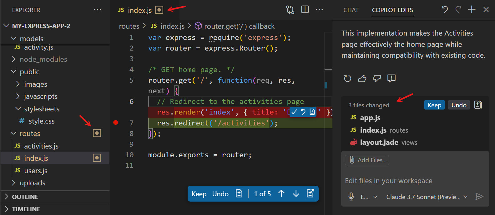
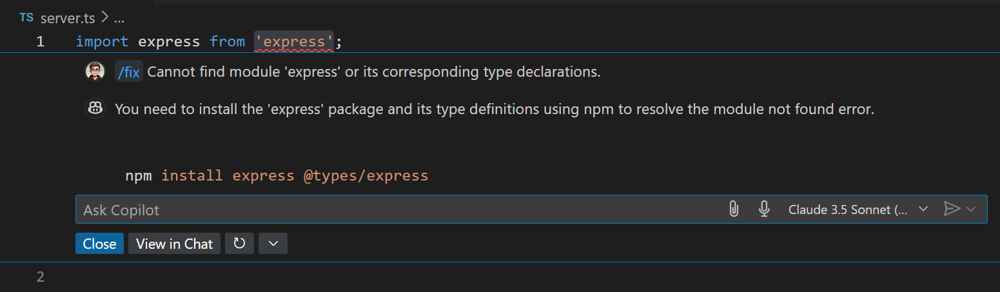
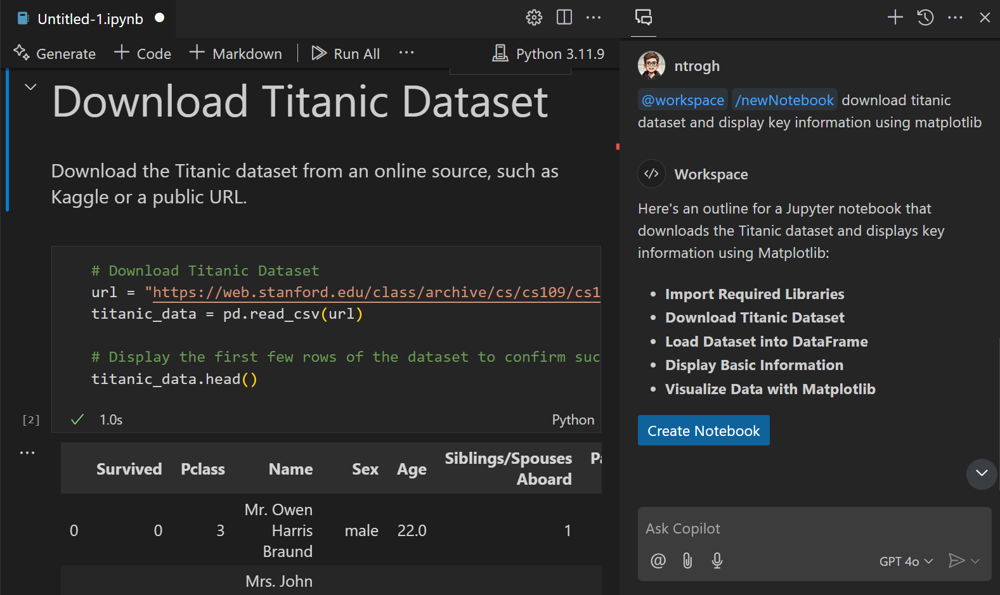
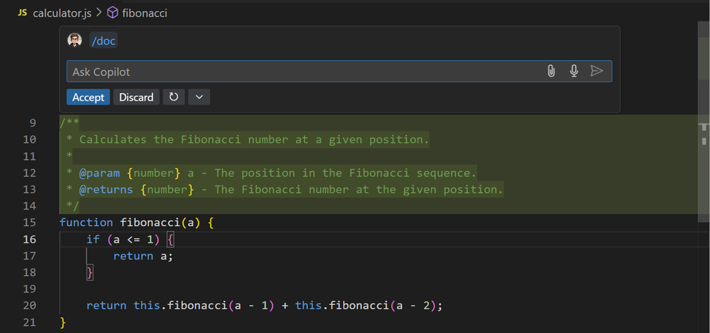

# VS Code에서의 GitHub Copilot {#github-copilot-in-vs-code}

[GitHub Copilot](https://marketplace.visualstudio.com/items?itemName=GitHub.copilot)는 Visual Studio Code에서 사용할 수 있는 AI 페어 프로그래머 도구입니다. 코드를 입력하는 동안 코드 제안을 받거나 편집기에서 인라인 채팅을 사용하여 더 빠르게 코드를 작성하세요. Copilot Edits를 사용하여 프로젝트 전반에 걸쳐 새로운 기능을 추가하거나 버그를 해결하고, 자연어를 사용하여 채팅으로 코드베이스를 탐색하세요.

:::tip
아직 Copilot 구독이 없다면, [Copilot 무료 요금제](https://github.com/github-copilot/signup)에 가입하여 무료로 Copilot을 사용할 수 있으며, 월별 완성 및 채팅 상호작용의 한도를 받을 수 있습니다.
:::

GitHub Copilot은 다양한 시나리오에서 도움을 줄 수 있습니다.

- 입력하는 동안 코드 제안 받기
- 여러 파일에서 변경 사항 적용하기
- 코드에 대한 질문하기
- 코드 리팩토링 및 개선하기
- 코드 문제 수정 및 디버깅
- 새 프로젝트 또는 파일 시작하기
- 테스트 구성 및 생성하기
- 코드 문서 생성하기
- VS Code에서 생산성 향상하기

## 시작하기 {#getting-started}

1. VS Code 제목 표시줄의 Copilot 메뉴에서 **Use AI Features with Copilot for Free...** 를 선택하거나 명령 팔레트(`kb(workbench.action.showCommands)`)에서 선택합니다.

1. Copilot을 사용하기 위해 GitHub 계정으로 로그인합니다.

    :::tip
    아직 Copilot 구독이 없다면, [Copilot 무료 요금제](https://github.com/github-copilot/signup)로 무료로 시작할 수 있습니다. [설정 가이드](/docs/copilot/setup.md)의 단계를 따라 Copilot 구독을 설정하세요.
    :::

1. [Copilot 빠른 시작](/docs/copilot/getting-started.md)을 통해 VS Code에서 Copilot의 주요 기능을 알아보세요.

## Keyboard shortcuts {#keyboard-shortcuts}

Copilot과 채팅 대화를 시작하기 위해 다음 키보드 단축키를 사용하세요:

| 단축키 | 설명 |
|----------|-------------|
| `kb(workbench.action.chat.open)` | **Chat view**를 열고 자연어를 사용하여 Copilot과 채팅 대화를 시작합니다. |
| `kb(workbench.action.chat.openEditSession)` | **Copilot Edits view**를 열고 여러 파일에서 코드 편집 세션을 시작합니다. |
| `kb(workbench.action.quickchat.toggle)` | **Quick Chat**을 열고 Copilot에게 간단한 질문을 합니다. |
| `kb(inlinechat.start)` | **Inline Chat**을 시작하여 편집기에서 직접 Copilot에게 채팅 요청을 보냅니다. 자연어를 사용하거나 `/` 명령어를 사용하여 Copilot에게 지시를 내릴 수 있습니다. |

주요 Copilot 명령 및 단축키에 대한 개요는 [Copilot 치트 시트](/docs/copilot/copilot-vscode-features.md)를 확인하세요.

## VS Code에서 GitHub Copilot 활용 사례 {#use-cases-for-github-copilot-in-vs-code}

### 편집기에서 코드 자동 완성 {#code-completions-in-the-editor}

* **Copilot은 입력하는 동안 코드를 제안합니다**. Copilot은 편집 중인 파일과 관련 파일의 맥락을 분석하고 편집기 내에서 제안을 제공합니다. 예를 들어, 메서드 이름을 입력하기 시작하면 Copilot이 구현을 제안하며, 사용자의 코딩 스타일을 따릅니다.

    

* **Copilot 다음 편집 제안(Copilot NES)**(Preview)를 통해 **다음 코드 편집을 예측합니다**. 사용자가 하고 있는 편집을 기반으로 Copilot NES는 사용자가 다음에 원하는 편집의 위치와 내용을 예측합니다. `kbstyle(Tab)` 키를 사용하여 제안을 빠르게 탐색하고 수락하세요. [Copilot NES](/docs/copilot/ai-powered-suggestions#next-edit-suggestions-preview)를 시작하는 방법을 알아보세요.

    

### 여러 파일에 걸친 변경 사항 반복 적용 {#iterate-on-changes-across-multiple-files}

* **AI 기반 코드 편집 세션을 시작합니다**. [Copilot Edits](/docs/copilot/copilot-edits.md)는 Copilot Chat의 대화 흐름과 인라인 채팅의 빠른 피드백을 하나의 경험으로 결합합니다. 진행 중인 다중 턴 채팅 대화를 옆에서 진행하면서 인라인 코드 제안의 이점을 누리세요.

    

### 코딩 질문 답변하기 {#answer-coding-questions}

* **일반적인 코딩 작업 및 문제에 대한 안내 및 지원을 제공합니다**. 문서를 탐색하거나 온라인 포럼을 검색할 필요 없이 Copilot에게 구문이나 일반 프로그래밍 개념에 대해 질문하세요. Copilot은 자연어 형식 또는 코드 스니펫 형식으로 응답합니다. 예를 들어, "재귀란 무엇인가요?" 또는 "Java에서 싱글턴을 만드는 방법은?"과 같은 질문을 할 수 있습니다.

    

* **선택한 코드에 대한 설명을 통해 코드 이해도를 향상시킵니다**. Copilot은 코드의 기능과 목적에 대한 자연어 설명을 생성합니다. 이는 코드의 동작을 이해하거나 코드가 어떻게 작동하는지 이해해야 하는 비개발자에게 유용할 수 있습니다.

    

* **코드베이스에 특화된 안내를 제공합니다**. Copilot은 작업 공간의 맥락을 가지고 있으며, 프로젝트에 맞춘 단계별 안내와 코드 샘플을 제공합니다. 예를 들어, "연락처 페이지를 추가하는 방법은?" 또는 "데이터베이스에서 고객 데이터를 읽는 방법은?"과 같은 질문을 할 수 있습니다.

    

### 코드 리팩토링 및 개선 {#code-refactoring-and-improvements}

* **코드 리팩토링을 구현하기 위한 제안을 제공합니다**. Copilot은 코드베이스의 맥락을 사용하여 리팩토링을 제안합니다. 예를 들어, Copilot에게 재귀를 사용하지 않도록 함수를 리팩토링하거나 성능을 개선할 수 있는 알고리즘을 제안하도록 요청할 수 있습니다.

    

* **선택한 코드에 대한 잠재적 개선 사항을 제안합니다**, 예를 들어 오류 및 예외적인 경우에 대한 처리 개선이나 코드의 가독성을 높이기 위한 논리 흐름 변경 등을 포함합니다.

    

### 버그 수정 {#fix-issues}

* **코드의 버그에 대한 수정을 제안합니다**. `/fix` 명령을 사용하여 오류 또는 문제의 맥락에 따라 코드 스니펫과 솔루션을 제안합니다. 예를 들어, 코드에서 오류 메시지나 경고가 발생하면 Copilot Chat이 오류 메시지, 코드 구문 및 주변 코드를 기반으로 가능한 수정을 제안할 수 있습니다. 변경 사항은 변수를 변경하거나 제어 구조 또는 함수 호출을 수정하여 문제를 해결할 수 있습니다.

    

* **실패한 테스트에 대한 수정을 제안합니다**(Preview). 코드에 대한 자동화된 테스트를 실행할 때, Copilot은 `/fixTestFailure` 명령을 사용하여 실패한 테스트에 대한 코드 수정을 제안할 수 있습니다.

    

* **터미널 명령 수정을 제안합니다**. 터미널에서 명령이 실패하면 Copilot은 발생한 일을 설명하는 빠른 수정을 제공하는 스파클을 표시합니다.

    

### 프로젝트 빠르게 시작하기 {#jumpstart-your-project}

* **원하는 기술에 대한 새로운 VS Code 작업 공간을 생성합니다**. `/new` 명령을 사용하여 새로운 프로젝트를 빠르게 시작하세요. 기술 스택을 선택하고 작업 공간 파일을 미리 보고 Copilot이 전체 작업 공간을 자동으로 구성하도록 하세요.

    

* **자연어를 사용하여 새로운 Jupyter 노트를 자동으로 구성합니다**. `/newNotebook`을 사용하여 설명에 따라 미리 구성된 새로운 노트를 생성합니다. 예를 들어, 샘플 데이터 세트를 로드하고 검사하며 시각화하는 새로운 노트를 자동으로 구성하도록 하려면, Copilot에게 "@workspace /newNotebook download titanic dataset and display key information using MatPlotLib"라고 요청하세요.

    

### 유닛 테스트 케이스 생성 {#generate-unit-test-cases}

* **코드베이스에 따라 테스트 프레임워크 설정을 구성합니다**. 예를 들어, JavaScript 및 TypeScript 프로젝트가 있는 경우, Copilot은 적합한 테스트 프레임워크와 이를 작업 공간에 구성하는 단계를 제안합니다.

    

* **편집기에서 열려 있는 코드 또는 편집기에서 강조 표시한 코드 스니펫에 따라 테스트 프레임워크에 대한 단위 테스트 케이스를 작성합니다**. Copilot은 테스트 프레임워크와 코딩 스타일을 식별하고 일치하는 코드 스니펫을 생성합니다.

    

* **수동으로 식별하기 어려운 엣지 케이스 및 경계 조건에 대한 테스트 케이스를 식별하고 작성합니다**. 예를 들어, Copilot은 오류 처리, null 값 또는 예상치 못한 입력 유형에 대한 테스트 케이스를 제안할 수 있습니다.

* **함수가 올바르게 작동하는지 확인하는 단언을 제안합니다**. 예를 들어, 함수 입력 매개변수가 유효한지 확인하는 단언을 생성합니다.

### 코드 문서 자동 생성 {#generate-code-documentation}

* **편집기에서 열려 있는 코드 또는 편집기에서 강조 표시한 코드 스니펫에 대한 여러 언어의 코드 문서를 생성합니다**. `/doc` 또는 Copilot 스마트 작업을 사용하여 의미 있는 코드 문서를 생성하는 데 도움을 받으세요.

    

### 생산성 향상 {#productivity-improvements}

* **Commit 또는 Pull Request의 코드 변경 사항에 기반한 AI 생성 커밋 메시지 및 PR 설명**. 소스 제어 화면 또는 GitHub PR 확장에서 스파클 버튼을 사용하여 변경 사항을 요약하는 제목과 설명을 생성하세요.

    

* **소스 코드의 기호에 대한 AI 생성 이름 변경 제안**. 코드에서 기호의 이름을 변경할 때, Copilot은 기호와 코드베이스의 맥락에 따라 새로운 이름을 제안합니다.

    

* **의미 기반 검색 결과**(Preview). 검색 보기에서는 파일 전반에 걸쳐 정확한 텍스트 일치뿐만 아니라 검색 텍스트에 기반하여 관련성이 높은 일치 항목도 나열됩니다.

    

* **터미널 인라인 채팅을 사용하여 터미널이나 특정 셸 명령 사용에 대한 질문을 합니다**. 예를 들어, "src 디렉토리에서 가장 큰 파일 5개를 나열하세요" 또는 "셸 통합을 활성화하는 방법은?"과 같은 질문을 할 수 있습니다.

    

## 다음 단계 {#next-steps}

* [VS Code에서 Copilot 시작하기 빠른 시작](/docs/copilot/getting-started.md)
* [Copilot Edits로 여러 파일에서 편집 시작하기](/docs/copilot/copilot-edits.md)
* [VS Code에서 Copilot 기능에 대한 간단한 개요 보기](/docs/copilot/copilot-vscode-features.md)

## 추가 자료 {#additional-resources}

VS Code에서 Copilot을 사용하는 방법에 대한 자세한 내용은 [GitHub Copilot 문서](https://docs.github.com/copilot/getting-started-with-github-copilot?tool=vscode)를 참조하세요.

또한 YouTube에서 [VS Code Copilot 시리즈](https://www.youtube.com/playlist?list=PLj6YeMhvp2S5_hvBl2SE-7YCHYlLQ0bPt)를 확인하여 Copilot을 [Python](https://www.youtube.com/watch?v=DSHfHT5qnGc), [C#](https://www.youtube.com/watch?v=VsUQlSyQn1E), [Java](https://www.youtube.com/watch?v=zhCB95cE0HY), [PowerShell](https://www.youtube.com/watch?v=EwtRzAFiXEM), [C++](https://www.youtube.com/watch?v=ZfT2CXY5-Dc) 등과 함께 사용하는 방법에 대한 더 많은 소개 콘텐츠와 프로그래밍 관련 비디오를 찾아보세요.
