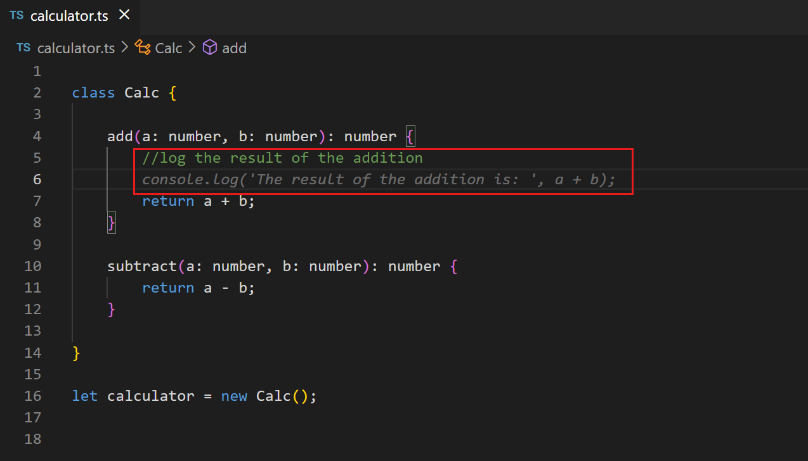
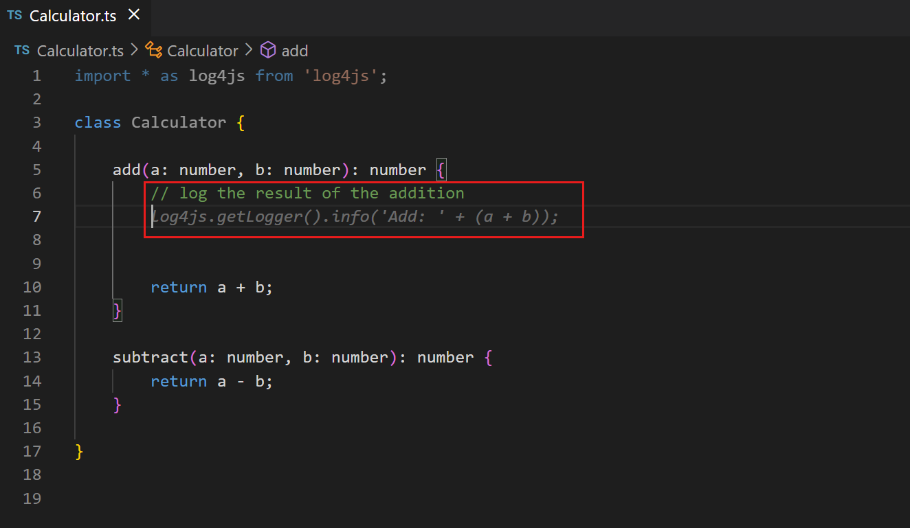
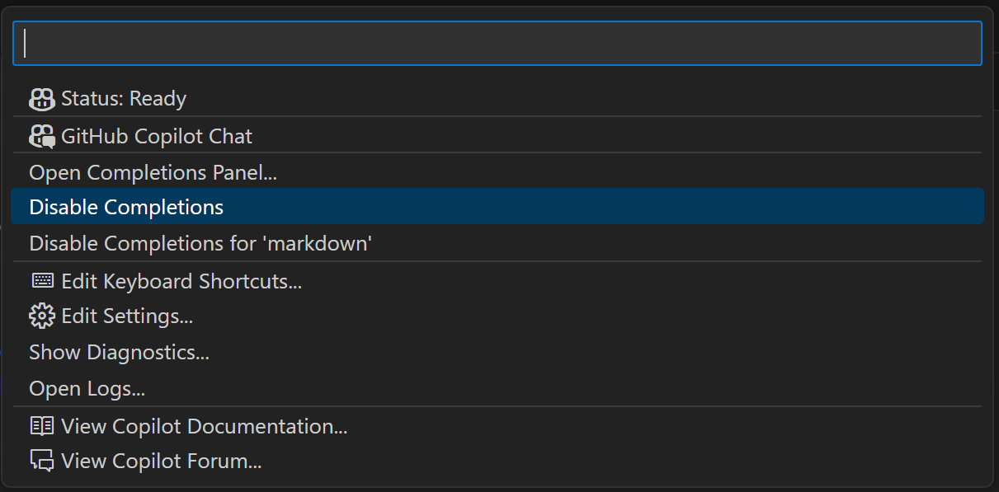
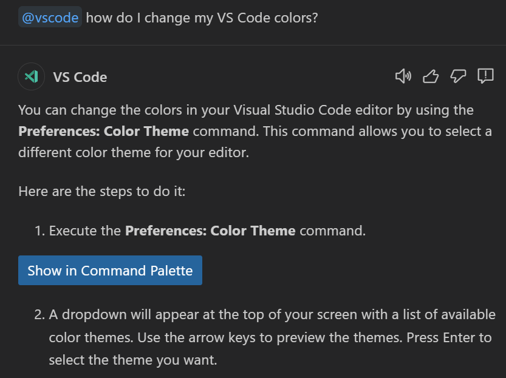
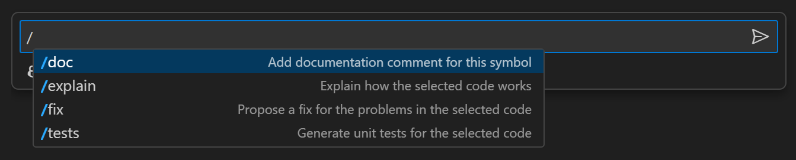
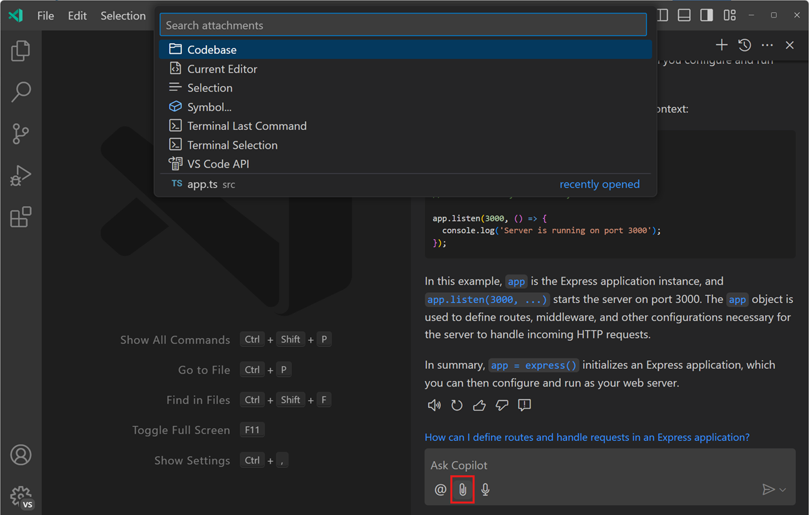
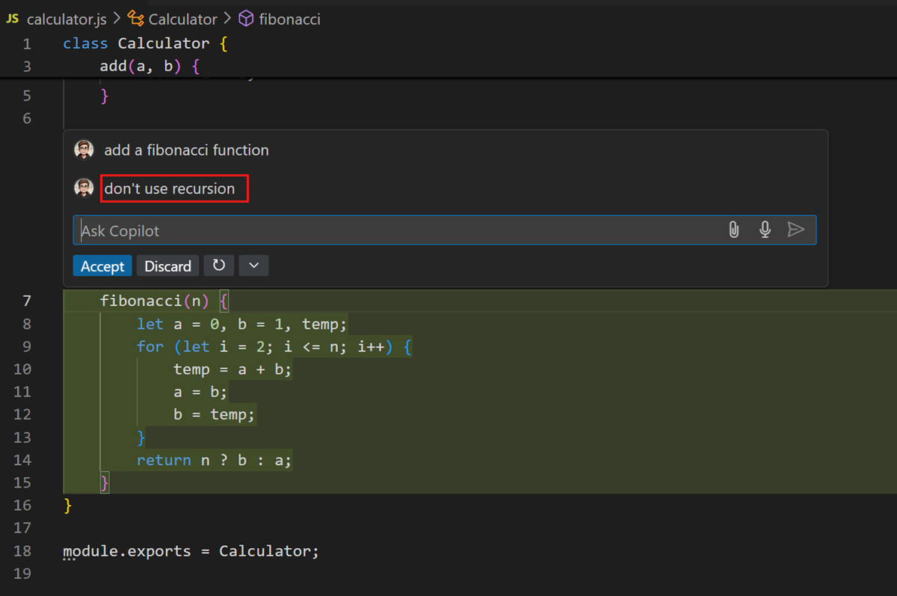

# GitHub Copilot을 VS Code에서 사용하는 모범 사례 {#best-practices-for-using-github-copilot-in-vs-code}

이 문서에서는 GitHub Copilot을 Visual Studio Code에서 사용하는 모범 사례를 다루며, 프롬프트 제작과 GitHub Copilot에 적절한 컨텍스트를 제공하는 방법에 대해 설명합니다.

> [!NOTE]
> "프롬프트 엔지니어링" 또는 "프롬프트 제작"은 AI에 대해 논의할 때 자주 듣게 되는 일반적인 용어로, AI API 엔드포인트에 패키징되어 전송되는 정보의 형태와 내용을 의미합니다. Copilot 확장 프로그램이 이 과정을 대신 수행하지만, 확장을 안내할 수 있는 힌트를 제공함으로써 도움을 줄 수 있습니다.

<iframe width="560" height="315" src="https://www.youtube-nocookie.com/embed/hh1nOX14TyY" title="GitHub Copilot과 함께하는 프롬프트 엔지니어링의 핵심 원칙" frameborder="0" allow="accelerometer; autoplay; clipboard-write; encrypted-media; gyroscope; picture-in-picture" allowfullscreen></iframe>

VS Code나 GitHub Copilot을 처음 사용하는 경우, 먼저 [GitHub Copilot 개요](/docs/copilot/overview.md) 문서를 검토하거나 [시작하기](/docs/copilot/getting-started.md) 튜토리얼로 바로 들어가기를 권장합니다.

인라인 제안 및 채팅을 위한 Copilot 경험을 최적화할 수 있는 다양한 옵션이 있습니다:

- [인라인 제안 최대한 활용하기](#getting-the-most-out-of-copilot-inline-suggestions)
- [Copilot 채팅 최대한 활용하기](#getting-the-most-out-of-copilot-chat)

## Copilot 인라인 제안을 최대한 활용하기 {#getting-the-most-out-of-copilot-inline-suggestions}

[GitHub Copilot](https://marketplace.visualstudio.com/items?itemName=GitHub.copilot) 확장 프로그램은 [제안](/docs/copilot/overview.md#Code-completions-in-the-editor)을 자동으로 제공하여 더 효율적으로 코딩할 수 있도록 도와줍니다. Copilot이 최상의 제안을 제공하도록 돕기 위해 할 수 있는 일들이 있습니다. 좋은 소식은 여러분이 지금도 이러한 방법들을 잘 활용하고 있다는 것입니다. 이는 여러분과 동료들이 코드를 이해하는 데 도움이 됩니다.

### Copilot에 컨텍스트 제공하기 {#provide-context-to-copilot}

Copilot은 여러분이 무엇을 하고 있는지, 어떤 도움을 원하는지에 대한 충분한 컨텍스트가 있을 때 가장 잘 작동합니다. 특정 프로그래밍 작업에 대한 도움을 요청할 때 동료에게 컨텍스트를 제공하는 것처럼, Copilot에게도 동일하게 할 수 있습니다.

#### 열린 파일 {#open-files}

코드 완성을 위해 Copilot은 현재 편집기에서 열려 있는 파일을 살펴보아 컨텍스트를 분석하고 적절한 제안을 생성합니다. Copilot을 사용할 때 관련 파일을 VS Code에서 열어 두면 이 컨텍스트를 설정하는 데 도움이 되며, Copilot이 프로젝트의 전체적인 그림을 볼 수 있게 합니다.

#### 최상위 주석 {#top-level-comment}

동료에게 간단하고 높은 수준의 소개를 제공하듯이, 작업 중인 파일에 최상위 주석을 추가하면 Copilot이 여러분이 생성하고 있는 조각들의 전체적인 컨텍스트를 이해하는 데 도움이 됩니다.

<!-- 좋은 최상위 주석과 나쁜 최상위 주석의 예 -->

#### 적절한 포함 및 참조 {#appropriate-includes-and-references}

작업에 필요한 포함 또는 모듈 참조를 수동으로 설정하는 것이 가장 좋습니다. Copilot이 제안을 할 수 있지만, 여러분이 포함해야 할 종속성을 가장 잘 알고 있을 것입니다. 이는 Copilot이 제안을 만들 때 사용하고자 하는 프레임워크, 라이브러리 및 그 버전을 알 수 있도록 도와줍니다.

다음 TypeScript 예제에서는 `add` 메서드의 출력을 기록하고자 합니다. 포함이 없을 때 Copilot은 `console.log`를 사용하라고 제안합니다:

반면에 `Log4js`에 대한 참조를 추가하면 Copilot은 해당 프레임워크를 사용하여 출력을 기록하라고 제안합니다:

#### 의미 있는 함수 이름 {#meaningful-function-names}

`fetchData()`라는 메서드는 동료에게 큰 의미가 없듯이 (몇 달 후의 여러분에게도 마찬가지입니다), Copilot에게도 도움이 되지 않습니다. 의미 있는 함수 이름을 사용하면 Copilot이 여러분이 원하는 작업을 수행하는 본체를 제공하는 데 도움이 됩니다.

<!-- 의미 있는 함수/메서드 이름의 예 -->

#### 구체적이고 잘 정의된 함수 주석 {#specific-and-well-scoped-function-comments}

함수 이름은 지나치게 길지 않으면서도 어느 정도 설명적일 수 있습니다. 함수 주석은 Copilot이 알아야 할 세부 정보를 채우는 데 도움이 될 수 있습니다.

<!-- 의미 있는 함수/메서드 주석의 예 -->

#### 샘플 코드로 Copilot 준비시키기 {#prime-copilot-with-sample-code}

Copilot을 올바른 방향으로 유도하는 한 가지 방법은 여러분이 찾고 있는 것과 유사한 샘플 코드를 열려 있는 편집기에 복사하여 붙여넣는 것입니다. 작은 예제를 제공하면 Copilot이 여러분이 달성하고자 하는 언어와 작업에 맞는 제안을 생성하는 데 도움이 됩니다. Copilot이 여러분이 원하는 코드와 실제로 사용할 코드를 제공하기 시작하면, 파일에서 샘플 코드를 삭제할 수 있습니다. 이는 Copilot이 이전 코드 제안을 기본으로 제공할 때 새로운 라이브러리 버전으로 시작하는 데 특히 유용할 수 있습니다.

### 일관성을 유지하고 품질 기준을 높게 유지하기 {#be-consistent-and-keep-the-quality-bar-high}

Copilot은 여러분의 코드를 기반으로 기존 패턴을 따르는 제안을 생성하므로 "쓰레기를 넣으면 쓰레기가 나온다"는 격언이 적용됩니다.

항상 높은 품질 기준을 유지하는 것은 규율이 필요할 수 있습니다. 특히 무언가를 작동시키기 위해 빠르고 느슨하게 코딩할 때는 "해킹" 모드에서 Copilot 완성을 비활성화하고 싶을 수 있습니다. Copilot 상태 메뉴에서 일시적으로 완성을 비활성화할 수 있습니다. Copilot 상태 표시줄 항목을 선택하여 Copilot 상태 메뉴 드롭다운을 표시합니다.

드롭다운에서 완성을 완전히 비활성화하거나, 예를 들어 Markdown 파일과 같은 활성 파일 유형에 대해서만 비활성화할 수 있습니다.

<!-- ### 구체적으로 작성하기

작업을 개별적인 구체적인 작업으로 나누기

입력, 출력, 범위, API, 프레임워크에 대해 구체적으로 작성하기.

### 제안 검증하기 {#verify-suggestions}

Copilot은 컴파일러나 언어 서비스가 아닙니다.

이미 사용하고 있을 수 있는 도구들이 도움이 될 수 있습니다.

#### 언어 서비스 경고 {#language-service-warnings}

#### 린터 --> {#linters---}

## Copilot 채팅 최대한 활용하기 {#getting-the-most-out-of-copilot-chat}

[GitHub Copilot Chat](https://marketplace.visualstudio.com/items?itemName=GitHub.copilot-chat) 확장을 설치하면 Copilot과 [채팅 인터페이스](/docs/copilot/overview.md#Answer-coding-questions)를 통해 도움을 받을 수 있습니다.

GitHub Copilot과 상호작용할 때 채팅을 사용할 때 경험을 최적화하기 위해 할 수 있는 여러 가지가 있습니다.

### 채팅 참가자 및 슬래시 명령 사용하기 {#use-chat-participants-and-slash-commands}

채팅 참가자는 코드베이스 또는 특정 도메인이나 기술에 대한 추가 컨텍스트를 수집하도록 설계되었습니다. 적절한 참가자를 사용하면 Copilot Chat이 Copilot 백엔드에 보낼 더 나은 정보를 찾고 제공할 수 있습니다. 예를 들어, 열린 프로젝트에 대한 질문을 하고 싶다면 `@workspace`를 사용하고, VS Code 기능 및 API에 대해 더 알고 싶다면 `@vscode`를 사용하세요.

슬래시 명령은 질문을 할 때 Copilot Chat이 여러분의 **의도**를 이해하는 데 도움이 됩니다. 코드베이스에 대해 배우고 있습니까? (`/explain`), 문제를 해결하는 데 도움이 필요합니까? (`/fix`), 아니면 테스트 케이스를 생성하고 있습니까? (`/tests`)? Copilot Chat에게 여러분이 하려는 일을 알려주면, 작업에 맞게 답변을 조정하고 유용한 명령, 설정 및 코드 스니펫을 제공할 수 있습니다.

프로젝트 범위나 현재 작업을 자연어 쿼리로 작성할 수 있지만, 채팅 참가자와 슬래시 명령을 사용하는 것이 더 간결하고 명확합니다.

Copilot Chat에서 [채팅 참가자](/docs/copilot/copilot-chat.md#chat-participants)와 [슬래시 명령](/docs/copilot/copilot-chat.md#slash-commands)에 대해 자세히 알아보세요.

### 컨텍스트를 위한 채팅 변수 사용하기 {#use-chat-variables-for-context}

`@workspace` 또는 `@vscode`와 같은 채팅 참가자는 도메인별 컨텍스트를 제공하는 채팅 변수를 기여할 수 있습니다. 채팅 프롬프트에서 `#` 기호를 사용하여 채팅 변수를 참조할 수 있습니다. 채팅 변수를 사용하면 채팅 프롬프트에 포함하는 컨텍스트에 대해 더 구체적으로 설명할 수 있습니다.

예를 들어, `#file` 변수는 채팅 프롬프트에서 작업 공간의 특정 파일을 참조할 수 있게 해줍니다. 이는 Copilot Chat의 답변이 여러분이 작업 중인 파일에 대한 컨텍스트를 제공하여 더 관련성이 높아지도록 도와줍니다. "Can you suggest improvements to #file:package.json?" 또는 "How do I add an extension in #file:devcontainer.json?"와 같은 질문을 할 수 있습니다. `#file` 변수를 사용하면 Copilot으로부터 더 목표 지향적이고 정확한 응답을 받을 수 있습니다.

채팅 메시지에 컨텍스트를 추가하려면 채팅 보기에서 **컨텍스트 첨부** 버튼을 사용할 수 있습니다. 그런 다음 현재 선택, 작업 공간의 하나 이상의 파일 또는 소스 코드의 하나 이상의 기호와 같은 특정 유형의 컨텍스트를 빠른 선택에서 선택할 수 있습니다.

Copilot Chat에서 [컨텍스트 변수를 사용하는 방법](/docs/copilot/copilot-chat.md#add-context-to-your-chat-prompt)에 대해 자세히 알아보세요.

### 구체적으로 작성하고 간단하게 유지하기 {#be-specific-and-keep-it-simple}

Copilot에게 무언가를 요청할 때는 요청을 구체적으로 하고 큰 작업을 개별적인 작은 작업으로 나누세요. 예를 들어, Copilot에게 TypeScript와 Pug를 사용하는 Express 앱을 만들고 MongoDB 데이터베이스에서 데이터를 가져오는 제품 페이지를 만들라고 요청하지 마세요. 대신, 먼저 Copilot에게 TypeScript와 Pug로 Express 앱을 생성하도록 요청하세요. 다음으로 제품 페이지를 추가하도록 요청하고, 마지막으로 데이터베이스에서 고객 데이터를 가져오도록 요청하세요.

Copilot에게 특정 작업을 요청할 때는 사용하고자 하는 입력, 출력, API 또는 프레임워크에 대해 구체적으로 설명하세요. 프롬프트가 구체적일수록 결과가 더 좋아집니다. 예를 들어, "데이터베이스에서 제품 데이터를 읽기" 대신 "카테고리별로 모든 제품을 읽고, 데이터를 JSON 형식으로 반환하며, Mongoose 라이브러리를 사용하기"라고 작성하세요.

### 솔루션 반복하기 {#iterate-on-your-solution}

Copilot Chat에게 도움을 요청할 때 첫 번째 응답에 얽매이지 않아도 됩니다. 반복하여 Copilot에게 솔루션을 개선하도록 요청할 수 있습니다. Copilot은 생성된 코드의 컨텍스트와 현재 대화 내용을 모두 가지고 있습니다.

다음은 인라인 채팅을 사용하여 피보나치 수를 계산하는 함수를 만드는 예입니다:

아마도 재귀를 사용하지 않는 솔루션을 선호할 것입니다:

코딩 규칙을 따르거나 변수 이름을 개선하도록 Copilot에게 요청할 수도 있습니다:

이미 결과를 수락했더라도, 나중에 코드를 반복하도록 Copilot에게 요청할 수 있습니다.

## Copilot 프롬프트에 대한 추가 자료 {#more-resources-about-prompting-for-copilot}

GitHub Copilot을 생산적으로 사용하는 방법에 대해 더 알고 싶다면, 다음 비디오와 블로그 게시물을 참고하세요:

* [GitHub Copilot을 위한 효과적인 프롬프트](https://www.youtube.com/watch?v=ImWfIDTxn7E)
* [GitHub Copilot을 최대한 활용하기 위한 실용적인 기법](https://www.youtube.com/watch?v=CwAzIpc4AnA)
* [VS Code에서 GitHub Copilot을 위한 프롬프트 작성 모범 사례](https://www.linkedin.com/pulse/best-practices-prompting-github-copilot-vs-code-pamela-fox)
* [GitHub Copilot 사용 방법: 프롬프트, 팁 및 사용 사례](https://github.blog/2023-06-20-how-to-write-better-prompts-for-github-copilot/)