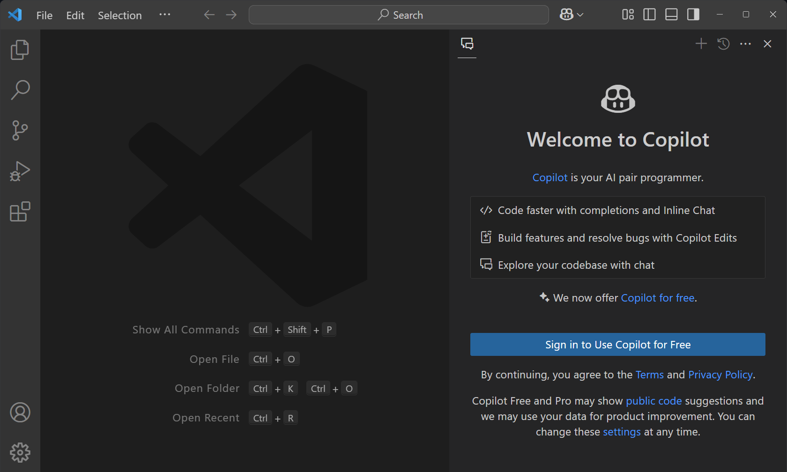
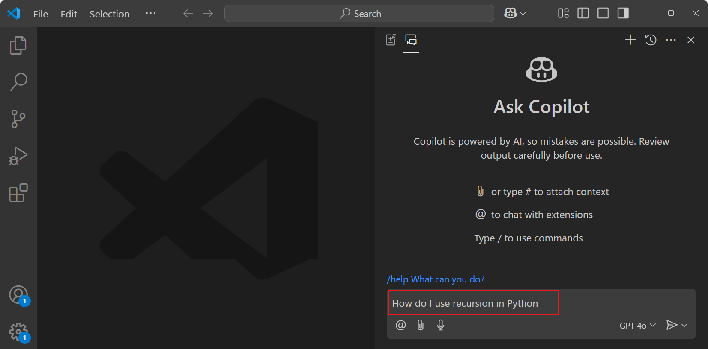

---
Order:
Area: copilot
TOCTitle: Copilot 설정
ContentId: a18e245e-af72-4d0f-b322-fa1030af5284
PageTitle: GitHub Copilot 설정하기
DateApproved: 03/05/2025
MetaDescription: VS Code에서 Copilot 설정하기
MetaSocialImage: images/shared/github-copilot-social.png
---
# Visual Studio Code에서 Copilot 설정하기 {#set-up-visual-studio-code-with-copilot}

AI 기반 개발에 오신 것을 환영합니다! 이 가이드를 따라 몇 분 안에 시작해 보세요.

## VS Code에서 Copilot 무료 사용 활성화하기 {#enable-copilot-free-in-vs-code}

1. [플랫폼에 맞는 Visual Studio Code 다운로드 및 설치](https://code.visualstudio.com/Download)

1. VS Code 시작하기

1. 제목 표시줄의 Copilot 메뉴 또는 명령 팔레트(`kb(workbench.action.showCommands)`)에서 **Copilot으로 AI 기능 무료 사용...**을 선택합니다.

    

1. **Copilot 무료 사용을 위해 로그인**을 선택하여 GitHub 계정에 로그인하고 Copilot 무료 사용을 신청합니다.

    이미 GitHub 계정에 연결된 Copilot 구독이 있는 경우, 로그인 후 VS Code에서 해당 구독을 사용합니다.

    

1. 채팅 입력 필드에 프롬프트를 입력하여 시작합니다.

    

## 다음 단계 {#next-steps}

- [Copilot 빠른 시작 가이드](/docs/copilot/getting-started.md)를 통해 VS Code에서 AI 기반 개발을 탐색해 보세요.
- [VS Code에서 Copilot 개요](/docs/copilot/overview.md)를 확인하세요.

## 관련 자료 {#related-resources}

- [Copilot 무료 요금제 세부사항 및 조건](https://docs.github.com/en/copilot/about-github-copilot/subscription-plans-for-github-copilot)에 대한 더 많은 정보를 확인하세요.
---