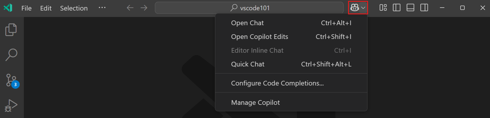
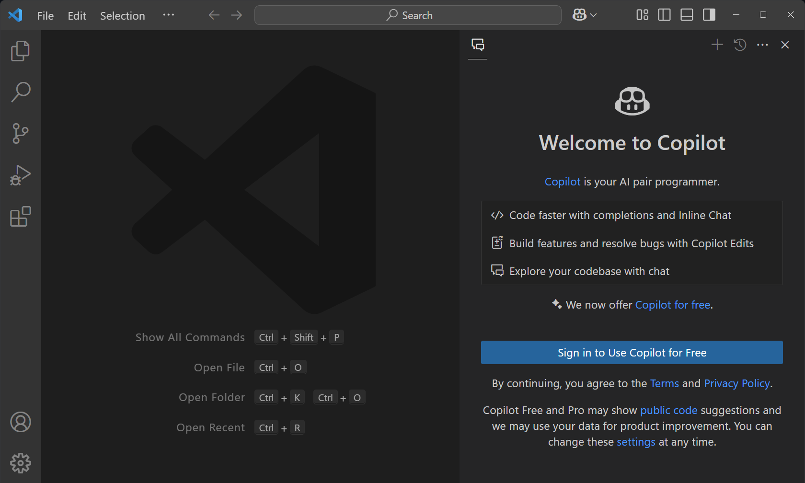

# VS Code에서 GitHub Copilot 설정하기 {#set-up-github-copilot-in-vs-code}

이 가이드는 Visual Studio Code에서 GitHub Copilot을 설정하는 방법을 안내합니다. VS Code에서 Copilot을 사용하려면 GitHub 계정으로 GitHub Copilot에 접근할 수 있어야 하며, VS Code에 Copilot 확장 프로그램을 설치해야 합니다.

:::tip
아직 Copilot 구독이 없다면, [Copilot 무료 플랜](https://github.com/github-copilot/signup)에 가입하여 무료로 Copilot을 사용할 수 있으며, 월별 완료 수 및 채팅 상호작용에 대한 제한이 있습니다.
:::

## GitHub Copilot 사용하기 {#get-access-to-github-copilot}

GitHub Copilot을 사용하는 방법은 여러 가지가 있습니다:

| 사용자 유형                     | 설명 |
|--------------------------------|-------------|
| 개인                           | <ul><li>[GitHub Copilot 무료](https://github.com/github-copilot/signup) 설정하여 구독 없이 제한된 Copilot 경험을 얻을 수 있습니다. [GitHub Copilot 무료에 대한 설명](https://docs.github.com/en/copilot/managing-copilot/managing-copilot-as-an-individual-subscriber/about-github-copilot-free)을 참조하세요.</li><li>무제한 코드 완성 및 채팅 상호작용을 위해 유료 GitHub Copilot 구독에 가입하세요. [GitHub Copilot을 무료로 체험해보세요](https://github.com/github-copilot/signup?ref_cta=Copilot+trial&ref_loc=about+github+copilot&ref_page=docs) 30일 무료 체험을 제공합니다.</li><li>[자신을 위한 GitHub Copilot 설정하기](https://docs.github.com/en/copilot/setting-up-github-copilot/setting-up-github-copilot-for-yourself)에서 모든 옵션을 확인하세요.</li></ul> |
| 조직/기업 구성원               | <ul><li>조직이나 기업의 구성원으로 GitHub Copilot 구독이 있는 경우, https://github.com/settings/copilot로 가서 "조직에서 Copilot 받기" 아래에서 접근 요청을 할 수 있습니다.</li><li>[조직을 위한 GitHub Copilot 설정하기](https://docs.github.com/en/copilot/setting-up-github-copilot/setting-up-github-copilot-for-your-organization)를 참조하여 조직에 Copilot을 활성화하세요.</li></ul> |

## VS Code에서 Copilot 설정하기 {#set-up-copilot-in-vs-code}

VS Code는 GitHub Copilot을 설정하는 간소화된 경험을 제공합니다. 이 과정에서 GitHub Copilot 확장 프로그램이 설치되고 GitHub 계정으로 로그인됩니다. 아직 Copilot 구독이 없다면, [Copilot 무료 플랜](https://github.com/github-copilot/signup)이 활성화됩니다.

1. VS Code 제목 표시줄의 Copilot 메뉴 또는 명령 팔레트(`kb(workbench.action.showCommands)`)에서 **Use AI Features with Copilot for Free...** 을 선택합니다.

    

    :::tip
    키보드 단축키 `kb(workbench.action.chat.open)`를 사용하거나 **Open Chat** 명령으로 채팅 보기를 직접 열 수 있습니다.
    :::

1. **Sign in to Use Copilot for Free**을 선택하여 GitHub 계정으로 로그인합니다. 이 단계에서 Copilot 확장 프로그램도 설치됩니다.

    

    이미 Copilot 구독이 있는 경우, 이제 VS Code에서 Copilot을 사용할 수 있습니다.

1. 아직 Copilot 구독이 없다면, 브라우저에서 Copilot 무료 플랜에 가입하는 단계를 따릅니다.

    :::important
    무료 버전의 GitHub Copilot에서 사용 데이터 수집 기능이 현재 활성화되어 있습니다. 기본적으로 공개 코드와 일치하는 코드 제안이 허용됩니다. VS Code에서 `setting(telemetry.telemetryLevel)`을 `off`로 설정하여 사용 데이터 수집을 선택 해제할 수 있으며, [Copilot 설정](https://github.com/settings/copilot)에서 사용 데이터 수집 기능 및 코드 제안 설정을 조정할 수 있습니다.
    :::

## VS Code에서 Copilot 시작하기 {#get-started-with-copilot-in-vs-code}

GitHub 계정으로 로그인하고 Copilot에 접근한 후, VS Code에서 AI 기반 코딩을 탐색해 보세요.

1. 채팅 보기(`kb(workbench.action.chat.open)`)가 표시되고, 채팅 입력 상자에 프롬프트를 입력할 수 있는지 확인합니다.

    

    Copilot과 함께 사용할 수 있는 여러 언어 모델 중에서 선택할 수 있음을 확인하세요.

1. [Copilot 빠른 시작](/docs/copilot/getting-started.md)을 계속 진행하여 VS Code에서 Copilot의 주요 기능을 발견하세요.

## VS Code에서 GitHub Copilot 수동 설정하기 {#manually-set-up-github-copilot-in-vs-code}

VS Code에서 GitHub Copilot을 수동으로 설정하려면 다음 단계를 수행합니다:

1. VS Code에 GitHub Copilot 확장 프로그램을 설치합니다.

    > <a class="install-extension-btn" href="vscode:extension/GitHub.copilot?referrer=docs-copilot-setup">GitHub Copilot 확장 프로그램 설치</a>

    또한 확장 프로그램 보기에서 *GitHub Copilot*을 검색하여 확장 프로그램을 설치할 수 있습니다.

    :::note
    GitHub Copilot 확장 프로그램을 설치하면 [GitHub Copilot 채팅](https://marketplace.visualstudio.com/items?itemName=GitHub.copilot-chat) 확장 프로그램도 함께 설치됩니다.
    :::

1. VS Code에서 Copilot에 로그인합니다.

    명령 팔레트(`kb(workbench.action.showCommands)`)에 **GitHub Copilot: 로그인**을 입력하여 GitHub 계정으로 로그인합니다.

    

## 다른 GitHub 계정으로 Copilot 사용하기 {#use-a-different-github-account-with-copilot}

Copilot 구독이 다른 GitHub 계정에 연결되어 있는 경우, VS Code에서 현재 로그인된 GitHub 계정에서 로그아웃하고 다른 계정으로 로그인합니다.

1. 활동 표시줄에서 **Accounts** 메뉴를 선택한 후, Copilot에 현재 로그인된 계정에 대해 **Sign out**을 선택합니다.

    

1. 명령 팔레트(`kb(workbench.action.showCommands)`)에 **GitHub Copilot: Sign in**을 입력하여 GitHub 계정으로 로그인합니다.

    또는 활동 표시줄의 **Accounts** 메뉴를 선택한 후, **Sign in with GitHub to use GitHub Copilot**을 선택하여 VS Code에서 GitHub에 로그인할 수 있습니다.

    

## 다음 단계 {#next-steps}

* [Copilot 빠른 시작](/docs/copilot/getting-started.md)을 계속 진행하여 VS Code에서 Copilot의 주요 기능을 발견하세요.

* [Copilot 요약 시트](/docs/copilot/copilot-vscode-features.md)를 확인하여 주요 Copilot 명령 및 단축키에 대한 개요를 확인하세요.
