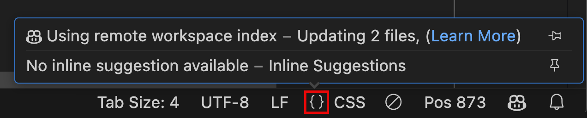

# Copilot 채팅을 작업공간의 전문가로 만들기 {#making-copilot-chat-an-expert-in-your-workspace}

Copilot 채팅에서 `@workspace`를 참조하면 전체 코드베이스에 대한 질문을 할 수 있습니다. 질문에 따라 Copilot은 관련 파일과 기호를 지능적으로 검색하여 답변에서 링크와 코드 예제로 참조합니다. `@workspace` 참조를 기반으로 Copilot 채팅은 다음과 같은 작업에 대한 도메인 전문가가 됩니다:

- 코드베이스에서 기존 코드 찾기:
  - `"@workspace 데이터베이스 연결 문자열이 어디에 설정되어 있나요?"` - 데이터베이스 연결이 어디서 어떻게 설정되어 있는지 설명합니다.
  - `"@workspace 날짜를 어떻게 검증할 수 있나요?"` - 코드베이스에서 기존 날짜 검증 도우미를 찾습니다.
  - `"@workspace 테스트는 어디에 정의되어 있나요?"` - 테스트 스위트, 케이스 및 관련 참조와 구성의 위치를 제공합니다.
- 복잡한 코드 수정 계획 세우기:
  - `"@workspace 버튼에 풍부한 툴팁을 추가하려면 어떻게 해야 하나요?"` - 버튼 요소와 함께 기존 툴팁 컴포넌트를 사용하는 계획을 제공합니다.
  - `"@workspace #selection에 날짜 검증 추가하기"` - 선택한 코드에 기존 날짜 검증을 적용하는 방법을 계획합니다.
  - `"@workspace 비밀번호 찾기 양식을 위한 새로운 API 경로 추가하기"` - 새로운 경로를 추가할 위치와 기존 코드에 연결하는 방법을 개요합니다.
- 코드베이스의 고급 개념 설명하기:
  - `"@workspace 인증은 어떻게 구현되나요?"` - 인증 흐름에 대한 개요와 관련 코드에 대한 참조를 제공합니다.
  - `"@workspace 이 서비스에 의존하는 API 경로는 무엇인가요?"` - 선택한 코드에서 이 서비스를 사용하는 경로를 나열합니다.
  - `"이 #codebase를 어떻게 빌드하나요?"` - 문서, 스크립트 및 구성을 기반으로 프로젝트를 빌드하는 단계를 나열합니다.

## `@workspace`는 어떤 소스를 사용하여 컨텍스트를 제공하나요? {#what-sources-does-workspace-use-for-context}

질문에 답하기 위해 `@workspace`는 개발자가 VS Code에서 코드베이스를 탐색할 때 사용하는 것과 동일한 소스를 검색합니다:

- `.gitignore` 파일에 의해 무시되지 않는 작업공간의 모든 [인덱스 가능 파일](#what-content-is-included-in-the-workspace-index)
- 중첩된 폴더 및 파일 이름을 포함한 디렉토리 구조
- 작업공간이 GitHub 리포지토리이고 [코드 검색에 의해 인덱스된 경우](https://docs.github.com/en/enterprise-cloud@latest/copilot/github-copilot-enterprise/copilot-chat-in-github/using-github-copilot-chat-in-githubcom#asking-a-question-about-a-specific-repository-file-or-symbol) GitHub의 코드 검색 인덱스
- 작업공간의 기호 및 정의
- 현재 선택된 텍스트 또는 활성 편집기에서 보이는 텍스트

> [!NOTE]
> `.gitignore`는 무시된 파일 내에서 파일을 열거나 텍스트를 선택한 경우 우회됩니다.

## `@workspace`는 가장 관련성 높은 컨텍스트를 어떻게 찾나요? {#how-does-workspace-find-the-most-relevant-context}

전체 VS Code 작업공간은 GitHub Copilot이 채팅 프롬프트에 응답하기 위해 완전히 전달하기에는 너무 클 수 있습니다. 대신, `@workspace`는 다양한 컨텍스트 소스에서 가장 관련성 높은 정보를 추출하여 Copilot의 답변을 기반으로 합니다.

먼저, `@workspace`는 질문에 답하기 위해 필요한 정보를 결정하며, 여기에는 대화 기록, 작업공간 구조 및 현재 선택된 코드도 포함됩니다.

다음으로, 관련 코드 스니펫을 로컬에서 검색하거나 [GitHub의 코드 검색](https://github.blog/2023-02-06-the-technology-behind-githubs-new-code-search)을 사용하여 찾는 등 다양한 접근 방식을 사용하여 컨텍스트를 수집합니다. 또한 VS Code의 언어 IntelliSense를 사용하여 함수 서명, 매개변수 등과 같은 세부 정보를 추가합니다.

마지막으로, 이 컨텍스트는 GitHub Copilot이 질문에 답하는 데 사용됩니다. 컨텍스트가 너무 크면 가장 관련성 높은 부분만 사용됩니다. 응답은 파일, 파일 범위 및 기호에 대한 참조로 마크업됩니다. 이를 통해 채팅 응답에서 코드베이스의 해당 정보로 직접 링크할 수 있습니다. Copilot에 제공된 코드 스니펫은 응답에서 참조로 나열됩니다.

## `@workspace` 슬래시 명령을 위한 컨텍스트 {#context-for-workspace-slash-commands}

`@workspace`는 일반적으로 사용되는 작업의 약어로 여러 개의 *슬래시 명령*을 제공합니다. 이를 통해 시간과 입력 노력을 절약할 수 있습니다. 각 명령은 고유한 최적화된 컨텍스트를 정의하며, 종종 추가 프롬프트나 채팅 변수가 필요하지 않습니다. 사용 가능한 슬래시 명령과 그 컨텍스트는 다음과 같습니다:

| 명령          | 컨텍스트 |
| -------------- | ------- |
| `/explain`     | <ul><li>활성 편집기에서 텍스트 선택으로 시작합니다 (`#selection`). Copilot 채팅 응답을 최적화하기 위해, Copilot이 유용한 응답을 제공하는 데 도움이 되는 관련 정보를 포함하도록 텍스트 선택을 확장해야 합니다.</li><li>참조된 기호(예: 함수 및 클래스)의 구현을 조회하여 보다 정확하고 유용한 설명을 제공합니다.</li></ul> |
| `/tests`       | <ul><li>활성 편집기에서 현재 텍스트 선택. 텍스트가 선택되지 않은 경우, 현재 활성 파일의 내용을 사용합니다.</li><li>기존 테스트 파일과 관련된 내용을 이해하기 위한 기존 테스트 및 모범 사례.</li></ul> |
| `/fix`         | <ul><li>활성 편집기에서 현재 텍스트 선택. 텍스트가 선택되지 않은 경우, 편집기에서 현재 보이는 텍스트를 사용합니다.</li><li>수정해야 할 사항과 방법을 이해하기 위한 오류 및 참조된 기호.</li></ul> |
| `/new`         | <ul><li>채팅 프롬프트만 컨텍스트로 사용됩니다.</li></ul> |
| `/newNotebook` | <ul><li>채팅 프롬프트만 컨텍스트로 사용됩니다.</li></ul> |

채팅 프롬프트에서 `#editor`, `#selection` 또는 `#file`과 같은 채팅 변수를 사용하여 컨텍스트를 명시적으로 확장할 수 있습니다. 예를 들어, 다른 파일의 패턴을 기반으로 현재 파일에서 오류를 수정하려면 다음과 같은 채팅 프롬프트를 사용합니다: `@workspace /fix linting error in the style of #file:form.ts`.

## 작업공간 인덱스 관리 {#managing-the-workspace-index}

Copilot은 인덱스를 사용하여 코드베이스에서 관련 코드 스니펫을 빠르고 정확하게 검색합니다. 이 인덱스는 GitHub에 의해 유지되거나 로컬 머신에 저장될 수 있습니다. 이 섹션에서는 Copilot이 사용할 수 있는 다양한 유형의 인덱스([원격](#remote-index), [로컬](#local-index), [기본](#basic-index))를 다루고, 각 인덱스가 언제 사용되는지 및 어떻게 전환할 수 있는지 설명합니다.

Copilot이 현재 사용 중인 인덱스 유형을 보려면 상태 표시줄에서 `{}` 아이콘을 선택하여 언어 상태 UI를 확인하세요. Copilot 작업공간 인덱스 항목은 인덱스 유형과 함께 재인덱싱되는 파일 수와 같은 관련 정보를 보여줍니다.

### 원격 인덱스 {#remote-index}

GitHub 리포지토리의 경우, Copilot은 [GitHub 코드 검색](https://docs.github.com/en/enterprise-cloud@latest/copilot/using-github-copilot/asking-github-copilot-questions-in-github#asking-exploratory-questions-about-a-repository)을 사용하여 코드베이스의 원격 인덱스를 구축할 수 있습니다. 이를 통해 Copilot은 코드베이스가 매우 클 경우에도 전체 코드베이스를 매우 빠르게 검색할 수 있습니다.

원격 인덱스를 사용하려면:

- VS Code에서 GitHub 계정으로 로그인합니다.
- GitHub git 원격이 있는 프로젝트를 엽니다. 코드를 GitHub에 푸시했는지 확인하세요.

    원격 인덱스는 GitHub에 코드의 비교적 최신 버전이 있을 때 가장 잘 작동하므로, 코드를 정기적으로 GitHub에 푸시해야 합니다.

- **원격 작업공간 인덱스 구축** 명령을 실행하거나 작업공간 인덱스 상태 UI에서 인덱스 구축 버튼을 선택하여 원격 인덱스를 구축합니다.

    원격 인덱스가 구축되는 데는 시간이 걸릴 수 있으며, 특히 큰 코드베이스의 경우 더욱 그렇습니다. 작업공간 인덱스 상태 UI에서 원격 인덱스의 상태를 모니터링할 수 있습니다.

    원격 인덱스가 구축되면, GitHub은 코드 변경 사항을 푸시할 때마다 자동으로 이를 최신 상태로 유지합니다. 각 리포지토리당 **원격 작업공간 인덱스 구축** 명령을 한 번만 실행하면 됩니다.

### 로컬 인덱스 {#local-index}

[원격 인덱스](#remote-index)를 사용할 수 없는 경우, Copilot은 대신 로컬 머신에 저장된 고급 의미론적 인덱스를 사용할 수 있습니다. 이 인덱스는 빠르고 높은 품질의 검색 결과를 제공할 수 있습니다. 그러나 현재 2500개의 인덱스 가능 파일로 제한되어 있습니다. 원격 인덱스와 달리 로컬 인덱스는 사용자당 한 번씩 구축해야 합니다. 원격 인덱스의 경우, 주어진 리포지토리의 모든 사용자가 동일한 인덱스를 사용할 수 있습니다.

Copilot은 프로젝트에 인덱스 가능 파일이 750개 미만인 경우 자동으로 고급 로컬 인덱스를 구축합니다. 750개에서 2500개 파일 사이의 프로젝트의 경우, **로컬 작업공간 인덱스 구축** 명령을 실행하여 인덱싱을 시작할 수 있습니다. 이 명령은 한 번만 실행하면 됩니다.

초기 로컬 인덱스를 구축하거나 많은 파일이 변경된 경우(예: git 브랜치를 전환할 때) 인덱스를 업데이트하는 데 시간이 걸릴 수 있습니다. 현재 로컬 인덱스 상태는 작업공간 인덱스 상태 UI에서 모니터링할 수 있습니다.

### 기본 인덱스 {#basic-index}

프로젝트에 [원격 인덱스](#remote-index)가 없고 2500개 이상의 [인덱스 가능 파일](#what-content-is-included-in-the-workspace-index)이 있는 경우, Copilot은 기본 인덱스를 사용하여 코드베이스를 검색합니다. 이 인덱스는 코드베이스를 검색하기 위해 더 간단한 알고리즘을 사용하며, 더 큰 코드베이스에 대해 로컬에서 작동하도록 최적화되었습니다.

기본 인덱스는 많은 질문에 대해 잘 작동해야 합니다. 그러나 Copilot이 코드베이스에 대한 질문에 답하는 데 어려움을 겪는 경우, [원격 인덱스](#remote-index)로 업그레이드해 보세요.

### 작업공간 인덱스에 포함된 콘텐츠는 무엇인가요? {#what-content-is-included-in-the-workspace-index}

Copilot은 현재 프로젝트의 일부인 관련 텍스트 파일을 인덱싱합니다. 이는 특정 파일 유형이나 프로그래밍 언어에 국한되지 않지만, Copilot은 일반적으로 `@workspace` 질문과 관련이 없는 일부 일반 파일 유형(예: `.tmp` 또는 `.out` 파일)을 자동으로 건너뜁니다. Copilot은 또한 `setting(files.exclude)` 설정을 사용하여 VS Code에서 제외된 파일이나 `.gitignore` 파일의 일부인 파일을 제외합니다.

Copilot은 현재 이진 파일(예: 이미지 또는 PDF)을 인덱싱하지 않습니다.

## `@workspace` 사용을 위한 팁 {#tips-for-using-workspace}

질문을 표현하는 방식은 `@workspace`가 제공하는 참조의 품질과 응답의 정확성에 큰 영향을 미칠 수 있습니다. 결과를 최적화하기 위해 다음 팁을 고려하세요:

- 질문을 구체적이고 상세하게 작성하고, "이게 뭐죠?"와 같은 모호한 용어는 피하세요(여기서 "이"는 마지막 답변, 현재 파일 또는 전체 프로젝트 등으로 해석될 수 있습니다).
- 프롬프트에 코드나 문서에서 나타날 가능성이 있는 용어와 개념을 포함하세요.
- 응답에서 *사용된 참조*를 검토하여 파일이 관련성이 있는지 확인하세요. 필요하다면 질문을 반복하세요.
- 코드 선택 또는 `#editor`, `#selection`, `#file`과 같은 채팅 변수를 언급하여 관련 컨텍스트를 명시적으로 포함하세요.
- 응답은 "catch 블록 없이 예외 찾기" 또는 "handleError가 호출되는 방법의 예 제공"과 같이 여러 참조에서 가져올 수 있습니다. 그러나 "이 함수가 몇 번 호출되나요?" 또는 "이 프로젝트의 모든 버그를 수정하세요"와 같은 코드베이스 전반에 걸친 포괄적인 코드 분석을 기대하지 마세요.
- 현재로서는 코드 외의 정보를 가정하지 마세요. 예를 들어 "이 파일에 기여한 사람은 누구인가요?" 또는 "이 폴더의 리뷰 코멘트를 요약하세요"와 같은 질문은 피하세요.

## 관련 리소스 {#related-resources}

- [Copilot Chat 튜토리얼](/docs/copilot/getting-started-chat.md) 시작하기
- [채팅 확장을 구축하기 위한 Chat Participant API 사용하기](/api/extension-guides/chat.md)