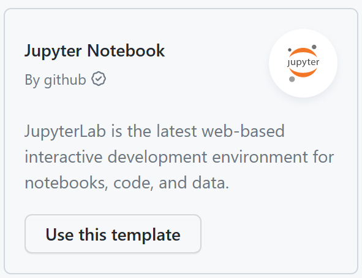

# Jupyter Notebooks on the web

Visual Studio Code supports working with [Jupyter Notebooks](https://jupyter-notebook.readthedocs.io/en/latest/) on the desktop, and extends to various browser-based platforms like [GitHub Codespaces](https://github.com/features/codespaces) and [VS Code for the Web](/docs/editor/vscode-web.md).

Using these browser-based platforms enables you to work on your notebooks (and beyond!) without having to install anything on your machine. You can read more about each of options and how to get started below:

- [Jupyter notebooks on **GitHub Codespaces**](#jupyter-notebooks-on-codespaces)
- [Remote tunneling with **VS Code Server** on VS Code for the Web](#remote-tunneling-with-vs-code-server)
- [Connect to a remote **Jupyter server** on VS Code for the Web](#connect-to-a-remote-jupyter-server)

## Jupyter notebooks on Codespaces

Developing Jupyter notebooks in VS Code can be done entirely through a web-based interface using [GitHub Codespaces](https://github.com/features/codespaces), a cloud-hosted development environment that is secure and configurable with free compute resources (more on Codespaces [monthly usage quotas](https://docs.github.com/billing/managing-billing-for-github-codespaces/about-billing-for-github-codespaces)). This means you can take advantage of all VS Code functionalities, including Jupyter notebooks support, without installing anything on your machine. To get started quickly:

1. Navigate to [https://github.com/codespaces](https://github.com/codespaces).
2. Under **Explore quick start templates**, select **Use this template** for **Jupyter Notebook**. If you don't see the **Jupyter Notebook** template, select **See all** and search for the template.

   

3. That's it! A codespace will be created for you to get started!

   > **Tip**: You can customize your project by committing [configuration files](https://docs.github.com/codespaces/setting-up-your-project-for-codespaces/introduction-to-dev-containers) to your repository (often known as Configuration-as-Code), which creates a repeatable codespace configuration for all users of your project. You can also see examples of predefined configurations on the [devcontainers/images repository](https://github.com/devcontainers/images/tree/main/src) to use and/or amend as needed for your project.

## Jupyter notebooks on VS Code for the Web

You can also use [VS Code for the Web](/docs/editor/vscode-web.md) by going to [https://vscode.dev](https://vscode.dev) or [https://github.dev](https://github.dev) (available by typing '.' when viewing a repo on GitHub). With VS Code for the Web, you have two options to connect to the following types of kernels for your notebook:

1. [Remote tunneling with VS Code Server](#remote-tunneling-with-vs-code-server)
2. [Connect to a remote Jupyter server](#connect-to-a-remote-jupyter-server)

## Remote tunneling with VS Code Server

You can securely connect to a remote machine without the requirement of SSH by installing the [VS Code Server](/docs/remote/vscode-server.md) on your remote machine and accessing it through VS Code for the Web (you can also connect to the server on VS Code Desktop). To do so:

1. Install the `code` [CLI](/download) on your remote machine.

   > **Note**: You can skip this step if VS Code Desktop is already installed on the remote machine as the `code` CLI is built into VS Code Desktop.

2. Create a [secure tunnel](/docs/remote/tunnels.md) with the tunnel command: `code tunnel` (you can also run `code-insiders tunnel` if you wish to use the [daily release](/insiders) of VS Code) and follow the prompts to grant access to the server. This will download and start the VS Code Server on your remote machine and then create a tunnel to it.
3. Use the CLI's output vscode.dev URL tied to this remote machine, such as `https://vscode.dev/tunnel/<machine_name>/<folder_name>` for access to this remote machine on any client.
4. Open a notebook file and select any Jupyter kernel or Python environment to run your code.

## Connect to a remote Jupyter server

You can also connect to any remote Jupyter server by pasting the URL with the format: `http://<ip-address>:<port>/?token=<token>`.

To do so, select the **Jupyter: Specify Jupyter Server for Connections** command and then paste the URL for your remote Jupyter server.

To enter your remote Jupyter server URL with older versions of VS Code and Jupyter extension:

1. Click **Jupyter Server:** on the Status bar.

   

2. Select **Existing**.

   

When you're starting your remote server, be sure to:

1. Allow all origins (for example `--NotebookApp.allow_origin='*'`) to allow your servers to be accessed externally.
2. Set the notebook to listen on all IPs (`--NotebookApp.ip='0.0.0.0'`).

### Limitations

Since VS Code for the Web runs entirely in your web browser, there are some limitations compared to the desktop and Codespaces experiences.

- No access the VS Code terminal (though you can run [magic commands](https://ipython.readthedocs.io/en/stable/interactive/magics.html) from your notebook cells)
- Limited debugging
- Partial Python IntelliSense support
- No [isort](https://marketplace.visualstudio.com/items?itemName=ms-python.isort) extension support

## Continue working on Codespaces

As with VS Code Desktop, you can easily continue your work from VS Code for the Web ([https://vscode.dev](https://vscode.dev) or [https://github.dev](https://github.dev)) on Codespaces. When you choose to **Continue Working On** in a new codespace, your uncommitted changes will travel with you. To do so:

1. Open the Command Palette (`kb(workbench.action.showCommands)`) and select **Continue Working On...**.
2. Select **Create New Codespace**.

   

3. Follow the prompts to store your working changes in the cloud and to sign into Codespaces.
4. Select the instance type for your codespace (number of cores, RAM, and storage).

You can also manually commit your changes and create a codespace through the **Remote Explorer**:

1. Sign into Codespaces by opening the Command Palette (`kb(workbench.action.showCommands)`) and selecting **Codespaces: Sign in**.
2. Navigate to the **Remote Explorer** view from the Activity bar.

   

From the **Remote Explorer** view, you can either connect to an existing codespace or create a new one. This will open up a new window for you to continue working on your project on Codespaces.

## Questions or feedback

You can add a [feature request](https://github.com/microsoft/vscode-jupyter/issues/new?assignees=&labels=feature-request&template=3_feature_request.md) or [report a problem](https://github.com/microsoft/vscode-jupyter/issues/new?assignees=&labels=bug&template=1_bug_report.md) by creating an issue in our repository, which is actively being monitored and managed by our engineering team.
