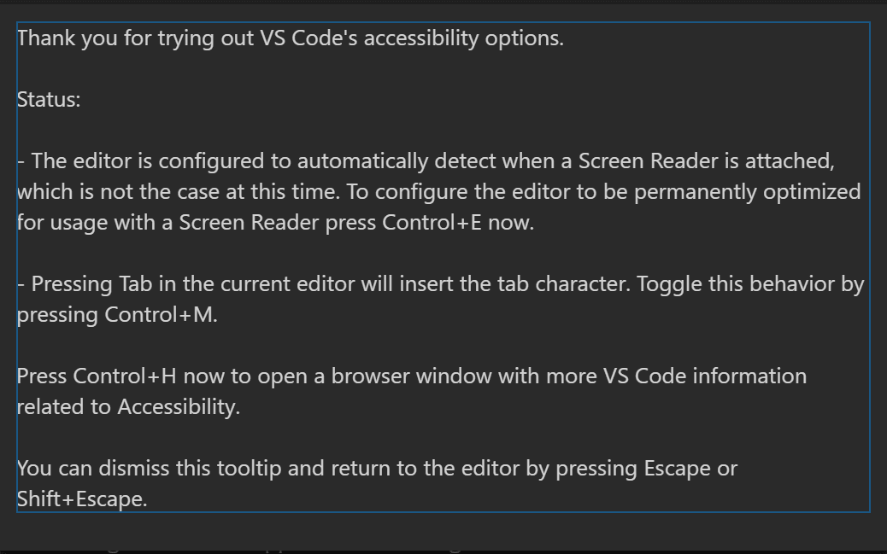
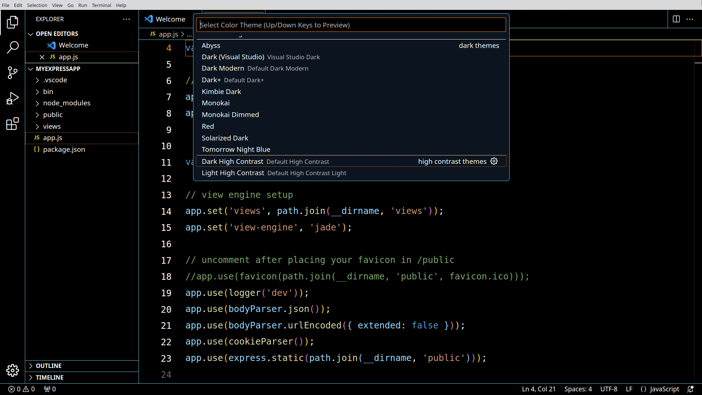
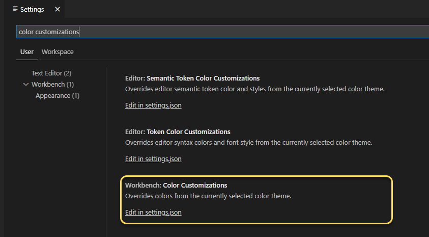
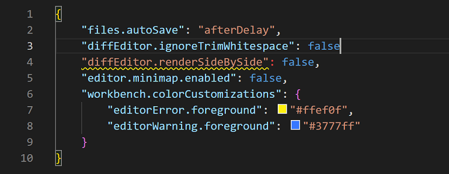
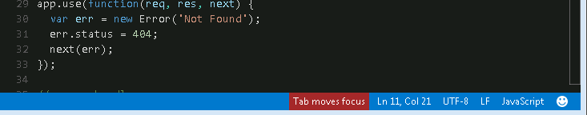

# 접근성 {#accessibility}

Visual Studio Code는 모든 사용자가 편리하게 편집기를 사용할 수 있도록 돕는 다양한 기능을 제공합니다. 확대/축소 기능과 고대비 색상은 편집기의 가시성을 향상시키고, 키보드 전용 탐색은 마우스 없이도 사용할 수 있도록 지원하며, 편집기는 스크린 리더에 최적화되어 있습니다.

## 확대/축소 {#zoom}

VS Code에서 확대/축소 수준을 조정하려면 **보기** > **모양** > **확대/축소** 명령을 사용하세요. 각 **확대/축소** 명령은 확대/축소 수준을 20%씩 증가시키거나 감소시킵니다.

* **보기** > **모양** > **확대** (`kb(workbench.action.zoomIn)`) - 확대 수준을 증가시킵니다.
* **보기** > **모양** > **축소** (`kb(workbench.action.zoomOut)`) - 확대 수준을 감소시킵니다.
* **보기** > **모양** > **확대/축소 초기화** (`kb(workbench.action.zoomReset)`) - 확대 수준을 0으로 초기화합니다.

>**참고**: 확대경을 사용하는 경우, 커서를 호버 위로 이동하려면 호버를 보는 동안 `kbstyle(Alt)` 키를 누르고 있어야 합니다.


### 지속된 확대/축소 수준 {#persisted-zoom-level}

**보기** > **모양** > **확대/축소** 명령으로 확대/축소 수준을 조정하면, 확대/축소 수준이 `setting(window.zoomLevel)` [설정](/docs/editor/settings.md)에 저장됩니다. 기본값은 0이며, 각 증가/감소는 확대/축소 수준을 20%씩 변경합니다.

## 접근성 도움말 {#accessibility-help}

명령 **접근성 도움말 열기** `kb(editor.action.accessibilityHelp)`는 현재 컨텍스트에 기반한 도움말 메뉴를 엽니다. 이 기능은 현재 편집기, 터미널, 노트북, 채팅 보기 및 인라인 채팅 기능에 적용됩니다.

접근성 도움말 메뉴를 닫거나 도움말 메뉴 내에서 추가 문서를 열 수 있습니다.



## 고대비 테마 {#high-contrast-theme}

VS Code는 모든 플랫폼에서 고대비 색상 테마를 지원합니다. **파일** > **환경설정** > **테마** > **색상 테마** (`kb(workbench.action.selectTheme)`)를 사용하여 **색상 테마 선택** 드롭다운을 표시하고 **고대비** 테마를 선택하세요.



## 색각 접근성 {#color-vision-accessibility}

색각 결핍과 호환되는 확장 프로그램을 **Visual Studio Marketplace**에서 검색할 수 있습니다. 확장 프로그램 보기 `kb(workbench.view.extensions)`를 사용하고 "색맹"을 검색하여 관련 옵션을 표시하세요.


Marketplace에서 색상 테마를 설치한 후, **파일** > **환경설정** > **테마** > **색상 테마** `kb(workbench.action.selectTheme)`를 사용하여 [색상 테마](/docs/editor/themes.md)를 변경할 수 있습니다.


### 색각 접근성을 위한 추천 테마 {#recommended-themes-for-color-vision-accessibility}

* [GitHub](https://marketplace.visualstudio.com/items?itemName=GitHub.github-vscode-theme) - 대부분의 색맹 형태에 접근 가능하며 GitHub의 설정 테마와 일치합니다.
* [Gotthard](https://marketplace.visualstudio.com/items?itemName=janbiasi.gotthard-theme) - 약 20개 프로그래밍 언어에 최적화되어 있습니다.
* [Blinds](https://marketplace.visualstudio.com/items?itemName=tankashing.blinds-theme) - 색각 결핍인 사람들을 위해 만들어졌으며, 고대비 색상 비율을 특징으로 합니다.
* [Greative](https://marketplace.visualstudio.com/items?itemName=Greative.greative) - 색맹과 빛 민감성을 모두 고려합니다.
* [Pitaya Smoothie](https://marketplace.visualstudio.com/items?itemName=trallard.pitaya-smoothie) - 대부분의 색맹 형태에 접근 가능하며 [WCAG 2.1 색상 대비 기준](https://www.w3.org/TR/UNDERSTANDING-WCAG20/visual-audio-contrast-contrast.html)을 준수합니다.

## 경고 색상 사용자 정의 {#customizing-warning-colors}

VS Code의 기본 색상 테마는 **Dark+**입니다. 그러나 사용자 인터페이스에서 테마와 속성 색상을 모두 사용자 정의할 수 있습니다.

>**참고**: 현재 테마의 색상을 재정의하는 방법에 대한 자세한 내용은 [색상 테마 사용자 정의](/docs/editor/themes.md#customizing-a-color-theme)를 참조하세요.

오류 및 경고 스퀴글 색상을 사용자 정의하려면 **파일** > **환경설정** > **설정**으로 이동하여 사용자 설정을 엽니다. "색상 사용자 정의"를 검색하여 **작업대: 색상 사용자 정의** 설정을 찾고, **settings.json** 파일을 열려면 **settings.json에서 편집**을 선택하세요.



`settings.json` 파일에서 가장 바깥쪽 중괄호 안에 다음 코드를 중첩하세요. 각 객체에 색상을 할당하려면 헥스 코드를 입력할 수 있습니다.

```json
"workbench.colorCustomizations": {
    "editorError.foreground": "#ffef0f",
    "editorWarning.foreground": "#3777ff"
}
```

다음 예제에서는 JSON 항목 뒤에 쉼표가 누락되었을 때 경고 색상이 적용됩니다.



* `editorError.foreground` - 오류 아래의 물결선을 재정의합니다.
* `editorWarning.foreground` - 경고 아래의 물결선을 재정의합니다.
* `editorError.background` - 오류의 강조 색상을 재정의합니다.
* `editorWarning.background` - 경고의 강조 색상을 재정의합니다.

`editorError` 및 `editorWarning`의 배경에 색상을 할당하면 잠재적인 문제를 식별하는 데도 도움이 됩니다. 선택한 색상은 해당 오류 또는 경고를 강조 표시합니다. 앞서 예시에서 보여준 색상 `#ffef0f` (노란색) 및 `#37777ff` (파란색)은 일반적인 색각 결핍이 있는 개인에게 더 접근 가능합니다.

### 접근 가능한 색상 선택 {#selecting-accessible-colors}

색상의 접근성은 비정상적인 삼색 시각(색맹)의 유형에 따라 주관적입니다. 심각도 수준은 개인마다 다르며 네 가지 조건 유형으로 나눌 수 있습니다:

|   조건      |   유형    |
|       ---        |    ---    |
|   색각 결핍   |   녹색 빛에 대한 민감도가 감소합니다. 가장 일반적인 색맹 형태입니다. |
|   적색 결핍     |   적색 빛에 대한 민감도가 감소합니다. |
|   청색 결핍     |   청색 빛에 대한 민감도가 감소합니다. 이 상태는 드물게 발생합니다. |
|   단색 시각    |   모든 색을 볼 수 없는 상태로, 무색증이라고도 합니다. 가장 드문 형태의 색맹에 대한 자세한 정보: [Blindness Foundation](https://www.fightingblindness.org/diseases/achromatopsia). |

특정 조건에 가장 적합한 색상을 선택하는 가장 좋은 방법 중 하나는 보색을 적용하는 것입니다. 보색은 색상 원에서 서로 반대에 위치한 색상입니다.


>**참고**: 보색을 찾는 방법에 대한 자세한 정보는 [Adobe Color](https://color.adobe.com/create/color-accessibility)에서 색맹 시뮬레이터와 인터랙티브 색상 원을 이용하세요.

## 포커스가 없는 편집기 및 터미널 흐리게 하기 {#dim-unfocused-editors-and-terminals}

포커스가 없는 뷰는 입력된 내용이 어디로 가는지 더 명확하게 하기 위해 흐리게 할 수 있습니다. 이는 여러 편집기 그룹이나 터미널에서 작업할 때 특히 유용합니다. 이 기능을 활성화하려면 `"accessibility.dimUnfocused.enabled": true`로 설정하세요. 흐림 정도는 `setting(accessibility.dimUnfocused.opacity)`로 조절할 수 있으며, 0.2에서 1까지의 불투명도 비율을 사용합니다(기본값 0.75).

## 키보드 탐색 {#keyboard-navigation}

VS Code는 **명령 팔레트** (`kb(workbench.action.showCommands)`)에서 명령의 포괄적인 목록을 제공하므로 마우스 없이도 VS Code를 사용할 수 있습니다. `kb(workbench.action.showCommands)`를 누른 후 명령 이름(예: 'git')을 입력하여 명령 목록을 필터링하세요.

VS Code는 명령에 대한 많은 기본 키보드 단축키도 제공합니다.


자신만의 키보드 단축키를 설정할 수도 있습니다. **파일** > **환경설정** > **키보드 단축키** (`kb(workbench.action.openGlobalKeybindings)`)를 선택하면 키보드 단축키 편집기가 열리며, VS Code 작업에 대한 키보드 단축키를 발견하고 수정할 수 있습니다. 키보드 단축키를 사용자 정의하거나 추가하는 방법에 대한 자세한 내용은 [키 바인딩](/docs/editor/keybindings.md)을 참조하세요.

작업대에서 빠르게 탐색하려면 **다음 부분 포커스** (`kb(workbench.action.focusNextPart)`) 및 **이전 부분 포커스** (`kb(workbench.action.focusPreviousPart)`) 명령을 사용하는 것이 좋습니다.

### 앵커 선택 {#anchor-selection}

키보드로 선택을 시작하고 끝내기 쉽게 하기 위해 네 가지 명령이 있습니다: **선택 앵커 설정** (`kb(editor.action.setSelectionAnchor)`), **앵커에서 커서까지 선택** (`kb(editor.action.selectFromAnchorToCursor)`), **선택 앵커 취소** (`kb(editor.action.cancelSelectionAnchor)`) 및 **선택 앵커로 이동**.

## 탭 탐색 {#tab-navigation}

`kbstyle(Tab)` 키를 사용하여 VS Code의 UI 컨트롤 간에 탐색할 수 있습니다. `kbstyle(Shift+Tab)`을 사용하여 역순으로 탭할 수 있습니다. UI 컨트롤을 탭할 때 포커스가 있는 각 UI 요소 주위에 표시기가 나타납니다.

작업대의 모든 요소는 탭 탐색을 지원합니다. 너무 많은 탭 정지를 피하기 위해 작업대 도구 모음과 탭 목록에는 각각 하나만 있습니다. 도구 모음이나 탭 목록에 포커스가 있으면 화살표 키를 사용하여 그 안에서 탐색할 수 있습니다.

> **참고**: 탭 탐색은 시각적으로 자연스러운 순서로 진행되며, WebViews(예: Markdown 미리보기)는 제외됩니다. WebViews의 경우, `kb(workbench.action.focusNextPart)` 및 `kb(workbench.action.focusPreviousPart)` 명령을 사용하여 WebViews와 나머지 작업대 간에 탐색하는 것이 좋습니다. 또는 여러 Focus Editor 명령 중 하나를 사용할 수 있습니다.

## 탭 트래핑 {#tab-trapping}

기본적으로 소스 코드 파일 내에서 `kbstyle(Tab)`를 누르면 탭 문자(또는 들여쓰기 설정에 따라 공백)가 삽입되며 열린 파일을 떠나지 않습니다. `kb(editor.action.toggleTabFocusMode)`로 `kbstyle(Tab)` 트래핑을 전환할 수 있으며, 이후의 `kbstyle(Tab)` 키는 파일 밖으로 포커스를 이동시킵니다. 기본 `kbstyle(Tab)` 트래핑이 꺼져 있으면 상태 표시줄에 **탭이 포커스를 이동합니다**라는 표시기가 나타납니다.

통합 터미널에서도 탭 트래핑이 존재합니다. 이 기능의 기본 동작은 `setting(editor.tabFocusMode)`로 구성할 수 있습니다.



**명령 팔레트** (`kb(workbench.action.showCommands)`)에서 **탭 키가 포커스를 이동하도록 전환** 작업을 사용하여 `kbstyle(Tab)` 트래핑을 켜고 끌 수도 있습니다.

읽기 전용 파일은 절대 `kbstyle(Tab)` 키를 트랩하지 않습니다. **통합 터미널** 패널은 `kbstyle(Tab)` 트래핑 모드를 존중하며, `kb(editor.action.toggleTabFocusMode)`로 전환할 수 있습니다.

## 스크린 리더 {#screen-readers}

VS Code는 편집기에서 텍스트 페이지 매김을 기반으로 한 전략을 사용하여 스크린 리더를 지원합니다. 다음 스크린 리더가 테스트되었습니다:

* Windows: [NVDA](https://www.nvaccess.org) 및 [JAWS](https://www.freedomscientific.com/products/software/jaws)
* macOS: [VoiceOver](https://support.apple.com/guide/voiceover/welcome/mac)
* Linux: [Orca](https://help.gnome.org/users/orca/stable/introduction.html)

> NVDA의 경우, 탐색 모드 대신 포커스 모드에 머무르고 핫키를 사용하여 탐색하는 것이 좋습니다.

**다음/이전 오류 또는 경고로 이동** 작업 (`kb(editor.action.marker.nextInFiles)` 및 `kb(editor.action.marker.prevInFiles)`)은 스크린 리더가 오류 및 경고 메시지를 발표할 수 있도록 합니다.

제안이 팝업되면 스크린 리더에 발표됩니다. `kbstyle(Ctrl+Up)` 및 `kbstyle(Ctrl+Down)`을 사용하여 제안을 탐색하고 `kbstyle(Shift+Escape)`로 닫습니다. 제안이 방해가 된다면 `setting(editor.quickSuggestions)` 설정으로 끌 수 있습니다.

차이 보기 패널에서 **다음/이전 차이로 이동** 작업 (`kb(editor.action.accessibleDiffViewer.next)` 및 `kb(editor.action.accessibleDiffViewer.prev)`)은 통합 패치 형식으로 차이를 표시하는 접근 가능한 차이 뷰어를 보여줍니다. `kbstyle(Up)` 및 `kbstyle(Down)`을 사용하여 변경되지 않은, 삽입된 또는 삭제된 줄을 탐색합니다. 선택한 줄 번호(또는 삭제된 줄이 선택된 경우 여전히 존재하는 가장 가까운 줄 번호)에서 차이 편집기의 수정된 패널로 포커스를 되돌리려면 `kbstyle(Enter)`를 누릅니다. 접근 가능한 차이 뷰어를 닫으려면 `kbstyle(Escape)` 또는 `kbstyle(Shift+Escape)`를 사용하세요.

## 스크린 리더 모드 {#screen-reader-mode}

VS Code가 스크린 리더가 사용되고 있음을 감지하면 편집기 및 통합 터미널과 같은 UI에 최적화된 스크린 리더 모드로 전환됩니다. 상태 표시줄의 오른쪽 하단에 **스크린 리더 최적화됨**이 표시됩니다. 스크린 리더 모드를 종료하려면 표시된 텍스트를 클릭하거나 **스크린 리더 접근성 모드 전환** 명령을 사용하세요.


폴딩 및 미니맵(코드 개요)과 같은 일부 기능은 스크린 리더 모드에서 비활성화됩니다. VS Code가 스크린 리더 모드를 사용하는지 제어하려면 **편집기: 접근성 지원** 설정 (`setting(editor.accessibilitySupport)`)을 사용하며, 값은 `on`, `off` 또는 스크린 리더를 자동으로 감지하는 기본값 `auto`입니다.

## 키보드를 통한 테이블 열 크기 조정 {#resize-table-columns-via-the-keyboard}

`list.resizeColumn` 명령을 사용하면 키보드를 통해 열 크기를 조정할 수 있습니다. 이 명령을 트리거하기 위해 [키보드 단축키를 할당](#keyboard-navigation)할 수 있습니다.

이 명령을 트리거하면 크기를 조정할 열을 선택하고 설정할 너비의 비율을 제공하세요. 다음 비디오는 키보드 단축키 편집기에서 열 크기를 조정하는 방법을 보여줍니다.

<video src="images/accessibility/resize-columns.mp4" title="키보드를 통해 키보드 단축키 편집기에서 열 크기 조정." autoplay loop controls muted></video>

## 접근 가능한 보기 {#accessible-view}

명령 **접근 가능한 보기 열기** `kb(editor.action.accessibleView)`를 실행하여 접근 가능한 보기를 표시하고 내용을 문자 단위로, 줄 단위로 검사할 수 있습니다. 접근 가능한 보기는 현재 호버, 알림, 주석, 노트북 출력, 터미널 출력, 채팅 응답, 인라인 완성, 디버그 콘솔 출력 등에서 사용할 수 있습니다.

## 입력 제어 및 결과 탐색 {#input-control-and-result-navigation}

입력 제어(예: 검색 또는 필터 입력)와 그 결과 간의 탐색은 확장 프로그램 보기, 키보드 단축키 편집기, 주석, 문제 및 디버그 콘솔 패널에서 일관되게 이루어집니다. (`kb(widgetNavigation.focusNext)`) 및 (`kb(widgetNavigation.focusPrevious)`)를 사용하세요.

## 터미널 접근성 {#terminal-accessibility}

`kb(editor.action.accessibilityHelp)`를 통해 터미널 접근성 도움말을 표시할 수 있으며, 스크린 리더를 사용할 때 유용한 팁을 설명합니다. 한 가지 팁은 `kb(workbench.action.terminal.focusAccessibleBuffer)`를 사용하여 터미널의 버퍼에 접근하는 것입니다. 이는 스크린 리더에 따라 자동으로 스크린 리더의 탐색 모드로 들어가 전체 터미널 버퍼의 접근 가능한 보기를 제공합니다.

`setting(editor.tabFocusMode)`를 사용하여 터미널이 작업대 대신 `kbstyle(Tab)` 키를 수신하는지 제어할 수 있습니다. 이는 편집기와 유사합니다.

### 셸 통합 {#shell-integration}

터미널에는 [셸 통합](/docs/terminal/shell-integration.md)라는 기능이 있어 다른 터미널에서는 찾을 수 없는 많은 추가 기능을 사용할 수 있습니다. 스크린 리더를 사용할 때 [최근 명령 실행](/docs/terminal/shell-integration.md#run-recent-command) 및 [최근 디렉터리로 이동](/docs/terminal/shell-integration.md#go-to-recent-directory) 기능이 특히 유용합니다.

또한, **접근 가능한 보기에서 기호로 이동** (`kb(editor.action.accessibleViewGoToSymbol)`) 명령은 터미널 명령 간에 탐색할 수 있게 해주며, 이는 편집기에서 **편집기에서 기호로 이동...** 탐색과 유사합니다.

### 최소 대비 비율 {#minimum-contrast-ratio}

`setting(terminal.integrated.minimumContrastRatio)`를 1과 21 사이의 숫자로 설정하여 텍스트 색상 밝기를 조정하여 원하는 대비 비율이 충족되거나 순수한 흰색(`#FFFFFF`) 또는 검은색(`#000000`)에 도달할 때까지 조정합니다.

`setting(terminal.integrated.minimumContrastRatio)` 설정은 `powerline` 문자에는 적용되지 않습니다.

## 상태 표시줄 접근성 {#status-bar-accessibility}

**다음 부분 포커스** (`kb(workbench.action.focusNextPart)`)를 통해 상태 표시줄에 포커스가 가면 화살표 탐색을 사용하여 상태 표시줄 항목 간에 포커스를 이동할 수 있습니다.

### 차이 편집기 접근성 {#diff-editor-accessibility}

차이 편집기에는 변경 사항을 통합 패치 형식으로 표시하는 접근 가능한 차이 뷰어가 있습니다. **다음 차이로 이동** (`kb(editor.action.accessibleDiffViewer.next)`) 및 **이전 차이로 이동** (`kb(editor.action.accessibleDiffViewer.prev)`)를 사용하여 변경 사항 간에 탐색할 수 있습니다. 화살표 키를 사용하여 줄을 탐색하고 `kbstyle(Enter)`를 눌러 차이 편집기로 돌아가 선택한 줄로 이동합니다.

## 디버거 접근성 {#debugger-accessibility}

VS Code 디버거 UI는 사용자 접근이 가능하며 다음과 같은 기능을 제공합니다:

* 디버그 상태 변경이 읽혀집니다(예: '시작됨', '중단점 도달', '종료됨' 등).
* 모든 디버그 작업은 키보드로 접근할 수 있습니다.
* 실행 및 디버그 보기와 디버그 콘솔은 탭 탐색을 지원합니다.
* 디버그 호버는 키보드로 접근할 수 있습니다 (`kb(editor.action.showHover)`).
* 각 디버거 영역에 포커스를 설정하기 위해 키보드 단축키를 생성할 수 있습니다.
* 디버깅 중 편집기에 포커스가 있을 때 **디버그: 감시 추가** 명령을 호출하면 변수의 값이 발표됩니다.

## 접근성 신호 {#accessibility-signals}

접근성 신호는 현재 줄에 오류, 경고, 중단점, 접힌 텍스트 영역 또는 인라인 제안과 같은 특정 마커가 있는지 나타냅니다.

주요 커서가 줄을 변경하거나 현재 줄에 마커가 처음 추가될 때 신호가 재생됩니다. 접근성 신호 소리와 발표는 스크린 리더가 연결되면 자동으로 활성화될 수 있으며, 설정 `accessibility.signals.*`로 제어할 수 있습니다.

명령 **도움말: 신호 소리 목록**은 사용 가능한 모든 소리를 나열하고, 목록을 탐색할 때 각 소리를 들을 수 있으며, 활성화/비활성화 상태를 구성할 수 있습니다.

Aria 발표는 스크린 리더 및 점자 사용자에게 특정 마커가 도달했음을 알립니다. 명령 **도움말: 신호 발표 목록**은 사용 가능한 항목을 사용자에게 알리고 활성화/비활성화 상태를 구성할 수 있게 합니다.

## 호버 접근성 {#hover-accessibility}

일부 호버는 일반적으로 호버할 수 없어 스크린 확대경으로 사용하기 어렵습니다. 이를 해결하기 위해 호버가 활성화된 동안 `kbstyle(Alt)` 또는 `kbstyle(Option)` 키를 누르고 있어 호버가 숨겨지지 않도록 "잠금"할 수 있습니다. 키를 놓으면 호버가 잠금 해제됩니다.

## 현재 알려진 문제 {#current-known-issues}

VS Code는 플랫폼에 따라 알려진 접근성 문제가 있습니다. 전체 목록은 [VS Code 접근성 문제](https://github.com/microsoft/vscode/issues?q=is%3Aopen+is%3Aissue+label%3Aaccessibility)에서 확인하세요.

### macOS {#macos}

편집기는 VoiceOver에 대한 스크린 리더 지원을 포함합니다.

### Linux {#linux}

VS Code는 Orca 스크린 리더와 잘 작동합니다. Linux 배포판의 Orca가 편집기 내용을 읽지 않는 경우:

* VS Code에서 `"editor.accessibilitySupport": "on"` 설정이 있는지 확인하세요. 설정을 사용하거나 **접근성 도움말 표시** 명령을 실행하고 `kbstyle(Ctrl+E)`를 눌러 접근성 지원을 활성화할 수 있습니다.
* Orca가 여전히 침묵하고 있다면 환경 변수로 `ACCESSIBILITY_ENABLED=1`을 설정해 보세요.

해당 설정을 활성화한 후, VS Code는 Orca 스크린 리더와 함께 작동해야 합니다.

## 다음 단계 {#next-steps}

다음 내용을 확인하세요:

* [음성 상호작용](/docs/editor/voice.md) - VS Code에서 음성 명령을 사용하는 방법을 알아보세요.
* [Visual Studio Code 사용자 인터페이스](/docs/getstarted/userinterface.md) - VS Code에 대한 간단한 안내입니다.
* [기본 편집](/docs/editor/codebasics.md) - 강력한 VS Code 편집기에 대해 알아보세요.
* [코드 탐색](/docs/editor/editingevolved.md) - 소스 코드를 빠르게 이동하세요.