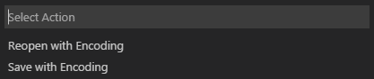

# 기본 편집 {#basic-editing}

Visual Studio Code는 무엇보다도 편집기이며, 생산적인 소스 코드 편집을 위한 필요한 기능을 포함하고 있습니다. 이 주제는 편집기의 기본 사항을 안내하고 코드 작업을 시작하는 데 도움을 줍니다.

## 키보드 단축키 {#keyboard-shortcuts}

코드를 작성할 때 손을 키보드에 유지하는 것은 높은 생산성을 위해 매우 중요합니다. VS Code는 기본 키보드 단축키 세트를 풍부하게 제공하며, 이를 사용자 맞춤형으로 변경할 수 있습니다.

* [키보드 단축키 참조](/docs/editor/keybindings.md#keyboard-shortcuts-reference) - 참조 시트를 다운로드하여 가장 일반적으로 사용되는 인기 있는 키보드 단축키를 배워보세요.
* [키맵 확장 설치](/docs/editor/keybindings.md#keymap-extensions) - 키맵 확장을 설치하여 VS Code에서 이전 편집기(예: Sublime Text, Atom, Vim)의 키보드 단축키를 사용할 수 있습니다.
* [키보드 단축키 사용자 정의](/docs/editor/keybindings.md#keyboard-shortcuts-editor) - 기본 키보드 단축키를 스타일에 맞게 변경하세요.

## 다중 선택 (다중 커서) {#multiple-selections-multi-cursor}

VS Code는 빠른 동시 편집을 위해 다중 커서를 지원합니다. `kbstyle(Alt+Click)`을 사용하여 더 얇게 보이는 보조 커서를 추가할 수 있습니다. 각 커서는 위치한 컨텍스트에 따라 독립적으로 작동합니다. 더 많은 커서를 추가하는 일반적인 방법은 `kb(editor.action.insertCursorBelow)` 또는 `kb(editor.action.insertCursorAbove)`를 사용하여 아래 또는 위에 커서를 삽입하는 것입니다.

:::note
그래픽 카드 드라이버(예: NVIDIA)가 이러한 기본 단축키를 덮어쓸 수 있습니다.
:::


`kb(editor.action.addSelectionToNextFindMatch)`는 커서에 있는 단어 또는 현재 선택의 다음 발생을 선택합니다.


:::tip
`kb(editor.action.selectHighlights)`를 사용하여 더 많은 커서를 추가할 수도 있습니다. 이는 현재 선택된 텍스트의 각 발생에 선택을 추가합니다.
:::

### 다중 커서 수정자 {#multi-cursor-modifier}

macOS에서는 `kbstyle(Cmd+Click)`으로, Windows 및 Linux에서는 `kbstyle(Ctrl+Click)`으로 다중 커서를 적용하는 수정자 키를 변경하려면 `setting(editor.multiCursorModifier)` [설정](/docs/editor/settings.md)에서 변경할 수 있습니다. 이를 통해 Sublime Text나 Atom과 같은 다른 편집기에서 오는 사용자가 익숙한 키보드 수정자를 계속 사용할 수 있습니다.

설정할 수 있는 값은 다음과 같습니다:

* `ctrlCmd` - Windows에서는 `kbstyle(Ctrl)`에, macOS에서는 `kbstyle(Cmd)`에 매핑됩니다.
* `alt` - 기존의 기본값인 `kbstyle(Alt)`입니다.

**Selection** > **Switch to Ctrl+Click for Multi-Cursor or Selection** 또는 **Selection** > **Switch to Alt+Click for Multi-Cursor** 메뉴 항목을 통해 이 설정을 빠르게 전환할 수 있습니다.

**Go to Definition** 및 **Open Link** 제스처도 이 설정을 존중하며 충돌하지 않도록 조정됩니다. 예를 들어, 설정이 `ctrlCmd`일 때는 `kbstyle(Ctrl/Cmd+Click)`으로 다중 커서를 추가할 수 있으며, 링크를 열거나 정의로 이동하는 것은 `kbstyle(Alt+Click)`으로 호출할 수 있습니다.

### 선택 축소/확장 {#shrinkexpand-selection}

현재 선택을 빠르게 축소하거나 확장합니다. `kb(editor.action.smartSelect.shrink)` 및 `kb(editor.action.smartSelect.expand)`로 트리거합니다.

다음은 `kb(editor.action.smartSelect.expand)`로 선택을 확장하는 예입니다:


## 열(Column) 선택 {#column-box-selection}

커서를 한 모서리에 놓고 `kbstyle(Shift+Alt)`를 누른 채로 반대 모서리로 드래그합니다:


:::note
이 경우 `kbstyle(Ctrl/Cmd)`를 다중 커서 수정자로 사용할 때 `kbstyle(Shift+Ctrl/Cmd)`로 변경됩니다.
:::

macOS 및 Windows에서는 열 선택을 위한 기본 키보드 단축키가 있지만 Linux에서는 지원되지 않습니다.

키|명령|명령 ID
---|-------|----------
`kb(cursorColumnSelectDown)`|열 아래 선택|`cursorColumnSelectDown`
`kb(cursorColumnSelectUp)`|열 위 선택|`cursorColumnSelectUp`
`kb(cursorColumnSelectLeft)`|열 왼쪽 선택|`cursorColumnSelectLeft`
`kb(cursorColumnSelectRight)`|열 오른쪽 선택|`cursorColumnSelectRight`
`kb(cursorColumnSelectPageDown)`|열 페이지 아래 선택|`cursorColumnSelectPageDown`
`kb(cursorColumnSelectPageUp)`|열 페이지 위 선택|`cursorColumnSelectPageUp`

원하는 경우 `keybindings.json`을 [편집](/docs/editor/keybindings.md)하여 더 익숙한 키에 바인딩할 수 있습니다.

### 열 선택 모드 {#column-selection-mode}

사용자 설정 **Editor: Column Selection**이 이 기능을 제어합니다. 이 모드에 들어가면 상태 표시줄에 표시되며, 마우스 제스처와 화살표 키는 기본적으로 열 선택을 생성합니다. 이 전역 토글은 **Selection** > **Column Selection Mode** 메뉴 항목을 통해서도 접근할 수 있습니다. 또한 상태 표시줄에서 열 선택 모드를 비활성화할 수도 있습니다.

## 저장 / 자동 저장 {#save-auto-save}

기본적으로 VS Code는 변경 사항을 디스크에 저장하기 위해 명시적인 작업이 필요합니다, `kb(workbench.action.files.save)`.

그러나 `Auto Save`를 쉽게 켤 수 있으며, 이는 설정된 지연 후 또는 편집기에서 포커스가 벗어날 때 변경 사항을 저장합니다. 이 옵션이 켜져 있으면 파일을 명시적으로 저장할 필요가 없습니다. `Auto Save`를 켜는 가장 쉬운 방법은 **File** > **Auto Save** 토글을 사용하는 것입니다.

`Auto Save`에 대한 더 많은 제어를 원하면 사용자 또는 작업 공간 [설정](/docs/editor/settings.md)을 열고 관련 설정을 찾으세요:

* `setting(files.autoSave)`: 다음 값을 가질 수 있습니다:
  * `off` - 자동 저장을 비활성화합니다.
  * `afterDelay` - 설정된 지연 후 파일을 저장합니다(기본값 1000 ms).
  * `onFocusChange` - 더러운 파일의 편집기에서 포커스가 이동할 때 파일을 저장합니다.
  * `onWindowChange` - VS Code 창에서 포커스가 이동할 때 파일을 저장합니다.
* `setting(files.autoSaveDelay)`: `setting(files.autoSave)`가 `afterDelay`로 설정될 때 지연을 밀리초 단위로 구성합니다. 기본값은 1000 ms입니다.

특정 언어 또는 파일 유형에 대해 `Auto Save` 기능을 사용자 정의하려면 `settings.json` 파일에서 언어별 규칙을 추가할 수 있습니다.

예를 들어, LaTeX 파일에 대해 `Auto Save`를 비활성화하려면:

```json
    "[latex]": {
        "files.autoSave": "off",
    },
```

## 자동 종료 복구 {#hot-exit}

기본적으로 VS Code는 종료할 때 파일에 대한 저장되지 않은 변경 사항을 기억합니다. 자동 종료 복구는 **File** > **Exit** (**Code** > **Quit** on macOS) 또는 마지막 창이 닫힐 때 트리거됩니다.

자동 종료 복구를 구성하려면 `setting(files.hotExit)`를 다음 값으로 설정합니다:

* `"off"`: 자동 종료 복구를 비활성화합니다.
* `"onExit"`: 애플리케이션이 종료될 때 자동 종료 복구가 트리거됩니다. 즉, Windows/Linux에서 마지막 창이 닫히거나 명령 팔레트, 키보드 단축키 또는 메뉴에서 `workbench.action.quit` 명령이 트리거될 때입니다. 폴더가 열리지 않은 모든 창은 다음 실행 시 복원됩니다.
* `"onExitAndWindowClose"`: 애플리케이션이 종료될 때 자동 종료 복구가 트리거됩니다. 즉, Windows/Linux에서 마지막 창이 닫히거나 `workbench.action.quit` 명령이 트리거될 때입니다. 또한 폴더가 열린 모든 창에 대해서도 마지막 창 여부와 관계없이 적용됩니다. 폴더가 열리지 않은 모든 창은 다음 실행 시 복원됩니다. 종료 전과 같이 폴더 창을 복원하려면 `setting(window.restoreWindows)`를 `all`로 설정합니다.

자동 종료 복구에 문제가 발생하면 모든 백업은 표준 설치 위치의 다음 폴더에 저장됩니다:

* **Windows** `%APPDATA%\Code\Backups`
* **macOS** `$HOME/Library/Application Support/Code/Backups`
* **Linux** `$HOME/.config/Code/Backups`

## 찾기 및 바꾸기 {#find-and-replace}

VS Code는 현재 열려 있는 파일에서 텍스트를 빠르게 찾고 바꿀 수 있습니다. `kb(actions.find)`를 눌러 편집기에서 찾기 위젯을 열고, 검색 결과는 편집기, 개요 눈금 및 미니맵에서 강조 표시됩니다.

현재 열린 파일에서 여러 개의 일치하는 결과가 있는 경우, 찾기 입력 상자가 포커스될 때 `kb(editor.action.nextMatchFindAction)` 및 `kb(editor.action.previousMatchFindAction)`를 눌러 다음 또는 이전 결과로 탐색할 수 있습니다.

기본적으로 VS Code는 작업 공간에서 찾기 및 바꾸기 기록을 저장하고, 프로그램을 다시 실행해도 유지됩니다. 이 동작은 `setting(editor.find.history)` 및 `setting(editor.find.replaceHistory)` 설정으로 구성할 수 있습니다. 값을 `never`로 설정하면 기록 저장이 비활성화됩니다.

### 선택한 텍스트로 검색어 자동 입력 {#seed-search-string-from-selection}

찾기 위젯이 열리면 편집기에서 선택한 텍스트가 자동으로 찾기 입력 상자에 채워집니다. 선택이 비어 있으면 커서 아래의 단어가 대신 입력 상자에 삽입됩니다.


이 기능은 `setting(editor.find.seedSearchStringFromSelection)`을 `"never"`로 설정하여 끌 수 있습니다.

### 선택 내에서 찾기 {#find-in-selection}

기본적으로 찾기 작업은 편집기에서 전체 파일에 대해 실행됩니다. 선택한 텍스트에 대해서도 실행할 수 있습니다. 찾기 위젯에서 햄버거 아이콘을 클릭하여 이 기능을 켤 수 있습니다.


찾기 위젯의 기본 동작으로 설정하려면 `setting(editor.find.autoFindInSelection)`을 `always`로 설정하거나, 여러 줄의 내용이 선택된 경우에만 선택된 텍스트에서 실행되도록 `multiline`으로 설정할 수 있습니다.

### 고급 찾기 및 바꾸기 옵션 {#advanced-find-and-replace-options}

일반 텍스트로 찾기 및 바꾸기 외에도 찾기 위젯에는 세 가지 고급 검색 옵션이 있습니다:

* 대소문자 구분
* 전체 단어 일치
* 정규 표현식

바꾸기 입력 상자는 대소문자 보존을 지원하며, 대소문자 보존 버튼(**AB**)을 클릭하여 활성화할 수 있습니다.

### 여러 줄 지원 및 찾기 위젯 크기 조정 {#multiline-support-and-find-widget-resizing}

여러 줄 텍스트를 찾기 입력 상자 및 바꾸기 입력 상자에 붙여넣어 검색할 수 있습니다. `Ctrl+Enter`를 누르면 입력 상자에 새 줄이 삽입됩니다.


긴 텍스트를 검색할 때, 찾기 위젯의 기본 크기가 너무 작을 수 있습니다. 왼쪽 경계를 드래그하여 찾기 위젯을 확대하거나 왼쪽 경계를 두 번 클릭하여 최대화하거나 기본 크기로 축소할 수 있습니다.


## 파일 간 검색 {#search-across-files}

VS Code는 현재 열린 폴더의 모든 파일에서 빠르게 검색할 수 있습니다. `kb(workbench.view.search)`를 누르고 검색어를 입력하세요. 검색 결과는 검색어가 포함된 파일로 그룹화되며, 각 파일 내의 히트와 그 위치가 표시됩니다. 파일을 확장하여 해당 파일 내의 모든 히트를 미리 볼 수 있습니다. 그런 다음 히트 중 하나를 클릭하여 편집기에서 볼 수 있습니다.


:::tip
검색 상자에서도 정규 표현식 검색을 지원합니다.
:::

검색 상자 오른쪽 아래의 줄임표(**Toggle Search Details**)를 클릭하여 고급 검색 옵션을 구성할 수 있습니다(또는 `kb(workbench.action.search.toggleQueryDetails)`를 누릅니다). 이렇게 하면 검색을 구성하기 위한 추가 필드가 표시됩니다.

:::tip
빠른 검색을 사용하여 현재 열린 폴더의 모든 파일에서 텍스트를 빠르게 찾을 수 있습니다. 명령 팔레트를 열고(`kb(workbench.action.showCommands)`) **Search: Quick Search** 명령을 입력하세요.
:::

### 고급 검색 옵션 {#advanced-search-options}


검색 상자 아래의 두 입력 상자에 검색에 포함하거나 제외할 패턴을 입력할 수 있습니다. `example`을 입력하면 작업 공간에서 `example`이라는 이름의 모든 폴더와 파일이 일치합니다. `./example`을 입력하면 작업 공간의 최상위 수준에서 `example/` 폴더가 일치합니다. 여러 패턴을 구분하려면 `,`를 사용하세요. 경로는 슬래시를 사용해야 합니다. 또한 [glob 패턴](/docs/editor/glob-patterns.md) 구문을 사용할 수 있습니다. 예를 들어:

* `*`는 경로 세그먼트에서 0개 이상의 문자를 일치시킵니다.
* `?`는 경로 세그먼트에서 하나의 문자와 일치합니다.
* `**`는 경로 세그먼트의 수에 관계없이 모든 수의 세그먼트와 일치합니다.
* `{}`는 조건을 그룹화합니다(예: `{**/*.html,**/*.txt}`는 모든 HTML 및 텍스트 파일과 일치합니다).
* `[]`는 일치할 문자 범위를 **선언**합니다(`example.[0-9]`는 `example.0`, `example.1` 등과 일치).
* `[!...]`는 일치하지 않을 문자 범위를 선언합니다(`example.[!0-9]`는 `example.a`, `example.b`와 일치하지만 `example.0`와는 일치하지 않음).

VS Code는 기본적으로 검색 결과에 관심이 없는 일부 폴더를 제외합니다(예: `node_modules`). 이러한 규칙을 변경하려면 [설정](/docs/editor/settings.md)에서 `setting(files.exclude)` 및 `setting(search.exclude)` 섹션을 확인하세요.

검색 보기의 glob 패턴은 `setting(files.exclude)` 및 `setting(search.exclude)`와 같은 설정에서 작동하는 방식과 다릅니다. 설정에서는 `**/example`을 사용하여 작업 공간의 하위 폴더 `folder1/example`에 있는 `example`이라는 이름의 폴더와 일치시켜야 합니다. 검색 보기에서는 `**` 접두사가 가정됩니다. 이러한 설정의 glob 패턴은 항상 작업 공간 폴더의 경로에 상대적으로 평가됩니다.

또한 **Use Exclude Settings and Ignore Files** 토글 버튼이 **files to exclude** 상자에 있습니다. 이 토글은 `.gitignore` 파일에 의해 무시되는 파일과 `setting(files.exclude)` 및 `setting(search.exclude)` 설정에 의해 일치하는 파일을 제외할지 여부를 결정합니다.

:::tip
탐색기에서 폴더를 마우스 오른쪽 버튼으로 클릭하고 **Find in Folder**를 선택하여 특정 폴더 내에서만 검색할 수 있습니다.
:::

### 검색 및 바꾸기 {#search-and-replace}

파일 간 검색 및 바꾸기도 가능합니다. 검색 위젯을 확장하여 바꾸기 텍스트 상자를 표시합니다.


바꾸기 텍스트 상자에 텍스트를 입력하면 보류 중인 변경 사항의 차이 표시가 나타납니다. 바꾸기 텍스트 상자에서 모든 파일에서 바꾸거나, 한 파일에서 모두 바꾸거나, 단일 변경 사항을 바꿀 수 있습니다.


:::tip
이전 검색어를 빠르게 재사용하려면 `kb(history.showNext)` 및 `kb(history.showPrevious)`를 사용하여 검색어 기록을 탐색할 수 있습니다.
:::

### 정규 표현식 바꾸기에서 대소문자 변경 {#case-changing-in-regex-replace}

VS Code는 편집기 또는 전역적으로 검색 및 바꾸기를 수행할 때 정규 표현식 일치 그룹의 대소문자를 변경하는 것을 지원합니다. 이는 `\u\U\l\L` 수정자를 사용하여 수행되며, 여기서 `\u` 및 `\l`은 단일 문자를 대문자/소문자로 변경하고, `\U` 및 `\L`은 일치하는 그룹의 나머지를 대문자/소문자로 변경합니다.

예시:


수정자는 스택으로 쌓을 수도 있습니다. 예를 들어, `\u\u\u$1`은 그룹의 처음 세 문자를 대문자로 만들고, `\l\U$1`은 첫 번째 문자를 소문자로 만들고 나머지를 대문자로 만듭니다. 캡처 그룹은 바꾸기 문자열에서 `$n`으로 참조되며, 여기서 `n`은 캡처 그룹의 순서입니다.

## 검색 편집기 {#search-editor}

검색 편집기를 사용하면 작업 공간의 검색 결과를 전체 크기의 편집기에서 확인할 수 있으며, 구문 강조와 함께 결과 전후의 선택적 추가 줄도 표시할 수 있습니다.

아래는 'SearchEditor'라는 단어를 검색한 것으로, 일치하는 결과의 앞뒤에 두 줄의 텍스트가 있습니다:


**Open Search Editor** 명령은 기존 검색 편집기가 있는 경우 이를 열거나, 그렇지 않으면 새 검색 편집기를 생성합니다. **Open Search Editor** 명령은 항상 새 검색 편집기를 생성합니다.

검색 편집기에서 결과는 `kb(editor.action.revealDefinition)`과 같은 **Go to Definition** 작업을 사용하여 현재 편집기 그룹에서 소스 위치를 열거나, `kb(editor.action.revealDefinitionAside)`를 사용하여 옆의 편집기에서 위치를 열 수 있습니다. 또한 `setting(search.searchEditor.singleClickBehaviour)` 및 `setting(search.searchEditor.doubleClickBehaviour)` 설정을 통해 검색 결과를 단일 클릭하거나 이중 클릭할 때의 동작을 구성할 수 있습니다. 예를 들어, 피크 정의 창을 열거나 소스 위치를 열 수 있습니다.

검색 보기 상단의 **Open New Search Editor** 버튼을 사용할 수도 있으며, 결과 트리 상단의 **Open in editor** 링크를 통해 검색 보기에서 기존 결과를 검색 편집기로 복사할 수 있습니다.


위의 검색 편집기는 검색 보기 상단의 **Open New Search Editor** 버튼(세 번째 버튼)을 선택하여 열렸습니다.

### 검색 편집기 명령 및 인수 {#search-editor-commands-and-arguments}

* `search.action.openNewEditor` - 새 탭에서 검색 편집기를 엽니다.
* `search.action.openInEditor` - 현재 검색 결과를 새 검색 편집기로 복사합니다.
* `search.action.openNewEditorToSide` - 현재 열려 있는 창 옆에 새 창에서 검색 편집기를 엽니다.

검색 편집기 명령(`search.action.openNewEditor`, `search.action.openNewEditorToSide`)에 전달할 수 있는 두 가지 인수가 있어 새 검색 편집기의 동작을 구성할 수 있습니다:

* `triggerSearch` - 검색 편집기가 열릴 때 자동으로 검색이 실행될지 여부. 기본값은 true입니다.
* `focusResults` - 검색 결과에 포커스를 둘지, 아니면 검색어 입력란에 포커스를 둘지 여부. 기본값은 true입니다.

예를 들어, 다음 키보드 단축키는 검색 편집기가 열릴 때 검색을 실행하지만 검색 쿼리 컨트롤에 포커스를 유지합니다.

```json
{
    "key": "ctrl+o",
    "command": "search.action.openNewEditor",
    "args": { "query": "VS Code", "triggerSearch":true, "focusResults": false }
}
```

### 검색 편집기 컨텍스트 기본값 {#search-editor-context-default}

`setting(search.searchEditor.defaultNumberOfContextLines)` 설정의 기본값은 1로, 검색 편집기에서 각 결과 줄 앞뒤에 하나의 컨텍스트 줄이 표시됩니다.

### 마지막 검색 편집기 구성 재사용 {#reuse-last-search-editor-configuration}

`setting(search.searchEditor.reusePriorSearchConfiguration)` 설정(기본값은 `false`)을 사용하면 새 검색 편집기를 생성할 때 마지막으로 활성화된 검색 편집기의 구성을 재사용할 수 있습니다.

## IntelliSense {#intellisense}

우리는 항상 단어 완성을 제공하지만, JavaScript, JSON, HTML, CSS, SCSS, Less, C# 및 TypeScript와 같은 풍부한 [언어](/docs/languages/overview.md)에 대해서는 진정한 IntelliSense 경험을 제공합니다. 언어 서비스가 가능한 완성을 알고 있다면, IntelliSense 제안이 입력하는 동안 팝업됩니다. `kb(editor.action.triggerSuggest)`를 사용하여 수동으로 트리거할 수도 있습니다. 기본적으로 `kbstyle(Tab)` 또는 `kbstyle(Enter)`가 수락 키보드 트리거이지만, 이러한 키보드 단축키를 [사용자 정의](/docs/editor/keybindings.md)할 수도 있습니다.

:::tip
제안 필터링은 CamelCase를 지원하므로, 메서드 이름에서 대문자로 된 문자를 입력하여 제안을 제한할 수 있습니다. 예를 들어, "cra"를 입력하면 "createApplication"이 빠르게 나타납니다.
:::

:::tip
IntelliSense 제안은 `setting(editor.quickSuggestions)` 및 `setting(editor.suggestOnTriggerCharacters)` [설정](/docs/editor/settings.md)을 통해 구성할 수 있습니다.
:::

JavaScript 및 TypeScript 개발자는 [npmjs](https://www.npmjs.com) 타입 선언(타이핑) 파일 저장소를 활용하여 일반 JavaScript 라이브러리에 대한 IntelliSense를 얻을 수 있습니다(Node.js, React, Angular). 타입 선언 파일 사용에 대한 좋은 설명은 [JavaScript 언어](/docs/languages/javascript.md#intellisense) 주제와 [Node.js](/docs/nodejs/nodejs-tutorial.md) 튜토리얼에서 찾을 수 있습니다.

[IntelliSense 문서](/docs/editor/intellisense.md)에서 더 알아보세요.

## 정렬 {#formatting}

VS Code는 소스 코드 정렬에 대한 훌륭한 지원을 제공합니다. 편집기에는 두 가지 명시적 정렬 작업이 있습니다:

* **문서 정렬** (`kb(editor.action.formatDocument)`) - 전체 활성 파일을 정렬합니다.
* **선택 정렬** (`kb(editor.action.formatSelection)`) - 선택된 텍스트를 정렬합니다.

이 작업은 **Command Palette**(`kb(workbench.action.showCommands)`) 또는 편집기 컨텍스트 메뉴에서 호출할 수 있습니다.

VS Code는 JavaScript, TypeScript, JSON, HTML 및 CSS에 대한 기본 포맷터(정렬 기준)를 제공합니다. 각 언어에는 특정 포맷팅 옵션(예: `setting(html.format.indentInnerHtml)`)이 있으며, 이를 사용자 또는 작업 공간 [설정](/docs/editor/settings.md)에서 선호에 맞게 조정할 수 있습니다. 동일한 언어에 대해 포맷팅을 제공하는 다른 확장이 설치된 경우 기본 언어 포맷터를 비활성화할 수도 있습니다.

```json
"html.format.enable": false
```

코드 포맷팅을 수동으로 호출하는 것 외에도, 입력, 저장 또는 붙여넣기와 같은 사용자 제스처에 따라 포맷팅을 트리거할 수 있습니다. 이러한 동작은 기본적으로 꺼져 있지만, 다음 [설정](/docs/editor/settings.md)을 통해 이러한 동작을 활성화할 수 있습니다:

* `setting(editor.formatOnType)` - 입력 후 줄을 정렬합니다.
* `setting(editor.formatOnSave)` - 저장 시 파일을 정렬합니다.
* `setting(editor.formatOnPaste)` - 붙여넣은 내용을 정렬합니다.

:::note
모든 포맷터가 붙여넣기 시 정렬을 지원하는 것은 아닙니다. 정렬을 지원하려면 선택 또는 텍스트 범위를 정렬할 수 있어야 합니다.
:::

기본 포맷터 외에도 다른 언어 또는 포맷팅 도구를 지원하는 확장을 마켓플레이스에서 찾을 수 있습니다. `Formatters` 카테고리가 있어 포맷팅 확장을 쉽게 검색하고 찾을 수 있습니다. **Extensions** 화면면 검색 상자에 'formatters' 또는 'category:formatters'를 입력하여 VS Code 내에서 필터링된 확장 목록을 확인하세요.

## 접기 {#folding}

소스 코드의 영역을 접기 아이콘을 사용하여 접을 수 있습니다. 줄 번호와 줄 시작 사이의 여백에 마우스를 올리고 클릭하여 영역을 접거나 펼칩니다. 접기 아이콘에서 `kbstyle(Shift + Click)`을 사용하여 영역과 그 안의 모든 영역을 접거나 펼칠 수 있습니다.


다음 작업도 사용할 수 있습니다:

* 접기 (`kb(editor.fold)`)는 커서에서 가장 안쪽의 펼쳐지지 않은 영역을 접습니다.
* 펼치기 (`kb(editor.unfold)`)는 커서에서 접힌 영역을 펼칩니다.
* 접기 전환 (`kb(editor.toggleFold)`)은 커서에서 영역을 접거나 펼칩니다.
* 재귀적으로 접기 (`kb(editor.foldRecursively)`)는 커서에서 가장 안쪽의 펼쳐지지 않은 영역과 그 안의 모든 영역을 접습니다.
* 재귀적으로 펼치기 (`kb(editor.unfoldRecursively)`)는 커서에서 영역과 그 안의 모든 영역을 펼칩니다.
* 모두 접기 (`kb(editor.foldAll)`)는 편집기 내의 모든 영역을 접습니다.
* 모두 펼치기 (`kb(editor.unfoldAll)`)는 편집기 내의 모든 영역을 펼칩니다.
* 레벨 X 접기 (`kb(editor.foldLevel2)`는 레벨 2에 해당) 는 현재 커서 위치의 영역을 제외한 모든 레벨 X의 영역을 접습니다.
* 모든 블록 주석 접기 (`kb(editor.foldAllBlockComments)`)는 블록 주석 토큰으로 시작하는 모든 영역을 접습니다.

접기 영역은 기본적으로 줄의 들여쓰기를 기준으로 평가됩니다. 접기 영역은 줄이 하나 이상의 후속 줄보다 작은 들여쓰기를 가질 때 시작되며, 동일하거나 작은 들여쓰기를 가진 줄이 있을 때 끝납니다.

접기 영역은 편집기에서 구성된 언어의 구문 토큰을 기반으로 계산될 수도 있습니다. 다음 언어는 이미 구문 인식 접기를 제공합니다: Markdown, HTML, CSS, LESS, SCSS 및 JSON.

위의 언어 중 하나(또는 모두)에 대해 들여쓰기 기반 접기로 다시 전환하려면 다음을 사용하세요:

```json
  "[html]": {
    "editor.foldingStrategy": "indentation"
  },
```

영역은 각 언어에서 정의한 마커에 의해 정의될 수도 있습니다. 현재 다음 언어에서 마커가 정의되어 있습니다:

언어|시작 영역|종료 영역
--------|------------|----------
Bat|`::#region` 또는 `REM #region`|`::#endregion` 또는 `REM #endregion`
C#|`#region`|`#endregion`
C/C++|`#pragma region`|`#pragma endregion`
CSS/Less/SCSS|`/*#region*/`|`/*#endregion*/`
Coffeescript|`#region`|`#endregion`
F#|`//#region` 또는 `(#region)`|`//#endregion` 또는 `(#endregion)`
Java|`//#region` 또는 `//<editor-fold>`|`//#endregion` 또는 `//</editor-fold>`
Markdown|`<!-- #region -->`|`<!-- #endregion -->`
Perl5|`#region` 또는 `=pod`|`#endregion` 또는 `=cut`
PHP|`#region`|`#endregion`
PowerShell|`#region`|`#endregion`
Python|`#region` 또는 `# region`|`#endregion` 또는 `# endregion`
TypeScript/JavaScript|`//#region` |`//#endregion`
Visual Basic|`#Region`|`#End Region`

마커에 의해 정의된 영역만 접고 펼치려면 다음을 사용하세요:

* 마커 영역 접기 (`kb(editor.foldAllMarkerRegions)`)는 모든 마커 영역을 접습니다.
* 마커 영역 펼치기 (`kb(editor.unfoldAllMarkerRegions)`)는 모든 마커 영역을 펼칩니다.

### 선택 접기 {#fold-selection}

**Create Manual Folding Ranges from Selection** 명령(`kb(editor.createFoldingRangeFromSelection)`)은 현재 선택된 줄에서 접기 범위를 생성하고 이를 접습니다. 해당 범위를 **manual** 접기 범위라고 하며, 접기 제공자가 계산한 범위 위에 놓입니다.

수동 접기 범위는 **Remove Manual Folding Ranges** 명령(`kb(editor.removeManualFoldingRanges)`)으로 제거할 수 있습니다.

수동 접기 범위는 접기에 대한 프로그래밍 언어 지원이 없는 경우에 특히 유용합니다.

## 들여쓰기 {#indentation}

VS Code는 텍스트 들여쓰기를 제어하고 공백 또는 탭 정지를 사용할지 여부를 설정할 수 있습니다. 기본적으로 VS Code는 공백을 삽입하고 `kbstyle(Tab)` 키당 4개의 공백을 사용합니다. 다른 기본값을 사용하려면 `setting(editor.insertSpaces)` 및 `setting(editor.tabSize)` [설정](/docs/editor/settings.md)을 수정할 수 있습니다.

```json
    "editor.insertSpaces": true,
    "editor.tabSize": 4,
```

### 자동 감지 {#auto-detection}

VS Code는 열린 파일을 분석하고 문서에서 사용된 들여쓰기를 결정합니다. 자동 감지된 들여쓰기는 기본 들여쓰기 설정을 덮어씁니다. 감지된 설정은 상태 표시줄의 오른쪽에 표시됩니다:


상태 표시줄의 들여쓰기 표시를 클릭하면 열린 파일의 기본 설정을 변경하거나 탭 정지와 공백 간에 변환할 수 있는 들여쓰기 명령이 포함된 드롭다운이 나타납니다.


:::note
VS Code 자동 감지는 2, 4, 6 또는 8개의 공백에 대한 들여쓰기를 확인합니다. 파일에서 다른 수의 공백을 사용하는 경우 들여쓰기가 올바르게 감지되지 않을 수 있습니다. 예를 들어, 관례가 3개의 공백으로 들여쓰기를 하는 경우 `setting(editor.detectIndentation)`을 끄고 탭 크기를 3으로 명시적으로 설정할 수 있습니다.
:::

```json
    "editor.detectIndentation": false,
    "editor.tabSize": 3,
```

## 파일 인코딩 지원 {#file-encoding-support}

파일 인코딩을 전역적으로 또는 작업 공간별로 설정하려면 **User Settings** 또는 **Workspace Settings**에서 `setting(files.encoding)` 설정을 사용하세요.


상태 표시줄에서 파일 인코딩을 볼 수 있습니다.


상태 표시줄의 인코딩 버튼을 클릭하여 다른 인코딩으로 활성 파일을 다시 열거나 저장할 수 있습니다.



그런 다음 인코딩을 선택합니다.


## 오버타입 모드 {#overtype-mode}

1.96 이전 릴리스에서 VS Code는 *삽입* 모드만 지원했습니다. 이 모드에서는 커서 위치에 문자가 삽입됩니다. Vim [키맵 확장](/docs/editor/keybindings.md#keymap-extensions)을 설치하지 않는 한 그렇습니다.

1.96 릴리스부터 VS Code는 *오버타입* 모드를 지원합니다. 이 모드는 커서 위치에 문자를 삽입하는 대신 기존 문자를 덮어쓸 수 있게 해줍니다. 기본적으로 오버타입 모드는 꺼져 있습니다.

삽입 모드와 오버타입 모드 간 전환은 명령 팔레트에서 **Toggle Overtype/Insert Mode** 명령을 실행하거나(`kb(editor.action.toggleOvertypeInsertMode)`) 할 수 있습니다. 오버타입 모드에 있을 때 상태 표시줄에 `OVR` 표시가 나타납니다.

오버타입 모드의 커서 스타일은 `setting(editor.overtypeCursorStyle)` 설정을 구성하여 변경할 수 있습니다.

붙여넣기 시 텍스트를 덮어쓰려면 `setting(editor.overtypeOnPaste)` 설정을 사용하세요. 이 설정이 적용되려면 오버타입 모드에 있어야 합니다.

## 파일 비교 {#compare-files}

VS Code는 현재 파일 또는 두 파일의 내용을 비교하는 여러 가지 방법을 지원합니다.

편집기에서 활성 파일이 열려 있을 때 다음 비교 옵션이 있습니다:

* **Compare with a workspace file**: 명령 팔레트에서 **File: Compare Active File With...**를 선택한 다음 비교할 다른 파일을 선택합니다.
* **Compare with clipboard**: 명령 팔레트에서 **File: Compare Active File with Clipboard**(`kb(workbench.files.action.compareWithClipboard)`)를 선택하여 현재 파일과 클립보드 내용을 비교합니다.
* **저장된Compare with saved**: 명령 팔레트에서 ***File: Compare Active File with Saved**(`kb(workbench.files.action.compareWithSaved)`)를 선택하여 현재 파일과 마지막으로 저장된 버전을 비교합니다.

두 파일을 비교하려면:

* 탐색기 보기에서 파일을 마우스 오른쪽 버튼으로 클릭하고 **Select for Compare**을 선택합니다. 그런 다음 두 번째 파일을 마우스 오른쪽 버튼으로 클릭하고 **Compare with Selected**를 선택합니다.
* 두 개의 빈 편집기 창 간 비교를 시작하려면 명령 팔레트에서 **File: Compare New Untitled Text Files**를 선택합니다.

:::tip
`--diff` 옵션을 사용하여 명령줄에서 VS Code를 시작하여 두 파일을 비교할 수 있습니다. [VS Code 명령줄 인터페이스](/docs/editor/command-line.md#core-cli-options)에 대해 더 알아보세요.
:::

## 다음 단계 {#next-steps}

기본 사용자 인터페이스를 다루었습니다 - VS Code에는 더 많은 기능이 있습니다. 계속 읽어보세요:

* [소개 비디오 - 설정 및 기본 사항](/docs/introvideos/basics.md) - VS Code의 기본 사항에 대한 튜토리얼을 시청하세요.
* [사용자/작업 공간 설정](/docs/editor/settings.md) - 사용자 및 작업 공간 설정을 통해 VS Code를 선호에 맞게 구성하는 방법을 알아보세요.
* [코드 탐색](/docs/editor/editingevolved.md) - 피크 및 정의로 이동, 그리고 더 많은 기능.
* [통합 터미널](/docs/terminal/basics.md) - VS Code 내에서 명령줄 작업을 빠르게 수행하기 위한 통합 터미널에 대해 알아보세요.
* [IntelliSense](/docs/editor/intellisense.md) - VS Code는 스마트 코드 완성을 제공합니다.
* [디버깅](/docs/editor/debugging.md) - VS Code가 정말 빛나는 부분입니다.

## 자주 묻는 질문 {#common-questions}

### 전역적으로 검색 및 바꾸기가 가능하나요? {#is-it-possible-to-globally-search-and-replace}

예, 검색 보기 텍스트 상자를 확장하여 바꾸기 텍스트 필드를 포함할 수 있습니다. 작업 공간의 모든 파일에서 검색 및 바꾸기가 가능합니다. VS Code를 폴더에서 열지 않은 경우 현재 열린 파일에서만 검색이 실행됩니다.


### 단어 줄 바꿈을 어떻게 켜요? {#how-do-i-turn-on-word-wrap}

`setting(editor.wordWrap)` [설정](/docs/editor/settings.md)을 통해 단어 줄 바꿈을 제어할 수 있습니다. 기본적으로 `setting(editor.wordWrap)`는 `off`로 설정되어 있지만, 이를 `on`으로 설정하면 텍스트가 편집기의 뷰포트 너비에 따라 줄 바꿈됩니다.

```json
    "editor.wordWrap": "on"
```

VS Code 세션에 대해 단어 줄 바꿈을 토글하려면 `kb(editor.action.toggleWordWrap)`를 사용할 수 있습니다.

또한 `setting(editor.rulers)` 설정을 통해 편집기에 수직 열 눈금을 추가할 수 있으며, 이는 수직 눈금을 원하는 열 문자 위치의 배열을 사용합니다.

다른 편집기와 마찬가지로 **Cut** 및 **Copy**와 같은 명령은 전체 줄 바꿈된 줄에 적용됩니다. 세 번 클릭하면 전체 줄 바꿈된 줄이 선택됩니다. `kbstyle(Home)`을 두 번 누르면 커서가 줄의 맨 처음으로 이동하고, `kbstyle(End)`를 두 번 누르면 커서가 줄의 맨 끝으로 이동합니다.

### 줄 바꿈된 줄에 추가 커서를 배치하지 않으려면 어떻게 해야 하나요? {#how-can-i-avoid-placing-extra-cursors-in-word-wrapped-lines}

현재 선택 위 또는 아래에 커서를 추가할 때 줄 바꿈을 무시하려면 다음과 같이 키보드 단축키의 `args`에 `{ "logicalLine": true }`를 전달할 수 있습니다:

```json
{
  "key": "shift+alt+down",
  "command": "editor.action.insertCursorBelow",
  "when": "textInputFocus",
  "args": { "logicalLine": true },
},
{
  "key": "shift+alt+up",
  "command": "editor.action.insertCursorAbove",
  "when": "textInputFocus",
  "args": { "logicalLine": true },
},
```
