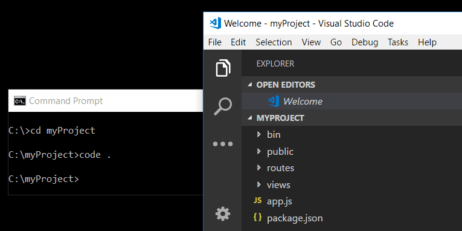

# 명령줄 인터페이스 (CLI) {#command-line-interface-cli}

Visual Studio Code에는 편집기를 실행하는 방식을 제어할 수 있는 강력한 명령줄 인터페이스가 내장되어 있습니다. 명령줄 옵션(스위치)을 통해 파일을 열고, 확장을 설치하고, 표시 언어를 변경하며, 진단 출력을 생성할 수 있습니다.


VS Code 내에서 명령줄 도구를 실행하는 방법을 찾고 있다면 [통합 터미널](/docs/terminal/basics.md)을 참조하세요.

## 명령줄 도움말 {#command-line-help}

VS Code 명령줄 인터페이스에 대한 개요를 얻으려면 터미널이나 명령 프롬프트를 열고 `code --help`를 입력하세요. 그러면 버전, 사용 예제 및 명령줄 옵션 목록이 표시됩니다.


## 명령줄에서 실행하기 {#launching-from-command-line}

명령줄에서 VS Code를 실행하여 파일, 폴더 또는 프로젝트를 빠르게 열 수 있습니다. 일반적으로 폴더의 맥락 내에서 VS Code를 엽니다. 이를 위해 열린 터미널이나 명령 프롬프트에서 프로젝트 폴더로 이동한 후 `code .`를 입력하세요:



**참고:** macOS 사용자는 먼저 명령어(**Shell Command: Install 'code' command in PATH**)를 실행하여 VS Code 실행 파일을 `PATH` 환경 변수에 추가해야 합니다. 도움말은 [macOS 설정 가이드](/docs/setup/mac.md)를 참조하세요.

Windows 및 Linux 설치는 VS Code 바이너리 위치를 시스템 경로에 추가해야 합니다. 그렇지 않은 경우, 수동으로 `Path` 환경 변수(`$PATH` on Linux)에 위치를 추가할 수 있습니다. 예를 들어, Windows에서 기본 VS Code 바이너리 위치는 `AppData\Local\Programs\Microsoft VS Code\bin`입니다. 플랫폼별 설정 지침을 검토하려면 [설정](/docs/setup/setup-overview.md)을 참조하세요.

> **Insiders:** VS Code [Insiders](/insiders) 미리보기를 사용 중인 경우, `code-insiders`로 Insiders 빌드를 실행합니다.

## 핵심 CLI 옵션 {#core-cli-options}

다음은 `code`를 통해 명령줄에서 VS Code를 시작할 때 사용할 수 있는 선택적 인수입니다:

| 인수                                           | 설명                                                                                                                                                                                |
| ---------------------------------------------- | ---------------------------------------------------------------------------------------------------------------------------------------------------------------------------------- |
| `-h` 또는 `--help`                            | 사용법 출력                                                                                                                                                                        |
| `-v` 또는 `--version`                         | VS Code 버전(예: 1.22.2), GitHub 커밋 ID 및 아키텍처(예: x64) 출력                                                                                                               |
| `-n` 또는 `--new-window`                     | 이전 세션을 복원하는 대신 새로운 VS Code 세션을 엽니다(기본값).                                                                                                                  |
| `-r` 또는 `--reuse-window`                   | 마지막 활성 창에서 파일이나 폴더를 열도록 강제합니다.                                                                                                                             |
| `-g` 또는 `--goto`                           | _file:line\{:character\}_와 함께 사용 시, 특정 줄 및 선택적 문자 위치에서 파일을 엽니다. 이 인수는 일부 운영 체제가 파일 이름에 `:`를 허용하기 때문에 제공됩니다.           |
| `-d` 또는 `--diff <file1> <file2>`          | 파일 차이 편집기를 엽니다. 두 개의 파일 경로를 인수로 요구합니다.                                                                                                               |
| `-m` 또는 `--merge <path1> <path2> <base> <result>` | 수정된 파일의 두 버전, 두 수정된 버전의 공통 원본 및 병합 결과를 저장할 출력 파일의 경로를 제공하여 3방향 병합을 수행합니다.                                                  |
| `-w` 또는 `--wait`                           | 파일이 닫힐 때까지 기다립니다.                                                                                                                                                    |
| `--locale <locale>`                           | VS Code 세션의 [표시 언어](/docs/editor/locales.md)(로케일)를 설정합니다. (예: `en-US` 또는 `zh-TW`)                                                                             |


## 파일 및 폴더 열기 {#opening-files-and-folders}

때때로 파일을 열거나 생성하고 싶을 수 있습니다. 지정된 파일이 존재하지 않으면 VS Code는 새로운 중간 폴더와 함께 파일을 생성합니다:

```bash
code index.html style.css documentation\readme.md
```

파일과 폴더 모두 절대 경로 또는 상대 경로를 사용할 수 있습니다. 상대 경로는 `code`를 실행하는 명령 프롬프트의 현재 디렉토리를 기준으로 합니다.

명령줄에서 파일을 하나 이상 지정하면 VS Code는 단일 인스턴스만 엽니다.

명령줄에서 폴더를 하나 이상 지정하면 VS Code는 각 폴더를 포함하는 [다중 루트 작업 공간](/docs/editor/workspaces/multi-root-workspaces.md)을 생성합니다.

| 인수                | 설명                                                                                                                                                           |
| ------------------- | --------------------------------------------------------------------------------------------------------------------------------------------------------------- |
| `file`              | 열 파일의 이름입니다. 파일이 존재하지 않으면 생성되고 수정된 것으로 표시됩니다. 각 파일 이름을 공백으로 구분하여 여러 파일을 지정할 수 있습니다.                           |
| `file:line[:character]` | `-g` 인수와 함께 사용됩니다. 지정된 줄 및 선택적 문자 위치에서 열 파일의 이름입니다.                                                                                 |
| `folder`            | 열 폴더의 이름입니다. 여러 폴더를 지정할 수 있으며 새로운 [다중 루트 작업 공간](/docs/editor/workspaces/multi-root-workspaces.md)이 생성됩니다.                     |


## 프로필 선택하기 {#select-a-profile}

특정 [프로필](/docs/editor/profiles.md)로 VS Code를 실행할 수 있습니다. `--profile` 명령줄 인터페이스 옵션 뒤에 프로필 이름을 전달하고 해당 프로필을 사용하여 폴더나 작업 공간을 엽니다. 아래 명령줄은 "웹 개발" 프로필로 `web-sample` 폴더를 엽니다:

`code ~/projects/web-sample --profile "Web Development"`

지정된 프로필이 존재하지 않으면 주어진 이름으로 새로운 빈 프로필이 생성됩니다.

## 확장 작업하기 {#working-with-extensions}

명령줄에서 VS Code [확장](/docs/editor/extension-marketplace.md)을 설치하고 관리할 수 있습니다.

| 인수                      | 설명                                                                                                                                             |
| ------------------------- | ------------------------------------------------------------------------------------------------------------------------------------------------- |
| `--install-extension <ext>`   | 확장을 설치합니다. 인수로 전체 확장 이름 `publisher.extension`을 제공합니다. 프롬프트를 피하려면 `--force` 인수를 사용하세요.                      |
| `--uninstall-extension <ext>` | 확장을 제거합니다. 인수로 전체 확장 이름 `publisher.extension`을 제공합니다.                                                                 |
| `--disable-extensions`        | 설치된 모든 확장을 비활성화합니다. 확장은 여전히 확장 보기의 **비활성화됨** 섹션에 표시되지만 절대 활성화되지 않습니다.                       |
| `--list-extensions`           | 설치된 확장을 나열합니다.                                                                                                                      |
| `--show-versions`             | `--list-extensions`를 사용할 때 설치된 확장의 버전을 표시합니다.                                                                                 |
| `--enable-proposed-api <ext>` | 확장을 위한 제안된 API 기능을 활성화합니다. 인수로 전체 확장 이름 `publisher.extension`을 제공합니다.                                         |
| `--update-extensions`         | 설치된 확장을 업데이트하고 종료합니다.                                                                                                           |


## 고급 CLI 옵션 {#advanced-cli-options}

오류 재현 및 고급 설정에 도움이 되는 여러 CLI 옵션이 있습니다.

| 인수                     | 설명                                                                                                                                                          |
| ------------------------ | -------------------------------------------------------------------------------------------------------------------------------------------------------------- |
| `--extensions-dir <dir>` | 확장의 루트 경로를 설정합니다.<br />[휴대용 모드](/docs/editor/portable.md)에서는 `data` 폴더에 의해 재정의됩니다.                                          |
| `--user-data-dir <dir>`  | 사용자 데이터가 저장되는 디렉토리를 지정합니다. 루트로 실행할 때 유용합니다.<br />[휴대용 모드](/docs/editor/portable.md)에서는 `data` 폴더에 의해 재정의됩니다. |
| `-s, --status`           | 프로세스 사용량 및 진단 정보를 출력합니다.                                                                                                                   |
| `-p, --performance`      | **개발자: 시작 성능** 명령이 활성화된 상태로 시작합니다.                                                                                                     |
| `--disable-gpu`          | GPU 하드웨어 가속을 비활성화합니다.                                                                                                                           |
| `--verbose`              | 자세한 출력을 출력합니다(즉, `--wait`를 포함합니다).                                                                                                         |
| `--prof-startup`         | 시작 시 CPU 프로파일러를 실행합니다.                                                                                                                         |
| `--upload-logs`          | 현재 세션의 로그를 안전한 엔드포인트로 업로드합니다.                                                                                                          |
| **다중 루트**           |
| `--add <dir>`            | 다중 루트 작업 공간을 위해 마지막 활성 창에 폴더를 추가합니다.                                                                                              |
| `--remove <dir>`         | 다중 루트 작업 공간을 위해 마지막 활성 창에서 폴더를 제거합니다.                                                                                           |

### 원격 터널 생성 {#create-remote-tunnel}

VS Code는 다른 [원격 환경](/docs/remote/remote-overview.md)와 통합되어 더욱 강력하고 유연해집니다. 우리의 목표는 로컬 및 원격 머신을 하나의 통합 CLI에서 관리할 수 있는 일관된 경험을 제공하는 것입니다.

Visual Studio Code [Remote - Tunnels](https://marketplace.visualstudio.com/items?itemName=ms-vscode.remote-server) 확장을 사용하면 안전한 터널을 통해 데스크탑 PC나 VM과 같은 원격 머신에 연결할 수 있습니다. 터널링은 한 네트워크에서 다른 네트워크로 데이터를 안전하게 전송합니다. 그런 다음 SSH 없이도 어디서든 해당 머신에 안전하게 연결할 수 있습니다.

원격 머신에서 터널을 시작하는 기능이 `code` CLI에 내장되어 있습니다. 다음 명령을 실행할 수 있습니다:

```bash
code tunnel
```

원격 머신에서 터널을 생성합니다. 웹 또는 데스크탑 VS Code 클라이언트를 통해 이 머신에 연결할 수 있습니다.

`code tunnel -help`를 실행하여 다른 터널링 명령을 검토할 수 있습니다:


VS Code Desktop을 설치할 수 없는 원격 머신에서 CLI를 실행해야 할 경우, CLI는 [VS Code 다운로드 페이지](https://code.visualstudio.com/insiders/)에서 독립 실행형 설치로도 제공됩니다.

원격 터널에 대한 자세한 내용은 [원격 터널 문서](/docs/remote/tunnels.md)를 참조하세요.

## URL로 VS Code 열기 {#opening-vs-code-with-urls}

플랫폼의 URL 처리 메커니즘을 사용하여 프로젝트와 파일을 열 수도 있습니다. 다음 URL 형식을 사용하여:

프로젝트 열기

```bash
vscode://file/{프로젝트의 전체 경로}/

vscode://file/c:/myProject/
```

파일 열기

```bash
vscode://file/{파일의 전체 경로}

vscode://file/c:/myProject/package.json
```

줄 및 열로 파일 열기

```bash
vscode://file/{파일의 전체 경로}:줄:열

vscode://file/c:/myProject/package.json:5:10
```

설정 편집기 열기

```bash
vscode://settings/setting.name

vscode://settings/editor.wordWrap
```

브라우저나 URL을 구문 분석하고 리디렉션할 수 있는 파일 탐색기와 같은 애플리케이션에서 URL을 사용할 수 있습니다. 예를 들어, Windows에서는 `vscode://` URL을 Windows 탐색기나 명령줄에 `start vscode://{파일의 전체 경로}`로 직접 전달할 수 있습니다.


> **참고**: VS Code [Insiders](/insiders) 빌드를 사용하는 경우 URL 접두사는 `vscode-insiders://`입니다.

## 다음 단계 {#next-steps}

다음에 대해 알아보세요:

- [통합 터미널](/docs/terminal/basics.md) - VS Code 내에서 명령줄 도구를 실행합니다.
- [기본 편집](/docs/editor/codebasics.md) - VS Code 편집기의 기본 사항을 배웁니다.
- [코드 탐색](/docs/editor/editingevolved.md) - VS Code를 사용하면 소스 코드를 빠르게 이해하고 탐색할 수 있습니다.

## 자주 묻는 질문 {#common-questions}

### 'code'는 내부 또는 외부 명령으로 인식되지 않습니다 {#code-is-not-recognized-as-an-internal-or-external-command}

운영 체제가 경로에서 VS Code 바이너리 `code`를 찾을 수 없습니다. VS Code Windows 및 Linux 설치는 경로에 VS Code를 설치해야 합니다. VS Code를 제거한 후 다시 설치해 보세요. `code`가 여전히 발견되지 않으면 [Windows](/docs/setup/windows.md) 및 [Linux](/docs/setup/linux.md)와 같은 플랫폼별 설정 주제를 참조하세요.

macOS에서는 **Shell Command: Install 'code' command in PATH** 명령을 수동으로 실행해야 합니다( **명령 팔레트** `kb(workbench.action.showCommands)`를 통해 사용 가능). 자세한 내용은 [macOS](/docs/setup/mac.md) 특정 설정 주제를 참조하세요.

### VS Code 내에서 명령줄(터미널)에 접근하려면 어떻게 해야 하나요? {#how-do-i-get-access-to-a-command-line-terminal-from-within-vs-code}

VS Code에는 [통합 터미널](/docs/terminal/basics.md)이 있어 VS Code 내에서 명령줄 도구를 실행할 수 있습니다.

### VS Code의 설정 위치를 지정하여 휴대용 버전을 만들 수 있나요? {#can-i-specify-the-settings-location-for-vs-code-in-order-to-have-a-portable-version}

명령줄을 통해 직접적으로는 불가능하지만, VS Code에는 [휴대용 모드](/docs/editor/portable.md)가 있어 설치와 같은 위치에 설정 및 데이터를 유지할 수 있습니다. 예를 들어 USB 드라이브에 저장할 수 있습니다.

### VS Code에 의해 셸이 시작되었는지 어떻게 감지하나요? {#how-do-i-detect-when-a-shell-was-launched-by-vs-code}

VS Code가 시작될 때 도구를 설정하는 데 도움이 되는 "셸 환경"을 소싱하기 위해 셸을 시작할 수 있습니다. 이는 **대화형 로그인** 셸을 시작하고 그 환경을 가져옵니다. 셸 설정에 따라 문제가 발생할 수 있습니다. 예를 들어, 셸이 대화형 세션으로 시작되는 것이 예상치 못할 수 있으며, VS Code는 사용자 생성 터미널의 정확한 값으로 `$PATH`를 정렬하려고 시도해야 합니다.

VS Code가 이 초기 셸을 시작할 때마다 VS Code는 변수 `VSCODE_RESOLVING_ENVIRONMENT`를 `1`로 설정합니다. 셸이나 사용자 스크립트가 이 셸의 컨텍스트에서 실행되고 있는지 알아야 하는 경우, `VSCODE_RESOLVING_ENVIRONMENT` 값을 확인할 수 있습니다.