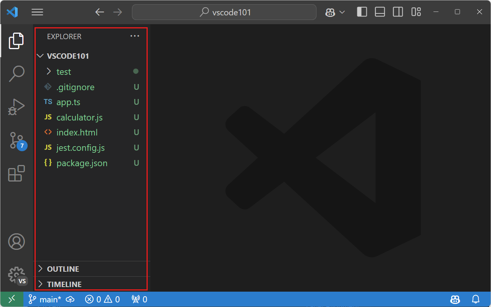
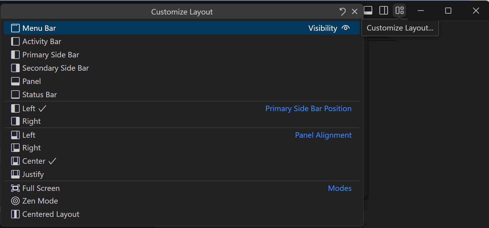
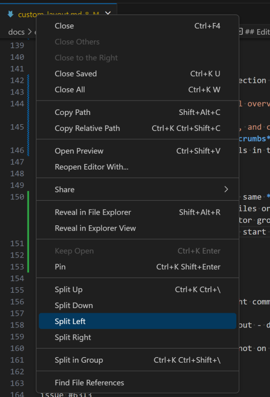
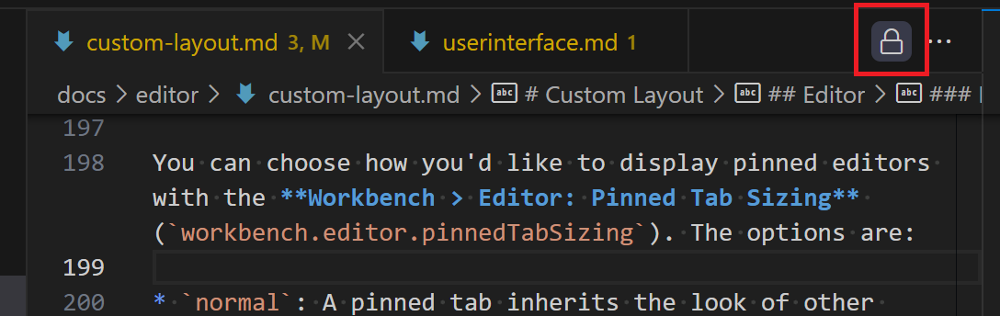
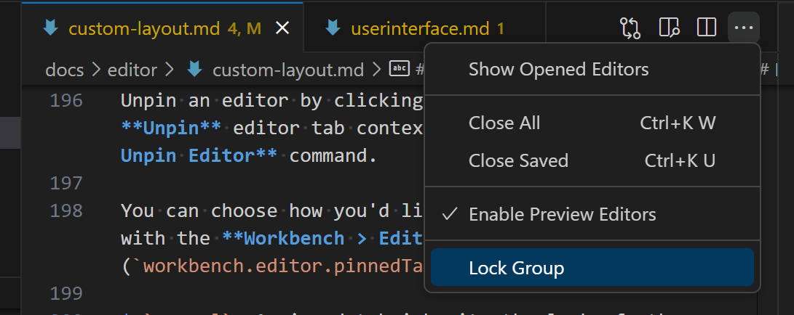

# 사용자 정의 레이아웃 {#custom-layout}

Visual Studio Code는 간단한 사용자 인터페이스와 편리한 기본 레이아웃을 제공합니다. 동시에 VS Code는 UI 레이아웃을 사용자 선호도와 작업 스타일에 맞게 사용자 정의할 수 있는 옵션과 설정을 제공합니다. 이 주제에서는 다양한 UI 사용자 정의를 강조하여 여러분이 가장 생산적인 방식으로 뷰, 편집기 및 패널을 표시할 수 있도록 합니다.

이 문서는 [작업대](#workbench) 사용자 정의에 대해 논의하며, 사이드 바, 뷰 및 패널과 같은 UI 요소를 재배치하는 방법을 설명합니다. 이후에는 편집기 그룹, 분할 편집기 및 편집기 탭을 사용하여 [편집기](#editor) 영역의 사용자 정의를 다룰 것입니다.

> [!NOTE]
> VS Code를 처음 사용하는 경우 [사용자 인터페이스 개요](/docs/getstarted/userinterface.md)에서 시작하거나 [팁과 요령](/docs/getstarted/tips-and-tricks.md) 문서를 살펴보는 것이 좋습니다.

## 작업대 {#workbench}

### 기본 사이드 바 {#primary-side-bar}

기본적으로 기본 사이드 바는 작업대의 왼쪽에 위치하며 탐색기, 검색 및 소스 제어 뷰와 같은 뷰를 표시합니다. 활동 바의 아이콘을 선택하여 뷰 간에 빠르게 전환할 수 있습니다.

기본 사이드 바의 위치를 변경하려면 다음 방법을 사용할 수 있습니다:

* 활동 바를 마우스 오른쪽 버튼으로 클릭하고 **기본 사이드 바 오른쪽으로 이동**을 선택합니다.
* **보기: 기본 사이드 바 위치 전환**을 실행하여 기본 사이드 바를 오른쪽과 왼쪽으로 전환합니다.
* **보기** > **모양** > **기본 사이드 바 오른쪽으로 이동** 메뉴 항목을 사용합니다.
* [설정 편집기](/docs/editor/settings.md)에서 **작업대 > 사이드 바: 위치** (`setting(workbench.sideBar.location)`) 설정을 `right`로 설정합니다.

### 보조 사이드 바 {#secondary-side-bar}

기본적으로 VS Code는 편집기 영역 왼쪽에 위치한 기본 사이드 바에 뷰를 표시합니다. 두 개의 뷰를 동시에 열어보는 것이 유용할 수 있습니다. 이를 위해 기본 사이드 바와 반대편에 뷰를 표시하는 **보조 사이드 바**를 사용할 수 있습니다. 보조 사이드 바는 기본 사이드 바의 위치를 전환하더라도 항상 기본 사이드 바와 반대편에 위치합니다.

다음 이미지는 기본 사이드 바의 탐색기 뷰와 보조 사이드 바의 Copilot Chat 뷰를 보여줍니다:

보조 사이드 바를 표시하려면 VS Code 제목 표시줄의 레이아웃 컨트롤을 사용할 수 있습니다. 레이아웃 컨트롤이 보이지 않는 경우, VS Code 제목 표시줄을 마우스 오른쪽 버튼으로 클릭하고 **레이아웃 컨트롤**을 선택합니다.

또한 다음과 같은 방법으로 보조 사이드 바를 열 수 있습니다:

* **보기: 보조 사이드 바 가시성 전환** 명령을 실행합니다 (또는 `kb(workbench.action.toggleAuxiliaryBar)`를 누릅니다).
* **보기** > **모양** > **보조 사이드 바** 메뉴 항목을 사용합니다.

언제든지 뷰와 패널을 기본 또는 보조 사이드 바로 드래그 앤 드롭할 수 있습니다. VS Code는 세션 간에 뷰와 패널의 레이아웃을 기억합니다.

> [!NOTE]
> **보기: 뷰 위치 재설정** 명령을 사용하여 뷰와 패널을 기본 위치로 재설정할 수 있습니다.

### 명령 팔레트 위치 {#command-palette-position}

명령 팔레트를 다른 위치로 이동하려면 마우스 커서로 상단 가장자리를 잡고 다른 곳으로 드래그하면 됩니다. 제목 표시줄의 **레이아웃 사용자 정의** 컨트롤을 선택한 다음 미리 구성된 **빠른 입력 위치** 중 하나를 선택할 수도 있습니다.

### 활동 바 위치 {#activity-bar-position}

기본적으로 활동 바는 기본 사이드 바와 함께 이동하며 작업대의 외부 가장자리에 유지됩니다. 활동 바를 숨기거나 기본 사이드 바의 상단 또는 하단으로 이동할 수도 있습니다.

**활동 바 위치** 메뉴는 활동 바 컨텍스트 메뉴에서 사용할 수 있으며, **보기** > **모양** > **활동 바 위치** 아래에서 **기본값**, **상단**, **하단** 또는 **숨김** 옵션이 있습니다.

활동 바가 상단 또는 하단 위치에 있을 때, 일반적으로 활동 바 하단에 있는 **계정** 및 **관리** 버튼은 제목 표시줄의 오른쪽으로 이동합니다.

### 패널 {#panel}

패널 영역은 문제, 터미널 및 출력 패널과 같은 UI 요소를 표시하며 기본적으로 편집기 영역 아래에 위치합니다.

### 패널 위치 {#panel-position}

패널 영역을 편집기의 왼쪽, 오른쪽, 하단 또는 상단으로 이동할 수 있습니다. 이러한 옵션은 **보기** > **모양** > **패널 위치** 메뉴 또는 패널 제목 표시줄의 컨텍스트 메뉴에서 구성할 수 있습니다.

명령 팔레트에서 **패널 이동** 명령을 사용할 수도 있습니다:

* **보기: 패널 왼쪽으로 이동** (`workbench.action.positionPanelLeft`)
* **보기: 패널 오른쪽으로 이동** (`workbench.action.positionPanelRight`)
* **보기: 패널을 하단으로 이동** (`workbench.action.positionPanelBottom`)
* **보기: 패널을 상단으로 이동** (`workbench.action.positionPanelTop`)

### 패널 정렬 {#panel-alignment}

이 옵션을 사용하면 하단 패널이 창에서 얼마나 넓게 펼쳐지는지를 구성할 수 있습니다. 네 가지 옵션이 있습니다:

* **가운데** - 기본 동작입니다. 패널은 편집기 영역의 너비만큼 펼쳐집니다.
* **정렬** - 패널이 창의 전체 너비를 차지합니다.
* **왼쪽** - 패널이 창의 왼쪽 가장자리에서 편집기 영역의 오른쪽 가장자리까지 펼쳐집니다.
* **오른쪽** - 패널이 창의 오른쪽 가장자리에서 편집기 영역의 왼쪽 가장자리까지 펼쳐집니다.

모든 패널 정렬 옵션에서 활동 바는 창의 가장자리로 간주됩니다.

이러한 옵션은 **보기** > **모양** > **패널 정렬** 메뉴, 패널 제목 컨텍스트 메뉴 또는 새로운 **패널 정렬 설정...** 명령을 사용하여 구성할 수 있습니다.

### 패널 크기 최대화 {#maximize-panel-size}

패널 정렬이 **가운데**일 때, 패널 영역을 전체 편집기 영역으로 채우도록 빠르게 전환할 수 있습니다. 패널 영역의 오른쪽 상단에 있는 **패널 크기 최대화** 화살표 버튼을 클릭하면 됩니다. 최대화된 패널에서는 화살표 버튼이 아래로 향하여 패널을 원래 크기로 복원합니다.

**보기: 최대화된 패널 전환** 명령을 통해서도 패널 영역을 최대화할 수 있습니다.

> **참고**: 전체 패널 영역 표시를 사용자 정의하는 것 외에도, 개별 패널은 자체 레이아웃 사용자 정의를 가질 수 있습니다. 예를 들어, 터미널은 [여러 열린 탭](/docs/terminal/basics.md#managing-terminals)과 [기존 터미널 분할](/docs/terminal/basics.md#groups-split-panes)을 지원합니다.

### 레이아웃 사용자 정의 컨트롤 {#customize-layout-control}

VS Code 제목 표시줄에는 주요 UI 요소(사이드 바 및 패널 영역)의 가시성을 전환하는 버튼도 있습니다.

가장 오른쪽 버튼을 클릭하면 **레이아웃 사용자 정의** 드롭다운이 열리며, 여기서 다양한 UI 요소의 가시성과 레이아웃을 추가로 변경할 수 있으며 여러 레이아웃 모드가 포함되어 있습니다:

레이아웃 모드는 다음과 같습니다:

* **전체 화면** - 편집기를 전체 디스플레이 화면으로 설정합니다. **보기: 전체 화면 전환** (`kb(workbench.action.toggleFullScreen)`).
* **젠 모드** - 편집기 영역을 제외한 모든 UI를 숨깁니다. **보기: 젠 모드 전환** (`kb(workbench.action.toggleZenMode)`).
* **중앙 레이아웃** - 편집기를 편집기 영역 안에 중앙에 배치합니다. **보기: 중앙 레이아웃 전환**.

### 뷰 및 패널 드래그 앤 드롭 {#drag-and-drop-views-and-panels}

VS Code는 기본 사이드 바와 패널 영역에 뷰와 패널의 기본 레이아웃을 가지고 있지만, 이러한 영역 간에 뷰와 패널을 드래그 앤 드롭할 수 있습니다. 예를 들어, 소스 제어 뷰를 패널 영역으로 드래그 앤 드롭하거나 문제 패널을 기본 사이드 바로 이동할 수 있습니다:

> **참고**: 뷰와 패널을 기본 위치로 재설정할 수 있다는 점을 기억하세요. **위치 재설정** 컨텍스트 메뉴 항목이나 모든 뷰와 패널에 대해 일반 **보기: 뷰 위치 재설정** 명령을 사용할 수 있습니다.

기존 뷰나 패널에 뷰와 패널을 추가하여 그룹을 만들 수도 있습니다. 예를 들어, 출력 패널을 탐색기 뷰 그룹으로 드래그하여 이동할 수 있습니다:

뷰와 패널을 이동하는 데 마우스만 사용할 필요는 없습니다. **보기: 뷰 이동** 및 **보기: 포커스된 뷰 이동** 명령을 사용하여 키보드로 레이아웃을 사용자 정의할 수도 있으며, 드롭다운을 통해 이동할 UI 요소와 목적지를 선택할 수 있습니다. 목적지는 사이드 바 또는 패널 영역과 같은 위치이거나 그룹을 만들기 위한 기존 뷰나 패널이 될 수 있습니다.

## 도구 모음 {#tool-bars}

대부분의 VS Code 뷰와 패널에는 UI의 오른쪽 상단에 도구 모음이 표시됩니다. 예를 들어, 검색 뷰에는 **새로 고침**, **검색 결과 지우기** 등의 작업이 있는 도구 모음이 있습니다:

### 도구 모음의 항목 숨기기 {#hide-items-in-tool-bars}

도구 모음이 너무 복잡하다고 생각되면 덜 자주 사용하는 작업을 숨길 수 있습니다. 작업을 마우스 오른쪽 버튼으로 클릭하고 **숨기기** 명령(예: **'검색 결과 지우기' 숨기기**)을 선택하거나 드롭다운에서 작업의 체크를 해제하면 됩니다. 숨겨진 작업은 `...` **추가 작업** 메뉴로 이동하며, 그곳에서 호출할 수 있습니다.

작업을 도구 모음으로 복원하려면 도구 모음 버튼 영역을 마우스 오른쪽 버튼으로 클릭하고 **메뉴 재설정** 명령을 선택하거나 숨겨진 작업을 다시 체크하면 됩니다. VS Code의 모든 메뉴를 복원하려면 명령 팔레트에서 **보기: 모든 메뉴 재설정**을 실행합니다 (`kb(workbench.action.showCommands)`).

## 편집기 {#editor}

VS Code 편집기 영역의 레이아웃은 작업대 사용자 인터페이스와 독립적으로 사용자 정의할 수 있습니다. 기본적으로 편집기 영역은 미니맵, 빵 부스러기, 편집기 탭과 같은 유용한 기능을 표시하며, 스티키 스크롤과 같은 선택적 UI도 있습니다. 편집기 자체의 레이아웃을 조정하거나 플로팅 창으로 이동할 수도 있습니다.

### 미니맵 및 빵 부스러기 {#minimap-and-breadcrumbs}

**보기** > **모양** 메뉴에는 편집기 영역을 사용자 정의하는 섹션이 있습니다. 여기에서 다음과 같은 토글을 찾을 수 있습니다:

* **미니맵** - 현재 파일의 [시각적 개요](/docs/getstarted/userinterface.md#minimap). **보기: 미니맵 전환**.
* **빵 부스러기** - 활성 파일에 대한 [폴더, 파일 및 현재 기호](/docs/getstarted/userinterface.md#breadcrumbs) 정보를 표시합니다. **보기: 빵 부스러기 전환**.
* **스티키 스크롤** - 활성 파일에서 [중첩 기호 범위](/docs/getstarted/userinterface.md#sticky-scroll)를 표시합니다. **보기: 스티키 스크롤 전환**.

### 편집기 그룹 {#editor-groups}

기본적으로 각 열린 편집기는 동일한 **편집기 그룹**에 들어가며 오른쪽에 새로운 편집기 탭을 추가합니다. 유사하거나 관련된 파일을 그룹화하거나 [나란히 편집](/docs/getstarted/userinterface.md#side-by-side-editing)할 수 있도록 새로운 편집기 그룹을 만들 수 있습니다. 편집기를 옆으로 드래그하거나 컨텍스트 메뉴의 **분할** 명령 중 하나를 사용하여 현재 편집기를 왼쪽, 오른쪽, 위 또는 아래의 새로운 편집기 그룹으로 복제하여 새 편집기 그룹을 만들 수 있습니다.

**분할** 편집기 명령은 **보기** > **편집기 레이아웃** 메뉴와 명령 팔레트에서도 사용할 수 있습니다.

수직 및 수평 편집기 그룹 레이아웃 간에 빠르게 전환하려면 **수직/수평 편집기 레이아웃 전환** 명령 (`kb(workbench.action.toggleEditorGroupLayout)`)을 사용할 수 있습니다.

### 그룹 내 분할 {#split-in-group}

같은 그룹 내에서 편집기를 나란히 편집하기 위해 **보기: 그룹 내 편집기 분할** 명령 (`kb(workbench.action.splitEditorInGroup)`)을 사용할 수도 있습니다.

그룹 내 분할 기능을 사용할 때, 이 모드를 전환하고 두 개의 분할 편집기 간에 탐색하기 위한 특정 명령이 있습니다:

* **보기: 그룹 내 편집기 분할** - 현재 편집기를 분할합니다.
* **보기: 그룹 내 분할 편집기 전환** - 활성 편집기의 분할 모드를 전환합니다.
* **보기: 그룹 내 편집기 합치기** - 활성 파일에 대해 단일 편집기로 돌아갑니다.
* **보기: 그룹 내 분할 편집기 레이아웃 전환** - 수평 및 수직 레이아웃 간에 전환합니다.

측면 간에 탐색하려면:

* **보기: 활성 편집기의 첫 번째 측면 포커스** - 분할 편집기의 첫 번째(왼쪽 또는 상단) 측면으로 포커스를 이동합니다.
* **보기: 활성 편집기의 두 번째 측면 포커스** - 두 번째(오른쪽 또는 하단) 측면으로 포커스를 이동합니다.
* **보기: 활성 편집기의 다른 측면 포커스** - 분할 편집기 측면 간에 전환합니다.

**작업대 > 편집기: 그룹 내 분할 레이아웃** (`setting(workbench.editor.splitInGroupLayout)`) [설정](/docs/editor/settings.md)을 사용하여 선호하는 분할 편집기 레이아웃을 수평(기본값) 또는 수직으로 설정할 수 있습니다.

### 그리드 레이아웃 {#grid-layout}

편집기 그룹 레이아웃을 더 세밀하게 제어하려면 [그리드 레이아웃](/docs/getstarted/userinterface.md#grid-editor-layout)을 사용할 수 있으며, 여러 행과 열의 편집기 그룹을 동시에 표시할 수 있습니다. **보기** > **편집기 레이아웃** 메뉴에는 다양한 편집기 레이아웃 옵션(예: **두 개의 열**, **세 개의 열**, **그리드(2x2)**)이 나열되어 있으며, 그들 사이의 경계를 잡고 이동하여 그룹 크기를 조정할 수 있습니다.

### 플로팅 편집기 창 {#floating-editor-windows}

편집기를 플로팅 창에서 열 수 있으며, 예를 들어 편집기를 모니터의 다른 위치로 이동하거나 다른 모니터로 이동할 수 있습니다.

편집기를 플로팅 창에서 열려면, 메인 창에서 드래그하여 현재 VS Code 창 외부의 아무 곳에나 드롭하면 됩니다:

<video src="images/custom-layout/floating-windows.mp4" autoplay loop controls muted></video>

플로팅 편집기 창은 원하는 만큼 많은 편집기를 그리드 레이아웃으로 열 수 있습니다. 창은 재시작 후에도 원래 위치에서 복원되며 모든 편집기를 다시 엽니다.

편집기를 분리하는 또 다른 방법은 편집기 탭을 마우스 오른쪽 버튼으로 클릭하고 **새 창으로 이동** (`workbench.action.moveEditorToNewWindow`) 또는 **새 창으로 복사** (`kb(workbench.action.copyEditorToNewWindow)`) 옵션을 선택하는 것입니다.

전체 편집기 그룹을 이동하려면 **편집기 그룹을 새 창으로 이동** (`kb(workbench.action.moveEditorGroupToNewWindow)`) 또는 **편집기 그룹을 새 창으로 복사** (`kb(workbench.action.copyEditorGroupToNewWindow)`)를 선택합니다.

### 고정된 탭 {#pinned-tabs}

편집기 탭을 항상 보이게 하려면 편집기 탭 바에 고정할 수 있습니다. 컨텍스트 메뉴에서 편집기 탭을 고정하거나 **보기: 편집기 고정** (`kb(workbench.action.pinEditor)`) 명령을 사용할 수 있습니다.

고정된 탭은 다음과 같은 이유로 중요 파일에 쉽게 접근할 수 있도록 도와줍니다:

* 고정된 탭은 비고정 탭보다 항상 먼저 나타납니다.
* 많은 탭이 열려 있어도 스크롤하여 사라지지 않습니다.
* **다른 탭 닫기** 또는 **모두 닫기**와 같은 편집기 탭 명령을 사용할 때 닫히지 않습니다.
* 열린 편집기의 설정된 한계를 초과해도 닫히지 않습니다.

고정 해제는 핀 아이콘을 클릭하거나 **고정 해제** 편집기 탭 컨텍스트 메뉴 항목 또는 **보기: 편집기 고정 해제** 명령을 사용하여 수행할 수 있습니다.

고정된 편집기를 표시하는 방법은 **작업대 > 편집기: 고정된 탭 크기** (`setting(workbench.editor.pinnedTabSizing)`) 설정을 통해 선택할 수 있습니다. 옵션은 다음과 같습니다:

* `normal`: 고정된 탭이 다른 탭의 모양을 상속합니다 (기본값)
* `shrink`: 고정된 탭이 고정 크기로 축소되어 편집기 레이블의 일부를 표시합니다.
* `compact`: 고정된 탭이 아이콘 또는 편집기 레이블의 첫 글자만 표시합니다.

고정된 편집기 탭을 일반 편집기 탭 바 위의 별도 행에 표시하려면 **작업대 > 편집기: 고정된 탭을 별도 행에 표시**로 설정할 수 있습니다. 두 행 간에 탭을 드래그 앤 드롭하여 편집기를 고정하거나 고정 해제할 수 있습니다.

### 잠긴 편집기 그룹 {#locked-editor-groups}

여러 편집기를 사용할 때 항상 보이게 하고 싶은 편집기가 하나 이상 있는 경우가 많습니다. 전체 편집기 그룹이 잠기고 보이도록 하는 잠긴 편집기 그룹 기능은 안정적인 표시를 제공하며, 새 편집기를 열 요청이 있을 경우 다른 그룹에서 생성됩니다. 편집기 그룹이 잠겨 있는지 여부는 편집기 그룹 도구 모음의 잠금 아이콘으로 알 수 있습니다.

편집기 도구 모음의 **추가 작업** `...` 드롭다운에서 **그룹 잠금**을 선택하거나 **보기: 편집기 그룹 잠금** 명령을 실행하여 편집기 그룹을 잠글 수 있습니다.

잠긴 편집기 그룹은 잠금을 해제하려면 잠금 아이콘을 클릭하거나 **보기: 편집기 그룹 잠금 해제** 명령을 실행하면 됩니다.

잠긴 그룹은 잠금 해제된 그룹과 다르게 동작합니다:

* 새 편집기는 명시적으로 이동되지 않는 한 잠긴 그룹에서 열리지 않습니다 (예: 드래그 앤 드롭을 통해).
* 새 편집기가 잠긴 그룹을 건너뛰면 가장 최근에 사용된 잠금 해제된 그룹에서 열리거나 잠긴 그룹 옆에 새 그룹을 생성합니다.
* 편집기 그룹의 잠금 상태는 재시작 간에 유지되고 복원됩니다.
* 빈 그룹도 잠글 수 있어 더 안정적인 편집기 레이아웃을 제공합니다.

주요 사용 사례는 [편집기 영역의 터미널](/docs/terminal/basics.md#terminals-in-editor-area)입니다. 예를 들어, 왼쪽에서 텍스트를 편집하고 오른쪽에서 항상 보이는 터미널을 두고 싶을 수 있습니다. 터미널 편집기가 생성되어 옆으로 이동하면 자동으로 잠깁니다. 이는 오른쪽의 터미널에 포커스가 있을 때에도 파일을 열면 왼쪽에서 열리도록 하여 수동으로 포커스를 변경할 필요가 없음을 의미합니다.

자동 잠금 그룹은 `setting(workbench.editor.autoLockGroups)` 설정을 사용하여 구성할 수 있으며, 기본적으로 터미널 편집기만 포함되지만 모든 편집기 유형을 추가하여 동일한 동작을 얻을 수 있습니다.

편집기 그룹 잠금과 관련된 명령:

* **보기: 편집기 그룹 잠금** - 활성 편집기 그룹을 잠급니다.
* **보기: 편집기 그룹 잠금 해제** - 활성 잠긴 편집기 그룹의 잠금을 해제합니다.
* **보기: 편집기 그룹 잠금 전환** - 활성 편집기 그룹을 잠그거나 잠금 해제합니다.

이 명령을 사용하려면 두 개 이상의 편집기 그룹이 있어야 합니다.

## 다음 단계 {#next-steps}

다음 내용을 읽어보세요:

* [Visual Studio Code 사용자 인터페이스](/docs/getstarted/userinterface.md) - VS Code에 대한 간단한 안내.
* [기본 편집](/docs/editor/codebasics.md) - 강력한 VS Code 편집기에 대해 알아보세요.
* [코드 탐색](/docs/editor/editingevolved.md) - 소스 코드를 빠르게 이동하세요.