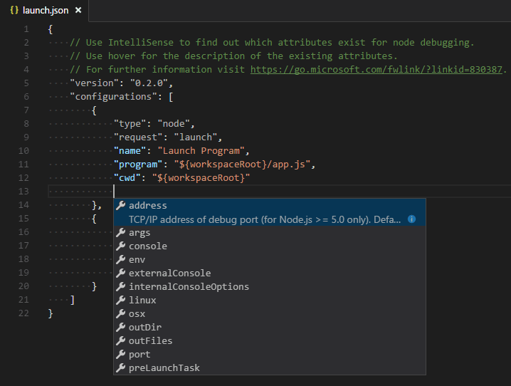

# Visual Studio Code 디버그 구성 {#visual-studio-code-debug-configuration}

복잡한 디버깅 시나리오나 애플리케이션의 경우, 디버거 구성을 지정하기 위해 `launch.json` 파일을 생성해야 합니다. 예를 들어, 애플리케이션 진입점을 지정하거나, 실행 중인 애플리케이션에 연결하거나, 환경 변수를 설정하는 경우입니다.

VS Code에서 디버깅에 대해 더 알아보려면 [Visual Studio Code에서 디버깅하기](/docs/editor/debugging.md)를 참조하세요.

> [!TIP]
> VS Code의 Copilot은 프로젝트에 대한 런치 구성을 생성하는 데 도움을 줄 수 있습니다. [Copilot으로 런치 구성 생성하기](#generate-a-launch-configuration-with-ai)에 대한 자세한 정보를 확인하세요.

## 런치 구성 {#launch-configurations}

간단한 애플리케이션이나 디버깅 시나리오의 경우, 특정 디버깅 구성 없이 프로그램을 실행하고 디버깅할 수 있습니다. `kb(workbench.action.debug.start)` 키를 사용하면 VS Code가 현재 활성 파일을 실행하려고 시도합니다.

그러나 대부분의 디버깅 시나리오에서는 디버깅 구성(_런치 구성_)을 생성해야 합니다. 예를 들어, 애플리케이션 진입점을 지정하거나, 실행 중인 애플리케이션에 연결하거나, 환경 변수를 설정하는 경우입니다. 런치 구성 파일을 생성하는 것도 유용한데, 이는 프로젝트와 함께 디버깅 설정 세부정보를 구성하고 저장할 수 있게 해줍니다.

VS Code는 디버깅 구성 정보를 작업 공간의 `.vscode` 폴더에 위치한 `launch.json` 파일에 저장하거나, [사용자 설정](/docs/editor/debugging-configuration.md#global-launch-configuration) 또는 [작업 공간 설정](/docs/editor/workspaces/multi-root-workspaces.md#workspace-launch-configurations)에 저장합니다.

다음 스니펫은 Node.js 애플리케이션을 디버깅하기 위한 샘플 구성을 설명합니다:

```json
{
    "version": "0.2.0",
    "configurations": [
        {
            "type": "node",
            "request": "launch",
            "name": "Launch Program",
            "skipFiles": [
                "<node_internals>/**"
            ],
            "program": "${workspaceFolder}\\app.js"
        }
    ]
}
```

VS Code는 또한 여러 구성을 동시에 시작하기 위한 [복합 런치 구성](#compound-launch-configurations)을 지원합니다.

> [!NOTE]
> 폴더가 열려 있지 않더라도 간단한 애플리케이션을 디버깅할 수 있지만, 런치 구성을 관리하고 고급 디버깅을 설정하는 것은 불가능합니다.

## 디버그 구성 파일 생성 {#create-a-debug-configuration-file}

초기 `launch.json` 파일을 생성하려면:

1. 실행 및 디버그 뷰에서 **launch.json 파일 생성**을 선택합니다.

   

2. VS Code가 디버그 환경을 감지하려고 시도합니다. 감지할 수 없는 경우, 수동으로 선택할 수 있습니다:

   

   선택한 디버그 환경에 따라 VS Code는 `launch.json` 파일에 시작 구성을 생성합니다.

3. 탐색기 뷰(`kb(workbench.view.explorer)`)에서 VS Code가 `.vscode` 폴더를 생성하고 `launch.json` 파일을 작업 공간에 추가한 것을 확인합니다.

   

이제 `launch.json` 파일을 편집하여 더 많은 구성을 추가하거나 기존 구성을 수정할 수 있습니다.

### launch.json에 구성 추가 {#add-a-configuration-to-launchjson}

기존 `launch.json`에 새 구성을 추가하려면 다음 기술 중 하나를 사용하세요:

- **구성 추가** 버튼을 눌러 미리 정의된 구성을 추가할 스니펫을 선택합니다.
- 커서가 구성 배열 안에 있을 때 IntelliSense를 사용합니다.
- **실행** > **구성 추가** 메뉴 옵션을 선택합니다.


### AI로 런치 구성 생성 {#generate-a-launch-configuration-with-ai}

VS Code의 Copilot을 사용하면 프로젝트에 대한 런치 구성 생성 프로세스를 가속화할 수 있습니다. Copilot으로 런치 구성을 생성하려면:

1. `kb(workbench.action.chat.open)`로 채팅 뷰를 열거나, 제목 표시줄의 Copilot 메뉴에서 **채팅 열기**를 선택합니다.

2. 디버그 구성을 생성하기 위해 `/startDebugging` 채팅 프롬프트를 입력합니다.

   또는 _express 앱에 대한 디버그 구성 생성 #codebase_와 같은 사용자 정의 프롬프트를 입력할 수도 있습니다.

   이는 작업 공간에 다양한 언어의 파일이 있는 경우 유용할 수 있습니다.

   > [!NOTE]
   > `#codebase` 채팅 변수는 Copilot에 프로젝트의 맥락을 제공하여 보다 정확한 응답을 생성하는 데 도움이 됩니다.

3. 제안된 구성을 적용한 후 디버깅을 시작합니다.

## 런치 구성으로 디버깅 세션 시작 {#start-a-debugging-session-with-a-launch-configuration}

런치 구성으로 디버그 세션을 시작하려면:

1. 실행 및 디버그 뷰의 **구성 드롭다운**에서 **프로그램 실행**이라는 구성을 선택합니다.

   사용 가능한 구성 목록은 `launch.json` 파일의 구성과 일치합니다.

   

2. `kb(workbench.action.debug.start)`로 디버그 세션을 시작하거나 **실행 및 디버그** 뷰에서 **디버깅 시작**(재생 아이콘)을 선택합니다.

또는 **명령 팔레트**(`kb(workbench.action.showCommands)`)를 통해 **디버그: 선택 및 디버깅 시작**을 필터링하거나 `'debug '`를 입력하고 디버깅할 구성을 선택할 수 있습니다.

## 런치 구성과 연결 구성 {#launch-versus-attach-configurations}

VS Code에는 두 가지 핵심 디버깅 모드인 **런치**와 **연결**이 있으며, 이는 서로 다른 워크플로우와 개발자 세그먼트를 처리합니다. 워크플로우에 따라 어떤 유형의 구성이 프로젝트에 적합한지 혼란스러울 수 있습니다.

브라우저 개발자 도구 배경에서 온 경우, "도구에서 실행하는 것"에 익숙하지 않을 수 있습니다. 브라우저 인스턴스는 이미 열려 있기 때문입니다. DevTools를 열면 단순히 열린 브라우저 탭에 DevTools를 **연결**하는 것입니다. 반면, 서버나 데스크톱 배경에서 온 경우, 편집기가 프로세스를 **실행**하는 것이 일반적이며, 편집기가 자동으로 새로 실행된 프로세스에 디버거를 연결합니다.

런치와 연결의 차이를 설명하는 가장 좋은 방법은 런치 구성을 디버그 모드에서 앱을 시작하는 방법에 대한 레시피로 생각하는 것입니다. _VS Code가 연결하기 전에_, 반면 연결 구성은 _이미_ 실행 중인 앱이나 프로세스에 VS Code의 디버거를 연결하는 방법에 대한 레시피입니다.

VS Code 디버거는 일반적으로 디버그 모드에서 프로그램을 실행하거나 이미 실행 중인 프로그램에 디버그 모드로 연결하는 것을 지원합니다. 요청(`attach` 또는 `launch`)에 따라 필요한 속성이 다르며, VS Code의 `launch.json` 유효성 검사 및 제안이 이에 도움이 됩니다.

## launch.json 속성 {#launchjson-attributes}

다양한 디버거와 디버깅 시나리오를 지원하기 위해 많은 `launch.json` 속성이 있습니다. `type` 속성에 대한 값을 지정하면 IntelliSense(`kb(editor.action.triggerSuggest)`)를 사용하여 사용 가능한 속성 목록을 볼 수 있습니다. 런치 구성에서 사용할 수 있는 속성은 디버거마다 다릅니다.



하나의 디버거에 대해 사용 가능한 속성이 다른 디버거에서도 자동으로 작동하지는 않습니다. 런치 구성에서 빨간 물결선이 보이면, 마우스를 올려 문제를 확인하고 디버그 세션을 시작하기 전에 수정하세요.

모든 런치 구성에 필수적인 속성은 다음과 같습니다:

- `type` - 이 런치 구성에 사용할 디버거의 유형입니다. 설치된 모든 디버그 확장은 유형을 도입합니다: 예를 들어, 내장 Node 디버거의 경우 `node`, PHP 및 Go 확장의 경우 각각 `php`와 `go`입니다.
- `request` - 이 런치 구성의 요청 유형입니다. 현재 `setting(launch)`와 `attach`가 지원됩니다.
- `name` - 디버그 런치 구성 드롭다운에 표시될 사용자 친화적인 이름입니다.

모든 런치 구성에서 사용할 수 있는 선택적 속성은 다음과 같습니다:

- `presentation` - `presentation` 객체의 `order`, `group`, 및 `hidden` 속성을 사용하여 디버그 구성 드롭다운 및 디버그 빠른 선택에서 구성을 정렬, 그룹화 및 숨길 수 있습니다.
- `preLaunchTask` - 디버그 세션 시작 전에 작업을 실행하려면 이 속성을 [tasks.json](/docs/editor/tasks.md)에서 지정한 작업의 레이블로 설정합니다(작업 공간의 `.vscode` 폴더에 있음). 또는 기본 빌드 작업을 사용하려면 `$\{defaultBuildTask\}`로 설정할 수 있습니다.
- `postDebugTask` - 디버그 세션이 끝날 때 작업을 실행하려면 이 속성을 [tasks.json](/docs/editor/tasks.md)에서 지정한 작업의 이름으로 설정합니다(작업 공간의 `.vscode` 폴더에 있음).
- `internalConsoleOptions` - 이 속성은 디버깅 세션 동안 디버그 콘솔 패널의 가시성을 제어합니다.
- `debugServer` - **디버그 확장 작성자 전용**: 이 속성은 디버그 어댑터를 시작하는 대신 지정된 포트에 연결할 수 있게 해줍니다.
- `serverReadyAction` - 디버깅 중인 프로그램이 디버그 콘솔이나 통합 터미널에 특정 메시지를 출력할 때마다 URL을 웹 브라우저에서 열고 싶다면 이 속성을 사용합니다. 자세한 내용은 아래 [서버 프로그램 디버깅 시 URI 자동 열기](#automatically-open-a-uri-when-debugging-a-server-program) 섹션을 참조하세요.

많은 디버거가 다음 속성 중 일부를 지원합니다:

- `program` - 디버거를 실행할 때 실행할 실행 파일 또는 파일
- `args` - 디버깅할 프로그램에 전달되는 인수
- `env` - 환경 변수(값 `null`을 사용하여 변수를 "정의 해제"할 수 있음)
- `envFile` - 환경 변수가 포함된 dotenv 파일의 경로
- `cwd` - 종속성 및 기타 파일을 찾기 위한 현재 작업 디렉토리
- `port` - 실행 중인 프로세스에 연결할 때 사용할 포트
- `stopOnEntry` - 프로그램이 시작될 때 즉시 중단
- `console` - 사용할 콘솔의 종류, 예를 들어 `internalConsole`, `integratedTerminal`, 또는 `externalTerminal`

## 변수 치환 {#variable-substitution}

VS Code는 일반적으로 사용되는 경로 및 기타 값을 변수로 제공하며, `launch.json`의 문자열 내에서 변수 치환을 지원합니다. 즉, 디버그 구성에서 절대 경로를 사용할 필요가 없습니다. 예를 들어, `$\{workspaceFolder\}`는 작업 공간 폴더의 루트 경로를 제공하고, `$\{file\}`는 활성 편집기에서 열린 파일을, `$\{env:Name\}`은 환경 변수 'Name'을 제공합니다.

정의된 변수의 전체 목록은 [변수 참조](/docs/reference/variables-reference.md)에서 확인하거나 `launch.json` 문자열 속성 내에서 IntelliSense를 호출하여 확인할 수 있습니다.

```json
{
    "type": "node",
    "request": "launch",
    "name": "프로그램 실행",
    "program": "$\{workspaceFolder\}
/app.js",
    "cwd": "$\{workspaceFolder\}
",
    "args": [ "$\{env:USERNAME\}
" ]
}
```

## 플랫폼별 속성 {#platform-specific-properties}

VS Code는 디버거가 실행되는 운영 체제에 따라 디버깅 구성 설정(예: 프로그램에 전달할 인수)을 정의하는 것을 지원합니다. 이를 위해 `launch.json` 파일에 플랫폼별 리터럴을 넣고 해당 리터럴 내에 해당 속성을 지정합니다.

다음 예제는 Windows에서 프로그램에 `"args"`를 다르게 전달하는 방법을 보여줍니다:

```json
{
    "version": "0.2.0",
    "configurations": [
        {
            "type": "node",
            "request": "launch",
            "name": "프로그램 실행",
            "program": "$\{workspaceFolder\}
/node_modules/gulp/bin/gulpfile.js",
            "args": ["myFolder/path/app.js"],
            "windows": {
                "args": ["myFolder\\path\\app.js"]
            }
        }
    ]
}
```

유효한 운영 체제 속성은 Windows의 경우 `"windows"`, Linux의 경우 `"linux"`, macOS의 경우 `"osx"`입니다. 운영 체제 특정 범위에서 정의된 속성은 전역 범위에서 정의된 속성을 덮어씁니다.

`type` 속성은 플랫폼별 섹션 내에 배치할 수 없습니다. 이는 `type`이 원격 디버깅 시나리오에서 플랫폼을 간접적으로 결정하기 때문에 순환 종속성이 발생할 수 있습니다.

다음 예제에서는 프로그램이 항상 **진입 시 중단**되지만, macOS에서는 그렇지 않습니다:

```json
{
    "version": "0.2.0",
    "configurations": [
        {
            "type": "node",
            "request": "launch",
            "name": "프로그램 실행",
            "program": "$\{workspaceFolder\}
/node_modules/gulp/bin/gulpfile.js",
            "stopOnEntry": true,
            "osx": {
                "stopOnEntry": false
            }
        }
    ]
}
```

## 전역 런치 구성 {#global-launch-configuration}

모든 작업 공간에서 사용할 수 있는 런치 구성을 정의할 수 있습니다. 전역 런치 구성을 지정하려면 `setting(launch)` 사용자 설정에 런치 구성 객체를 추가합니다. 이 `launch` 구성은 작업 공간 간에 공유됩니다. 예를 들어:

```json
"launch": {
    "version": "0.2.0",
    "configurations": [{
        "type": "node",
        "request": "launch",
        "name": "프로그램 실행",
        "program": "$\{file\}
"
    }]
}
```

## 디버그 대상에 대한 입력/출력 리디렉션 {#redirect-inputoutput-tofrom-the-debug-target}

입력/출력 리디렉션은 디버거나 런타임에 따라 다르므로 VS Code는 모든 디버거에 대해 작동하는 내장 솔루션이 없습니다.

고려할 수 있는 두 가지 접근 방식은 다음과 같습니다:

- 프로그램을 수동으로 터미널이나 명령 프롬프트에서 디버그("디버그 대상")하고 필요에 따라 입력/출력을 리디렉션합니다. 디버거가 연결할 수 있도록 디버그 대상에 적절한 명령줄 옵션을 전달해야 합니다. 디버그 대상을 연결하는 "연결" 디버그 구성을 생성하고 실행합니다.

- 사용하는 디버거 확장이 VS Code의 통합 터미널(또는 외부 터미널)에서 디버그 대상을 실행할 수 있는 경우, 인수로 셸 리디렉션 구문(예: `<` 또는 `>`)을 전달해 볼 수 있습니다.

  다음은 `launch.json` 구성의 예입니다:

  ```json
  {
    "name": "stdin에서 파일을 읽는 프로그램 실행",
    "type": "node",
    "request": "launch",
    "program": "program.js",
    "console": "integratedTerminal",
    "args": ["<", "in.txt"]
  }
  ```

  이 접근 방식은 `<` 구문이 디버거 확장을 통해 전달되고 통합 터미널에서 수정되지 않은 채로 남아 있어야 합니다.

### 복합 런치 구성 {#compound-launch-configurations}

여러 디버그 세션을 시작하는 또 다른 방법은 _복합_ 런치 구성을 사용하는 것입니다. `launch.json` 파일의 `compounds` 속성에서 복합 런치 구성을 정의할 수 있습니다.

`configurations` 속성을 사용하여 병렬로 실행해야 할 두 개 이상의 런치 구성 이름을 나열합니다.

선택적으로, 개별 디버그 세션이 시작되기 전에 실행되는 `preLaunchTask` 작업을 지정할 수 있습니다. 부울 플래그 `stopAll`은 수동으로 하나의 세션을 종료할 때 모든 복합 세션을 중지할지 여부를 제어합니다.

```json
{
    "version": "0.2.0",
    "configurations": [
        {
            "type": "node",
            "request": "launch",
            "name": "서버",
            "program": "$\{workspaceFolder\}
/server.js"
        },
        {
            "type": "node",
            "request": "launch",
            "name": "클라이언트",
            "program": "$\{workspaceFolder\}
/client.js"
        }
    ],
    "compounds": [
        {
            "name": "서버/클라이언트",
            "configurations": ["서버", "클라이언트"],
            "preLaunchTask": "$\{defaultBuildTask\}
",
            "stopAll": true
        }
    ]
}
```

복합 런치 구성은 런치 구성 드롭다운 메뉴에도 표시됩니다.

## 서버 프로그램 디버깅 시 URI 자동 열기 {#automatically-open-a-uri-when-debugging-a-server-program}

웹 프로그램을 개발할 때는 일반적으로 디버거에서 서버 코드를 실행하기 위해 특정 URL을 웹 브라우저에서 열어야 합니다. VS Code에는 이 작업을 자동화하기 위한 내장 기능인 "**serverReadyAction**"이 있습니다.

다음은 간단한 [Node.js Express](https://expressjs.com) 애플리케이션의 예입니다:

```javascript
var express = require("express");
var app = express();

app.get("/", function (req, res) {
  res.send("Hello World!");
});

app.listen(3000, function () {
  console.log("예제 앱이 포트 3000에서 실행 중입니다!");
});
```

이 애플리케이션은 먼저 "/" URL에 대한 "Hello World" 핸들러를 설치한 후 포트 3000에서 HTTP 연결을 수신 대기합니다. 포트는 디버그 콘솔에 발표되며, 일반적으로 개발자는 이제 브라우저 애플리케이션에 `http://localhost:3000`을 입력합니다.

**serverReadyAction** 기능을 사용하면 모든 런치 구성에 구조화된 속성 `serverReadyAction`을 추가하고 수행할 "작업"을 선택할 수 있습니다:

```json
{
  "type": "node",
  "request": "launch",
  "name": "프로그램 실행",
  "program": "$\{workspaceFolder\}
/app.js",

  "serverReadyAction": {
    "pattern": "포트 ([0-9]+)에서 수신 대기 중",
    "uriFormat": "http://localhost:%s",
    "action": "openExternally"
  }
}
```

여기서 `pattern` 속성은 프로그램의 출력 문자열에서 포트를 발표하는 정규 표현식을 설명합니다. 포트 번호에 대한 패턴은 괄호로 묶여 정규 표현식 캡처 그룹으로 사용할 수 있습니다. 이 예제에서는 포트 번호만 추출하고 있지만, 전체 URI를 추출하는 것도 가능합니다.

`uriFormat` 속성은 포트 번호가 URI로 변환되는 방법을 설명합니다. 첫 번째 `%s`는 일치하는 패턴의 첫 번째 캡처 그룹으로 대체됩니다.

결과 URI는 VS Code 외부("외부")에서 URI의 스킴에 대해 구성된 표준 애플리케이션으로 열립니다.

### Microsoft Edge 또는 Chrome을 통한 디버깅 트리거 {#trigger-debugging-via-microsoft-edge-or-chrome}

대안으로, `action`을 `debugWithEdge` 또는 `debugWithChrome`으로 설정할 수 있습니다. 이 모드에서는 Chrome 또는 Microsoft Edge 디버그 세션에 전달되는 `webRoot` 속성을 추가할 수 있습니다.

조금 더 간단하게 하기 위해 대부분의 속성은 선택적이며 다음과 같은 기본값을 사용합니다:

- **pattern**: `"listening on.* (https?://\\S+|[0-9]+)"`는 일반적으로 사용되는 메시지 "포트 3000에서 수신 대기 중" 또는 "Now listening on: https://localhost:5001" 과 일치합니다.
- **uriFormat**: `"http://localhost:%s"`
- **webRoot**: `"$\{workspaceFolder\}
"`

### 임의의 런치 구성 트리거 {#triggering-an-arbitrary-launch-config}

경우에 따라 브라우저 디버그 세션에 대해 더 많은 옵션을 구성해야 하거나 전혀 다른 디버거를 사용해야 할 수도 있습니다. 이를 위해 `action`을 `startDebugging`으로 설정하고 `pattern`이 일치할 때 시작할 런치 구성의 이름을 설정합니다.

명명된 런치 구성은 `serverReadyAction`이 있는 파일 또는 폴더와 동일한 파일 또는 폴더에 있어야 합니다.

여기 **serverReadyAction** 기능이 작동하는 모습입니다:

<video src="images/debugging/server-ready.mp4" title="서버 준비 기능 작동 중" autoplay loop controls muted></video>

## 다음 단계 {#next-steps}

- [작업](/docs/editor/tasks.md) - Gulp, Grunt 및 Jake로 작업을 실행하는 방법과 오류 및 경고를 표시하는 방법을 설명합니다.
- [변수 참조](/docs/reference/variables-reference.md) - VS Code에서 사용할 수 있는 변수를 설명합니다.

## 자주 묻는 질문 {#common-questions}

### 실행 및 디버그 뷰 드롭다운에서 런치 구성이 보이지 않습니다. 무엇이 잘못되었나요? {#i-do-not-see-any-launch-configurations-in-the-run-and-debug-view-dropdown-what-is-wrong}

가장 일반적인 문제는 `launch.json`을 설정하지 않았거나 해당 파일에 구문 오류가 있다는 것입니다. 또는 폴더를 열어야 할 수도 있습니다. 폴더가 없는 디버깅은 런치 구성을 지원하지 않습니다.