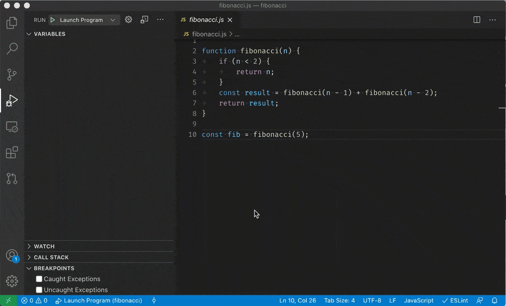

# Visual Studio Code로 코드 디버깅하기 {#debug-code-with-visual-studio-code}

Visual Studio Code는 다양한 유형의 애플리케이션에 대한 풍부한 디버깅 지원을 제공합니다. VS Code는 JavaScript, TypeScript 및 Node.js 디버깅을 위한 기본 지원을 제공합니다. [Visual Studio Marketplace](https://marketplace.visualstudio.com/vscode/Debuggers)에는 VS Code에 다른 언어와 런타임에 대한 디버깅 지원을 추가할 수 있는 다양한 디버깅 확장 프로그램이 있습니다.

이 문서에서는 VS Code의 디버깅 기능과 VS Code에서 디버깅을 시작하는 방법에 대해 설명합니다. 또한 VS Code에서 Copilot을 사용하여 디버깅 구성을 설정하고 디버깅 세션을 시작하는 방법도 배울 수 있습니다.

다음 비디오는 VS Code에서 디버깅을 시작하는 방법을 보여줍니다.

<iframe width="560" height="315" src="https://www.youtube-nocookie.com/embed/3HiLLByBWkg" title="VS Code에서 디버깅 시작하기" frameborder="0" allowfullscreen></iframe>

## 디버거 사용자 인터페이스 {#debugger-user-interface}

다음 다이어그램은 디버거 사용자 인터페이스의 주요 구성 요소를 보여줍니다:

1. **실행 및 디버그 보기**: 실행, 디버깅 및 디버그 구성 설정 관리와 관련된 모든 정보를 표시합니다.
1. **디버그 도구 모음**: 가장 일반적인 디버깅 작업을 위한 버튼이 있습니다.
1. **디버그 콘솔**: 디버거에서 실행 중인 코드의 출력을 보고 상호작용할 수 있게 해줍니다.
1. **디버그 사이드바**: 디버그 세션 중에 호출 스택, 중단점, 변수 및 감시 변수를 상호작용할 수 있게 해줍니다.
1. **실행** 메뉴: 가장 일반적인 실행 및 디버그 명령이 포함되어 있습니다.

## 디버깅을 시작하기 전에 {#before-you-start-debugging}

1. 언어 또는 런타임에 대한 디버깅 확장을 [Visual Studio Marketplace](https://marketplace.visualstudio.com/vscode/Debuggers)에서 설치합니다.

   VS Code는 JavaScript, TypeScript 및 Node.js 디버깅을 위한 기본 지원을 제공합니다.

1. 프로젝트에 대한 디버깅 구성을 정의합니다.

   간단한 애플리케이션의 경우, VS Code는 현재 활성 파일을 실행하고 디버깅하려고 시도합니다. 더 복잡한 애플리케이션이나 디버깅 시나리오의 경우, 디버거 구성을 지정하기 위해 `launch.json` 파일을 생성해야 합니다. [디버그 구성 만들기](/docs/editor/debugging-configuration.md)에 대한 자세한 정보를 확인하세요.

   > [!TIP]
   > VS Code의 Copilot은 `launch.json` 파일을 생성하는 데 도움을 줄 수 있습니다. 자세한 내용은 [Copilot을 사용하여 디버깅 구성 생성하기](/docs/editor/debugging-configuration.md#generate-a-launch-configuration-with-ai)를 참조하세요.

1. 코드에 중단점을 설정합니다.

   중단점은 코드의 특정 줄에 설정할 수 있는 마커로, 디버거가 해당 줄에 도달했을 때 실행을 일시 중지하도록 지시합니다. 편집기에서 줄 번호 옆의 여백을 클릭하여 중단점을 설정할 수 있습니다.

   중단점에 대한 자세한 내용은 [중단점 작업하기](/docs/editor/debugging.md#breakpoints)를 참조하세요.

## 디버깅 세션 시작하기 {#start-a-debugging-session}

VS Code에서 디버깅 세션을 시작하려면 다음 단계를 수행합니다:

1. 디버깅할 코드가 포함된 파일을 엽니다.

1. `kb(workbench.action.debug.start)` 키를 사용하거나 **실행 및 디버그** 보기에서 **실행 및 디버그**를 선택하여 디버깅 세션을 시작합니다 (`workbench.view.debug`).

   

   실행 중인 프로세스에 연결하는 것과 같은 더 복잡한 디버깅 시나리오의 경우, 디버거 구성을 지정하기 위해 `launch.json` 파일을 생성해야 합니다. [디버그 구성](/docs/editor/debugging-configuration.md)에 대한 자세한 정보를 확인하세요.

1. 사용하려는 디버거를 사용 가능한 디버거 목록에서 선택합니다.

   VS Code는 현재 활성 파일을 실행하고 디버깅하려고 시도합니다. Node.js의 경우, VS Code는 `package.json` 파일에서 `start` 스크립트를 확인하여 애플리케이션의 진입점을 결정합니다.

1. 디버깅 세션이 시작되면 **DEBUG CONSOLE** 패널이 표시되고 디버깅 출력을 보여주며, 상태 표시줄의 색상이 변경됩니다 (기본 색상 테마의 경우 주황색).

   

1. 상태 표시줄의 디버그 상태는 활성 디버그 구성을 보여줍니다. 디버그 상태를 선택하여 활성 실행 구성을 변경하고 **실행 및 디버그** 보기를 열지 않고도 디버깅을 시작할 수 있습니다.

   

## 디버그 작업 {#debug-actions}

디버그 세션이 시작되면 디버그 도구 모음이 창 상단에 나타납니다. 도구 모음에는 코드 단계를 진행하고, 실행을 일시 중지하며, 디버그 세션을 중지하는 등의 디버그 세션 흐름을 제어하는 작업이 포함되어 있습니다.

다음 표는 디버그 도구 모음에서 사용할 수 있는 작업을 설명합니다:

| 작업                                                        | 설명                                                                                                                                                            |
| ----------------------------------------------------------- | --------------------------------------------------------------------------------------------------------------------------------------------------------------- |
| 계속 / 일시 중지   `kb(workbench.action.debug.continue)` | **계속**: 다음 중단점까지 프로그램/스크립트 실행을 재개합니다.   **일시 중지**: 현재 줄에서 실행 중인 코드를 검사하고 단계별로 디버깅합니다. |
| 단계 건너뛰기   `kb(workbench.action.debug.stepOver)`  | 다음 메서드를 단일 명령으로 실행하되, 그 구성 요소 단계를 검사하거나 따르지 않습니다.                                                                 |
| 단계 진입   `kb(workbench.action.debug.stepInto)`      | 다음 메서드에 들어가서 그 실행을 단계별로 따릅니다.                                                                                                        |
| 단계 나가기   `kb(workbench.action.debug.stepOut)`     | 메서드나 서브루틴 내부에 있을 때, 현재 메서드의 남은 줄을 완료하여 이전 실행 컨텍스트로 돌아갑니다.                                                        |
| 재시작   `kb(workbench.action.debug.restart)`          | 현재 프로그램 실행을 종료하고 현재 실행 구성을 사용하여 다시 디버깅을 시작합니다.                                                                           |
| 중지   `kb(workbench.action.debug.stop)`               | 현재 프로그램 실행을 종료합니다.                                                                                                                               |

디버깅 세션이 여러 대상을 포함하는 경우(예: 클라이언트와 서버), 디버그 도구 모음은 세션 목록을 표시하고 이를 전환할 수 있게 해줍니다.

> [!TIP]
> `setting(debug.toolBarLocation)` 설정을 사용하여 디버그 도구 모음의 위치를 제어할 수 있습니다. 기본적으로 `floating`, **실행 및 디버그** 보기에서 `docked`, 또는 `hidden`으로 설정할 수 있습니다. 떠 있는 디버그 도구 모음은 수평으로 드래그할 수 있으며 편집기 영역 아래로도 드래그할 수 있습니다(상단 가장자리에서 일정 거리까지).

## 중단점 {#breakpoints}

중단점은 코드의 특정 지점에서 실행을 일시 중지하여 해당 시점에서 애플리케이션의 상태를 검사할 수 있도록 하는 특별한 마커입니다. VS Code는 여러 유형의 중단점을 지원합니다.

### 중단점 설정하기 {#setting-breakpoints}

중단점을 설정하거나 해제하려면 **편집기 여백**을 클릭하거나 현재 줄에서 `kb(editor.debug.action.toggleBreakpoint)`를 사용합니다.

- 편집기 여백의 중단점은 일반적으로 빨간색으로 채워진 원으로 표시됩니다.
- 비활성 중단점은 회색으로 채워진 원으로 표시됩니다.
- 디버깅 세션이 시작되면 디버거에 등록할 수 없는 중단점은 회색의 빈 원으로 변경됩니다. 라이브 편집 지원 없이 디버깅 세션이 실행되는 동안 소스가 편집되면 동일한 일이 발생할 수 있습니다.

선택적으로, 중단점은 `setting(debug.showBreakpointsInOverviewRuler)` 설정을 활성화하여 편집기의 개요 눈금에 표시할 수 있습니다:

중단점에 대한 더 많은 제어를 원한다면 **실행 및 디버그** 보기의 **중단점** 섹션을 사용하세요. 이 섹션은 코드의 모든 중단점을 나열하고 이를 관리하기 위한 추가 작업을 제공합니다.

### 중단점 유형 {#breakpoint-types}

#### 조건부 중단점 {#conditional-breakpoints}

강력한 VS Code 디버깅 기능 중 하나는 표현식, 히트 수 또는 둘의 조합에 따라 조건을 설정할 수 있는 기능입니다.

- **표현식 조건**: 표현식이 `true`로 평가될 때마다 중단점이 발생합니다.
- **히트 수**: _히트 수_는 중단점이 실행을 중단하기 위해 몇 번 발생해야 하는지를 제어합니다. 히트 수가 존중되는지 여부와 표현식의 정확한 구문은 디버거 확장에 따라 다를 수 있습니다.
- **중단점 대기**: 다른 중단점이 발생할 때 중단점이 활성화됩니다 ([트리거된 중단점](#triggered-breakpoints)).

조건부 중단점을 추가하려면:

1. 조건부 중단점 생성

   - 편집기 여백에서 마우스 오른쪽 버튼을 클릭하고 **조건부 중단점 추가**를 선택합니다.
   - 명령 팔레트에서 **조건부 중단점 추가** 명령을 사용합니다 (`kb(workbench.action.showCommands)`).

1. 설정할 조건 유형(표현식, 히트 수 또는 중단점 대기)을 선택합니다.

   

기존 중단점에 조건을 추가하려면:

1. 기존 중단점 편집

   - 편집기 여백의 중단점에서 마우스 오른쪽 버튼을 클릭하고 **중단점 편집**을 선택합니다.
   - **실행 및 디버그** 보기의 **중단점** 섹션에서 기존 중단점 옆의 연필 아이콘을 선택합니다.

1. 조건(표현식, 히트 수 또는 중단점 대기)을 편집합니다.

디버거가 조건부 중단점을 지원하지 않는 경우, **조건부 중단점 추가** 및 **조건 편집** 작업은 사용할 수 없습니다.

#### 트리거된 중단점 {#triggered-breakpoints}

트리거된 중단점은 다른 중단점이 발생할 때 활성화되는 조건부 중단점의 일종입니다. 특정 전제 조건이 충족된 후에만 발생하는 코드의 실패 사례를 진단할 때 유용할 수 있습니다.

트리거된 중단점은 기호 여백에서 마우스 오른쪽 버튼을 클릭하고 **트리거된 중단점 추가**를 선택한 다음 어떤 다른 중단점이 이 중단점을 활성화하는지 선택하여 설정할 수 있습니다.

<video src="images/debugging/debug-triggered-breakpoint.mp4" autoplay loop controls muted></video>

#### 인라인 중단점 {#inline-breakpoints}

인라인 중단점은 실행이 인라인 중단점과 연결된 열에 도달할 때만 발생합니다. 이는 여러 문장이 한 줄에 포함된 축소된 코드를 디버깅할 때 유용합니다.

인라인 중단점은 `kb(editor.debug.action.toggleInlineBreakpoint)`를 사용하거나 디버깅 세션 중에 컨텍스트 메뉴를 통해 설정할 수 있습니다. 인라인 중단점은 편집기에서 인라인으로 표시됩니다.

인라인 중단점에도 조건을 설정할 수 있습니다. 편집기의 왼쪽 여백에서 컨텍스트 메뉴를 통해 한 줄에 여러 중단점을 편집할 수 있습니다.

#### 함수 중단점 {#function-breakpoints}

소스 코드에 직접 중단점을 배치하는 대신, 디버거는 함수 이름을 지정하여 중단점을 생성하는 것을 지원할 수 있습니다. 이는 소스가 없지만 함수 이름이 알려진 상황에서 유용합니다.

함수 중단점을 생성하려면 **중단점** 섹션 헤더의 **+** 버튼을 선택하고 함수 이름을 입력합니다. 함수 중단점은 **중단점** 섹션에서 빨간색 삼각형으로 표시됩니다.

#### 데이터 중단점 {#data-breakpoints}

디버거가 데이터 중단점을 지원하는 경우, **변수** 보기의 컨텍스트 메뉴에서 설정할 수 있습니다. **값 변경/읽기/접근 시 중단** 명령은 기본 변수의 값이 변경되거나 읽히거나 접근될 때 발생하는 데이터 중단점을 추가합니다. 데이터 중단점은 **중단점** 섹션에서 빨간색 육각형으로 표시됩니다.

#### 로그 포인트 {#logpoints}

로그 포인트는 디버거에 중단하지 않고 대신 디버그 콘솔에 메시지를 기록하는 중단점의 변형입니다. 로그 포인트는 코드에 로그 문을 추가하거나 제거할 필요 없이 시간을 절약하는 데 도움이 될 수 있습니다.

로그 포인트는 다이아몬드 모양의 아이콘으로 표시됩니다. 로그 메시지는 일반 텍스트이지만 중괄호('{}') 내에서 평가할 표현식을 포함할 수도 있습니다.

로그 포인트를 추가하려면 편집기 왼쪽 여백에서 마우스 오른쪽 버튼을 클릭하고 **로그 포인트 추가**를 선택하거나 명령 팔레트에서 **디버그: 로그 포인트 추가...** 명령을 사용합니다 (`kb(workbench.action.showCommands)`). 또한 편집기 여백에서 중간 마우스 버튼을 눌러 로그 포인트를 전환하도록 `setting(debug.gutterMiddleClickAction)` 설정을 구성할 수 있습니다.

일반 중단점과 마찬가지로 로그 포인트도 활성화하거나 비활성화할 수 있으며 조건 및/또는 히트 수에 의해 제어될 수 있습니다.

> [!NOTE]
> 디버거 확장은 로그 포인트를 구현할지 여부를 선택할 수 있습니다.

## 데이터 검사 {#data-inspection}

### 실행 및 디버그 보기 {#run-and-debug-view}

디버깅 세션 중에 **실행 및 디버그** 보기의 **변수** 섹션에서 변수와 표현식을 검사하거나 편집기에서 해당 소스 위에 마우스를 올려놓아 확인할 수 있습니다. 변수 값과 표현식 평가는 **CALL STACK** 섹션에서 선택한 스택 프레임에 상대적입니다.

디버깅 세션 중에 변수의 값을 변경하려면 **변수** 섹션에서 변수에 마우스 오른쪽 버튼을 클릭하고 **값 설정**을 선택합니다 (`kb(debug.setVariable)`).

또한 **값 복사** 작업을 사용하여 변수의 값을 복사하거나 **표현식으로 복사** 작업을 사용하여 변수를 접근하는 표현식을 복사할 수 있습니다. 그런 다음 이 표현식을 **WATCH** 섹션에서 사용할 수 있습니다.

변수와 표현식은 **실행 및 디버그** 보기의 **WATCH** 섹션에서도 평가되고 감시될 수 있습니다.

변수를 이름이나 값으로 필터링하려면 **VARIABLES** 섹션에 포커스가 맞춰져 있을 때 `kb(list.find)` 키보드 단축키를 사용하고 검색어를 입력합니다.

### 디버그 콘솔 REPL {#debug-console-repl}

표현식은 **디버그 콘솔** REPL ([읽기-평가-출력 루프](https://en.wikipedia.org/wiki/Read–eval–print_loop)) 기능을 사용하여 평가할 수 있습니다. 디버그 콘솔을 열려면 디버그 패널 상단의 **디버그 콘솔** 작업을 사용하거나 **보기: 디버그 콘솔** 명령을 사용합니다 (`kb(workbench.debug.action.toggleRepl)`).

표현식은 `kbstyle(Enter)`를 누른 후 평가되며, 디버그 콘솔 REPL은 입력하는 동안 제안을 표시합니다. 여러 줄을 입력해야 하는 경우, 줄 사이에 `kbstyle(Shift+Enter)`를 사용하고 모든 줄을 평가하기 위해 `kbstyle(Enter)`를 누릅니다.

디버그 콘솔 입력은 활성 편집기의 모드를 사용하므로, 디버그 콘솔 입력은 구문 강조, 들여쓰기, 따옴표 자동 닫기 및 기타 언어 기능을 지원합니다.

> [!NOTE]
> 디버그 콘솔 REPL을 사용하려면 활성 디버깅 세션에 있어야 합니다.

## 다중 대상 디버깅 {#multi-target-debugging}

하나 이상의 프로세스를 포함하는 복잡한 시나리오(예: 클라이언트와 서버)의 경우, VS Code는 다중 대상 디버깅을 지원합니다. 첫 번째 디버깅 세션을 시작한 후, 다른 디버깅 세션을 시작할 수 있습니다. 두 번째 세션이 실행되면 VS Code UI는 _다중 대상 모드_로 전환됩니다:

- 개별 세션은 이제 **CALL STACK** 보기에서 최상위 요소로 표시됩니다.

  

- 디버그 도구 모음은 현재 **활성 세션**을 표시하며(모든 다른 세션은 드롭다운 메뉴에서 사용할 수 있습니다).

  

- 디버그 작업(예: 디버그 도구 모음의 모든 작업)은 활성 세션에서 수행됩니다. 활성 세션은 디버그 도구 모음의 드롭다운 메뉴를 사용하거나 **CALL STACK** 보기에서 다른 요소를 선택하여 변경할 수 있습니다.

## 원격 디버깅 {#remote-debugging}

VS Code는 모든 언어에 대한 기본 원격 디버깅을 지원하지 않습니다. 원격 디버깅은 사용 중인 디버그 확장의 기능이며, 지원 및 세부정보는 [Marketplace](https://marketplace.visualstudio.com/search?target=VSCode&category=Debuggers&sortBy=Installs)에서 확장 페이지를 참조해야 합니다.

그러나 한 가지 예외가 있습니다: VS Code에 포함된 Node.js 디버거는 원격 디버깅을 지원합니다. 자세한 내용은 [Node.js 디버깅](/docs/nodejs/nodejs-debugging.md#remote-debugging)을 참조하세요.

## 디버거 확장 프로그램 {#debugger-extensions}

VS Code는 [Node.js](https://nodejs.org/) 런타임에 대한 기본 디버깅 지원을 제공하며, JavaScript, TypeScript 또는 JavaScript로 변환되는 다른 언어를 디버깅할 수 있습니다.

다른 언어 및 런타임(포함하여 [PHP](https://marketplace.visualstudio.com/items?itemName=xdebug.php-debug), [Ruby](https://marketplace.visualstudio.com/items?itemName=rebornix.Ruby), [Go](https://marketplace.visualstudio.com/items?itemName=golang.go), [C#](https://marketplace.visualstudio.com/items?itemName=ms-dotnettools.csharp), [Python](https://marketplace.visualstudio.com/items?itemName=ms-python.python), [C++](https://marketplace.visualstudio.com/items?itemName=ms-vscode.cpptools), [PowerShell](https://marketplace.visualstudio.com/items?itemName=ms-vscode.PowerShell) 및 [기타 많은 언어들](https://marketplace.visualstudio.com/search?term=debug&target=VSCode&category=Debuggers&sortBy=Relevance))에 대한 디버깅을 위해서는 [Visual Studio Marketplace](https://marketplace.visualstudio.com/vscode/Debuggers)에서 `Debuggers` 확장을 찾아보거나 상위 실행 메뉴에서 **추가 디버거 설치**를 선택하세요.

다음은 디버깅 지원을 포함하는 몇 가지 인기 있는 확장 프로그램입니다:

## 다음 단계 {#next-steps}

VS Code의 Node.js 디버깅 지원에 대해 알아보려면 다음을 확인하세요:

- [Node.js](/docs/nodejs/nodejs-debugging.md) - VS Code에 포함된 Node.js 디버거에 대해 설명합니다.
- [TypeScript](/docs/typescript/typescript-debugging.md) - Node.js 디버거는 TypeScript 디버깅도 지원합니다.

디버깅의 기본 사항에 대한 튜토리얼을 보려면 다음 비디오를 확인하세요:

- [VS Code에서 디버깅 시작하기](https://www.youtube.com/watch?v=3HiLLByBWkg) - VS Code에서 디버깅에 대해 배웁니다.

VS Code에서 Copilot 및 AI 지원 디버깅에 대해 더 알아보려면:

- [Copilot으로 문제 디버깅 및 수정하기](/docs/copilot/overview.md#fix-issues)
- [문제 디버깅 및 수정에 대한 Copilot 치트 시트](/docs/copilot/copilot-vscode-features.md#debug-and-fix-problems)

VS Code 확장을 통해 다른 프로그래밍 언어에 대한 디버깅 지원에 대해 알아보려면:

- [C++](/docs/cpp/cpp-debug.md)
- [Python](/docs/python/debugging.md)
- [Java](/docs/java/java-debugging.md)

VS Code의 작업 실행 지원에 대해 알아보려면:

- [작업](/docs/editor/tasks.md) - Gulp, Grunt 및 Jake로 작업을 실행하는 방법과 오류 및 경고를 표시하는 방법에 대해 설명합니다.

자신만의 디버거 확장을 작성하려면:

- [디버거 확장](/api/extension-guides/debugger-extension.md) - VS Code 디버그 확장을 생성하는 데 필요한 단계를 설명하는 모의 샘플을 사용합니다.

## 자주 묻는 질문 {#common-questions}

### 지원되는 디버깅 시나리오는 무엇인가요? {#what-are-the-supported-debugging-scenarios}

Node.js 기반 애플리케이션의 디버깅은 Linux, macOS 및 Windows에서 VS Code와 함께 기본적으로 지원됩니다. 많은 다른 시나리오는 Marketplace에서 사용할 수 있는 [VS Code 확장](https://marketplace.visualstudio.com/vscode/Debuggers?sortBy=Installs)에 의해 지원됩니다.