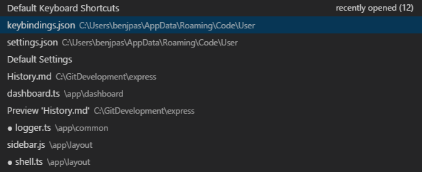
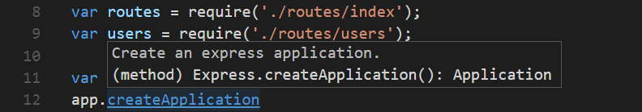

# 코드 네비게이션 {#code-navigation}

Visual Studio Code는 높은 생산성을 자랑하는 코드 편집기로, 프로그래밍 언어 서비스와 결합되면 IDE의 기능과 텍스트 편집기의 속도를 제공합니다. 이 주제에서는 먼저 VS Code의 언어 인텔리전스 기능(제안, 매개변수 힌트, 스마트 코드 네비게이션)을 설명하고, 그 다음으로 핵심 텍스트 편집기의 강력함을 보여줍니다.

## 빠른 파일 네비게이션 {#quick-file-navigation}

:::tip
`kb(workbench.action.quickOpen)` (**Quick Open**)를 입력하면 파일 이름으로 파일을 열 수 있습니다.
:::

탐색기(explorer)는 프로젝트를 네비게이션할 때 파일 간에 이동하는 데 유용합니다. 그러나 작업을 수행할 때는 동일한 파일 집합 간에 빠르게 이동하게 됩니다. VS Code는 사용하기 쉬운 키보드 단축키로 파일 내 및 파일 간에 네비게이션할 수 있는 두 가지 강력한 명령을 제공합니다.

`kbstyle(Ctrl)`을 누른 상태에서 `kbstyle(Tab)`를 눌러 편집기 그룹에서 열려 있는 모든 파일 목록을 확인합니다. 이 파일 중 하나를 열려면, 원하는 파일을 선택하기 위해 다시 `kbstyle(Tab)`를 누르고, `kbstyle(Ctrl)`을 놓아 파일을 엽니다.



또는 `kb(workbench.action.navigateBack)` 및 `kb(workbench.action.navigateForward)`를 사용하여 파일 및 편집 위치 간에 네비게이션할 수 있습니다. 동일한 파일의 서로 다른 줄 간에 이동할 때 이러한 단축키를 사용하면 쉽게 위치를 네비게이션할 수 있습니다.

## 브레드크럼 {#breadcrumbs}

편집기에는 [브레드크럼](https://en.wikipedia.org/wiki/Breadcrumb_(navigation))라고 불리는 네비게이션 바가 콘텐츠 위에 있습니다. 현재 위치를 표시하고 폴더, 파일 및 기호 간에 빠르게 네비게이션할 수 있게 해줍니다.


브레드크럼은 항상 파일 경로를 표시하며, 언어 확장 프로그램을 통해서 커서 위치까지의 기호 경로를 보여줍니다. 표시되는 기호는 개요 보기 및 기호로 이동에서와 동일합니다.

경로에서 브레드크럼를 선택하면 해당 레벨의 형제 항목이 포함된 드롭다운이 표시되어 다른 폴더 및 파일로 빠르게 네비게이션할 수 있습니다.


현재 파일 유형이 기호에 대한 언어 지원을 제공하는 경우, 현재 기호 경로와 같은 레벨 및 하위 기호의 드롭다운이 표시됩니다.


**View** > **Show Breadcrumbs** 토글 또는 `setting(breadcrumbs.enabled)` [설정](/docs/editor/settings.md)을 사용하여 브레드크럼를 끌 수 있습니다.

### 브레드크럼 사용자 정의 {#breadcrumb-customization}

브레드크럼의 모양은 사용자 정의할 수 있습니다. 경로가 매우 길거나 파일 경로 또는 기호 경로 중 하나에만 관심이 있는 경우, `setting(breadcrumbs.filePath)` 및 `setting(breadcrumbs.symbolPath)` 설정을 사용할 수 있습니다. 두 설정 모두 `on`, `off`, 및 `last`를 지원하며, 경로의 어떤 부분을 볼지 정의합니다. 기본적으로 브레드크럼은 브레드크럼 왼쪽에 파일 및 기호 아이콘을 표시하지만, `setting(breadcrumbs.icons)`를 false로 설정하면 아이콘을 제거할 수 있습니다.

### 브레드크럼에서 기호 순서 {#symbol-order-in-breadcrumbs}

브레드크럼 드롭다운에서 기호의 순서를 제어하려면 `setting(breadcrumbs.symbolSortOrder)` 설정을 사용합니다.

허용되는 값은 다음과 같습니다:

* `position` - 파일 내 위치 (기본값)
* `name` - 알파벳 순서
* `type` - 기호 유형 순서

### 브레드크럼 키보드 네비게이션 {#breadcrumb-keyboard-navigation}

브레드크럼와 상호 작용하려면 **Focus Breadcrumbs** 명령을 사용하거나 `kb(breadcrumbs.focusAndSelect)`를 누릅니다. 그러면 마지막 요소가 선택되고 형제 파일이나 기호로 네비게이션할 수 있는 드롭다운이 열립니다. `kb(breadcrumbs.focusPrevious)` 및 `kb(breadcrumbs.focusNext)` 키보드 단축키를 사용하여 현재 요소의 이전 또는 다음 요소로 이동합니다. 드롭다운이 나타나면 입력을 시작하세요. 모든 일치하는 요소가 강조 표시되고 가장 적합한 항목이 빠른 네비게이션을 위해 선택됩니다.

드롭다운 없이도 브레드크럼와 상호 작용할 수 있습니다. `kb(breadcrumbs.focus)`를 눌러 마지막 요소에 포커스를 맞추고, `kb(breadcrumbs.focusPrevious)` 및 `kb(breadcrumbs.focusNext)`를 사용하여 네비게이션하며, `kb(breadcrumbs.revealFocused)`를 사용하여 편집기에서 요소를 표시합니다.

## Go to Definition {#go-to-definition}

[언어](/docs/languages/overview.md)가 이를 지원하는 경우, `kb(editor.action.revealDefinition)`를 눌러 기호의 정의로 이동할 수 있습니다.

`kbstyle(Ctrl)`을 누르고 기호 위에 마우스를 올리면 선언의 미리보기가 나타납니다:



:::tip
`kbstyle(Ctrl+Click)`를 사용하여 정의로 점프하거나 `kbstyle(Ctrl+Alt+Click)`를 사용하여 정의를 옆에 열 수 있습니다.
:::

## 타입 정의로 이동 {#go-to-type-definition}

일부 [언어](/docs/languages/overview.md)는 편집기 컨텍스트 메뉴 또는 **Command Palette**에서 **Go to Type Definition** 명령을 실행하여 기호의 타입 정의로 점프하는 것도 지원합니다. 이는 기호의 타입 정의로 이동합니다. 명령 `editor.action.goToTypeDefinition`은 기본적으로 키보드 단축키에 바인딩되어 있지 않지만, 사용자 정의 [키 바인딩](/docs/editor/keybindings.md)을 추가할 수 있습니다.

## 구현으로 이동 {#go-to-implementation}

[언어](/docs/languages/overview.md) 또한 `kb(editor.action.goToImplementation)`를 눌러 기호의 구현으로 점프하는 것을 지원합니다. 인터페이스의 경우, 해당 인터페이스의 모든 구현자를 보여주고, 추상 메서드의 경우, 해당 메서드의 모든 구체적인 구현을 보여줍니다.

## 심볼로 이동 {#go-to-symbol}

파일 내에서 기호를 네비게이션하려면 `kb(workbench.action.gotoSymbol)`를 사용합니다. `kbstyle(:)`를 입력하면 기호가 카테고리별로 그룹화됩니다. `kbstyle(Up)` 또는 `kbstyle(Down)`을 눌러 원하는 위치로 이동합니다.


## 이름으로 심볼 열기 {#open-symbol-by-name}

일부 언어는 `kb(workbench.action.showAllSymbols)`를 사용하여 파일 간에 기호로 점프하는 것을 지원합니다. 네비게이션하려는 타입의 첫 글자를 입력하고, 해당 타입이 포함된 파일에 관계없이 `kbstyle(Enter)`를 누릅니다.


## 미리 보기 {#peek}

우리는 빠르게 무언가를 확인하고 싶을 때 큰 컨텍스트 전환보다 더 나쁜 것은 없다고 생각합니다. 그래서 우리는 미리 보기 편집기를 지원합니다. **Go to References** 검색(`kb(editor.action.goToReferences)`) 또는 **Peek Definition**(`kb(editor.action.peekDefinition)`)를 실행하면 결과가 인라인으로 삽입됩니다:


미리 보기 편집기에서 서로 다른 참조 간에 이동하고, 그 자리에서 빠르게 편집할 수 있습니다. 미리 보기 편집기 파일 이름을 클릭하거나 결과 목록에서 더블 클릭하면 외부 편집기에서 참조가 열립니다.

:::tip
추가로, 미리 보기 창은 `kbstyle(Escape)`를 누르거나 미리 보기 편집기 영역에서 더블 클릭하면 닫힙니다. 이 동작은 `setting(editor.stablePeek)` [설정](/docs/editor/settings.md)로 비활성화할 수 있습니다.
:::

## 괄호 일치 {#bracket-matching}

커서가 괄호 중 하나에 가까워지면 매핑되는 괄호가 강조 표시됩니다.


:::tip
`kb(editor.action.jumpToBracket)`를 사용하여 매핑되는 괄호로 점프할 수 있습니다.
:::

### 괄호 쌍 색상화 {#bracket-pair-colorization}

매핑되는 괄호 쌍은 `setting(editor.bracketPairColorization.enabled)`를 `true`로 설정하여 색상화할 수 있습니다.


모든 색상은 테마에 따라 조정 가능하며 최대 여섯 가지 색상을 구성할 수 있습니다.

`setting(workbench.colorCustomizations)`를 사용하여 설정에서 이러한 테마 색상을 재정의할 수 있습니다:

```json
"workbench.colorCustomizations": {
    "editorBracketHighlight.foreground1": "#FFD700",
    "editorBracketHighlight.foreground2": "#DA70D6",
    "editorBracketHighlight.foreground3": "#179fff",
},
```

## 참조 정보 {#reference-information}

C#과 같은 일부 언어는 실시간으로 업데이트되는 인라인 참조 정보를 지원합니다. 이를 통해 편집의 영향이나 프로젝트 전반에 걸쳐 특정 메서드나 속성이 얼마나 자주 사용되는지를 빠르게 분석할 수 있습니다:


:::tip
이러한 주석을 클릭하여 **Peek References** 작업을 직접 호출할 수 있습니다.
:::

:::tip
CodeLens에 표시되는 참조 정보는 `setting(editor.codeLens)` [설정](/docs/editor/settings.md)을 통해 켜거나 끌 수 있습니다.
:::

## 기호 이름 바꾸기 {#rename-symbol}

일부 언어는 파일 간에 기호 이름 바꾸기를 지원합니다. `kb(editor.action.rename)`를 누른 후 새로 원하는 이름을 입력하고 `kbstyle(Enter)`를 누릅니다. 기호의 모든 사용이 파일 간에 이름이 변경됩니다.


## 오류 및 경고 {#errors-warnings}

경고 또는 오류는 [설정된 작업](/docs/editor/tasks.md), 풍부한 언어 서비스 또는 코드 분석을 지속적으로 수행하는 린터를 통해 생성될 수 있습니다. 우리는 버그 없는 코드를 사랑하기 때문에, 경고 및 오류는 여러 곳에 표시됩니다:

* 상태 표시줄에는 모든 오류 및 경고의 요약이 있습니다.
* 요약을 클릭하거나 `kb(workbench.actions.view.problems)`를 눌러 현재 오류 목록이 포함된 **PROBLEMS** 패널을 표시할 수 있습니다.
* 오류나 경고가 있는 파일을 열면 텍스트와 개요 눈금자에 인라인으로 렌더링됩니다.


:::tip
현재 파일에서 오류나 경고를 순환하려면 `kb(editor.action.marker.next)` 또는 `kb(editor.action.marker.prev)`를 눌러 문제와 가능한 코드 작업(사용 가능한 경우)에 대한 세부 정보를 표시하는 인라인 영역을 보여줄 수 있습니다:
:::


## 코드 작업 {#code-action}

경고 및 오류는 문제를 해결하는 데 도움이 되는 코드 작업(빠른 수정이라고도 함)을 제공할 수 있습니다. 이는 편집기의 왼쪽 여백에 전구로 표시됩니다. 전구를 클릭하면 코드 작업 옵션이 표시되거나 작업이 수행됩니다.

## 인레이 힌트 {#inlay-hints}

일부 언어는 인레이 힌트를 제공합니다. 이는 소스 코드에 대한 추가 정보로 인라인으로 렌더링됩니다. 이는 일반적으로 추론된 타입을 표시하는 데 사용됩니다. 아래 샘플은 JavaScript 변수 및 함수 반환 타입의 추론된 타입을 표시하는 인레이 힌트를 보여줍니다.


인레이 힌트는 `setting(editor.inlayHints.enabled)` 설정으로 켜거나 끌 수 있으며, 기본값은 켜져 있습니다. TypeScript 또는 Rust와 같은 확장이 실제 인레이 힌트 정보를 제공해야 합니다.

## 외부 링크 보호 {#outgoing-link-protection}

귀하의 보호를 위해, VS Code는 편집기에서 외부 웹사이트 링크를 열기 전에 프롬프트를 표시합니다.


브라우저에서 외부 웹사이트로 진행하거나 링크를 복사하거나 요청을 취소할 수 있는 옵션이 있습니다. **Configure Trusted Domains**을 선택하면 드롭다운에서 정확한 URL을 신뢰하거나 URL 도메인 및 하위 도메인을 신뢰하거나 모든 도메인을 신뢰하여 외부 링크 보호를 비활성화할 수 있습니다.


**Manage Trusted Domains** 옵션은 명령 팔레트에서 언제든지 사용할 수 있으며, 신뢰할 수 있는 도메인을 추가, 제거 또는 수정할 수 있는 **Trusted Domains** JSON 파일을 엽니다.

```jsonc
// "신뢰할 수 있는 도메인 관리" 명령을 사용하여 이 파일을 열 수 있습니다.
// 이 파일을 저장하여 신뢰할 수 있는 도메인 규칙을 적용합니다.
[
  "*.twitter.com"
]
```

**Trusted Domains** JSON 파일에는 지원되는 도메인 형식의 예와 기본적으로 신뢰할 수 있는 도메인 목록(예: `https://*.visualstudio.com` 및 `https://*.microsoft.com`)이 포함된 주석도 있습니다.

## 다음 단계 {#next-steps}

편집기가 어떻게 작동하는지 알았으니, 이제 몇 가지 다른 작업을 시도해 볼 시간입니다.

* [소개 비디오 - 코드 편집](/docs/introvideos/codeediting.md) - 코드 편집 기능에 대한 소개 비디오를 시청하세요.
* [사용자 인터페이스](/docs/getstarted/userinterface.md) - VS Code에 대한 기본적인 안내를 놓쳤다면 여기를 확인하세요.
* [키 바인딩](/docs/editor/keybindings.md) - 키보드 단축키를 선호에 맞게 수정하는 방법을 배우세요.
* [디버깅](/docs/editor/debugging.md) - 여기서 VS Code의 진가를 발휘합니다.

## 자주 묻는 질문 {#common-questions}

### 어떻게 하면 빠른 열기에서 첫 번째 항목 대신 두 번째 항목을 자동으로 선택할 수 있나요? {#how-can-i-automatically-select-the-second-entry-in-quick-open-instead-of-the-first}

`workbench.action.quickOpenPreviousEditor` 명령을 사용하면 빠른 열기에서 두 번째 항목이 자동으로 선택됩니다. 이는 다른 키보드 단축키를 호출하지 않고 목록에서 이전 항목을 선택하려는 경우 유용할 수 있습니다:

```json
[
    {
        "key": "ctrl+p",
        "command": "workbench.action.quickOpenPreviousEditor"
    },
    {
        "key": "ctrl+p",
        "command": "-workbench.action.quickOpen"
    }
]
```

### Ctrl+Tab을 구성하여 모든 그룹의 모든 편집기를 네비게이션하려면 어떻게 해야 하나요? {#how-can-i-configure-ctrltab-to-navigate-across-all-editors-of-all-groups}

기본적으로 `kbstyle(Ctrl+Tab)`은 동일한 편집기 그룹의 편집기 간에 네비게이션합니다. 모든 그룹의 모든 열린 편집기 간에 네비게이션하려면 `workbench.action.quickOpenPreviousRecentlyUsedEditor` 및 `workbench.action.quickOpenLeastRecentlyUsedEditor` 명령에 대한 키보드 단축키를 생성할 수 있습니다:

```json
[
    {
        "key": "ctrl+tab",
        "command": "workbench.action.quickOpenPreviousRecentlyUsedEditor",
        "when": "!inEditorsPicker"
    },
    {
        "key": "ctrl+shift+tab",
        "command": "workbench.action.quickOpenLeastRecentlyUsedEditor",
        "when": "!inEditorsPicker"
    }
]
```

### 선택기 없이 최근 사용한 편집기 간에 어떻게 네비게이션할 수 있나요? {#how-can-i-navigate-between-recently-used-editors-without-a-picker}

선택기를 열지 않고 편집기에서 네비게이션하는 데 사용할 수 있는 명령 목록은 다음과 같습니다:

키|명령|명령 ID
---|-------|----------
`kb(workbench.action.openNextRecentlyUsedEditor)`|다음 최근 사용한 편집기 열기|`workbench.action.openNextRecentlyUsedEditor`
`kb(workbench.action.openPreviousRecentlyUsedEditor)`|이전 사용한 편집기 열기|`workbench.action.openPreviousRecentlyUsedEditor`
`kb(workbench.action.openNextRecentlyUsedEditorInGroup)`|그룹 내에서 다음 최근 사용한 편집기 열기|`workbench.action.openNextRecentlyUsedEditorInGroup`
`kb(workbench.action.openPreviousRecentlyUsedEditorInGroup)`|그룹 내에서 이전 사용한 편집기 열기|`workbench.action.openPreviousRecentlyUsedEditorInGroup`
