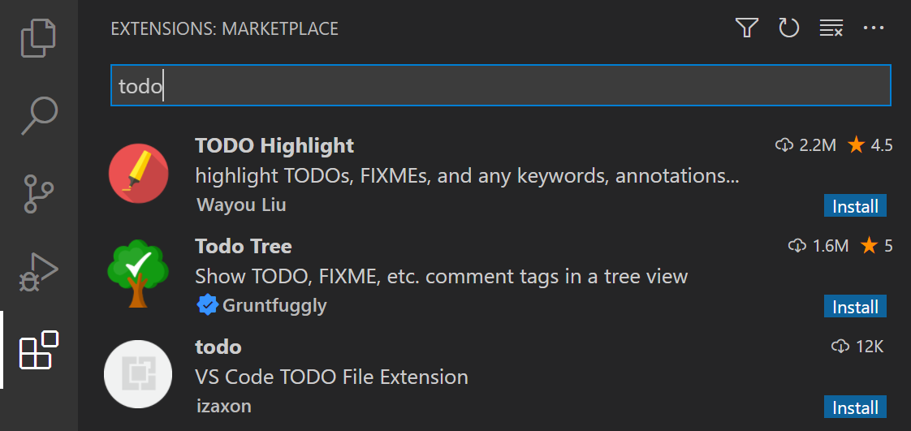
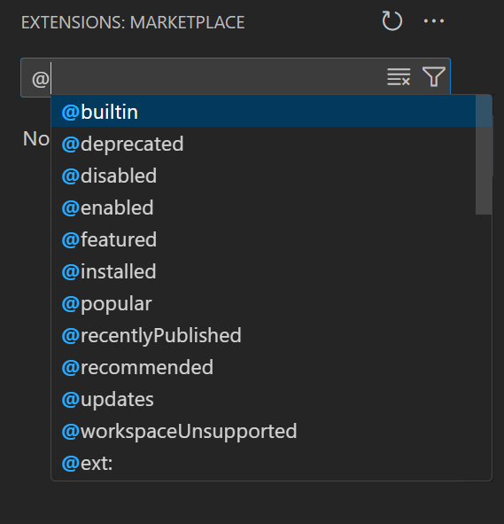
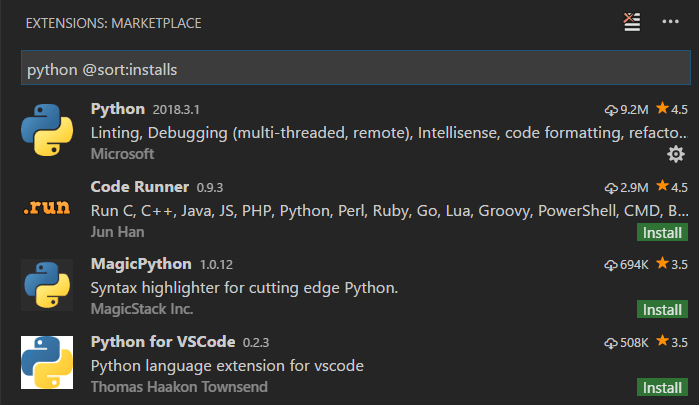
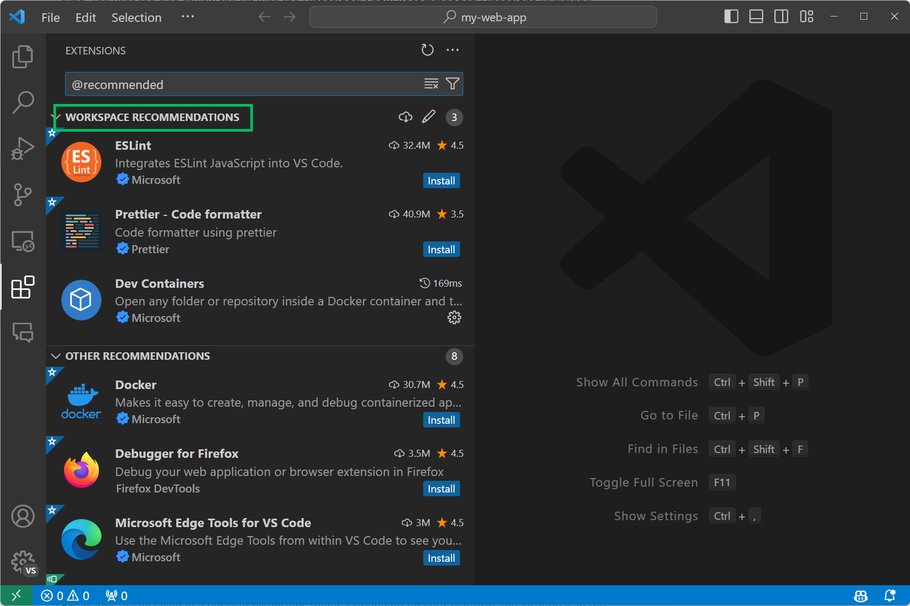

# 확장 마켓플레이스 {#extension-marketplace}

Visual Studio Code에 기본적으로 포함된 기능은 시작에 불과합니다. VS Code 확장을 통해 언어, 디버거 및 도구를 설치하여 개발 작업을 지원할 수 있습니다. VS Code의 풍부한 확장 프로그램 환경은 확장 프로그램 개발자가 VS Code UI에 직접 연결하고 VS Code에서 사용하는 동일한 API를 통해 기능을 기여할 수 있도록 합니다. 이 문서에서는 [Visual Studio Code Marketplace](https://marketplace.visualstudio.com/VSCode)에서 VS Code 확장을 찾고, 설치하고, 관리하는 방법을 설명합니다.

## 확장 검색 {#browse-for-extensions}

VS Code 내에서 확장을 검색하고 설치할 수 있습니다. VS Code의 **Activity Bar**에서 확장 아이콘을 클릭하거나 **View: Extensions** 명령(`kb(workbench.view.extensions)`)을 사용하여 확장 보기를 열 수 있습니다.


이렇게 하면 [VS Code Marketplace](https://marketplace.visualstudio.com/VSCode)에서 가장 인기 있는 VS Code 확장 프로그램 목록이 표시됩니다.


목록에는 간단한 설명, 게시자, 다운로드 수 및 별 5개를 만점으로 하는 평가가 포함되어 있습니다. 확장 프로그램을 선택하면 확장 프로그램 세부 페이지가 표시되어 더 많은 정보를 확인할 수 있습니다.

:::note
컴퓨터의 인터넷 접근이 프록시 서버를 통해 이루어지는 경우, 프록시 서버를 구성해야 합니다. 자세한 내용은 [프록시 서버 지원](/docs/setup/network.md#proxy-server-support)을 참조하세요.
:::

## 확장 프로그램 설치 {#install-an-extension}

확장을 설치하려면 **Install** 버튼을 선택합니다. 설치가 완료되면 **Install** 버튼이 **Manage** 톱니 바퀴 버튼으로 변경됩니다.

:::important
> 확장 프로그램은 VS Code 자체와 동일한 권한을 가집니다. VS Code 버전 1.97부터 타사 게시자로부터 확장 프로그램을 처음 설치할 때, VS Code는 확장 프로그램의 게시자를 신뢰하는지 확인하는 대화 상자를 표시합니다. [확장 프로그램 런타임 보안](/docs/editor/extension-runtime-security.md) 및 악성 확장 프로그램에서 자신을 보호하는 방법에 대한 자세한 정보를 확인하세요.
:::

특정 버전의 확장을 설치하려면 확장을 마우스 오른쪽 버튼으로 클릭하고 **Install Another Version**를 선택합니다. 그러면 사용 가능한 목록에서 버전을 선택할 수 있습니다.

[설정 동기화](/docs/editor/settings-sync.md)가 활성화된 경우, 확장과 같은 VS Code 구성을 여러 기기에서 공유할 수 있습니다. 확장을 설치하고 기기 간에 동기화하지 않으려면 확장을 마우스 오른쪽 버튼으로 클릭하고 **Install (Do not Sync)**을 선택합니다.

### 확장 프로그램 찾기 및 설치 {#find-and-install-an-extension}

예를 들어, 인기 있는 [TODO Highlight](https://marketplace.visualstudio.com/items?itemName=wayou.vscode-todo-highlight) 확장 프로그램을 설치해 보겠습니다. 이 확장 프로그램은 소스 코드에서 'TODO:' 및 'FIXME:'와 같은 텍스트를 강조 표시하여 완료되지 않은 섹션을 빠르게 찾을 수 있도록 합니다.


확장 프로그램 보기(`kb(workbench.view.extensions)`)에서 검색 상자에 'todo'를 입력하여 제목이나 메타데이터에 'todo'가 포함된 확장 프로그램으로 마켓플레이스 제공 항목을 필터링합니다. 목록에서 **TODO Highlight** 확장 프로그램을 확인할 수 있습니다.



확장 프로그램은 게시자 및 확장 프로그램 ID로 고유하게 식별됩니다. **TODO Highlight** 확장 프로그램을 선택하면 확장 프로그램 세부 정보 페이지가 표시되며, 여기에서 확장 프로그램 ID인 `wayou.vscode-todo-highlight`를 찾을 수 있습니다. 확장 프로그램 ID를 아는 것은 비슷한 이름의 확장 프로그램이 여러 개 있을 경우 유용할 수 있습니다.


**Install** 버튼을 선택하면 VS Code가 마켓플레이스에서 확장 프로그램을 다운로드하고 설치합니다. 설치가 완료되면 **Install** 버튼이 **Manage** 톱니 바퀴 버튼으로 바뀝니다.


TODO Highlight 확장 프로그램을 사용해 보려면 아무 소스 코드 파일을 열고 'TODO:'라는 텍스트를 추가하면 텍스트가 강조 표시되는 것을 볼 수 있습니다.

TODO Highlight 확장 프로그램은 **TODO-Highlight: List highlighted annotations** 및 ***TODO-Highlight: Toggle highlight** 명령을 제공하며, 이 명령은 명령 팔레트(`kb(workbench.action.showCommands)`)에서 찾을 수 있습니다. **TODO-Highlight: Toggle highlight** 명령을 사용하면 강조 표시를 빠르게 비활성화하거나 활성화할 수 있습니다.


이 확장 프로그램은 동작 조정을 위한 설정도 제공하며, 이 설정은 설정 편집기(`kb(workbench.action.openSettings)`)에서 찾을 수 있습니다. 예를 들어, 텍스트 검색을 대소문자 구분 없이 하려면 **Todohighlight: Is Case Sensitive** 설정의 선택을 해제할 수 있습니다.


원하는 기능을 제공하지 않는 확장 프로그램은 **Manage** 버튼의 컨텍스트 메뉴에서 **Uninstall**를 선택하여 언제든지 제거할 수 있습니다.


이것은 확장 프로그램을 설치하고 사용하는 방법의 한 가지 사례에 불과합니다. VS Code 마켓플레이스에는 수백 개의 프로그래밍 언어와 작업을 지원하는 수천 개의 확장 프로그램이 있습니다. [Java](https://marketplace.visualstudio.com/items?itemName=redhat.java), [Python](https://marketplace.visualstudio.com/items?itemName=ms-python.python), [Go](https://marketplace.visualstudio.com/items?itemName=golang.Go), [C++](https://marketplace.visualstudio.com/items?itemName=ms-vscode.cpptools)와 같은 완전한 언어 지원부터 [GUID 생성](https://marketplace.visualstudio.com/items?itemName=nwallace.createGUID), [색상 테마 변경](https://marketplace.visualstudio.com/items?itemName=PKief.material-icon-theme), 또는 편집기에 [가상 애완동물 추가](https://marketplace.visualstudio.com/items?itemName=tonybaloney.vscode-pets)와 같은 간단한 확장 프로그램까지 다양합니다.

### 확장 프로그램 세부 정보 {#extension-details}

확장 프로그램 세부 정보 페이지에서는 확장 프로그램의 README를 읽고 확장 프로그램의 다음 내용을 검토할 수 있습니다:

* **기능 기여** - 설정, 명령 및 키보드 단축키, 언어 문법, 디버거 등 VS Code에 추가된 확장 프로그램 기능.
* **변경 로그** - 사용 가능한 경우 확장 프로그램 리포지토리의 CHANGELOG.
* **종속성** - 확장 프로그램이 다른 확장 프로그램에 의존하는지 여부.


확장 프로그램이 확장 프로그램 팩인 경우, **Extension Pack** 섹션에는 팩을 설치할 때 설치될 확장 프로그램이 표시됩니다. [확장 프로그램 팩](/api/references/extension-manifest.md#extension-packs)은 별도의 확장 프로그램을 함께 묶어 한 번에 쉽게 설치할 수 있도록 합니다.


### 확장 프로그램 보기 필터 및 명령 {#extensions-view-filter-and-commands}

**Filter Extensions** 컨텍스트 메뉴를 사용하여 확장 프로그램 보기를 필터링할 수 있습니다.


다음과 같은 필터가 있습니다:

* 업데이트할 수 있는 오래된 확장 프로그램 목록
* 현재 활성화/비활성화된 확장 프로그램 목록
* 작업 공간에 따라 추천된 확장 프로그램 목록
* 전 세계적으로 인기 있는 확장 프로그램 목록

확장 프로그램 목록은 **설치 Install Coun**, ***Rating**, **Name**, **Published Date** 또는 **Updated Date**에 따라 오름차순 또는 내림차순으로 정렬할 수 있습니다. 확장 프로그램 검색 필터에 대한 자세한 내용은 [아래](#extensions-view-filters)를 참조하세요.

`...`  **View and More Actions** 버튼을 통해 추가 확장 프로그램 보기 명령을 실행할 수 있습니다.


이 컨텍스트 메뉴를 통해 확장 프로그램 업데이트를 관리하고, 모든 확장 프로그램을 활성화 또는 비활성화하며, 문제 있는 확장 프로그램 동작을 격리하기 위해 [Extension Bisect](https://code.visualstudio.com/blogs/2021/02/16/extension-bisect) 유틸리티를 사용할 수 있습니다.

### 확장 프로그램 검색 {#search-for-an-extension}

확장 프로그램 보기 상단의 검색 상자를 지우고 찾고 있는 확장 프로그램, 도구 또는 프로그래밍 언어의 이름을 입력할 수 있습니다.

예를 들어, 'python'을 입력하면 Python 언어 확장 프로그램 목록이 표시됩니다:


찾고 있는 확장 프로그램의 정확한 식별자를 알고 있다면 `@id:` 접두사를 사용할 수 있습니다. 예를 들어 `@id:vue.volar`와 같이 사용할 수 있습니다. 또한 결과를 필터링하거나 정렬하려면 아래에 자세히 설명된 [필터](#extensions-view-filters) 및 [정렬](#sorting) 명령을 사용할 수 있습니다.

### 사전 릴리스 확장 프로그램 버전 설치 {#install-a-pre-release-extension-version}

확장 프로그램 게시자가 확장 프로그램의 사전 릴리스 버전을 제공할 수 있습니다. 사전 릴리스 버전을 설치하려면 **Install** 버튼의 드롭다운을 선택하고 **Install Pre-Release Version**를 선택합니다.


## 확장 프로그램 관리 {#manage-extensions}

VS Code는 확장 프로그램을 쉽게 관리할 수 있도록 합니다. 확장 프로그램 보기를 통해 확장 프로그램을 설치, 비활성화, 업데이트 및 제거할 수 있으며 Command Palette**(명령은 **Extensions:** 접두사가 붙습니다) 또는 CLI 스위치를 사용할 수 있습니다.

### 설치된 확장 프로그램 목록 {#list-installed-extensions}

기본적으로 확장 프로그램 보기에는 현재 설치된 확장 프로그램과 추천된 모든 확장 프로그램이 표시됩니다. **Command Palette**(`kb(workbench.action.showCommands)`) 또는 **More Actions**(`...`) 드롭다운 메뉴 > **Views** > **Installed**에서 **Extensions: Focus on Installed View** 명령을 사용하여 검색 상자의 텍스트를 지우고 설치된 모든 확장 프로그램 목록을 표시할 수 있습니다. 이 목록에는 비활성화된 확장 프로그램도 포함됩니다.

### 확장 프로그램 제거 {#uninstall-an-extension}

확장 프로그램을 제거하려면 확장 프로그램 항목 오른쪽의 **Manage** 톱니 바퀴 버튼을 선택한 다음 드롭다운 메뉴에서 **Uninstall**를 선택합니다. 이렇게 하면 확장 프로그램이 제거되고 확장 프로그램 호스트를 다시 시작하라는 메시지가 표시됩니다 (**Restart Extensions**).


### 확장 프로그램 비활성화 {#disable-an-extension}

확장 프로그램을 영구적으로 제거하고 싶지 않은 경우, 확장 프로그램 항목 오른쪽의 톱니 바퀴 버튼을 클릭하여 확장 프로그램을 임시로 비활성화할 수 있습니다. 확장 프로그램을 전역적으로 비활성화하거나 현재 작업 공간에 대해서만 비활성화할 수 있습니다. 확장 프로그램을 비활성화한 후에는 확장 프로그램 호스트를 다시 시작하라는 메시지가 표시됩니다 (**Restart Extensions**).

설치된 모든 확장 프로그램을 빠르게 비활성화하려면 **Command Palette** 및 **More Actions**(`...`) 드롭다운 메뉴에 **Disable All Installed Extensions** 명령이 있습니다.

확장 프로그램은 다시 활성화할 때까지 모든 VS Code 세션에서 비활성화된 상태로 유지됩니다.

### 확장 프로그램 활성화 {#enable-an-extension}

유사하게 비활성화된 확장 프로그램(목록의 **Disabled** 섹션에 있으며 ***Disabled***으로 표시됨)을 다시 활성화하려면 드롭다운 메뉴에서 **Enable** 또는 **Enable (Workspace)** 명령을 사용할 수 있습니다.


**More Actions**(`...`) 드롭다운 메뉴에도 **Enable All Extensions** 명령이 있습니다.

### 확장 프로그램 자동 업데이트 {#extension-auto-update}

VS Code는 확장 프로그램 업데이트를 확인하고 자동으로 설치합니다. 업데이트 후에는 확장 프로그램 호스트를 다시 시작하라는 메시지가 표시됩니다 (**Restart Extensions**).

수동으로 확장 프로그램을 업데이트하려면 **Disable Auto Update for All Extensions** 명령 또는 확장 프로그램 보기의 해당 작업을 사용하여 자동 업데이트를 비활성화할 수 있습니다. 또한 `setting(extensions.autoUpdate)` [설정](/docs/editor/settings.md)을 구성할 수 있습니다. **Enable Auto Update for All Extensions** 명령을 사용하여 자동 업데이트를 다시 활성화할 수 있습니다.


개별 확장 프로그램에 대해 자동 업데이트를 구성하려면 확장 프로그램을 마우스 오른쪽 버튼으로 클릭하고 **Auto Update** 항목을 전환할 수 있습니다.

VS Code가 업데이트를 확인하지 않도록 하려면 `setting(extensions.autoCheckUpdates)` 설정을 false로 설정할 수 있습니다.

### 확장 프로그램 수동 업데이트 {#update-an-extension-manually}

자동 업데이트가 비활성화된 경우, **Show Outdated Extensions** 명령을 사용하여 확장 프로그램 업데이트를 빠르게 확인할 수 있습니다. 이 명령은 `@updates` 필터를 사용합니다. 현재 설치된 확장 프로그램에 대한 사용 가능한 업데이트를 표시합니다.

오래된 확장 프로그램에 대해 **Update** 버튼을 선택합니다. 업데이트가 설치되며 확장 프로그램 호스트를 다시 시작하라는 메시지가 표시됩니다 (**Restart Extensions**). 또한 **Update All Extensions** 명령을 사용하여 한 번에 모든 오래된 확장 프로그램을 업데이트할 수 있습니다.

자동 업데이트 확인이 비활성화된 경우, **Check for Extension Updates** 명령을 사용하여 업데이트할 수 있는 확장 프로그램을 확인할 수 있습니다.

## 추천 확장 프로그램 {#recommended-extensions}

**Show Recommended Extensions**를 사용하여 추천 확장 프로그램 목록을 볼 수 있으며, 이 명령은 `@recommended` [필터](#extensions-view-filters)를 설정합니다. 확장 프로그램 추천은 다음과 같이 나눌 수 있습니다:

* **작업 공간 추천** - 현재 작업 공간의 다른 사용자에 의해 추천된 확장 프로그램.
* **기타 추천** - 최근에 열린 파일을 기반으로 추천된 확장 프로그램.

다른 사용자를 위해 추천에 [기여](#workspace-recommended-extensions)하는 방법에 대한 내용은 아래 섹션을 참조하세요.

### 추천 무시하기 {#ignoring-recommendations}

추천을 무시하려면 확장 프로그램 항목을 선택하여 세부 정보 페이지를 열고 **Manage** 톱니 바퀴 버튼을 선택하여 컨텍스트 메뉴를 표시합니다. **Ignore Recommendation** 메뉴 항목을 선택합니다. 무시된 추천은 더 이상 추천되지 않습니다.


## 확장 프로그램 구성 {#configuring-extensions}

VS Code 확장 프로그램은 매우 다양한 구성 및 요구 사항을 가질 수 있습니다. 일부 확장 프로그램은 VS Code에 [설정](/docs/editor/settings.md)을 기여하며, 이는 설정 편집기에서 수정할 수 있습니다. 다른 확장 프로그램은 자체 구성 파일을 가질 수 있습니다. 확장 프로그램은 컴파일러, 디버거 및 CLI 도구와 같은 추가 구성 요소의 설치 및 설정을 요구할 수도 있습니다. 확장 프로그램의 README(확장 프로그램 보기 세부 정보 페이지에서 볼 수 있음)를 참조하거나 [VS Code Marketplace](https://marketplace.visualstudio.com/VSCode)에서 확장 프로그램 페이지로 이동하세요(세부 정보 페이지에서 확장 프로그램 이름을 클릭). 많은 확장 프로그램이 오픈 소스이며 마켓플레이스 페이지에 리포지토리 링크가 있습니다.

## CLI 확장 프로그램 관리 {#command-line-extension-management}

VS Code를 자동화하고 구성하기 쉽게 하려면 [CLI](/docs/editor/command-line.md)에서 확장 프로그램을 나열, 설치 및 제거할 수 있습니다. 확장 프로그램을 식별할 때는 `publisher.extension` 형식의 전체 이름을 제공해야 합니다. 예를 들어 `ms-python.python`과 같이 입력합니다.

예시:

```bash
code --extensions-dir <dir>
    확장 프로그램의 루트 경로를 설정합니다.
code --list-extensions
    설치된 확장 프로그램을 나열합니다.
code --show-versions
    --list-extension을 사용할 때 설치된 확장 프로그램의 버전을 표시합니다.
code --install-extension (<extension-id> | <extension-vsix-path>)
    확장 프로그램을 설치합니다.
code --uninstall-extension (<extension-id> | <extension-vsix-path>)
    확장 프로그램을 제거합니다.
code --enable-proposed-api (<extension-id>)
    확장 프로그램을 위한 제안된 API 기능을 활성화합니다. 개별적으로 활성화할 확장 프로그램 ID를 하나 이상 받을 수 있습니다.
```

확장 프로그램 세부 정보 페이지에서 마켓플레이스 정보를 확인하여 확장 프로그램 ID를 확인할 수 있습니다.


## 확장 프로그램 보기 필터 {#extensions-view-filters}

확장 프로그램 보기 검색 상자는 확장 프로그램을 찾고 관리하는 데 도움이 되는 필터를 지원합니다. **Show Installed Extensions** 및 **Show Recommended Extensions** 명령을 사용한 경우 `@installed` 및 `@recommended`와 같은 필터를 보았을 것입니다. 또한 인기 또는 평점으로 정렬하고 카테고리(예: 'Linters') 및 태그(예: 'node')로 검색할 수 있는 필터가 있습니다. 확장 프로그램 검색 상자에 `@`를 입력하고 제안 목록을 탐색하여 모든 필터 및 정렬 명령의 전체 목록을 확인할 수 있습니다:



다음은 일부 확장 프로그램 보기 필터입니다:

* `@builtin` - VS Code와 함께 제공되는 확장 프로그램을 표시합니다. 유형별로 그룹화(프로그래밍 언어, 테마 등).
* `@deprecated` - 더 이상 지원되지 않는 확장 프로그램을 표시합니다.
* `@disabled` - 비활성화된 설치된 확장 프로그램을 표시합니다.
* `@enabled` - 활성화된 설치된 확장 프로그램을 표시합니다. 확장 프로그램은 개별적으로 활성화/비활성화할 수 있습니다.
* `@featured` - 추천된 확장 프로그램을 표시합니다.
* `@installed` - 설치된 확장 프로그램을 표시합니다.
* `@popular` - 인기 있는 확장 프로그램을 표시합니다.
* `@recentlyPublished` - 마켓플레이스에 최근에 게시된 확장 프로그램을 표시합니다.
* `@recommended` - 추천된 확장 프로그램을 표시합니다. 작업 공간 특정 또는 일반 사용으로 그룹화됩니다.
* `@updates` - 오래된 설치된 확장 프로그램을 표시합니다. 마켓플레이스에서 더 최신 버전이 제공됩니다.
* `@workspaceUnsupported` - 이 작업 공간에서 지원되지 않는 확장 프로그램을 표시합니다.
* `@category` - 지정된 카테고리에 속하는 확장 프로그램을 표시합니다. 아래는 지원되는 카테고리 몇 가지입니다. 전체 목록을 보려면 `@category`를 입력하고 제안 목록의 옵션을 따르세요:
  * `@category:themes`
  * `@category:formatters`
  * `@category:linters`
  * `@category:snippets`

이 필터는 조합하여 사용할 수도 있습니다. 예를 들어, `@installed @category:themes`를 사용하여 설치된 모든 테마를 볼 수 있습니다.

필터가 제공되지 않으면 확장 프로그램 보기는 현재 설치된 확장 프로그램과 추천된 확장 프로그램을 표시합니다.

### 정렬 {#sorting}

`@sort` 필터를 사용하여 확장 프로그램을 정렬할 수 있으며, 다음 값을 사용할 수 있습니다:

* `installs` - 마켓플레이스 설치 수에 따라 내림차순으로 정렬합니다.
* `name` - 확장 프로그램 이름에 따라 알파벳순으로 정렬합니다.
* `publishedDate` - 확장 프로그램 게시 날짜에 따라 정렬합니다.
* `rating` - 마켓플레이스 평점(1-5 별)에 따라 내림차순으로 정렬합니다.
* `updateDate` - 확장 프로그램 마지막 업데이트 날짜에 따라 정렬합니다.



### 카테고리 및 태그 {#categories-and-tags}

확장 프로그램은 기능을 설명하는 **Categories** 및 **Tags**를 설정할 수 있습니다.


`category:` 및 `tag:`를 사용하여 카테고리 및 태그로 필터링할 수 있습니다.

지원되는 카테고리는: `[Azure, Data Science, Debuggers, Education, Extension Packs, Formatters, Keymaps, Language Packs, Linters, Machine Learning, Notebooks, Others, Programming Languages, SCM Providers, Snippets, Testing, Themes, Visualization]`입니다. 이들은 확장 프로그램 검색 상자에서 IntelliSense를 통해 접근할 수 있습니다:


카테고리 이름이 두 단어 이상인 경우에는 따옴표로 묶어야 합니다(예: `category:"SCM Providers"`).

태그는 어떤 문자열도 포함할 수 있으며 IntelliSense에서 제공되지 않으므로 유용한 태그를 찾으려면 마켓플레이스를 검토하세요.

## VSIX에서 설치 {#install-from-a-vsix}

`.vsix` 파일로 패키징된 VS Code 확장 프로그램을 수동으로 설치할 수 있습니다. 확장 프로그램 보기 명령 드롭다운에서 **Install from VSIX** 명령을 사용하거나 **Command Palette**에서 **Extensions: Install from VSIX** 명령을 사용하여 `.vsix` 파일을 지정합니다.

또한 VS Code `--install-extension` CLI 스위치를 사용하여 `.vsix` 파일의 경로를 제공하여 설치할 수 있습니다.

```bash
code --install-extension myextension.vsix
```

CLI에서 여러 확장 프로그램을 한 번에 설치하려면 `--install-extension`을 여러 번 제공할 수 있습니다.

:::note
VSIX를 통해 확장 프로그램을 설치할 때 해당 확장 프로그램의 [자동 업데이트](#extension-auto-update)는 기본적으로 비활성화됩니다.
:::

확장 프로그램을 패키징하고 게시하는 방법에 대해 더 알고 싶다면 [확장 프로그램 게시](/api/working-with-extensions/publishing-extension.md) 문서를 참조하세요.

## 작업 공간 추천 확장 프로그램 {#workspace-recommended-extensions}

좋은 확장 프로그램 세트는 특정 작업 공간이나 프로그래밍 언어로 작업할 때 생산성을 높일 수 있으며, 이 목록을 팀원이나 동료와 공유하고 싶을 것입니다. **Extensions: Configure Recommended Extensions (Workspace Folder)** 명령을 사용하여 작업 공간에 대한 추천 확장 프로그램 목록을 만들 수 있습니다.

단일 폴더 작업 공간에서 이 명령은 작업 공간의 `.vscode` 폴더에 `extensions.json` 파일을 생성하며, 여기에서 확장 프로그램 식별자 목록(\{publisherName\}.\{extensionName\})을 추가할 수 있습니다.

[multi-root workspace](/docs/editor/workspaces/multi-root-workspaces.md)에서는 이 명령이 `.code-workspace` 파일을 열어 `extensions.recommendations` 아래에 확장 프로그램을 나열할 수 있습니다. 다중 루트 작업 공간에서 **Extensions: Configure Recommended Extensions (Workspace Folder)** 명령을 사용하여 개별 폴더에 확장 프로그램 추천을 추가할 수도 있습니다.

예시 `extensions.json`은 다음과 같을 수 있습니다:

```json
{
    "recommendations": [
        "dbaeumer.vscode-eslint",
        "esbenp.prettier-vscode"
    ]
}
```

여기서는 린터 확장 프로그램과 코드 포매터 확장 프로그램을 추천합니다.

확장 프로그램은 게시자 식별자와 확장 프로그램 식별자 `publisher.extension`을 사용하여 식별됩니다. 확장 프로그램 세부 정보 페이지에서 이름을 확인할 수 있습니다. VS Code는 이러한 파일 내에서 설치된 확장 프로그램에 대한 자동 완성을 제공합니다.

.

VS Code는 작업 공간이 처음 열릴 때 추천 확장 프로그램을 설치하라는 메시지를 사용자에게 표시합니다. 사용자는 **Extensions: Show Recommended Extensions** 명령을 사용하여 목록을 검토할 수도 있습니다.



## 다음 단계 {#next-steps}

여기에서 흥미로울 수 있는 몇 가지 주제를 소개합니다.

* [확장 프로그램 API](/api) - VS Code 확장 프로그램 API에 대해 배우기 시작하세요.
* [첫 번째 확장 프로그램](/api/get-started/your-first-extension.md) - 간단한 Hello World 확장 프로그램을 만들어 보세요.
* [마켓플레이스에 게시하기](/api/working-with-extensions/publishing-extension.md) - 자신의 확장 프로그램을 VS Code 마켓플레이스에 게시하세요.

## 자주 묻는 질문 {#common-questions}

### 확장 프로그램은 어디에 설치되나요? {#where-are-extensions-installed}

확장 프로그램은 사용자별 확장 프로그램 폴더에 설치됩니다. 플랫폼에 따라 위치는 다음과 같습니다:

* **Windows** `%USERPROFILE%\.vscode\extensions`
* **macOS** `~/.vscode/extensions`
* **Linux** `~/.vscode/extensions`

`--extensions-dir <dir>` CLI [옵션](/docs/editor/command-line.md)을 사용하여 위치를 변경할 수 있습니다.

### 확장 프로그램을 설치하려고 할 때마다 connect ETIMEDOUT 오류가 발생합니다 {#whenever-i-try-to-install-any-extension-i-get-a-connect-etimedout-error}

이 오류는 컴퓨터가 인터넷에 접근하기 위해 프록시 서버를 통과하는 경우 발생할 수 있습니다. 자세한 내용은 설정 주제의 [프록시 서버 지원](/docs/setup/network.md#proxy-server-support) 섹션을 참조하세요.

### 마켓플레이스에서 확장 프로그램을 직접 다운로드할 수 있나요? {#can-i-download-an-extension-directly-from-the-marketplace}

일부 사용자는 마켓플레이스에서 확장 프로그램을 한 번 다운로드한 후 여러 VS Code 인스턴스에 로컬 공유를 통해 설치하는 것을 선호합니다. 이는 연결 문제나 개발 팀이 고정된 확장 프로그램 세트를 사용하고 싶을 때 유용합니다.

확장 프로그램을 다운로드하려면 확장 프로그램 보기에서 검색하고 결과에서 확장 프로그램을 마우스 오른쪽 버튼으로 클릭한 후 **VSIX 다운로드**를 선택합니다.

:::note
다운로드 옵션은 VS Code 버전 1.96부터 제공되며, 아직 설치되지 않은 확장 프로그램에 대해서만 사용할 수 있습니다.
:::

### VS Code가 확장 프로그램 추천을 제공하지 않도록 할 수 있나요? {#can-i-stop-vs-code-from-providing-extension-recommendations}

예, VS Code가 확장 프로그램 보기에 확장 프로그램 추천을 표시하지 않도록 하려면 다음 설정을 수정할 수 있습니다:

* `setting(extensions.showRecommendationsOnlyOnDemand)` - **추천됨** 섹션을 제거하려면 true로 설정합니다.
* `setting(extensions.ignoreRecommendations)` - 확장 프로그램 추천 알림을 무시하려면 true로 설정합니다.

추천을 보고 싶다면 **추천 확장 프로그램 표시** 명령은 항상 사용할 수 있습니다.

### 마켓플레이스의 확장 프로그램을 신뢰할 수 있나요? {#can-i-trust-extensions-from-the-marketplace}

Visual Studio Marketplace는 악성 확장 프로그램으로부터 보호하기 위해 여러 가지 조치를 취하고 있으며, 확장 프로그램을 설치하기 전에 신뢰할 수 있는지 확인하기 위해 다양한 단계를 수행할 수 있습니다.

VS Code 버전 1.97부터 타사 게시자로부터 확장 프로그램을 처음 설치할 때, VS Code는 확장 프로그램 게시자를 신뢰하는지 확인하는 대화 상자를 표시합니다.

[확장 프로그램 런타임 보안](/docs/editor/extension-runtime-security.md)에 대한 자세한 정보를 확인하세요.

### VS Code에서 확장 프로그램 서명을 확인할 수 없습니다 {#the-extension-signature-cannot-be-verified-by-vs-code}

Visual Studio Marketplace는 게시할 때 모든 확장 프로그램에 서명을 합니다. VS Code는 확장 프로그램을 설치할 때 이 서명을 확인하여 확장 프로그램 패키지의 무결성과 출처를 확인합니다.

확장 프로그램을 설치할 때 다음과 같은 오류 메시지가 표시될 수 있습니다: `Cannot install extension because Visual Studio Code cannot verify the extension signature`.

이 오류는 지원되지 않는 환경이나 패키지 무결성 문제와 같은 다양한 이유로 발생할 수 있습니다. 이 오류가 발생하면 설치하기로 결정하기 전에 주의해야 합니다.

문제를 보고하려면 [Visual Studio Marketplace 팀](mailto:vsmarketplace@microsoft.com?subject=Extension%20Signature%20Verification%20Issue)에 문의하는 것이 좋습니다. 확장 프로그램 ID를 포함해야 합니다. 확장 프로그램 서명 확인을 비활성화하려면 `setting(extensions.verifySignature)` 설정을 사용할 수 있습니다.

### 원격 창에 연결할 때 내 확장 프로그램이 동기화되지 않습니다 {#my-extensions-dont-synchronize-when-connected-to-a-remote-window}

[설정 동기화](/docs/editor/settings-sync.md)를 사용하면 설정, 키보드 단축키 및 설치된 확장 프로그램과 같은 Visual Studio Code 구성을 여러 기기에서 공유할 수 있으므로 항상 좋아하는 설정으로 작업할 수 있습니다.

VS Code는 SSH, 개발 컨테이너(devcontainer) 또는 WSL과 같은 [원격](/docs/remote/remote-overview.md) 창으로 연결할 때 확장 프로그램을 동기화하지 않습니다.

### 내 조직에서 특정 확장 프로그램을 허용하거나 차단할 수 있나요? {#can-i-allow-or-block-specific-extensions-in-my-organization}

조직에서 설치할 수 있는 확장 프로그램을 제어하려면 `extensions.allowed` 애플리케이션 설정을 구성할 수 있습니다. 설정이 구성되지 않은 경우 모든 확장 프로그램이 허용됩니다. 설정이 구성된 경우 나열되지 않은 모든 확장 프로그램은 설치가 차단됩니다.

[허용된 확장 프로그램 구성](/docs/setup/enterprise.md#configure-allowed-extensions)에 대한 자세한 내용을 확인하세요.
